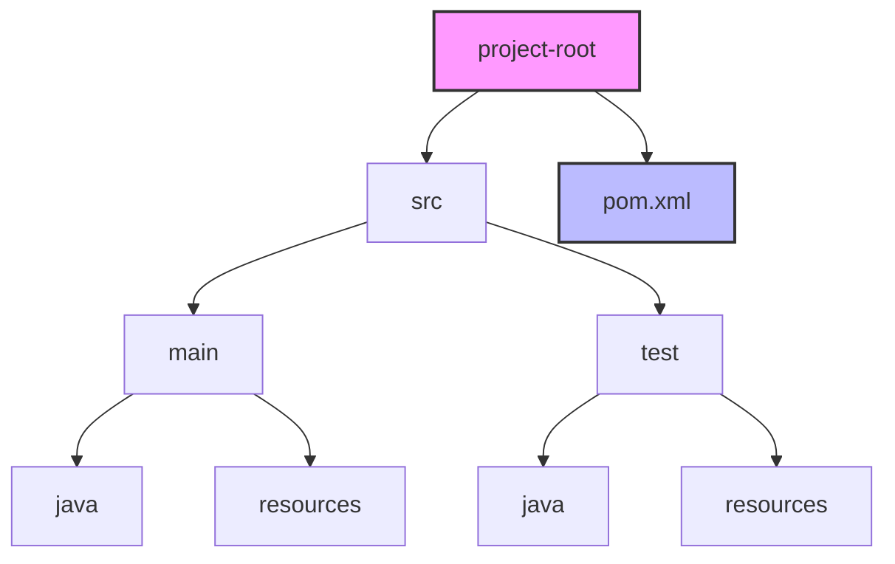
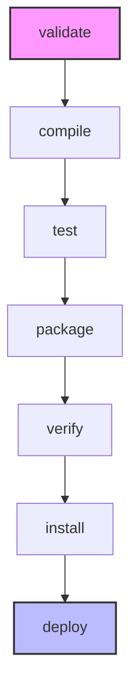
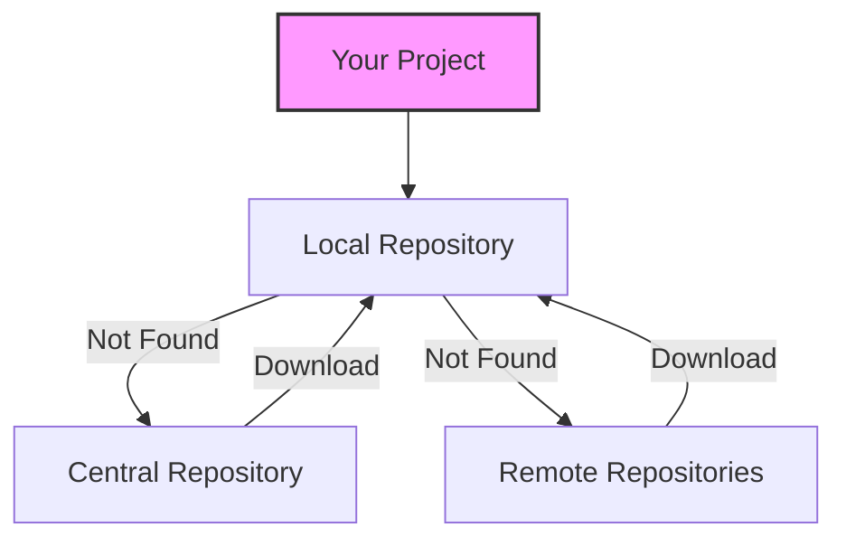
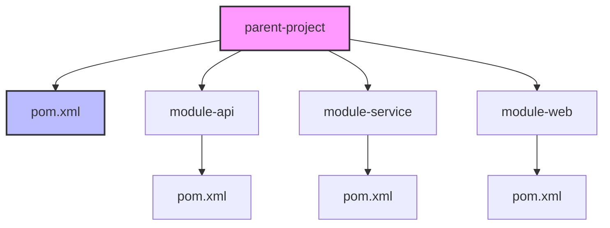

Hey there! So you want to learn about Maven? That's fantastic! Maven is one of those tools that might seem a bit intimidating at first, but once you get the hang of it, you'll wonder how you ever managed Java projects without it. Let's dive in!

## What is Maven, anyway?

Maven is essentially a build automation and dependency management tool primarily used for Java projects. Think of it as your project's personal assistant that helps you:

- Download all the libraries your project needs
- Build your project in the correct order
- Run tests automatically
- Package your application neatly for deployment

## Prerequisites

Before we start, you'll need:

- Java Development Kit (JDK) installed (version 8 or higher)
- Basic command-line knowledge

## Getting Maven Up and Running

### Installation

**For Windows:**

1. Download the latest binary from [Maven's official site](https://maven.apache.org/download.cgi)
2. Extract the ZIP file to a location (e.g., `C:\Program Files\Apache\maven`)
3. Add the `bin` directory to your PATH environment variable
4. Create a new environment variable called `MAVEN_HOME` pointing to your Maven installation

**For Mac (using Homebrew):**

```bash
brew install maven
```

**For Linux:**

```bash
sudo apt update
sudo apt install maven
```

### Verify Installation

Let's check if Maven is properly installed:

```bash
mvn -version
```

You should see something like:

```
Apache Maven 3.9.5
Maven home: /usr/share/maven
Java version: 17.0.7, vendor: Oracle Corporation
...
```

## Maven Project Structure

Maven follows a "convention over configuration" philosophy with a standard directory layout.



The most important file here is `pom.xml` (Project Object Model), which is like Maven's recipe book for your project. It contains all the information Maven needs to build your project.

Here's a simple example of a `pom.xml` file:

```xml
<project xmlns="http://maven.apache.org/POM/4.0.0"
         xmlns:xsi="http://www.w3.org/2001/XMLSchema-instance"
         xsi:schemaLocation="http://maven.apache.org/POM/4.0.0 http://maven.apache.org/xsd/maven-4.0.0.xsd">
    <modelVersion>4.0.0</modelVersion>

    <groupId>com.example</groupId>    <!-- Your organization's domain in reverse -->
    <artifactId>my-app</artifactId>   <!-- Your project's name -->
    <version>1.0-SNAPSHOT</version>   <!-- Your project's version -->

    <properties>
        <maven.compiler.source>11</maven.compiler.source>
        <maven.compiler.target>11</maven.compiler.target>
        <project.build.sourceEncoding>UTF-8</project.build.sourceEncoding>
    </properties>

    <dependencies>
        <!-- JUnit for testing -->
        <dependency>
            <groupId>junit</groupId>
            <artifactId>junit</artifactId>
            <version>4.13.2</version>
            <scope>test</scope>
        </dependency>
    </dependencies>
</project>
```

## Creating Your First Maven Project

Let's create a simple HelloWorld project:

```bash
mvn archetype:generate -DgroupId=com.example -DartifactId=hello-world -DarchetypeArtifactId=maven-archetype-quickstart -DinteractiveMode=false
```

This command creates a basic Java project with a standard directory structure. It's like using a template to start a new project.

## Maven Build Lifecycle

Maven has a structured build lifecycle with phases that execute in a specific order.



### Essential Maven Commands

Here are the commands you'll use most often:

```bash
# Clean the project (remove target directory)
mvn clean

# Compile the source code
mvn compile

# Run tests
mvn test

# Package the project into a JAR/WAR file
mvn package

# Install the package into the local repository
mvn install

# The all-in-one command you'll probably use the most
mvn clean install
```

## Dependency Management

One of Maven's most powerful features is how it handles dependencies. Need to use a library? Just add it to your `pom.xml`:

```xml
<dependencies>
    <!-- Adding Spring Boot starter -->
    <dependency>
        <groupId>org.springframework.boot</groupId>
        <artifactId>spring-boot-starter-web</artifactId>
        <version>2.7.5</version>
    </dependency>

    <!-- Adding Lombok for reducing boilerplate code -->
    <dependency>
        <groupId>org.projectlombok</groupId>
        <artifactId>lombok</artifactId>
        <version>1.18.24</version>
        <scope>provided</scope>  <!-- Only needed during compile time -->
    </dependency>
</dependencies>
```

### Understanding Dependency Scopes

Maven has different scopes for dependencies:

- `compile` (default): Available during compile, test, and runtime
- `provided`: Like compile, but expected to be provided by JDK or container
- `runtime`: Not needed for compilation, but needed for execution
- `test`: Only available for testing
- `system`: Like provided, but you need to provide an explicit path
- `import`: Special case for dependency management

## Maven Repositories

Maven manages dependencies through repositories:



- **Local Repository**: Your personal cache, located at `~/.m2/repository`
- **Central Repository**: Maven's official repository with thousands of libraries
- **Remote Repositories**: Other repositories you can configure (like JBoss or Google)

## Plugins - The Swiss Army Knife of Maven

Maven's functionality is extended through plugins. Here are some commonly used ones:

```xml
<build>
    <plugins>
        <!-- Plugin to create an executable JAR -->
        <plugin>
            <groupId>org.springframework.boot</groupId>
            <artifactId>spring-boot-maven-plugin</artifactId>
            <version>2.7.5</version>
        </plugin>

        <!-- Plugin to skip tests -->
        <plugin>
            <groupId>org.apache.maven.plugins</groupId>
            <artifactId>maven-surefire-plugin</artifactId>
            <version>3.0.0-M5</version>
            <configuration>
                <skipTests>false</skipTests> <!-- Set to true to skip tests -->
            </configuration>
        </plugin>
    </plugins>
</build>
```

## Multi-Module Projects

For larger applications, you can split your project into modules:



The parent `pom.xml` would look something like:

```xml
<project>
    <!-- Parent project details -->
    <groupId>com.example</groupId>
    <artifactId>parent-project</artifactId>
    <version>1.0-SNAPSHOT</version>
    <packaging>pom</packaging> <!-- Note: packaging is "pom" -->

    <modules>
        <module>module-api</module>
        <module>module-service</module>
        <module>module-web</module>
    </modules>

    <!-- Shared dependencies and properties -->
</project>
```

And a child module's `pom.xml`:

```xml
<project>
    <!-- Child project details -->
    <parent>
        <groupId>com.example</groupId>
        <artifactId>parent-project</artifactId>
        <version>1.0-SNAPSHOT</version>
    </parent>

    <artifactId>module-api</artifactId>
    <!-- No need to repeat groupId and version, inherited from parent -->

    <!-- Module-specific dependencies -->
</project>
```

## Practical Example: Spring Boot Application

Let's pull everything together with a real-world example. Here's how you'd set up a Spring Boot application with Maven:

1. Create a new Maven project:

```bash
mvn archetype:generate -DgroupId=com.example -DartifactId=spring-demo -DarchetypeArtifactId=maven-archetype-quickstart -DinteractiveMode=false
```

2. Edit the `pom.xml` to include Spring Boot:

```xml
<project xmlns="http://maven.apache.org/POM/4.0.0"
         xmlns:xsi="http://www.w3.org/2001/XMLSchema-instance"
         xsi:schemaLocation="http://maven.apache.org/POM/4.0.0 http://maven.apache.org/xsd/maven-4.0.0.xsd">
    <modelVersion>4.0.0</modelVersion>

    <parent>
        <groupId>org.springframework.boot</groupId>
        <artifactId>spring-boot-starter-parent</artifactId>
        <version>2.7.5</version>
    </parent>

    <groupId>com.example</groupId>
    <artifactId>spring-demo</artifactId>
    <version>1.0-SNAPSHOT</version>

    <properties>
        <java.version>11</java.version>
    </properties>

    <dependencies>
        <dependency>
            <groupId>org.springframework.boot</groupId>
            <artifactId>spring-boot-starter-web</artifactId>
        </dependency>

        <dependency>
            <groupId>org.springframework.boot</groupId>
            <artifactId>spring-boot-starter-test</artifactId>
            <scope>test</scope>
        </dependency>
    </dependencies>

    <build>
        <plugins>
            <plugin>
                <groupId>org.springframework.boot</groupId>
                <artifactId>spring-boot-maven-plugin</artifactId>
            </plugin>
        </plugins>
    </build>
</project>
```

3. Create a simple Spring Boot application:

```java
// src/main/java/com/example/Application.java
package com.example;

import org.springframework.boot.SpringApplication;
import org.springframework.boot.autoconfigure.SpringBootApplication;
import org.springframework.web.bind.annotation.GetMapping;
import org.springframework.web.bind.annotation.RestController;

@SpringBootApplication
@RestController
public class Application {

    public static void main(String[] args) {
        SpringApplication.run(Application.class, args);
    }

    @GetMapping("/hello")
    public String hello() {
        return "Hello, Maven and Spring Boot!";
    }
}
```

4. Build and run the application:

```bash
mvn clean package
java -jar target/spring-demo-1.0-SNAPSHOT.jar
```

Visit `http://localhost:8080/hello` to see your application in action!

## The Remaining 15%: What We Didn't Cover

Here's a summary of topics that make up the 15% you can explore on your own:

1. **Maven Profiles**: Configure different build environments (dev, test, prod)

   ```xml
   <profiles>
       <profile>
           <id>development</id>
           <!-- Development-specific configuration -->
       </profile>
   </profiles>
   ```

2. **Custom Plugins**: Create your own Maven plugins for specialized tasks

3. **Maven Archetypes**: Create project templates for reuse

4. **Advanced Dependency Management**:

   - Bill of Materials (BOM)
   - Version ranges
   - Exclusions

5. **Maven Properties and Resource Filtering**: Customize resources based on profiles

6. **Integration with CI/CD Systems**: Jenkins, GitHub Actions, etc.

7. **Maven Site Generation**: Generate documentation for your project

8. **Custom Repository Managers**: Nexus, Artifactory for hosting private artifacts

9. **Maven Wrapper**: Embed Maven in your project so users don't need to install it

10. **Maven Extensions**: SonarQube integration, code quality checks, etc.

To explore these topics, the official Maven documentation is your best friend: [Maven Documentation](https://maven.apache.org/guides/index.html)

## Final Tips

- The `mvn help:effective-pom` command shows your fully-resolved POM with all inherited configurations
- Run Maven with `-X` flag for debug output when things go wrong
- Keep your dependencies up-to-date to avoid security vulnerabilities
- Consider using the Maven Wrapper (`./mvnw`) for easier onboarding of new developers

And that's it! You now know 85% of what you need to use Maven effectively in your daily work. The rest you'll pick up naturally as you work on different projects. Happy building!
