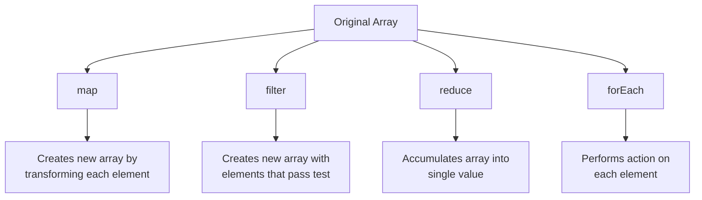
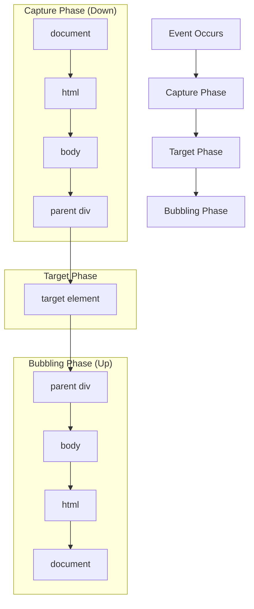
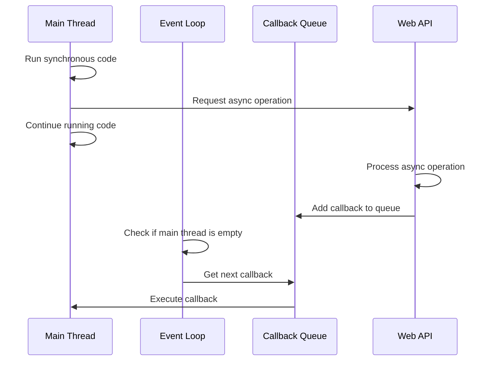

Hey there! Ready to dive into JavaScript? I'm going to walk you through everything you'll need for about 85% of your day-to-day JavaScript work, plus give you the tools to explore that last 15% on your own. Let's get started!

## What is JavaScript?

JavaScript is the programming language of the web. It started as a simple way to add interactivity to websites but has evolved into a powerful language that can run everywhere from browsers to servers, mobile apps, and even IoT devices.

## Prerequisites

Before we jump in:

- Basic understanding of HTML and CSS is helpful (but not required)
- A text editor (VS Code, Sublime Text, or even Notepad will work)
- A modern web browser (Chrome, Firefox, Edge)

## Getting Started

Let's set you up to write and run JavaScript code:

### Browser Console

The easiest way to get started is using your browser's console:

1. Open your browser
2. Right-click anywhere on a webpage
3. Select "Inspect" or "Inspect Element"
4. Go to the "Console" tab
5. Type JavaScript directly there and press Enter to run it

Try this:

```javascript
console.log('Hello, JavaScript world!');
// Output: Hello, JavaScript world!
```

### Creating a JavaScript File

For actual projects, you'll want to create JavaScript files:

1. Create an HTML file named `index.html`:

```html
<!DOCTYPE html>
<html>
  <head>
    <title>My JavaScript Playground</title>
  </head>
  <body>
    <h1>JavaScript in action</h1>

    <!-- Link your JavaScript file at the bottom of body -->
    <script src="script.js"></script>
  </body>
</html>
```

2. Create a JavaScript file named `script.js` in the same folder:

```javascript
console.log('JavaScript is running!');
// Check your browser console to see this message
```

3. Open `index.html` in your browser, and open the console to see your message.

## JavaScript Fundamentals

### Variables and Data Types

JavaScript has three ways to declare variables:

```javascript
let name = 'Alice'; // Block-scoped, can be reassigned
const age = 30; // Block-scoped, cannot be reassigned
var oldWay = 'outdated'; // Function-scoped, avoid using this
```

Basic data types:

```javascript
// Numbers
let count = 42; // Integer
let price = 9.99; // Floating point

// Strings
let greeting = 'Hello';
let phrase = `${greeting}, world!`; // Template literal, outputs: "Hello, world!"

// Booleans
let isActive = true;

// Null and Undefined
let empty = null; // Explicitly nothing
let notDefined; // Automatically undefined

// Objects
let person = {
  firstName: 'Bob',
  lastName: 'Smith',
  age: 25,
};
console.log(person.firstName); // Output: Bob

// Arrays (a special kind of object)
let colors = ['red', 'green', 'blue'];
console.log(colors[0]); // Output: red
```

### Operators

```javascript
// Arithmetic
let sum = 5 + 3; // 8
let difference = 10 - 4; // 6
let product = 3 * 4; // 12
let quotient = 20 / 5; // 4
let remainder = 10 % 3; // 1 (modulo)
let power = 2 ** 3; // 8 (exponential)

// Comparison
console.log(5 > 3); // true
console.log(5 < 3); // false
console.log(5 >= 5); // true
console.log(5 == '5'); // true (non-strict equality, converts types)
console.log(5 === '5'); // false (strict equality, checks types too)

// Logical
console.log(true && false); // false (AND)
console.log(true || false); // true (OR)
console.log(!true); // false (NOT)
```

### Control Structures

#### Conditionals

```javascript
// If/else statement
let hour = 14;

if (hour < 12) {
  console.log('Good morning!');
} else if (hour < 18) {
  console.log('Good afternoon!');
} else {
  console.log('Good evening!');
}
// Output: Good afternoon!

// Ternary operator (shorthand for simple if/else)
let age = 20;
let canVote = age >= 18 ? 'Yes' : 'No';
console.log(canVote); // Output: Yes

// Switch statement
let day = 'Monday';

switch (day) {
  case 'Monday':
    console.log('Start of the work week');
    break;
  case 'Friday':
    console.log('End of the work week');
    break;
  case 'Saturday':
  case 'Sunday':
    console.log('Weekend!');
    break;
  default:
    console.log('Midweek');
}
// Output: Start of the work week
```

#### Loops

```javascript
// For loop
for (let i = 0; i < 5; i++) {
  console.log(i);
}
// Output: 0, 1, 2, 3, 4

// While loop
let count = 0;
while (count < 3) {
  console.log('Count is: ' + count);
  count++;
}
// Output: Count is: 0, Count is: 1, Count is: 2

// For...of loop (for arrays)
const fruits = ['apple', 'banana', 'cherry'];
for (const fruit of fruits) {
  console.log(fruit);
}
// Output: apple, banana, cherry

// For...in loop (for object properties)
const car = { make: 'Toyota', model: 'Corolla', year: 2020 };
for (const prop in car) {
  console.log(`${prop}: ${car[prop]}`);
}
// Output: make: Toyota, model: Corolla, year: 2020
```

### Functions

Functions are reusable blocks of code:

```javascript
// Function declaration
function greet(name) {
  return `Hello, ${name}!`;
}
console.log(greet('Alex')); // Output: Hello, Alex!

// Function expression
const add = function (a, b) {
  return a + b;
};
console.log(add(5, 3)); // Output: 8

// Arrow function (ES6+)
const multiply = (a, b) => a * b;
console.log(multiply(4, 2)); // Output: 8

// Default parameters
function welcome(name = 'Guest') {
  return `Welcome, ${name}!`;
}
console.log(welcome()); // Output: Welcome, Guest!
console.log(welcome('Sarah')); // Output: Welcome, Sarah!
```

### Objects and Object-Oriented JavaScript

Objects are collections of key-value pairs:

```javascript
// Object literal
const user = {
  firstName: 'John',
  lastName: 'Doe',
  age: 30,
  email: 'john@example.com',

  // Method
  fullName: function () {
    return this.firstName + ' ' + this.lastName;
  },
};

console.log(user.firstName); // Output: John
console.log(user.fullName()); // Output: John Doe

// Constructor function
function Person(firstName, lastName, age) {
  this.firstName = firstName;
  this.lastName = lastName;
  this.age = age;

  this.greet = function () {
    return `Hi, I'm ${this.firstName}!`;
  };
}

const person1 = new Person('Alice', 'Johnson', 25);
console.log(person1.greet()); // Output: Hi, I'm Alice!

// Classes (ES6+)
class Animal {
  constructor(name, species) {
    this.name = name;
    this.species = species;
  }

  makeSound() {
    return 'Some generic animal sound';
  }
}

class Dog extends Animal {
  constructor(name, breed) {
    super(name, 'dog');
    this.breed = breed;
  }

  makeSound() {
    return 'Woof!';
  }
}

const myDog = new Dog('Rex', 'German Shepherd');
console.log(myDog.name); // Output: Rex
console.log(myDog.makeSound()); // Output: Woof!
```

### Arrays and Array Methods

Arrays are special objects used to store ordered collections:

```javascript
// Creating arrays
let numbers = [1, 2, 3, 4, 5];
let mixed = [1, 'two', true, null, { name: 'object' }];

// Accessing elements
console.log(numbers[0]); // Output: 1
console.log(numbers[numbers.length - 1]); // Output: 5 (last element)

// Common array methods
numbers.push(6); // Add to end: [1, 2, 3, 4, 5, 6]
numbers.pop(); // Remove from end: [1, 2, 3, 4, 5]
numbers.unshift(0); // Add to beginning: [0, 1, 2, 3, 4, 5]
numbers.shift(); // Remove from beginning: [1, 2, 3, 4, 5]
numbers.splice(2, 1); // Remove 1 element at index 2: [1, 2, 4, 5]

// Higher-order array methods
const doubled = numbers.map((num) => num * 2);
console.log(doubled); // Output: [2, 4, 8, 10]

const evenNumbers = numbers.filter((num) => num % 2 === 0);
console.log(evenNumbers); // Output: [2, 4]

const sum = numbers.reduce((total, num) => total + num, 0);
console.log(sum); // Output: 12 (1 + 2 + 4 + 5)

numbers.forEach((num) => console.log(num * 3));
// Output: 3, 6, 12, 15
```

Let's visualize the execution order of these array methods:



### DOM Manipulation

The Document Object Model (DOM) is how JavaScript interacts with HTML:

```javascript
// Selecting elements
const heading = document.getElementById('main-title');
const paragraphs = document.getElementsByTagName('p');
const buttons = document.getElementsByClassName('btn');
const firstButton = document.querySelector('.btn'); // CSS selector (first match)
const allButtons = document.querySelectorAll('.btn'); // All matches

// Modifying content
heading.textContent = 'New Title'; // Just text
heading.innerHTML = 'New <em>Formatted</em> Title'; // Can include HTML

// Changing styles
heading.style.color = 'blue';
heading.style.fontSize = '24px';

// Adding/removing classes
heading.classList.add('highlight');
heading.classList.remove('old-class');
heading.classList.toggle('active'); // Add if missing, remove if present

// Creating and adding elements
const newParagraph = document.createElement('p');
newParagraph.textContent = 'This is a new paragraph.';
document.body.appendChild(newParagraph);

// Removing elements
const oldElement = document.getElementById('old-item');
oldElement.parentNode.removeChild(oldElement);
// Or with newer syntax:
// oldElement.remove();
```

### Event Handling

Events let JavaScript respond to user actions:

```javascript
// Using event properties
const button = document.getElementById('my-button');
button.onclick = function () {
  alert('Button clicked!');
};

// Better: Using event listeners
button.addEventListener('click', function (event) {
  console.log('Button clicked!');
  console.log(event); // Event object contains details about the event
});

// Common events
document.getElementById('my-input').addEventListener('input', function (e) {
  console.log('Input value changed to: ' + e.target.value);
});

document.getElementById('my-form').addEventListener('submit', function (e) {
  e.preventDefault(); // Prevent form submission
  console.log('Form submitted!');
});

// Event delegation (handling events on multiple elements efficiently)
document.getElementById('task-list').addEventListener('click', function (e) {
  // Check if clicked element is a task item
  if (e.target.classList.contains('task-item')) {
    console.log('Task clicked:', e.target.textContent);
  }
});
```

Let's visualize the event flow:



### Asynchronous JavaScript

JavaScript handles asynchronous operations in several ways:

```javascript
// Callbacks (older style)
function fetchDataWithCallback(callback) {
  setTimeout(() => {
    const data = { id: 1, name: 'Product' };
    callback(data);
  }, 1000);
}

fetchDataWithCallback(function (result) {
  console.log('Data received:', result);
  // Output after 1 second: Data received: {id: 1, name: "Product"}
});

// Promises (modern approach)
function fetchDataWithPromise() {
  return new Promise((resolve, reject) => {
    setTimeout(() => {
      const success = true;
      if (success) {
        resolve({ id: 1, name: 'Product' });
      } else {
        reject('Error fetching data');
      }
    }, 1000);
  });
}

fetchDataWithPromise()
  .then((data) => {
    console.log('Success:', data);
    return data.id;
  })
  .then((id) => {
    console.log('Product ID:', id);
  })
  .catch((error) => {
    console.error('Error:', error);
  });

// Async/await (newest, cleanest syntax)
async function fetchData() {
  try {
    const response = await fetchDataWithPromise();
    console.log('Data:', response);
    return response;
  } catch (error) {
    console.error('Error:', error);
  }
}

// Call the async function
fetchData().then((result) => {
  console.log('Processing result:', result);
});
```

Let's visualize asynchronous execution:



### Error Handling

```javascript
// Try/catch blocks
try {
  // Code that might throw an error
  const result = someUndefinedFunction();
  console.log(result);
} catch (error) {
  console.error('An error occurred:', error.message);
  // Output: An error occurred: someUndefinedFunction is not defined
} finally {
  console.log('This runs regardless of whether there was an error');
}

// Throwing custom errors
function divide(a, b) {
  if (b === 0) {
    throw new Error('Cannot divide by zero');
  }
  return a / b;
}

try {
  console.log(divide(10, 2)); // Output: 5
  console.log(divide(10, 0)); // This will throw an error
} catch (error) {
  console.error(error.message); // Output: Cannot divide by zero
}
```

### ES6+ Features

Modern JavaScript has introduced many useful features:

```javascript
// Arrow functions
const square = (x) => x * x;

// Template literals
const name = 'World';
console.log(`Hello, ${name}!`); // Output: Hello, World!

// Destructuring
const person = { name: 'Alice', age: 30, city: 'Wonderland' };
const { name: personName, age } = person;
console.log(personName, age); // Output: Alice 30

const colors = ['red', 'green', 'blue'];
const [firstColor, secondColor] = colors;
console.log(firstColor, secondColor); // Output: red green

// Spread operator
const arr1 = [1, 2, 3];
const arr2 = [...arr1, 4, 5]; // [1, 2, 3, 4, 5]

const obj1 = { a: 1, b: 2 };
const obj2 = { ...obj1, c: 3 }; // { a: 1, b: 2, c: 3 }

// Rest parameters
function sum(...numbers) {
  return numbers.reduce((total, num) => total + num, 0);
}
console.log(sum(1, 2, 3, 4)); // Output: 10

// Optional chaining
const user = {
  profile: {
    // address: { street: "123 Main St" }
  },
};
// Instead of: user.profile && user.profile.address && user.profile.address.street
const street = user.profile?.address?.street;
console.log(street); // Output: undefined (no error)

// Nullish coalescing
const value = null;
const defaultValue = value ?? 'default';
console.log(defaultValue); // Output: "default"
```

### Modules (ES6+)

Modern JavaScript uses modules to organize code:

```javascript
// math.js
export function add(a, b) {
  return a + b;
}

export function subtract(a, b) {
  return a - b;
}

export default function multiply(a, b) {
  return a * b;
}

// main.js
import multiply, { add, subtract } from './math.js';

console.log(add(5, 3)); // Output: 8
console.log(subtract(10, 4)); // Output: 6
console.log(multiply(2, 6)); // Output: 12
```

To use modules in a browser, update your HTML:

```html
<!-- Add type="module" to your script tag -->
<script type="module" src="main.js"></script>
```

## The Remaining 15%: Advanced Topics for Self-Exploration

Now that you've got the essential 85% under your belt, here's what you can explore next:

1. **Advanced JavaScript Concepts**

   - Closures and lexical scope
   - Prototypal inheritance
   - The `this` keyword in depth
   - WeakMap and WeakSet
   - Proxies and Reflect API
   - Generators and Iterators

2. **JavaScript for Different Environments**

   - Node.js backend development
   - Mobile app development with frameworks like React Native
   - Desktop app development with Electron
   - WebAssembly integration

3. **State Management and Architecture**

   - Component-based architecture
   - State management patterns (Flux, Redux, MobX)
   - Immutable data structures
   - Functional programming concepts

4. **Performance Optimization**

   - Memory management and garbage collection
   - Web Workers and multi-threading
   - Performance profiling and optimization
   - Critical rendering path

5. **Testing and Development**

   - Unit testing with Jest or Mocha
   - E2E testing with tools like Cypress
   - Test-driven development (TDD)
   - Debugging techniques and tools

6. **Modern Development Ecosystem**
   - Bundlers (Webpack, Rollup, Vite)
   - Transpilers (Babel)
   - TypeScript
   - Package management with npm/yarn

These topics build on the foundation we've covered. Pick the ones that seem most relevant to your projects, and you'll be well on your way to JavaScript mastery!
