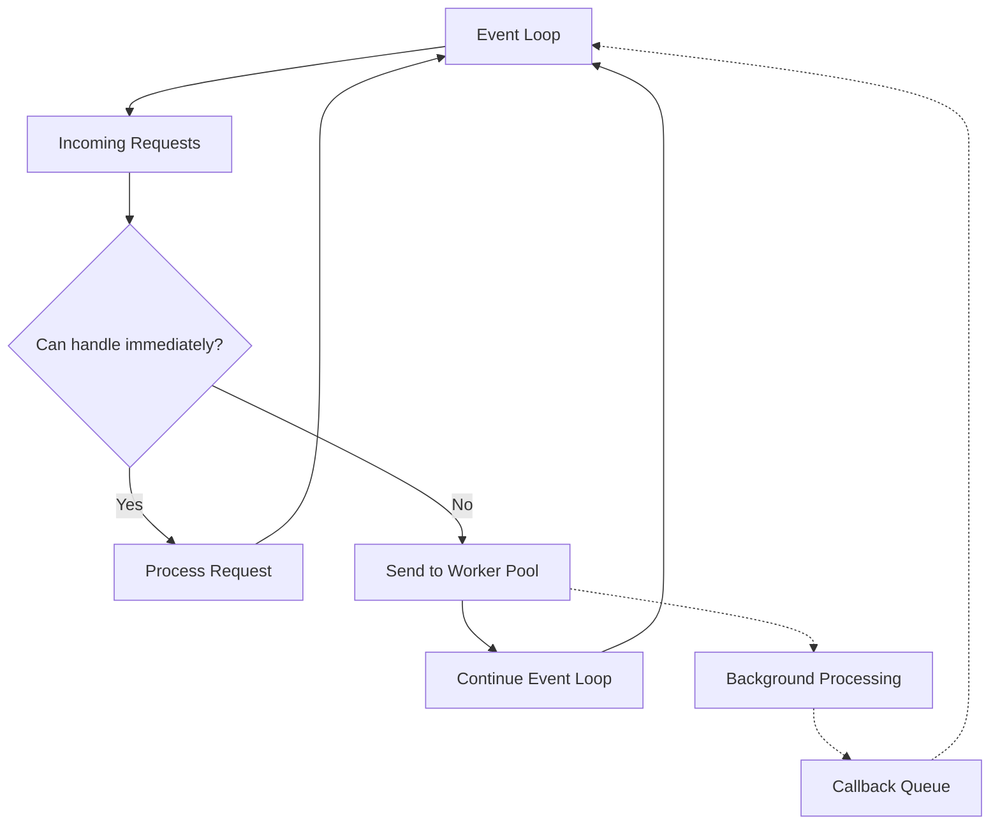
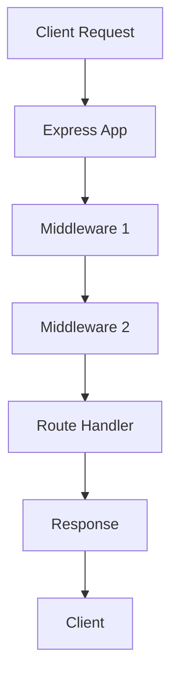

Hey there! So you want to learn Node.js? Perfect timing! Let's dive into this powerful JavaScript runtime that's transformed how we build server-side applications. Grab your coffee, and let's get started.

## 1. What is Node.js, anyway?

Node.js is essentially JavaScript that runs outside your browser. It's built on Chrome's V8 JavaScript engine and lets you use JavaScript to write server-side code.

The big thing that makes Node special is its **non-blocking, event-driven architecture**. Unlike traditional servers that create a new thread for each connection (which gets resource-intensive), Node operates on a single thread using an event loop.

Here's what that looks like:



## 2. Getting Started

### Installation

First, let's get Node installed:

1. Go to [nodejs.org](https://nodejs.org/)
2. Download the LTS (Long Term Support) version
3. Follow the installation prompts

To verify installation, open your terminal/command prompt and type:

```bash
node -v
npm -v
```

You should see version numbers for both Node and npm (Node Package Manager).

### Your First Node Program

Let's create a simple "Hello World":

1. Create a file called `app.js`
2. Add this code:

```javascript
// Your first Node.js program!
console.log('Hello from Node.js!');
```

3. Run it by typing in your terminal:

```bash
node app.js
```

You should see "Hello from Node.js!" printed out. Congrats! You've written your first Node program.

## 3. Understanding the Core Concepts

### Modules: The Building Blocks

Node.js uses a modular system to organize code. Think of modules as Lego blocks that you can combine to build your application.

There are three types of modules:

- Core modules (built into Node)
- Local modules (your own files)
- Third-party modules (from npm)

Here's how you use them:

```javascript
// Importing a core module
const fs = require('fs');

// Importing your own module
const myModule = require('./my-module');

// Using ES Modules syntax (needs package.json configuration)
import express from 'express';
```

### The Event Loop: Node's Secret Sauce

Remember that diagram earlier? Here's what actually happens:

1. Node puts operations on the call stack
2. When it encounters async operations, they go to the Web APIs/C++ APIs
3. Once completed, callbacks go to the callback queue
4. The event loop checks if the call stack is empty, then moves callbacks from the queue to the stack

This is why Node can handle many connections with limited resources!

### Asynchronous Programming

In Node, you'll deal with a lot of operations that take time (reading files, making HTTP requests, etc.). There are three main patterns for handling this:

**1. Callbacks (the old way)**

```javascript
// Reading a file with callbacks
const fs = require('fs');

fs.readFile('example.txt', 'utf8', (err, data) => {
  if (err) {
    console.error('Error reading file:', err);
    return;
  }
  console.log('File contents:', data);
});

console.log('This runs BEFORE the file is read!');
// Output:
// This runs BEFORE the file is read!
// File contents: whatever is in the file
```

**2. Promises (better)**

```javascript
// The same operation with promises
const fs = require('fs').promises;

fs.readFile('example.txt', 'utf8')
  .then((data) => {
    console.log('File contents:', data);
  })
  .catch((err) => {
    console.error('Error reading file:', err);
  });

console.log('This still runs first!');
```

**3. Async/Await (the modern way)**

```javascript
// The same operation with async/await
const fs = require('fs').promises;

async function readMyFile() {
  try {
    const data = await fs.readFile('example.txt', 'utf8');
    console.log('File contents:', data);
  } catch (err) {
    console.error('Error reading file:', err);
  }
}

readMyFile();
console.log('This still logs first!');
```

## 4. Building Real Applications

### Creating a Simple Web Server

This is where Node really shines! Let's create a basic HTTP server:

```javascript
// Simple HTTP server
const http = require('http');

// Create the server
const server = http.createServer((req, res) => {
  // Set the response headers
  res.writeHead(200, { 'Content-Type': 'text/html' });

  // Check the URL path
  if (req.url === '/') {
    res.end('<h1>Welcome to my server!</h1>');
  } else if (req.url === '/about') {
    res.end('<h1>About Us</h1><p>This is a simple Node.js server.</p>');
  } else {
    res.writeHead(404);
    res.end('<h1>Page Not Found</h1>');
  }
});

// Start listening on port 3000
server.listen(3000, () => {
  console.log('Server running at http://localhost:3000/');
});
```

Save this as `server.js` and run it with `node server.js`. Then open your browser to `http://localhost:3000`.

### Working with Files

Node makes file operations easy:

```javascript
const fs = require('fs');
const path = require('path');

// Create a directory
fs.mkdir(path.join(__dirname, 'test'), {}, (err) => {
  if (err) throw err;
  console.log('Folder created...');

  // Create and write to a file
  fs.writeFile(
    path.join(__dirname, 'test', 'hello.txt'),
    'Hello World!',
    (err) => {
      if (err) throw err;
      console.log('File written...');

      // Append to the file
      fs.appendFile(
        path.join(__dirname, 'test', 'hello.txt'),
        ' I love Node.js!',
        (err) => {
          if (err) throw err;
          console.log('File appended...');

          // Read the file
          fs.readFile(
            path.join(__dirname, 'test', 'hello.txt'),
            'utf8',
            (err, data) => {
              if (err) throw err;
              console.log('File contents:', data);
              // Output: Hello World! I love Node.js!
            },
          );
        },
      );
    },
  );
});
```

### Managing Packages with npm

npm (Node Package Manager) is how you'll add external libraries to your projects.

**Starting a New Project**

```bash
mkdir my-project
cd my-project
npm init -y  # Creates package.json with default values
```

**Installing Packages**

```bash
# Install a package and save as dependency
npm install express

# Install a development dependency
npm install nodemon --save-dev
```

Your `package.json` will track these dependencies:

```json
{
  "name": "my-project",
  "version": "1.0.0",
  "description": "",
  "main": "index.js",
  "scripts": {
    "start": "node index.js",
    "dev": "nodemon index.js"
  },
  "keywords": [],
  "author": "",
  "license": "ISC",
  "dependencies": {
    "express": "^4.18.2"
  },
  "devDependencies": {
    "nodemon": "^3.0.1"
  }
}
```

## 5. Express.js: Making Web Development Easier

Express is the most popular Node.js framework, and it makes building web servers much simpler:

```javascript
// Basic Express server
const express = require('express');
const app = express();
const port = 3000;

// Middleware to parse JSON requests
app.use(express.json());
app.use(express.urlencoded({ extended: false }));

// Routes
app.get('/', (req, res) => {
  res.send('Hello World!');
});

app.get('/api/users', (req, res) => {
  const users = [
    { id: 1, name: 'John' },
    { id: 2, name: 'Jane' },
    { id: 3, name: 'Bob' },
  ];
  res.json(users);
});

// POST example
app.post('/api/users', (req, res) => {
  const newUser = req.body;
  console.log('Adding user:', newUser);
  // Here you'd normally add to a database
  res.status(201).json(newUser);
});

// Dynamic route parameters
app.get('/api/users/:id', (req, res) => {
  console.log(`Looking for user with ID: ${req.params.id}`);
  // Here you'd normally query a database
  res.send(`User ${req.params.id} details`);
});

// Start the server
app.listen(port, () => {
  console.log(`Server running at http://localhost:${port}`);
});
```

Save this as `express-server.js`, run `npm install express` first, then run it with `node express-server.js`.

Express follows a middleware pattern, where requests flow through functions before reaching the final handler:



## 6. Database Integration

Let's see how to connect Node.js to MongoDB, a popular NoSQL database:

```javascript
// MongoDB with Mongoose example
const express = require('express');
const mongoose = require('mongoose');
const app = express();

// Middleware
app.use(express.json());

// Connect to MongoDB
mongoose
  .connect('mongodb://localhost:27017/myapp', {
    useNewUrlParser: true,
    useUnifiedTopology: true,
  })
  .then(() => console.log('MongoDB connected'))
  .catch((err) => console.error('MongoDB connection error:', err));

// Define a schema and model
const userSchema = new mongoose.Schema({
  name: { type: String, required: true },
  email: { type: String, required: true, unique: true },
  createdAt: { type: Date, default: Date.now },
});

const User = mongoose.model('User', userSchema);

// Routes
app.post('/api/users', async (req, res) => {
  try {
    const user = new User(req.body);
    await user.save();
    res.status(201).json(user);
  } catch (err) {
    res.status(400).json({ error: err.message });
  }
});

app.get('/api/users', async (req, res) => {
  try {
    const users = await User.find();
    res.json(users);
  } catch (err) {
    res.status(500).json({ error: err.message });
  }
});

// Start server
app.listen(3000, () => console.log('Server running on port 3000'));
```

To use this:

1. Install MongoDB locally or use MongoDB Atlas (cloud version)
2. Run `npm install express mongoose`
3. Run the code with `node mongodb-example.js`

## 7. Environment Variables and Configuration

It's a good practice to separate configuration from code:

```javascript
// Create a .env file in your project with:
// PORT=4000
// MONGO_URI=mongodb://localhost:27017/myapp
// API_KEY=secret123

// Then in your app.js:
const dotenv = require('dotenv');
dotenv.config(); // Load environment variables

const express = require('express');
const app = express();

// Use environment variables
const port = process.env.PORT || 3000;
const mongoUri = process.env.MONGO_URI;
const apiKey = process.env.API_KEY;

console.log(`Using port: ${port}`);
console.log(`MongoDB URI: ${mongoUri}`);

app.listen(port, () => {
  console.log(`Server running on port ${port}`);
});
```

First, install dotenv with `npm install dotenv`.

## 8. Error Handling

Error handling is crucial in Node applications:

```javascript
// Global error handler for Express
const express = require('express');
const app = express();

app.get('/api/data', (req, res, next) => {
  try {
    // Simulate an error
    const randomNum = Math.random();
    if (randomNum < 0.5) {
      throw new Error('Something went wrong!');
    }
    res.json({ success: true, data: 'Here is your data' });
  } catch (err) {
    // Pass to error handler
    next(err);
  }
});

// Custom 404 handler
app.use((req, res, next) => {
  res.status(404).json({ error: 'Route not found' });
});

// Error handling middleware (must have 4 parameters)
app.use((err, req, res, next) => {
  console.error(err.stack);
  res.status(500).json({
    error: err.message,
    stack: process.env.NODE_ENV === 'production' ? '🥞' : err.stack,
  });
});

app.listen(3000, () => console.log('Server running on port 3000'));
```

## 9. Debugging Node Applications

When things go wrong (and they will), here's how to debug:

```javascript
// Basic debugging
console.log('Variable value:', myVariable);
console.table(myArray); // Displays arrays/objects in table format
console.time('operation'); // Start a timer
// ...code to time...
console.timeEnd('operation'); // End timer and log duration
```

For more complex debugging:

1. Run your app with the `--inspect` flag: `node --inspect app.js`
2. Open Chrome and go to `chrome://inspect`
3. Click "Open dedicated DevTools for Node"

## The Remaining 15% (Advanced Topics)

Now that you've got the basics down, here are the advanced topics to explore next:

1. **Testing in Node.js**

   - Unit testing with Jest or Mocha
   - Integration testing
   - Test-driven development (TDD)

2. **Deployment and DevOps**

   - Docker containers
   - CI/CD pipelines
   - Cloud platforms (AWS, Azure, GCP)
   - Process managers (PM2)

3. **Advanced Node.js Patterns**

   - Worker threads
   - Clustering for multi-core processing
   - Memory management
   - Stream processing for large datasets

4. **WebSockets and Real-time Applications**

   - Socket.io
   - Real-time chat applications
   - Live dashboards

5. **Security Best Practices**

   - Authentication strategies (JWT, OAuth)
   - CSRF/XSS protection
   - Input validation
   - Rate limiting

6. **GraphQL APIs**

   - Apollo Server
   - Schema design
   - Resolvers and data sources

7. **Microservices Architecture**
   - Service communication
   - API gateways
   - Message queues (RabbitMQ, Kafka)
   - Service discovery

Resources to help you explore these advanced topics:

- [Node.js Official Documentation](https://nodejs.org/en/docs/)
- [Express.js Documentation](https://expressjs.com/)
- [MongoDB University](https://university.mongodb.com/)
- [The Node Cookbook](https://www.packtpub.com/product/node-cookbook-fourth-edition/9781838558758)

That's your Node.js crash course! You now have the 85% you need for daily use and a roadmap to the remaining 15%. What part are you most excited to try first?
