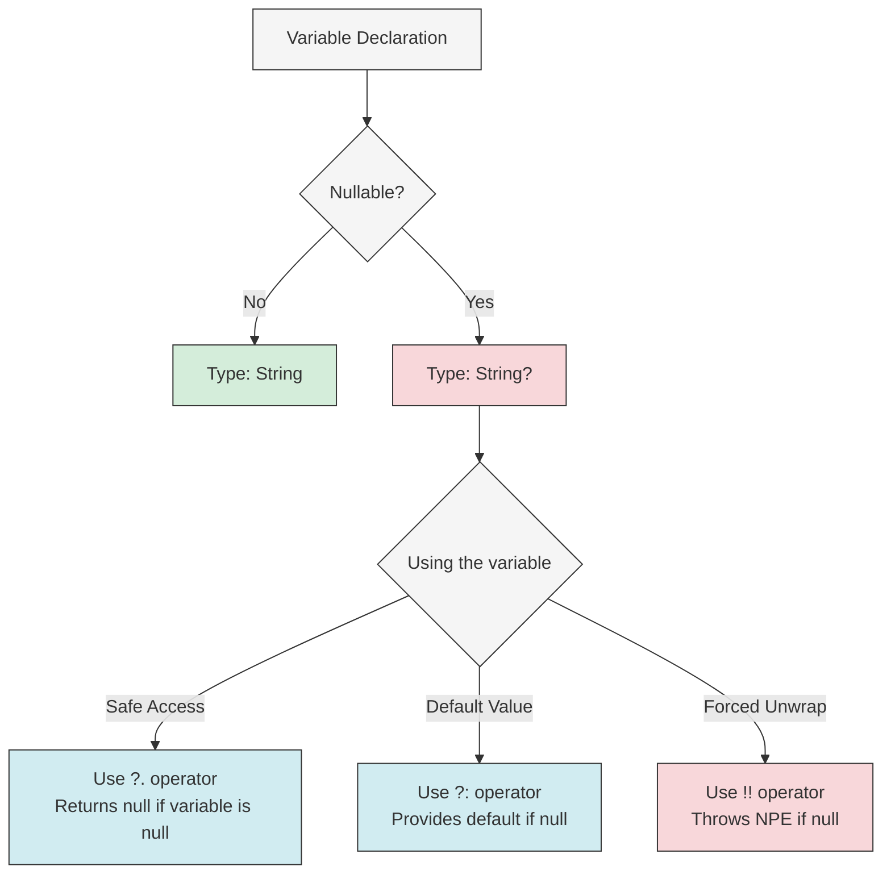
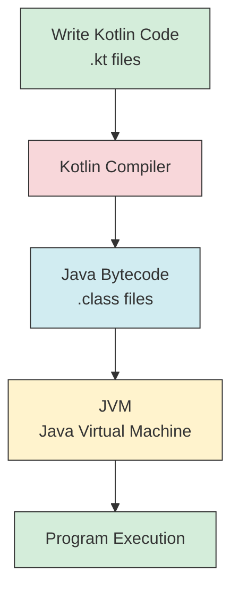

Welcome to this comprehensive Kotlin crash course! I've designed this guide to cover the most essential 85% of Kotlin features you'll use daily, while giving you the foundation to explore the remaining 15% on your own.

## Introduction to Kotlin

Kotlin is a modern, statically-typed programming language that runs on the Java Virtual Machine (JVM). Created by JetBrains in 2011, it has gained tremendous popularity, especially after Google announced it as an official language for Android development in 2017.

### Why Kotlin?

- **Concise syntax**: Significantly less boilerplate code than Java
- **Null safety**: Built-in protection against null pointer exceptions
- **Java interoperability**: 100% compatible with existing Java code
- **Modern features**: Combines object-oriented and functional programming
- **Industry adoption**: Used by Google, Amazon, Netflix, and many others

With these powerful features in mind, let's get your environment set up so you can start coding right away.

## Setting Up Your Environment

### Prerequisites:

- Basic programming knowledge
- Computer with internet connection

### Installation:

1. **Install JDK (Java Development Kit)**:

   - Download JDK 17 or 21 from [Oracle](https://www.oracle.com/java/technologies/downloads/) or use OpenJDK

2. **Install IntelliJ IDEA**:

   ```
   # Steps:
   1. Go to https://www.jetbrains.com/idea/download/
   2. Download Community Edition (free)
   3. Run the installer and follow instructions
   ```

3. **Create your first Kotlin project**:
   ```
   # In IntelliJ IDEA:
   1. Select File > New > Project
   2. Choose "Kotlin" and "JVM | IDEA"
   3. Name your project and select your installed JDK
   4. Click "Create"
   ```

Now that your environment is ready, let's write your first Kotlin program to get a feel for the language.

## Your First Kotlin Program

Create a new Kotlin file in your project and add:

```kotlin
fun main() {
    // This is a comment
    println("Hello, Kotlin!") // Prints to console
}

// Run this program by clicking the green "play" button in IntelliJ
// Output: Hello, Kotlin!
```

This simple program demonstrates:

- `fun` keyword to declare functions
- `main()` as the entry point
- `println()` to output text
- Comments with `//`

With this basic foundation, let's explore how Kotlin handles variables and data types, which form the building blocks of any program.

## Variables and Data Types

In Kotlin, everything starts with declaring variables. Unlike some languages, Kotlin makes you think about whether your data can change over time:

```kotlin
// Variables are declared using var (mutable) or val (immutable)
val name: String = "Kotlin" // Immutable - cannot be changed
var age: Int = 12           // Mutable - can be changed
age = 13                    // This works
// name = "Java"            // This would cause an error

// Type inference (compiler determines the type)
val language = "Kotlin"     // Type String is inferred
var version = 1.7           // Type Double is inferred

// Basic data types
val count: Int = 42              // Integer numbers
val temperature: Double = 23.5   // Floating-point numbers
val isActive: Boolean = true     // true or false
val letter: Char = 'K'           // Single character
val message: String = "Hello"    // Text
```

One of Kotlin's major innovations is how it handles null values, which addresses a common source of errors in many programming languages.

## Null Safety

Kotlin's type system is designed to eliminate the danger of null references, often called "The Billion Dollar Mistake" in other languages:

```kotlin
// Non-nullable type (cannot be null)
val text: String = "Hello"
// text = null  // Compilation error!

// Nullable type (can be null)
val nullableText: String? = null  // Notice the question mark

// Safe call operator (?.)
// Returns null if nullableText is null instead of throwing an exception
val length = nullableText?.length  // Result: null

// Elvis operator (?:) - provides a default value
val nonNullLength = nullableText?.length ?: 0  // Result: 0

// Not-null assertion (!!) - use cautiously!
// Will throw NullPointerException if nullableText is null
// val forcedLength = nullableText!!.length  // Would throw exception
```

To better understand how Kotlin handles null values, let's visualize the flow:



With variables and null safety covered, we can now move on to controlling the flow of your programs.

## Control Flow

Programs need to make decisions and repeat actions. Kotlin provides elegant ways to control your program's flow.

### If Expressions

Unlike many languages, Kotlin's `if` is an expression that can return a value:

```kotlin
// Basic if-else
val age = 20
if (age >= 18) {
    println("Adult")
} else {
    println("Minor")
}

// If as an expression (returns a value)
val status = if (age >= 18) "Adult" else "Minor"
println(status) // Output: Adult

// Multi-branch if
val score = 85
val grade = if (score >= 90) {
    "A"
} else if (score >= 80) {
    "B"
} else if (score >= 70) {
    "C"
} else {
    "F"
}
println(grade) // Output: B
```

### When Expression

For more complex branching, Kotlin replaces the traditional switch statement with the more powerful `when` expression:

```kotlin
val day = 3
val dayName = when (day) {
    1 -> "Monday"
    2 -> "Tuesday"
    3 -> "Wednesday"
    4 -> "Thursday"
    5 -> "Friday"
    6 -> "Saturday"
    7 -> "Sunday"
    else -> "Invalid day"
}
println(dayName) // Output: Wednesday

// When with ranges and multiple conditions
val number = 15
val description = when (number) {
    in 1..10 -> "Between 1 and 10"
    in 11..20 -> "Between 11 and 20"
    30, 40, 50 -> "Either 30, 40, or 50"
    else -> "Some other number"
}
println(description) // Output: Between 11 and 20
```

Decision-making only gets us so far. Let's look at how Kotlin handles repetition with loops.

## Loops

### For Loop

Kotlin's for loop is designed to iterate over anything that provides an iterator:

```kotlin
// Loop through a range
for (i in 1..5) {
    println(i) // Prints 1, 2, 3, 4, 5
}

// Loop with a step
for (i in 1..10 step 2) {
    println(i) // Prints 1, 3, 5, 7, 9
}

// Loop in reverse
for (i in 5 downTo 1) {
    println(i) // Prints 5, 4, 3, 2, 1
}

// Loop through a collection
val fruits = listOf("Apple", "Banana", "Cherry")
for (fruit in fruits) {
    println(fruit)
}

// Loop with index
for ((index, fruit) in fruits.withIndex()) {
    println("$index: $fruit") // Prints "0: Apple", "1: Banana", etc.
}
```

### While Loop

When you need to repeat actions based on a condition:

```kotlin
// Standard while loop
var counter = 0
while (counter < 5) {
    println(counter)
    counter++
}

// Do-while loop (executes at least once)
var number = 10
do {
    println(number)
    number--
} while (number > 5)
```

Now that we can control program flow, let's look at how Kotlin handles text manipulation, which is essential for almost any application.

## String Manipulation

Kotlin provides powerful tools for working with text:

```kotlin
// String templates
val name = "Kotlin"
val version = 1.7
println("I'm learning $name $version") // Output: I'm learning Kotlin 1.7

// Complex expressions in templates
println("The length of $name is ${name.length}") // Output: The length of Kotlin is 6

// Multiline strings (preserves formatting)
val poem = """
    Roses are red,
    Violets are blue,
    Kotlin is awesome,
    And so are you!
""".trimIndent()
println(poem)
```

These string features are quite useful, but to build truly reusable code, we need functions.

## Functions

Functions allow you to organize code into reusable blocks. Kotlin makes function declaration clean and flexible:

```kotlin
// Simple function
fun greet() {
    println("Hello!")
}
greet() // Output: Hello!

// Function with parameters
fun greetPerson(name: String) {
    println("Hello, $name!")
}
greetPerson("Alice") // Output: Hello, Alice!

// Function with return value
fun sum(a: Int, b: Int): Int {
    return a + b
}
println(sum(3, 4)) // Output: 7

// Single-expression function (simplified syntax)
fun multiply(a: Int, b: Int): Int = a * b
println(multiply(5, 6)) // Output: 30

// Function with default parameter values
fun greetWithDefault(name: String = "Guest") {
    println("Hello, $name!")
}
greetWithDefault() // Output: Hello, Guest!
greetWithDefault("Bob") // Output: Hello, Bob!

// Named arguments
fun createUser(name: String, age: Int, isAdmin: Boolean) {
    println("User: $name, Age: $age, Admin: $isAdmin")
}
createUser(name = "Alice", age = 30, isAdmin = true)
createUser(age = 25, isAdmin = false, name = "Bob") // Order can be changed
```

Functions are essential, but we also need ways to organize data. Let's explore Kotlin's collection types.

## Collections

Collections help us work with groups of related data. Kotlin provides rich APIs for different collection types.

### Lists

```kotlin
// Immutable list (can't add/remove elements)
val fruits = listOf("Apple", "Banana", "Cherry")
println(fruits[0]) // Output: Apple

// Mutable list (can add/remove elements)
val vegetables = mutableListOf("Carrot", "Potato")
vegetables.add("Broccoli")
println(vegetables) // Output: [Carrot, Potato, Broccoli]

// List operations
println(fruits.size) // Output: 3
println(fruits.contains("Apple")) // Output: true
println(fruits.indexOf("Banana")) // Output: 1
```

### Maps (Key-Value Pairs)

```kotlin
// Immutable map
val ages = mapOf("Alice" to 30, "Bob" to 25, "Charlie" to 35)
println(ages["Alice"]) // Output: 30

// Mutable map
val scores = mutableMapOf("Math" to 90, "English" to 85)
scores["Science"] = 95
println(scores) // Output: {Math=90, English=85, Science=95}

// Map operations
println(ages.keys) // Output: [Alice, Bob, Charlie]
println(ages.values) // Output: [30, 25, 35]
for ((name, age) in ages) {
    println("$name is $age years old")
}
```

### Sets (Unique Elements)

```kotlin
// Immutable set
val uniqueNumbers = setOf(1, 2, 3, 3, 4) // Duplicates are removed
println(uniqueNumbers) // Output: [1, 2, 3, 4]

// Mutable set
val tags = mutableSetOf("Kotlin", "Programming")
tags.add("JVM")
tags.add("Kotlin") // Duplicate is ignored
println(tags) // Output: [Kotlin, Programming, JVM]
```

These collections become even more powerful when combined with Kotlin's functional programming capabilities.

## Functional Programming

Kotlin embraces functional programming, allowing you to write more expressive and concise code:

```kotlin
val numbers = listOf(1, 2, 3, 4, 5, 6, 7, 8, 9, 10)

// Filter - keep elements that match a condition
val evenNumbers = numbers.filter { it % 2 == 0 }
println(evenNumbers) // Output: [2, 4, 6, 8, 10]

// Map - transform each element
val squared = numbers.map { it * it }
println(squared) // Output: [1, 4, 9, 16, 25, 36, 49, 64, 81, 100]

// Find - get the first element matching a condition
val firstEven = numbers.find { it % 2 == 0 }
println(firstEven) // Output: 2

// Any/All/None - check if elements match a condition
println(numbers.any { it > 5 }) // Output: true
println(numbers.all { it < 20 }) // Output: true
println(numbers.none { it < 0 }) // Output: true

// Reduce - combine elements
val sum = numbers.reduce { acc, num -> acc + num }
println(sum) // Output: 55 (1+2+3+...+10)

// Grouping
val grouped = numbers.groupBy { if (it % 2 == 0) "even" else "odd" }
println(grouped) // Output: {odd=[1, 3, 5, 7, 9], even=[2, 4, 6, 8, 10]}
```

These functional approaches help you write more declarative code, focusing on what you want to accomplish rather than how to do it. Moving from individual functions to more complex structures, let's explore how Kotlin handles object-oriented programming.

## Classes and Objects

Kotlin provides a modern take on object-oriented programming, making classes concise yet powerful.

### Basic Class

```kotlin
// Class with primary constructor
class Person(val name: String, var age: Int) {
    // Property with custom getter
    val isAdult: Boolean
        get() = age >= 18

    // Method
    fun introduce() {
        println("Hi, I'm $name and I'm $age years old.")
    }

    // Init block - runs when instance is created
    init {
        println("Person created: $name")
    }
}

// Using the class
val alice = Person("Alice", 30)
println(alice.name) // Output: Alice
alice.age = 31 // Changing mutable property
println(alice.isAdult) // Output: true
alice.introduce() // Output: Hi, I'm Alice and I'm 31 years old.
```

### Data Classes

For classes whose main purpose is to hold data, Kotlin provides a concise syntax:

```kotlin
// Data class automatically provides equals(), hashCode(), toString(), copy()
data class User(val name: String, val email: String, val age: Int)

val user1 = User("Bob", "bob@example.com", 25)
println(user1) // Output: User(name=Bob, email=bob@example.com, age=25)

// Copying with some properties changed
val user2 = user1.copy(age = 26)
println(user2) // Output: User(name=Bob, email=bob@example.com, age=26)

// Destructuring
val (name, email, age) = user1
println("$name, $email, $age") // Output: Bob, bob@example.com, 25
```

### Inheritance

Object-oriented programming often involves inheritance. Kotlin provides a clean approach:

```kotlin
// Base class (open allows inheritance)
open class Animal(val name: String) {
    open fun makeSound() {
        println("Some generic sound")
    }
}

// Derived class
class Dog(name: String, val breed: String) : Animal(name) {
    override fun makeSound() {
        println("Woof!")
    }

    fun fetch() {
        println("$name is fetching...")
    }
}

// Using the classes
val animal = Animal("Generic Animal")
animal.makeSound() // Output: Some generic sound

val dog = Dog("Rex", "German Shepherd")
dog.makeSound() // Output: Woof!
dog.fetch() // Output: Rex is fetching...
```

Here's a visualization of Kotlin's class inheritance:

```mermaid
graph TD
    A[open class Animal] -->|extends| B[class Dog]
    A -->|extends| C[class Cat]
    A -->|extends| D[class Bird]

    E[Properties] -->|belongs to| A
    E --> F[name: String]

    G[Methods] -->|belongs to| A
    G --> H[open fun makeSound()]

    I[Override Methods] -->|belongs to| B
    I --> J[override fun makeSound()]

    style A fill:#d4edda,stroke:#333
    style B fill:#d1ecf1,stroke:#333
    style C fill:#d1ecf1,stroke:#333
    style D fill:#d1ecf1,stroke:#333
```

### Interfaces

For more flexible code structures, Kotlin provides interfaces:

```kotlin
// Interface definition
interface Swimmer {
    fun swim() // Abstract method (no implementation)

    fun dive() { // Method with default implementation
        println("Diving...")
    }
}

// Class implementing an interface
class Fish(val species: String) : Swimmer {
    override fun swim() {
        println("$species is swimming")
    }

    // We can use the default implementation of dive() or override it
}

val goldfish = Fish("Goldfish")
goldfish.swim() // Output: Goldfish is swimming
goldfish.dive() // Output: Diving...
```

### Object Keyword (Singletons)

Kotlin provides a simple way to create singleton objects:

```kotlin
// Singleton object (only one instance ever exists)
object DatabaseConnection {
    private var count = 0

    fun connect() {
        count++
        println("Connected to database (connection #$count)")
    }
}

DatabaseConnection.connect() // Output: Connected to database (connection #1)
DatabaseConnection.connect() // Output: Connected to database (connection #2)
```

### Companion Objects (Static-like Members)

For class-level functionality similar to static members in other languages:

```kotlin
class MathUtils {
    // Similar to static members in other languages
    companion object {
        const val PI = 3.14159

        fun square(x: Double): Double {
            return x * x
        }
    }

    fun nonStaticMethod() {
        println("This requires an instance")
    }
}

// Access companion object members without creating an instance
println(MathUtils.PI) // Output: 3.14159
println(MathUtils.square(4.0)) // Output: 16.0

// Non-companion methods require an instance
val mathUtils = MathUtils()
mathUtils.nonStaticMethod() // Output: This requires an instance
```

Finally, let's explore how Kotlin handles errors, which is crucial for writing robust applications.

## Error Handling

Kotlin uses exceptions for error handling, similar to many other languages, but with some functional programming twists:

```kotlin
fun divide(a: Int, b: Int): Int {
    if (b == 0) {
        throw IllegalArgumentException("Cannot divide by zero")
    }
    return a / b
}

// Try-catch block
try {
    val result = divide(10, 0)
    println(result)
} catch (e: IllegalArgumentException) {
    println("Error: ${e.message}") // Output: Error: Cannot divide by zero
} finally {
    println("This always executes")
}

// Try as an expression
val result = try {
    divide(10, 2)
} catch (e: Exception) {
    0 // Default value in case of exception
}
println(result) // Output: 5
```

Now that we've covered all the essential components, let's understand how a Kotlin program executes.

## Program Execution Flow

The journey from Kotlin code to running program involves several steps:



This process allows Kotlin to be fully interoperable with Java and run on any platform that supports the JVM.

## The Remaining 15%: Advanced Kotlin

With the core concepts mastered, you're now ready to explore the more advanced features of Kotlin. These topics build on the foundation we've established and will enable you to write even more powerful applications:

1. **Coroutines**: Kotlin's approach to asynchronous programming

   ```kotlin
   // Basic coroutine example
   import kotlinx.coroutines.*

   fun main() = runBlocking {
       launch {
           delay(1000L)
           println("World!")
       }
       println("Hello,") // Prints "Hello," immediately, then "World!" after 1 second
   }
   ```

2. **Sealed Classes**: Restricted class hierarchies for more type-safe code

   ```kotlin
   sealed class Result
   class Success(val data: String) : Result()
   class Error(val message: String) : Result()

   // When used with sealed classes is exhaustive
   fun handleResult(result: Result) = when(result) {
       is Success -> println("Success: ${result.data}")
       is Error -> println("Error: ${result.message}")
       // No need for 'else' branch as all cases are covered
   }
   ```

3. **Delegated Properties**: Implement properties by delegation

   ```kotlin
   // Example: lazy initialization
   val expensiveResource: String by lazy {
       println("Computing expensive resource...")
       "Result" // Only computed on first access
   }
   ```

4. **Scope Functions**: `let`, `run`, `with`, `apply`, and `also` for specialized operations on objects

5. **Extension Functions**: Add new functions to existing classes

   ```kotlin
   fun String.addExclamation(): String {
       return "$this!"
   }

   println("Hello".addExclamation()) // Output: Hello!
   ```

6. **Flow API**: Reactive streams built on top of coroutines

7. **Multiplatform Development**: Write code for multiple platforms (JVM, JS, Native)

8. **Type-Safe Builders**: Create domain-specific languages (DSLs)

9. **Reflection**: Runtime introspection of code

10. **Operator Overloading**: Customize operators for your classes

## Conclusion

You've now completed a comprehensive tour of Kotlin's essential features—the 85% you'll use in everyday programming. We've covered everything from basic syntax and variables to advanced object-oriented concepts and functional programming techniques.

Kotlin's elegant design combines the best of object-oriented and functional programming paradigms, all while maintaining full interoperability with Java. Its concise syntax, null safety, and modern features make it an excellent choice for both new projects and existing Java codebases.

For the remaining 15% of advanced features, you now have a solid foundation to explore them on your own. As you build real-world applications, you'll naturally encounter situations where these advanced features shine.

The best way to deepen your knowledge is through practice. Try building small projects, refactor existing Java code to Kotlin, or contribute to open-source Kotlin projects. Remember these official resources:

- [Kotlin Documentation](https://kotlinlang.org/docs/home.html)
- [Kotlin Koans](https://play.kotlinlang.org/koans/overview) - Interactive exercises
- [Kotlin by Example](https://play.kotlinlang.org/byExample/overview)

Happy coding with Kotlin!
