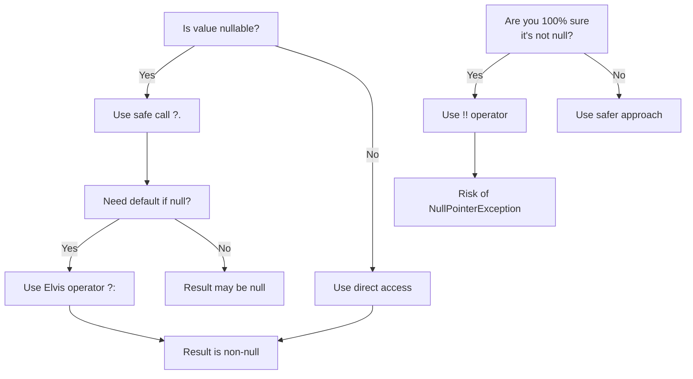
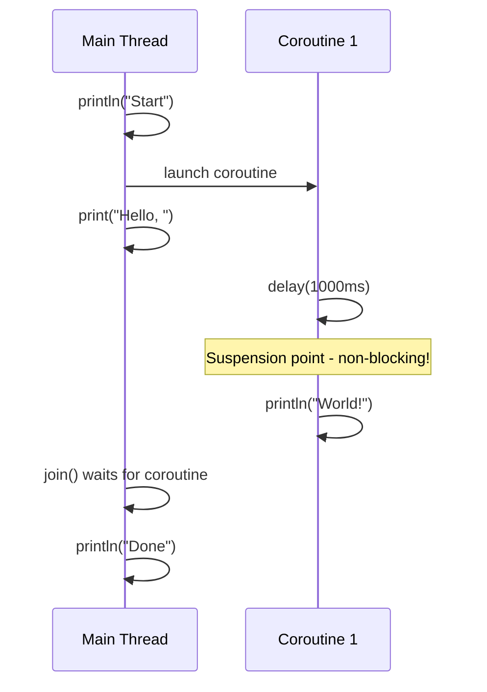

Hey there! Ready to dive into Kotlin? I'm going to walk you through everything you need to know to get started and be productive with Kotlin right away. By the end, you'll have a solid grasp of 85% of what you'll use day-to-day, plus the knowledge to explore that last 15% on your own.

## What is Kotlin and Why Learn It?

Kotlin is a modern, concise programming language that runs on the Java Virtual Machine (JVM). Created by JetBrains (the folks behind IntelliJ IDEA), it's become super popular, especially after Google announced it as an official language for Android development.

Some quick highlights:

- 100% interoperable with Java
- Less verbose than Java (way fewer lines of code!)
- Null safety built into the type system
- Combines object-oriented and functional programming features
- Modern language features like extension functions and coroutines

## Getting Started

### Installation

You have a few options to get Kotlin up and running:

**Option 1: Use IntelliJ IDEA (Recommended)**

1. Download IntelliJ IDEA from [jetbrains.com](https://www.jetbrains.com/idea/download/) (Community Edition is free)
2. Kotlin support is built-in, so you're ready to go!

**Option 2: Command Line**

1. Install the Kotlin compiler:

   ```bash
   # Using SDKMAN
   curl -s "https://get.sdkman.io" | bash
   sdk install kotlin

   # Or using Homebrew (macOS)
   brew install kotlin
   ```

2. Create a file named `hello.kt`:

   ```kotlin
   fun main() {
       println("Hello, Kotlin!")
   }
   ```

3. Compile and run:
   ```bash
   kotlinc hello.kt -include-runtime -d hello.jar
   java -jar hello.jar
   ```

## Basic Syntax

### Variables

Kotlin has two main types of variables:

- `val` - immutable (read-only, like `final` in Java)
- `var` - mutable (can be reassigned)

```kotlin
val name = "Kotlin"  // Type inference works, so no need to specify String
val age: Int = 10    // But you can be explicit if you want
var score = 10       // This can be changed later
score = 15           // This works fine

// Error! Can't reassign a val
// name = "Java"     // This would fail to compile
```

Kotlin has strong type inference, so it often knows what type you mean without you having to specify it.

### Basic Types

Kotlin has similar basic types to Java, but with some improvements:

```kotlin
// Numbers
val byte: Byte = 127
val short: Short = 32767
val int: Int = 2147483647
val long: Long = 9223372036854775807L
val float: Float = 3.14f
val double: Double = 3.14159265359

// Characters and strings
val char: Char = 'K'
val string: String = "Kotlin"

// Booleans
val isAwesome: Boolean = true

// Arrays
val numbers = arrayOf(1, 2, 3, 4, 5)
val zeros = IntArray(5) // Array of 5 zeros
```

### String Templates

Kotlin makes string concatenation much nicer:

```kotlin
val name = "Kotlin"
val age = 10

// Old way (still works)
println("My name is " + name + " and I'm " + age + " years old")

// Kotlin way (much cleaner)
println("My name is $name and I'm $age years old")

// For complex expressions, use curly braces
println("In 5 years, I'll be ${age + 5} years old")
```

## Functions

Functions in Kotlin are declared using the `fun` keyword:

```kotlin
// Basic function
fun sayHello() {
    println("Hello!")
}

// Function with parameters and return type
fun add(a: Int, b: Int): Int {
    return a + b
}

// Single-expression function (return type inferred)
fun multiply(a: Int, b: Int) = a * b

// Function with default parameters
fun greet(name: String = "friend") {
    println("Hello, $name!")
}

// Usage
sayHello()           // Prints: Hello!
println(add(5, 3))   // Prints: 8
println(multiply(4, 3))  // Prints: 12
greet()              // Prints: Hello, friend!
greet("Kotlin")      // Prints: Hello, Kotlin!
```

## Control Flow

### If-Else

In Kotlin, `if` is an expression (returns a value):

```kotlin
val age = 20

// Traditional use
if (age >= 18) {
    println("Adult")
} else {
    println("Minor")
}

// As an expression
val status = if (age >= 18) "Adult" else "Minor"
println(status)  // Prints: Adult
```

### When Expression (Switch on Steroids)

The `when` expression replaces the switch statement and is much more powerful:

```kotlin
val day = 3

when (day) {
    1 -> println("Monday")
    2 -> println("Tuesday")
    3 -> println("Wednesday")
    4 -> println("Thursday")
    5 -> println("Friday")
    6, 7 -> println("Weekend")
    else -> println("Invalid day")
}  // Prints: Wednesday

// when as an expression
val dayType = when (day) {
    1, 2, 3, 4, 5 -> "Weekday"
    6, 7 -> "Weekend"
    else -> "Invalid day"
}
println(dayType)  // Prints: Weekday

// when without an argument
val temperature = 22
val feeling = when {
    temperature < 0 -> "Freezing"
    temperature < 10 -> "Cold"
    temperature < 20 -> "Cool"
    temperature < 30 -> "Warm"
    else -> "Hot"
}
println(feeling)  // Prints: Warm
```

### Loops

```kotlin
// For loop through a range
for (i in 1..5) {
    print("$i ")  // Prints: 1 2 3 4 5
}
println()

// For loop with step
for (i in 1..10 step 2) {
    print("$i ")  // Prints: 1 3 5 7 9
}
println()

// For loop through a collection
val fruits = listOf("Apple", "Banana", "Cherry")
for (fruit in fruits) {
    println(fruit)
}

// While loop
var counter = 0
while (counter < 3) {
    println("Counter: $counter")
    counter++
}

// Do-while loop
counter = 0
do {
    println("Counter: $counter")
    counter++
} while (counter < 3)
```

## Collections

Kotlin has a rich collections library with a clear distinction between mutable and immutable collections.

```kotlin
// Immutable collections (can't add/remove elements)
val numbers = listOf(1, 2, 3, 4, 5)
val nameToAge = mapOf("Alice" to 30, "Bob" to 25)
val uniqueNumbers = setOf(1, 2, 3, 4, 5)

// Mutable collections (can add/remove elements)
val mutableNumbers = mutableListOf(1, 2, 3)
mutableNumbers.add(4)  // Now [1, 2, 3, 4]

val mutableMap = mutableMapOf("a" to 1, "b" to 2)
mutableMap["c"] = 3    // Add a new key-value pair

// Common operations
println(numbers.first())       // 1
println(numbers.last())        // 5
println(numbers.filter { it > 3 })  // [4, 5]
println(numbers.map { it * 2 })     // [2, 4, 6, 8, 10]
println(numbers.sum())              // 15

// Check if element exists
println("Alice" in nameToAge.keys)  // true
println(6 in uniqueNumbers)         // false
```

## Null Safety

One of Kotlin's best features is its approach to null safety. It helps avoid the dreaded NullPointerException by making nullability explicit in the type system.

```kotlin
// Non-nullable types
var name: String = "Kotlin"
// name = null  // This would not compile!

// Nullable types (notice the ?)
var nullableName: String? = "Kotlin"
nullableName = null  // This is fine

// Safe call operator (?.)
val length = nullableName?.length  // If nullableName is null, length will be null

// Elvis operator (?:)
val lengthOrDefault = nullableName?.length ?: 0  // Default value if null

// Not-null assertion (!!) - use with caution!
// This will throw NullPointerException if nullableName is null
val forceLength = nullableName!!.length
```

Flow chart for handling nullable values:



## Classes and Objects

Kotlin's class system is much more concise than Java's.

### Basic Class

```kotlin
// A simple class with a primary constructor
class Person(val name: String, var age: Int) {
    // Method
    fun introduce() {
        println("Hi, I'm $name and I'm $age years old")
    }

    // Custom getter
    val isAdult: Boolean
        get() = age >= 18
}

// Usage
val alice = Person("Alice", 30)
alice.introduce()      // Prints: Hi, I'm Alice and I'm 30 years old
println(alice.isAdult) // Prints: true
alice.age = 17
println(alice.isAdult) // Prints: false
```

### Data Classes

Kotlin makes it super easy to create classes for holding data:

```kotlin
// Data class automatically provides equals(), hashCode(), toString(),
// and copy() methods
data class User(val name: String, val email: String, val age: Int = 0)

// Usage
val user1 = User("Alice", "alice@example.com", 30)
val user2 = User("Alice", "alice@example.com", 30)

println(user1)         // Prints: User(name=Alice, email=alice@example.com, age=30)
println(user1 == user2) // Prints: true (structural equality)

// Copy with some properties changed
val olderAlice = user1.copy(age = 31)
println(olderAlice)    // Prints: User(name=Alice, email=alice@example.com, age=31)

// Destructuring
val (name, email, age) = user1
println("$name, $email, $age")  // Prints: Alice, alice@example.com, 30
```

### Inheritance

Kotlin classes are final by default (can't be inherited). Use `open` to allow inheritance:

```kotlin
open class Animal(val name: String) {
    open fun makeSound() {
        println("Some generic animal sound")
    }
}

class Dog(name: String) : Animal(name) {
    override fun makeSound() {
        println("Woof!")
    }
}

val rex = Dog("Rex")
rex.makeSound()  // Prints: Woof!
```

### Object Declarations (Singletons)

Kotlin makes singletons a first-class language feature:

```kotlin
object DatabaseConfig {
    val url = "jdbc:mysql://localhost:3306/mydb"
    val username = "admin"

    fun connect() {
        println("Connecting to database at $url")
    }
}

// Access directly
DatabaseConfig.connect()  // Prints: Connecting to database at jdbc:mysql://localhost:3306/mydb
```

### Companion Objects

Similar to static members in Java:

```kotlin
class MathUtils {
    companion object {
        val PI = 3.14159

        fun square(x: Double): Double {
            return x * x
        }
    }
}

// Usage
println(MathUtils.PI)            // Prints: 3.14159
println(MathUtils.square(2.0))   // Prints: 4.0
```

## Extension Functions

One of Kotlin's coolest features is the ability to "add" methods to existing classes:

```kotlin
// Add a method to String class
fun String.addExclamation(): String {
    return this + "!"
}

// Usage
val message = "Hello"
println(message.addExclamation())  // Prints: Hello!

// Practical example: add a method to check if a String is a valid email
fun String.isValidEmail(): Boolean {
    return this.contains("@") && this.contains(".")
}

println("user@example.com".isValidEmail())  // Prints: true
println("invalid-email".isValidEmail())     // Prints: false
```

## Lambda Expressions and Higher-Order Functions

Kotlin has excellent support for functional programming:

```kotlin
// A function that takes another function as parameter
fun operate(x: Int, y: Int, operation: (Int, Int) -> Int): Int {
    return operation(x, y)
}

// Usage with lambda expressions
val sum = operate(5, 3) { a, b -> a + b }
println(sum)  // Prints: 8

val product = operate(5, 3) { a, b -> a * b }
println(product)  // Prints: 15

// Common functional operations on collections
val numbers = listOf(1, 2, 3, 4, 5)

// Filter: keep only elements that satisfy a condition
val evens = numbers.filter { it % 2 == 0 }
println(evens)  // Prints: [2, 4]

// Map: transform each element
val doubled = numbers.map { it * 2 }
println(doubled)  // Prints: [2, 4, 6, 8, 10]

// ForEach: perform an action on each element
numbers.forEach { println("Number: $it") }

// Fold/Reduce: combine elements
val sum2 = numbers.reduce { acc, i -> acc + i }
println(sum2)  // Prints: 15
```

## Coroutines

One of Kotlin's most powerful features is its support for coroutines, which simplify asynchronous programming:

```kotlin
import kotlinx.coroutines.*

// You need to add the coroutines dependency first:
// implementation 'org.jetbrains.kotlinx:kotlinx-coroutines-core:1.6.4'

fun main() = runBlocking {  // Creates a coroutine that blocks the current thread
    println("Start")

    // Launch a coroutine in the background
    val job = launch {
        delay(1000L)  // Non-blocking delay for 1 second
        println("World!")
    }

    print("Hello, ")
    job.join()  // Wait for the coroutine to complete

    println("Done")
}

// Output:
// Start
// Hello, World!
// Done
```

Here's a visualization of how coroutines work:



## Practical Example: Building a Simple To-Do List App

Let's combine what we've learned into a small but practical example:

```kotlin
import java.time.LocalDate

// Data class for a task
data class Task(
    val id: Int,
    val title: String,
    val description: String = "",
    val dueDate: LocalDate? = null,
    val isCompleted: Boolean = false
)

// A simple to-do list manager
class TodoList {
    private val tasks = mutableListOf<Task>()
    private var nextId = 1

    fun addTask(title: String, description: String = "", dueDate: LocalDate? = null): Task {
        val task = Task(nextId++, title, description, dueDate)
        tasks.add(task)
        return task
    }

    fun completeTask(id: Int): Boolean {
        val task = tasks.find { it.id == id } ?: return false
        val updatedTask = task.copy(isCompleted = true)
        tasks.remove(task)
        tasks.add(updatedTask)
        return true
    }

    fun getTaskById(id: Int): Task? {
        return tasks.find { it.id == id }
    }

    fun getAllTasks(): List<Task> {
        return tasks.toList()  // Return a copy to prevent modification
    }

    fun getPendingTasks(): List<Task> {
        return tasks.filter { !it.isCompleted }
    }

    fun getCompletedTasks(): List<Task> {
        return tasks.filter { it.isCompleted }
    }

    fun getOverdueTasks(): List<Task> {
        val today = LocalDate.now()
        return tasks.filter { !it.isCompleted && it.dueDate != null && it.dueDate.isBefore(today) }
    }
}

// Usage example
fun main() {
    val todoList = TodoList()

    // Add some tasks
    todoList.addTask("Learn Kotlin", "Complete Kotlin crash course")
    todoList.addTask("Buy groceries", "Milk, eggs, bread", LocalDate.now().plusDays(1))
    todoList.addTask("Call mom", dueDate = LocalDate.now().minusDays(1))

    // Complete a task
    todoList.completeTask(1)

    // Display all tasks
    println("All tasks:")
    todoList.getAllTasks().forEach { task ->
        val status = if (task.isCompleted) "✓" else " "
        val dueLabel = task.dueDate?.let { "due: $it" } ?: "no due date"
        println("[$status] #${task.id}: ${task.title} ($dueLabel)")
    }

    // Display overdue tasks
    println("\nOverdue tasks:")
    todoList.getOverdueTasks().forEach { task ->
        println("#${task.id}: ${task.title} (due: ${task.dueDate})")
    }
}

// Output:
// All tasks:
// [✓] #1: Learn Kotlin (no due date)
// [ ] #2: Buy groceries (due: 2023-10-18)
// [ ] #3: Call mom (due: 2023-10-16)
//
// Overdue tasks:
// #3: Call mom (due: 2023-10-16)
```

## The 15% Left for You to Explore

Congratulations! You now know 85% of what you'll need for day-to-day Kotlin. Here's the last 15% that you can explore on your own:

1. **Advanced Coroutines**:

   - Structured concurrency
   - Coroutine context and dispatchers
   - Channels and Flows (reactive streams)

2. **Delegation and Delegation Properties**:

   - The `by` keyword
   - Property delegation (`lazy`, `observable`, etc.)
   - Interface delegation

3. **Reflection**:

   - Kotlin reflection API
   - Class references and function references

4. **Type-safe builders and DSLs**:

   - Creating domain-specific languages
   - Type-safe HTML or SQL builders

5. **Multiplatform Kotlin**:

   - Kotlin/JS
   - Kotlin/Native
   - Writing code that works across platforms

6. **Advanced Generics**:

   - Variance (in/out)
   - Type projections
   - Reified type parameters

7. **Custom Annotations and Annotation Processing**

8. **Testing in Kotlin**:

   - JUnit with Kotlin
   - MockK library
   - Kotest framework

9. **Ktor for server-side development**

10. **Compose for desktop and web applications**

To explore these topics, I'd recommend:

- [Kotlin official documentation](https://kotlinlang.org/docs/home.html)
- [Kotlin Koans](https://play.kotlinlang.org/koans) (interactive exercises)
- The book "Kotlin in Action" by Dmitry Jemerov and Svetlana Isakova

That's it! You're now ready to start coding in Kotlin. Remember, the best way to learn is by doing, so start building something small and work your way up. Happy coding! ☕
