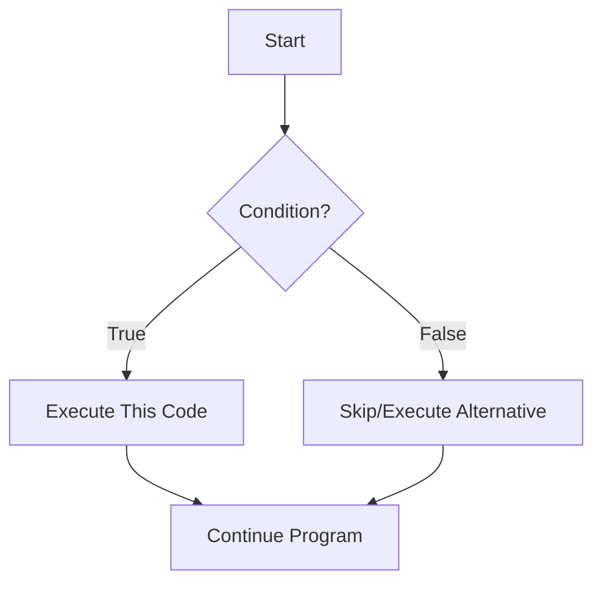
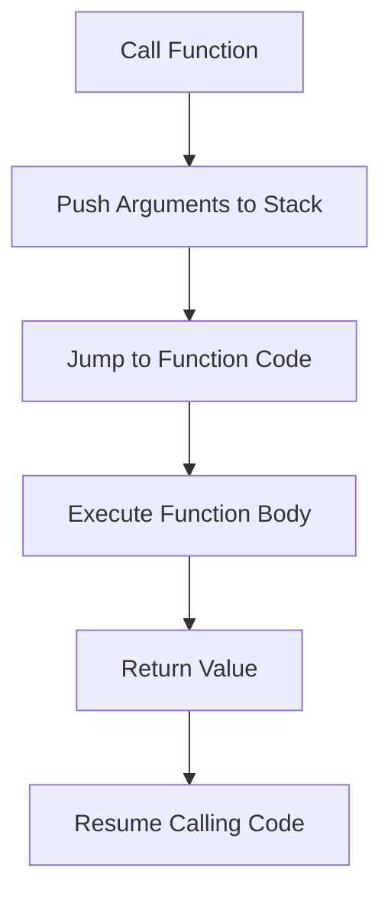
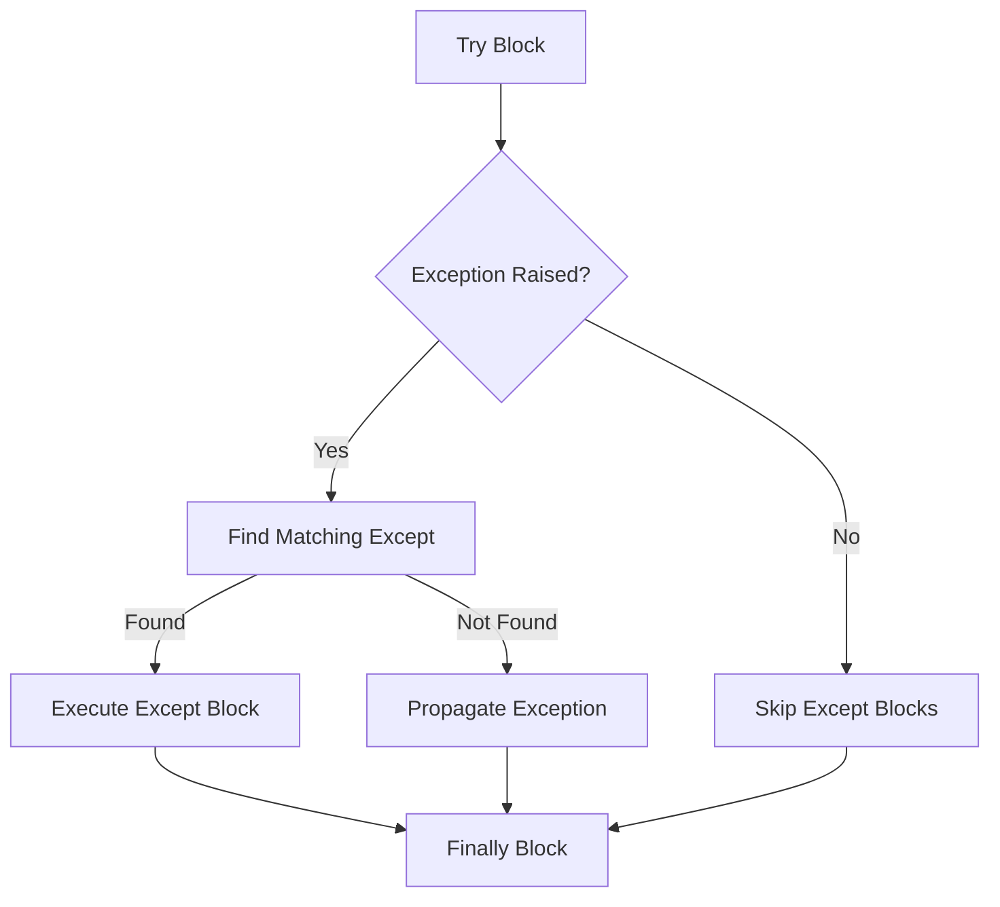

Hey there! Ready to dive into Python? Think of Python as that super helpful friend who's good at almost everything—from data analysis to web development, AI to automation. Let's get you up and running with the essentials that'll cover about 85% of what you'll use daily.

## Getting Started with Python

First things first, let's get Python installed on your computer:

1. Head over to [python.org](https://python.org) and download the latest version (3.11+ is great)
2. Run the installer (important: check "Add Python to PATH" on Windows!)
3. Verify it worked by opening your terminal or command prompt and typing:

```python
python --version  # Should show something like Python 3.11.4
```

For writing code, you can use:

- **IDLE** (comes with Python)
- **VS Code** (free, powerful, with great Python extensions)
- **PyCharm** (more full-featured IDE)

## The Absolute Basics

Let's start with the foundations:

```python
# This is a comment - Python ignores everything after #

# Variables - containers for storing data
name = "Python Learner"  # A string (text)
age = 25                 # An integer (whole number)
height = 5.9             # A float (decimal number)
is_coding = True         # A boolean (True/False)

# Printing to the console
print("Hello, " + name + "!")  # Output: Hello, Python Learner!
print(f"You are {age} years old")  # f-strings are awesome for formatting!

# Basic math operations
sum_value = 5 + 3    # Addition (8)
diff = 10 - 4        # Subtraction (6)
product = 4 * 5      # Multiplication (20)
quotient = 20 / 4    # Division (5.0) - always returns a float
power = 2 ** 3       # Exponentiation (8)
remainder = 10 % 3   # Modulus/remainder (1)

# Input from user
favorite_language = input("What's your favorite programming language? ")
print(f"Really? {favorite_language} is my favorite too!")
```

## Control Flow: Making Decisions

```python
# If-Else statements
mood = "happy"

if mood == "happy":
    print("That's great!")
elif mood == "tired":
    print("Get some rest!")
else:
    print("Whatever you feel, it's valid.")

# While loops - repeat until a condition is met
count = 0
while count < 5:
    print(f"Count is {count}")
    count += 1  # Same as count = count + 1
    # Output: Count is 0, 1, 2, 3, 4

# For loops - iterate over a sequence
fruits = ["apple", "banana", "cherry"]
for fruit in fruits:
    print(f"I like {fruit}s")
    # Output: I like apples, I like bananas, I like cherrys

# Range - generate a sequence of numbers
for i in range(3):  # 0, 1, 2
    print(i)
```

Let's visualize control flow:



## Data Structures: Managing Collections

```python
# Lists - ordered, changeable collections
shopping_list = ["milk", "eggs", "bread"]
shopping_list.append("cheese")  # Add to the end
first_item = shopping_list[0]   # Access by index (starts at 0)
shopping_list[1] = "yogurt"     # Modify an item
shopping_list.remove("bread")   # Remove an item

# Slicing lists
numbers = [0, 1, 2, 3, 4, 5]
subset = numbers[1:4]  # Get items from index 1 to 3 (not including 4)
                       # Result: [1, 2, 3]

# Tuples - ordered, unchangeable collections
coordinates = (10.5, 20.8)  # Can't modify after creation
x, y = coordinates          # Unpacking values

# Dictionaries - key-value pairs
person = {
    "name": "Alex",
    "age": 30,
    "skills": ["Python", "SQL", "Problem-solving"]
}
print(person["name"])  # Access by key
person["location"] = "New York"  # Add new key-value pair

# Sets - unordered collections of unique items
unique_numbers = {1, 2, 3, 3, 2, 1}  # Result: {1, 2, 3}
```

## Functions: Code Reusability

```python
# Basic function
def greet(name):
    """This function greets the person passed in as a parameter."""
    return f"Hello, {name}!"

# Call the function
message = greet("Friend")
print(message)  # Output: Hello, Friend!

# Function with default parameter
def power(base, exponent=2):
    """Raises base to the power of exponent."""
    return base ** exponent

print(power(3))     # Output: 9 (3^2)
print(power(2, 3))  # Output: 8 (2^3)

# *args and **kwargs for variable number of arguments
def make_pizza(size, *toppings, **preferences):
    """Makes a pizza with the given specifications."""
    print(f"Making a {size}-inch pizza with toppings:")
    for topping in toppings:
        print(f"- {topping}")
    if preferences:
        print("Special preferences:")
        for key, value in preferences.items():
            print(f"- {key}: {value}")

make_pizza("12", "cheese", "mushrooms", "pepperoni",
           crust="thin", extra_cheese=True)
```

Let's visualize function execution:



## Modules and Packages: Using Others' Code

```python
# Importing built-in modules
import math
print(math.sqrt(16))  # Output: 4.0

# Importing specific functions
from random import randint
random_number = randint(1, 10)  # Random integer between 1 and 10

# Importing with an alias
import datetime as dt
current_date = dt.datetime.now()

# Creating your own module (in file_operations.py)
# def read_file(filename):
#     with open(filename, 'r') as f:
#         return f.read()
#
# def write_file(filename, content):
#     with open(filename, 'w') as f:
#         f.write(content)

# Then in your main file:
# import file_operations
# content = file_operations.read_file('data.txt')
```

## File Operations: Reading and Writing Data

```python
# Writing to a file
with open('example.txt', 'w') as file:
    file.write("Hello, Python world!\n")
    file.write("This is a second line of text.")

# Reading from a file
with open('example.txt', 'r') as file:
    content = file.read()
    print(content)  # Prints all content at once

# Reading line by line
with open('example.txt', 'r') as file:
    for line in file:
        print(line.strip())  # strip() removes whitespace like newlines

# Working with CSV files
import csv

# Writing CSV
with open('data.csv', 'w', newline='') as file:
    writer = csv.writer(file)
    writer.writerow(["Name", "Age", "City"])
    writer.writerow(["Alice", 25, "New York"])
    writer.writerow(["Bob", 30, "San Francisco"])

# Reading CSV
with open('data.csv', 'r') as file:
    reader = csv.reader(file)
    for row in reader:
        print(row)  # Each row is a list
```

## Error Handling: Dealing with Mistakes

```python
# Basic try-except
try:
    number = int(input("Enter a number: "))
    result = 10 / number
    print(f"10 divided by {number} is {result}")
except ValueError:
    print("That's not a valid number!")
except ZeroDivisionError:
    print("You can't divide by zero!")
except:
    print("Something else went wrong")
finally:
    print("This runs no matter what")

# Raising exceptions
def verify_age(age):
    if age < 0:
        raise ValueError("Age cannot be negative")
    if age > 150:
        raise ValueError("Are you sure about that age?")
    return f"Age verified: {age}"

try:
    print(verify_age(200))
except ValueError as error:
    print(f"Error: {error}")
```

Let's visualize exception handling:



## Object-Oriented Programming: Creating Your Own Types

```python
# Defining a class
class Dog:
    # Class attribute
    species = "Canis familiaris"

    # Initializer / Constructor
    def __init__(self, name, age):
        self.name = name  # Instance attribute
        self.age = age    # Instance attribute

    # Instance method
    def bark(self):
        return f"{self.name} says Woof!"

    # Another instance method
    def birthday(self):
        self.age += 1
        return f"{self.name} is now {self.age} years old!"

# Creating instances of a class
buddy = Dog("Buddy", 5)
miles = Dog("Miles", 3)

print(buddy.name)  # Output: Buddy
print(miles.bark())  # Output: Miles says Woof!
print(buddy.birthday())  # Output: Buddy is now 6 years old!

# Inheritance - creating a subclass
class Bulldog(Dog):
    def bark(self):  # Override the bark method
        return f"{self.name} says WOOF WOOF!"

    def snore(self):  # Add a new method
        return f"{self.name} is snoring... Zzz..."

rocky = Bulldog("Rocky", 4)
print(rocky.bark())  # Output: Rocky says WOOF WOOF!
print(rocky.snore())  # Output: Rocky is snoring... Zzz...
```

## Essential Libraries: Standing on Giants' Shoulders

### NumPy: Numerical Computing

```python
# Install with: pip install numpy
import numpy as np

# Create arrays
arr = np.array([1, 2, 3, 4, 5])
print(arr * 2)  # Output: [2 4 6 8 10]

# Multi-dimensional arrays
matrix = np.array([[1, 2, 3], [4, 5, 6], [7, 8, 9]])
print(matrix.shape)  # Output: (3, 3)

# Math operations
print(np.mean(arr))  # Output: 3.0
print(np.std(arr))   # Standard deviation
```

### Pandas: Data Analysis

```python
# Install with: pip install pandas
import pandas as pd

# Create a DataFrame
data = {
    'Name': ['Alice', 'Bob', 'Charlie'],
    'Age': [25, 30, 35],
    'City': ['New York', 'San Francisco', 'Boston']
}
df = pd.DataFrame(data)
print(df)

# Reading from CSV
# df = pd.read_csv('data.csv')

# Basic operations
print(df['Age'].mean())  # Average age
print(df[df['Age'] > 25])  # Filter rows

# Groupby
result = df.groupby('City').mean()
print(result)
```

### Matplotlib: Data Visualization

```python
# Install with: pip install matplotlib
import matplotlib.pyplot as plt

# Simple line plot
x = [0, 1, 2, 3, 4]
y = [0, 1, 4, 9, 16]

plt.plot(x, y)
plt.title('Square Numbers')
plt.xlabel('x')
plt.ylabel('x²')
plt.show()  # This displays the plot
```

## The Last 15%: What Awaits You Next

Congratulations! You've just learned about 85% of what you'll regularly use in Python. Here's what's waiting for you to explore next:

1. **Advanced OOP Concepts**: Metaclasses, abstract base classes, descriptors, and protocols
2. **Concurrency and Parallelism**: Threading, multiprocessing, async/await
3. **Web Development**:
   - Flask or Django for web applications
   - FastAPI for APIs
4. **Data Science Deeper Dive**:
   - Scikit-learn for machine learning
   - TensorFlow or PyTorch for deep learning
5. **Testing Frameworks**: pytest, unittest
6. **Packaging and Distribution**: Creating your own packages, PyPI publishing
7. **Performance Optimization**: Profiling, Cython
8. **Design Patterns**: Implementing common patterns in Python
9. **Advanced Python Concepts**:
   - Decorators
   - Context managers
   - Generators and iterators
   - Functional programming features

To explore these areas, the foundation you've learned today will serve you well. Start with topics that interest you most, and remember that Python's official documentation is excellent.

Feel free to practice with small projects that interest you—maybe a weather app, a personal finance tracker, or automating a repetitive task. The hands-on experience will solidify what you've learned and naturally lead you into the 15% as needed.

Happy coding! 🐍
