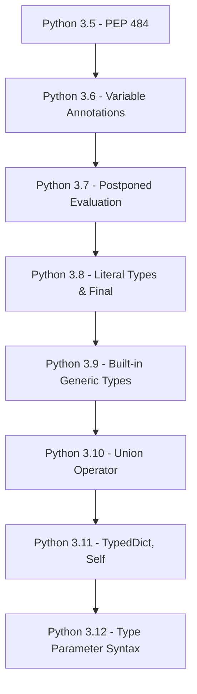

Hey there! Let's dive into Python static typing over our virtual coffee today. By the end of this guide, you'll be comfortable with 85% of the static typing you'll encounter day-to-day, with enough knowledge to explore that final 15% on your own!

## What is Static Typing and Why Should I Care?

Python is traditionally a dynamically typed language, meaning variable types are determined at runtime. Static typing, on the other hand, lets us declare the types of variables and function parameters ahead of time.

```python
# Dynamic typing (traditional Python)
x = 5        # x is an integer
x = "hello"  # Now x is a string - this is totally fine in regular Python!

# Static typing (with type hints)
x: int = 5        # x is explicitly an integer
x: str = "hello"  # This would generate a type error with a type checker
```

**Benefits of static typing:**

- Catches type-related bugs early
- Improves code readability
- Better IDE support (autocomplete, refactoring)
- Makes code easier to maintain, especially for larger projects
- Helps document your code's intent

## The Evolution of Python's Type System



## Getting Started with Type Checking

First, let's install Pyright, Microsoft's powerful type checker:

```bash
# Install with pip
pip install pyright

# If you're using npm/Node.js, you can also install globally
npm install -g pyright
```

To check your code:

```bash
# Check a single file
pyright your_script.py

# Check an entire directory
pyright your_directory

# Check with verbose output
pyright --verbose your_script.py
```

Pyright is much faster than other type checkers, which is great when working with larger codebases. It's also the engine behind VS Code's Python type checking!

## Basic Type Annotations

### Variable Annotations

```python
name: str = "Alice"         # String
age: int = 30               # Integer
height: float = 5.7         # Float
is_student: bool = True     # Boolean
nothing: None = None        # None
```

### Function Parameters and Return Types

```python
def greet(name: str) -> str:
    return f"Hello, {name}!"

# Multiple parameters
def calculate_total(price: float, quantity: int) -> float:
    return price * quantity

# With default values
def power(base: int, exponent: int = 2) -> int:
    return base ** exponent

# The result of calling these functions:
greeting = greet("Bob")     # greeting: str = "Hello, Bob!"
total = calculate_total(9.99, 3)  # total: float = 29.97
squared = power(5)          # squared: int = 25
cubed = power(5, 3)         # cubed: int = 125
```

## Complex Type Annotations

### Collection Types

```python
from typing import List, Dict, Tuple, Set

# Lists (homogeneous)
numbers: List[int] = [1, 2, 3]

# Dictionaries
user_ages: Dict[str, int] = {"Alice": 25, "Bob": 30}

# Tuples with fixed size
coordinates: Tuple[float, float] = (34.0522, -118.2437)  # Latitude, longitude

# Tuples with variable size
numbers_sequence: Tuple[int, ...] = (1, 2, 3, 4, 5)

# Sets
unique_ids: Set[int] = {1, 2, 3}
```

In Python 3.9+, you can use built-in collection types instead:

```python
# Python 3.9+ syntax
numbers: list[int] = [1, 2, 3]
user_ages: dict[str, int] = {"Alice": 25, "Bob": 30}
coordinates: tuple[float, float] = (34.0522, -118.2437)
unique_ids: set[int] = {1, 2, 3}
```

### Optional Types

For values that might be None:

```python
from typing import Optional

# A user's middle name might not exist
middle_name: Optional[str] = None  # Either str or None

# Function that might return None
def find_user(user_id: int) -> Optional[dict]:
    # Implementation that might return None if user not found
    if user_id == 42:
        return {"name": "Douglas Adams", "id": 42}
    return None

# Using the function
user = find_user(42)
if user is not None:  # Always check before using Optional values
    print(user["name"])  # Safe to access
```

### Union Types

For values that can be multiple types:

```python
from typing import Union

# A function parameter that accepts either an int or a string
def process_id(user_id: Union[int, str]) -> str:
    # Convert to string if it's an integer
    if isinstance(user_id, int):
        return f"ID-{user_id}"
    return user_id  # Already a string

# Usage examples
result1 = process_id(123)    # result1: str = "ID-123"
result2 = process_id("ABC")  # result2: str = "ABC"
```

In Python 3.10+, you can use the pipe operator for unions:

```python
# Python 3.10+ syntax
def process_id(user_id: int | str) -> str:
    # Same implementation as above
    pass
```

## Type Aliases and Custom Types

Creating your own type definitions makes complex types more readable:

```python
from typing import Dict, List, TypedDict, NewType

# Type alias - simple name for a complex type
UserId = int
UserDict = Dict[UserId, str]

users: UserDict = {
    42: "Douglas Adams",
    1: "Arthur Dent"
}

# More complex alias
Coordinates = tuple[float, float]
Route = list[Coordinates]

trip: Route = [
    (40.7128, -74.0060),  # New York
    (34.0522, -118.2437)  # Los Angeles
]

# TypedDict - for dictionaries with a specific schema
class UserProfile(TypedDict):
    name: str
    age: int
    is_active: bool

# Now you can use this as a type
user_profile: UserProfile = {
    "name": "Alice",
    "age": 30,
    "is_active": True
}

# NewType - creates a distinct type for added type safety
UserId = NewType('UserId', int)
admin_id = UserId(42)  # This is treated as a unique type, not just an int
```

## Generics

Generics let you write functions and classes that work with any type, while preserving type safety:

```python
from typing import TypeVar, Generic, List

# Define a type variable
T = TypeVar('T')

# Generic function
def first_element(collection: List[T]) -> T:
    return collection[0]

# Use it with different types
num = first_element([1, 2, 3])  # num: int = 1
name = first_element(["Alice", "Bob"])  # name: str = "Alice"

# Generic class
class Box(Generic[T]):
    def __init__(self, item: T):
        self.item = item

    def get_item(self) -> T:
        return self.item

# Use it with different types
int_box = Box(42)  # int_box.item: int = 42
str_box = Box("hello")  # str_box.item: str = "hello"
```

## Handling Any and Mixed Types

Sometimes you need more flexibility:

```python
from typing import Any, List

# The Any type bypasses type checking - use sparingly!
def process_data(data: Any) -> None:
    # This function accepts any type
    print(data)

# A mixed-type list
mixed_list: List[Any] = [1, "two", 3.0, True]

# A better alternative when you know the possible types
mixed_list2: List[Union[int, str, float, bool]] = [1, "two", 3.0, True]
```

## Type Checking in Practice

Let's see a complete example and how Pyright finds errors:

```python
# save as inventory.py
from typing import Dict, List, Optional

# Inventory item
class Item:
    def __init__(self, name: str, price: float, quantity: int = 0):
        self.name = name
        self.price = price
        self.quantity = quantity

    def total_value(self) -> float:
        return self.price * self.quantity

# Inventory management
class Inventory:
    def __init__(self):
        self.items: Dict[str, Item] = {}

    def add_item(self, item: Item) -> None:
        self.items[item.name] = item

    def get_item(self, name: str) -> Optional[Item]:
        return self.items.get(name)

    def total_inventory_value(self) -> float:
        return sum(item.total_value() for item in self.items.values())

# Usage
inventory = Inventory()
inventory.add_item(Item("Widget", 19.99, 10))
inventory.add_item(Item("Gadget", 29.99, 5))

# This would cause a type error in Pyright:
# inventory.add_item("Not an item")  # Error: Argument of type "str" cannot be assigned to parameter "item" of type "Item"

widget = inventory.get_item("Widget")
if widget:  # Always check Optional values before use
    print(f"Widget value: ${widget.total_value():.2f}")

total = inventory.total_inventory_value()
print(f"Total inventory value: ${total:.2f}")
```

Run Pyright to check for errors:

```bash
$ pyright inventory.py
# If successful: "No errors reported"
```

## Configuring Pyright

You can create a `pyrightconfig.json` file in your project root to customize Pyright's behavior:

```json
{
  "include": ["src"],
  "exclude": ["**/node_modules", "**/__pycache__"],
  "reportMissingImports": true,
  "reportMissingTypeStubs": false,
  "pythonVersion": "3.10",
  "typeCheckingMode": "basic"
}
```

For more detailed settings, you can use `strict` mode:

```json
{
  "typeCheckingMode": "strict"
}
```

## Using Type Comments for Legacy Python

If you're working with Python 3.5 or older:

```python
# Type comments for variables
x = 5  # type: int
names = ["Alice", "Bob"]  # type: List[str]

# Type comments for functions
def greet(name):
    # type: (str) -> str
    return f"Hello, {name}!"
```

## IDE Integration

Pyright is integrated fantastically with modern IDEs:

- **VS Code**: Built into the Python extension (Microsoft made both!)
- **PyCharm**: Can be configured as an external tool
- **Vim/Neovim**: Works with various LSP plugins

In VS Code, it just works out of the box with the Python extension. You'll see errors highlighted as you type:

```python
def greet(name: str) -> str:
    return name * 5  # VS Code will warn: Expected to return str, got int
```

## Common Type Checking Patterns

### Conditional Types

```python
from typing import overload, Union

# Overloaded function with different return types
@overload
def process(value: int) -> int: ...

@overload
def process(value: str) -> str: ...

# Actual implementation
def process(value: Union[int, str]) -> Union[int, str]:
    if isinstance(value, int):
        return value * 2
    return value.upper()
```

### Working with `*args` and `**kwargs`

```python
from typing import Any, Dict, Tuple

def dynamic_function(*args: int, **kwargs: str) -> None:
    # args is a tuple of ints
    # kwargs is a dict of str values
    pass

# More flexible version
def flexible_function(*args: Any, **kwargs: Any) -> None:
    pass
```

## Pyright-Specific Features

Pyright has some neat features that set it apart:

### Watch Mode

```bash
# Continuously watch files for changes
pyright --watch
```

### Type Completion

Pyright can generate completions for type annotations, which works especially well in VS Code.

### Performance with Large Codebases

Pyright is notably faster than other type checkers, making it ideal for large projects. It uses incremental analysis to only check files that have changed.

### Strict Class Checking

Pyright can enforce that all class attributes are defined in `__init__` with:

```json
{
  "reportUninitializedInstanceVariable": true
}
```

## The Final 15%: What's Left to Explore

Here's a summary of advanced typing concepts to explore next:

1. **Protocols and Structural Typing**

   - Define interfaces based on structure rather than inheritance

2. **Literal Types**

   - Specific literal values as types

3. **Type Variables with Constraints**

   - Limit what types can be used with your generics

4. **Callable Types**

   - Types for functions and callables

5. **Type Guards and Narrowing**

   - Custom functions that help type checking

6. **Covariance and Contravariance**

   - Typing relationships for subclasses

7. **Final and Constant Types**

   - For immutable values

8. **Self Types**

   - For method return types that return the class itself

9. **Advanced Pyright Configuration**

   - Tuning strictness levels for different parts of your codebase

10. **Pyright-Specific Error Suppression**

    - Using `# pyright: ignore` comments for false positives

11. **Partial Type Checking**

    - Checking only certain files or directories

12. **Inlay Hints in VS Code**

    - Seeing inferred types right in your editor

13. **Runtime Type Checking**

    - Libraries like typeguard, pydantic

14. **Typing Extensions**

    - For the latest typing features

15. **Stubs and Type Hints for Third-Party Libraries**
    - Using and creating type stubs

## Final Thoughts

Static typing in Python is opt-in and gradual – you can add it where it's most valuable without changing your entire codebase at once. Pyright makes this process smoother with its speed and VS Code integration.

Remember these key practices:

- Add types to function signatures first – that's where they provide the most value
- Run Pyright regularly to catch type issues early
- Don't overuse `Any` – it defeats the purpose of type checking
- Start simple and add more complex types as you get comfortable
- Use VS Code for the best Pyright experience

Happy typing! Let me know if you want to explore any of these concepts in more depth over our next coffee chat!
