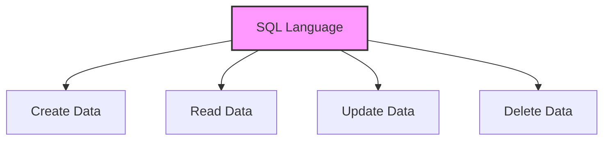
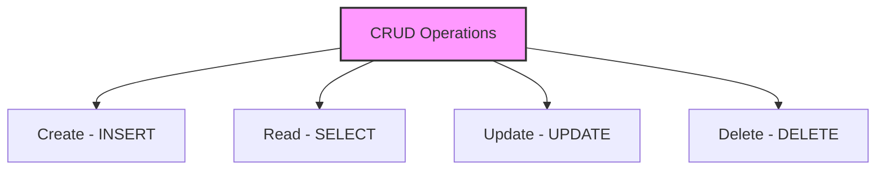
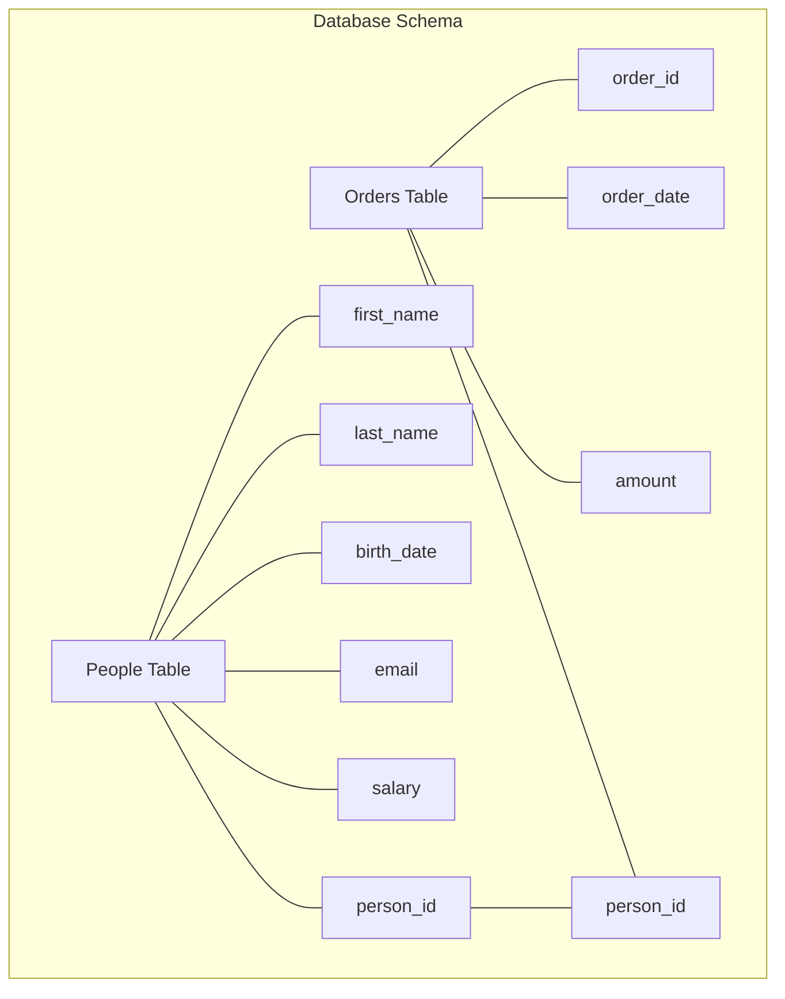
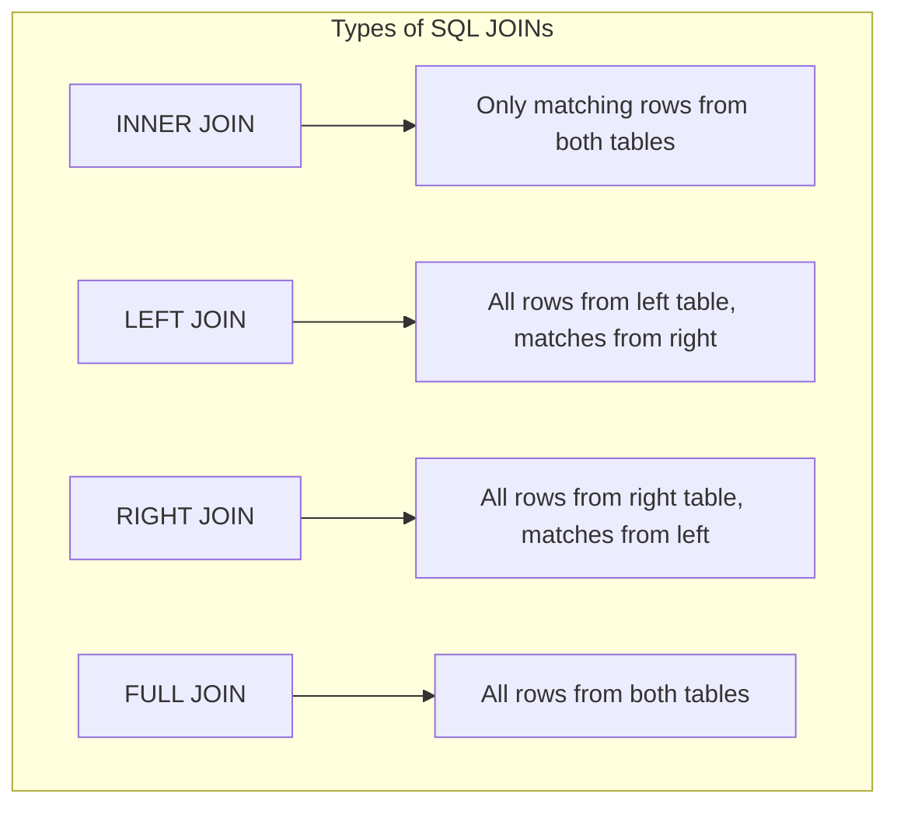
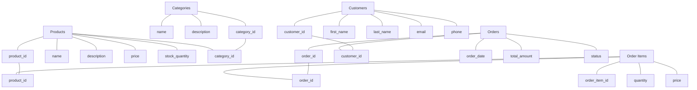
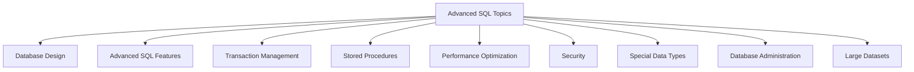

# SQL Crash Course: The Essential 85%

Welcome to your SQL crash course! SQL (Structured Query Language) is the standard language for working with relational databases. This guide will equip you with the core SQL skills covering 85% of daily database tasks while building a foundation for exploring the more advanced features.

## What is SQL and Why Learn It?

SQL allows you to create, read, update, and delete data in relational databases. It's used in nearly every industry for storing application data, performing data analysis, generating business intelligence reports, and managing large datasets efficiently. Learning SQL gives you direct access to data without depending on other tools or people.



## Setting Up Your SQL Environment

Before diving into SQL commands, you'll need access to a database system where you can practice. Here are two straightforward options:

### Option 1: Use an Online SQL Playground (Quickest)

For immediate practice without installation:

- [W3Schools SQL Tryit Editor](https://www.w3schools.com/sql/trysql.asp)
- [SQLFiddle](http://sqlfiddle.com/)

These online environments come pre-loaded with sample databases, making them perfect for beginners.

### Option 2: Install PostgreSQL (Recommended)

PostgreSQL is a powerful, free, open-source database system that works across all major platforms:

1. **Download and Install:**

   ```bash
   # For Windows/Mac: Download from https://www.postgresql.org/download/

   # For Ubuntu/Debian Linux:
   sudo apt update
   sudo apt install postgresql postgresql-contrib

   # Start the service
   sudo systemctl start postgresql
   ```

2. **Connect to PostgreSQL:**

   ```bash
   # Access the PostgreSQL command line
   sudo -u postgres psql

   # Create a new database
   CREATE DATABASE sql_course;

   # Connect to your new database
   \c sql_course
   ```

Once you have access to a database system, you're ready to start writing SQL commands.

## Creating Your First Database and Table

Let's begin by creating a practical table to store information about people. This example will introduce several key SQL concepts:

```sql
-- Create a table to store information about people
CREATE TABLE people (
    person_id SERIAL PRIMARY KEY,  -- Auto-incrementing unique ID
    first_name VARCHAR(50) NOT NULL,  -- Text that cannot be empty
    last_name VARCHAR(50) NOT NULL,
    birth_date DATE,  -- Date type
    email VARCHAR(100) UNIQUE,  -- Must be unique across all records
    salary DECIMAL(10,2),  -- Numeric with 2 decimal places
    is_active BOOLEAN DEFAULT TRUE  -- Boolean with default value
);
```

The above code creates a table with columns of different data types and constraints:

- `SERIAL PRIMARY KEY`: Auto-incrementing unique identifier
- `VARCHAR`: Text of variable length
- `NOT NULL`: Column must have a value
- `UNIQUE`: Value must not appear elsewhere in the column
- `DEFAULT`: Provides a default value if none is specified

Tables form the foundation of your database structure, and designing them well is crucial for building efficient applications.

## The CRUD Operations: Working with Data

Now that we have a table, let's learn how to work with the data inside it. CRUD stands for Create, Read, Update, and Delete - the four fundamental operations in database management.



### 1. Create: Adding Data with INSERT

First, let's populate our table with some records using the INSERT statement:

```sql
-- Insert a single person
INSERT INTO people (first_name, last_name, birth_date, email, salary)
VALUES ('John', 'Smith', '1990-05-15', 'john.smith@example.com', 65000.00);

-- Insert multiple people at once
INSERT INTO people (first_name, last_name, birth_date, email, salary)
VALUES
    ('Jane', 'Doe', '1985-11-30', 'jane.doe@example.com', 72000.00),
    ('Michael', 'Johnson', '1992-08-12', 'michael.j@example.com', 58000.00),
    ('Lisa', 'Brown', '1988-03-24', 'lisa.brown@example.com', 67500.00);
```

Notice how you can insert a single row or multiple rows in one command, which is much more efficient when adding larger sets of data.

### 2. Read: Retrieving Data with SELECT

The SELECT statement is the workhorse of SQL - you'll use it constantly to retrieve and analyze your data.

```sql
-- Select all columns and rows
SELECT * FROM people;

-- Select specific columns
SELECT first_name, last_name, email FROM people;

-- Filter results with WHERE
SELECT * FROM people WHERE birth_date > '1990-01-01';

-- Sort results
SELECT * FROM people ORDER BY last_name ASC;

-- Limit the number of results
SELECT * FROM people LIMIT 10;
```

The real power of SELECT comes when you combine multiple clauses to pinpoint exactly the data you need.

#### Using WHERE with Multiple Conditions

```sql
-- Find active employees with salary above 60000
SELECT * FROM people
WHERE is_active = TRUE AND salary > 60000;

-- Find people born in the 80s OR with email from example.com
SELECT * FROM people
WHERE (birth_date BETWEEN '1980-01-01' AND '1989-12-31')
   OR email LIKE '%@example.com';
```

The WHERE clause uses logical operators (AND, OR, NOT) and comparison operators (=, >, <, >=, <=, !=) to filter your results precisely.

### 3. Update: Modifying Data with UPDATE

As your data changes over time, you'll need to update existing records:

```sql
-- Update a single record
UPDATE people
SET salary = 70000.00
WHERE person_id = 1;

-- Update multiple columns at once
UPDATE people
SET
    salary = salary * 1.05,  -- 5% raise
    is_active = FALSE
WHERE birth_date < '1990-01-01';
```

Always remember to include a WHERE clause with your UPDATE statements. Without it, the changes will apply to all records in the table!

### 4. Delete: Removing Data with DELETE

Sometimes you need to remove records that are no longer relevant:

```sql
-- Delete a specific record
DELETE FROM people
WHERE person_id = 3;

-- Delete multiple records
DELETE FROM people
WHERE is_active = FALSE;

-- Delete all records (use with caution!)
DELETE FROM people;
```

Like UPDATE, DELETE should almost always include a WHERE clause to target specific records. The last example above would empty your entire table, so use it carefully.

## Working with Multiple Tables

Real-world databases rarely consist of a single table. Instead, data is organized into multiple related tables to avoid redundancy and maintain integrity. Let's add an "orders" table related to our "people" table:

```sql
-- Create a table for orders with a relationship to people
CREATE TABLE orders (
    order_id SERIAL PRIMARY KEY,
    order_date DATE NOT NULL DEFAULT CURRENT_DATE,
    amount DECIMAL(10,2) NOT NULL,
    person_id INTEGER,
    FOREIGN KEY (person_id) REFERENCES people(person_id)
);

-- Add some sample orders
INSERT INTO orders (amount, person_id)
VALUES
    (150.75, 1),  -- Order for John
    (89.99, 1),   -- Another order for John
    (299.50, 2),  -- Order for Jane
    (49.99, 4),   -- Order for Lisa
    (75.25, 2);   -- Another order for Jane
```

The relationship is created with `FOREIGN KEY (person_id) REFERENCES people(person_id)`, which ensures that all orders are connected to existing people. This maintains what's called "referential integrity" - preventing orphaned records.



### Joining Tables

The real power of relational databases emerges when you combine data from multiple tables using JOINs:

```sql
-- INNER JOIN: Only matches from both tables
SELECT
    p.first_name,
    p.last_name,
    o.order_date,
    o.amount
FROM people p
INNER JOIN orders o ON p.person_id = o.person_id;
-- Result: Only people who have placed orders

-- LEFT JOIN: All people, even those without orders
SELECT
    p.first_name,
    p.last_name,
    o.order_date,
    o.amount
FROM people p
LEFT JOIN orders o ON p.person_id = o.person_id;
-- Result: All people, with NULL values for those without orders
```

Notice how we use table aliases (p for people, o for orders) to make the query more readable. Different types of joins serve different analytical purposes:



## Aggregating Data

Beyond simple retrieval, SQL shines in its ability to analyze and summarize data through aggregation functions:

```sql
-- Count total number of people
SELECT COUNT(*) FROM people;

-- Calculate average salary
SELECT AVG(salary) FROM people;

-- Find minimum and maximum values
SELECT
    MIN(salary) AS lowest_salary,
    MAX(salary) AS highest_salary
FROM people;

-- Group data and count items in each group
SELECT
    EXTRACT(YEAR FROM birth_date) AS birth_year,
    COUNT(*) AS number_of_people,
    AVG(salary) AS average_salary
FROM people
GROUP BY birth_year
ORDER BY birth_year;
```

The GROUP BY clause is particularly powerful, allowing you to segment your data and perform calculations on each group separately. This forms the foundation of data analysis in SQL.

## Working with Dates and Time

Dates and times often require special handling in databases. SQL provides numerous functions to manipulate and extract information from date values:

```sql
-- Extract parts of dates
SELECT
    first_name,
    last_name,
    birth_date,
    EXTRACT(YEAR FROM birth_date) AS year,
    EXTRACT(MONTH FROM birth_date) AS month,
    EXTRACT(DAY FROM birth_date) AS day
FROM people;

-- Calculate age
SELECT
    first_name,
    last_name,
    birth_date,
    AGE(CURRENT_DATE, birth_date) AS age
FROM people;

-- Filter by date ranges
SELECT * FROM orders
WHERE order_date BETWEEN '2023-01-01' AND '2023-12-31';
```

These date functions become especially valuable when analyzing time-based data, detecting trends, or creating reports for specific periods.

## Practical Example: Creating a Complete Database

Now let's apply everything we've learned to build a more realistic database for an e-commerce system. This example incorporates multiple related tables and demonstrates best practices for database design:

```sql
-- Create tables for a simple e-commerce database
CREATE TABLE categories (
    category_id SERIAL PRIMARY KEY,
    name VARCHAR(50) NOT NULL,
    description TEXT
);

CREATE TABLE products (
    product_id SERIAL PRIMARY KEY,
    name VARCHAR(100) NOT NULL,
    description TEXT,
    price DECIMAL(10,2) NOT NULL,
    stock_quantity INTEGER NOT NULL DEFAULT 0,
    category_id INTEGER REFERENCES categories(category_id)
);

CREATE TABLE customers (
    customer_id SERIAL PRIMARY KEY,
    first_name VARCHAR(50) NOT NULL,
    last_name VARCHAR(50) NOT NULL,
    email VARCHAR(100) UNIQUE NOT NULL,
    phone VARCHAR(20),
    created_at TIMESTAMP DEFAULT CURRENT_TIMESTAMP
);

CREATE TABLE orders (
    order_id SERIAL PRIMARY KEY,
    customer_id INTEGER REFERENCES customers(customer_id),
    order_date TIMESTAMP DEFAULT CURRENT_TIMESTAMP,
    total_amount DECIMAL(10,2) NOT NULL,
    status VARCHAR(20) DEFAULT 'pending'
);

CREATE TABLE order_items (
    order_item_id SERIAL PRIMARY KEY,
    order_id INTEGER REFERENCES orders(order_id),
    product_id INTEGER REFERENCES products(product_id),
    quantity INTEGER NOT NULL,
    price DECIMAL(10,2) NOT NULL
);
```

This schema uses foreign keys throughout to maintain relationships between entities. The diagram below illustrates how these tables connect:



### Seed Data Script

To test our database, we need some initial data. Here's a seed script to populate all tables:

```sql
-- Seed script for testing the e-commerce database

-- Add categories
INSERT INTO categories (name, description)
VALUES
    ('Electronics', 'Electronic devices and accessories'),
    ('Books', 'Books and e-books'),
    ('Clothing', 'Apparel and accessories'),
    ('Home & Kitchen', 'Home goods and kitchenware');

-- Add products
INSERT INTO products (name, description, price, stock_quantity, category_id)
VALUES
    ('Smartphone', 'Latest model smartphone with advanced features', 699.99, 25, 1),
    ('Laptop', 'High-performance laptop for work and gaming', 1299.99, 15, 1),
    ('Wireless Headphones', 'Noise cancelling wireless headphones', 199.99, 30, 1),
    ('SQL Programming Guide', 'Comprehensive guide to SQL programming', 49.99, 50, 2),
    ('T-shirt', 'Cotton t-shirt, available in multiple colors', 19.99, 100, 3),
    ('Jeans', 'Classic fit denim jeans', 59.99, 75, 3),
    ('Coffee Maker', 'Programmable coffee maker with timer', 89.99, 20, 4),
    ('Cookware Set', '10-piece non-stick cookware set', 149.99, 10, 4);

-- Add customers
INSERT INTO customers (first_name, last_name, email, phone)
VALUES
    ('Sarah', 'Johnson', 'sarah.j@example.com', '555-1234'),
    ('Robert', 'Williams', 'robert.w@example.com', '555-5678'),
    ('Emily', 'Brown', 'emily.b@example.com', '555-9012'),
    ('David', 'Jones', 'david.j@example.com', '555-3456');

-- Add orders
INSERT INTO orders (customer_id, total_amount, status)
VALUES
    (1, 749.98, 'completed'),
    (1, 199.99, 'shipped'),
    (2, 1349.98, 'completed'),
    (3, 109.98, 'processing'),
    (4, 239.98, 'pending');

-- Add order items
INSERT INTO order_items (order_id, product_id, quantity, price)
VALUES
    (1, 1, 1, 699.99),  -- Sarah bought a smartphone
    (1, 4, 1, 49.99),   -- Sarah bought a SQL book
    (2, 3, 1, 199.99),  -- Sarah bought headphones
    (3, 2, 1, 1299.99), -- Robert bought a laptop
    (3, 4, 1, 49.99),   -- Robert bought a SQL book
    (4, 5, 2, 19.99),   -- Emily bought 2 t-shirts
    (4, 6, 1, 59.99),   -- Emily bought jeans
    (5, 7, 1, 89.99),   -- David bought a coffee maker
    (5, 5, 3, 19.99);   -- David bought 3 t-shirts
```

## Complex Querying: Putting It All Together

With our e-commerce database in place, we can now write complex queries that demonstrate the true power of SQL. These examples combine multiple concepts we've covered:

```sql
-- Find the top 3 customers by total amount spent
SELECT
    c.customer_id,
    c.first_name,
    c.last_name,
    SUM(o.total_amount) AS total_spent
FROM customers c
JOIN orders o ON c.customer_id = o.customer_id
GROUP BY c.customer_id, c.first_name, c.last_name
ORDER BY total_spent DESC
LIMIT 3;

-- Find the most popular product category
SELECT
    cat.name AS category_name,
    COUNT(oi.order_item_id) AS times_ordered,
    SUM(oi.quantity) AS total_quantity_sold
FROM categories cat
JOIN products p ON cat.category_id = p.category_id
JOIN order_items oi ON p.product_id = oi.product_id
GROUP BY cat.category_id, cat.name
ORDER BY total_quantity_sold DESC;

-- Find average order value by customer
SELECT
    c.first_name,
    c.last_name,
    COUNT(o.order_id) AS number_of_orders,
    AVG(o.total_amount) AS average_order_value
FROM customers c
JOIN orders o ON c.customer_id = o.customer_id
GROUP BY c.customer_id, c.first_name, c.last_name
ORDER BY average_order_value DESC;

-- Find products that need restocking (stock below 20)
SELECT
    p.name,
    p.stock_quantity,
    cat.name AS category
FROM products p
JOIN categories cat ON p.category_id = cat.category_id
WHERE p.stock_quantity < 20
ORDER BY p.stock_quantity ASC;
```

These queries demonstrate how SQL can transform raw data into actionable business intelligence. They combine filtering, joining, aggregating, and sorting to extract precisely the information needed for decision-making.

## The Missing 15%: Advanced SQL Topics

Now that you understand the core 85% of SQL, here's what makes up the remaining 15% that you can explore on your own:

1. **Database Design and Normalization**

   - Understanding normal forms (1NF through 5NF)
   - Schema design best practices
   - Indexing strategies for performance

2. **Advanced SQL Features**

   - Window functions (ROW_NUMBER(), RANK(), LEAD(), LAG())
   - Common Table Expressions (CTEs) for recursive queries
   - Subqueries and correlated subqueries
   - CASE statements for conditional logic
   - UNION, INTERSECT, and EXCEPT operations

3. **Transaction Management**

   - ACID properties (Atomicity, Consistency, Isolation, Durability)
   - BEGIN, COMMIT, and ROLLBACK
   - Transaction isolation levels

4. **Stored Procedures and Functions**

   - Creating custom functions
   - Stored procedures for business logic
   - Triggers for automated actions

5. **Performance Optimization**

   - Query execution plans
   - Index optimization
   - Query tuning techniques
   - Understanding the database optimizer

6. **Security**

   - User management and permissions
   - Row-level security
   - SQL injection prevention

7. **Working with Special Data Types**

   - JSON and JSONB for semi-structured data
   - Arrays and composite types
   - Full-text search capabilities
   - Geospatial data with PostGIS

8. **Advanced Database Administration**

   - Backup and recovery strategies
   - Replication and high availability
   - Database monitoring and maintenance

9. **Working with Large Datasets**
   - Partitioning strategies
   - Data warehousing concepts
   - OLAP vs. OLTP workloads



## Conclusion

You've now mastered the essential 85% of SQL that you'll use in your day-to-day database interactions. You've learned how to create and manipulate tables, insert and retrieve data, work with relationships between tables, and write complex queries that analyze your data in meaningful ways.

The skills you've acquired form a solid foundation that will serve you well in nearly any data-related role. As you continue your journey, explore the "missing 15%" topics based on your specific needs and interests. Each of these areas opens up new possibilities for working with data more efficiently and effectively.

Remember that SQL is a declarative language—you tell the database what you want, not how to get it. This makes SQL both approachable for beginners and incredibly powerful for experts. Regular practice with real-world data will solidify your understanding and help you develop intuition for structuring queries efficiently.

With the knowledge from this crash course, you're well-equipped to start working with databases in practical applications, analyzing data, and continuing to build your SQL expertise through hands-on experience.

Happy data querying!
