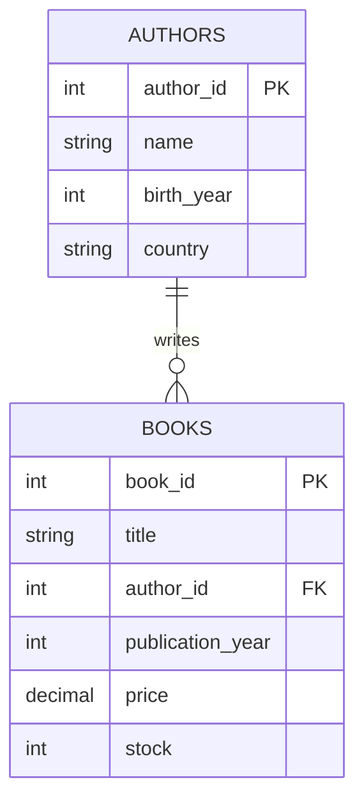
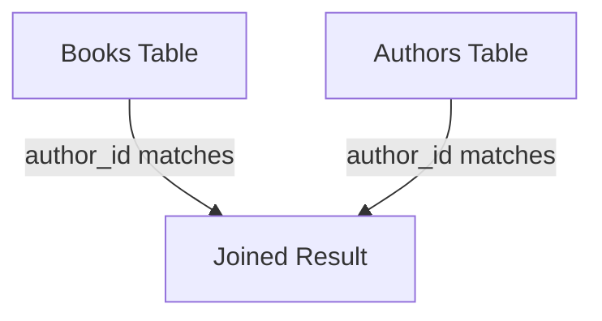
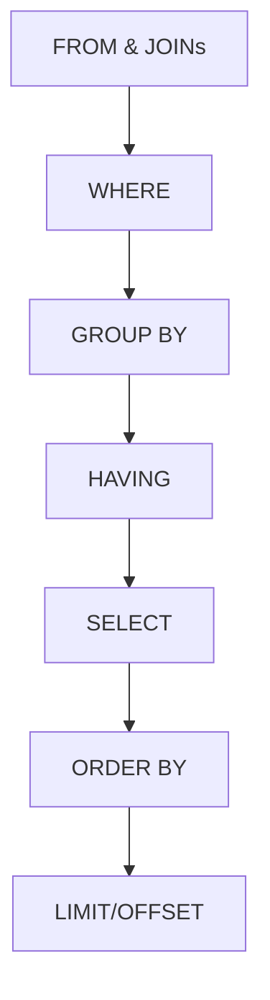

Hey there! So you want to learn SQL? Great choice! SQL (Structured Query Language) is the language we use to talk to databases. Let's get you up to speed with everything you'll need for day-to-day work with databases.

## What is SQL and Why Should You Care?

SQL is how we ask questions to databases and tell them what to do. Think of a database as a collection of spreadsheets (tables) with relationships between them. SQL lets you:

- Find specific information (queries)
- Add new information (inserts)
- Change existing information (updates)
- Remove information (deletes)
- Create structure for your data (tables, relationships)

## Getting Started: Installation

Let's set up a simple database system so you can follow along. We'll use SQLite because it's super easy to get started with.

### Option 1: SQLite (Simplest)

1. Download SQLite from [sqlite.org/download.html](https://sqlite.org/download.html)
2. For Windows, grab the precompiled binaries
3. For Mac: `brew install sqlite`
4. For Linux: `sudo apt-get install sqlite3`

To start using it:

```bash
sqlite3 my_first_database.db
```

### Option 2: MySQL (More Common in Production)

1. Download MySQL Community Server from [dev.mysql.com/downloads](https://dev.mysql.com/downloads/)
2. Install following the wizard
3. Make sure to note your root password during installation
4. Launch MySQL Workbench to have a nice visual interface

## Creating Your First Database

Let's create a simple database for a bookstore:

```sql
-- In SQLite, this creates a new database file
-- In MySQL, this creates a new database
CREATE DATABASE bookstore;

-- In MySQL, you need to select the database
USE bookstore;
```

## Tables: Where Your Data Lives

Tables are like spreadsheets with rows and columns. Let's create some:

```sql
-- Authors table to store information about book authors
CREATE TABLE authors (
    author_id INTEGER PRIMARY KEY, -- Unique ID for each author
    name TEXT NOT NULL,            -- Author's name (required)
    birth_year INTEGER,            -- Year the author was born
    country TEXT                   -- Author's country of origin
);

-- Books table with a relationship to authors
CREATE TABLE books (
    book_id INTEGER PRIMARY KEY,                   -- Unique ID for each book
    title TEXT NOT NULL,                           -- Book title (required)
    author_id INTEGER,                             -- Which author wrote it
    publication_year INTEGER,                      -- When it was published
    price DECIMAL(10,2),                           -- Price with 2 decimal places
    stock INTEGER DEFAULT 0,                       -- How many are in stock
    FOREIGN KEY (author_id) REFERENCES authors(author_id) -- This creates the relationship
);
```

Let's visualize this relationship:



## Adding Data to Your Tables

Let's populate our tables with some sample data:

```sql
-- Adding authors
INSERT INTO authors (author_id, name, birth_year, country) VALUES
    (1, 'J.K. Rowling', 1965, 'United Kingdom'),
    (2, 'George Orwell', 1903, 'United Kingdom'),
    (3, 'Harper Lee', 1926, 'United States'),
    (4, 'Jane Austen', 1775, 'United Kingdom');

-- Adding books
INSERT INTO books (book_id, title, author_id, publication_year, price, stock) VALUES
    (1, 'Harry Potter and the Philosopher''s Stone', 1, 1997, 9.99, 25),
    (2, '1984', 2, 1949, 7.99, 15),
    (3, 'To Kill a Mockingbird', 3, 1960, 8.99, 10),
    (4, 'Pride and Prejudice', 4, 1813, 6.99, 20),
    (5, 'Harry Potter and the Chamber of Secrets', 1, 1998, 9.99, 23);
```

## The Real Power: Querying Your Data

Now let's retrieve data with the SELECT statement - this is what you'll use most often!

### Basic Query: Getting All Books

```sql
SELECT * FROM books;
-- Result:
-- book_id | title                                  | author_id | publication_year | price | stock
-- 1       | Harry Potter and the Philosopher's Stone| 1         | 1997             | 9.99  | 25
-- 2       | 1984                                   | 2         | 1949             | 7.99  | 15
-- 3       | To Kill a Mockingbird                  | 3         | 1960             | 8.99  | 10
-- 4       | Pride and Prejudice                    | 4         | 1813             | 6.99  | 20
-- 5       | Harry Potter and the Chamber of Secrets | 1         | 1998             | 9.99  | 23
```

### Selecting Specific Columns

```sql
SELECT title, price FROM books;
-- Result:
-- title                                  | price
-- Harry Potter and the Philosopher's Stone| 9.99
-- 1984                                   | 7.99
-- To Kill a Mockingbird                  | 8.99
-- Pride and Prejudice                    | 6.99
-- Harry Potter and the Chamber of Secrets | 9.99
```

### Filtering with WHERE

```sql
-- Find books published after 1950
SELECT title, publication_year FROM books
WHERE publication_year > 1950;
-- Result:
-- title                                  | publication_year
-- Harry Potter and the Philosopher's Stone| 1997
-- To Kill a Mockingbird                  | 1960
-- Harry Potter and the Chamber of Secrets | 1998
```

Multiple conditions with AND/OR:

```sql
-- Find expensive books (over $8) with good stock levels
SELECT title, price, stock FROM books
WHERE price > 8 AND stock > 20;
-- Result:
-- title                                  | price | stock
-- Harry Potter and the Philosopher's Stone| 9.99  | 25
-- Harry Potter and the Chamber of Secrets | 9.99  | 23
```

### Sorting Your Results

```sql
-- Sort books by price, highest first
SELECT title, price FROM books
ORDER BY price DESC;
-- Result:
-- title                                  | price
-- Harry Potter and the Philosopher's Stone| 9.99
-- Harry Potter and the Chamber of Secrets | 9.99
-- To Kill a Mockingbird                  | 8.99
-- 1984                                   | 7.99
-- Pride and Prejudice                    | 6.99
```

## Joining Tables: Making Connections

This is where the magic happens! Let's connect our books with their authors:

```sql
-- Show each book with its author's name
SELECT books.title, authors.name AS author_name
FROM books
JOIN authors ON books.author_id = authors.author_id;
-- Result:
-- title                                  | author_name
-- Harry Potter and the Philosopher's Stone| J.K. Rowling
-- 1984                                   | George Orwell
-- To Kill a Mockingbird                  | Harper Lee
-- Pride and Prejudice                    | Jane Austen
-- Harry Potter and the Chamber of Secrets | J.K. Rowling
```

Here's what a JOIN does visually:



## Different Types of Joins

### INNER JOIN (Default)

Only returns rows that match in both tables.

### LEFT JOIN

Returns all rows from the left table, even if no matches in right table.

```sql
-- This would include books with unknown authors
SELECT books.title, authors.name
FROM books
LEFT JOIN authors ON books.author_id = authors.author_id;
```

## Modifying Data

### Updating Records

```sql
-- Increase price of all books by 10%
UPDATE books
SET price = price * 1.1;

-- Update a specific book's stock
UPDATE books
SET stock = 5
WHERE title = 'To Kill a Mockingbird';
```

### Deleting Records

```sql
-- Remove all out-of-stock books
DELETE FROM books
WHERE stock = 0;

-- BE CAREFUL with DELETE without WHERE!
-- This would delete ALL records:
-- DELETE FROM books;
```

## Aggregating Data

### Counting Records

```sql
-- How many books do we have?
SELECT COUNT(*) AS total_books FROM books;
-- Result: total_books = 5
```

### Getting Statistics

```sql
-- Find average, minimum, and maximum book prices
SELECT
    AVG(price) AS average_price,
    MIN(price) AS cheapest_book,
    MAX(price) AS most_expensive
FROM books;
-- Result:
-- average_price | cheapest_book | most_expensive
-- 8.79          | 6.99          | 9.99
```

### Grouping Data

```sql
-- How many books has each author written?
SELECT
    authors.name,
    COUNT(books.book_id) AS book_count
FROM authors
JOIN books ON authors.author_id = books.author_id
GROUP BY authors.author_id;
-- Result:
-- name          | book_count
-- J.K. Rowling  | 2
-- George Orwell | 1
-- Harper Lee    | 1
-- Jane Austen   | 1
```

## Adding Constraints and Relationships

Constraints help maintain data integrity:

```sql
-- PRIMARY KEY: Makes a column unique and not null
-- FOREIGN KEY: Creates relationships between tables
-- NOT NULL: Requires a value
-- UNIQUE: Ensures all values in column are different
-- CHECK: Ensures values meet certain conditions
-- DEFAULT: Provides a default value

-- Example: Add a constraint to ensure prices are positive
ALTER TABLE books
ADD CONSTRAINT check_positive_price CHECK (price > 0);
```

## The SQL Execution Order

Understanding the order SQL processes statements helps write better queries:



## The Remaining 15%: Advanced SQL Topics

You now have 85% of what you need for daily SQL work! Here's the remaining 15% to explore when you're ready:

1. **Advanced Joins**: FULL OUTER JOIN, CROSS JOIN, SELF JOIN for more complex data relationships
2. **Subqueries**: Queries within queries for complex filtering and derivations
   ```sql
   SELECT title FROM books WHERE author_id IN (SELECT author_id FROM authors WHERE country = 'United Kingdom');
   ```
3. **Common Table Expressions (CTEs)**: Making complex queries more readable with the WITH clause
4. **Window Functions**: Calculations across rows related to the current row
   ```sql
   SELECT title, publication_year, price,
          AVG(price) OVER (PARTITION BY author_id) as avg_author_price
   FROM books;
   ```
5. **Stored Procedures**: Saving SQL code for repeated execution
6. **Triggers**: Automatic actions when data changes
7. **Views**: Virtual tables based on query results
8. **Transactions**: Grouping operations to ensure data consistency
   ```sql
   BEGIN TRANSACTION;
     -- operations here
   COMMIT; -- or ROLLBACK if there's an error
   ```
9. **Indexing & Performance**: Making queries faster
   ```sql
   CREATE INDEX idx_author_id ON books(author_id);
   ```
10. **Database Normalization**: Designing efficient database structures

## Where to Go Next

Now that you've got the essentials, the best way to learn is by practicing! Try building a small project like:

- A personal library database
- A simple inventory system
- A blog database with posts and comments

Remember, you can always look up the syntax for specific commands. The key is understanding the concepts of how data is structured and related.
