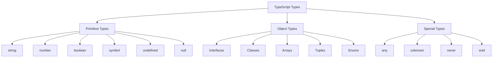
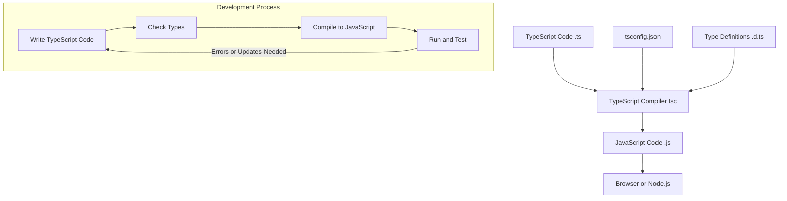

Hey there! Ready to dive into TypeScript? This crash course will cover the essential 85% you'll use daily, while giving you the foundation to explore the rest on your own. Let's get started!

## What is TypeScript?

TypeScript is JavaScript with superpowers! It's a strongly-typed programming language that builds on JavaScript by adding static type definitions. Think of it as JavaScript that scales better for larger projects.

```
JavaScript + Type System = TypeScript
```

The beauty is that TypeScript code compiles down to plain JavaScript that runs anywhere JavaScript runs - browsers, Node.js, etc.

## Getting Started

### Prerequisites

- Basic knowledge of JavaScript
- Node.js installed on your machine

### Installation and Setup

First, let's install TypeScript globally:

```bash
npm install -g typescript
```

Check your installation:

```bash
tsc --version
```

Now create a simple project:

```bash
mkdir ts-starter
cd ts-starter
npm init -y
```

Let's create a configuration file (`tsconfig.json`):

```bash
tsc --init
```

This creates a detailed config file with many options. For now, let's use this simplified version:

```json
{
  "compilerOptions": {
    "target": "es2016",
    "module": "commonjs",
    "outDir": "./dist",
    "strict": true,
    "esModuleInterop": true
  },
  "include": ["src/**/*"]
}
```

Create a source folder and your first TypeScript file:

```bash
mkdir src
touch src/index.ts
```

## Hello TypeScript!

Let's write our first TypeScript code in `src/index.ts`:

```typescript
// This is a simple greeting function
function greet(name: string): string {
  return `Hello, ${name}!`;
}

// Notice the type annotation for the 'name' parameter
console.log(greet('TypeScript')); // Output: Hello, TypeScript!

// TypeScript will catch this error before runtime
// console.log(greet(123));  // Error: Argument of type 'number' is not assignable to parameter of type 'string'
```

Compile and run it:

```bash
tsc
node dist/index.js
```

## Basic Types

TypeScript's type system is one of its greatest strengths. Here are the essential types:

```typescript
// Primitive types
let isDone: boolean = false;
let decimal: number = 6;
let color: string = 'blue';

// Arrays
let list: number[] = [1, 2, 3];
let names: Array<string> = ['Alice', 'Bob', 'Charlie']; // Generic array type

// Tuple - fixed-length array where each position has a specific type
let person: [string, number] = ['Alice', 30]; // Name and age

// Enum - a way to give more friendly names to sets of numeric values
enum Color {
  Red,
  Green,
  Blue,
}
let c: Color = Color.Green; // 1

// Any - opt-out of type checking
let notSure: any = 4;
notSure = 'maybe a string instead';
notSure = false; // boolean is fine too

// Void - absence of a type, commonly used for functions that don't return a value
function logMessage(message: string): void {
  console.log(message);
}

// Null and Undefined
let u: undefined = undefined;
let n: null = null;

// Never - represents values that never occur (e.g., function that always throws an error)
function error(message: string): never {
  throw new Error(message);
}

// Object - non-primitive type
let obj: object = { key: 'value' };
```

## Type Annotations and Inference

TypeScript can often infer types for you:

```typescript
// Type inference works well here, no need for annotation
let obviouslyAString = 'This is a string';

// But annotations are useful for function parameters and returns
function add(a: number, b: number): number {
  return a + b;
}

// And when initializing variables without a value
let someValue: string;
someValue = 'Now I have a value';
```

## Functions

Functions in TypeScript can be typed in various ways:

```typescript
// Basic function with typed parameters and return type
function multiply(a: number, b: number): number {
  return a * b;
}

// Optional parameters (note the ?)
function buildName(firstName: string, lastName?: string): string {
  if (lastName) {
    return `${firstName} ${lastName}`;
  }
  return firstName;
}
console.log(buildName('Bob')); // Works fine: "Bob"
console.log(buildName('Bob', 'Smith')); // Also works: "Bob Smith"

// Default parameters
function greetUser(name: string, greeting: string = 'Hello'): string {
  return `${greeting}, ${name}!`;
}
console.log(greetUser('Alice')); // "Hello, Alice!"
console.log(greetUser('Bob', 'Hi there')); // "Hi there, Bob!"

// Rest parameters
function sum(...numbers: number[]): number {
  return numbers.reduce((total, num) => total + num, 0);
}
console.log(sum(1, 2, 3, 4)); // 10

// Function types
let myAdd: (x: number, y: number) => number;
myAdd = (a, b) => a + b;
```

## Interfaces and Types

Interfaces define the shape of objects:

```typescript
// Basic interface
interface User {
  name: string;
  id: number;
}

// Using the interface
const user: User = {
  name: 'Alice',
  id: 1,
};

// Optional properties with ?
interface Product {
  id: number;
  name: string;
  description?: string; // Optional
  price: number;
}

// Readonly properties
interface Point {
  readonly x: number;
  readonly y: number;
}
let p1: Point = { x: 10, y: 20 };
// p1.x = 5; // Error: Cannot assign to 'x' because it is a read-only property

// Extending interfaces
interface Animal {
  name: string;
}

interface Dog extends Animal {
  breed: string;
}

// Type aliases - similar to interfaces but with some differences
type Coordinates = {
  x: number;
  y: number;
};

// Union types with type aliases
type ID = string | number;
let userId: ID = 123;
userId = 'ABC123'; // Both are valid

// When to use interface vs type?
// - Interfaces can be extended and merged
// - Types can create union and intersection types more easily
```



## Classes

TypeScript classes are an enhancement of JavaScript's class feature with type features:

```typescript
class Person {
  // Class properties with type annotations
  name: string;
  age: number;

  // Constructor
  constructor(name: string, age: number) {
    this.name = name;
    this.age = age;
  }

  // Method with return type annotation
  greet(): string {
    return `Hello, my name is ${this.name} and I am ${this.age} years old.`;
  }
}

// Creating an instance
const alice = new Person('Alice', 28);
console.log(alice.greet()); // "Hello, my name is Alice and I am 28 years old."

// Access modifiers: public, private, protected
class Employee {
  // Properties are public by default, but we can be explicit
  public name: string;
  private salary: number; // Only accessible within this class
  protected department: string; // Accessible within this class and subclasses

  constructor(name: string, salary: number, department: string) {
    this.name = name;
    this.salary = salary;
    this.department = department;
  }

  // Private method
  private calculateBonus(): number {
    return this.salary * 0.1;
  }

  // Public method can access private members
  public getAnnualCompensation(): number {
    return this.salary * 12 + this.calculateBonus();
  }
}

// Inheritance
class Manager extends Employee {
  private directReports: Employee[] = [];

  constructor(name: string, salary: number, department: string) {
    super(name, salary, department); // Call parent constructor
  }

  public addDirectReport(employee: Employee): void {
    this.directReports.push(employee);
  }

  // Can access protected members from parent
  public getDepartmentInfo(): string {
    return `Manager of ${this.department} department with ${this.directReports.length} direct reports`;
  }
}
```

## Generics

Generics enable you to create reusable components that work with a variety of types:

```typescript
// A simple generic function
function identity<T>(arg: T): T {
  return arg;
}

// Call it with explicit type
let output1 = identity<string>('myString');
// Or let type inference figure it out
let output2 = identity(42); // Type is inferred as number

// Generic interface
interface GenericBox<T> {
  content: T;
}

let numberBox: GenericBox<number> = { content: 42 };
let stringBox: GenericBox<string> = { content: 'hello' };

// Generic with constraints
interface HasLength {
  length: number;
}

// Now T must have a length property
function logAndReturnLength<T extends HasLength>(arg: T): number {
  console.log(`This has length ${arg.length}`);
  return arg.length;
}

logAndReturnLength('hello'); // Works - strings have length
logAndReturnLength([1, 2, 3]); // Works - arrays have length
// logAndReturnLength(123); // Error - numbers don't have length
```

## Advanced Types

```typescript
// Union types - value can be one of multiple types
function formatInput(input: string | number): string {
  if (typeof input === 'string') {
    return input.toUpperCase();
  }
  return input.toFixed(2);
}

// Type guards
function isString(value: any): value is string {
  return typeof value === 'string';
}

function process(value: string | number): void {
  if (isString(value)) {
    // TypeScript knows value is a string here
    console.log(value.toUpperCase());
  } else {
    // TypeScript knows value is a number here
    console.log(value.toFixed(2));
  }
}

// Discriminated unions
interface Square {
  kind: 'square';
  size: number;
}

interface Rectangle {
  kind: 'rectangle';
  width: number;
  height: number;
}

interface Circle {
  kind: 'circle';
  radius: number;
}

type Shape = Square | Rectangle | Circle;

function calculateArea(shape: Shape): number {
  switch (shape.kind) {
    case 'square':
      return shape.size * shape.size;
    case 'rectangle':
      return shape.width * shape.height;
    case 'circle':
      return Math.PI * shape.radius ** 2;
  }
}

// Intersection types
interface Colorful {
  color: string;
}

interface Printable {
  print(): void;
}

type ColorfulPrintable = Colorful & Printable;

function createColorfulPrinter(color: string): ColorfulPrintable {
  return {
    color,
    print() {
      console.log(`Printing in ${this.color}`);
    },
  };
}
```



## Modules and Namespaces

TypeScript uses ES modules for organizing code:

```typescript
// math.ts - exporting functions
export function add(x: number, y: number): number {
  return x + y;
}

export function subtract(x: number, y: number): number {
  return x - y;
}

// Default export
export default function multiply(x: number, y: number): number {
  return x * y;
}

// main.ts - importing
import multiply, { add, subtract } from './math';

console.log(add(5, 3)); // 8
console.log(subtract(10, 4)); // 6
console.log(multiply(2, 3)); // 6

// Import everything
import * as math from './math';
console.log(math.add(1, 2)); // 3
```

## Practical Example: A TypeScript To-Do App

Let's build a simple to-do list application to put everything together:

```typescript
// todo.ts
// Define the shape of a Todo item
interface Todo {
  id: number;
  text: string;
  completed: boolean;
}

// Todo service class to manage todos
class TodoService {
  private todos: Todo[] = [];
  private nextId: number = 1;

  // Add a new todo
  add(text: string): Todo {
    const newTodo: Todo = {
      id: this.nextId++,
      text,
      completed: false,
    };
    this.todos.push(newTodo);
    return newTodo;
  }

  // Toggle the completed status
  toggle(id: number): Todo | undefined {
    const todo = this.todos.find((todo) => todo.id === id);
    if (todo) {
      todo.completed = !todo.completed;
      return todo;
    }
    return undefined;
  }

  // Delete a todo
  delete(id: number): boolean {
    const initialLength = this.todos.length;
    this.todos = this.todos.filter((todo) => todo.id !== id);
    return this.todos.length !== initialLength;
  }

  // Get all todos
  getAll(): readonly Todo[] {
    return [...this.todos]; // Return a copy to prevent direct mutation
  }
}

// Create a todo service and use it
const todoService = new TodoService();

// Add some todos
const todo1 = todoService.add('Learn TypeScript basics');
const todo2 = todoService.add('Build a small project');
const todo3 = todoService.add('Share knowledge with others');

console.log('Initial todos:', todoService.getAll());
// Output: Initial todos: [
//   { id: 1, text: 'Learn TypeScript basics', completed: false },
//   { id: 2, text: 'Build a small project', completed: false },
//   { id: 3, text: 'Share knowledge with others', completed: false }
// ]

// Toggle a todo
todoService.toggle(1);
console.log('After toggling first todo:', todoService.getAll());
// Output: After toggling first todo: [
//   { id: 1, text: 'Learn TypeScript basics', completed: true },
//   { id: 2, text: 'Build a small project', completed: false },
//   { id: 3, text: 'Share knowledge with others', completed: false }
// ]

// Delete a todo
todoService.delete(2);
console.log('After deleting second todo:', todoService.getAll());
// Output: After deleting second todo: [
//   { id: 1, text: 'Learn TypeScript basics', completed: true },
//   { id: 3, text: 'Share knowledge with others', completed: false }
// ]
```

## Working with TypeScript in a Real Project

In a real project, you'd likely use a build tool and additional libraries. Here's a quick overview of a more complete setup:

### Project Structure

```
my-ts-project/
├── node_modules/
├── src/
│   ├── components/
│   ├── models/
│   ├── services/
│   └── index.ts
├── tests/
├── package.json
├── tsconfig.json
└── README.md
```

### package.json Example

```json
{
  "name": "my-ts-project",
  "version": "1.0.0",
  "description": "A TypeScript project",
  "main": "dist/index.js",
  "scripts": {
    "build": "tsc",
    "start": "node dist/index.js",
    "dev": "ts-node-dev src/index.ts",
    "test": "jest"
  },
  "dependencies": {
    "express": "^4.17.1"
  },
  "devDependencies": {
    "@types/express": "^4.17.13",
    "@types/jest": "^27.0.1",
    "@types/node": "^16.7.10",
    "jest": "^27.2.0",
    "ts-jest": "^27.0.5",
    "ts-node-dev": "^1.1.8",
    "typescript": "^4.4.2"
  }
}
```

## The Remaining 15%: Advanced TypeScript Features

Here's what we haven't covered in depth, which makes up the "last 15%" that you can explore on your own:

1. **Declaration Files (.d.ts)**

   - For typing third-party libraries
   - How to write your own declaration files
   - Using DefinitelyTyped (@types packages)

2. **Advanced Type Features**

   - Conditional types (`T extends U ? X : Y`)
   - Mapped types (`{ [K in keyof T]: T[K] }`)
   - Template literal types (`` `hello-${string}` ``)
   - The `infer` keyword and type inference in conditional types

3. **Project References**

   - Managing large multi-package TypeScript projects
   - Composite projects

4. **Decorators**

   - Class, method, property, and parameter decorators
   - Angular and NestJS style decorators

5. **Performance Optimizations**

   - Incremental compilation
   - Project references
   - Type-checking strategies

6. **Integration with Build Tools**

   - Webpack configuration for TypeScript
   - Rollup, Parcel, and other bundlers
   - ESBuild and SWC for faster builds

7. **Advanced Configuration**

   - Fine-tuning the compiler options
   - Path mapping
   - Module resolution strategies

8. **Testing TypeScript Code**

   - Setting up Jest or Mocha with TypeScript
   - Type coverage tools

9. **TypeScript with Frameworks**

   - In-depth React with TypeScript (props, hooks, context)
   - Vue with TypeScript
   - NestJS and other TS-first frameworks

10. **Error Handling Patterns**
    - Result types
    - Functional error handling
    - Exception safety with TypeScript

With the 85% foundation we've covered, you should be well-equipped to start exploring these more advanced topics based on your specific needs!

## Final Tips

1. Use the TypeScript playground (typescriptlang.org/play) to experiment quickly
2. Learn to read type errors - they're verbose but informative
3. Start with `strict: false` while learning, then gradually enable strict mode
4. Don't overuse `any` - it defeats the purpose of TypeScript
5. The TypeScript documentation and GitHub repo are excellent resources

Happy TypeScripting! 🚀
