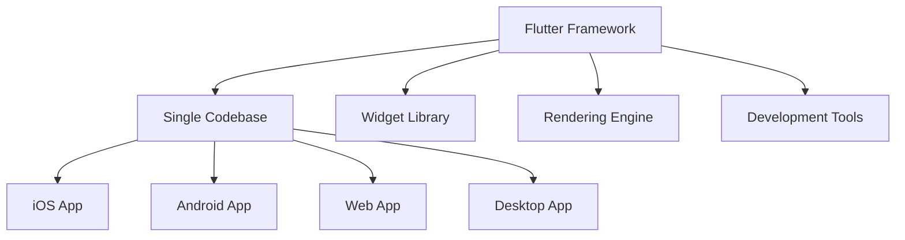
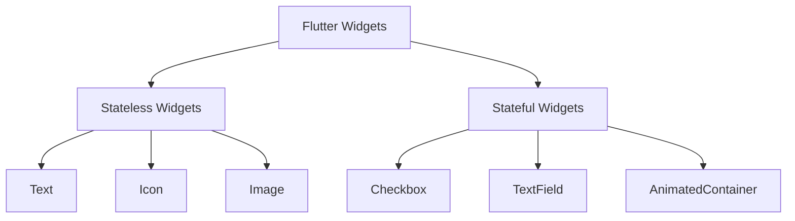
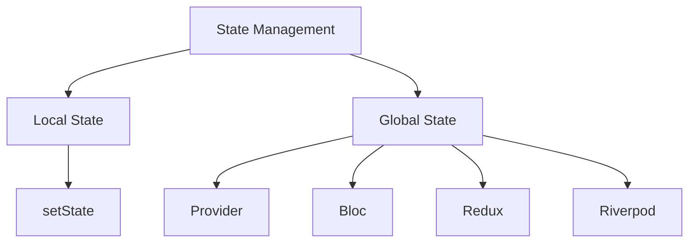

## Introduction to Flutter

Flutter is Google's open-source UI framework that enables developers to build applications for multiple platforms (iOS, Android, web, desktop) from a single codebase. Unlike other cross-platform solutions, Flutter uses its own rendering engine rather than relying on platform-specific components, ensuring consistent appearance and behavior across all devices.

The framework has gained tremendous popularity among developers for several compelling reasons. Its cross-platform efficiency dramatically reduces development time, while its compilation to native code ensures performance that rivals platform-specific applications. Flutter also provides a rich library of customizable widgets that make creating beautiful user interfaces straightforward and intuitive.



## Getting Started with Flutter

Before diving into development, you'll need to set up your environment. The process is straightforward and well-documented, allowing you to begin building applications quickly.

### Installation and Setup

1. **Install Flutter SDK**

```bash
# Download SDK from flutter.dev
# Extract to desired location

# Add Flutter to your path (for macOS/Linux)
export PATH="$PATH:`pwd`/flutter/bin"

# Verify installation
flutter doctor
```

The `flutter doctor` command identifies any issues in your Flutter installation and provides guidance on resolving them. This diagnostic tool ensures your development environment is properly configured before you begin writing code.

2. **Set Up an IDE**

Install either Visual Studio Code or Android Studio, then add the Flutter and Dart plugins. These extensions provide code completion, debugging tools, and other features that enhance the development experience.

3. **Configure Emulators/Simulators**

To test your applications during development, you'll need device simulators:

- For Android: Install Android Studio and set up an Android Virtual Device (AVD)
- For iOS (macOS only): Install Xcode and set up the iOS Simulator

4. **Create Your First Project**

```bash
# Create a new Flutter application
flutter create my_flutter_app

# Navigate to project directory
cd my_flutter_app

# Run the application
flutter run
```

### Project Structure

When you create a new Flutter project, it generates a standard structure that organizes your code and assets:

```
my_flutter_app/
├── android/            # Android-specific files
├── ios/                # iOS-specific files
├── lib/                # Dart source code
│   └── main.dart       # Entry point
├── test/               # Test files
├── pubspec.yaml        # Project dependencies and assets
└── README.md           # Project documentation
```

The `lib` directory is where you'll spend most of your time, as it contains all your Dart code. The `pubspec.yaml` file is also important, as it's where you'll define your project dependencies and assets.

## Dart Essentials

Before diving deeper into Flutter, it's important to understand Dart, the programming language that powers Flutter applications. Dart was designed specifically for building user interfaces, with features that support the kind of development patterns commonly used in modern app development.

### Variables and Data Types

Dart is a statically-typed language, but it also offers type inference for more concise code:

```dart
// Variable declaration
var name = 'John';              // Type inference
String lastName = 'Doe';        // Explicit type
final age = 30;                 // Cannot be reassigned
const PI = 3.14159;             // Compile-time constant

// Basic data types
int number = 42;
double decimal = 3.14;
bool isTrue = true;
String text = "Hello, Flutter!";
List<String> fruits = ['apple', 'banana', 'orange'];
Map<String, int> scores = {'John': 90, 'Jane': 95};
```

### Functions

Functions in Dart are first-class objects, meaning they can be assigned to variables and passed as arguments:

```dart
// Basic function
int add(int a, int b) {
  return a + b;
}

// Arrow function (shorthand for single expressions)
int multiply(int a, int b) => a * b;

// Optional parameters
void greet(String name, {String greeting = 'Hello'}) {
  print('$greeting, $name!');
}
// Call: greet('John', greeting: 'Hi');
```

### Classes and Objects

Dart is an object-oriented language with classes and inheritance. Here's how to define and use a basic class:

```dart
// Class definition
class Person {
  // Properties
  String name;
  int age;

  // Constructor
  Person(this.name, this.age);

  // Named constructor
  Person.guest() {
    name = 'Guest';
    age = 0;
  }

  // Method
  void introduce() {
    print('My name is $name and I am $age years old.');
  }
}

// Usage
var person = Person('John', 30);
person.introduce();
```

These Dart basics provide the foundation you need to understand Flutter code. As you develop more complex applications, you'll discover additional Dart features that help you write clean, efficient code.

## Flutter Fundamentals: Widgets

Now that you have a grasp of Dart, let's explore Flutter's widget system. In Flutter, everything is a widget! This consistent approach simplifies development by providing a unified way to build user interfaces.

Widgets are the building blocks that describe what your app's UI should look like given their current configuration and state. They're similar to components in other frameworks, but with a focus on immutability and composition.

### Types of Widgets

Flutter widgets fall into two main categories:

1. **Stateless Widgets**: Immutable widgets that don't store any state. They're built once and don't change their appearance until rebuilt with new parameters.

2. **Stateful Widgets**: Widgets that can change their appearance in response to events or user interaction. They maintain state that might change during the lifetime of the widget.



### Basic Widget Structure

Here's how to create both types of widgets:

```dart
// Stateless Widget
class MyStatelessWidget extends StatelessWidget {
  final String title;

  // Constructor
  const MyStatelessWidget({Key? key, required this.title}) : super(key: key);

  @override
  Widget build(BuildContext context) {
    // Return the UI representation of this widget
    return Text(title);
  }
}

// Stateful Widget
class MyStatefulWidget extends StatefulWidget {
  const MyStatefulWidget({Key? key}) : super(key: key);

  @override
  _MyStatefulWidgetState createState() => _MyStatefulWidgetState();
}

class _MyStatefulWidgetState extends State<MyStatefulWidget> {
  bool _isActive = false;

  @override
  Widget build(BuildContext context) {
    return Switch(
      value: _isActive,
      onChanged: (bool value) {
        // Update state and trigger rebuild
        setState(() {
          _isActive = value;
        });
      },
    );
  }
}
```

### Essential Layout Widgets

Flutter provides several key widgets for creating layouts. Understanding these will help you structure your user interfaces effectively.

#### Container

The Container widget wraps other widgets, providing padding, margins, and decoration:

```dart
Container(
  width: 200,
  height: 200,
  padding: EdgeInsets.all(10),
  margin: EdgeInsets.symmetric(vertical: 10, horizontal: 15),
  decoration: BoxDecoration(
    color: Colors.blue,
    borderRadius: BorderRadius.circular(10),
    boxShadow: [
      BoxShadow(
        color: Colors.black26,
        blurRadius: 5,
        offset: Offset(0, 2),
      ),
    ],
  ),
  child: Text('Hello, Flutter!', style: TextStyle(color: Colors.white)),
)
```

#### Row and Column

These widgets help arrange children horizontally (Row) or vertically (Column):

```dart
// Horizontal arrangement
Row(
  mainAxisAlignment: MainAxisAlignment.spaceEvenly, // Horizontal distribution
  crossAxisAlignment: CrossAxisAlignment.center,    // Vertical alignment
  children: [
    Icon(Icons.star, size: 50),
    Text('5-Star Rating'),
    ElevatedButton(onPressed: () {}, child: Text('Rate')),
  ],
)

// Vertical arrangement
Column(
  mainAxisAlignment: MainAxisAlignment.start,         // Vertical distribution
  crossAxisAlignment: CrossAxisAlignment.stretch,     // Horizontal stretching
  children: [
    Text('Profile Information'),
    TextField(decoration: InputDecoration(labelText: 'Name')),
    TextField(decoration: InputDecoration(labelText: 'Email')),
  ],
)
```

#### Stack

The Stack widget allows children to overlap, positioning them relative to the edges of the Stack:

```dart
Stack(
  children: [
    // Bottom layer
    Image.network('https://example.com/background.jpg'),
    // Middle layer
    Container(color: Colors.black54, width: double.infinity, height: 200),
    // Top layer
    Positioned(
      bottom: 20,
      right: 20,
      child: Text('Overlaid Text', style: TextStyle(color: Colors.white)),
    ),
  ],
)
```

Understanding these fundamental layout widgets will allow you to create virtually any user interface design. They form the foundation upon which more complex layouts are built.

## Building a Simple Counter App

Now that we've covered the basics, let's apply what we've learned by building a simple counter application. This example will demonstrate how Flutter's components work together in a real application.

```dart
import 'package:flutter/material.dart';

// App entry point
void main() {
  runApp(const MyApp());
}

// Root widget of the application
class MyApp extends StatelessWidget {
  const MyApp({Key? key}) : super(key: key);

  @override
  Widget build(BuildContext context) {
    return MaterialApp(
      title: 'Flutter Counter',
      theme: ThemeData(
        primarySwatch: Colors.blue,
      ),
      home: const MyHomePage(title: 'Flutter Counter App'),
    );
  }
}

// Home page with stateful counter
class MyHomePage extends StatefulWidget {
  const MyHomePage({Key? key, required this.title}) : super(key: key);

  final String title;

  @override
  _MyHomePageState createState() => _MyHomePageState();
}

class _MyHomePageState extends State<MyHomePage> {
  int _counter = 0; // State variable

  // Method to update state
  void _incrementCounter() {
    setState(() {
      _counter++;
    });
  }

  @override
  Widget build(BuildContext context) {
    return Scaffold(
      appBar: AppBar(
        title: Text(widget.title),
      ),
      body: Center(
        child: Column(
          mainAxisAlignment: MainAxisAlignment.center,
          children: [
            const Text(
              'You have pushed the button this many times:',
            ),
            Text(
              '$_counter',
              style: Theme.of(context).textTheme.headline4,
            ),
          ],
        ),
      ),
      floatingActionButton: FloatingActionButton(
        onPressed: _incrementCounter,
        tooltip: 'Increment',
        child: const Icon(Icons.add),
      ),
    );
  }
}
```

This example demonstrates several important Flutter concepts:

1. The application entry point (`main()`)
2. A root widget that configures the application theme and home screen
3. A stateful widget that maintains the counter value
4. The use of `setState()` to update the UI when the counter changes
5. A simple layout using Scaffold, AppBar, and other Material Design widgets

### Hot Reload and Debugging

One of Flutter's most powerful features is hot reload, which lets you see changes instantly without restarting your app. This significantly speeds up the development process:

1. Make changes to your code
2. Save the file
3. Click the hot reload button (⚡) or press `r` in the terminal

For debugging your applications, Flutter provides several tools:

- Use `print()` statements for simple logging
- Set breakpoints in your IDE to pause execution
- Use the Flutter DevTools for more advanced debugging, including widget inspection and performance analysis

These tools make it easier to identify and fix issues during development, ensuring your application works as expected.

## Navigation and Routing

Most applications require multiple screens and the ability to navigate between them. Flutter provides a straightforward approach to navigation based on a stack of screens.

### Basic Navigation

The most direct way to navigate between screens is using the Navigator:

```dart
// Navigate to a new screen
ElevatedButton(
  onPressed: () {
    Navigator.push(
      context,
      MaterialPageRoute(builder: (context) => SecondScreen()),
    );
  },
  child: Text('Go to Second Screen'),
)

// Return to the previous screen
ElevatedButton(
  onPressed: () {
    Navigator.pop(context);
  },
  child: Text('Go Back'),
)
```

This approach pushes a new screen onto the navigation stack when moving forward and pops it when going back, similar to how web browsers handle navigation history.

### Named Routes

For more complex applications with many screens, named routes provide a more organized approach:

```dart
// In your MaterialApp widget
MaterialApp(
  // Define routes
  routes: {
    '/': (context) => HomeScreen(),
    '/details': (context) => DetailsScreen(),
    '/settings': (context) => SettingsScreen(),
  },
  initialRoute: '/',
)

// Navigate using route names
ElevatedButton(
  onPressed: () {
    Navigator.pushNamed(context, '/details');
  },
  child: Text('View Details'),
)
```

Named routes centralize your navigation structure, making it easier to maintain and understand the flow between different parts of your application.

## State Management

As your applications grow more complex, managing state becomes increasingly important. State refers to any data that can change during the lifetime of your app, such as user preferences, authentication status, or items in a shopping cart.

Flutter offers several approaches to state management, each with its own advantages:



### Local State with setState()

For simple components, using `setState()` within a stateful widget is often sufficient:

```dart
class CounterWidget extends StatefulWidget {
  @override
  _CounterWidgetState createState() => _CounterWidgetState();
}

class _CounterWidgetState extends State<CounterWidget> {
  int _counter = 0;

  void _increment() {
    setState(() {
      _counter++;
    });
  }

  @override
  Widget build(BuildContext context) {
    return Column(
      children: [
        Text('Count: $_counter'),
        ElevatedButton(
          onPressed: _increment,
          child: Text('Increment'),
        ),
      ],
    );
  }
}
```

This approach works well for isolated components, but becomes unwieldy when multiple widgets need to share state.

### Provider Pattern

For more complex applications, the Provider package offers a more scalable solution:

```dart
// First, add provider to pubspec.yaml
// provider: ^6.0.0

// Define a model
class CounterModel extends ChangeNotifier {
  int _count = 0;

  int get count => _count;

  void increment() {
    _count++;
    notifyListeners(); // Notify listeners about the change
  }
}

// Set up the provider in main.dart
void main() {
  runApp(
    ChangeNotifierProvider(
      create: (context) => CounterModel(),
      child: MyApp(),
    ),
  );
}

// Use the provider in widgets
class CounterDisplay extends StatelessWidget {
  @override
  Widget build(BuildContext context) {
    return Consumer<CounterModel>(
      builder: (context, counter, child) {
        return Text('Count: ${counter.count}');
      },
    );
  }
}

class CounterButton extends StatelessWidget {
  @override
  Widget build(BuildContext context) {
    return ElevatedButton(
      onPressed: () {
        // Access the model and update it
        Provider.of<CounterModel>(context, listen: false).increment();
      },
      child: Text('Increment'),
    );
  }
}
```

Provider helps separate your business logic from your UI, making your code more maintainable and testable. It's an excellent starting point for state management beyond simple cases, and is officially recommended by the Flutter team.

## Working with Data

Most real-world applications need to fetch, process, and store data. Flutter provides several ways to work with data from various sources.

### HTTP Requests

To interact with web services and APIs, you can use the `http` package:

```dart
// Add to pubspec.yaml:
// http: ^0.13.4

import 'dart:convert';
import 'package:http/http.dart' as http;

Future<List<User>> fetchUsers() async {
  final response = await http.get(Uri.parse('https://jsonplaceholder.typicode.com/users'));

  if (response.statusCode == 200) {
    // Parse JSON response
    List<dynamic> data = jsonDecode(response.body);
    return data.map((json) => User.fromJson(json)).toList();
  } else {
    throw Exception('Failed to load users');
  }
}

// User model
class User {
  final int id;
  final String name;
  final String email;

  User({required this.id, required this.name, required this.email});

  factory User.fromJson(Map<String, dynamic> json) {
    return User(
      id: json['id'],
      name: json['name'],
      email: json['email'],
    );
  }
}

// Using FutureBuilder to display fetched data
FutureBuilder<List<User>>(
  future: fetchUsers(),
  builder: (context, snapshot) {
    if (snapshot.connectionState == ConnectionState.waiting) {
      return CircularProgressIndicator();
    } else if (snapshot.hasError) {
      return Text('Error: ${snapshot.error}');
    } else {
      return ListView.builder(
        itemCount: snapshot.data!.length,
        itemBuilder: (context, index) {
          User user = snapshot.data![index];
          return ListTile(
            title: Text(user.name),
            subtitle: Text(user.email),
          );
        },
      );
    }
  },
)
```

The `FutureBuilder` widget is particularly useful when working with asynchronous data, as it handles the different states of a Future (loading, error, success) and rebuilds the UI accordingly.

### Local Storage

For persisting small amounts of data locally, the `shared_preferences` package provides a straightforward solution:

```dart
// Add to pubspec.yaml:
// shared_preferences: ^2.0.12

import 'package:shared_preferences/shared_preferences.dart';

// Save data
Future<void> saveUsername(String username) async {
  final prefs = await SharedPreferences.getInstance();
  await prefs.setString('username', username);
}

// Load data
Future<String?> getUsername() async {
  final prefs = await SharedPreferences.getInstance();
  return prefs.getString('username');
}

// Usage example
ElevatedButton(
  onPressed: () async {
    await saveUsername('JohnDoe');
    String? username = await getUsername();
    print('Saved username: $username');
  },
  child: Text('Save Username'),
)
```

This is perfect for storing user preferences, settings, or small pieces of application state that need to persist across app restarts.

## UI Design and Theming

Creating a visually appealing and consistent user interface is crucial for a successful application. Flutter's theming system makes it easy to define and apply consistent styles throughout your app.

### Basic Theming

The `ThemeData` class allows you to define colors, typography, and other design elements in one place:

```dart
MaterialApp(
  theme: ThemeData(
    primarySwatch: Colors.blue,
    brightness: Brightness.light,
    fontFamily: 'Roboto',
    textTheme: TextTheme(
      headline1: TextStyle(fontSize: 24, fontWeight: FontWeight.bold),
      bodyText1: TextStyle(fontSize: 16, color: Colors.black87),
    ),
    buttonTheme: ButtonThemeData(
      buttonColor: Colors.blue,
      textTheme: ButtonTextTheme.primary,
    ),
  ),
  darkTheme: ThemeData(
    brightness: Brightness.dark,
    primarySwatch: Colors.indigo,
    // Define dark theme properties
  ),
  themeMode: ThemeMode.system, // Use system theme
  home: MyHomePage(),
)
```

By defining themes centrally, you can maintain consistency across your application and easily update the design by changing theme properties rather than modifying individual widgets.

### Simple Animations

Animations add life to your user interface and improve the user experience. Flutter makes creating animations straightforward:

```dart
class AnimatedLogo extends StatefulWidget {
  @override
  _AnimatedLogoState createState() => _AnimatedLogoState();
}

class _AnimatedLogoState extends State<AnimatedLogo> with SingleTickerProviderStateMixin {
  late AnimationController _controller;
  late Animation<double> _animation;

  @override
  void initState() {
    super.initState();
    _controller = AnimationController(
      duration: const Duration(seconds: 2),
      vsync: this,
    )..repeat(reverse: true); // Loop animation back and forth

    _animation = CurvedAnimation(
      parent: _controller,
      curve: Curves.easeInOut,
    );
  }

  @override
  void dispose() {
    _controller.dispose();
    super.dispose();
  }

  @override
  Widget build(BuildContext context) {
    return Center(
      child: ScaleTransition(
        scale: _animation,
        child: FlutterLogo(size: 100),
      ),
    );
  }
}
```

This example creates a pulsing logo animation that scales up and down repeatedly. Flutter provides various animation widgets like `AnimatedContainer`, `AnimatedOpacity`, and `AnimatedPositioned` that make common animations even simpler.

## Testing and Deployment

As your application matures, testing becomes essential to ensure everything works as expected. Flutter supports several types of tests to verify different aspects of your application.

### Basic Testing

```dart
// Unit test example
// Add to pubspec.yaml: test: ^1.16.0
import 'package:test/test.dart';

void main() {
  test('Counter increments smoke test', () {
    // Arrange
    final counter = Counter();
    // Act
    counter.increment();
    // Assert
    expect(counter.value, 1);
  });
}

// Widget test example
// In test/widget_test.dart
import 'package:flutter_test/flutter_test.dart';

void main() {
  testWidgets('Counter increments smoke test', (WidgetTester tester) async {
    // Build our app and trigger a frame
    await tester.pumpWidget(MyApp());

    // Verify initial count is 0
    expect(find.text('0'), findsOneWidget);
    expect(find.text('1'), findsNothing);

    // Tap the '+' icon and trigger a frame
    await tester.tap(find.byIcon(Icons.add));
    await tester.pump();

    // Verify count is now 1
    expect(find.text('0'), findsNothing);
    expect(find.text('1'), findsOneWidget);
  });
}
```

Testing helps catch issues early and ensures your application continues to work correctly as you add new features or refactor existing code.

### Deployment

Once your application is ready, you'll need to build it for distribution:

#### Building for Android

```bash
# Create release build
flutter build apk --release

# The APK file will be located at
# build/app/outputs/flutter-apk/app-release.apk
```

#### Building for iOS (macOS only)

```bash
# Create release build
flutter build ios --release

# Open Xcode to archive and upload to App Store
open ios/Runner.xcworkspace
```

These commands create optimized builds of your application ready for distribution through the Google Play Store and Apple App Store respectively.

## Performance Best Practices

Flutter is designed for high performance, but there are still practices you should follow to ensure your application runs smoothly:

1. **Optimize widget build methods**: Keep them simple and efficient by minimizing the amount of work done during builds.

2. **Use const constructors** when widgets don't change, allowing Flutter to optimize rendering.

3. **Avoid unnecessary rebuilds** by localizing setState() calls to only the widgets that need to be updated.

4. **Use efficient list rendering** for long scrollable lists:

```dart
// Inefficient approach
ListView(
  children: items.map((item) => ItemWidget(item)).toList(),
)

// Efficient approach
ListView.builder(
  itemCount: items.length,
  itemBuilder: (context, index) => ItemWidget(items[index]),
)
```

The builder version only creates widgets for visible items, significantly improving performance for long lists.

Following these practices will help ensure your application remains responsive and efficient, even as it grows in complexity.

## The Remaining 15%: Advanced Topics to Explore

Now that you've mastered the fundamentals, here are the advanced topics that make up the remaining 15% of Flutter development knowledge:

1. **Advanced State Management**

   - BLoC pattern for complex applications with clear separation of business logic
   - Redux and its Flutter implementations for predictable state changes
   - Riverpod as a Provider alternative with additional features

2. **Platform-Specific Code**

   - Platform channels for accessing native functionality not available in Flutter
   - Handling platform differences to provide native experiences on each platform

3. **Advanced UI and Animations**

   - Custom painters for complex graphics and visualizations
   - Hero animations for seamless transitions between screens
   - Implicit and explicit animations for more dynamic interfaces

4. **Firebase Integration**

   - Authentication for user management
   - Cloud Firestore for real-time database functionality
   - Analytics and Crashlytics for monitoring application usage and issues

5. **Architecture Patterns**

   - MVVM, Clean Architecture for organizing large codebases
   - Dependency injection for more testable and modular code
   - Repository pattern for abstracting data sources

6. **Advanced Dart Features**

   - Async programming with Streams for reactive applications
   - Isolates for background processing without blocking the UI
   - Code generation with build_runner for reducing boilerplate

7. **Flutter Web and Desktop**

   - Responsive design considerations for different screen sizes
   - Platform-specific optimizations for the best experience on each platform

8. **Advanced Testing**
   - Integration testing for verifying complete features
   - Golden tests for UI verification across different devices
   - Automated CI/CD pipelines for continuous testing and deployment

As you continue your Flutter journey, explore these topics based on the needs of your applications and your own interests.

## Conclusion

This crash course has provided you with the essential 85% of Flutter development knowledge needed for daily work. You now have a solid foundation in Flutter's architecture, the Dart language, and the key concepts for building mobile applications.

With the skills covered in this guide, you can create functional, visually appealing apps for both iOS and Android from a single codebase. You understand how to structure your application, manage state, work with data, and create responsive user interfaces.

As you apply these concepts in real projects, you'll gain practical experience that reinforces your understanding. When you're ready to deepen your knowledge, the "remaining 15%" topics will help you tackle more complex challenges and create even more sophisticated applications.

The Flutter ecosystem continues to evolve, with new features and best practices emerging regularly. Join the community forums, follow the official documentation, and experiment with different approaches to stay current and continue growing as a Flutter developer.
