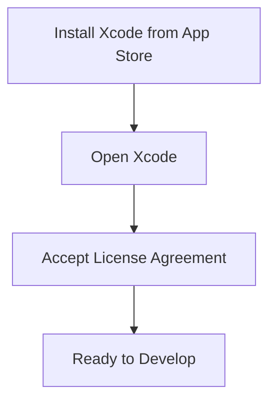
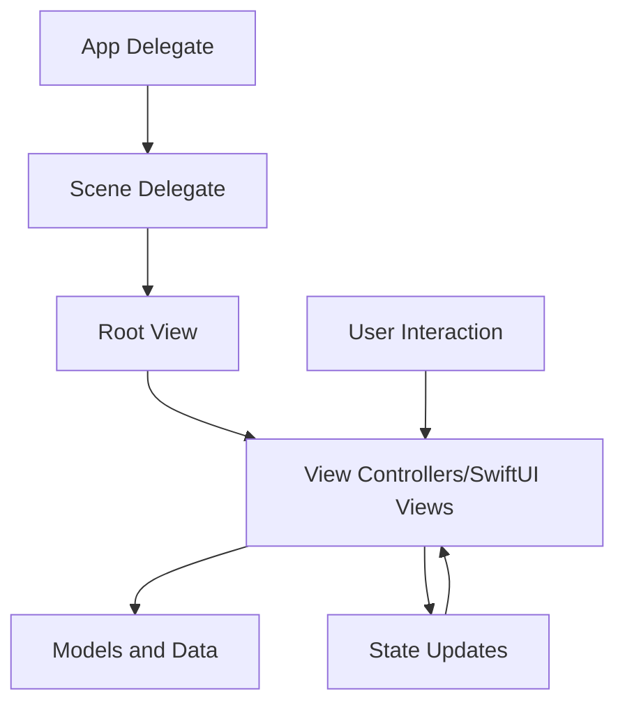
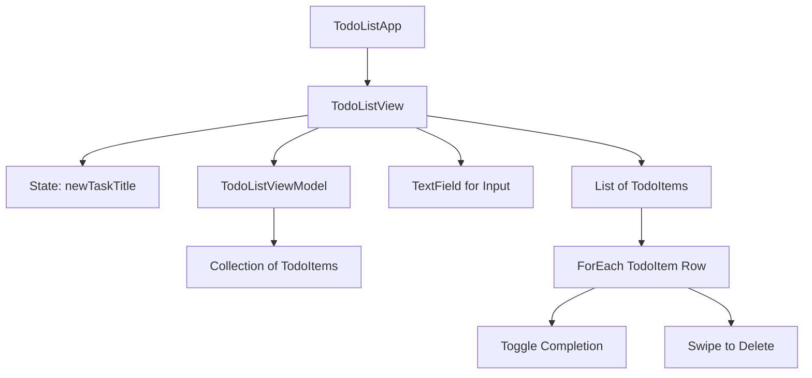
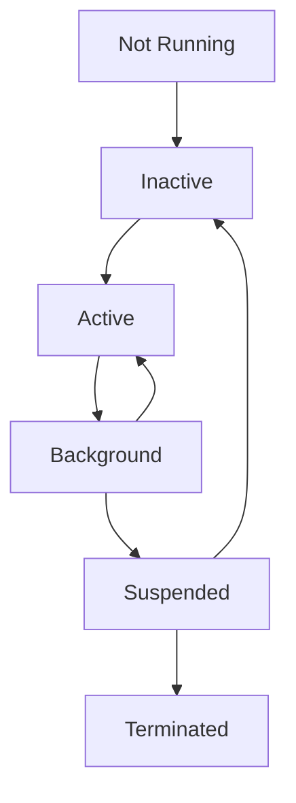

Welcome to your iOS development crash course! This guide covers the essential 85% of what you'll encounter daily when building iOS apps with Swift, giving you enough foundation to explore the remaining 15% independently.

## Prerequisites

You'll need:

- A Mac computer (macOS Monterey or newer recommended)
- Basic programming knowledge is helpful but not required
- Patience and willingness to learn

## Setting Up Your Development Environment

Before diving into code, let's get your tools ready.

### Installing Xcode

Xcode is Apple's integrated development environment for building iOS apps:

1. Open the App Store on your Mac
2. Search for "Xcode" and click "Get" or "Install"
3. Once installed, open Xcode and accept the license agreements



With Xcode installed, you now have everything needed to write Swift code and create iOS applications.

## Swift Fundamentals

Let's start with the building blocks of any Swift application.

### Variables and Constants

Swift uses two ways to store data:

```swift
// Variables (can change)
var name = "John"
name = "Jane" // This works because variables can be changed

// Constants (cannot change)
let maximumAttempts = 3
// maximumAttempts = 5 // Error! Constants can't be changed after setting
```

You can explicitly define types:

```swift
var age: Int = 30
var height: Double = 6.2
var isActive: Bool = true
var greeting: String = "Hello"
```

### Basic Operators

Swift includes familiar operators for performing calculations and comparisons:

```swift
// Arithmetic
let sum = 5 + 3      // Addition (8)
let diff = 10 - 3    // Subtraction (7)
let product = 4 * 5  // Multiplication (20)
let quotient = 10 / 2 // Division (5)
let remainder = 10 % 3 // Modulo/remainder (1)

// Comparison
let isEqual = 5 == 5         // true
let isNotEqual = 5 != 3      // true
let isGreater = 10 > 5       // true
let isLessOrEqual = 5 <= 5   // true

// Logical
let and = true && false     // false (both must be true)
let or = true || false      // true (at least one true)
let not = !true             // false (inverts value)
```

### Control Flow

Control flow statements allow your code to make decisions and repeat tasks:

```swift
// If statements
let temperature = 25

if temperature > 30 {
    print("It's hot outside!")
} else if temperature > 20 {
    print("It's a nice day!")
} else {
    print("It's a bit cold.")
}

// Loops
for i in 1...5 {
    print("Number \(i)")
}

var counter = 0
while counter < 3 {
    print("Count: \(counter)")
    counter += 1
}
```

### Collections

Swift has three primary collection types to store groups of related values:

```swift
// Arrays (ordered collections)
var fruits = ["Apple", "Banana", "Orange"]
print(fruits[0])           // Accessing by index: "Apple"
fruits.append("Mango")     // Adding an element
fruits.remove(at: 1)       // Removing "Banana"
print(fruits.count)        // 3

// Sets (unordered collections of unique values)
var uniqueNumbers: Set = [1, 2, 3, 4, 3] // Note: 3 only appears once
uniqueNumbers.insert(5)    // Adding an element
uniqueNumbers.remove(2)    // Removing an element
print(uniqueNumbers.contains(1))  // true

// Dictionaries (key-value pairs)
var capitals = ["USA": "Washington DC", "UK": "London", "Japan": "Tokyo"]
print(capitals["USA"] ?? "Unknown")  // "Washington DC"
capitals["France"] = "Paris"         // Adding a key-value pair
capitals.removeValue(forKey: "UK")   // Removing a key-value pair
```

### Functions

Functions allow you to create reusable blocks of code:

```swift
// Basic function
func greet(person: String) {
    print("Hello, \(person)!")
}
greet(person: "Swift Developer")  // "Hello, Swift Developer!"

// Function with return value
func add(a: Int, b: Int) -> Int {
    return a + b
}
let result = add(a: 5, b: 3)  // 8

// Function with default parameter
func greet(person: String, message: String = "Welcome to iOS development") {
    print("\(message), \(person)!")
}
greet(person: "Alex")  // "Welcome to iOS development, Alex!"
```

## Swift Object-Oriented Programming

Now that we understand Swift's basic types and operations, let's explore how to organize code into more complex structures.

### Structures

Structures (value types) are perfect for modeling data:

```swift
struct User {
    // Properties
    var name: String
    var age: Int

    // Method
    func describe() -> String {
        return "\(name) is \(age) years old"
    }

    // Mutating method (changes properties)
    mutating func celebrateBirthday() {
        age += 1
    }
}

// Creating an instance
var user = User(name: "Sarah", age: 28)
print(user.describe())  // "Sarah is 28 years old"
user.celebrateBirthday()
print(user.age)  // 29
```

### Classes

Classes (reference types) support inheritance and are useful for more complex objects:

```swift
class Vehicle {
    var brand: String
    var year: Int

    init(brand: String, year: Int) {
        self.brand = brand
        self.year = year
    }

    func description() -> String {
        return "A \(year) \(brand)"
    }
}

// Inheritance
class Car: Vehicle {
    var doors: Int

    init(brand: String, year: Int, doors: Int) {
        self.doors = doors
        super.init(brand: brand, year: year)
    }

    override func description() -> String {
        return "\(super.description()) with \(doors) doors"
    }
}

let myCar = Car(brand: "Toyota", year: 2023, doors: 4)
print(myCar.description())  // "A 2023 Toyota with 4 doors"
```

### Optionals

Optionals are a powerful Swift feature that handle the absence of a value:

```swift
// Optional declaration (may or may not have a value)
var username: String? = nil

// Later assigning a value
username = "swiftcoder"

// Safe unwrapping with if-let
if let name = username {
    print("Hello, \(name)!")
} else {
    print("Hello, anonymous!")
}

// Unwrapping with guard
func greetUser() {
    guard let name = username else {
        print("Please set a username")
        return
    }
    print("Welcome back, \(name)!")
}

// Optional chaining
let uppercaseName = username?.uppercased()  // Only runs if username has a value
```

## iOS App Architecture

With the Swift language fundamentals under our belt, let's look at how iOS apps are structured.

The iOS app architecture follows a pattern:



This architecture supports the flow of data and user interactions through your application, maintaining separation of concerns.

## Building User Interfaces with SwiftUI

Now let's explore how to build beautiful user interfaces using SwiftUI, Apple's modern declarative UI framework.

```swift
import SwiftUI

struct ContentView: View {
    var body: some View {
        VStack {
            // Header
            Text("SwiftUI Demo")
                .font(.largeTitle)
                .foregroundColor(.blue)
                .padding()

            // Image
            Image(systemName: "swift")
                .resizable()
                .frame(width: 100, height: 100)
                .foregroundColor(.orange)

            // Button
            Button(action: {
                print("Button tapped!")
            }) {
                Text("Tap Me")
                    .padding()
                    .background(Color.green)
                    .foregroundColor(.white)
                    .cornerRadius(10)
            }
            .padding()
        }
    }
}
```

### Basic SwiftUI Components

SwiftUI provides a rich set of components for building interfaces:

```swift
// Text
Text("Hello World")
    .font(.title)
    .foregroundColor(.blue)
    .bold()
    .padding()

// Button
Button("Press Me") {
    // Action when pressed
    print("Button pressed")
}
.padding()
.background(Color.blue)
.foregroundColor(.white)
.cornerRadius(8)

// TextField
@State private var inputText = ""
TextField("Enter text", text: $inputText)
    .padding()
    .border(Color.gray, width: 1)
    .padding()

// Image
Image(systemName: "star.fill") // System icon
    .foregroundColor(.yellow)
    .font(.system(size: 50))

// Layout containers
VStack {  // Vertical stack
    Text("Item 1")
    Text("Item 2")
    Spacer()  // Flexible space
}

HStack {  // Horizontal stack
    Text("Left")
    Spacer()
    Text("Right")
}

ZStack {  // Depth stack (overlapping elements)
    Rectangle().fill(Color.blue)
    Text("On top").foregroundColor(.white)
}
```

## Managing State and Data Flow

As your apps grow more complex, managing state becomes crucial. SwiftUI provides elegant solutions for state management:

```swift
import SwiftUI

struct CounterView: View {
    // @State - Used for simple view-local state
    @State private var count = 0

    var body: some View {
        VStack {
            Text("Count: \(count)")
                .font(.largeTitle)

            Button("Increment") {
                count += 1
            }
            .padding()
        }
    }
}

// Example using @StateObject for more complex state
class UserViewModel: ObservableObject {
    // @Published notifies views when value changes
    @Published var username = ""
    @Published var isLoggedIn = false

    func login() {
        // Simulate login
        isLoggedIn = true
    }
}

struct LoginView: View {
    // @StateObject owns and creates the object
    @StateObject private var viewModel = UserViewModel()

    var body: some View {
        VStack {
            if viewModel.isLoggedIn {
                Text("Welcome, \(viewModel.username)!")
            } else {
                TextField("Username", text: $viewModel.username)
                    .padding()

                Button("Login") {
                    viewModel.login()
                }
                .padding()
            }
        }
    }
}
```

### Data Flow in SwiftUI

Understanding how data flows through your application is essential:

```mermaid
graph TD
    A[View] -->|@State| B[Internal State]
    B -->|Updates| A

    C[Parent View] -->|@Binding| D[Child View]
    D -->|Changes| C

    E[View] -->|@StateObject<br>@ObservedObject| F[Observable Object]
    F -->|@Published| E

    G[App/Scene] -->|@EnvironmentObject| H[All Views]
```

This diagram shows the different ways data can flow in a SwiftUI application, from simple internal state to complex shared state across multiple views.

## Building a Complete Todo List App

Let's put everything we've learned into practice by building a simple Todo List app. This project will demonstrate how the different pieces work together in a real application.

### 1. The Todo Item Model

First, we need to define what a todo item looks like:

```swift
import Foundation

// Define a struct to represent a Todo item
struct TodoItem: Identifiable {
    var id = UUID()           // Unique identifier
    var title: String         // Task description
    var isCompleted: Bool = false  // Completion status
}
```

### 2. The View Model for Managing State

Next, we need a view model to manage our todo items:

```swift
import Foundation
import SwiftUI

// This class will manage our todo list data
class TodoListViewModel: ObservableObject {
    // @Published notifies views when the array changes
    @Published var items: [TodoItem] = [
        TodoItem(title: "Learn Swift"),
        TodoItem(title: "Build first app"),
        TodoItem(title: "Submit to App Store")
    ]

    // Add a new todo item
    func addItem(title: String) {
        let newItem = TodoItem(title: title)
        items.append(newItem)
    }

    // Delete items at specified indices
    func removeItems(at indexSet: IndexSet) {
        items.remove(atOffsets: indexSet)
    }

    // Toggle completion status
    func toggleCompletion(for item: TodoItem) {
        if let index = items.firstIndex(where: { $0.id == item.id }) {
            // Create a copy with toggled completion status
            items[index].isCompleted.toggle()
        }
    }
}
```

### 3. The Main Todo List View

Now we'll create the user interface for our todo list:

```swift
import SwiftUI

struct TodoListView: View {
    // State for managing the view model
    @StateObject private var viewModel = TodoListViewModel()

    // State for the new task input field
    @State private var newTaskTitle = ""

    var body: some View {
        NavigationView {
            VStack {
                // Input area for new tasks
                HStack {
                    TextField("Add a new task...", text: $newTaskTitle)
                        .padding()
                        .background(Color(.systemGray6))
                        .cornerRadius(8)

                    Button(action: {
                        // Add task when button pressed (if not empty)
                        if !newTaskTitle.isEmpty {
                            viewModel.addItem(title: newTaskTitle)
                            newTaskTitle = "" // Clear the field
                        }
                    }) {
                        Image(systemName: "plus.circle.fill")
                            .font(.title)
                            .foregroundColor(.blue)
                    }
                }
                .padding()

                // List of todo items
                List {
                    ForEach(viewModel.items) { item in
                        HStack {
                            // Checkbox image
                            Image(systemName: item.isCompleted ?
                                  "checkmark.circle.fill" : "circle")
                                .foregroundColor(item.isCompleted ? .green : .gray)
                                .onTapGesture {
                                    viewModel.toggleCompletion(for: item)
                                }

                            // Task title
                            Text(item.title)
                                .strikethrough(item.isCompleted)
                                .foregroundColor(item.isCompleted ? .gray : .primary)
                        }
                    }
                    // Enable swipe-to-delete
                    .onDelete(perform: viewModel.removeItems)
                }
            }
            .navigationTitle("Todo List")
        }
    }
}
```

### 4. The App Entry Point

Finally, we define the entry point for our application:

```swift
import SwiftUI

@main
struct TodoListApp: App {
    var body: some Scene {
        WindowGroup {
            TodoListView()
        }
    }
}
```

The app's structure can be visualized:



This diagram shows how all the pieces of our todo list app work together, from the app entry point down to the individual interactions with todo items.

## App Lifecycle

Understanding how iOS manages the lifecycle of your app is important for creating responsive applications. The app moves through several states:



In SwiftUI, you can respond to these lifecycle events using modifiers:

```swift
struct ContentView: View {
    var body: some View {
        Text("Hello, world!")
            .onAppear {
                // View has appeared on screen
                print("View appeared")
            }
            .onDisappear {
                // View has disappeared
                print("View disappeared")
            }
            .task {
                // Run async task when view appears
                await loadData()
            }
    }

    func loadData() async {
        // Load data asynchronously
    }
}
```

These lifecycle events help you manage resources and ensure your app behaves correctly when users switch between apps or when the system needs to reclaim resources.

## Error Handling in Swift

Robust apps need to handle errors gracefully. Swift provides a comprehensive error handling system:

```swift
// Define error types
enum NetworkError: Error {
    case badURL
    case noData
    case decodingError
}

// Function that can throw errors
func fetchData(from urlString: String) throws -> Data {
    // Check if URL is valid
    guard let url = URL(string: urlString) else {
        throw NetworkError.badURL
    }

    // Simulate a network request
    let success = Bool.random()

    if success {
        return Data("Sample data".utf8)
    } else {
        throw NetworkError.noData
    }
}

// Using the function with error handling
do {
    let data = try fetchData(from: "https://example.com/api")
    print("Data fetched: \(data)")
} catch NetworkError.badURL {
    print("Invalid URL provided")
} catch NetworkError.noData {
    print("No data received")
} catch {
    print("Unexpected error: \(error)")
}
```

This pattern allows you to anticipate problems and handle them appropriately, improving the reliability of your applications.

## The Remaining 15%: Advanced Topics

Now that you've mastered the essential 85% of iOS development, here's what constitutes the remaining 15% that you can explore on your own:

1. **Networking and API Integration**

   - Making HTTP requests with URLSession
   - Working with REST APIs
   - JSON parsing and Codable protocol
   - Modern async/await networking

2. **Data Persistence**

   - UserDefaults for simple storage
   - FileManager for file operations
   - Core Data for database operations
   - SwiftData (iOS 17+) for SwiftUI-native persistence

3. **Advanced UI and UX**

   - Custom animations and transitions
   - Complex layouts and custom components
   - Accessibility features
   - Localization and internationalization

4. **App Architecture Patterns**

   - MVVM pattern in depth
   - Dependency injection techniques
   - Coordinator pattern for navigation
   - The Combine framework for reactive programming

5. **Testing and Performance**

   - Unit testing with XCTest
   - UI testing automation
   - Performance profiling and optimization
   - Advanced debugging techniques

6. **Publishing and Distribution**

   - App Store submission process
   - TestFlight for beta testing
   - App signing and provisioning profiles
   - Continuous Integration/Continuous Delivery

7. **Device Features Integration**

   - Camera and photo library access
   - Location services and mapping
   - Push notifications
   - Background processing and tasks

8. **Security and Privacy**
   - Secure data storage
   - Keychain Services
   - App Transport Security
   - Privacy permissions and best practices

## Resources for Further Learning

As you continue your iOS development journey, these resources will help you dive deeper into the topics we've covered:

- Apple's [Swift Documentation](https://developer.apple.com/documentation/swift)
- [Hacking with Swift](https://www.hackingwithswift.com) by Paul Hudson
- [Stanford's CS193P Course](https://cs193p.stanford.edu) on iOS Development
- Apple Developer Forums and WWDC videos

## Summary

This crash course has covered the essential 85% of iOS development with Swift that you'll encounter daily, including:

- Swift language fundamentals (variables, types, collections, functions)
- Object-oriented programming with structures and classes
- Building user interfaces with SwiftUI
- State management and data flow
- Building a complete Todo List application
- Understanding the app lifecycle
- Error handling fundamentals

With this foundation, you're well-equipped to start creating your own iOS apps and explore the remaining 15% of advanced topics as needed for your specific projects. Remember that the best way to learn is by building real apps that solve problems you care about!
