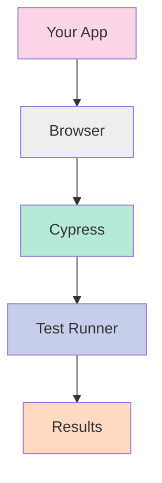
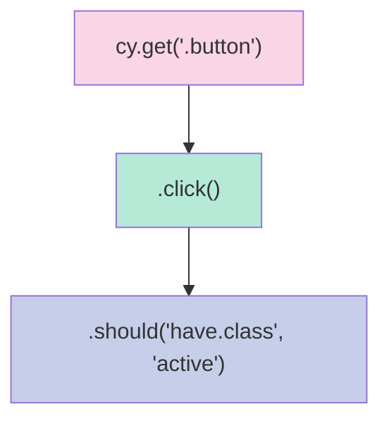
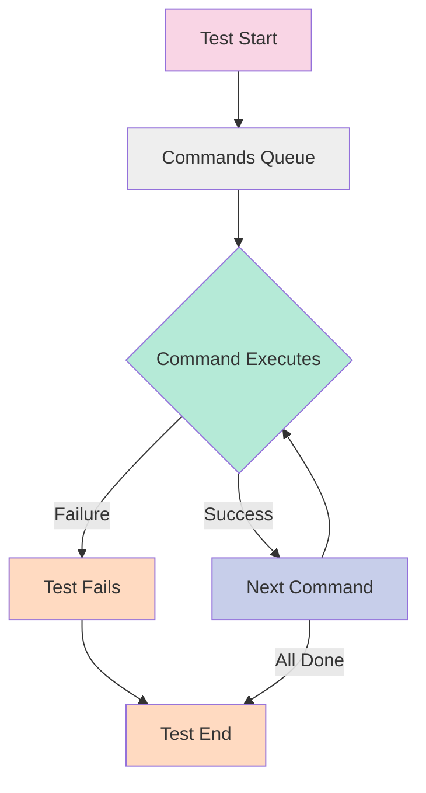

Hey there! Ready to dive into Cypress? This testing tool has made my life so much easier, and I'm excited to share it with you. Let's get you up to speed with everything you'll need for day-to-day testing.

## What is Cypress?

Cypress is a JavaScript-based end-to-end testing framework that makes it super easy to write tests for your web applications. Unlike older tools like Selenium, Cypress runs directly in the browser, giving you real-time feedback as your tests run.



## Prerequisites

Before we start, you'll need:

- Basic JavaScript knowledge
- Node.js installed on your computer (version 12 or higher)
- A code editor (like VS Code)
- A web application to test (we'll use a demo app if you don't have one)

## Getting Started

### Installation

First, let's create a new project and install Cypress:

```bash
# Create a new directory for your project
mkdir my-cypress-project
cd my-cypress-project

# Initialize a new npm project
npm init -y

# Install Cypress
npm install cypress --save-dev
```

### Opening Cypress for the First Time

Let's open Cypress to see what happens:

```bash
# Use npx to run the Cypress executable
npx cypress open
```

This will open the Cypress Test Runner and create a bunch of folders and files in your project. Don't worry - we'll go through what they all mean!

### Project Structure

Here's the main structure Cypress created:

```
my-cypress-project/
├── cypress/
│   ├── e2e/        # Your test files go here
│   ├── fixtures/   # Test data files
│   ├── support/    # Custom commands and utilities
│   └── videos/     # Recordings of test runs
├── cypress.config.js  # Configuration file
└── package.json    # Your npm project file
```

## Core Concepts

### Writing Your First Test

Let's create a simple test. Create a file called `first_test.cy.js` in the `cypress/e2e` folder:

```javascript
// cypress/e2e/first_test.cy.js

describe('My First Test', () => {
  it('visits the kitchen sink', () => {
    // Visit the Cypress example page
    cy.visit('https://example.cypress.io');

    // Find an element with content "type"
    cy.contains('type')

      // Click on it
      .click();

    // The URL should include "/commands/actions"
    cy.url().should('include', '/commands/actions');

    // Find the input element and type into it
    cy.get('.action-email')
      .type('hello@cypress.io')
      .should('have.value', 'hello@cypress.io');
  });
});
```

### The Cypress Command Structure

Cypress uses a unique command chaining syntax that might feel different if you're used to other testing frameworks:



The key thing to understand is that Cypress commands are **asynchronous** but you don't need to use async/await or promises - Cypress handles this for you!

### Selectors: Finding Elements

One of the most common tasks in Cypress is finding elements to interact with:

```javascript
// By CSS selector (most common)
cy.get('button.submit');

// By text content
cy.contains('Submit');

// By test ID (recommended approach)
cy.get('[data-testid=submit-button]');

// Chaining to find child elements
cy.get('form').find('input[name="email"]');
```

Pro tip: Add `data-testid` attributes to important elements in your app to make them easier to select in tests!

### Assertions: Checking Results

Assertions let you verify that your application is behaving correctly:

```javascript
// Check element properties
cy.get('.user-name').should('have.text', 'John Doe');
cy.get('input').should('have.value', 'hello@example.com');

// Check element state
cy.get('button').should('be.disabled');
cy.get('.dropdown').should('be.visible');

// Multiple assertions
cy.get('.status')
  .should('exist')
  .and('have.class', 'success')
  .and('contain', 'Completed');
```

## Practical Examples

### Navigating Pages

```javascript
// Visit a page
cy.visit('/dashboard');

// Click a link and navigate
cy.get('nav').contains('Products').click();

// Check the URL after navigation
cy.url().should('include', '/products');
```

### Working with Forms

```javascript
describe('Login Form', () => {
  it('should log in successfully', () => {
    cy.visit('/login');

    // Fill out the form
    cy.get('#email').type('user@example.com');
    cy.get('#password').type('securepassword123');

    // Submit the form
    cy.get('button[type="submit"]').click();

    // Verify successful login
    cy.url().should('include', '/dashboard');
    cy.get('.welcome-message').should('contain', 'Welcome back');
  });
});
```

### Testing API Responses

Cypress also lets you test API responses:

```javascript
describe('API Tests', () => {
  it('should get user data', () => {
    cy.request('GET', 'https://jsonplaceholder.typicode.com/users/1').then(
      (response) => {
        // Check status code
        expect(response.status).to.eq(200);

        // Check response body
        expect(response.body).to.have.property('name');
        expect(response.body.name).to.eq('Leanne Graham');
      },
    );
  });
});
```

### Working with Tables

```javascript
describe('Table Tests', () => {
  it('should find data in a table', () => {
    cy.visit('/users');

    // Get the third row in a table
    cy.get('table tr')
      .eq(2)
      .within(() => {
        // Check cells within this row
        cy.get('td').eq(0).should('contain', 'John');
        cy.get('td').eq(1).should('contain', 'Doe');
      });

    // Check number of rows
    cy.get('table tr').should('have.length.greaterThan', 3);
  });
});
```

## Advanced Topics (Still Part of Your Daily 85%)

### Fixtures: Using Test Data

Fixtures let you store and use test data:

1. Create a file at `cypress/fixtures/user.json`:

```json
{
  "name": "John Doe",
  "email": "john@example.com",
  "role": "Admin"
}
```

2. Use this data in your test:

```javascript
describe('User Profile', () => {
  it('displays user information', () => {
    // Load fixture data
    cy.fixture('user').then((user) => {
      // Use the data
      cy.visit(`/profile/${user.email}`);
      cy.get('.profile-name').should('contain', user.name);
      cy.get('.profile-role').should('contain', user.role);
    });
  });
});
```

### Custom Commands

Create reusable functions for common actions:

Add to `cypress/support/commands.js`:

```javascript
// Create a login command
Cypress.Commands.add('login', (email, password) => {
  cy.visit('/login');
  cy.get('#email').type(email);
  cy.get('#password').type(password);
  cy.get('button[type="submit"]').click();
  cy.url().should('include', '/dashboard');
});
```

Then use it in your tests:

```javascript
describe('Protected Pages', () => {
  beforeEach(() => {
    // Use our custom command
    cy.login('user@example.com', 'password123');
  });

  it('can access account settings', () => {
    cy.visit('/settings');
    cy.get('h1').should('contain', 'Account Settings');
  });
});
```

### Stubbing Network Requests

Cypress can intercept and mock network requests:

```javascript
describe('User Profile with Stubbed API', () => {
  it('displays error message when API fails', () => {
    // Intercept GET requests to /api/user and force a failure
    cy.intercept('GET', '/api/user', {
      statusCode: 500,
      body: { error: 'Server error' },
    }).as('getUserError');

    cy.visit('/profile');

    // Wait for the intercepted request
    cy.wait('@getUserError');

    // Verify error message appears
    cy.get('.error-message')
      .should('be.visible')
      .and('contain', 'Could not load profile');
  });

  it('displays user data from API', () => {
    // Intercept and return mock data
    cy.intercept('GET', '/api/user', {
      statusCode: 200,
      body: {
        name: 'Jane Smith',
        email: 'jane@example.com',
        role: 'Editor',
      },
    }).as('getUser');

    cy.visit('/profile');
    cy.wait('@getUser');

    // Verify the UI shows our mock data
    cy.get('.profile-name').should('contain', 'Jane Smith');
    cy.get('.profile-role').should('contain', 'Editor');
  });
});
```

### The Cypress Test Execution Flow

Understanding how Cypress runs commands is crucial:



Cypress doesn't execute commands immediately - it queues them and runs them in sequence. This is why you don't need to use `await` or `.then()` for most commands!

## Database Testing Example

If you're working with a database, here's how you might set up a test with seeding data:

```javascript
describe('Product Database Tests', () => {
  beforeEach(() => {
    // Reset and seed the database
    cy.task('db:seed', {
      products: [
        { id: 1, name: 'Laptop', price: 999 },
        { id: 2, name: 'Keyboard', price: 129 },
        { id: 3, name: 'Mouse', price: 59 },
      ],
    });

    // Visit the products page
    cy.visit('/products');
  });

  it('displays all products from database', () => {
    // Check if all 3 products are shown
    cy.get('.product-card').should('have.length', 3);

    // Check specific product details
    cy.contains('.product-card', 'Laptop').should('contain', '$999');
  });
});
```

To make this work, you'd need to set up a custom task in your `cypress.config.js`:

```javascript
const { defineConfig } = require('cypress');

module.exports = defineConfig({
  e2e: {
    setupNodeEvents(on, config) {
      on('task', {
        'db:seed': (data) => {
          // Here you would connect to your database and seed it
          // This is just a simplified example
          console.log('Seeding database with:', data);
          return null; // Tasks must return null or a value
        },
      });
    },
  },
});
```

## Running Cypress Tests

You can run tests in two ways:

1. **Interactive mode** (great for development):

```bash
npx cypress open
```

2. **Headless mode** (great for CI/CD):

```bash
npx cypress run
```

## The Remaining 15% (What We Didn't Cover)

Here's what you can explore on your own once you're comfortable with the basics:

1. **Component Testing** - Testing individual React, Vue, or Angular components
2. **Visual Testing** - Detecting visual regressions with plugins like Applitools or Percy
3. **Advanced Mocking** - More complex scenarios with `cy.intercept()` including dynamic responses
4. **CI/CD Integration** - Setting up Cypress in GitHub Actions, Jenkins, CircleCI, etc.
5. **Cross-browser Testing** - Running tests across different browsers
6. **Cypress Dashboard Service** - Recording test results and parallelization
7. **Performance Testing** - Measuring load times and performance metrics
8. **Custom Plugins** - Extending Cypress with custom functionality
9. **Security Testing** - Testing authentication, authorization, and security aspects
10. **Mobile Testing** - Strategies for testing responsive designs
11. **Accessibility Testing** - Using Cypress with axe-core for a11y tests
12. **Test Retries** - Configuring automatic retries for flaky tests
13. **Advanced Selectors** - Using XPath and more complex selectors
14. **Page Object Model** - Organizing tests with the POM pattern
15. **Video Recording and Screenshots** - Configuring and using these features

To explore these topics, the best resources are:

- [Official Cypress Documentation](https://docs.cypress.io/)
- [Cypress GitHub Repository](https://github.com/cypress-io/cypress)
- [Cypress Blog](https://www.cypress.io/blog/)

## Final Tips

1. **Start simple** - Begin with basic navigation and form tests
2. **Use data-testid attributes** - Make your app more testable
3. **Don't use `cy.wait(timeout)`** - Use `cy.wait('@alias')` for network requests instead
4. **Write small, focused tests** - Each test should verify one thing
5. **Run tests often** during development - The Cypress Test Runner makes this easy!

And that's it! You now know 85% of what you need for daily Cypress testing. The rest you'll pick up as you go along. Happy testing! ☕
