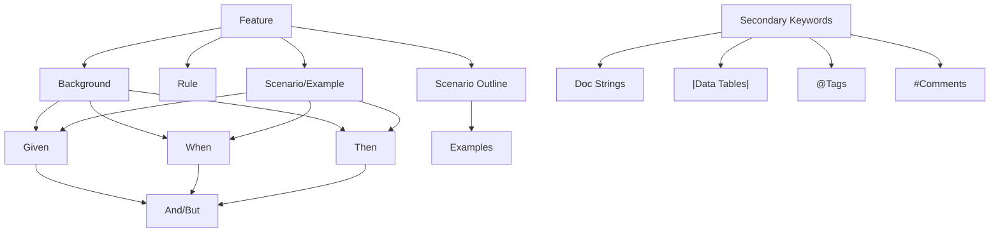
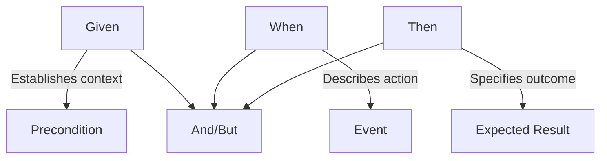

## Introduction to Gherkin and BDD

Imagine being able to write software requirements that not only serve as documentation but can also be automatically tested. That's exactly what Gherkin offers. Gherkin is a plain-text language designed for expressing software behavior through human-readable scenarios that bridge the gap between technical and non-technical team members.

These readable scenarios serve two powerful purposes:

1. As **living documentation** that clearly describes product functionality
2. As **executable specifications** that can be automated with tools like Cucumber

Behavior-Driven Development (BDD) evolved naturally from Test-Driven Development (TDD), addressing the communication challenges that often arise between business stakeholders and development teams. Gherkin supports this approach by providing a common language everyone can understand and contribute to.

### Why Gherkin Matters

Gherkin brings several significant benefits to the software development process:

- Creates a shared language between business and development teams
- Transforms abstract requirements into concrete, testable scenarios
- Significantly reduces ambiguity in specifications
- Enables efficient reuse of test code through its structured approach
- Serves as both comprehensive documentation and automated tests

When teams adopt Gherkin, they often find that requirements discussions become more productive and focused on actual user behavior rather than technical implementations.

## Gherkin Fundamentals

Now that we understand why Gherkin is valuable, let's explore how it actually works in practice.

### Feature File Structure

Gherkin files use the `.feature` extension and follow a clear, consistent structure that's easy to learn:

```gherkin
Feature: Title of the feature

  In order to [achieve some business value]
  As a [role]
  I want to [feature functionality]

  Scenario: Title of a specific scenario
    Given [some precondition]
    When [some action occurs]
    Then [expected outcome]
```

This structure reflects how users actually interact with software: they begin in a certain context, take an action, and expect a particular result.

### Core Keywords Visualization

The following diagram shows how Gherkin's keywords relate to each other, creating a hierarchical structure that organizes your tests logically:



This hierarchical structure helps organize test scenarios in a way that matches how features actually work in your software.

### Key Gherkin Keywords

Let's explore each keyword in more detail to understand how they work together:

- **Feature**: Describes the high-level functionality being tested
- **Scenario/Example**: A concrete example of behavior that illustrates how the feature works
- **Given**: Sets up the initial context or precondition for the test
- **When**: Describes the specific action that triggers the scenario
- **Then**: Describes the expected outcome after the action is taken
- **And, But**: Extends any of the above steps for more complex scenarios
- **Background**: Defines common steps that should run before all scenarios in a feature
- **Scenario Outline/Examples**: Creates a template for multiple similar scenarios with different data
- **Rule**: Groups related scenarios that verify a particular business rule (available in Gherkin 6+)
- **"""** (Doc Strings): For including larger text blocks when simple strings aren't enough
- **|** (Data Tables): For passing tabular data as input to your steps
- **@** (Tags): For categorizing scenarios and enabling selective test execution
- **#** (Comments): For adding explanatory notes that aren't part of the test

These keywords combine to create a powerful, expressive language for describing software behavior.

## Writing Effective Gherkin Scenarios

With the basic syntax under our belt, let's focus on how to write Gherkin scenarios that are clear, maintainable, and effective.

### The Given-When-Then Framework

At the heart of every good Gherkin scenario is the Given-When-Then framework, which maps perfectly to how we think about software behavior:



This structure creates a natural flow in your scenarios that's easy to follow: start with the context, describe what happens, and specify what should result.

### Basic Scenario Example

Let's look at a concrete example to see how this framework works in practice:

```gherkin
Scenario: Customer withdraws money from ATM
  Given the account balance is $100
  And the card is valid
  When the customer requests $20
  Then the ATM should dispense $20
  And the account balance should be $80
  And the receipt should show the remaining balance
```

Notice how this scenario reads almost like a story. It establishes the initial state (account with $100, valid card), describes an action (requesting $20), and specifies the expected outcome (money dispensed, balance updated, receipt shown). Anyone reading this scenario can understand exactly what behavior is being tested, regardless of their technical background.

### Best Practices for Writing Gherkin

To get the most value from Gherkin, follow these proven best practices that experienced BDD practitioners recommend:

1. **Focus on behavior, not implementation**

   ```gherkin
   # Good: Describes behavior
   When the user submits the registration form

   # Bad: Implementation details
   When the user clicks the submit button and the form data is sent via POST
   ```

   By focusing on behavior, your tests remain valid even if the implementation changes.

2. **Use business language, not technical terms**

   ```gherkin
   # Good: Business language
   Then the customer should be notified of successful payment

   # Bad: Technical terms
   Then the system should return HTTP 200 and update the database
   ```

   Business language ensures that all stakeholders understand the scenarios.

3. **Be specific and concrete**

   ```gherkin
   # Good: Specific and concrete
   When I enter a card number that is less than 16 digits

   # Bad: Vague
   When I enter invalid data
   ```

   Specificity eliminates ambiguity and makes tests more reliable.

4. **Keep scenarios independent**

   - Each scenario should run on its own without relying on previous scenarios
   - This independence makes tests more reliable and easier to maintain

5. **One scenario, one behavior**
   - Test only one specific aspect of functionality per scenario
   - This clarity helps pinpoint issues when tests fail

Following these practices leads to scenarios that serve as both clear documentation and reliable tests.

## Advanced Gherkin Features

Once you're comfortable with basic scenarios, you can leverage these more powerful features to handle complex testing situations efficiently.

### Scenario Outlines and Examples

When you need to test the same scenario with multiple sets of data, Scenario Outlines save you from writing repetitive scenarios:

```gherkin
Scenario Outline: Credit card validation
  When I enter a card number <number>
  Then I should see the message <message>

  Examples:
    | number           | message                             |
    | 4111111111111    | Card number must be 16 digits       |
    | 411111111111111X | Card number must contain only digits|
    | 4111111111111111 | Card number is valid                |
```

This single outline generates three separate test scenarios, streamlining your test suite while maintaining comprehensive coverage.

### Data Tables

For passing complex data structures to steps, data tables provide a clean, readable format:

```gherkin
Scenario: Calculate total price of shopping cart
  Given my shopping cart contains:
    | Product     | Quantity | Price |
    | Cucumber    | 2        | $0.50 |
    | Gherkin     | 1        | $0.75 |
  When I proceed to checkout
  Then my total should be $1.75
```

Data tables make it easy to work with sets of related data in a visually clear way.

### Backgrounds

For steps that need to run before each scenario in a feature, the Background section eliminates repetition and keeps your scenarios focused:

```gherkin
Feature: Shopping cart functionality

  Background:
    Given I am logged in as a customer
    And I have an empty shopping cart

  Scenario: Add product to cart
    When I add "Cucumber" to my cart
    Then my cart should contain 1 item

  Scenario: Remove product from cart
    Given I have added "Cucumber" to my cart
    When I remove "Cucumber" from my cart
    Then my cart should be empty
```

The background steps run before each scenario, establishing a common starting point.

### Tags

For categorizing and filtering scenarios, tags provide a flexible labeling system:

```gherkin
@ui @critical @regression
Scenario: Users can log in successfully
  Given I am on the login page
  When I enter valid credentials
  Then I should be redirected to the dashboard
```

Tags allow you to run specific subsets of your tests, such as only UI tests or only critical functionality, streamlining your testing workflows.

## Getting Started with Gherkin in Practice

Now that we've covered the concepts, let's get hands-on with Gherkin by setting up a simple project.

### Prerequisites

Before we start, you'll need:

1. A text editor (preferably with Gherkin syntax highlighting)

   - Visual Studio Code with Cucumber extension
   - IntelliJ IDEA with Cucumber for Java plugin
   - Any text editor that supports Gherkin syntax

2. A BDD framework like Cucumber, SpecFlow, or Behave

3. A programming language for step definitions (Java, C#, JavaScript, Ruby, etc.)

### Installation and Setup (Using Cucumber with Java)

We'll use Java with Cucumber for this example because it's widely used and well-documented. The process is similar for other languages.

1. **Install Java and Maven**

   ```bash
   # Verify installations
   java -version
   mvn -version
   ```

2. **Create a new Cucumber project**

   ```bash
   mvn archetype:generate \
     -DarchetypeGroupId=io.cucumber \
     -DarchetypeArtifactId=cucumber-archetype \
     -DarchetypeVersion=7.11.1 \
     -DgroupId=com.example \
     -DartifactId=cucumber-demo
   ```

3. **Project structure**
   ```
   cucumber-demo/
   ├── pom.xml                        # Maven configuration
   └── src/
       ├── main/java/com/example/     # Application code
       └── test/
           ├── java/com/example/      # Step definitions
           └── resources/com/example/ # Feature files
   ```

Once set up, this structure separates your test code from your application code, maintaining a clean organization.

### Writing Your First Feature File

Let's create a simple feature file to test the "Is it Friday yet?" functionality. Create a file named `is_it_friday.feature` in `src/test/resources/com/example/`:

```gherkin
Feature: Is it Friday yet?
  Everyone wants to know when it's Friday

  Scenario: Sunday isn't Friday
    Given today is Sunday
    When I ask whether it's Friday yet
    Then I should be told "Nope"

  Scenario: Friday is Friday
    Given today is Friday
    When I ask whether it's Friday yet
    Then I should be told "TGIF!"
```

This simple feature demonstrates the basic structure of Gherkin scenarios with clear preconditions, actions, and expected outcomes.

### Implementing Step Definitions

Now we need to connect our Gherkin steps to actual code. Create a file named `StepDefinitions.java` in `src/test/java/com/example/`:

```java
package com.example;

import io.cucumber.java.en.Given;
import io.cucumber.java.en.When;
import io.cucumber.java.en.Then;
import static org.junit.Assert.assertEquals;

public class StepDefinitions {
    private String today;
    private String actualAnswer;

    @Given("today is {string}")
    public void today_is(String day) {
        // Set up the test context
        today = day;
    }

    @When("I ask whether it's Friday yet")
    public void i_ask_whether_it_s_friday_yet() {
        // Execute the action
        actualAnswer = IsItFriday.isItFriday(today);
    }

    @Then("I should be told {string}")
    public void i_should_be_told(String expectedAnswer) {
        // Verify the outcome
        assertEquals(expectedAnswer, actualAnswer);
    }

    // Implement the class used in the step definition
    public static class IsItFriday {
        public static String isItFriday(String today) {
            return "Friday".equals(today) ? "TGIF!" : "Nope";
        }
    }
}
```

The step definitions connect your Gherkin steps to actual code implementation, using annotations to map phrases to methods.

### Running Your Tests

With your feature file and step definitions in place, you can now run your tests from the project root directory:

```bash
mvn test
```

This command executes all your Cucumber tests and shows the results, including which scenarios passed and which failed.

### Complete Example with Comments

Let's look at a more complete example that demonstrates more Gherkin features. This calculator example shows how multiple scenarios work together to test a feature thoroughly:

```gherkin
# File: src/test/resources/com/example/calculator.feature
Feature: Basic Calculator Operations
  As a user
  I want to perform basic mathematical operations
  So that I can do simple calculations

  # Background will run before each scenario
  Background:
    Given I have a calculator

  Scenario: Addition of two numbers
    # Set up preconditions
    Given I have entered 50 into the calculator
    And I have entered 70 into the calculator
    # Perform the action
    When I press add
    # Assert the expected result
    Then the result should be 120 on the screen
    # Evaluation: Addition works correctly for positive integers

  Scenario Outline: Multiplication of various numbers
    # Using parameters to test multiple combinations
    Given I have entered <first> into the calculator
    And I have entered <second> into the calculator
    When I press multiply
    Then the result should be <result> on the screen
    # Evaluation: Multiplication works for the test cases

    Examples:
      | first | second | result |
      | 2     | 3      | 6      |
      | 0     | 5      | 0      |
      | -2    | 8      | -16    |
```

And here are the corresponding Java step definitions:

```java
package com.example;

import io.cucumber.java.en.Given;
import io.cucumber.java.en.When;
import io.cucumber.java.en.Then;
import static org.junit.Assert.assertEquals;
import java.util.ArrayList;
import java.util.List;

public class CalculatorStepDefinitions {
    // Test context
    private Calculator calculator;
    private List<Integer> numbers = new ArrayList<>();
    private int result;

    @Given("I have a calculator")
    public void i_have_a_calculator() {
        // Initialize the calculator
        calculator = new Calculator();
    }

    @Given("I have entered {int} into the calculator")
    public void i_have_entered_into_the_calculator(Integer number) {
        // Add the number to our list of inputs
        numbers.add(number);
    }

    @When("I press add")
    public void i_press_add() {
        // Perform addition on all entered numbers
        result = calculator.add(numbers.get(0), numbers.get(1));
    }

    @When("I press multiply")
    public void i_press_multiply() {
        // Perform multiplication on entered numbers
        result = calculator.multiply(numbers.get(0), numbers.get(1));
    }

    @Then("the result should be {int} on the screen")
    public void the_result_should_be_on_the_screen(Integer expectedResult) {
        // Verify the result matches our expectation
        assertEquals(expectedResult.intValue(), result);
    }

    // Simple Calculator implementation
    public static class Calculator {
        public int add(int a, int b) {
            return a + b;
        }

        public int multiply(int a, int b) {
            return a * b;
        }
    }
}
```

This example demonstrates how Gherkin and step definitions work together to create readable, maintainable tests that verify your software behaves as expected.

## The Last 15%: Advanced Topics for Further Exploration

Now that you've mastered the daily essentials (85%), you're ready to explore more advanced topics that will take your BDD practice to the next level. Here are the key areas to investigate as you grow your expertise:

1. **Custom Parameter Types**

   - Define reusable parameter transformations for complex data types
   - Example: Converting string dates to Date objects automatically

2. **Step Definition Techniques**

   - Patterns for maintainable step definitions
   - Dependency injection in Cucumber
   - Sharing state between steps

3. **Page Object Pattern**

   - Structure UI automation code effectively
   - Separate UI interaction from test logic

4. **Cucumber Hooks**

   - Run code before and after scenarios with @Before and @After annotations
   - Set up test data and clean up after tests

5. **Parallel Test Execution**

   - Run tests simultaneously for faster feedback
   - Configure thread-safe test execution

6. **Advanced Reporting**

   - Generate detailed test reports with Cucumber Reports
   - Custom formatters and plugins

7. **Continuous Integration**

   - Integrate Cucumber tests with CI/CD pipelines
   - Jenkins, GitHub Actions, etc.

8. **API Testing with Gherkin**

   - Apply BDD principles to API testing
   - REST API validation with Cucumber

9. **Advanced Gherkin Language Features**

   - Doc Strings for larger text input
   - Rule keyword to group related scenarios
   - Localization of Gherkin keywords

10. **BDD at Scale**
    - Implement BDD across large organizations
    - Managing feature files in large projects
    - Reusing steps across projects

As you explore these advanced topics, you'll discover powerful ways to extend your BDD practice and solve more complex testing challenges.

## Summary

Throughout this crash course, you've gained a solid foundation in Gherkin that will serve you well in your daily work:

- You understand Gherkin's purpose in bridging communication gaps between business and technical teams
- You've learned the core syntax and keywords that structure clear, testable scenarios
- You can write effective Given-When-Then scenarios that document expected behavior
- You're familiar with advanced features like Scenario Outlines and Data Tables for handling complex testing needs
- You know how to set up your environment and create your first feature files and step definitions

By mastering these fundamentals, you now have the knowledge to create clear, executable specifications that serve as both living documentation and automated tests. As you practice and apply these skills, you'll discover how Gherkin can transform the way your team thinks about requirements and testing, leading to better software and more productive collaboration.

When you're ready to deepen your expertise, the advanced topics in the "Last 15%" section will help you tackle more complex challenges and optimize your BDD workflow.
