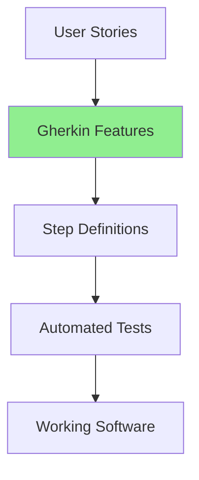
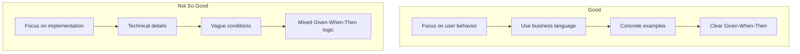
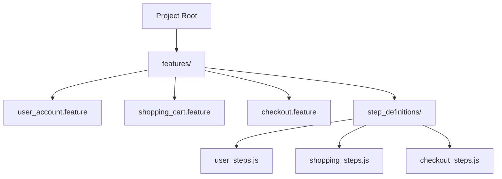

# Gherkin: The Friendly Guide to Behavior-Driven Development

Hey there! So you want to learn about Gherkin? Great choice! Gherkin is this amazing language that bridges the gap between technical and non-technical people when it comes to software requirements and testing. Let's dive in and get you up to speed!

## What is Gherkin and Why Should You Care?

Gherkin is a plain-text language designed to describe software behavior in a way that's easy for everyone to understand - developers, testers, business folks, literally anyone! It's the language behind Behavior-Driven Development (BDD), which focuses on defining how software should behave from a user's perspective.

Think of Gherkin as a structured way to write user stories or acceptance criteria. Instead of technical jargon, it uses natural language patterns that follow a specific structure.

## The BDD Process and Where Gherkin Fits



## Getting Started: Tools You'll Need

To use Gherkin effectively, you'll want to pair it with a BDD framework that can execute your Gherkin scenarios as tests. The most popular options are:

- **Cucumber** (for multiple languages)
- **SpecFlow** (for .NET)
- **Behave** (for Python)
- **Behat** (for PHP)

Let's set up Cucumber.js as an example:

```bash
# Create a new project
mkdir my-gherkin-project
cd my-gherkin-project
npm init -y

# Install Cucumber
npm install --save-dev @cucumber/cucumber
```

Create your first feature file in a `features` directory:

```bash
mkdir -p features/step_definitions
touch features/my_first.feature
```

## The Core of Gherkin: Given-When-Then

Gherkin's structure is beautifully simple. Here's the basic pattern:

```gherkin
Feature: [Title of what you're describing]

  Scenario: [Specific example of the feature in action]
    Given [some initial context]
    When [an action occurs]
    Then [expected outcome]
```

Let's see a real example:

```gherkin
Feature: Shopping Cart Checkout
  As a customer
  I want to checkout items in my cart
  So that I can purchase the items I need

  Scenario: Successful checkout with valid payment
    Given I have 3 items in my cart
    And I am logged in as a registered user
    When I proceed to checkout
    And I enter valid payment details
    Then my order should be confirmed
    And I should receive an order confirmation email
```

Pretty readable, right? Even your product manager or clients can understand this!

## Adding More Flavor with Additional Keywords

Gherkin offers more keywords to make your scenarios expressive:

- **And, But**: To add more steps in any section
- **Background**: For steps that run before every scenario
- **Scenario Outline**: For data-driven scenarios with examples

Let's expand our shopping cart example:

```gherkin
Feature: Shopping Cart Checkout

  Background:
    Given the store has the following items:
      | Item       | Price |
      | T-shirt    | 15.99 |
      | Jeans      | 39.99 |
      | Socks      | 4.99  |
    And I am logged in as a registered user

  Scenario: Successful checkout with valid payment
    Given I have added 2 T-shirts to my cart
    And I have added 1 pair of Jeans to my cart
    When I proceed to checkout
    And I enter valid payment details
    Then my order should be confirmed
    And I should receive an order confirmation email
    And my total should be 71.97

  Scenario Outline: Apply different discount codes
    Given I have added <item> to my cart
    When I apply discount code <code>
    Then I should see a discount of <discount>
    And my final price should be <final_price>

    Examples:
      | item       | code      | discount | final_price |
      | T-shirt    | SUMMER10  | 1.60     | 14.39       |
      | Jeans      | SUMMER10  | 4.00     | 35.99       |
      | Jeans      | SPECIAL20 | 8.00     | 31.99       |
```

See how the Scenario Outline lets us test multiple combinations with different data? Super useful!

## Writing Step Definitions: The Code Behind Gherkin

Now, Gherkin alone doesn't execute tests. You need to write "step definitions" that connect your Gherkin steps to actual code. Here's how it works with Cucumber.js:

Create a file `features/step_definitions/checkout_steps.js`:

```javascript
const { Given, When, Then } = require('@cucumber/cucumber');
const assert = require('assert');

// This creates a simple shopping cart for our tests
const shoppingCart = {
  items: [],
  user: null,
  discountCode: null,

  addItem(item, quantity = 1) {
    for (let i = 0; i < quantity; i++) {
      this.items.push(item);
    }
  },

  calculateTotal() {
    return this.items.reduce((total, item) => total + item.price, 0);
  },

  applyDiscount(code) {
    // Simple discount logic - could be more complex in real world
    this.discountCode = code;
    if (code === 'SUMMER10') return 0.1; // 10% off
    if (code === 'SPECIAL20') return 0.2; // 20% off
    return 0;
  },

  checkout(paymentDetails) {
    // In a real app, you'd process payment here
    return {
      success: true,
      orderNumber: 'ORD-' + Math.floor(Math.random() * 10000),
    };
  },
};

// Our mock store catalog
const catalog = {
  'T-shirt': { price: 15.99 },
  Jeans: { price: 39.99 },
  Socks: { price: 4.99 },
};

// Step definitions matching our Gherkin steps
Given('the store has the following items:', function (dataTable) {
  // In a real test, you might seed a test database here
  // For our simple example, we're just checking our catalog matches
  const items = dataTable.hashes();
  items.forEach((item) => {
    assert.strictEqual(
      catalog[item.Item].price,
      parseFloat(item.Price),
      `Expected ${item.Item} to cost ${item.Price}`,
    );
  });
});

Given('I am logged in as a registered user', function () {
  shoppingCart.user = { id: 123, name: 'Test User', email: 'test@example.com' };
});

Given('I have added {int} {word} to my cart', function (quantity, itemName) {
  const item = catalog[itemName];
  shoppingCart.addItem(item, quantity);
});

Given('I have {int} items in my cart', function (itemCount) {
  // We could add random items here
  for (let i = 0; i < itemCount; i++) {
    shoppingCart.addItem(catalog['T-shirt']);
  }
  assert.strictEqual(shoppingCart.items.length, itemCount);
});

When('I proceed to checkout', function () {
  // Just a placeholder in our simple example
  this.total = shoppingCart.calculateTotal();
});

When('I enter valid payment details', function () {
  this.checkoutResult = shoppingCart.checkout({
    cardType: 'visa',
    cardNumber: '4111111111111111',
    expiry: '12/25',
    cvv: '123',
  });
});

When('I apply discount code {word}', function (code) {
  this.discountRate = shoppingCart.applyDiscount(code);
  this.discountAmount =
    Math.round(shoppingCart.calculateTotal() * this.discountRate * 100) / 100;
  this.finalPrice =
    Math.round((shoppingCart.calculateTotal() - this.discountAmount) * 100) /
    100;
});

Then('my order should be confirmed', function () {
  assert(this.checkoutResult.success);
});

Then('I should receive an order confirmation email', function () {
  // In a real test, you might check an email service or mock
  // Here we're just assuming it would happen
});

Then('my total should be {float}', function (expectedTotal) {
  assert.strictEqual(this.total, expectedTotal);
});

Then('I should see a discount of {float}', function (expectedDiscount) {
  assert.strictEqual(this.discountAmount, expectedDiscount);
});

Then('my final price should be {float}', function (expectedPrice) {
  assert.strictEqual(this.finalPrice, expectedPrice);
});
```

Run it with:

```bash
npx cucumber-js
```

And you'll see your tests execute!

## Best Practices for Great Gherkin

Let's talk about what makes good Gherkin:

1. **Keep it focused on behavior, not implementation**: Think about what the user wants to accomplish, not how the code does it.

2. **Use business terminology**: Avoid technical jargon when possible.

3. **One scenario, one behavior**: Each scenario should test one specific thing.

4. **Be specific with examples**: Concrete examples are better than abstract ones.

5. **Use declarative style**: "Given the user is on the login page" is better than "Given the user navigates to /login".

Here's a visual representation of good vs. not-so-good Gherkin:



## Organizing Larger Projects

For bigger projects, organization becomes crucial:



Use tags to categorize scenarios:

```gherkin
@shopping @high-priority
Scenario: Add item to cart
  Given I browse the product catalog
  When I add an item to my cart
  Then the item should appear in my cart
```

Then run specific tagged scenarios:

```bash
npx cucumber-js --tags "@shopping and @high-priority"
```

## The 15% You'll Explore Later

Congratulations! You now know about 85% of what you need for daily Gherkin use. Here's what we've left for you to explore:

1. **Hooks and World Objects**: Setup and teardown code that runs before/after scenarios
2. **Custom Parameter Types**: Creating reusable patterns in your step definitions
3. **Tag-based Hooks**: Running specific setup code only for certain tagged scenarios
4. **Gherkin Internationalization**: Using Gherkin in languages other than English
5. **Cucumber Expressions**: More powerful matching patterns than regular expressions
6. **Nested Steps**: Reusing step definitions within other step definitions
7. **Cucumber Reports**: Generating beautiful HTML reports of your test runs
8. **Cucumber.js with TypeScript**: Type-safe step definitions
9. **Parallel Test Execution**: Running multiple scenarios concurrently for speed
10. **Integration with CI/CD**: Setting up Gherkin tests in your build pipeline

These topics will become relevant as your BDD practice matures, but the foundation we've covered will serve you well for most day-to-day needs.

Happy Gherkining! Remember, the goal is shared understanding between all stakeholders - use it to communicate, not just to test!
