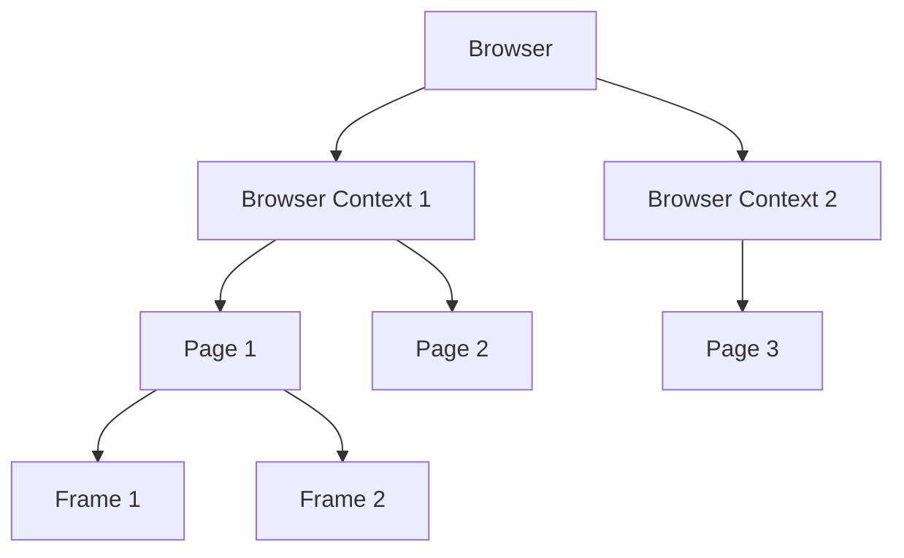
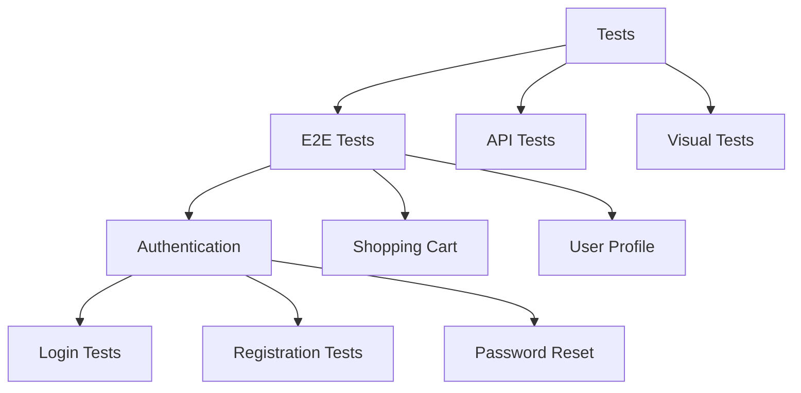

Hey there! Welcome to your Playwright crash course! ☕ Imagine we're sitting at a coffee shop and I'm walking you through one of my favorite testing tools. By the end of this guide, you'll know 85% of what you need for day-to-day Playwright usage, with a clear path to explore the rest.

## What is Playwright?

Playwright is a powerful automation library developed by Microsoft that allows you to control browsers (Chrome, Firefox, Safari) programmatically. It's primarily used for:

- Automated testing of web applications
- Web scraping
- Taking screenshots or generating PDFs
- Automating browser workflows

What makes Playwright special is its ability to work across all modern browsers with a single API, its speed, and its reliability with modern web apps.

## Prerequisites

Before we dive in, you'll need:

- Basic knowledge of JavaScript/TypeScript
- Node.js installed (version 14 or later)
- A code editor (VS Code recommended)
- Basic understanding of web technologies (HTML, CSS, DOM)

## Getting Started with Playwright

### Installation

Let's set up a new project with Playwright:

```bash
# Create a new directory and navigate to it
mkdir playwright-demo
cd playwright-demo

# Initialize a new Node.js project
npm init -y

# Install Playwright
npm init playwright@latest
```

During the installation, you'll be prompted with a few questions:

- Choose JavaScript or TypeScript (I recommend TypeScript for better developer experience)
- Choose the test directory (default is fine)
- Add GitHub Actions workflow for running tests (yes/no based on your needs)
- Install Playwright browsers (yes - this will download Chromium, Firefox, and WebKit)

### Your First Test

Let's create your first test! Playwright uses a test runner and an assertion library out of the box. Here's a simple test:

```javascript
// tests/example.spec.js
const { test, expect } = require('@playwright/test');

test('basic test', async ({ page }) => {
  // Navigate to the website
  await page.goto('https://playwright.dev/');

  // Get the title
  const title = await page.title();

  // Assert that the title contains 'Playwright'
  expect(title).toContain('Playwright');

  // Click the Get Started link
  await page.click('text=Get Started');

  // Assert that the URL changed to include '/docs/intro'
  expect(page.url()).toContain('/docs/intro');
});
```

### Running Your Test

To run your test, simply execute:

```bash
npx playwright test
```

You'll see output showing the test being executed across the three browsers (Chromium, Firefox, and WebKit).

## Core Concepts

### The Browser, Context, and Page

Playwright has a clear hierarchy:

```
Browser → BrowserContext → Page → Frame
```

Let's visualize this:



- **Browser**: The browser instance (Chrome, Firefox, etc.)
- **BrowserContext**: Like an incognito window - isolated from other contexts
- **Page**: A single tab within a browser
- **Frame**: A frame within a page (like an iframe)

This hierarchy is important because each level has different capabilities and lifetimes.

### Selectors: Finding Elements

Playwright supports multiple selector engines:

```javascript
// Text content
await page.click('text=Click me');

// CSS selectors
await page.fill('input#username', 'john');

// XPath
await page.click('xpath=//button');

// Combining selectors
await page.click('article >> text=Read more');

// Using data-testid (recommended for stable tests)
await page.click('[data-testid="submit-button"]');
```

Tip: Using `data-testid` attributes in your application makes your tests more resilient to UI changes!

### Actions: Interacting with Elements

Common actions include:

```javascript
// Clicking
await page.click('button');

// Filling form fields
await page.fill('input[name="username"]', 'john');

// Selecting options
await page.selectOption('select#country', 'USA');

// Checking checkboxes
await page.check('input[type="checkbox"]');

// Hovering
await page.hover('.dropdown-trigger');

// Drag and drop
await page.dragAndDrop('#source', '#target');
```

### Assertions: Verifying Expectations

Playwright comes with built-in assertions:

```javascript
// Check if element is visible
await expect(page.locator('.success-message')).toBeVisible();

// Check text content
await expect(page.locator('h1')).toHaveText('Welcome to our website');

// Check attribute
await expect(page.locator('input')).toHaveAttribute('disabled', '');

// Check URL
await expect(page).toHaveURL(/.*dashboard/);

// Check screenshot (visual comparison)
await expect(page).toHaveScreenshot('homepage.png');
```

## Writing Complete Tests

Let's write a more complete test for a login flow:

```javascript
// tests/login.spec.js
const { test, expect } = require('@playwright/test');

test.describe('Login functionality', () => {
  test.beforeEach(async ({ page }) => {
    // Go to the login page before each test
    await page.goto('https://example.com/login');
  });

  test('successful login', async ({ page }) => {
    // Fill in the login form
    await page.fill('[data-testid="username"]', 'testuser');
    await page.fill('[data-testid="password"]', 'password123');

    // Click the login button
    await page.click('[data-testid="login-button"]');

    // Assert that we're redirected to the dashboard
    await expect(page).toHaveURL(/.*dashboard/);

    // Assert that the welcome message is visible
    await expect(page.locator('[data-testid="welcome-message"]')).toBeVisible();
  });

  test('displays error with invalid credentials', async ({ page }) => {
    // Fill in the login form with invalid credentials
    await page.fill('[data-testid="username"]', 'wronguser');
    await page.fill('[data-testid="password"]', 'wrongpass');

    // Click the login button
    await page.click('[data-testid="login-button"]');

    // Assert that error message is displayed
    await expect(page.locator('[data-testid="error-message"]')).toBeVisible();
    await expect(page.locator('[data-testid="error-message"]')).toHaveText(
      'Invalid username or password',
    );
  });
});
```

## Testing in Different Browsers

One of Playwright's strengths is cross-browser testing. Your tests can run on Chromium, Firefox, and WebKit. You can configure this in your `playwright.config.js`:

```javascript
// playwright.config.js
module.exports = {
  projects: [
    {
      name: 'Chrome',
      use: { browserName: 'chromium' },
    },
    {
      name: 'Firefox',
      use: { browserName: 'firefox' },
    },
    {
      name: 'WebKit',
      use: { browserName: 'webkit' },
    },
    {
      name: 'Mobile Chrome',
      use: {
        browserName: 'chromium',
        ...devices['Pixel 5'],
      },
    },
    {
      name: 'Mobile Safari',
      use: {
        browserName: 'webkit',
        ...devices['iPhone 12'],
      },
    },
  ],
};
```

## Debugging Tests

When tests fail, you need to debug them. Playwright offers several options:

```bash
# Run with headed browsers (non-headless)
npx playwright test --headed

# Run in debug mode
npx playwright test --debug

# Run in slow motion
npx playwright test --slow-mo=1000
```

You can also use the `page.pause()` method in your test to pause execution and open the Inspector:

```javascript
test('debugging example', async ({ page }) => {
  await page.goto('https://example.com');

  // Pause the test execution
  await page.pause();

  // Now you can interact with the page manually
  // and use the Inspector to explore
  await page.click('button');
});
```

## Working with Advanced Selectors

For complex UIs, you might need more sophisticated selectors:

```javascript
// Using role selectors (accessibility-first approach)
await page.click('role=button[name="Submit"]');

// Chaining selectors to narrow down
await page.click('.article >> text="Read more"');

// Using nth to get specific element
await page.click('.product-item >> nth=2');

// Using has-text to find element containing text
await page.click('.card:has-text("Premium")');
```

## Handling Common Scenarios

### Working with Dialogs

```javascript
// Handle alerts, confirms, prompts
page.on('dialog', (dialog) => dialog.accept());

// Or to handle with specific logic
page.on('dialog', (dialog) => {
  if (dialog.type() === 'confirm' && dialog.message().includes('Delete')) {
    dialog.dismiss();
  } else {
    dialog.accept();
  }
});

await page.click('.delete-button'); // This will trigger a dialog
```

### File Downloads

```javascript
// Wait for the download to start
const downloadPromise = page.waitForEvent('download');
await page.click('button#download');
const download = await downloadPromise;

// Wait for the download to complete
const path = await download.path();
console.log(`Downloaded file saved to: ${path}`);
```

### File Uploads

```javascript
// Using file chooser
const fileChooserPromise = page.waitForEvent('filechooser');
await page.click('input[type="file"]');
const fileChooser = await fileChooserPromise;
await fileChooser.setFiles('path/to/file.pdf');

// Or more directly
await page.setInputFiles('input[type="file"]', 'path/to/file.pdf');
```

## Test Fixtures and Reusable Logic

Fixtures allow you to reuse setup logic:

```javascript
// fixtures.js
const base = require('@playwright/test');

// Define a custom fixture for logged-in state
exports.test = base.test.extend({
  loggedInPage: async ({ page }, use) => {
    // Go to login page
    await page.goto('https://example.com/login');

    // Login
    await page.fill('#username', 'testuser');
    await page.fill('#password', 'password123');
    await page.click('#login');

    // Wait for login to complete
    await page.waitForURL('**/dashboard');

    // Use the page in the test
    await use(page);
  },
});

exports.expect = base.expect;
```

Now you can use this fixture in your tests:

```javascript
// profile.spec.js
const { test, expect } = require('./fixtures');

test('user can view profile', async ({ loggedInPage }) => {
  // Already logged in thanks to the fixture
  await loggedInPage.click('text=Profile');
  await expect(loggedInPage.locator('h1')).toHaveText('Your Profile');
});
```

## Handling API Testing

Playwright isn't just for UI testing. You can also use it for API testing:

```javascript
const { test, expect } = require('@playwright/test');

test('API test example', async ({ request }) => {
  // Make API requests
  const response = await request.get('https://api.example.com/users');

  // Assert responses
  expect(response.status()).toBe(200);

  const users = await response.json();
  expect(users.length).toBeGreaterThan(0);
  expect(users[0]).toHaveProperty('name');
});
```

## Visual Testing

You can perform visual testing with Playwright using screenshots:

```javascript
// Take a screenshot of the whole page
await page.screenshot({ path: 'screenshot.png' });

// Take a screenshot of a specific element
await page.locator('.hero-section').screenshot({ path: 'hero.png' });

// Compare with a golden screenshot
await expect(page).toHaveScreenshot('expected-homepage.png');
```

## Test Organization

For larger test suites, organization is key:



## The Missing 15%: Advanced Topics for Self-Exploration

Now that you've learned the essentials (85%), here's a list of more advanced topics you can explore on your own:

1. **CI/CD Integration**: Setting up Playwright in GitHub Actions, Jenkins, or other CI systems
2. **Parallel Test Execution**: Optimizing test speed with sharding and parallelization
3. **Authentication Strategies**: Token storage, multi-factor auth, and SSO handling
4. **Component Testing**: Using Playwright for component-level tests
5. **Custom Reporting**: Generating custom reports beyond the built-in HTML reporter
6. **Network Interception**: Advanced mocking and stubbing of network requests
7. **Performance Testing**: Gathering performance metrics with Playwright
8. **Advanced Debugging**: Using trace viewer and other advanced debug tools
9. **Mobile Emulation**: In-depth device emulation for mobile testing
10. **Page Object Models and Other Design Patterns**: Advanced test organization
11. **Playwright for Web Scraping**: Using Playwright beyond testing
12. **Testing Iframes and Shadow DOM**: Working with complex DOM structures
13. **Testing WebSockets**: Strategies for testing real-time applications
14. **Visual Regression Testing**: Advanced techniques with third-party tools
15. **Accessibility Testing**: Using Playwright for a11y audits

## Resources for Further Learning

- [Official Playwright Documentation](https://playwright.dev/docs/intro)
- [Playwright GitHub Repository](https://github.com/microsoft/playwright)
- [Playwright Test Examples](https://github.com/microsoft/playwright/tree/main/examples)
- [Playwright Community Discord](https://discord.com/invite/playwright)

And that's it! You now have the foundational knowledge needed for 85% of your Playwright work. The remaining 15% will come naturally as you encounter specific scenarios and dive deeper into those areas. Happy testing! 🎭
