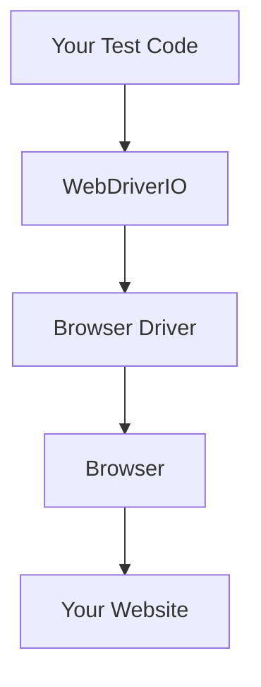
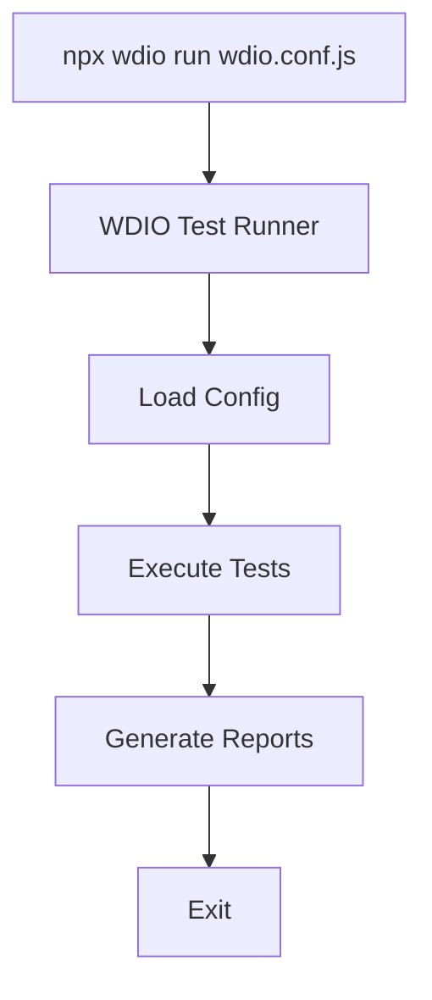
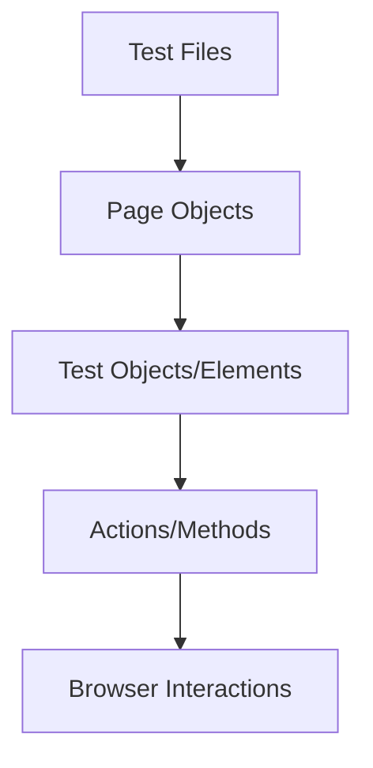

Hey there! Ready to dive into WebDriverIO? It's a fantastic automation testing framework that'll make your web testing life so much easier. Let's get you up to speed with the 85% you'll need daily, while giving you the foundation to explore the rest on your own.

## What is WebDriverIO?

WebDriverIO (or WDIO for short) is a Node.js-based test automation framework that lets you control browsers with JavaScript code. It's like having a robot that can click buttons, fill forms, and verify text on websites – all automatically!



## Prerequisites

Before we start, you'll need:

- Basic JavaScript knowledge
- Node.js installed (v14 or higher)
- npm (comes with Node.js)
- A code editor (VS Code is great for this)
- Chrome, Firefox, or another modern browser

## Installation & Setup

Let's get WDIO installed and set up:

1. Create a new directory for your project:

```bash
mkdir wdio-testing
cd wdio-testing
```

2. Initialize a new npm project:

```bash
npm init -y
```

3. Install WebDriverIO CLI:

```bash
npm install @wdio/cli --save-dev
```

4. Set up a configuration file:

```bash
npx wdio config
```

This will start an interactive setup where you'll answer some questions. For now, let's keep it simple:

- Testing in local browser? Choose **Yes**
- Where are your test files? **./test/specs/**
- Framework? Choose **Mocha**
- Do you want to use compiler? Choose **No**
- Do you want WebDriverIO to autogenerate test files? Choose **Yes**
- Reporter? Choose **spec**
- Test services? Choose **chromedriver**
- Do you want to install these dependencies? Choose **Yes**

After this, you'll have a `wdio.conf.js` file and a basic project structure.

## Your First Test

Let's write your first test! Create a file at `test/specs/basic.test.js`:

```javascript
describe('My first test', () => {
  it('should open the browser and verify the title', async () => {
    // Open a website
    await browser.url('https://example.com');

    // Get the page title
    const title = await browser.getTitle();

    // Assert that the title is as expected
    await expect(title).toEqual('Example Domain');

    // Let's check if a specific text is present
    const headerText = await $('h1').getText();
    await expect(headerText).toEqual('Example Domain');
  });
});
```

## Running Your Test

To run this test:

```bash
npx wdio run wdio.conf.js
```

You should see Chrome open, navigate to example.com, and the test should pass!



## Core Concepts for Daily Use (The 85%)

### 1. Selectors - Finding Elements

WDIO uses CSS and XPath selectors to find elements:

```javascript
// CSS selectors (preferred)
const button = await $('#submit-button'); // By ID
const input = await $('.input-field'); // By class
const links = await $$('a'); // All matching elements
const specificInput = await $('[data-test="username"]'); // By attribute

// XPath selectors (when needed)
const header = await $('//h1'); // XPath
const customElement = await $('//div[@data-custom="special"]');
```

### 2. Browser Actions

Here are the most common interactions you'll use:

```javascript
// Navigation
await browser.url('https://example.com'); // Go to URL
await browser.back(); // Go back
await browser.refresh(); // Refresh page

// Clicking and typing
await $('#button').click(); // Click
await $('input').setValue('Hello'); // Type text
await $('input').clearValue(); // Clear input
await $('#dropdown').selectByVisibleText('Option 1'); // Select dropdown

// Waiting
await $('#element').waitForExist(); // Wait for element to exist
await $('#element').waitForDisplayed(); // Wait for element to be visible
await browser.waitUntil(
  async () => {
    // Custom wait
    return (await $('#element').getText()) === 'Expected Text';
  },
  { timeout: 5000 },
);
```

### 3. Assertions

WDIO uses the expect library for assertions:

```javascript
// Basic assertions
await expect($('#element')).toExist(); // Element exists
await expect($('#element')).toBeDisplayed(); // Element is visible
await expect($('#element')).toHaveText('Expected Text'); // Element text
await expect($('#element')).toHaveValue('Expected Value'); // Input value

// More assertions
await expect(browser).toHaveTitle('Page Title'); // Page title
await expect(browser).toHaveUrl('https://example.com'); // Current URL
```

### 4. Page Objects - Organizing Your Tests

The Page Object Pattern helps organize your tests better:



Create a file `test/pageobjects/login.page.js`:

```javascript
class LoginPage {
  // Element selectors
  get usernameInput() {
    return $('#username');
  }
  get passwordInput() {
    return $('#password');
  }
  get submitButton() {
    return $('#login');
  }
  get errorMessage() {
    return $('.error-message');
  }

  // Actions
  async login(username, password) {
    await this.usernameInput.setValue(username);
    await this.passwordInput.setValue(password);
    await this.submitButton.click();
  }

  async open() {
    await browser.url('/login');
  }
}

// Export the page object
module.exports = new LoginPage();
```

Then use it in your test:

```javascript
const LoginPage = require('../pageobjects/login.page');

describe('Login functionality', () => {
  it('should login with valid credentials', async () => {
    await LoginPage.open();
    await LoginPage.login('validUser', 'validPass');

    // Assert we're redirected to dashboard
    await expect(browser).toHaveUrl('/dashboard');
  });

  it('should show error with invalid credentials', async () => {
    await LoginPage.open();
    await LoginPage.login('invalidUser', 'invalidPass');

    // Assert error is shown
    await expect(LoginPage.errorMessage).toBeDisplayed();
    await expect(LoginPage.errorMessage).toHaveText('Invalid credentials');
  });
});
```

### 5. Hooks - Setup and Teardown

Hooks let you run code before and after tests:

```javascript
describe('My test suite', () => {
  before(async () => {
    // Runs once before all tests
    console.log('Setting up test suite');
    await browser.url('/');
  });

  beforeEach(async () => {
    // Runs before each test
    console.log('Starting a test');
    await browser.refresh();
  });

  afterEach(async () => {
    // Runs after each test
    console.log('Test completed');
    // Maybe take a screenshot if test failed
    if (browser.takeScreenshot) {
      await browser.takeScreenshot();
    }
  });

  after(async () => {
    // Runs once after all tests
    console.log('Cleaning up');
  });

  it('should do something', async () => {
    // Your test here
  });
});
```

### 6. Configuration Options

The `wdio.conf.js` file controls your test execution. Here are key settings:

```javascript
// wdio.conf.js
exports.config = {
  // Basic setup
  runner: 'local',
  specs: ['./test/specs/**/*.js'],
  exclude: [],

  // Which browsers to run tests in
  capabilities: [
    {
      maxInstances: 5,
      browserName: 'chrome',
      'goog:chromeOptions': {
        // Run headless Chrome for CI environments
        // args: ['--headless', '--disable-gpu']
      },
    },
  ],

  // Test framework
  framework: 'mocha',
  mochaOpts: {
    ui: 'bdd',
    timeout: 60000,
  },

  // Reporters for test results
  reporters: ['spec'],

  // Explicit waits
  waitforTimeout: 10000, // Default timeout for waitFor commands
  connectionRetryTimeout: 120000, // Timeout for connection to browser
  connectionRetryCount: 3, // Retry count for failed connections

  // Hooks
  before: function (capabilities, specs) {
    // Global setup
  },
  beforeTest: function (test, context) {
    // Setup before each test
  },
};
```

### 7. Custom Commands

You can add your own commands to WebDriverIO:

```javascript
// Add in wdio.conf.js in the 'before' hook
browser.addCommand('loginAs', async (username, password) => {
  await browser.url('/login');
  await $('#username').setValue(username);
  await $('#password').setValue(password);
  await $('#login').click();
});

// Then use in your tests
await browser.loginAs('user', 'pass');
```

### 8. Handling Alerts

Alerts, confirms, and prompts can be handled like this:

```javascript
// Click something that triggers an alert
await $('#trigger-alert').click();

// Accept the alert (click OK)
await browser.acceptAlert();

// Or dismiss it (click Cancel)
// await browser.dismissAlert();

// For prompts, you can set a value
await browser.sendAlertText('My input');
```

### 9. Working with iFrames

iFrames require special handling:

```javascript
// Switch to iframe
const iframe = await $('#my-iframe');
await browser.switchToFrame(iframe);

// Do stuff inside iframe
await $('#frame-button').click();

// Switch back to main content
await browser.switchToParentFrame();
```

### 10. Running Specific Tests

You can run specific test files or suites:

```bash
# Run a specific file
npx wdio run wdio.conf.js --spec ./test/specs/specific.test.js

# Run tests matching a pattern
npx wdio run wdio.conf.js --spec "**/login*.js"
```

## The Other 15% (For Your Exploration)

Here's what I've left for you to explore on your own:

1. **Mobile Testing with Appium**: Extend WDIO to test mobile apps
2. **Visual Regression Testing**: Compare screenshots to detect UI changes
3. **API Testing**: Use WDIO for API testing alongside UI tests
4. **Performance Metrics**: Collect performance data during tests
5. **Cucumber Integration**: Write BDD-style tests with Gherkin syntax
6. **Custom Reporters**: Create your own test reports
7. **Cloud Testing Services**: Run tests on BrowserStack, Sauce Labs, etc.
8. **CI/CD Integration**: Set up tests in GitHub Actions, Jenkins, etc.
9. **Testing Shadow DOM**: Working with web components
10. **Component Testing**: Testing components in isolation
11. **Accessibility Testing**: Use WDIO for a11y testing
12. **Data-Driven Testing**: Run tests with different data sets
13. **Plugin Development**: Create your own WDIO plugins
14. **Advanced Debugging**: Tips and tricks for debugging tests
15. **Test Optimization**: Strategies for faster test execution

## Resources for Further Learning

- [WebDriverIO Documentation](https://webdriver.io/docs/gettingstarted)
- [WebDriverIO API Reference](https://webdriver.io/docs/api)
- [WebDriverIO GitHub](https://github.com/webdriverio/webdriverio)

And that's it! You now know the 85% of WebDriverIO you'll need on a daily basis. How does that sound? Got any questions about what we've covered so far?
