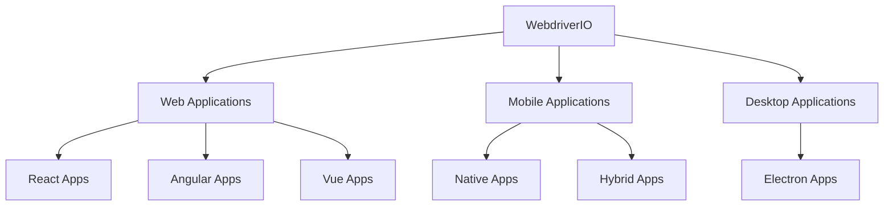
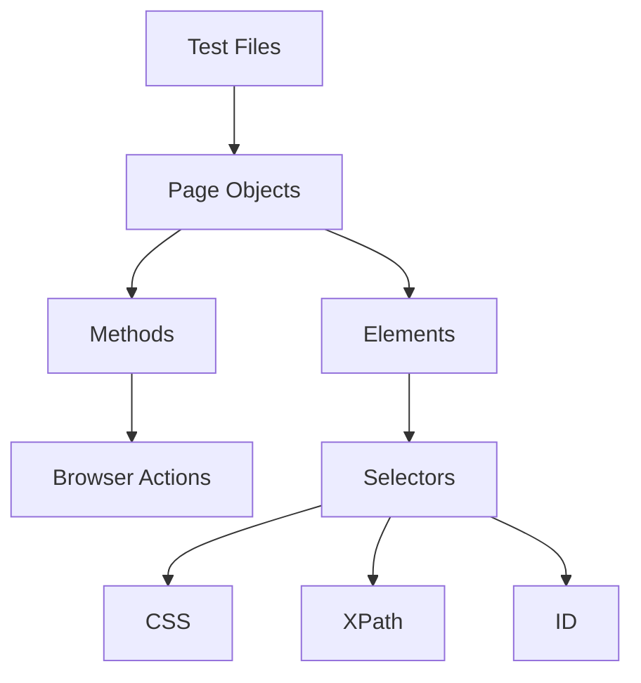
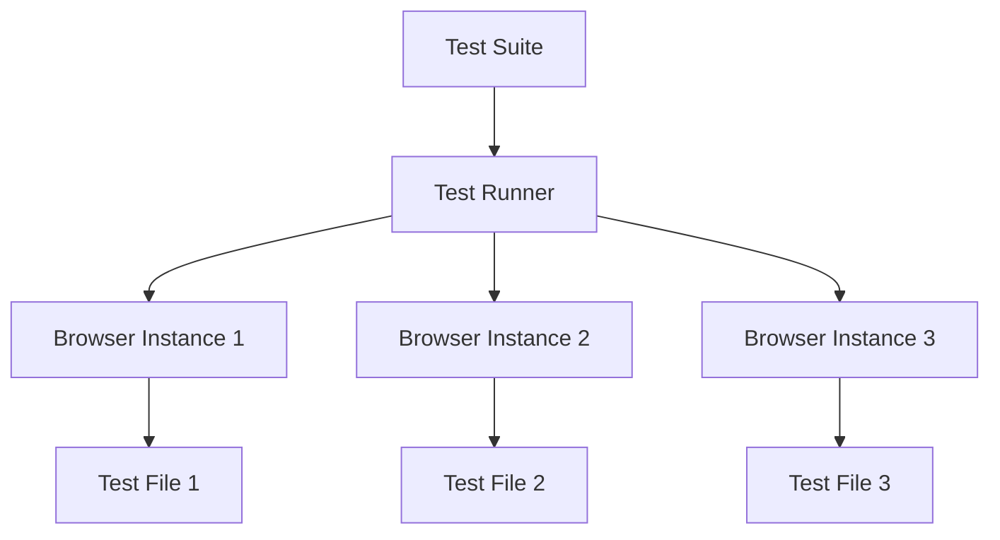

WebdriverIO is a powerful JavaScript-based UI automation testing framework that runs on Node.js. In this crash course, I'll guide you through everything you need to become proficient with this versatile tool for automating web applications.

## Introduction to WebdriverIO

WebdriverIO is an open-source framework maintained by the OpenJS Foundation that has become a favorite among developers at companies like Netflix, Microsoft, and Mozilla. What makes it special is its ability to automate various types of applications:

- Web applications built with React, Vue, Angular, and other frameworks
- Mobile applications (both native and hybrid)
- Desktop applications like Electron apps



### Key Features

The framework stands out with several noteworthy features:

- **Versatile Automation**: Its flexibility allows you to work across different application types with the same tool
- **Shadow DOM Support**: It can interact with complex DOM structures including Shadow DOM elements
- **Beginner-Friendly**: The setup process is straightforward with comprehensive documentation to help you along
- **Strong Community**: You'll benefit from active support and regular updates
- **Built-in Assertions**: Unlike basic Selenium, WebdriverIO includes powerful test validation capabilities

## Prerequisites

Before we dive into WebdriverIO, let's make sure you have everything needed to follow along:

1. **Node.js**: Version 12.16.1 or higher (this provides the runtime environment)
2. **JavaScript**: A basic understanding of JavaScript syntax (as all tests will be written in JS)
3. **IDE**: Visual Studio Code or any JavaScript-compatible editor of your choice
4. **Hardware**: A computer with minimum 4GB RAM and 5GB free space to run tests smoothly

Once you have these prerequisites in place, you're ready to set up your first WebdriverIO project.

## Installation and Setup

Let's walk through setting up WebdriverIO from scratch:

### Step 1: Create and initialize a new project

First, we'll create a dedicated directory for our project and initialize it with npm:

```bash
# Create a new folder for your project
mkdir wdio-project
cd wdio-project

# Initialize a new npm project
npm init -y
```

### Step 2: Install WebdriverIO

Next, we'll use the WebdriverIO CLI to set up our testing framework:

```bash
# Install WebdriverIO CLI
npm init wdio@latest .
```

During this installation process, you'll be guided through several configuration choices:

1. **Where is your automation executed?** (Local, cloud, etc.)
2. **Framework** (Mocha, Jasmine, Cucumber)
3. **Base URL** (Your application URL)
4. **Browser** (Chrome, Firefox, etc.)
5. **Test pattern** (Where to store your tests)

For beginners, I recommend selecting Mocha as your test framework, Chrome as your browser, and accepting the default options for other settings. These choices provide a solid foundation that you can customize later as you gain experience.

### Step 3: Verify installation

To ensure WebdriverIO was installed correctly, run:

```bash
npm ls webdriverio
```

This command should display the installed version of WebdriverIO, confirming that everything is set up properly.

## Project Structure

After installation, your project structure should look something like this:

```
wdio-project/
├── node_modules/
├── test/
│   └── specs/
│       └── example.e2e.js  // Auto-generated test file
├── package.json
└── wdio.conf.js            // WebdriverIO configuration file
```

The `wdio.conf.js` file is particularly important as it contains all your configuration settings, while the `test/specs` directory is where you'll create your test files.

## Writing Your First Test

Now let's create a simple test that demonstrates WebdriverIO's basic capabilities. We'll open a website and verify its title:

```javascript
// test/specs/basic.js
describe('My first test', () => {
  it('should open a website and verify title', async () => {
    // Open URL
    await browser.url('https://example.com');

    // Get title and assert
    const title = await browser.getTitle();
    await expect(title).toContain('Example Domain');

    // Take a screenshot
    await browser.saveScreenshot('./screenshot.png');
  });
});
```

This test demonstrates three fundamental actions: navigating to a URL, retrieving page information, and taking a screenshot for documentation.

### Running Tests

To run all your tests, use:

```bash
npx wdio run wdio.conf.js
```

If you want to run just a specific test file, you can specify it:

```bash
npx wdio run wdio.conf.js --spec test/specs/basic.js
```

As your test suite grows, this ability to run targeted tests becomes increasingly valuable.

## Working with Web Elements

Interacting with elements on a webpage is the core of UI automation, and WebdriverIO provides powerful tools for this purpose.

### Selectors and Locators

WebdriverIO offers various methods to locate elements on a webpage:

```javascript
// Using CSS selector
const element = await $('div.className');

// Using XPath
const xpathElement = await $('//button[@id="submit"]');

// Using ID
const idElement = await $('#elementId');

// Using link text
const linkElement = await $('=Click me');

// Finding multiple elements
const allLinks = await $$('a');
```

These selectors follow a simple pattern where `$` is used to find a single element and `$$` to find multiple elements matching the specified criteria.

### Interacting with Elements

Once you've located elements, you can interact with them in various ways:

```javascript
// Clicking an element
await $('#button').click();

// Typing text
await $('#username').setValue('testuser');

// Clearing input
await $('#password').clearValue();

// Getting text
const text = await $('.message').getText();

// Checking if element exists
const exists = await $('#element').isExisting();

// Checking if element is displayed
const isVisible = await $('#element').isDisplayed();
```

These interactions mirror what a user would do on your website, allowing you to automate common user flows.

## Wait Strategies

One challenge in UI automation is timing—elements may not be immediately available for interaction. WebdriverIO addresses this with several wait commands:

```javascript
// Wait for element to exist
await $('#element').waitForExist({ timeout: 5000 });

// Wait for element to be clickable
await $('#button').waitForClickable({ timeout: 3000 });

// Wait for element to disappear
await $('#loading').waitForDisplayed({ reverse: true, timeout: 10000 });

// Custom wait condition
await browser.waitUntil(
  async () => (await $('#element').getText()) === 'Expected Text',
  {
    timeout: 5000,
    timeoutMsg: 'Expected text to be different after 5s',
  },
);
```

Using these wait strategies effectively is crucial for creating stable tests that don't fail due to timing issues.

## Page Object Model (POM)

As your test suite grows, keeping your code organized becomes essential. The Page Object Model is a design pattern that helps maintain your test code by separating page-specific logic from test logic.



### Example Page Object:

Here's how you might implement a login page object:

```javascript
// pageobjects/login.page.js
class LoginPage {
  // Elements
  get usernameInput() {
    return $('#username');
  }
  get passwordInput() {
    return $('#password');
  }
  get submitButton() {
    return $('#login');
  }
  get errorMessage() {
    return $('.error');
  }

  // Methods
  async login(username, password) {
    await this.usernameInput.setValue(username);
    await this.passwordInput.setValue(password);
    await this.submitButton.click();
  }

  async open() {
    await browser.url('/login');
  }
}

module.exports = new LoginPage();
```

This approach encapsulates all the selectors and actions related to the login page in one place, making your tests cleaner and easier to maintain.

### Using the Page Object in tests:

With your page object in place, your test becomes much more readable:

```javascript
// test/specs/login.test.js
const LoginPage = require('../pageobjects/login.page');

describe('Login functionality', () => {
  it('should login with valid credentials', async () => {
    await LoginPage.open();
    await LoginPage.login('validuser', 'validpass');

    // Assert user is logged in
    await expect(browser).toHaveUrl('/dashboard');
  });

  it('should show error with invalid credentials', async () => {
    await LoginPage.open();
    await LoginPage.login('invaliduser', 'invalidpass');

    // Assert error message
    await expect(LoginPage.errorMessage).toBeDisplayed();
    await expect(LoginPage.errorMessage).toHaveText('Invalid credentials');
  });
});
```

This separation of concerns makes your tests more readable and maintainable, especially as your test suite grows.

## Handling Different UI Elements

Different UI elements require different interaction approaches. Let's explore how to handle common UI components.

### Checkboxes

Checkboxes require special handling to ensure they're in the correct state:

```javascript
// Select a checkbox
const checkbox = await $('#checkbox');
if (!(await checkbox.isSelected())) {
  await checkbox.click();
}

// Assert checkbox is selected
await expect(checkbox).toBeSelected();
```

The conditional click ensures that the checkbox ends up checked, regardless of its initial state.

### Dropdowns

Dropdowns (select elements) provide several methods for selection:

```javascript
// Select by visible text
const dropdown = await $('#dropdown');
await dropdown.selectByVisibleText('Option 1');

// Select by value
await dropdown.selectByAttribute('value', 'option1');

// Select by index
await dropdown.selectByIndex(1);

// Get selected option text
const selectedText = await dropdown.getValue();
```

These different selection methods give you flexibility depending on how the dropdown is structured.

### Radio Buttons

Radio buttons are handled similarly to checkboxes:

```javascript
// Select a radio button
const radio = await $('input[value="option1"]');
await radio.click();

// Assert radio is selected
await expect(radio).toBeSelected();
```

### Alerts

Browser alerts require special handling methods:

```javascript
// Accept alert
await browser.acceptAlert();

// Dismiss alert
await browser.dismissAlert();

// Get alert text
const alertText = await browser.getAlertText();

// Send text to prompt
await browser.sendAlertText('Hello');
```

These methods allow you to interact with JavaScript alerts, confirms, and prompts in your tests.

## Generating Reports

Reports are crucial for understanding test results. WebdriverIO supports various reporting formats, with Allure being one of the most powerful:

### Allure Reporter

Setting up Allure reporting is straightforward:

1. Install the reporter:

```bash
npm install @wdio/allure-reporter --save-dev
```

2. Configure it in your `wdio.conf.js` file:

```javascript
reporters: [
    ['allure', {
        outputDir: 'allure-results',
        disableWebdriverStepsReporting: true,
        disableWebdriverScreenshotsReporting: false,
    }]
],
```

3. After running your tests, generate and open the report:

```bash
npx allure generate allure-results --clean && npx allure open
```

This creates a comprehensive HTML report showing test results, screenshots, and step details, making it easier to understand test failures and overall test health.

## Parallel Testing

As your test suite grows, execution time becomes a concern. WebdriverIO supports running tests in parallel to significantly reduce execution time:

```javascript
// In wdio.conf.js
maxInstances: 3,
```

This configuration allows WebdriverIO to run up to three test files simultaneously, as illustrated below:



Parallel execution can dramatically reduce your overall test execution time, especially for larger test suites.

## Advanced Features

WebdriverIO offers several advanced features that expand its capabilities.

### Executing JavaScript

Sometimes you need to execute custom JavaScript in the browser context:

```javascript
// Execute JavaScript in browser context
const title = await browser.execute(() => document.title);

// Execute with arguments
const result = await browser.execute(
  (element) => element.innerText,
  await $('.content'),
);
```

This feature is particularly useful for accessing information that's not directly available through WebdriverIO's standard commands.

### Taking Screenshots

Screenshots are invaluable for debugging test failures:

```javascript
// Take screenshot of the entire page
await browser.saveScreenshot('./screenshot.png');

// Take screenshot of a specific element
await $('#element').saveScreenshot('./element-screenshot.png');
```

These screenshots can be automatically captured on test failures or used strategically throughout your tests.

### Handling Multiple Windows/Tabs

Modern web applications often use multiple windows or tabs, which WebdriverIO can handle:

```javascript
// Get all window handles
const handles = await browser.getWindowHandles();

// Switch to a specific window
await browser.switchToWindow(handles[1]);

// Create a new window and switch to it
await browser.newWindow('https://example.com');

// Close current window
await browser.closeWindow();
```

These commands allow you to navigate between different browser contexts within your tests.

## Integration with CI/CD

Integrating WebdriverIO with your CI/CD pipeline is a key step toward automated testing. Here's how to set it up with Jenkins:

1. Create a Jenkins job
2. Configure the job to pull your test repository
3. Add a build step to run: `npm install && npx wdio run wdio.conf.js`
4. Configure Allure reporting to show test results

This integration ensures your tests run automatically with each code change, providing quick feedback on potential issues.

## Common Test Scenarios

Let's look at some common testing scenarios you'll likely encounter.

### Data-Driven Testing

Data-driven testing allows you to run the same test with different inputs:

```javascript
// test/specs/data-driven.js
const users = [
  { username: 'user1', password: 'pass1', expected: true },
  { username: 'user2', password: 'wrongpass', expected: false },
  { username: '', password: 'pass3', expected: false },
];

describe('Data-driven login tests', () => {
  users.forEach(({ username, password, expected }) => {
    it(`should ${expected ? 'successfully login' : 'fail to login'} with username: "${username}"`, async () => {
      await LoginPage.open();
      await LoginPage.login(username, password);

      if (expected) {
        await expect(browser).toHaveUrl('/dashboard');
      } else {
        await expect(LoginPage.errorMessage).toBeDisplayed();
      }
    });
  });
});
```

This approach allows you to test multiple scenarios with minimal code duplication.

### Testing File Uploads

File uploads are common but often challenging to test:

```javascript
// File upload example
const filePath = path.join(__dirname, '../data/sample.jpg');
await $('#fileInput').setValue(filePath);
await $('#upload-button').click();
await expect($('.upload-success')).toBeDisplayed();
```

By providing the absolute file path to an input element, WebdriverIO can automate this traditionally tricky interaction.

## Best Practices

To ensure your WebdriverIO tests are robust and maintainable, follow these best practices:

1. **Use Page Object Model**: Keep selectors and methods organized to improve maintainability
2. **Implement proper wait strategies**: Avoid flaky tests by ensuring elements are ready for interaction
3. **Take screenshots on failures**: Capture the state of the application when tests fail
4. **Keep tests independent**: Each test should run successfully regardless of other tests
5. **Clear test data**: Reset the application state before/after tests to prevent interference
6. **Use meaningful descriptors**: Make test failure messages clear to aid debugging

Here's how to automatically capture screenshots on test failures:

```javascript
// In wdio.conf.js
afterTest: async function (test, context, { error }) {
    if (error) {
        await browser.saveScreenshot(`./error-${test.parent}-${test.title}.png`);
    }
}
```

This configuration ensures that whenever a test fails, WebdriverIO captures a screenshot, making it easier to diagnose the issue.

## The Last 15%: Further Exploration

Now let's look at the advanced topics that make up the remaining 15% of WebdriverIO knowledge—areas you can explore as your testing needs become more sophisticated:

1. **Cloud Service Integration**: Run your tests on services like BrowserStack, Sauce Labs, or LambdaTest:

   ```javascript
   // Example browserstack config in wdio.conf.js
   user: process.env.BROWSERSTACK_USERNAME,
   key: process.env.BROWSERSTACK_ACCESS_KEY,
   services: [
     ['browserstack', {
       browserstackLocal: true
     }]
   ],
   ```

2. **Visual Regression Testing**: Compare screenshots to detect visual changes in your application:

   ```bash
   npm install wdio-image-comparison-service --save-dev
   ```

3. **API Testing**: Combine UI tests with API calls for more comprehensive testing:

   ```javascript
   const axios = require('axios');

   // Make API call and use response in UI test
   const response = await axios.get('https://api.example.com/users');
   const userId = response.data[0].id;
   await browser.url(`/user/${userId}`);
   ```

4. **Custom Services and Reporters**: Create your own plugins to extend WebdriverIO's functionality

5. **Mobile Testing**: Use Appium integration to test iOS and Android applications:

   ```bash
   npm install appium-webdriverio --save-dev
   ```

6. **Performance Metrics**: Collect performance data during test execution:

   ```javascript
   const metrics = await browser.getMetrics();
   console.log('First Contentful Paint:', metrics.firstContentfulPaint);
   ```

7. **Cucumber Integration**: Implement Behavior-Driven Development with Gherkin syntax:

   ```bash
   npm init wdio@latest . -- --cucumber
   ```

8. **TypeScript Configuration**: Add type safety to your tests for better code quality:

   ```bash
   npm init wdio@latest . -- --typescript
   ```

9. **Custom Commands**: Extend WebdriverIO with your own commands:

   ```javascript
   // In wdio.conf.js
   before: function() {
     browser.addCommand('login', async (username, password) => {
       await $('#username').setValue(username);
       await $('#password').setValue(password);
       await $('#login').click();
     });
   }
   ```

10. **Shadow DOM Testing**: Access elements inside Shadow DOM for testing web components:
    ```javascript
    const shadowElement = await $('selector').shadow$('.inside-shadow-dom');
    ```

## Conclusion

This crash course has covered the essential 85% of WebdriverIO that you'll need for daily automation tasks. You've learned about installation, test creation, element interaction, the Page Object Model, reporting, and parallel testing—all fundamental skills that will serve as the foundation for your test automation journey.

The remaining 15% represents advanced topics you can explore as your testing needs evolve. With the solid foundation you've built, you'll be well-equipped to understand and implement these more complex concepts when the time comes.

Remember that effective test automation is an iterative process. Start with simple tests, build your framework incrementally, and continuously refine your approach based on what you learn along the way. Happy testing!
