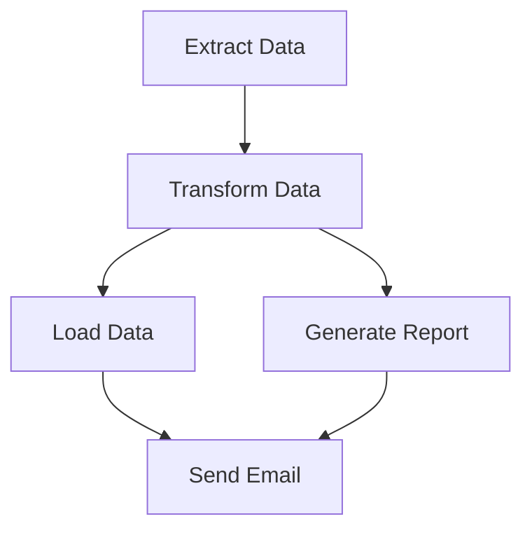
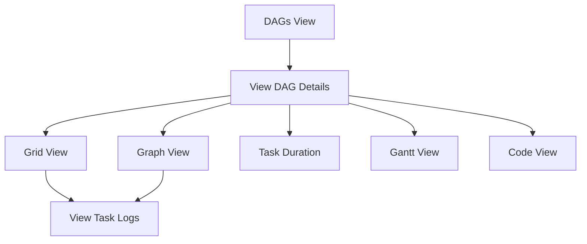
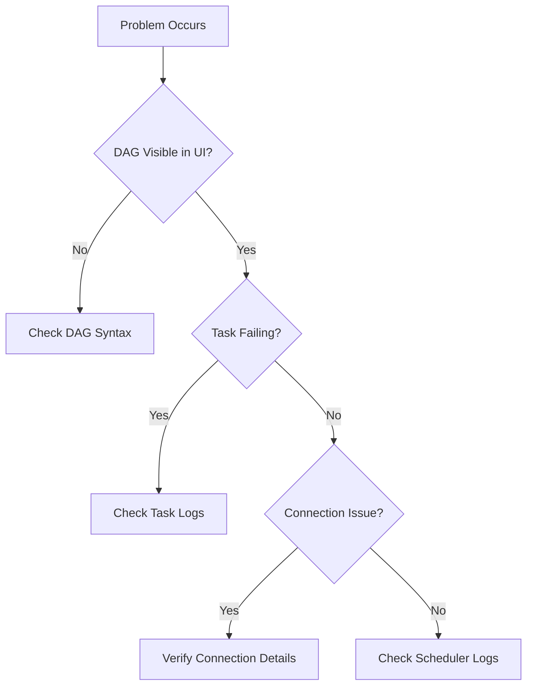

Apache Airflow is an open-source platform for creating, scheduling, and monitoring workflows. This crash course will give you the 85% of knowledge you'll need daily while preparing you to explore the rest on your own.

## What is Apache Airflow?

Apache Airflow allows you to program workflows using Python. Think of it as a smart scheduler that knows which tasks depend on others, can retry failed tasks, and provides visibility into your workflow executions.

**Key Strengths:**

- Define workflows as Python code (not YAML or JSON)
- Generate pipelines dynamically
- Extensive plugin ecosystem
- Rich monitoring capabilities
- Strong community support

## Prerequisites

Before diving in, you should have:

- Basic Python knowledge
- Understanding of command line operations
- Docker installed (for the easiest setup)
- Familiarity with cron scheduling syntax (helpful but not required)

## Core Concepts

Let's start with the fundamental building blocks of Airflow:

### Directed Acyclic Graphs (DAGs)

In Airflow, workflows are represented as DAGs - directed graphs with no cycles. Think of a DAG as a recipe with steps that must be followed in a specific order. Each workflow is a collection of tasks with defined dependencies.



### Tasks and Operators

Within these DAGs, tasks are the individual units of work. Operators are templates that define what each task actually does:

- **BashOperator**: Executes bash commands
- **PythonOperator**: Calls Python functions
- **SQLOperator**: Executes SQL queries
- **Sensors**: Waits for conditions before proceeding

### Task Dependencies

These tasks need to know their order of execution, which is defined through dependencies:

```python
# Method 1: Using bitshift operators (most common)
task1 >> task2 >> task3

# Method 2: Using set_upstream/set_downstream
task1.set_downstream(task2)
task2.set_downstream(task3)

# For multiple dependencies
task1 >> [task2, task3] >> task4
```

This intuitive syntax makes it easy to visualize your workflow right in the code.

## Installation and Setup

Now that you understand the core concepts, let's get Airflow up and running. Docker provides the simplest approach for beginners:

1. Install Docker Desktop from [docker.com](https://www.docker.com/products/docker-desktop/)

2. Create a new directory for your Airflow project:

```bash
mkdir airflow-project
cd airflow-project
```

3. Create two files:

**.env file:**

```
AIRFLOW_UID=50000
AIRFLOW_IMAGE_NAME=apache/airflow:2.7.3
```

**docker-compose.yml file:**
Download from the official repository:

```bash
curl -LfO 'https://airflow.apache.org/docs/apache-airflow/stable/docker-compose.yaml'
```

4. Start Airflow services:

```bash
docker-compose up -d
# This starts the web server, scheduler, and database
```

5. Create an admin user:

```bash
docker-compose run airflow-worker airflow users create \
    --username admin \
    --firstname Admin \
    --lastname User \
    --role Admin \
    --email admin@example.com \
    --password admin
```

6. Access the Airflow web UI at http://localhost:8080 (username: admin, password: admin)

With this setup, you've got a fully functional Airflow environment ready for creating workflows.

## Writing Your First DAG

Now that Airflow is running, let's create your first workflow. DAGs are defined in Python files placed in the `dags` directory:

```python
# dags/my_first_dag.py
from datetime import datetime, timedelta
from airflow import DAG
from airflow.operators.bash import BashOperator
from airflow.operators.python import PythonOperator

# Define default arguments for your DAG
default_args = {
    'owner': 'airflow',          # Who owns this DAG
    'depends_on_past': False,    # Each run doesn't depend on previous runs
    'email_on_failure': False,   # Don't email on failure
    'email_on_retry': False,     # Don't email on retry
    'retries': 1,                # Retry failed tasks once
    'retry_delay': timedelta(minutes=5),  # Wait 5 minutes between retries
}

# Create a DAG instance
with DAG(
    'my_first_dag',              # Unique identifier for your DAG
    default_args=default_args,   # Apply default arguments
    description='A simple tutorial DAG',
    schedule_interval=timedelta(days=1),  # Run daily
    start_date=datetime(2025, 4, 7),      # Start from this date
    catchup=False,               # Don't run for past dates
    tags=['example'],            # For organization in the UI
) as dag:

    # Task 1: Print the date using bash
    print_date = BashOperator(
        task_id='print_date',    # Unique ID for this task
        bash_command='date',     # Command to execute
    )

    # Task 2: Define a Python function
    def print_hello():
        print("Hello from Airflow!")
        return "Hello from Airflow!"  # Will be stored in XCom for other tasks

    # Task 2: Create a task using the Python function
    hello_task = PythonOperator(
        task_id='hello_task',
        python_callable=print_hello,  # Reference to the function
    )

    # Define task dependencies - print_date runs first, then hello_task
    print_date >> hello_task
```

Save this file in the `dags` directory of your Airflow installation. If you're using Docker, put it in the `./dags` directory you created. Within minutes, Airflow will automatically detect and parse your DAG, making it available in the UI.

## Understanding the Airflow UI

Once your DAG is loaded, you'll want to monitor and manage it through Airflow's intuitive UI:

1. **DAGs View**: Your starting point - lists all your DAGs with status indicators
2. **Grid View**: Shows a timeline of DAG runs with color-coded task status (success, failure, running)
3. **Graph View**: Displays a visual representation of your workflow's task dependencies
4. **Task Duration**: Helps identify performance bottlenecks by showing execution times
5. **Logs**: Provides detailed logs for debugging when things go wrong

Here's how these views are related:



This rich visualization ecosystem is what makes Airflow particularly powerful for complex workflow management.

## Advanced Features

As you grow more comfortable with basic DAGs, you'll want to leverage some of Airflow's more powerful features.

### Sharing Data Between Tasks with XComs

Tasks in Airflow are isolated by design, but sometimes they need to share small pieces of data. XComs (Cross-Communications) solve this problem:

```python
# Task 1: Push a value to XCom
def push_value():
    value = {"key": "value"}
    return value  # Automatically pushed to XCom

push_task = PythonOperator(
    task_id='push_task',
    python_callable=push_value,
    dag=dag,
)

# Task 2: Pull the value from XCom
def pull_value(**context):
    # Pull XCom value from the 'push_task'
    value = context['ti'].xcom_pull(task_ids='push_task')
    print(f"Retrieved value: {value}")

pull_task = PythonOperator(
    task_id='pull_task',
    python_callable=pull_value,
    provide_context=True,  # This passes context to the function
    dag=dag,
)

# Set dependency
push_task >> pull_task
```

This pattern is essential for building multi-step workflows where later tasks depend on the output of earlier ones.

### Using the TaskFlow API (Modern Approach)

The traditional way of building DAGs can get verbose. Airflow's newer TaskFlow API simplifies things considerably:

```python
# dags/taskflow_example.py
from airflow.decorators import dag, task
from datetime import datetime, timedelta

@dag(
    schedule_interval=timedelta(days=1),
    start_date=datetime(2025, 4, 7),
    catchup=False,
    tags=['example'],
)
def taskflow_example():

    @task()
    def extract():
        """Extract data from source"""
        # This function extracts data and returns it
        return {"order_id": 123, "customer_id": 456}

    @task()
    def transform(data):
        """Transform the data"""
        # This function transforms the data and returns the result
        data["order_value"] = 99.99
        return data

    @task()
    def load(data):
        """Load the transformed data"""
        # This function loads the transformed data
        print(f"Loading data: {data}")

    # Define the task dependencies implicitly through function calls
    order_data = extract()               # First, extract data
    transformed_data = transform(order_data)  # Then, transform it
    load(transformed_data)               # Finally, load it

    # No need for explicit >> operators with TaskFlow!

# Create the DAG
taskflow_dag = taskflow_example()
```

Notice how much cleaner this looks - dependencies are expressed through natural Python function calls rather than explicit operators.

## Scheduling DAGs

A key benefit of Airflow is flexible scheduling. You can run workflows on any schedule from simple daily runs to complex cron expressions:

- **timedelta**: `schedule_interval=timedelta(days=1)` (daily)
- **Cron expressions**: `schedule_interval='0 0 * * *'` (midnight daily)
- **Preset intervals**: `schedule_interval='@daily'`, `'@weekly'`, etc.

For example:

```python
# Run at 3 AM every day
with DAG(
    'scheduled_dag',
    schedule_interval='0 3 * * *',  # Cron syntax: minute hour day-of-month month day-of-week
    start_date=datetime(2025, 4, 7),
    catchup=False,
) as dag:
    # DAG tasks here
```

This scheduling flexibility makes Airflow suitable for everything from simple daily batch jobs to complex, time-sensitive workflows.

## Connecting to External Systems

Most real-world workflows involve external systems like databases. Here's how to connect to PostgreSQL:

```python
# First, create a connection in the Airflow UI:
# Admin > Connections > Add a new record
# Conn Id: postgres_default
# Conn Type: Postgres
# Host: your-postgres-host
# Schema: your-database
# Login: your-username
# Password: your-password
# Port: 5432

# Then, use it in your DAG:
from airflow.providers.postgres.operators.postgres import PostgresOperator

# Create a table if it doesn't exist
create_table = PostgresOperator(
    task_id='create_table',
    postgres_conn_id='postgres_default',  # References the connection you created
    sql='''
    CREATE TABLE IF NOT EXISTS users (
        id SERIAL PRIMARY KEY,
        name VARCHAR(100),
        email VARCHAR(100)
    );
    ''',
    dag=dag,
)

# Insert data
insert_data = PostgresOperator(
    task_id='insert_data',
    postgres_conn_id='postgres_default',
    sql='''
    INSERT INTO users (name, email)
    VALUES
    ('John Doe', 'john@example.com'),
    ('Jane Smith', 'jane@example.com')
    ON CONFLICT (id) DO NOTHING;
    ''',
    dag=dag,
)

# Set up the dependency
create_table >> insert_data
```

This connection system is extensible to virtually any external system – from cloud services like AWS, GCP, and Azure to data warehouses, messaging systems, and more.

## Best Practices

As your Airflow usage grows, following these best practices will save you headaches:

1. **Keep DAGs Idempotent**: Tasks should produce the same results if run multiple times. This is crucial for reliability when retrying failed tasks.
2. **Use Templates for Dynamic Values**: Airflow provides Jinja templating for dynamic values:

```python
# Example of Jinja templating
templated_command = """
    echo "Processing data for: {{ ds }}"
    echo "Next execution date: {{ next_ds }}"
    
        echo "Processing file: {{ file }}"
    
"""

templated_task = BashOperator(
    task_id='templated_task',
    bash_command=templated_command,
    params={'files': ['file1.txt', 'file2.txt', 'file3.txt']},
    dag=dag,
)
```

3. **Modularize Your Code**: As workflows grow complex, break them into logical components for better maintainability.

4. **Handle Failures Gracefully**: Always configure appropriate retries, timeouts, and failure callbacks.

5. **Monitor Task Duration**: Set SLAs for critical tasks to be alerted when workflows run longer than expected.

These practices will help you build reliable, maintainable workflows that can scale with your needs.

## Debugging Tips

Even well-designed workflows occasionally run into issues. Here's how to troubleshoot effectively:

### Command Line Debugging

The command line offers powerful debugging tools:

```bash
# Test a specific task without running dependencies
docker-compose run airflow-worker airflow tasks test my_first_dag print_date 2025-04-07

# List all DAGs
docker-compose run airflow-worker airflow dags list

# View task hierarchy for a DAG
docker-compose run airflow-worker airflow tasks list my_first_dag --tree
```

### Common Issues and Solutions

When things go wrong, follow this troubleshooting flow:



This methodical approach will help you quickly identify and resolve most issues.

## Real-World Example: Data Pipeline

Let's bring everything together with a complete ETL (Extract, Transform, Load) pipeline:

```python
# dags/etl_pipeline.py
from airflow import DAG
from airflow.operators.python import PythonOperator
from airflow.providers.postgres.operators.postgres import PostgresOperator
from datetime import datetime, timedelta
import pandas as pd
import os

# Define default arguments
default_args = {
    'owner': 'airflow',
    'depends_on_past': False,
    'email_on_failure': False,
    'retries': 1,
    'retry_delay': timedelta(minutes=5),
}

# Define the DAG
with DAG(
    'etl_pipeline',
    default_args=default_args,
    description='ETL pipeline example',
    schedule_interval='@daily',
    start_date=datetime(2025, 4, 7),
    catchup=False,
) as dag:

    # Task 1: Create the table if it doesn't exist
    create_table = PostgresOperator(
        task_id='create_table',
        postgres_conn_id='postgres_default',
        sql='''
        CREATE TABLE IF NOT EXISTS sales (
            id SERIAL PRIMARY KEY,
            date DATE,
            product_id INTEGER,
            quantity INTEGER,
            amount DECIMAL(10,2)
        );
        ''',
    )

    # Task 2: Extract data from CSV
    def extract_data(**kwargs):
        # For this example, we'll create sample data
        # In a real scenario, you'd read from a file or API
        data = {
            'date': ['2025-04-01', '2025-04-01', '2025-04-02'],
            'product_id': [101, 102, 101],
            'quantity': [5, 10, 7],
            'amount': [500.50, 1000.75, 700.25]
        }
        df = pd.DataFrame(data)

        # Save to a temporary CSV file
        temp_file = '/tmp/sales_data.csv'
        df.to_csv(temp_file, index=False)
        return temp_file

    extract_task = PythonOperator(
        task_id='extract_data',
        python_callable=extract_data,
    )

    # Task 3: Transform data
    def transform_data(**kwargs):
        # Get the path to the CSV file from XCom
        ti = kwargs['ti']
        file_path = ti.xcom_pull(task_ids='extract_data')

        # Read the CSV
        df = pd.read_csv(file_path)

        # Apply transformations
        # 1. Convert date strings to proper date format
        df['date'] = pd.to_datetime(df['date'])

        # 2. Calculate total value
        df['total_value'] = df['quantity'] * df['amount']

        # 3. Add a discount column (10%)
        df['discount'] = df['total_value'] * 0.1

        # 4. Calculate final amount
        df['final_amount'] = df['total_value'] - df['discount']

        # Save the transformed data
        transformed_file = '/tmp/sales_transformed.csv'
        df.to_csv(transformed_file, index=False)
        return transformed_file

    transform_task = PythonOperator(
        task_id='transform_data',
        python_callable=transform_data,
    )

    # Task 4: Load data to database
    def load_data(**kwargs):
        # Get the path to the transformed CSV file from XCom
        ti = kwargs['ti']
        file_path = ti.xcom_pull(task_ids='transform_data')

        # Read the CSV
        df = pd.read_csv(file_path)

        # Prepare the INSERT statements
        inserts = []
        for _, row in df.iterrows():
            insert = f"INSERT INTO sales (date, product_id, quantity, amount) VALUES ('{row['date']}', {row['product_id']}, {row['quantity']}, {row['amount']});"
            inserts.append(insert)

        # Join all inserts
        sql_statement = '\n'.join(inserts)

        # Return the SQL to be executed by the next task
        return sql_statement

    load_task = PythonOperator(
        task_id='load_data',
        python_callable=load_data,
    )

    # Task 5: Execute the SQL from the previous task
    def execute_sql(**kwargs):
        # Get the SQL from XCom
        ti = kwargs['ti']
        sql = ti.xcom_pull(task_ids='load_data')

        # In a real scenario, you'd use a hook or operator
        # For demonstration, we'll print the SQL
        print("Executing SQL:")
        print(sql)

        # In production, you'd use a PostgresHook:
        # from airflow.hooks.postgres_hook import PostgresHook
        # hook = PostgresHook(postgres_conn_id='postgres_default')
        # hook.run(sql)

    execute_sql_task = PythonOperator(
        task_id='execute_sql',
        python_callable=execute_sql,
    )

    # Define the workflow
    create_table >> extract_task >> transform_task >> load_task >> execute_sql_task
```

This example brings together many of the concepts we've covered – tasks, dependencies, XComs, operators, and connections – to create a real-world data pipeline.

## The 15% You'll Explore Later

As you become more proficient with Airflow, here's what to explore next, organized by category:

**Advanced Execution**

1. KubernetesPodOperator, DockerOperator for containerized task execution
2. Dynamic DAG generation for creating workflows programmatically
3. Custom operators for specialized tasks

**Workflow Logic** 4. Branching workflows with BranchPythonOperator for conditional execution paths 5. Complex scheduling with dependencies between DAGs 6. Task groups for organizing related tasks

**Operations & Scale** 7. Production deployment with Celery or Kubernetes executors 8. Security best practices for authentication and secrets management 9. High availability configuration for fault tolerance

**Extensions & Integration** 10. Custom plugins for extending the Airflow UI 11. REST API integration for programmatic control 12. Data lineage tracking across systems

**Development Practices** 13. Testing methodologies for DAGs and operators 14. Monitoring & alerting configurations 15. CI/CD pipelines for DAG deployment

## Summary

You've now mastered the core 85% of Apache Airflow that you'll use daily:

- Core concepts (DAGs, Tasks, Operators)
- Installation and setup with Docker
- Creating and scheduling workflows
- Connecting to external systems
- Best practices and debugging techniques
- Building complete data pipelines

Start by creating simple DAGs and gradually incorporate more advanced features as you become comfortable. The remaining 15% will come naturally as your workflows grow more sophisticated.

Remember: Airflow's power comes from its Python foundation, which gives you the flexibility to orchestrate virtually any workflow you can imagine. Happy data orchestrating!
