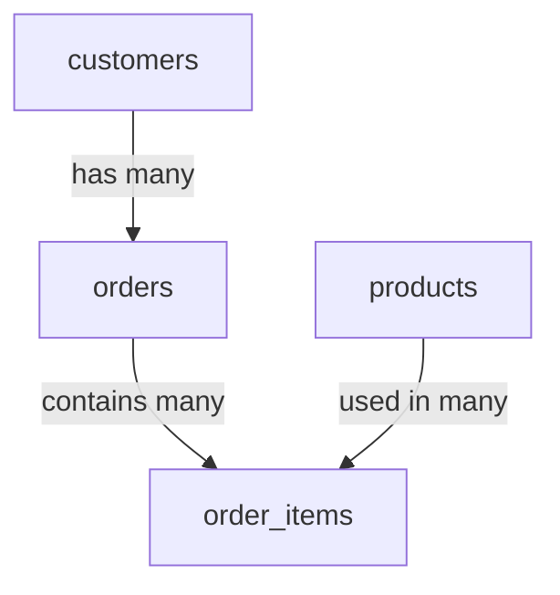
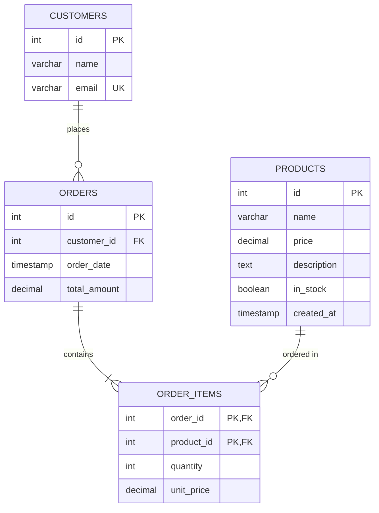

Hey there! So you want to learn PostgreSQL? Great choice! It's like the Swiss Army knife of relational databases—robust, feature-rich, and incredibly reliable. Let's dive in and get you comfortable with the essentials you'll use almost every day.

## What is PostgreSQL?

PostgreSQL (or "Postgres" for short) is an advanced open-source relational database system that's been around since the 1990s. Think of it as a super organized filing cabinet that:

- Stores your data in tables (like spreadsheets)
- Ensures data integrity through constraints
- Allows complex querying through SQL
- Handles multiple users and transactions simultaneously

## Prerequisites & Installation

Before we jump in, you'll need:

- Basic understanding of databases (tables, rows, columns)
- Familiarity with command line interfaces
- Some SQL knowledge helps, but we'll cover the basics

### Installation

Let's get Postgres installed:

**On Mac (using Homebrew)**:

```bash
brew install postgresql
brew services start postgresql
```

**On Ubuntu/Debian**:

```bash
sudo apt update
sudo apt install postgresql postgresql-contrib
sudo systemctl start postgresql
```

**On Windows**:

1. Download the installer from [postgresql.org](https://www.postgresql.org/download/windows/)
2. Run the installer and follow the wizard
3. Use the default port (5432)

Once installed, you can access PostgreSQL through:

- Command line using `psql`
- GUI tools like pgAdmin, DBeaver, or TablePlus

## Connecting to PostgreSQL

```bash
# Connect to default database
psql postgres

# Connect with specific user
psql -U yourusername

# Connect to specific database
psql -d yourdbname -U yourusername
```

When first installed, PostgreSQL creates a default user called "postgres":

```bash
# Switch to postgres user (Linux)
sudo -u postgres psql
```

## Database Creation & Management

Let's create our first database:

```sql
-- Create a new database
CREATE DATABASE coffee_shop;

-- Connect to it
\c coffee_shop

-- List all databases
\l
```

## Table Design & Data Types

Tables are where your data lives. Let's create one:

```sql
CREATE TABLE products (
    id SERIAL PRIMARY KEY,  -- Auto-incrementing unique ID
    name VARCHAR(100) NOT NULL,  -- Text with max length of 100
    price DECIMAL(6, 2) NOT NULL,  -- Money value with 2 decimal places
    description TEXT,  -- Unlimited text field
    in_stock BOOLEAN DEFAULT TRUE,  -- Boolean with default value
    created_at TIMESTAMP DEFAULT CURRENT_TIMESTAMP  -- Current date/time
);
```

### Common PostgreSQL Data Types:

- **Text Types**: VARCHAR(n), TEXT, CHAR(n)
- **Numeric Types**: INTEGER, DECIMAL/NUMERIC, REAL, SERIAL
- **Date/Time**: DATE, TIME, TIMESTAMP, INTERVAL
- **Boolean**: BOOLEAN
- **JSON**: JSON, JSONB (binary JSON, more efficient)
- **Arrays**: Any data type with [] (e.g., INTEGER[], TEXT[])

## Adding Data (INSERT)

Let's populate our table:

```sql
-- Single row insert
INSERT INTO products (name, price, description)
VALUES ('Espresso', 2.50, 'Strong coffee brewed by forcing hot water through finely-ground coffee beans');

-- Multi-row insert
INSERT INTO products (name, price, description)
VALUES
    ('Cappuccino', 3.50, 'Espresso with steamed milk and foam'),
    ('Latte', 4.00, 'Espresso with lots of steamed milk and a light layer of foam'),
    ('Americano', 3.00, 'Espresso diluted with hot water');
```

## Reading Data (SELECT)

Now let's query our data:

```sql
-- Get all products
SELECT * FROM products;

-- Get specific columns
SELECT name, price FROM products;

-- Get filtered data
SELECT name, price FROM products WHERE price < 4.00;

-- Sorting data
SELECT name, price FROM products ORDER BY price DESC;

-- Limit results
SELECT name, price FROM products ORDER BY price LIMIT 2;

-- Count results
SELECT COUNT(*) FROM products;
```

## Updating Data (UPDATE)

Need to change something?

```sql
-- Update a single record
UPDATE products
SET price = 2.75
WHERE name = 'Espresso';

-- Update multiple columns
UPDATE products
SET price = price * 1.1, description = description || ' (10% price increase applied)'
WHERE price < 3.00;
-- The || operator concatenates strings in PostgreSQL
```

## Deleting Data (DELETE)

Removing records:

```sql
-- Delete specific records
DELETE FROM products WHERE name = 'Americano';

-- Delete all records (careful!)
DELETE FROM products;
```

## Table Relationships

Databases really shine when linking related data. Let's add an orders table:

```sql
-- Create customers table
CREATE TABLE customers (
    id SERIAL PRIMARY KEY,
    name VARCHAR(100) NOT NULL,
    email VARCHAR(100) UNIQUE NOT NULL
);

-- Create orders table with relationships
CREATE TABLE orders (
    id SERIAL PRIMARY KEY,
    customer_id INTEGER REFERENCES customers(id),  -- Foreign key
    order_date TIMESTAMP DEFAULT CURRENT_TIMESTAMP,
    total_amount DECIMAL(8, 2) NOT NULL
);

-- Create order items table (for many-to-many relationship)
CREATE TABLE order_items (
    order_id INTEGER REFERENCES orders(id),
    product_id INTEGER REFERENCES products(id),
    quantity INTEGER NOT NULL,
    unit_price DECIMAL(6, 2) NOT NULL,
    PRIMARY KEY (order_id, product_id)  -- Composite primary key
);
```

This creates a relationship structure:



Let's insert some relational data:

```sql
-- Add customers
INSERT INTO customers (name, email)
VALUES ('John Doe', 'john@example.com'), ('Jane Smith', 'jane@example.com');

-- Add an order
INSERT INTO orders (customer_id, total_amount)
VALUES (1, 7.50);  -- John's order

-- Add order items
INSERT INTO order_items (order_id, product_id, quantity, unit_price)
VALUES
    (1, 1, 2, 2.75),  -- 2 Espressos
    (1, 2, 1, 3.50);  -- 1 Cappuccino
```

## Querying Related Data with JOINs

JOINs connect tables in queries:

```sql
-- Inner join (only matching records)
SELECT o.id AS order_id, c.name AS customer, o.order_date, o.total_amount
FROM orders o
JOIN customers c ON o.customer_id = c.id;

-- Left join (all orders, even if no matching customer)
SELECT o.id AS order_id, c.name AS customer
FROM orders o
LEFT JOIN customers c ON o.customer_id = c.id;
```

Getting order details with multiple joins:

```sql
SELECT
    c.name AS customer,
    o.id AS order_id,
    p.name AS product,
    oi.quantity,
    oi.unit_price,
    (oi.quantity * oi.unit_price) AS item_total
FROM orders o
JOIN customers c ON o.customer_id = c.id
JOIN order_items oi ON o.id = oi.order_id
JOIN products p ON oi.product_id = p.id
ORDER BY o.id, p.name;
```

## Indexes for Performance

As tables grow, queries slow down. Indexes speed them up:

```sql
-- Create an index on a column you search frequently
CREATE INDEX idx_products_name ON products(name);

-- Create a unique index
CREATE UNIQUE INDEX idx_customers_email ON customers(email);

-- Create a multi-column index
CREATE INDEX idx_order_items_lookup ON order_items(order_id, product_id);
```

When to use indexes:

- Columns in WHERE clauses
- JOIN columns
- ORDER BY columns
- Unique constraints

But remember: indexes speed up reads but slow down writes!

## Schema Design Visualization

Here's our coffee shop database schema:



## Advanced Querying Techniques

PostgreSQL offers powerful querying tools:

### Aggregation Functions

```sql
-- Get average price of products
SELECT AVG(price) AS average_price FROM products;

-- Get price statistics
SELECT
    MIN(price) AS lowest,
    MAX(price) AS highest,
    AVG(price) AS average,
    SUM(price) AS total
FROM products;

-- Group by with counts
SELECT
    in_stock,
    COUNT(*) AS product_count,
    AVG(price) AS average_price
FROM products
GROUP BY in_stock;

-- Having clause (like WHERE but for groups)
SELECT
    customer_id,
    COUNT(*) AS order_count,
    SUM(total_amount) AS total_spent
FROM orders
GROUP BY customer_id
HAVING COUNT(*) > 1;  -- Only customers with multiple orders
```

### Subqueries

```sql
-- Subquery in WHERE clause
SELECT name, price
FROM products
WHERE price > (SELECT AVG(price) FROM products);

-- Subquery in FROM clause
SELECT customer_id, order_count
FROM (
    SELECT customer_id, COUNT(*) AS order_count
    FROM orders
    GROUP BY customer_id
) AS order_counts
WHERE order_count > 5;
```

## Common Table Expressions (CTEs)

These are like temporary named result sets:

```sql
-- Calculate revenue per product
WITH product_revenue AS (
    SELECT
        p.id,
        p.name,
        SUM(oi.quantity * oi.unit_price) AS revenue
    FROM products p
    JOIN order_items oi ON p.id = oi.product_id
    GROUP BY p.id, p.name
)
SELECT
    name,
    revenue,
    revenue / (SELECT SUM(revenue) FROM product_revenue) * 100 AS percentage
FROM product_revenue
ORDER BY revenue DESC;
```

## Basic Database Administration

### User Management

```sql
-- Create a new user
CREATE USER barista WITH PASSWORD 'espresso123';

-- Grant privileges
GRANT SELECT, INSERT ON products TO barista;
GRANT SELECT, INSERT, UPDATE ON orders, order_items TO barista;

-- Make a user a superuser (admin)
ALTER USER barista WITH SUPERUSER;

-- Remove privileges
REVOKE INSERT ON products FROM barista;
```

### Backup & Restore

```bash
# Create a backup
pg_dump -U postgres coffee_shop > coffee_shop_backup.sql

# Restore from backup
psql -U postgres coffee_shop < coffee_shop_backup.sql

# Backup a specific table
pg_dump -U postgres -t products coffee_shop > products_backup.sql
```

## Performance Tips

1. **Use EXPLAIN ANALYZE to see query plans**:

   ```sql
   EXPLAIN ANALYZE SELECT * FROM orders WHERE customer_id = 1;
   ```

2. **Keep your database maintained**:

   ```sql
   -- Cleanup and optimize a table
   VACUUM ANALYZE products;
   ```

3. **Use appropriate data types** (INT for IDs, not VARCHAR)

4. **Limit results with LIMIT when possible**

5. **Use prepared statements for repeated queries**

## The 15% You'll Explore on Your Own

Here's what we haven't covered that you might want to explore next:

1. **Transactions & ACID properties** - For maintaining data integrity during complex operations
2. **Window functions** - For advanced analytical queries
3. **Full-text search** - PostgreSQL has powerful text search capabilities
4. **JSON functionality** - Store and query JSON data natively
5. **Triggers & stored procedures** - For automating database actions
6. **Views & materialized views** - For simplifying complex queries
7. **Partitioning** - Splitting large tables for better performance
8. **Replication & high availability** - For database redundancy
9. **Connection pooling** - For managing many concurrent connections
10. **Extensions** - Like PostGIS for geospatial data or TimescaleDB for time-series

## Summary

You now know the 85% of PostgreSQL you'll use daily:

- Creating and managing databases and tables
- CRUD operations (Create, Read, Update, Delete)
- Relationships between tables and JOINs
- Indexing for performance
- Basic administration

The remaining 15% are more specialized features you can explore as you need them. PostgreSQL has excellent documentation at [postgresql.org](https://www.postgresql.org/docs/) for when you're ready to dive deeper!
