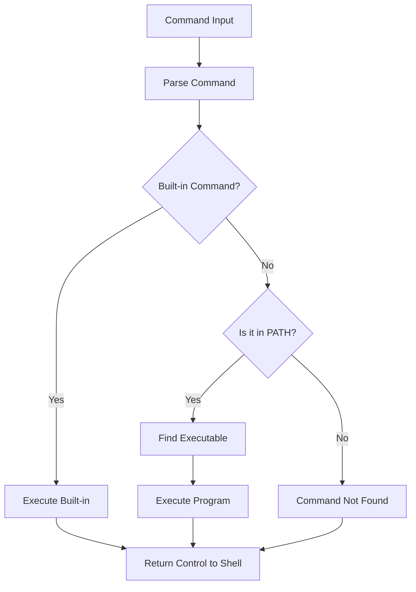

Hey there! Let's dive into Bash, the powerful command-line interface that'll make you feel like a computer wizard. By the end of this crash course, you'll be comfortable with 85% of what you need for daily use, and I'll point you toward the exciting 15% you can explore on your own.

## What is Bash and Why Should You Care?

Bash (Bourne Again SHell) is a command-line interface for Unix-like operating systems. Think of it as a text-based way to talk directly to your computer—no clicking required! Bash comes pre-installed on macOS and Linux, and you can get it on Windows through WSL (Windows Subsystem for Linux) or Git Bash.

Why learn Bash?

- **Efficiency**: Tasks that would take multiple clicks can be done with a single command
- **Automation**: You can script repetitive tasks
- **Remote work**: Manage servers without a GUI
- **Developer street cred**: Seriously, it's an essential skill

## Getting Started: Opening the Terminal

- **On macOS**: Press `Cmd+Space`, type "Terminal", and hit Enter
- **On Linux**: Usually `Ctrl+Alt+T`
- **On Windows**: Install WSL from the Microsoft Store, or install Git Bash

When you open the terminal, you'll see something like this:

```
username@hostname:~$
```

That `$` is your prompt, waiting for commands. Let's give it some!

## Essential Navigation Commands

```bash
pwd                 # Print Working Directory - shows where you are
ls                  # List files and directories
ls -la              # List all files (including hidden ones) with details
cd Documents        # Change Directory to Documents
cd ..               # Go up one directory
cd ~                # Go to home directory
cd /                # Go to root directory
clear               # Clear the terminal screen (or Ctrl+L)
```

Try out these commands to navigate around. For example:

```bash
$ pwd
/home/username
$ ls
Documents  Downloads  Pictures  Music
$ cd Documents
$ pwd
/home/username/Documents
$ cd ..
$ pwd
/home/username
```

## Working with Files and Directories

```bash
mkdir Projects      # Create a directory named Projects
touch file.txt      # Create an empty file
cp file.txt copy.txt  # Copy a file
mv file.txt newname.txt  # Rename a file
mv file.txt ~/Documents/  # Move a file to Documents directory
rm file.txt         # Remove (delete) a file
rm -r Projects      # Remove a directory and all its contents
cat file.txt        # Display file contents
less file.txt       # View file contents with pagination (q to quit)
head -n 5 file.txt  # Show first 5 lines
tail -n 5 file.txt  # Show last 5 lines
```

Let's try creating a simple directory structure:

```bash
$ mkdir Projects
$ cd Projects
$ mkdir WebApp
$ touch WebApp/index.html
$ touch WebApp/style.css
$ ls WebApp
index.html style.css
```

## Viewing and Editing Files

You can edit files right in the terminal:

```bash
nano file.txt       # Simple text editor
vim file.txt        # More powerful text editor (press i to insert, Esc then :wq to save and quit)
```

For viewing file content:

```bash
$ echo "Hello Bash World" > hello.txt  # Create file with content
$ cat hello.txt                        # View content
Hello Bash World
```

## Powerful Pipes and Redirection

Bash lets you connect commands like LEGO bricks:

```bash
# Redirect output to a file (overwrites existing content)
echo "Line one" > file.txt

# Append output to a file
echo "Line two" >> file.txt

# Pipe output from one command to another
cat file.txt | grep "one"  # Find lines containing "one"

# Save command output to a file
ls -la > files_list.txt
```

Example:

```bash
$ echo "First line" > sample.txt
$ echo "Second line" >> sample.txt
$ echo "Third line with the word example" >> sample.txt
$ cat sample.txt | grep "example"
Third line with the word example
```

## Finding Things

```bash
find . -name "*.txt"  # Find all .txt files in current directory and subdirectories
grep "search term" file.txt  # Search for text in a file
grep -r "search" .   # Search recursively through all files
```

Example usage:

```bash
$ find . -name "*.html"
./WebApp/index.html
$ echo "This is a sample" > sample.txt
$ grep "sample" sample.txt
This is a sample
```

## Bash Scripting Basics

Let's create a simple script:

```bash
$ touch my_script.sh
$ chmod +x my_script.sh  # Make it executable
```

Now edit with nano:

```bash
$ nano my_script.sh
```

Add this content:

```bash
#!/bin/bash
# My first bash script

echo "Hello, what's your name?"
read name
echo "Nice to meet you, $name!"
echo "Today is $(date)"
```

Run it:

```bash
$ ./my_script.sh
Hello, what's your name?
Alice
Nice to meet you, Alice!
Today is Tue Mar 25 10:30:45 EDT 2025
```

## Variables and Environment

```bash
# Setting variables
name="John"
echo $name

# Environment variables
echo $HOME
echo $PATH
export MY_VAR="custom value"  # Set environment variable
```

Example:

```bash
$ count=10
$ echo "I have $count apples"
I have 10 apples
$ export GREETING="Hello there"
$ echo $GREETING
Hello there
```

## Flow Control: If Statements and Loops

Here's a simple if statement:

```bash
#!/bin/bash
# check_number.sh

echo "Enter a number:"
read num

if [ $num -gt 10 ]; then
    echo "Number is greater than 10"
elif [ $num -eq 10 ]; then
    echo "Number is equal to 10"
else
    echo "Number is less than 10"
fi
```

For loops:

```bash
#!/bin/bash
# count.sh

for i in {1..5}
do
    echo "Count: $i"
done

# Loop through files
for file in *.txt
do
    echo "Found file: $file"
done
```

While loops:

```bash
#!/bin/bash
# countdown.sh

counter=5
while [ $counter -gt 0 ]
do
    echo "Countdown: $counter"
    counter=$((counter-1))
    sleep 1  # Wait 1 second
done
echo "Blast off!"
```

## Command-Line Arguments

Your scripts can accept arguments:

```bash
#!/bin/bash
# greet.sh

echo "Hello, $1!"  # $1 is the first argument
echo "You have $# arguments"  # $# counts the arguments
```

Usage:

```bash
$ ./greet.sh Alice
Hello, Alice!
You have 1 arguments
```

## Command Substitution and Arithmetic

```bash
current_date=$(date)  # Capture command output
echo "Today is $current_date"

# Arithmetic operations
result=$((5 + 3))
echo "5 + 3 = $result"
```

## Regular Expressions with grep

```bash
grep '^[A-Z]' file.txt  # Find lines starting with capital letters
grep -E '\b\w{7}\b' file.txt  # Find 7-letter words
```

## Common Tools Every Bash User Should Know

```bash
wc file.txt            # Count lines, words, and characters
du -sh directory/      # Get directory size
df -h                  # Check disk space
ps aux                 # List running processes
kill 1234              # Kill process with ID 1234
tar -czvf backup.tar.gz directory/  # Create compressed archive
tar -xzvf backup.tar.gz  # Extract archive
wget https://example.com/file.zip  # Download files
curl https://api.example.com  # Make HTTP requests
ssh username@hostname  # Connect to remote servers
scp file.txt username@hostname:/path/  # Copy files to remote servers
```

## Process Management

```bash
command &              # Run command in background
jobs                   # List background jobs
fg %1                  # Bring job #1 to foreground
Ctrl+Z then bg         # Suspend then continue in background
Ctrl+C                 # Terminate a running command
```

## File Permissions

```bash
ls -l                  # List files with permissions
chmod +x script.sh     # Make script executable
chmod 755 file.txt     # Set specific permissions
chown user:group file.txt  # Change file ownership
```

Permission explanation:

- First character: `-` for file, `d` for directory
- Next 3: owner permissions (r=read, w=write, x=execute)
- Next 3: group permissions
- Last 3: everyone else's permissions

Example: `-rwxr-xr--` means:

- It's a file
- Owner can read, write, execute
- Group can read and execute
- Others can only read

## Bash Visualization: Command Execution Flow

Here's a visual representation of how commands are processed in Bash:



## Scheduling Tasks with cron

```bash
crontab -e            # Edit your cron jobs
```

Cron format: `minute hour day-of-month month day-of-week command`

```
# Run backup script every day at 2:30 AM
30 2 * * * /home/user/backup.sh
```

## Creating a Sample Database Script

If you're working with databases, here's a simple SQLite example:

```bash
#!/bin/bash
# setup_db.sh

# Create a new SQLite database
sqlite3 testdb.sqlite <<EOF
-- Create tables
CREATE TABLE users (
  id INTEGER PRIMARY KEY,
  name TEXT NOT NULL,
  email TEXT UNIQUE,
  created_at TIMESTAMP DEFAULT CURRENT_TIMESTAMP
);

-- Insert some sample data
INSERT INTO users (name, email) VALUES
  ('Alice Smith', 'alice@example.com'),
  ('Bob Jones', 'bob@example.com'),
  ('Charlie Brown', 'charlie@example.com');

-- Verify data
SELECT * FROM users;
EOF

echo "Database setup complete!"
```

Make it executable and run:

```bash
$ chmod +x setup_db.sh
$ ./setup_db.sh
```

## The Remaining 15%: Where to Go Next

Congratulations! You now know about 85% of what you'll use in Bash on a daily basis. Here's the exciting 15% you can explore on your own:

1. **Advanced scripting techniques**:

   - Functions and libraries
   - Error handling and debugging
   - Getopts for parameter parsing

2. **Process management**:

   - Signals and traps
   - Parallel execution
   - Job control beyond basics

3. **Text processing powertools**:

   - awk for advanced text processing
   - sed for stream editing
   - Regular expressions mastery

4. **Network administration**:

   - Advanced SSH configuration
   - Network monitoring tools
   - Firewall configuration

5. **Security practices**:

   - Script hardening
   - Secure file operations
   - Environment sanitization

6. **Bash customization**:

   - Creating your own prompt
   - Aliases and functions
   - Shell options and behavior tweaks

7. **Integration with other tools**:

   - Git automation
   - CI/CD pipelines
   - Container orchestration

8. **Performance optimization**:
   - Benchmarking
   - Profiling
   - Resource-efficient scripting

To start exploring these areas, check out:

- `man bash` for the full Bash manual
- Advanced Bash Scripting Guide (available online)
- GitHub repositories with Bash utilities
- Stack Overflow for specific problems

Remember, the best way to learn is by doing. Create small projects that solve real problems you have, and gradually incorporate these advanced techniques as you need them.

Happy Bashing! 🚀
