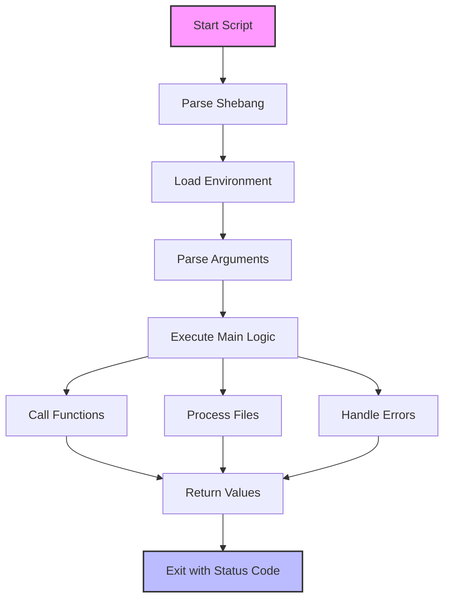

Bash scripting is a powerful way to automate tasks on Unix-based systems. Whether you're a system administrator, developer, or just someone who wants to be more efficient with their computer, learning Bash will save you countless hours of repetitive work. This crash course will give you the core knowledge you need for daily use, while equipping you with the tools to explore advanced topics on your own.

## Prerequisites

Before we dive in, let's make sure you have everything you need:

- Access to a Bash shell:

  - Linux: Already installed as the default shell
  - macOS: Already installed (though it's an older version)
  - Windows: Install Windows Subsystem for Linux (WSL), Git Bash, or Cygwin

- Any text editor (VS Code, Sublime Text, Vim, or even Notepad)

That's it! No special software or advanced knowledge required.

## Getting Started

Let's begin with the absolute basics - creating and running your first script.

### Your First Script

Open your text editor and create a file named `hello.sh` with the following content:

```bash
#!/bin/bash

# This is a comment
echo "Hello, World!"
```

The first line (`#!/bin/bash`) is called a "shebang" which tells the system to use the Bash interpreter. The `echo` command simply outputs text to the screen.

To run this script, you first need to make it executable:

```bash
chmod +x hello.sh
```

Then you can run it:

```bash
./hello.sh
```

Congratulations! You've just created and executed your first Bash script. Now let's dive deeper into the core concepts.

## Bash Fundamentals

At the heart of Bash scripting are variables, user input, and command-line arguments. These basic tools will form the foundation of almost every script you'll write.

### Variables

Variables allow you to store and manipulate data. In Bash, variables are quite straightforward:

```bash
#!/bin/bash

# String variables (no spaces around =)
NAME="John"
echo "Hello, $NAME"

# Numeric variables
AGE=30
echo "You are $AGE years old"

# Command substitution (store command output)
CURRENT_DIR=$(pwd)
echo "Current directory: $CURRENT_DIR"

# Arrays
FRUITS=("Apple" "Banana" "Orange")
echo "First fruit: ${FRUITS[0]}"
echo "All fruits: ${FRUITS[@]}"
```

Unlike many programming languages, Bash doesn't require you to declare variable types. However, there are some important rules to remember: never put spaces around the equals sign, and always use quotes for strings that contain spaces.

### User Input

Interactive scripts often need to gather input from users. The `read` command makes this simple:

```bash
#!/bin/bash

# Basic input
echo "What's your name?"
read NAME

# Input with prompt
read -p "Enter your age: " AGE

echo "Hello $NAME, you are $AGE years old"
```

The `-p` flag lets you provide a prompt in the same line, making your scripts more compact and user-friendly.

### Command-line Arguments

For non-interactive scripts, you'll often want to pass information directly when you run the script. This is where command-line arguments come in:

```bash
#!/bin/bash

# $0 - Script name
# $1, $2, etc. - Arguments
# $# - Number of arguments
# $@ - All arguments

echo "Script name: $0"
echo "First argument: $1"
echo "Second argument: $2"
echo "Number of arguments: $#"
echo "All arguments: $@"

# Run with: ./script.sh arg1 arg2 arg3
```

These special variables let you access information passed to your script, making your scripts more flexible and reusable.

## Control Flow

Now that we can store and manipulate data, we need ways to make decisions and control the flow of our scripts. This is where conditional statements and loops come in.

### If-Else Statements

Conditional statements let your scripts make decisions based on various conditions:

```bash
#!/bin/bash

# Simple if
if [ "$1" = "hello" ]; then
    echo "Hello to you too!"
fi

# If-else
if [ $AGE -ge 18 ]; then
    echo "You are an adult"
else
    echo "You are a minor"
fi

# If-elif-else
read -p "Enter a fruit: " FRUIT
if [ "$FRUIT" = "apple" ]; then
    echo "You entered apple"
elif [ "$FRUIT" = "banana" ]; then
    echo "You entered banana"
else
    echo "You entered something else"
fi

# Comparison operators for numbers:
# -eq (equal), -ne (not equal)
# -gt (greater than), -lt (less than)
# -ge (greater than or equal), -le (less than or equal)

# For strings:
# = (equal), != (not equal)
# -z (empty string), -n (non-empty string)
```

Notice that Bash uses different operators for comparing numbers (-eq, -gt, etc.) versus strings (=, !=). This is one of Bash's quirks that you'll quickly get used to.

### Case Statements

When you need to check a variable against multiple values, case statements are often clearer than multiple if-else blocks:

```bash
#!/bin/bash

read -p "Enter a color (red/green/blue): " COLOR

case $COLOR in
    red)
        echo "You chose red"
        ;;
    green)
        echo "You chose green"
        ;;
    blue)
        echo "You chose blue"
        ;;
    *)  # Default case
        echo "Unknown color"
        ;;
esac
```

The case statement matches the value against each pattern until it finds a match. The `*)` pattern serves as the default case, catching any values that didn't match the previous patterns.

## Loops

Loops allow you to repeat actions, process lists of items, and iterate through data. Bash provides several types of loops, each suited for different scenarios.

### For Loop

The for loop is perfect for iterating through lists, ranges, or arrays:

```bash
#!/bin/bash

# Loop through a range
echo "Numbers 1-5:"
for i in {1..5}; do
    echo "Number: $i"
done

# Loop through a list
echo "Fruits:"
for FRUIT in Apple Banana Orange; do
    echo "Fruit: $FRUIT"
done

# Loop through array
FRUITS=("Apple" "Banana" "Orange")
for FRUIT in "${FRUITS[@]}"; do
    echo "Array fruit: $FRUIT"
done

# C-style for loop
for ((i=0; i<5; i++)); do
    echo "Count: $i"
done
```

The flexibility of the for loop makes it the workhorse of many Bash scripts. The brace expansion `{1..5}` is a convenient shorthand for specifying ranges.

### While Loop

When you need to repeat something until a condition is no longer true, the while loop is your friend:

```bash
#!/bin/bash

# Simple counter
COUNT=1
while [ $COUNT -le 5 ]; do
    echo "Count: $COUNT"
    COUNT=$((COUNT+1))
done

# Read file line by line
while read -r LINE; do
    echo "Line: $LINE"
done < file.txt  # Input redirection
```

The second example shows how while loops are often used with input redirection to process files line by line—a common task in system administration scripts.

### Until Loop

The until loop is less common but complements the while loop nicely—it repeats until a condition becomes true:

```bash
#!/bin/bash

# Loops until condition is true
COUNT=1
until [ $COUNT -gt 5 ]; do
    echo "Until count: $COUNT"
    COUNT=$((COUNT+1))
done
```

This loop will continue executing until the COUNT is greater than 5, which is effectively the same as our earlier while loop example.

## Functions

As your scripts grow more complex, you'll want to organize related code into reusable functions:

```bash
#!/bin/bash

# Define a function
say_hello() {
    echo "Hello, $1!"
}

# Function with return value
add_numbers() {
    local sum=$(($1 + $2))  # 'local' makes variable local to function
    echo $sum               # Use echo to return value
    return 0                # Return status code (0 = success)
}

# Call functions
say_hello "World"
result=$(add_numbers 5 3)
echo "5 + 3 = $result"
```

Functions help keep your code organized and reduce duplication. Note that Bash functions don't truly "return" values like in other languages—they return exit status codes (0-255), and you capture output using command substitution as shown above.

## File Operations

Working with files is a cornerstone of Bash scripting. Let's look at common file operations:

```bash
#!/bin/bash

# Check if file exists
if [ -f "file.txt" ]; then
    echo "file.txt exists"
fi

# Create a file
echo "Hello World" > file.txt  # Overwrite
echo "Another line" >> file.txt  # Append

# Read a file
cat file.txt

# Process file line by line
while IFS= read -r line; do
    echo "Line content: $line"
done < file.txt

# File test operators:
# -f (regular file), -d (directory)
# -r (readable), -w (writable), -x (executable)
# -s (non-empty file)
```

The redirection operators (`>` and `>>`) are particularly useful—they let you send command output to files, either overwriting or appending. The file test operators let you check various properties of files before attempting to work with them.

## String Operations

Manipulating text is another common task in Bash. Here are some useful string operations:

```bash
#!/bin/bash

STRING="Hello, World!"

# Length
echo "Length: ${#STRING}"

# Substring (position, length)
echo "Substring: ${STRING:7:5}"  # Outputs "World"

# Replace
echo "Replace: ${STRING/World/Bash}"  # Outputs "Hello, Bash!"

# Uppercase/Lowercase
echo "Uppercase: ${STRING^^}"
echo "Lowercase: ${STRING,,}"
```

These parameter expansions provide a quick way to manipulate strings without having to call external programs like `sed` or `awk`.

## Arithmetic Operations

Bash can perform basic arithmetic, which is useful for counters, indices, and simple calculations:

```bash
#!/bin/bash

# Basic arithmetic
A=5
B=3

SUM=$((A + B))
DIFF=$((A - B))
PRODUCT=$((A * B))
QUOTIENT=$((A / B))
REMAINDER=$((A % B))

echo "Sum: $SUM"
echo "Difference: $DIFF"
echo "Product: $PRODUCT"
echo "Quotient: $QUOTIENT"
echo "Remainder: $REMAINDER"

# Increment/Decrement
A=$((A+1))  # Or: ((A++))
B=$((B-1))  # Or: ((B--))

# Alternative let command
let "A = A + 5"
```

The double-parentheses syntax `$((...))` creates an arithmetic context where you can use familiar operators. Keep in mind that Bash only works with integers—for floating-point math, you'll need to use external tools.

## Putting It All Together: A Practical Example

Now that we've covered the fundamentals, let's see how they come together in a real-world script. This log file analyzer demonstrates many of the concepts we've learned:

```bash
#!/bin/bash

# Script to analyze a log file and report errors

LOG_FILE="$1"
ERROR_COUNT=0
WARNING_COUNT=0

# Check if file exists
if [ ! -f "$LOG_FILE" ]; then
    echo "Error: Log file not found"
    exit 1  # Exit with error code
fi

# Count errors and warnings
while IFS= read -r line; do
    if [[ "$line" == *"ERROR"* ]]; then
        ERROR_COUNT=$((ERROR_COUNT+1))
    elif [[ "$line" == *"WARNING"* ]]; then
        WARNING_COUNT=$((WARNING_COUNT+1))
    fi
done < "$LOG_FILE"

# Report findings
echo "Log Analysis Report"
echo "==================="
echo "Log file: $LOG_FILE"
echo "Errors found: $ERROR_COUNT"
echo "Warnings found: $WARNING_COUNT"

# Exit with success
exit 0

# Run with: ./log_analyzer.sh application.log
```

This script takes a log file as a command-line argument, checks if the file exists, processes it line by line, and outputs a summary of errors and warnings. It's simple yet practical—the kind of utility you might use daily in a system administration role.

## Bash Script Execution Flow

To better understand how Bash scripts work, here's a visualization of the typical execution flow:



Every script follows this general pattern, from the simplest "Hello World" to complex system utilities.

## Error Handling Basics

Robust scripts need proper error handling. Here are some fundamental techniques:

```bash
#!/bin/bash

# Exit on error
set -e  # Script exits if any command fails

# Custom error handling
error_handler() {
    echo "Error occurred at line $1"
    exit 1
}

# Trap errors
trap 'error_handler $LINENO' ERR

# Check command success
if ! command; then
    echo "Command failed"
    exit 1
fi

# Capture command output and exit status
OUTPUT=$(command)
STATUS=$?
if [ $STATUS -ne 0 ]; then
    echo "Command failed with status $STATUS"
    exit $STATUS
fi
```

Good error handling makes your scripts more reliable and easier to debug. The `trap` command is particularly powerful—it lets you catch signals (like errors or user interruptions) and run custom code when they occur.

## Best Practices

As you write more Bash scripts, keep these best practices in mind:

1. Always start with a shebang: `#!/bin/bash`
2. Make scripts executable: `chmod +x script.sh`
3. Use meaningful variable names
4. Add comments to explain complex logic
5. Validate user input
6. Handle errors appropriately
7. Use functions for reusable code
8. Prefer double quotes around variables: `"$VAR"`
9. Exit with appropriate status codes
10. Test scripts thoroughly

Following these guidelines will help you write scripts that are easier to maintain, more reliable, and less prone to unexpected behavior.

## The Remaining 15%: Advanced Topics

Now that you've mastered the 85% of Bash scripting you'll use daily, here's what you should explore next as you advance:

1. **Advanced Regular Expressions**: Pattern matching beyond basic wildcards

   ```bash
   if [[ "$string" =~ ^[0-9]{3}-[0-9]{3}-[0-9]{4}$ ]]; then
       echo "Valid US phone number format"
   fi
   ```

2. **Advanced Text Processing**:

   - `sed` for stream editing and text transformations
   - `awk` for data processing and reporting

3. **Signal Handling and Process Management**:

   ```bash
   # Trap signals
   trap "echo 'Script interrupted'; exit 1" SIGINT SIGTERM

   # Background processes
   command &
   PID=$!
   wait $PID
   ```

4. **Debugging Techniques**:

   ```bash
   # Trace execution
   set -x  # Start tracing
   command1
   command2
   set +x  # Stop tracing
   ```

5. **Security Hardening**:

   - Handling sensitive data
   - Input sanitization to prevent injection

6. **Advanced Variable Manipulation**:

   ```bash
   # Parameter substitution
   ${var:-default}  # Use default if var is unset
   ${var#pattern}   # Remove pattern from beginning
   ${var%pattern}   # Remove pattern from end
   ```

7. **Subshells and Process Substitution**:

   ```bash
   # Process substitution
   diff <(sort file1.txt) <(sort file2.txt)
   ```

8. **Network Programming**:

   - Working with curl, wget
   - Basic socket programming

9. **Bash as Glue Language**:

   - Integrating with other languages
   - API interactions

10. **Performance Optimization**:
    - Reducing unnecessary commands
    - Parallel execution techniques

## Conclusion

Throughout this crash course, we've covered the essential tools and techniques that make up 85% of what you'll use in everyday Bash scripting. We started with the basics of creating and running scripts, explored variables and control structures, and worked our way through more advanced concepts like functions and file operations.

Bash scripting is a skill that grows with practice. The more you use it to solve real problems, the more comfortable and proficient you'll become. Start by automating simple tasks—renaming files, processing data, or running repetitive commands. As your confidence grows, you can tackle more complex challenges and explore the advanced topics we've outlined.

Remember that the shell is an incredibly powerful tool that's always at your fingertips. With the foundation you've built in this crash course, you're well-equipped to automate tasks, improve your productivity, and dive deeper into the world of system administration and DevOps.

Happy scripting!
