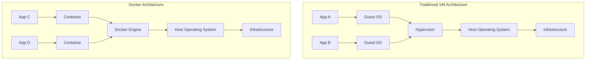
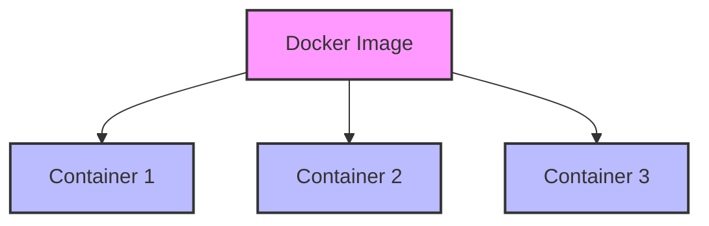
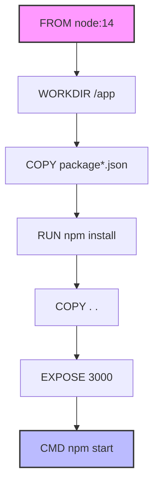

Hey there! Ready to dive into the world of Docker? I'm going to walk you through everything you need to know to get up and running with Docker quickly. By the end of this crash course, you'll understand about 85% of what you'll encounter daily, plus have the foundation to explore the rest on your own.

## What is Docker & Why Should You Care?

Docker is like a shipping container for your code. Just as shipping containers revolutionized global transport by standardizing how goods are shipped, Docker standardizes how software is packaged and run.

In simple terms, Docker lets you package an application with all its dependencies into a standardized unit (called a container) that can run the same way anywhere.

**Why is this awesome?**

- **Consistency**: "It works on my machine" is no longer an excuse!
- **Isolation**: Applications don't interfere with each other
- **Portability**: Run the same container on your laptop, test server, or cloud
- **Efficiency**: Containers share OS resources and start in seconds

## Docker vs Virtual Machines



The key difference? VMs virtualize the entire OS, while Docker containers share the host OS kernel and only package what your app needs.

## Let's Get Docker Installed

### Prerequisites:

- A 64-bit OS (Windows, macOS, or Linux)
- For Windows, you need Windows 10/11 Pro, Enterprise, or Education with Hyper-V capability

### Installation:

**For macOS:**

```bash
# Using Homebrew
brew install --cask docker
# Then open Docker Desktop from Applications
```

**For Ubuntu/Debian:**

```bash
# Update package index
sudo apt-get update

# Install packages to allow apt to use a repository over HTTPS
sudo apt-get install -y apt-transport-https ca-certificates curl software-properties-common

# Add Docker's official GPG key
curl -fsSL https://download.docker.com/linux/ubuntu/gpg | sudo apt-key add -

# Set up the Docker repository
sudo add-apt-repository "deb [arch=amd64] https://download.docker.com/linux/ubuntu $(lsb_release -cs) stable"

# Install Docker
sudo apt-get update
sudo apt-get install -y docker-ce

# Add your user to the docker group to run without sudo
sudo usermod -aG docker $USER
# Log out and back in for this to take effect
```

**For Windows:**

1. Download Docker Desktop from [Docker's website](https://www.docker.com/products/docker-desktop)
2. Run the installer and follow the prompts
3. Launch Docker Desktop

To verify your installation, open a terminal and run:

```bash
docker --version
# Should output something like: Docker version 24.0.5, build ced0996
```

## Docker's Core Concepts

### Images vs Containers

Think of an image as a recipe and a container as the dish you cook from it:

- **Image**: A read-only template with instructions for creating a container
- **Container**: A runnable instance of an image



## Essential Docker Commands

Let's get comfortable with the commands you'll use most often:

```bash
# Pull an image from Docker Hub
docker pull nginx
# You'll see progress bars as Docker downloads the image layers

# List downloaded images
docker images
# You'll see a table with repositories, tags, image IDs, etc.

# Run a container
docker run --name my-nginx -p 8080:80 -d nginx
# This runs nginx in the background, mapping port 8080 on your host to port 80 in the container

# List running containers
docker ps
# Shows container ID, image, command, created time, status, ports, and name

# Stop a container
docker stop my-nginx

# List all containers (including stopped ones)
docker ps -a

# Remove a container
docker rm my-nginx

# Remove an image
docker rmi nginx
```

## Understanding Dockerfiles

A Dockerfile is like a recipe for your Docker image. It's a text file with instructions on how to build the image.

Let's create a simple Dockerfile for a Node.js app:

```dockerfile
# Base image
FROM node:14

# Set working directory
WORKDIR /app

# Copy package files
COPY package*.json ./

# Install dependencies
RUN npm install

# Copy all other source code
COPY . .

# Expose port
EXPOSE 3000

# Start the app
CMD ["npm", "start"]
```

Each instruction creates a new layer in the image:



## Building & Running Your Own Images

Let's say you have a simple Node.js app:

```bash
# Project structure
my-node-app/
├── Dockerfile
├── package.json
├── index.js
└── ...
```

Build and run it:

```bash
# Build the image
docker build -t my-node-app .
# The '.' means "use the Dockerfile in the current directory"

# Run the container
docker run -p 3000:3000 --name my-app-container my-node-app
```

## Data Persistence with Volumes

Containers are ephemeral (temporary), meaning when a container stops, any data inside is lost. Volumes solve this problem:

```bash
# Create a volume
docker volume create my-data

# Run a container with a volume mounted
docker run -d --name my-db \
  -v my-data:/var/lib/mysql \
  -e MYSQL_ROOT_PASSWORD=secret \
  mysql:5.7
# Now the MySQL data will persist even if the container is removed
```

## Multi-Container Apps with Docker Compose

Most real applications involve multiple containers (e.g., web server, database, cache). Docker Compose lets you define and run multi-container applications.

Create a `docker-compose.yml` file:

```yaml
version: '3'
services:
  # Web application
  web:
    build: .
    ports:
      - '3000:3000'
    depends_on:
      - db
    environment:
      - DATABASE_URL=postgres://postgres:password@db:5432/mydb

  # Database
  db:
    image: postgres:13
    volumes:
      - db-data:/var/lib/postgresql/data
    environment:
      - POSTGRES_PASSWORD=password
      - POSTGRES_DB=mydb

volumes:
  db-data:
```

Start everything with a single command:

```bash
docker-compose up -d
# This builds images if needed and starts all services
```

Stop everything:

```bash
docker-compose down
# Add --volumes to also remove the volumes
```

## Docker Networking

Containers can talk to each other through Docker networks:

```bash
# Create a network
docker network create my-network

# Run containers in the network
docker run -d --name redis --network my-network redis
docker run -d --name app --network my-network my-app

# Now 'app' can reach 'redis' using its container name as the hostname
```

## Practical Example: Setting Up a WordPress Site

Let's put it all together with a practical example using Docker Compose:

```yaml
# docker-compose.yml
version: '3'

services:
  # WordPress
  wordpress:
    image: wordpress:latest
    ports:
      - '8080:80'
    environment:
      WORDPRESS_DB_HOST: db
      WORDPRESS_DB_USER: wordpress
      WORDPRESS_DB_PASSWORD: wordpress
      WORDPRESS_DB_NAME: wordpress
    volumes:
      - wordpress_files:/var/www/html
    depends_on:
      - db

  # MySQL Database
  db:
    image: mysql:5.7
    volumes:
      - db_data:/var/lib/mysql
    environment:
      MYSQL_ROOT_PASSWORD: rootpassword
      MYSQL_DATABASE: wordpress
      MYSQL_USER: wordpress
      MYSQL_PASSWORD: wordpress

volumes:
  wordpress_files:
  db_data:
```

Start it with:

```bash
docker-compose up -d
# Wait a minute, then visit http://localhost:8080 in your browser
```

## Seeding a Database Example

If you need to seed a database with initial data, you can do this by mounting SQL scripts that run when the container starts:

```yaml
# docker-compose.yml
version: '3'

services:
  db:
    image: postgres:13
    environment:
      POSTGRES_PASSWORD: password
      POSTGRES_DB: myapp
    volumes:
      - ./init-scripts:/docker-entrypoint-initdb.d
      - db_data:/var/lib/postgresql/data
    ports:
      - '5432:5432'

volumes:
  db_data:
```

Create an init script:

```sql
-- ./init-scripts/01-seed.sql
CREATE TABLE users (
  id SERIAL PRIMARY KEY,
  name VARCHAR(100) NOT NULL,
  email VARCHAR(100) UNIQUE NOT NULL
);

INSERT INTO users (name, email) VALUES
  ('John Doe', 'john@example.com'),
  ('Jane Smith', 'jane@example.com');
```

## Docker Best Practices

1. **Use official images** when possible
2. **Keep images small** (use Alpine-based images, multi-stage builds)
3. **Don't run as root** inside containers
4. **Use environment variables** for configuration
5. **Label your images** with metadata
6. **Use .dockerignore** files to exclude unnecessary files
7. **Pin specific versions** in your image tags (e.g., `node:14.17` instead of `node:latest`)
8. **Use health checks** to verify container state

## The Remaining 15%: What to Explore Next

Now that you've got the basics down, here's what you can explore next:

1. **Advanced Networking**

   - Overlay networks for multi-host setups
   - Network policies and security
   - Custom DNS configurations

2. **Container Orchestration**

   - Docker Swarm (Docker's native orchestration)
   - Kubernetes basics and integration
   - Service discovery and load balancing

3. **Docker Security**

   - Image scanning for vulnerabilities
   - Content trust and image signing
   - Runtime security and container isolation
   - Limiting container resources

4. **CI/CD Integration**

   - Building images in CI pipelines
   - Automated testing of containers
   - Container registry integration

5. **Production Considerations**

   - Logging strategies
   - Monitoring containers
   - Backup and restore procedures
   - High availability setups

6. **Performance Optimization**
   - Multi-stage builds
   - Image layer caching strategies
   - Resource constraints fine-tuning

This foundation gives you the tools to start exploring these more advanced topics on your own. The good news is that the core concepts you've learned will apply to all of these areas!

Feel free to start with whichever seems most relevant to your projects. Docker has excellent documentation, and there are tons of tutorials online covering these advanced topics.

Happy containerizing! 🐳
