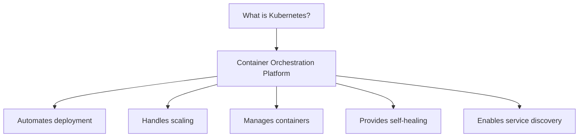
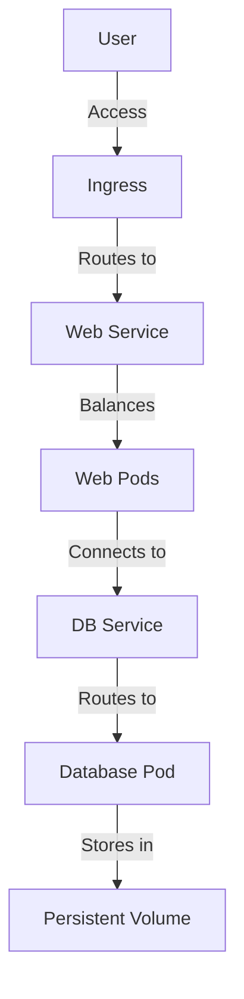
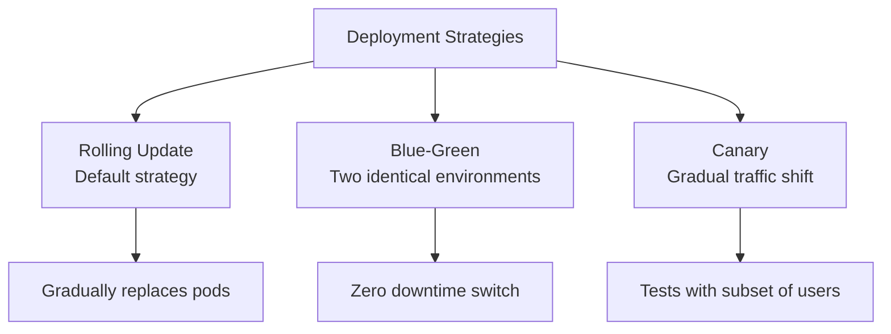

## Introduction

Kubernetes (K8s) is an open-source platform for automating the deployment, scaling, and management of containerized applications. Originally developed by Google and now maintained by the Cloud Native Computing Foundation, it has become the industry standard for container orchestration. In this crash course, I'll cover the essential 85% you need for daily work, and prepare you to explore the remaining 15% on your own.



## Prerequisites

Before we begin our Kubernetes journey, you'll need:

1. Basic understanding of containers (Docker)
2. Command line familiarity
3. YAML syntax knowledge
4. A computer with at least 4GB RAM, 2 CPUs

These prerequisites ensure you can follow along with the hands-on parts of this crash course without getting stuck on fundamentals.

## Installation: Getting Started

Now that we understand what Kubernetes is and what we need, let's set up a local Kubernetes environment to get hands-on experience:

### 1. Install Docker

First, install Docker Desktop (Mac/Windows) or Docker Engine (Linux) as Kubernetes relies on containers:

```bash
# For Ubuntu
sudo apt update
sudo apt install docker.io
sudo systemctl enable --now docker

# Verify installation
docker --version
```

### 2. Install Minikube

With Docker in place, we can now install Minikube, which runs a single-node Kubernetes cluster locally:

```bash
# macOS (with Homebrew)
brew install minikube

# Linux
curl -LO https://storage.googleapis.com/minikube/releases/latest/minikube-linux-amd64
sudo install minikube-linux-amd64 /usr/local/bin/minikube

# Windows (with chocolatey)
choco install minikube

# Start your cluster
minikube start

# Verify status
minikube status
```

### 3. Install kubectl

Finally, we need kubectl, the command-line tool for interacting with our Kubernetes cluster:

```bash
# macOS
brew install kubectl

# Linux
curl -LO "https://dl.k8s.io/release/$(curl -L -s https://dl.k8s.io/release/stable.txt)/bin/linux/amd64/kubectl"
sudo install -o root -g root -m 0755 kubectl /usr/local/bin/kubectl

# Windows
choco install kubernetes-cli

# Verify installation
kubectl version --client
```

With these three components installed, you now have a complete local Kubernetes environment ready for exploration.

## Kubernetes Architecture

A Kubernetes Cluster consists of two main components: the Control Plane and Worker Nodes.

The Control Plane includes several critical components:

- **API Server**: Functions as the central communication hub for the entire cluster
- **Scheduler**: Responsible for assigning pods to appropriate nodes
- **Controller Manager**: Maintains the desired state of the cluster
- **etcd**: Serves as the cluster state database, storing all configuration data

Worker Nodes contain the following components:

- **Kubelet**: Manages pods on each node
- **Kube-proxy**: Establishes and maintains network rules
- **Container Runtime**: Executes containers within the environment

The Kubelet on Worker Nodes directly manages Pods, which contain the application containers. All components work in coordination, with the API Server acting as the central communication point between the Control Plane and Worker Nodes to maintain the desired state of applications running in the cluster.

### Components Explained

1. **Control Plane** (formerly Master): The brain of the cluster

   - **API Server**: The front door to the cluster that processes all requests
   - **Scheduler**: Watches for new pods and assigns them to nodes
   - **Controller Manager**: Ensures the cluster maintains the desired state
   - **etcd**: Key-value store that holds all cluster data

2. **Worker Nodes**: Where your applications actually run
   - **Kubelet**: Ensures containers are running in pods
   - **Kube-proxy**: Maintains network rules on the node
   - **Container Runtime**: Software that runs containers (Docker, containerd)

This architecture follows a central control model where the Control Plane makes decisions and Worker Nodes carry them out, creating a scalable and resilient system.

## Core Kubernetes Concepts

Now that we understand the infrastructure, let's explore the essential building blocks you'll use daily in Kubernetes:

### 1. Pods

The smallest deployable unit in Kubernetes is the Pod. Think of a Pod as a wrapper around one or more containers:

```yaml
# simple-pod.yaml
apiVersion: v1
kind: Pod
metadata:
  name: nginx-pod # Name of the pod
  labels:
    app: nginx # Label for identification/selection
spec:
  containers:
    - name: nginx # Container name inside the pod
      image: nginx:latest # Docker image to use
      ports:
        - containerPort: 80 # Port the container exposes
```

Apply with:

```bash
kubectl apply -f simple-pod.yaml
```

Key characteristics:

- Contains one or more containers that share storage/network
- Gets its own IP address
- Always runs on a single node
- Is ephemeral (temporary)

While Pods are the foundation of Kubernetes, you'll rarely create them directly. Instead, you'll use higher-level abstractions like Deployments, which we'll discuss shortly.

### 2. Services

Since Pods are ephemeral and their IP addresses change when restarted, we need Services to provide stable network endpoints to access them:

```yaml
# nginx-service.yaml
apiVersion: v1
kind: Service
metadata:
  name: nginx-service
spec:
  selector:
    app: nginx # Connects to pods with this label
  ports:
    - port: 80 # Port the service exposes
      targetPort: 80 # Port on the pod to forward to
  type: ClusterIP # Service type (internal to cluster)
```

Service types:

- **ClusterIP**: Internal-only IP (default)
- **NodePort**: Exposes on each node's IP at a static port
- **LoadBalancer**: Uses cloud provider's load balancer
- **ExternalName**: Maps to a DNS name

Services allow your applications to communicate with each other reliably, even as the underlying Pods come and go.

### 3. Deployments

Rather than managing individual Pods, Deployments allow us to declare a desired state for a set of identical pods (replicas):

```yaml
# nginx-deployment.yaml
apiVersion: apps/v1
kind: Deployment
metadata:
  name: nginx-deployment
spec:
  replicas: 3 # Maintains 3 identical pods
  selector:
    matchLabels:
      app: nginx
  template: # Pod template
    metadata:
      labels:
        app: nginx
    spec:
      containers:
        - name: nginx
          image: nginx:1.14.2
          ports:
            - containerPort: 80
          resources:
            limits:
              cpu: '0.5' # Maximum CPU usage
              memory: '512Mi' # Maximum memory usage
            requests:
              cpu: '0.2' # Minimum CPU requested
              memory: '256Mi' # Minimum memory requested
```

Benefits:

- Declarative updates for pods
- Rolling updates with zero downtime
- Automatic rollback capability
- Scaling capabilities

Deployments are your primary tool for managing applications in Kubernetes, handling all the complexity of ensuring the right number of Pods are running and healthy.

### 4. ConfigMaps and Secrets

A key principle in modern application design is separating configuration from code. Kubernetes supports this through ConfigMaps and Secrets:

```yaml
# app-config.yaml
apiVersion: v1
kind: ConfigMap
metadata:
  name: app-config
data:
  DB_HOST: 'database.example.com'
  API_ENDPOINT: 'api.example.com'
---
apiVersion: v1
kind: Secret
metadata:
  name: app-secrets
type: Opaque
data:
  # Base64 encoded: echo -n "Password123" | base64
  DB_PASSWORD: UGFzc3dvcmQxMjM=
```

Using in a pod:

```yaml
spec:
  containers:
    - name: myapp
      image: myapp:1.0
      env:
        - name: DB_HOST
          valueFrom:
            configMapKeyRef:
              name: app-config
              key: DB_HOST
        - name: DB_PASSWORD
          valueFrom:
            secretKeyRef:
              name: app-secrets
              key: DB_PASSWORD
```

This separation lets you update configuration without rebuilding container images, making your applications more flexible and secure.

### 5. Persistent Volumes

Containers are ephemeral by design, which means any data inside is lost when the container restarts. For data that needs to survive pod restarts, we use Persistent Volumes:

```yaml
# persistent-storage.yaml
apiVersion: v1
kind: PersistentVolumeClaim
metadata:
  name: data-pvc
spec:
  accessModes:
    - ReadWriteOnce # Can be mounted by a single node for read/write
  resources:
    requests:
      storage: 1Gi # Request 1GB of storage
```

Using in a pod:

```yaml
spec:
  containers:
    - name: postgres
      image: postgres:13
      volumeMounts:
        - name: data-volume
          mountPath: /var/lib/postgresql/data # Mount point in container
  volumes:
    - name: data-volume
      persistentVolumeClaim:
        claimName: data-pvc # Reference the PVC
```

Persistent Volumes allow stateful applications like databases to function properly in the otherwise stateless Kubernetes environment.

## Essential kubectl Commands

Now that we understand the key resources, let's explore the commands that will handle 85% of your daily interactions with Kubernetes:

```bash
# Viewing resources
kubectl get pods                    # List all pods
kubectl get deployments             # List deployments
kubectl get services                # List services
kubectl get nodes                   # List cluster nodes
kubectl get all                     # List multiple resource types

# Detailed information
kubectl describe pod <pod-name>     # Show details of a pod
kubectl describe deployment <name>  # Show deployment details

# Creating & updating resources
kubectl apply -f <filename.yaml>    # Create/update from file
kubectl delete -f <filename.yaml>   # Delete resources in file

# Logs & Debugging
kubectl logs <pod-name>             # View pod logs
kubectl logs -f <pod-name>          # Stream pod logs
kubectl exec -it <pod-name> -- /bin/bash  # Open shell in pod

# Scaling
kubectl scale deployment <name> --replicas=5  # Scale to 5 pods

# Port forwarding (for local testing)
kubectl port-forward <pod-name> 8080:80  # Local:Pod port
```

These commands form the core of your daily interaction with Kubernetes. As you become more comfortable with them, you'll be able to efficiently manage and troubleshoot your applications.

## Practical Example: Deploying a Complete Application

Let's put everything we've learned together by deploying a web application with a database. This example demonstrates how the various components work together:



### Step 1: Create a namespace

First, let's create a dedicated namespace to organize our resources:

```yaml
# namespace.yaml
apiVersion: v1
kind: Namespace
metadata:
  name: demo-app
```

Apply it:

```bash
kubectl apply -f namespace.yaml
```

### Step 2: Database deployment

Next, let's deploy our database component:

```yaml
# database.yaml
# Secret for database password
apiVersion: v1
kind: Secret
metadata:
  name: db-secret
  namespace: demo-app
type: Opaque
data:
  # echo -n "Password123" | base64
  password: UGFzc3dvcmQxMjM=
---
# Storage for database
apiVersion: v1
kind: PersistentVolumeClaim
metadata:
  name: db-pvc
  namespace: demo-app
spec:
  accessModes:
    - ReadWriteOnce
  resources:
    requests:
      storage: 1Gi
---
# Database deployment
apiVersion: apps/v1
kind: Deployment
metadata:
  name: db-deployment
  namespace: demo-app
spec:
  replicas: 1 # Only 1 for database
  selector:
    matchLabels:
      app: postgres
  template:
    metadata:
      labels:
        app: postgres
    spec:
      containers:
        - name: postgres
          image: postgres:13
          ports:
            - containerPort: 5432
          env:
            - name: POSTGRES_PASSWORD
              valueFrom:
                secretKeyRef:
                  name: db-secret
                  key: password
            - name: POSTGRES_DB
              value: demoapp
          volumeMounts:
            - name: db-storage
              mountPath: /var/lib/postgresql/data
      volumes:
        - name: db-storage
          persistentVolumeClaim:
            claimName: db-pvc
---
# Database service
apiVersion: v1
kind: Service
metadata:
  name: db-service
  namespace: demo-app
spec:
  selector:
    app: postgres
  ports:
    - port: 5432
      targetPort: 5432
  type: ClusterIP # Internal only
```

Notice how we've combined multiple resources in a single file, separated by `---`. This is a common practice that helps organize related resources.

### Step 3: Web application deployment

Now, let's deploy the web application that will connect to our database:

```yaml
# webapp.yaml
apiVersion: apps/v1
kind: Deployment
metadata:
  name: web-deployment
  namespace: demo-app
spec:
  replicas: 3 # Run 3 copies for high availability
  selector:
    matchLabels:
      app: web
  template:
    metadata:
      labels:
        app: web
    spec:
      containers:
        - name: web
          image: nginx:alpine # Using nginx as example
          ports:
            - containerPort: 80
          env:
            - name: DB_HOST
              value: db-service # Connects to the database service
            - name: DB_PASSWORD
              valueFrom:
                secretKeyRef:
                  name: db-secret
                  key: password
---
# Web service
apiVersion: v1
kind: Service
metadata:
  name: web-service
  namespace: demo-app
spec:
  selector:
    app: web
  ports:
    - port: 80
      targetPort: 80
  type: ClusterIP
---
# Ingress for external access
apiVersion: networking.k8s.io/v1
kind: Ingress
metadata:
  name: web-ingress
  namespace: demo-app
spec:
  rules:
    - host: demoapp.local # Add to your hosts file for local testing
      http:
        paths:
          - path: /
            pathType: Prefix
            backend:
              service:
                name: web-service
                port:
                  number: 80
```

The Ingress resource creates an entry point for external traffic to reach our web service.

### Step 4: Apply and verify

Finally, let's apply our configurations and verify everything is running:

```bash
# Apply configurations
kubectl apply -f database.yaml
kubectl apply -f webapp.yaml

# Check resources
kubectl get all -n demo-app

# Access locally (if Ingress not working)
kubectl port-forward svc/web-service 8080:80 -n demo-app
# Then visit http://localhost:8080 in your browser
```

This command sequence demonstrates the typical workflow for deploying applications to Kubernetes.

## Database Seeding Example

For applications with databases, you'll often need to initialize them with data. Here's how to create a one-time job to seed your database:

```yaml
# db-seed-job.yaml
apiVersion: batch/v1
kind: Job
metadata:
  name: db-seed-job
  namespace: demo-app
spec:
  template:
    spec:
      containers:
        - name: db-seed
          image: postgres:13
          command: ['/bin/bash', '-c']
          args:
            - |
              # Wait for database to be ready
              sleep 10
              # Run seed script
              PGPASSWORD=$DB_PASSWORD psql -h db-service -U postgres -d demoapp -c "
              CREATE TABLE IF NOT EXISTS users (
                id SERIAL PRIMARY KEY,
                name VARCHAR(100) NOT NULL,
                email VARCHAR(100) UNIQUE NOT NULL
              );

              INSERT INTO users (name, email) VALUES 
                ('John Doe', 'john@example.com'),
                ('Jane Smith', 'jane@example.com'),
                ('Bob Johnson', 'bob@example.com');
              "
          env:
            - name: DB_PASSWORD
              valueFrom:
                secretKeyRef:
                  name: db-secret
                  key: password
      restartPolicy: Never
```

Apply with:

```bash
kubectl apply -f db-seed-job.yaml
```

This Job resource runs once and terminates after completing its task, making it perfect for initialization operations.

## Deployment Strategies

As your applications evolve, you'll need to update them. Kubernetes supports several deployment strategies to minimize disruption:



### Rolling Update (Default)

The most commonly used strategy is Rolling Update, which gradually replaces old pods with new ones:

```yaml
spec:
  strategy:
    type: RollingUpdate
    rollingUpdate:
      maxUnavailable: 25% # Max unavailable pods during update
      maxSurge: 25% # Max extra pods during update
```

This approach balances availability with resource usage, ensuring your application remains available during updates.

## Monitoring Your Cluster

Once your applications are running, you'll want to keep an eye on their health and performance. Here are some basic monitoring commands:

```bash
# Node status
kubectl get nodes
kubectl describe node <node-name>

# Check pod usage
kubectl top pods  # Requires metrics-server
kubectl top nodes

# Event monitoring
kubectl get events --sort-by=.metadata.creationTimestamp
```

These commands provide insights into the current state of your cluster and can help identify potential issues before they become critical.

## The Remaining 15%: Advanced Topics

You now have a solid foundation in Kubernetes, covering approximately 85% of what you'll need for daily operations. As you grow more comfortable, here are the advanced topics to explore next:

1. **Autoscaling**

   - Horizontal Pod Autoscaler (HPA) adjusts the number of pods based on CPU/memory usage
   - Vertical Pod Autoscaler (VPA) adjusts resource requests and limits
   - Cluster Autoscaler adds or removes nodes based on pending pods

2. **Specialized Workload Resources**

   - StatefulSets provide guarantees about the ordering and uniqueness of pods
   - DaemonSets ensure a pod runs on every node in the cluster
   - Jobs & CronJobs handle batch processing and scheduled tasks

3. **Security**

   - Role-Based Access Control (RBAC) controls who can access what
   - Network Policies restrict traffic between pods
   - Pod Security Context controls pod privileges and access
   - Service Accounts authenticate pods to the API server

4. **Advanced Networking**

   - Service Mesh (Istio, Linkerd) provides traffic management, security, and observability
   - Network Policies enforce communications rules
   - Custom CNI plugins for specialized networking needs

5. **GitOps and CI/CD**

   - ArgoCD synchronizes your cluster with a Git repository
   - Flux provides GitOps for both applications and infrastructure
   - Jenkins X automates CI/CD on Kubernetes

6. **Ecosystem Tools**

   - Helm simplifies application deployment with charts
   - Kustomize provides template-free configuration customization
   - Prometheus & Grafana enable comprehensive monitoring
   - Logging solutions (EFK/ELK stack) centralize logs

7. **Multi-cluster Management**

   - Cluster Federation coordinates multiple clusters
   - Fleet management tools handle clusters at scale

8. **Production Readiness**
   - Disaster recovery planning ensures business continuity
   - Backup solutions (Velero) protect your data
   - Advanced troubleshooting techniques solve complex issues
   - Performance optimization ensures efficient resource usage

These advanced topics build upon the foundation you've established and allow you to tackle more complex scenarios as your Kubernetes journey continues.

## Summary

You've now learned the core 85% of Kubernetes:

- Setting up a local environment with Minikube
- Understanding Kubernetes architecture
- Working with Pods, Services, and Deployments
- Managing configurations with ConfigMaps and Secrets
- Handling persistent storage
- Essential kubectl commands
- Deploying a complete application

This foundation gives you the skills to work productively with Kubernetes on a daily basis. As you encounter more complex scenarios, you can incrementally explore the advanced topics from the final 15%.

Remember that Kubernetes is constantly evolving, so continuing to reference the official documentation at kubernetes.io will always be valuable as you deepen your knowledge. With practice and exploration, you'll soon be confidently managing containerized applications at scale.
