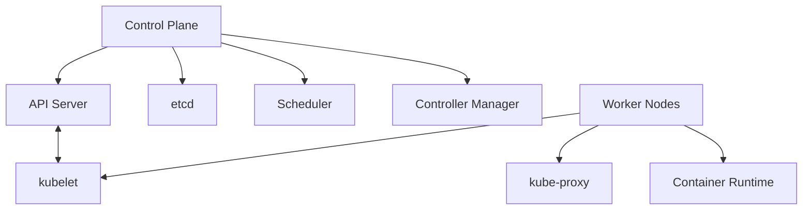
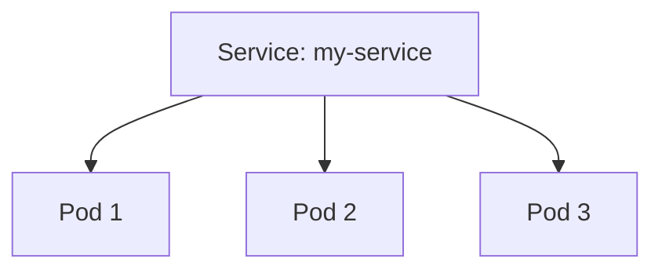
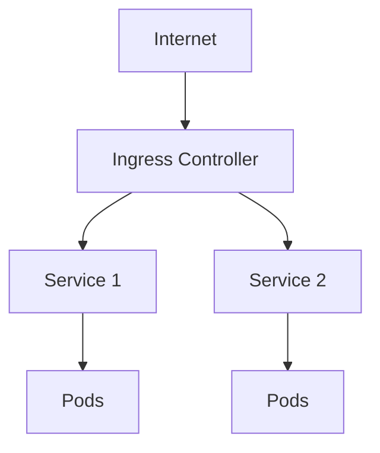
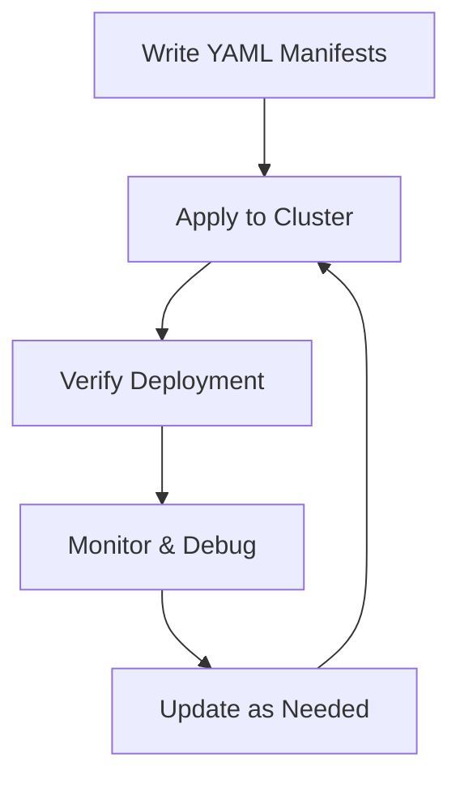

Hey there! Let's dive into the world of Kubernetes (K8s for short). By the end of this guide, you'll understand 85% of what you need for daily Kubernetes work, with enough foundation to explore the rest on your own.

## What is Kubernetes?

Kubernetes is an open-source platform for automating deployment, scaling, and management of containerized applications. Think of it as an orchestra conductor for your containers, ensuring they run exactly as you want them to.

## Why Kubernetes?

Imagine you have dozens or hundreds of containers. Managing them manually would be a nightmare! Kubernetes handles:

- Automatically restarting failed containers
- Scaling applications up or down based on demand
- Rolling out updates without downtime
- Load balancing traffic between containers

## Kubernetes Architecture

Let's visualize how Kubernetes is structured:



The **Control Plane** is the brain of Kubernetes:

- **API Server**: Everything communicates through this
- **etcd**: Database that stores the cluster state
- **Scheduler**: Decides where to run pods
- **Controller Manager**: Maintains the desired state

**Worker Nodes** are where your applications actually run:

- **kubelet**: Ensures containers are running as expected
- **kube-proxy**: Handles networking
- **Container Runtime**: The software running your containers (like Docker)

## Getting Started with Kubernetes

Let's get you a working Kubernetes environment:

### Option 1: Minikube (for local development)

```bash
# Install Minikube (macOS with Homebrew)
brew install minikube

# Start Minikube
minikube start

# Verify it's running
kubectl get nodes
# Should show something like:
# NAME       STATUS    ROLES    AGE     VERSION
# minikube   Ready     master   45s     v1.24.3
```

### Option 2: Kind (Kubernetes IN Docker)

```bash
# Install Kind
brew install kind

# Create a cluster
kind create cluster

# Verify it's running
kubectl get nodes
```

### Option 3: Docker Desktop

If you use Docker Desktop, you can enable Kubernetes in the settings.

## Kubernetes Objects: The Building Blocks

### Pods: The Smallest Unit

A Pod is one or more containers that share storage and network resources.

```yaml
# simple-pod.yaml
apiVersion: v1
kind: Pod
metadata:
  name: my-pod
spec:
  containers:
    - name: nginx
      image: nginx:latest
      ports:
        - containerPort: 80
```

```bash
# Create the pod
kubectl apply -f simple-pod.yaml

# See it running
kubectl get pods
```

### Deployments: Managing Pods

Deployments manage multiple replicas of your pods and handle updates.

```yaml
# simple-deployment.yaml
apiVersion: apps/v1
kind: Deployment
metadata:
  name: nginx-deployment
spec:
  replicas: 3 # We want 3 identical pods
  selector:
    matchLabels:
      app: nginx
  template:
    metadata:
      labels:
        app: nginx
    spec:
      containers:
        - name: nginx
          image: nginx:latest
          ports:
            - containerPort: 80
```

```bash
# Create the deployment
kubectl apply -f simple-deployment.yaml

# See your pods
kubectl get pods
# You should see 3 pods with names like nginx-deployment-xyz123
```

### Services: Networking Made Easy

Services provide a stable network endpoint for your pods.



```yaml
# service.yaml
apiVersion: v1
kind: Service
metadata:
  name: nginx-service
spec:
  selector:
    app: nginx
  ports:
    - port: 80
      targetPort: 80
  type: ClusterIP # Default internal service
```

```bash
# Create the service
kubectl apply -f service.yaml

# View services
kubectl get services
```

## ConfigMaps and Secrets: Configuration Management

### ConfigMaps for Non-Sensitive Data

```yaml
# config-map.yaml
apiVersion: v1
kind: ConfigMap
metadata:
  name: app-config
data:
  app.properties: |
    environment=dev
    log.level=info
  feature.flags: |
    dark-mode=true
    beta-features=false
```

```bash
kubectl apply -f config-map.yaml
```

Using a ConfigMap in a pod:

```yaml
# pod-with-config.yaml
apiVersion: v1
kind: Pod
metadata:
  name: app-pod
spec:
  containers:
    - name: app
      image: myapp:latest
      volumeMounts:
        - name: config-volume
          mountPath: /etc/config
  volumes:
    - name: config-volume
      configMap:
        name: app-config
```

### Secrets for Sensitive Data

```yaml
# secret.yaml
apiVersion: v1
kind: Secret
metadata:
  name: db-credentials
type: Opaque
data:
  username: YWRtaW4= # Base64 encoded "admin"
  password: cGFzc3dvcmQxMjM= # Base64 encoded "password123"
```

```bash
kubectl apply -f secret.yaml
```

## Essential kubectl Commands

```bash
# Get information
kubectl get pods
kubectl get deployments
kubectl get services
kubectl get nodes

# Detailed information
kubectl describe pod my-pod
kubectl describe deployment nginx-deployment

# Logs
kubectl logs my-pod
kubectl logs -f my-pod  # Follow logs in real-time

# Executing commands in containers
kubectl exec -it my-pod -- /bin/bash

# Port forwarding (access pod directly from your machine)
kubectl port-forward pod/my-pod 8080:80
# Now you can access the pod at localhost:8080
```

## Namespaces: Organizing Your Resources

Think of namespaces like folders for your Kubernetes resources.

```bash
# Create a namespace
kubectl create namespace dev

# List namespaces
kubectl get namespaces

# Use a namespace
kubectl -n dev get pods
```

## Storage: Persistent Volumes

For data that needs to persist beyond pod lifecycles:

```yaml
# persistent-volume.yaml
apiVersion: v1
kind: PersistentVolume
metadata:
  name: my-pv
spec:
  capacity:
    storage: 1Gi
  accessModes:
    - ReadWriteOnce
  persistentVolumeReclaimPolicy: Retain
  hostPath: # Just for local testing
    path: /data/my-pv
```

```yaml
# persistent-volume-claim.yaml
apiVersion: v1
kind: PersistentVolumeClaim
metadata:
  name: my-pvc
spec:
  accessModes:
    - ReadWriteOnce
  resources:
    requests:
      storage: 1Gi
```

Using the PVC in a pod:

```yaml
# pod-with-storage.yaml
apiVersion: v1
kind: Pod
metadata:
  name: pod-with-storage
spec:
  containers:
    - name: app
      image: myapp:latest
      volumeMounts:
        - name: data-volume
          mountPath: /data
  volumes:
    - name: data-volume
      persistentVolumeClaim:
        claimName: my-pvc
```

## Ingress: External Access to Services



```yaml
# ingress.yaml
apiVersion: networking.k8s.io/v1
kind: Ingress
metadata:
  name: my-ingress
spec:
  rules:
    - host: myapp.example.com
      http:
        paths:
          - path: /
            pathType: Prefix
            backend:
              service:
                name: nginx-service
                port:
                  number: 80
```

```bash
# First, you need an Ingress controller
kubectl apply -f https://raw.githubusercontent.com/kubernetes/ingress-nginx/controller-v1.5.1/deploy/static/provider/cloud/deploy.yaml

# Then apply your ingress
kubectl apply -f ingress.yaml
```

## Health Checks: Liveness and Readiness Probes

Ensuring your applications are healthy:

```yaml
# pod-with-probes.yaml
apiVersion: v1
kind: Pod
metadata:
  name: pod-with-probes
spec:
  containers:
    - name: app
      image: myapp:latest
      ports:
        - containerPort: 8080
      livenessProbe: # Kubernetes restarts if this fails
        httpGet:
          path: /health
          port: 8080
        initialDelaySeconds: 15
        periodSeconds: 10
      readinessProbe: # Pod won't receive traffic if this fails
        httpGet:
          path: /ready
          port: 8080
        initialDelaySeconds: 5
        periodSeconds: 5
```

## Resource Management

Control how much CPU and memory your pods can use:

```yaml
# pod-with-resources.yaml
apiVersion: v1
kind: Pod
metadata:
  name: pod-with-resources
spec:
  containers:
    - name: app
      image: myapp:latest
      resources:
        requests:
          memory: '64Mi'
          cpu: '250m' # 0.25 CPU cores
        limits:
          memory: '128Mi'
          cpu: '500m' # 0.5 CPU cores
```

## Running a Complete Application Example

Let's put it all together with a simple web application:

```yaml
# webapplication.yaml
---
apiVersion: apps/v1
kind: Deployment
metadata:
  name: webapp
spec:
  replicas: 3
  selector:
    matchLabels:
      app: webapp
  template:
    metadata:
      labels:
        app: webapp
    spec:
      containers:
        - name: webapp
          image: nginx:latest
          ports:
            - containerPort: 80
          resources:
            requests:
              memory: '64Mi'
              cpu: '100m'
            limits:
              memory: '128Mi'
              cpu: '200m'
          livenessProbe:
            httpGet:
              path: /
              port: 80
---
apiVersion: v1
kind: Service
metadata:
  name: webapp-svc
spec:
  selector:
    app: webapp
  ports:
    - port: 80
      targetPort: 80
  type: ClusterIP
---
apiVersion: networking.k8s.io/v1
kind: Ingress
metadata:
  name: webapp-ingress
spec:
  rules:
    - host: webapp.local
      http:
        paths:
          - path: /
            pathType: Prefix
            backend:
              service:
                name: webapp-svc
                port:
                  number: 80
```

Apply this all at once:

```bash
kubectl apply -f webapplication.yaml
```

## Real-world Workflow



## The 15% You'll Explore Later

Here's what we didn't cover that you might want to explore as you grow more comfortable with Kubernetes:

1. **Helm Charts** - Package manager for Kubernetes applications
2. **StatefulSets** - For stateful applications like databases
3. **Custom Resource Definitions (CRDs)** - Extending Kubernetes API
4. **Operators** - Application-specific controllers
5. **Advanced Networking** - Network policies, service meshes (Istio, Linkerd)
6. **Horizontal Pod Autoscaling** - Automatically scaling based on metrics
7. **Multi-cluster Management** - Managing multiple Kubernetes clusters
8. **GitOps Workflows** - Using Git as the source of truth for deployments
9. **Security Best Practices** - Pod security policies, RBAC, etc.
10. **Monitoring and Observability** - Prometheus, Grafana, etc.
11. **CI/CD Integration** - Automating deployments with Jenkins, GitHub Actions, etc.
12. **Cost Optimization** - Managing and optimizing cloud costs

## Going Further

To continue your learning journey:

1. The [official Kubernetes documentation](https://kubernetes.io/docs/) is excellent
2. Try the [Kubernetes Interactive Tutorials](https://kubernetes.io/docs/tutorials/)
3. Join the Kubernetes community on Slack or forums

And that's your crash course on Kubernetes! You now know enough to handle 85% of daily Kubernetes tasks, and you have a roadmap for exploring the rest. Happy containerizing!
