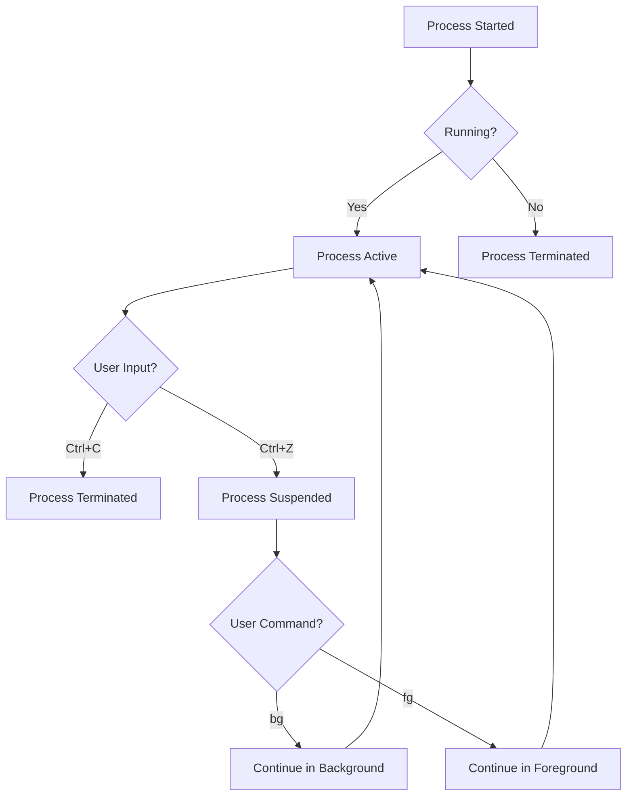
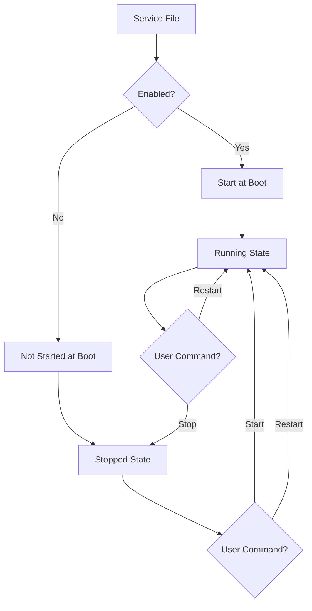

Hey there! Ready to dive into the world of Linux administration? I'm going to walk you through everything you need to know to handle about 85% of your daily Linux admin tasks, plus give you the foundation to explore the rest on your own. Let's get started!

## 1. What is Linux & Why Should You Care?

Linux is an open-source operating system kernel that powers everything from tiny IoT devices to massive supercomputers (and most of the internet!). Unlike Windows or macOS, Linux comes in many "flavors" called distributions.

**Why Linux matters for administration:**

- Free and open-source
- Highly secure and stable
- Extremely flexible and customizable
- Powers most servers and cloud infrastructure
- Great for automation

## 2. Getting Started: Installation & First Steps

### Popular Distributions for Admins

- **Ubuntu Server**: Great for beginners, excellent documentation
- **CentOS/Rocky Linux/Alma Linux**: Enterprise-grade stability
- **Debian**: Super stable, minimal
- **Fedora**: Cutting-edge features

### Installation Options

1. **Bare metal**: Install directly on hardware
2. **Virtual machine**: Use VirtualBox, VMware, etc.
3. **Cloud provider**: AWS, Azure, GCP, DigitalOcean, etc.

For beginners, I recommend starting with Ubuntu Server on a virtual machine:

1. Download VirtualBox from virtualbox.org
2. Download Ubuntu Server ISO from ubuntu.com
3. Create a new VM in VirtualBox with at least 2GB RAM and 20GB disk
4. Mount the ISO and follow the installation prompts

### The Linux File System Structure

```
/
├── bin/    # Essential user binaries
├── boot/   # Boot loader files
├── dev/    # Device files
├── etc/    # System configuration files
├── home/   # User home directories
├── lib/    # Essential shared libraries
├── media/  # Mount point for removable media
├── mnt/    # Temporary mount point
├── opt/    # Optional application software
├── proc/   # Virtual filesystem for processes
├── root/   # Root user's home directory
├── sbin/   # System binaries
├── srv/    # Service data
├── tmp/    # Temporary files
├── usr/    # User utilities and applications
└── var/    # Variable files (logs, etc.)
```

## 3. Essential Command Line Skills

The terminal is your best friend in Linux administration. Here are commands you'll use daily:

### Navigation & File Operations

```bash
pwd                     # Print working directory
ls -la                  # List all files with details
cd /path/to/directory   # Change directory
mkdir -p dir1/dir2      # Create nested directories
cp file1 file2          # Copy files
mv oldname newname      # Move or rename files
rm file                 # Remove a file
rm -rf directory        # Remove directory recursively (be careful!)
touch file              # Create empty file or update timestamp
find /path -name "*.txt" # Find files by name
grep "pattern" file     # Search for text in file
```

### File Viewing & Editing

```bash
cat file                # Display file contents
less file               # View file with pagination
head -n 10 file         # View first 10 lines
tail -n 20 file         # View last 20 lines
tail -f /var/log/syslog # Watch file for new entries
nano file               # Simple text editor
vim file                # Advanced text editor
```

### Piping & Redirection

```bash
command > file          # Redirect output to file (overwrite)
command >> file         # Append output to file
command1 | command2     # Pipe output of command1 to command2
command 2> error.log    # Redirect errors to file
```

## 4. File Permissions & Ownership

Understanding permissions is crucial for security:

```bash
# Format: [type][user][group][others]
# Example: -rwxr-x---

ls -l file              # View file permissions
chmod 755 file          # Set permissions (rwx for owner, rx for others)
chmod u+x file          # Add execute permission for user
chown user:group file   # Change file owner and group
```

Permission numbers explained:

- 4 = read (r)
- 2 = write (w)
- 1 = execute (x)

Common permission sets:

- 755 (rwxr-xr-x): Executable files, directories
- 644 (rw-r--r--): Regular files
- 600 (rw-------): Sensitive files

## 5. User & Group Management

```bash
# User management
sudo adduser username           # Create a new user (interactive)
sudo useradd -m username        # Create user with home directory
sudo userdel -r username        # Delete user and their home directory
sudo passwd username            # Set/change user password

# Group management
sudo groupadd groupname         # Create a new group
sudo usermod -aG groupname user # Add user to a group
sudo gpasswd -d user groupname  # Remove user from group
id username                     # Show user's UID, GID, and groups
```

### Sudo Access

To grant admin privileges:

```bash
sudo usermod -aG sudo username  # On Ubuntu/Debian
sudo usermod -aG wheel username # On CentOS/RHEL/Fedora
```

Or edit the sudoers file (safer with visudo):

```bash
sudo visudo
# Add: username ALL=(ALL) ALL
```

## 6. Process Management

```bash
ps aux                  # List all running processes
top                     # Dynamic process viewer
htop                    # Enhanced dynamic process viewer
kill PID                # Terminate process by ID
kill -9 PID             # Force terminate process
killall process_name    # Kill all processes with name
pgrep process_name      # Find process ID by name
bg                      # Send process to background
fg                      # Bring process to foreground
nohup command &         # Run command immune to hangups
```

Process flow visualization:



## 7. System Monitoring

```bash
free -h                 # Display memory usage
df -h                   # Show disk space
du -sh /path            # Show directory size
lsblk                   # List block devices
iostat                  # I/O statistics
vmstat                  # Virtual memory stats
uptime                  # System uptime and load
w                       # Show who is logged on and what they're doing
```

## 8. Package Management

### Debian/Ubuntu (APT)

```bash
sudo apt update                 # Update package lists
sudo apt upgrade                # Upgrade installed packages
sudo apt install package_name   # Install a package
sudo apt remove package_name    # Remove a package
sudo apt autoremove             # Remove unneeded dependencies
apt search keyword              # Search for packages
dpkg -l                         # List installed packages
```

### CentOS/RHEL/Fedora (DNF/YUM)

```bash
sudo dnf update                 # Update packages
sudo dnf install package_name   # Install a package
sudo dnf remove package_name    # Remove a package
sudo dnf search keyword         # Search for packages
rpm -qa                         # List all installed packages
```

## 9. Service Management with Systemd

Most modern Linux distributions use systemd for managing services:

```bash
sudo systemctl start service_name    # Start a service
sudo systemctl stop service_name     # Stop a service
sudo systemctl restart service_name  # Restart a service
sudo systemctl status service_name   # Check service status
sudo systemctl enable service_name   # Enable at boot
sudo systemctl disable service_name  # Disable at boot
systemctl list-units --type=service  # List running services
journalctl -u service_name           # View service logs
```

Service lifecycle visualization:



## 10. Networking Basics

```bash
ip addr                 # Show IP addresses
ip route                # Show routing table
ping hostname           # Test connectivity
traceroute hostname     # Trace route to host
netstat -tuln           # Show listening ports
ss -tuln                # Modern alternative to netstat
nslookup domain.com     # Query DNS
dig domain.com          # Advanced DNS query

# Configure network interface (temporary)
sudo ip addr add 192.168.1.100/24 dev eth0

# Configure network interface (permanent)
# Edit /etc/netplan/01-netcfg.yaml (Ubuntu) or
# /etc/sysconfig/network-scripts/ifcfg-eth0 (CentOS)
```

### Firewall Management with UFW (Ubuntu)

```bash
sudo ufw status         # Check firewall status
sudo ufw allow 22/tcp   # Allow SSH
sudo ufw enable         # Enable firewall
sudo ufw disable        # Disable firewall
```

### Firewall Management with firewalld (CentOS/RHEL)

```bash
sudo firewall-cmd --state                        # Check status
sudo firewall-cmd --add-service=http --permanent # Allow HTTP
sudo firewall-cmd --add-port=8080/tcp --permanent # Allow specific port
sudo firewall-cmd --reload                       # Apply changes
```

## 11. Log Management

Logs are your best friend for troubleshooting:

```bash
# Common log files
/var/log/syslog         # General system logs (Debian/Ubuntu)
/var/log/messages       # General system logs (CentOS/RHEL)
/var/log/auth.log       # Authentication logs (Debian/Ubuntu)
/var/log/secure         # Authentication logs (CentOS/RHEL)
/var/log/nginx/         # Nginx logs
/var/log/apache2/       # Apache logs
/var/log/mysql/         # MySQL logs

# Log commands
tail -f /var/log/syslog  # Watch logs in real-time
grep "error" /var/log/syslog  # Search for errors
journalctl -f            # Follow systemd journal logs
journalctl -b            # Show logs since last boot
```

## 12. Scheduled Tasks with Cron

Cron is used for scheduling recurring tasks:

```bash
crontab -l              # List current user's cron jobs
crontab -e              # Edit current user's cron jobs
```

Cron format: `minute hour day_of_month month day_of_week command`

Examples:

```bash
# Run daily at 3AM
0 3 * * * /path/to/script.sh

# Run every 15 minutes
*/15 * * * * /path/to/script.sh

# Run first day of every month
0 0 1 * * /path/to/script.sh
```

## 13. Basic Shell Scripting

Shell scripts help automate tasks. Create a file with `.sh` extension:

```bash
#!/bin/bash

# Variables
NAME="Linux Admin"
TODAY=$(date +%Y-%m-%d)

# Output
echo "Hello, $NAME!"
echo "Today is $TODAY"

# Conditionals
if [ -f "/etc/hosts" ]; then
    echo "/etc/hosts exists"
else
    echo "/etc/hosts does not exist"
fi

# Loops
for SERVER in web1 web2 web3; do
    echo "Checking $SERVER..."
    ping -c 1 $SERVER > /dev/null && echo "$SERVER is up" || echo "$SERVER is down"
done

# Functions
check_service() {
    systemctl is-active $1 > /dev/null && echo "$1 is running" || echo "$1 is not running"
}

check_service ssh
check_service nginx
```

To make it executable and run it:

```bash
chmod +x script.sh
./script.sh
```

## 14. Backup Basics

Regular backups are essential:

```bash
# Simple file/directory backup with tar
tar -czvf backup-$(date +%Y%m%d).tar.gz /path/to/backup

# Simple directory sync with rsync
rsync -avz --delete /source/directory/ /destination/directory/

# Remote backup with rsync over SSH
rsync -avz -e ssh /local/directory/ user@remote:/backup/directory/
```

## 15. Security Essentials

### SSH Hardening

Edit `/etc/ssh/sshd_config`:

```
PermitRootLogin no
PasswordAuthentication no
```

Then restart SSH: `sudo systemctl restart sshd`

### Set Up SSH Keys

```bash
# Generate keys on your local machine
ssh-keygen -t ed25519 -C "your_email@example.com"

# Copy public key to server
ssh-copy-id user@server
```

### Keep Your System Updated

```bash
# Ubuntu/Debian
sudo apt update && sudo apt upgrade -y

# CentOS/RHEL
sudo dnf upgrade -y
```

### Check for Listening Services

```bash
sudo ss -tuln
```

Close unnecessary ports with your firewall.

## The Remaining 15%: Your Next Steps

Now that you have the essentials, here's what to explore next:

1. **Advanced Shell Scripting**: Learn more complex scripts with error handling, advanced functions, and parameter processing.

2. **Containers & Virtualization**: Docker, Kubernetes, LXC, KVM, and how to manage virtualized environments.

3. **Configuration Management**: Tools like Ansible, Puppet, or Salt for automated provisioning and configuration.

4. **High Availability & Load Balancing**: Set up clusters, load balancers, and failover systems.

5. **Performance Tuning**: System optimization, benchmarking, and troubleshooting performance issues.

6. **Advanced Security**: Security scanning, intrusion detection, security hardening, SELinux/AppArmor.

7. **Specialized Server Setups**: Web servers (Nginx/Apache), databases (MySQL/PostgreSQL), mail servers, etc.

8. **Monitoring & Alerting Systems**: Set up Prometheus, Grafana, Nagios, or other monitoring solutions.

9. **Disaster Recovery Planning**: More advanced backup solutions, recovery testing, and planning.

10. **Linux Kernel Tuning**: Understand and modify kernel parameters for specific workloads.

11. **Automation & CI/CD Pipelines**: Jenkins, GitHub Actions, and other automation tools.

12. **Cloud Integration**: Managing Linux in AWS, Azure, GCP environments, understanding Infrastructure as Code.

That's your Linux Administration crash course! Start practicing these commands and concepts, and you'll be handling most of your daily tasks with confidence. Remember that Linux administration is learned through practice, so set up a test environment and experiment freely.

Let me know if you have any questions or need help with specific areas as you continue your Linux journey!
