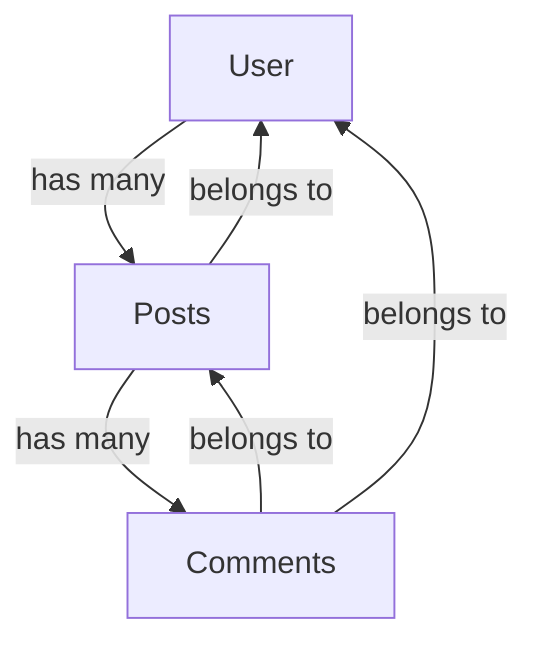

## Introduction to GraphQL

GraphQL is a query language for APIs and a server-side runtime that prioritizes giving clients exactly the data they request. Developed by Facebook in 2012 and released publicly in 2015, GraphQL addresses many limitations of traditional REST APIs by enabling more efficient data fetching and providing a more flexible approach to API design.

### Prerequisites

Before diving into GraphQL, you should have:

- Basic understanding of API concepts
- Familiarity with JSON data format
- Basic JavaScript knowledge (for our examples)
- Node.js installed on your system (v14+ recommended)

## Key Differences from REST

The fundamental difference between GraphQL and REST lies in how data is requested and delivered:

| **Feature**        | **REST API**                                               | **GraphQL API**                      |
| ------------------ | ---------------------------------------------------------- | ------------------------------------ |
| **Endpoints**      | Multiple Endpoints (e.g., `/users`, `/posts`, `/comments`) | Single Endpoint (e.g., `/graphql`)   |
| **Data Structure** | Fixed Data Structure                                       | Custom Data Structure Based on Query |
| **Data Retrieval** | Client receives all available data                         | Client receives only requested data  |

### REST API Limitations:

1. **Over-fetching**: Getting more data than needed, which wastes bandwidth and reduces application performance
2. **Under-fetching**: Not getting enough data, requiring multiple requests to different endpoints
3. **Multiple endpoints**: Maintaining numerous endpoints for different resources increases development complexity
4. **Fixed responses**: Cannot customize response structure based on specific client needs

### GraphQL Advantages:

1. **Single endpoint**: All data is accessible through one endpoint, simplifying API architecture
2. **Precise data fetching**: Request exactly what you need, nothing more, improving efficiency
3. **Strongly typed**: Schema defines available data and operations, providing better developer experience
4. **Introspection**: API can be queried for its own capabilities, enabling powerful tooling

## Core Concepts

### Schema and Types

The schema is the foundation of any GraphQL API. It defines the complete set of possible data you can query and serves as a contract between the client and server.

A schema includes:

- Available data types
- Relationships between types
- Operations clients can perform

Here's a basic schema example:

```graphql
# Define a User type
type User {
  id: ID! # The ! means non-nullable
  name: String!
  email: String
  posts: [Post!] # A user has many posts
}

# Define a Post type
type Post {
  id: ID!
  title: String!
  content: String!
  author: User! # A post belongs to a user
}

# Root Query type defines entry points
type Query {
  user(id: ID!): User
  allUsers: [User!]!
}
```

This schema establishes a clear relationship between users and posts, making it possible to navigate between these entities.

### GraphQL Operations

GraphQL supports three main operation types, each serving a specific purpose in your API.

#### 1. Queries (Read)

Queries allow you to request specific fields from your data:

```graphql
query {
  user(id: "1") {
    name
    email
    posts {
      title
    }
  }
}
```

The response matches the query structure exactly:

```json
{
  "data": {
    "user": {
      "name": "John Doe",
      "email": "john@example.com",
      "posts": [
        { "title": "Introduction to GraphQL" },
        { "title": "Why I Love Programming" }
      ]
    }
  }
}
```

This predictable response pattern makes working with the data much simpler for client applications.

#### 2. Mutations (Create, Update, Delete)

Mutations allow you to modify server-side data:

```graphql
mutation {
  createPost(
    title: "GraphQL Basics"
    content: "This is a post about GraphQL"
    authorId: "1"
  ) {
    id
    title
    author {
      name
    }
  }
}
```

Response:

```json
{
  "data": {
    "createPost": {
      "id": "123",
      "title": "GraphQL Basics",
      "author": {
        "name": "John Doe"
      }
    }
  }
}
```

Just like with queries, you can specify which fields you want to receive back after the mutation is performed.

#### 3. Subscriptions (Real-time Updates)

Subscriptions enable real-time data with WebSockets, which we'll touch on briefly in the advanced topics section.

### Query Variables

Rather than hardcoding values in your queries, variables provide a more flexible approach:

```graphql
query GetUser($id: ID!) {
  user(id: $id) {
    name
    email
  }
}
```

With variables provided separately:

```json
{
  "id": "1"
}
```

This approach improves reusability and makes it easier to work with dynamic values.

## Setting Up a GraphQL Server

Now that we understand the core concepts, let's implement a basic GraphQL server using Apollo Server, a popular GraphQL server implementation.

### Installation

First, create a new Node.js project:

```bash
mkdir graphql-server
cd graphql-server
npm init -y
npm install apollo-server graphql
```

### Creating Your First Server

Create an `index.js` file with the following code:

```javascript
const { ApolloServer, gql } = require('apollo-server');

// Define your schema using the GraphQL Schema Definition Language
const typeDefs = gql`
  type Book {
    id: ID!
    title: String!
    author: String!
  }

  type Query {
    books: [Book]
    book(id: ID!): Book
  }
`;

// Sample data (in a real app, this would come from a database)
const books = [
  { id: '1', title: 'The Great Gatsby', author: 'F. Scott Fitzgerald' },
  { id: '2', title: '1984', author: 'George Orwell' },
];

// Define resolvers - functions that return data for each field
const resolvers = {
  Query: {
    books: () => books, // Return all books
    book: (_, { id }) => books.find((book) => book.id === id), // Find book by ID
  },
};

// Create and start the server
const server = new ApolloServer({
  typeDefs, // Schema definition
  resolvers, // Functions to resolve data
});

// Launch the server
server.listen().then(({ url }) => {
  console.log(`🚀 Server ready at ${url}`);
});
```

Run your server with:

```bash
node index.js
```

Your server will be running at `http://localhost:4000`, with Apollo's built-in GraphQL playground for testing queries. This interactive environment allows you to experiment with queries and explore your API.

### Understanding Resolvers

Resolvers are functions that determine how to fetch the data for each field in your schema. They're the bridge between the schema definition and your actual data sources.

Resolver functions follow this structure:

```javascript
fieldName: (parent, args, context, info) => {
  // Return data for this field
};
```

Each parameter serves a specific purpose:

- `parent`: The result of the parent resolver (useful for nested fields)
- `args`: Arguments provided to the field in the query
- `context`: Shared context object (useful for authentication, database connections)
- `info`: Information about the execution state of the query

## Adding Mutations

Let's extend our example to support adding new books:

```javascript
const { ApolloServer, gql } = require('apollo-server');

const typeDefs = gql`
  type Book {
    id: ID!
    title: String!
    author: String!
  }

  type Query {
    books: [Book]
    book(id: ID!): Book
  }

  type Mutation {
    addBook(title: String!, author: String!): Book
  }
`;

// Sample data
let books = [
  { id: '1', title: 'The Great Gatsby', author: 'F. Scott Fitzgerald' },
  { id: '2', title: '1984', author: 'George Orwell' },
];

let nextId = 3; // For generating new IDs

const resolvers = {
  Query: {
    books: () => books,
    book: (_, { id }) => books.find((book) => book.id === id),
  },
  Mutation: {
    addBook: (_, { title, author }) => {
      const newBook = {
        id: String(nextId++),
        title,
        author,
      };
      books.push(newBook); // Add to our "database"
      return newBook; // Return the created book
    },
  },
};

const server = new ApolloServer({ typeDefs, resolvers });

server.listen().then(({ url }) => {
  console.log(`🚀 Server ready at ${url}`);
});
```

This extended example demonstrates how to implement a basic mutation that adds a new book to our collection.

## Client-Side GraphQL with Apollo Client

Now that we have a GraphQL server, let's look at how to consume it from a client application. Apollo Client is a comprehensive state management library that makes it easy to fetch, cache, and modify application data with GraphQL.

### Installation (React Example)

```bash
npx create-react-app graphql-client
cd graphql-client
npm install @apollo/client graphql
```

### Setting Up Apollo Client

Create or modify your `src/index.js`:

```javascript
import React from 'react';
import ReactDOM from 'react-dom';
import './index.css';
import App from './App';
import { ApolloClient, InMemoryCache, ApolloProvider } from '@apollo/client';

// Create an Apollo Client instance
const client = new ApolloClient({
  uri: 'http://localhost:4000', // Your GraphQL server endpoint
  cache: new InMemoryCache(), // Local cache for performance
});

// Wrap your app with ApolloProvider to access client anywhere
ReactDOM.render(
  <React.StrictMode>
    <ApolloProvider client={client}>
      <App />
    </ApolloProvider>
  </React.StrictMode>,
  document.getElementById('root'),
);
```

The `ApolloProvider` component makes the Apollo Client instance available throughout your React application, similar to how React's Context API works.

### Querying Data

In your component file (e.g., `src/App.js`):

```javascript
import React from 'react';
import { useQuery, gql } from '@apollo/client';

// Define your query
const GET_BOOKS = gql`
  query GetBooks {
    books {
      id
      title
      author
    }
  }
`;

function Books() {
  // Execute the query
  const { loading, error, data } = useQuery(GET_BOOKS);

  // Handle loading state
  if (loading) return <p>Loading...</p>;

  // Handle errors
  if (error) return <p>Error: {error.message}</p>;

  // Render the data
  return (
    <div>
      <h2>Books</h2>
      <ul>
        {data.books.map((book) => (
          <li key={book.id}>
            <strong>{book.title}</strong> by {book.author}
          </li>
        ))}
      </ul>
    </div>
  );
}

export default Books;
```

The `useQuery` hook is the primary API for executing queries in Apollo Client. It handles the entire query lifecycle, including loading states, errors, and caching.

### Adding Mutations in the Client

```javascript
import React, { useState } from 'react';
import { useMutation, gql } from '@apollo/client';

// Define your mutation
const ADD_BOOK = gql`
  mutation AddBook($title: String!, $author: String!) {
    addBook(title: $title, author: $author) {
      id
      title
      author
    }
  }
`;

function AddBookForm() {
  const [title, setTitle] = useState('');
  const [author, setAuthor] = useState('');

  // Set up the mutation
  const [addBook, { data, loading, error }] = useMutation(ADD_BOOK, {
    // Update cache to include the new book
    update(cache, { data: { addBook } }) {
      cache.modify({
        fields: {
          books(existingBooks = []) {
            const newBookRef = cache.writeFragment({
              data: addBook,
              fragment: gql`
                fragment NewBook on Book {
                  id
                  title
                  author
                }
              `,
            });
            return [...existingBooks, newBookRef];
          },
        },
      });
    },
  });

  const handleSubmit = (e) => {
    e.preventDefault();
    // Execute the mutation with variables
    addBook({ variables: { title, author } });
    setTitle('');
    setAuthor('');
  };

  return (
    <div>
      <h3>Add a Book</h3>
      {error && <p>Error: {error.message}</p>}
      {data && <p>Added book: {data.addBook.title}</p>}

      <form onSubmit={handleSubmit}>
        <input
          value={title}
          onChange={(e) => setTitle(e.target.value)}
          placeholder="Book title"
          required
        />
        <input
          value={author}
          onChange={(e) => setAuthor(e.target.value)}
          placeholder="Author name"
          required
        />
        <button type="submit" disabled={loading}>
          {loading ? 'Adding...' : 'Add Book'}
        </button>
      </form>
    </div>
  );
}
```

The `useMutation` hook provides a function to execute the mutation and returns state information about the mutation's execution. The cache update function ensures that our UI stays in sync with the server data.

## Real-World Applications: Data Relationships

One of GraphQL's strengths is handling relationships between data types. In real-world applications, these relationships are crucial for modeling complex domains.



Let's build a more comprehensive schema with these relationships:

```javascript
const { ApolloServer, gql } = require('apollo-server');

const typeDefs = gql`
  type User {
    id: ID!
    name: String!
    posts: [Post!]!
  }

  type Post {
    id: ID!
    title: String!
    content: String!
    author: User!
    comments: [Comment!]!
  }

  type Comment {
    id: ID!
    text: String!
    post: Post!
    author: User!
  }

  type Query {
    user(id: ID!): User
    users: [User!]!
    post(id: ID!): Post
    posts: [Post!]!
  }
`;

// Sample data
const users = [
  { id: '1', name: 'John Doe' },
  { id: '2', name: 'Jane Smith' },
];

const posts = [
  {
    id: '1',
    title: 'GraphQL Basics',
    content: 'This is about GraphQL',
    authorId: '1',
  },
  { id: '2', title: 'React Hooks', content: 'All about hooks', authorId: '2' },
];

const comments = [
  { id: '1', text: 'Great article!', postId: '1', authorId: '2' },
  { id: '2', text: 'Thanks for sharing', postId: '2', authorId: '1' },
];

// Resolvers with relationships
const resolvers = {
  Query: {
    user: (_, { id }) => users.find((user) => user.id === id),
    users: () => users,
    post: (_, { id }) => posts.find((post) => post.id === id),
    posts: () => posts,
  },
  // Resolve fields for User type
  User: {
    posts: (parent) => posts.filter((post) => post.authorId === parent.id),
  },
  // Resolve fields for Post type
  Post: {
    author: (parent) => users.find((user) => user.id === parent.authorId),
    comments: (parent) =>
      comments.filter((comment) => comment.postId === parent.id),
  },
  // Resolve fields for Comment type
  Comment: {
    post: (parent) => posts.find((post) => post.id === parent.postId),
    author: (parent) => users.find((user) => user.id === parent.authorId),
  },
};

const server = new ApolloServer({ typeDefs, resolvers });

server.listen().then(({ url }) => {
  console.log(`🚀 Server ready at ${url}`);
});
```

This example demonstrates how to use resolver functions to navigate relationships between different types. When a client requests nested fields, GraphQL executes the appropriate resolvers to fulfill the complete request.

## Authentication and Context

In real-world applications, many operations need to be secured. GraphQL provides a powerful mechanism for this through the context object, which is passed to all resolvers.

The context object is useful for:

- Authentication information
- Database connections
- Logging
- Caching

Let's add basic authentication to our API:

```javascript
const { ApolloServer, gql, AuthenticationError } = require('apollo-server');

// [... previous typeDefs and data ...]

// Add to typeDefs:
const typeDefs = gql`
  # ... previous types

  type AuthPayload {
    token: String!
    user: User!
  }

  type Mutation {
    login(email: String!, password: String!): AuthPayload
    createPost(title: String!, content: String!): Post
  }
`;

// Mock user with credentials
const users = [
  {
    id: '1',
    name: 'John Doe',
    email: 'john@example.com',
    password: 'password123', // In a real app, this would be hashed!
  },
];

// Mock token generation
function generateToken(user) {
  return `token-${user.id}-${Date.now()}`;
}

// Mock token verification
function getUserFromToken(token) {
  if (!token) return null;
  const userId = token.split('-')[1];
  return users.find((u) => u.id === userId);
}

const resolvers = {
  // ... previous resolvers

  Mutation: {
    login: (_, { email, password }) => {
      // Find user by email
      const user = users.find((u) => u.email === email);

      // Check if user exists and password matches
      if (!user || user.password !== password) {
        throw new AuthenticationError('Invalid credentials');
      }

      // Generate token
      const token = generateToken(user);

      return {
        token,
        user,
      };
    },
    createPost: (_, { title, content }, context) => {
      // Check if user is authenticated
      if (!context.user) {
        throw new AuthenticationError('You must be logged in');
      }

      // Create a new post
      const newPost = {
        id: String(posts.length + 1),
        title,
        content,
        authorId: context.user.id,
      };

      posts.push(newPost);
      return newPost;
    },
  },
};

// Set up server with context
const server = new ApolloServer({
  typeDefs,
  resolvers,
  context: ({ req }) => {
    // Get token from request headers
    const token = req.headers.authorization || '';

    // Validate token and get user
    const user = getUserFromToken(token);

    // Return context object with user (will be null if not authenticated)
    return { user };
  },
});

server.listen().then(({ url }) => {
  console.log(`🚀 Server ready at ${url}`);
});
```

This example shows how to:

1. Create a login mutation that returns a token
2. Verify that token in the context function
3. Use the authenticated user in resolvers to protect operations

## Best Practices

As your GraphQL API grows, following these best practices will help maintain code quality and performance.

### 1. Schema Organization

For larger applications, modularize your schema to keep it manageable:

```javascript
// userSchema.js
const { gql } = require('apollo-server');

const userTypeDefs = gql`
  type User {
    id: ID!
    name: String!
    email: String!
  }

  extend type Query {
    user(id: ID!): User
    users: [User!]!
  }
`;

// postSchema.js
const { gql } = require('apollo-server');

const postTypeDefs = gql`
  type Post {
    id: ID!
    title: String!
    author: User!
  }

  extend type Query {
    post(id: ID!): Post
    posts: [Post!]!
  }
`;

// Merge schemas with a library like @graphql-tools/merge
// Then use the merged schema in your Apollo Server
```

This approach allows teams to work on different parts of the schema independently and makes the codebase more maintainable.

### 2. Error Handling

GraphQL has two types of errors:

1. GraphQL validation errors (syntax, schema)
2. Field-level errors (resolver errors)

Here's an example of custom error handling:

```javascript
const { ApolloServer, gql, ApolloError } = require('apollo-server');

// [...typeDefs and resolvers...]

const resolvers = {
  Query: {
    user: async (_, { id }) => {
      try {
        // Attempt to fetch user
        const user = users.find((u) => u.id === id);

        if (!user) {
          throw new UserNotFoundError(id);
        }

        return user;
      } catch (error) {
        // Custom error with metadata
        throw new ApolloError('Failed to fetch user', 'USER_FETCH_ERROR', {
          id,
        });
      }
    },
  },
};

// Custom error class
class UserNotFoundError extends ApolloError {
  constructor(userId) {
    super(`User with ID ${userId} not found`, 'USER_NOT_FOUND');

    Object.defineProperty(this, 'name', { value: 'UserNotFoundError' });
  }
}

const server = new ApolloServer({
  typeDefs,
  resolvers,
  formatError: (err) => {
    // Log error to your service
    console.error(err);

    // Return custom error to client
    return {
      message: err.message,
      code: err.extensions?.code || 'INTERNAL_SERVER_ERROR',
      path: err.path,
    };
  },
});
```

Proper error handling improves the developer experience by providing clear, actionable error messages.

### 3. Batching and Caching

To avoid the N+1 query problem (where resolvers make too many database queries), use DataLoader:

```bash
npm install dataloader
```

```javascript
const DataLoader = require('dataloader');

// In your server context setup
const server = new ApolloServer({
  typeDefs,
  resolvers,
  context: () => {
    // Create new loaders for each request
    const userLoader = new DataLoader(async (ids) => {
      console.log('Batch loading users:', ids);
      // In a real app, this would be a single database query
      const users = await fetchUsersById(ids);
      return ids.map((id) => users.find((user) => user.id === id));
    });

    return {
      userLoader,
      // other context fields
    };
  },
});

// In your resolvers
const resolvers = {
  Post: {
    author: async (post, _, context) => {
      // Uses batching to load many authors in one query
      return context.userLoader.load(post.authorId);
    },
  },
};
```

DataLoader batches and caches database calls, significantly improving performance for nested queries.

## The Remaining 15%: Advanced Topics

Now that you understand the core 85% of GraphQL, here are the advanced topics you can explore on your own:

### 1. GraphQL Subscriptions

Real-time data updates using WebSockets enable live notifications, chat applications, and more. Implementation requires:

- Server-side setup with PubSub
- Client-side implementation
- Event filtering patterns

### 2. Schema Stitching and Federation

As your application grows, you might need to combine multiple GraphQL APIs:

- Schema stitching to merge separate schemas
- Apollo Federation for distributed architecture
- Remote schema execution

### 3. Advanced Performance Optimization

Techniques for scaling GraphQL to handle high loads:

- Persisted queries
- Automatic persisted queries (APQ)
- Query complexity analysis
- Rate limiting based on operation complexity

### 4. Code Generation Tools

Automating type generation improves development velocity:

- GraphQL Code Generator
- Type-safe operations with TypeScript
- Schema validation tools

### 5. GraphQL with Various Databases

Different databases require specific implementation patterns:

- SQL databases with Prisma or Sequelize
- MongoDB with Mongoose
- Redis for caching resolvers

### 6. Client-Side State Management

Integrating GraphQL with client-state management:

- Apollo Client local state
- React Query with GraphQL
- Code-sharing between client and server

### 7. File Uploads

Handling files in GraphQL requires special consideration:

- multipart/form-data
- File upload mutations
- S3 or cloud storage integration

### 8. Production Deployment Considerations

Running GraphQL in production successfully involves:

- Monitoring
- Logging
- Security best practices
- CDN integration

## Conclusion

This crash course has covered the core 85% of GraphQL fundamentals: schema definition, operations, resolvers, client integration, and best practices. With this solid foundation, you're well-equipped to start building GraphQL APIs and client applications that deliver efficient, flexible data access.

As your applications grow more complex, you can gradually explore the advanced 15% topics to enhance your implementations. The modular nature of GraphQL allows you to adopt these advanced patterns as your specific needs evolve.

Remember that GraphQL isn't a replacement for REST in all scenarios—it's a powerful alternative that gives clients more control over the data they receive. By understanding when and how to use GraphQL effectively, you'll have a valuable tool in your development arsenal.
