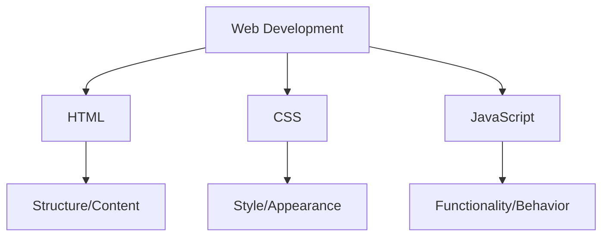
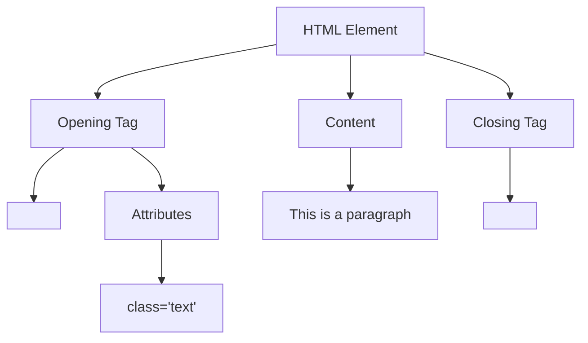
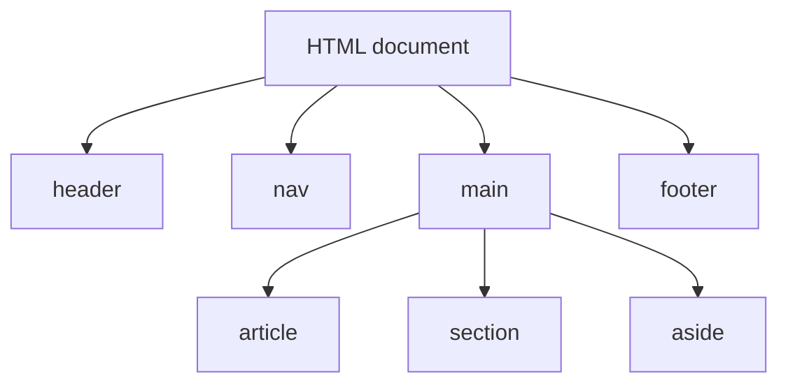

## Introduction to HTML

HTML (HyperText Markup Language) forms the foundation of every website on the internet. It serves as a markup language that structures content on the web—not a programming language, but rather a systematic way to describe the organization of web documents using elements and tags. Understanding HTML is essential for anyone interested in web development or design.

### What HTML Does in Web Development



In the web development ecosystem, HTML provides the structure and content, CSS adds style and visual appeal, and JavaScript introduces functionality and interactive behavior. These three technologies work in concert to create the modern web experiences we interact with daily.

## Getting Started with HTML

Before diving into HTML coding, it's important to establish your working environment with the right tools and understanding.

### Prerequisites

To begin your HTML journey, you need only a few basic tools: fundamental computer skills, a text editor for writing code, and a web browser to view your results. No specialized hardware or expensive software is required, making HTML an accessible entry point to web development.

### Setting Up Your Development Environment

Creating HTML requires just two essential components:

1. A text editor where you'll write your code (popular options include VS Code, Sublime Text, or even basic Notepad++)
2. A web browser to display and test your HTML pages (such as Chrome, Firefox, or Safari)

#### Installing Visual Studio Code (VS Code)

VS Code offers an excellent environment for HTML development with helpful features for beginners and professionals alike:

1. Download VS Code from https://code.visualstudio.com/
2. Install the program by following the installation wizard
3. Enhance your experience by adding the "Live Server" extension, which provides real-time preview capabilities:
   - Open VS Code
   - Access the Extensions marketplace (press Ctrl+Shift+X)
   - Search for "Live Server"
   - Click Install to add this functionality

### Creating Your First HTML File

With your environment ready, you can create your first HTML document by following these straightforward steps:

1. Create a new file with a `.html` extension (conventionally named `index.html` for home pages)
2. Write your HTML code using the structure outlined in the next section
3. Save the file to your desired location
4. Open it in your browser to see the results (or use Live Server in VS Code for automatic refreshing)

## HTML Document Structure

Every HTML document follows a standard structure that provides the foundation for your content. This consistent framework ensures browsers correctly interpret your code.

```html
<!DOCTYPE html>
<html lang="en">
  <head>
    <meta charset="UTF-8" />
    <meta name="viewport" content="width=device-width, initial-scale=1.0" />
    <title>Page Title</title>
  </head>
  <body>
    <!-- Content goes here -->
  </body>
</html>
```

This structure includes several essential components:

- The `<!DOCTYPE html>` declaration informs browsers about the HTML version
- The `<html>` element serves as the root container for all content
- The `<head>` section contains meta-information about the document that isn't displayed
- The `<title>` element sets the page title shown in browser tabs and bookmarks
- The `<body>` element contains all visible content that users interact with

### Understanding HTML Elements

HTML elements form the building blocks of every web page, each serving a specific purpose in structuring your content.



This structure demonstrates how HTML elements combine tags and content to create meaningful units on your page. The opening tag can also contain attributes that provide additional information or functionality.

## Essential HTML Elements

With the fundamental structure established, let's explore the core HTML elements you'll use most frequently when creating web content.

### Text Elements

Text elements provide the foundation for communicating information on your web pages, allowing you to structure content in a meaningful hierarchy.

#### Headings

HTML offers six levels of headings to establish a clear content hierarchy:

```html
<h1>Main Heading</h1>
<h2>Subheading</h2>
<h3>Section heading</h3>
<h4>Sub-section heading</h4>
<h5>Minor heading</h5>
<h6>Smallest heading</h6>
```

These headings should be used hierarchically to create a logical document structure, rather than for styling purposes. Proper heading structure improves accessibility and search engine optimization.

#### Paragraphs

Paragraphs represent the basic blocks of text content:

```html
<p>
  This is a paragraph of text. Paragraphs are block-level elements that
  automatically add space before and after the content.
</p>
```

Paragraphs provide natural spacing between content blocks, helping to organize information in a readable format.

#### Text Formatting

HTML allows you to emphasize or differentiate text in various ways:

```html
<strong>Bold text</strong> or <b>Bold text</b> <em>Italic text</em> or
<i>Italic text</i>
<mark>Highlighted text</mark>
<del>Deleted text</del>
<ins>Inserted text</ins>
<sub>Subscript</sub> and <sup>Superscript</sup>
```

These formatting elements help convey meaning and emphasis within your content, enhancing readability and information hierarchy.

### Lists

Lists organize related items in a structured format, making information more digestible for readers.

#### Unordered Lists

Unordered lists present items with bullet points, ideal for collections without a specific sequence:

```html
<ul>
  <li>Item 1</li>
  <li>Item 2</li>
  <li>Item 3</li>
</ul>
```

#### Ordered Lists

Ordered lists display items with sequential numbering, perfect for step-by-step instructions or ranked information:

```html
<ol>
  <li>First item</li>
  <li>Second item</li>
  <li>Third item</li>
</ol>
```

Both list types can be nested within each other to create more complex information hierarchies.

### Links

Links connect pages and resources together, forming the foundation of web navigation. They are created using the anchor (`<a>`) element:

```html
<a href="https://example.com">Visit Example</a>
<a href="about.html">About Us</a>
<a href="#section-id">Jump to Section</a>
<a href="mailto:email@example.com">Email Us</a>
```

The `href` attribute specifies the destination URL or resource location. Links can connect to external websites, other pages within your site, sections within the current page, or even initiate actions like sending emails.

### Images

Images enhance content by providing visual information. They are implemented using the self-closing `` tag:

```html

```

Several key attributes control how images appear:

- `src`: Specifies the path to the image file
- `alt`: Provides alternative text for accessibility and cases where images don't load
- `width`/`height`: Define dimensions in pixels to maintain layout integrity

Using appropriate and optimized images improves both the visual appeal and user experience of your website.

### Tables

Tables organize information into rows and columns, making complex data more comprehensible:

```html
<table>
  <thead>
    <tr>
      <th>Name</th>
      <th>Age</th>
      <th>Country</th>
    </tr>
  </thead>
  <tbody>
    <tr>
      <td>John</td>
      <td>25</td>
      <td>USA</td>
    </tr>
    <tr>
      <td>Emma</td>
      <td>28</td>
      <td>UK</td>
    </tr>
  </tbody>
</table>
```

Tables include several structural elements:

- `<table>`: The container for the entire table
- `<thead>`: Groups header content
- `<tbody>`: Contains the main data rows
- `<tr>`: Defines a table row
- `<th>`: Creates header cells
- `<td>`: Defines data cells

While tables excel at presenting tabular data, they should not be used for page layout purposes.

### Forms and Input Elements

Forms enable user interaction by collecting input data. They contain various controls for different types of information:

```html
<form action="/submit-form" method="post">
  <div>
    <label for="name">Name:</label>
    <input type="text" id="name" name="name" required />
  </div>

  <div>
    <label for="email">Email:</label>
    <input type="email" id="email" name="email" required />
  </div>

  <div>
    <label for="password">Password:</label>
    <input type="password" id="password" name="password" required />
  </div>

  <div>
    <p>Gender:</p>
    <input type="radio" id="male" name="gender" value="male" />
    <label for="male">Male</label>

    <input type="radio" id="female" name="gender" value="female" />
    <label for="female">Female</label>
  </div>

  <div>
    <input type="checkbox" id="newsletter" name="newsletter" />
    <label for="newsletter">Subscribe to newsletter</label>
  </div>

  <div>
    <label for="country">Country:</label>
    <select id="country" name="country">
      <option value="usa">USA</option>
      <option value="uk">UK</option>
      <option value="canada">Canada</option>
    </select>
  </div>

  <div>
    <label for="message">Message:</label>
    <textarea id="message" name="message" rows="4" cols="30"></textarea>
  </div>

  <button type="submit">Submit</button>
</form>
```

Form elements include a variety of input types to suit different data requirements:

- text: Standard text entry
- email: Formats and validates email addresses
- password: Masks input for security
- radio: Enables selection from mutually exclusive options
- checkbox: Allows multiple selections
- select: Creates dropdown menus
- textarea: Provides multi-line text input
- file: Enables file uploads
- submit: Triggers form submission

Properly designed forms with clear labels and appropriate input types improve user experience and data collection.

## HTML5 Semantic Elements

HTML5 introduced semantic elements that explicitly describe their meaning to browsers, search engines, and developers. These elements create a more structured and meaningful document outline:



This structure represents a typical semantic organization of content, where each element serves a specific purpose:

```html
<header>
  <h1>Website Title</h1>
  <p>Website subtitle or tagline</p>
</header>

<nav>
  <ul>
    <li><a href="#">Home</a></li>
    <li><a href="#">About</a></li>
    <li><a href="#">Contact</a></li>
  </ul>
</nav>

<main>
  <article>
    <h2>Article Title</h2>
    <p>Article content...</p>
  </article>

  <section>
    <h2>Section Title</h2>
    <p>Section content...</p>
  </section>

  <aside>
    <h3>Related Information</h3>
    <p>Sidebar content...</p>
  </aside>
</main>

<footer>&copy; 2025 My Website</footer>
```

Using semantic elements provides numerous benefits:

- Improves accessibility for users with screen readers
- Enhances search engine optimization
- Creates clearer, more maintainable code
- Provides better structure for styling with CSS

## HTML Attributes

Attributes customize and extend HTML elements, providing additional information or functionality. They always appear in the opening tag and typically follow a name/value pair format.

### Global Attributes

Some attributes can be applied to almost any HTML element:

- `id`: Creates a unique identifier for targeting with CSS or JavaScript
- `class`: Assigns one or more classification names for styling or selection
- `style`: Applies inline CSS styling directly to elements
- `title`: Provides additional information shown as a tooltip on hover
- `lang`: Specifies the language of the element's content
- `data-*`: Creates custom data attributes for storing information

### Element-Specific Attributes

Many elements have specialized attributes that control their specific functionality:

- Images: `src`, `alt`, `width`, `height`
- Links: `href`, `target`, `rel`
- Forms: `action`, `method`, `enctype`
- Inputs: `type`, `name`, `value`, `placeholder`, `required`

Using appropriate attributes enhances both the functionality and accessibility of your HTML elements.

## HTML Best Practices

Following established best practices ensures your HTML is clean, maintainable, and effective.

### Proper Indentation and Organization

Consistent indentation makes your code more readable and maintainable:

```html
<body>
  <header>
    <h1>Title</h1>
  </header>
  <main>
    <p>This is properly indented content that makes the code easy to read.</p>
  </main>
</body>
```

This structured approach helps identify logical sections and nested relationships at a glance.

### Comments

Comments provide explanatory notes within your code that aren't displayed in the browser:

```html
<!-- This is a comment in HTML. It won't be displayed in the browser. -->
```

Comments help document complex sections, temporarily disable code, or provide guidance for future maintenance.

### Accessibility

Accessibility ensures your website is usable by people with diverse abilities:

- Use semantic elements to provide structural meaning
- Add alternative text to images for screen readers
- Ensure forms have properly associated labels
- Maintain a logical heading hierarchy
- Verify sufficient color contrast for readability

These practices make your content accessible to a wider audience and often improve overall usability.

### Validation

Regular validation helps identify and correct errors in your HTML:

Always validate your HTML using tools like the [W3C Markup Validation Service](https://validator.w3.org/) to ensure standard compliance and catch potential issues before they affect users.

## Complete Example

The following example incorporates many of the elements covered in this crash course to demonstrate how they work together in a complete webpage:

```html
<!DOCTYPE html>
<html lang="en">
  <head>
    <meta charset="UTF-8" />
    <meta name="viewport" content="width=device-width, initial-scale=1.0" />
    <title>My First Website</title>
    <style>
      /* Basic CSS styling */
      body {
        font-family: Arial, sans-serif;
        line-height: 1.6;
        margin: 0;
        padding: 20px;
      }
      header,
      footer {
        background-color: #f4f4f4;
        padding: 20px;
        text-align: center;
      }
      nav {
        background-color: #333;
        color: white;
        padding: 10px;
      }
      nav ul {
        list-style: none;
        padding: 0;
        display: flex;
        justify-content: center;
      }
      nav li {
        margin: 0 10px;
      }
      nav a {
        color: white;
        text-decoration: none;
      }
      main {
        padding: 20px;
      }
      .container {
        max-width: 800px;
        margin: 0 auto;
      }
      article,
      section,
      aside {
        margin-bottom: 20px;
        padding: 15px;
        border: 1px solid #ddd;
      }
      table {
        width: 100%;
        border-collapse: collapse;
      }
      table,
      th,
      td {
        border: 1px solid #ddd;
        padding: 8px;
      }
      th {
        background-color: #f4f4f4;
      }
      form div {
        margin-bottom: 10px;
      }
    </style>
  </head>
  <body>
    <header>
      <h1>My Website</h1>
      <p>Welcome to my first HTML website</p>
    </header>

    <nav>
      <ul>
        <li><a href="#">Home</a></li>
        <li><a href="#">About</a></li>
        <li><a href="#">Services</a></li>
        <li><a href="#">Contact</a></li>
      </ul>
    </nav>

    <main class="container">
      <article>
        <h2>Home</h2>
        <p>
          This is the homepage content. Welcome to my website where you can
          learn about HTML.
        </p>
        
      </article>

      <section>
        <h2>About Us</h2>
        <p>We are a company specializing in web development and design.</p>

        <h3>Our Skills:</h3>
        <ul>
          <li>HTML5</li>
          <li>CSS3</li>
          <li>JavaScript</li>
          <li>Responsive Design</li>
        </ul>
      </section>

      <section>
        <h2>Our Services</h2>

        <table>
          <thead>
            <tr>
              <th>Service</th>
              <th>Description</th>
              <th>Price</th>
            </tr>
          </thead>
          <tbody>
            <tr>
              <td>Web Design</td>
              <td>Custom website design</td>
              <td>$500</td>
            </tr>
            <tr>
              <td>Development</td>
              <td>Front-end and back-end development</td>
              <td>$1000</td>
            </tr>
            <tr>
              <td>SEO</td>
              <td>Search engine optimization</td>
              <td>$300</td>
            </tr>
          </tbody>
        </table>
      </section>

      <section>
        <h2>Contact Us</h2>

        <form action="#" method="post">
          <div>
            <label for="name">Name:</label>
            <input type="text" id="name" name="name" required />
          </div>

          <div>
            <label for="email">Email:</label>
            <input type="email" id="email" name="email" required />
          </div>

          <div>
            <label for="subject">Subject:</label>
            <select id="subject" name="subject">
              <option value="general">General Inquiry</option>
              <option value="support">Support</option>
              <option value="feedback">Feedback</option>
            </select>
          </div>

          <div>
            <label for="message">Message:</label>
            <textarea id="message" name="message" rows="4" cols="30"></textarea>
          </div>

          <div>
            <button type="submit">Send Message</button>
          </div>
        </form>
      </section>
    </main>

    <footer>&copy; 2025 My Website. All rights reserved.</footer>
  </body>
</html>
```

This example demonstrates how various HTML elements work together to create a complete, functional webpage with structure, content, and interactive elements.

## The 15% You Can Explore on Your Own

Now that you have established a solid foundation in HTML, you can begin exploring the more advanced features that comprise the remaining 15% of HTML knowledge. These areas represent specialized functionality that you can investigate as your skills and needs evolve.

### Advanced HTML Features

The web platform continues to evolve with powerful capabilities that extend beyond basic content structuring:

1. **Canvas and SVG graphics** enable the creation of dynamic graphics and animations directly within web pages, offering alternatives to traditional image formats.

2. **Web Components** provide a system for creating custom, reusable HTML elements with encapsulated functionality, allowing for more modular and maintainable code.

3. **Microdata & Schema.org** markup enhances your content with structured data that search engines can interpret more effectively, potentially improving visibility in search results.

4. **Progressive Web Apps** combine the best features of websites and native applications, offering offline capabilities, push notifications, and home screen installation.

5. **Iframe and embedding** techniques allow you to incorporate external content from other sources, such as videos, maps, or social media feeds.

### Advanced Forms and Inputs

Form functionality can be extended far beyond the basics to create more sophisticated user interactions:

1. **Complex validation patterns** using regular expressions and the Constraint Validation API ensure that user input meets specific formatting requirements before submission.

2. **Custom form controls** can be developed for specialized input needs that standard HTML controls don't address adequately.

3. **File uploads with preview** functionality enhances the user experience by showing images or documents before they're submitted to the server.

### Advanced APIs and Integration

Modern web development incorporates numerous APIs that extend HTML's capabilities:

1. **Geolocation API** accesses user location information (with permission) to provide location-based services and content.

2. **Web Storage** mechanisms like localStorage and sessionStorage provide client-side data persistence beyond what cookies offer.

3. **WebSockets** enable real-time, two-way communication between browsers and servers, ideal for chat applications and live updates.

4. **Service Workers** operate in the background to enable offline functionality, push notifications, and performance optimizations.

5. **WebRTC** facilitates peer-to-peer communication for video calls, audio chat, and file sharing without requiring plugins.

### Specialized HTML Applications

Some HTML contexts require specialized approaches:

1. **Email HTML** development follows different rules and limitations compared to regular web pages, requiring specific techniques to ensure compatibility across email clients.

2. **Print-specific HTML** optimization ensures that web content translates effectively to printed materials through specialized CSS and layout considerations.

3. **Accessible Rich Internet Applications (ARIA)** extend HTML's native accessibility features to support complex web applications and dynamic content.

### Performance Optimization

As websites grow more complex, performance optimization becomes increasingly important:

1. **Resource hints** like preload, prefetch, and preconnect direct browsers to prepare resources in advance, reducing perceived loading times.

2. **Lazy loading** defers the loading of off-screen images and iframes until they're needed, improving initial page load performance.

3. **Critical CSS and inline resources** prioritize above-the-fold content to display the visible portion of the page as quickly as possible.

## Conclusion

This crash course has provided you with a comprehensive foundation covering the essential 85% of HTML that you'll use in everyday web development. You've learned about the fundamental document structure, text formatting, media integration, user interaction through forms, and semantic organization—all critical skills for creating effective web content.

HTML serves as the backbone of the web, providing the structure that CSS styles and JavaScript animates. As you continue your web development journey, you'll find that mastering these HTML fundamentals prepares you to explore more advanced concepts and related technologies.

With the knowledge gained from this crash course, you now possess the skills to create structured, accessible web content and the contextual understanding to explore the more specialized aspects of HTML at your own pace. The web development ecosystem continues to evolve, but these HTML foundations remain consistently valuable across changing trends and technologies.
