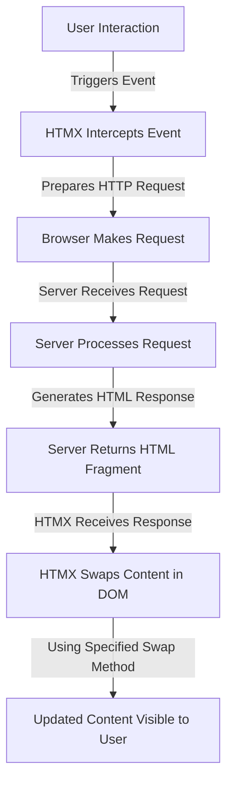

## Introduction to HTMX

HTMX is a lightweight JavaScript library (only ~14KB minified and gzipped) that allows you to create dynamic, interactive web interfaces using HTML attributes - without writing any JavaScript code. It extends HTML's capabilities by overcoming traditional limitations:

- Traditional HTML only allows `<a>` and `<form>` tags to make HTTP requests
- Only `click` and `submit` events can trigger these requests
- Only `GET` and `POST` methods are available
- When using links and forms, the entire page gets replaced

HTMX's philosophy is "hypertext-driven development," returning to the simplicity of server-rendered applications while maintaining modern interactivity.

## Getting Started with HTMX

Before diving into the specifics, let's set up HTMX in your project. There are three simple ways to include it:

### Installation Options

**Option 1: Via CDN (simplest approach)**

```html
<script
  src="https://unpkg.com/htmx.org@1.9.10"
  integrity="sha384-D1Kt99CQMDuVetoL1lrYwg5t+9QdHe7NLX/SoJYkXDFfX37iInKRy5xLSi8nO7UC"
  crossorigin="anonymous"
></script>
```

**Option 2: Download and include locally**

```html
<script src="path/to/htmx.min.js"></script>
```

**Option 3: Install via npm**

```bash
npm install htmx.org
```

Then import it in your JavaScript:

```javascript
import 'htmx.org';
```

### Basic Structure

To start using HTMX, you'll follow a simple pattern:

1. Include the HTMX script in your HTML document's `<head>` section
2. Add HTMX attributes to your HTML elements
3. Create server endpoints that return HTML fragments

Once HTMX is included in your project, you're ready to explore its powerful attributes.

## Core HTMX Attributes

HTMX works through a set of special attributes that extend standard HTML elements. These attributes can be grouped into three main categories:

### HTTP Request Attributes

- `hx-get`: Send a GET request to the specified URL
- `hx-post`: Send a POST request to the specified URL
- `hx-put`: Send a PUT request to the specified URL
- `hx-patch`: Send a PATCH request to the specified URL
- `hx-delete`: Send a DELETE request to the specified URL

### Content Handling Attributes

- `hx-swap`: Specify how to swap the response content (e.g., `innerHTML`, `outerHTML`, `beforebegin`)
- `hx-target`: Target a different element to swap content into (using CSS selectors)
- `hx-trigger`: Define what event triggers the request (e.g., `click`, `change`, `submit`)

### Additional Useful Attributes

- `hx-include`: Include values from other elements in the request
- `hx-indicator`: Show a loading indicator during the request
- `hx-confirm`: Display a confirmation dialog before sending the request
- `hx-vals`: Add extra parameters to the request

Now that we understand the basic attributes, let's see them in action with some examples.

## Basic Examples

Let's start with some simple examples to demonstrate how HTMX attributes work together.

### Simple GET Request

```html
<button hx-get="/api/users" hx-target="#user-list">Load Users</button>

<div id="user-list"></div>
```

When clicked, this button will make a GET request to "/api/users" and place the HTML response inside the `#user-list` div.

### Form Submission with POST

```html
<form hx-post="/api/convert" hx-target="#result">
  <input
    type="number"
    name="fahrenheit"
    placeholder="Enter temperature in °F"
  />
  <button type="submit">Convert to Celsius</button>
</form>

<div id="result"></div>
```

This form will submit the fahrenheit value to the server, which should return HTML containing the converted celsius value.

With these basic examples in mind, let's explore more practical applications that demonstrate HTMX's versatility.

## Practical Projects

Building on the basic examples, here are three more advanced implementations that showcase common UI patterns.

### 1. Temperature Converter

```html
<div class="container">
  <h2>Temperature Converter</h2>
  <div class="form-group">
    <label for="temp">Fahrenheit:</label>
    <input
      type="number"
      id="temp"
      name="temperature"
      hx-post="/convert"
      hx-trigger="keyup changed delay:500ms"
      hx-target="#result"
    />
  </div>
  <div id="result"></div>
</div>
```

In this example, as the user types in the temperature field (with a 500ms delay), HTMX will send the value to the server and update the result div with the converted temperature.

### 2. Live Search Widget

```html
<div class="search-container">
  <h3>Contact Search</h3>
  <input
    type="search"
    name="search"
    placeholder="Search contacts..."
    hx-get="/search"
    hx-trigger="keyup delay:200ms"
    hx-target="#search-results"
    hx-indicator="#search-indicator"
  />
  <div id="search-indicator" class="htmx-indicator">Searching...</div>
  <div id="search-results"></div>
</div>
```

This creates a search input that sends the query to the server as the user types (with a 200ms delay) and updates the results in real-time. It also shows a loading indicator during the request.

### 3. Real-time Data with Polling

```html
<div
  id="weather-data"
  hx-get="/api/weather"
  hx-trigger="load, every 30s"
  hx-indicator="#weather-indicator"
>
  <div id="weather-indicator" class="htmx-indicator">
    Loading weather data...
  </div>
</div>
```

This div will automatically refresh its content by requesting new weather data every 30 seconds, creating a real-time update effect without WebSockets.

For these examples to work, you'll need a server that can respond with the appropriate HTML fragments. Let's look at how to set up such a server.

## Setting Up a Backend Server

HTMX requires a server that returns HTML fragments rather than JSON data. Here's a simple example using Node.js and Express that implements the endpoints needed for our examples above:

```javascript
const express = require('express');
const app = express();
const port = 3000;

// Serve static files
app.use(express.static('public'));
app.use(express.urlencoded({ extended: true }));

// Sample data
const contacts = [
  { name: 'John Doe', email: 'john@example.com' },
  { name: 'Jane Smith', email: 'jane@example.com' },
  { name: 'Bob Johnson', email: 'bob@example.com' },
];

// Routes
app.get('/', (req, res) => {
  res.sendFile(__dirname + '/public/index.html');
});

// API endpoint to convert temperature
app.post('/convert', (req, res) => {
  const fahrenheit = parseFloat(req.body.temperature);
  const celsius = (fahrenheit - 32) * (5 / 9);

  // Return HTML, not JSON
  res.send(`${fahrenheit}°F is ${celsius.toFixed(2)}°C`);
  // Note: The response is 32°F is 0.00°C for freezing point of water
});

// API endpoint for search
app.get('/search', (req, res) => {
  const query = req.query.search?.toLowerCase() || '';
  // Filter contacts based on query
  const results = contacts.filter(
    (contact) =>
      contact.name.toLowerCase().includes(query) ||
      contact.email.toLowerCase().includes(query),
  );

  // Return HTML for results
  if (results.length === 0) {
    return res.send('<p>No results found</p>');
  }

  const html = results
    .map(
      (contact) => `
    <div class="contact-card">
      <h4>${contact.name}</h4>
      <p>${contact.email}</p>
    </div>
  `,
    )
    .join('');

  res.send(html);
});

app.listen(port, () => {
  console.log(`Server running at http://localhost:${port}`);
});
```

The key concept here is that your server should return HTML fragments, not JSON data. HTMX will take these HTML fragments and inject them directly into your page, allowing for dynamic updates without full page reloads.

Now that we have our server set up, let's look at some common UI patterns that HTMX excels at implementing.

## Common UI Patterns

HTMX makes it easy to implement many common UI patterns that traditionally require complex JavaScript. Here are some examples:

### Form Validation

Real-time form validation is straightforward with HTMX:

```html
<div class="form-group">
  <label for="username">Username</label>
  <input
    type="text"
    id="username"
    name="username"
    hx-post="/validate/username"
    hx-trigger="keyup changed delay:500ms"
    hx-target="#username-error"
  />
  <div id="username-error" class="error-message"></div>
</div>
```

The server would respond with validation feedback:

```javascript
app.post('/validate/username', (req, res) => {
  const username = req.body.username;

  if (!username) {
    return res.send('<span class="error">Username is required</span>');
  }

  if (username.length < 3) {
    return res.send(
      '<span class="error">Username must be at least 3 characters</span>',
    );
  }

  // Check if username exists in database...

  // If valid
  res.send('<span class="success">Username is available</span>');
});
```

### Confirmation Dialogs

Adding confirmation prompts before destructive actions is simple:

```html
<button
  hx-delete="/contacts/42"
  hx-confirm="Are you sure you want to delete this contact?"
  hx-target="#contact-list"
>
  Delete Contact
</button>
```

### Loading Indicators

You can easily show loading indicators during HTMX requests:

```html
<button hx-get="/slow-resource" hx-indicator="#spinner">Load Data</button>

<div id="spinner" class="htmx-indicator">
  Loading... 
</div>
```

Add this CSS to hide indicators until needed:

```css
.htmx-indicator {
  display: none;
}
.htmx-request .htmx-indicator {
  display: block;
}
```

Understanding how HTMX processes requests and responses is crucial to working with it effectively. Let's visualize this flow.

## Understanding HTMX Flow

The following diagram illustrates how HTMX handles user interactions and updates the page:



This flow happens entirely without page reloads, creating a smooth, app-like experience while maintaining the simplicity of HTML and server-rendered content.

Now that we understand how HTMX works, let's build a complete example application that ties together all these concepts.

## Complete Example Application

Let's create a simple task management application that demonstrates HTMX's capabilities in a real-world scenario:

**HTML (index.html)**:

```html
<!DOCTYPE html>
<html lang="en">
  <head>
    <meta charset="UTF-8" />
    <meta name="viewport" content="width=device-width, initial-scale=1.0" />
    <title>HTMX Task Manager</title>
    <script src="https://unpkg.com/htmx.org@1.9.10"></script>
    <style>
      body {
        font-family: Arial, sans-serif;
        max-width: 600px;
        margin: 0 auto;
        padding: 20px;
      }
      .task {
        border: 1px solid #ddd;
        padding: 10px;
        margin-bottom: 10px;
        border-radius: 4px;
      }
      .task.completed {
        background-color: #f8f8f8;
        text-decoration: line-through;
      }
      .htmx-indicator {
        display: none;
      }
      .htmx-request .htmx-indicator {
        display: inline;
      }
      .error {
        color: red;
      }
    </style>
  </head>
  <body>
    <h1>HTMX Task Manager</h1>

    <form hx-post="/tasks" hx-target="#task-list" hx-swap="beforeend">
      <input
        type="text"
        name="title"
        placeholder="Add a new task..."
        required
      />
      <button type="submit">Add Task</button>
      <span class="htmx-indicator">Adding...</span>
    </form>

    <h2>Tasks</h2>
    <div id="task-list">
      <!-- Tasks will be loaded here -->
    </div>

    <script>
      // Initially load tasks when the page loads
      document.addEventListener('DOMContentLoaded', function () {
        htmx.ajax('GET', '/tasks', { target: '#task-list' });
      });
    </script>
  </body>
</html>
```

**Server (app.js)**:

```javascript
const express = require('express');
const app = express();
const port = 3000;

app.use(express.static('public'));
app.use(express.urlencoded({ extended: true }));

// In-memory storage for tasks
let tasks = [
  { id: 1, title: 'Learn HTMX basics', completed: true },
  { id: 2, title: 'Build a simple application', completed: false },
  { id: 3, title: 'Share with friends', completed: false },
];

app.get('/', (req, res) => {
  res.sendFile(__dirname + '/public/index.html');
});

// Get all tasks
app.get('/tasks', (req, res) => {
  const taskHtml = tasks
    .map((task) => {
      return `
      <div class="task ${task.completed ? 'completed' : ''}" id="task-${task.id}">
        <input 
          type="checkbox" 
          ${task.completed ? 'checked' : ''} 
          hx-post="/tasks/${task.id}/toggle" 
          hx-target="#task-${task.id}" 
          hx-swap="outerHTML"
        >
        <span>${task.title}</span>
        <button 
          hx-delete="/tasks/${task.id}" 
          hx-target="#task-${task.id}" 
          hx-confirm="Are you sure you want to delete this task?"
          hx-swap="outerHTML"
        >
          Delete
        </button>
      </div>
    `;
    })
    .join('');

  res.send(taskHtml);
});

// Add a new task
app.post('/tasks', (req, res) => {
  const title = req.body.title.trim();

  if (!title) {
    return res
      .status(400)
      .send('<div class="error">Task title cannot be empty</div>');
  }

  const newTask = {
    id: tasks.length + 1,
    title: title,
    completed: false,
  };

  tasks.push(newTask);

  // Return HTML for the new task only
  res.send(`
    <div class="task" id="task-${newTask.id}">
      <input 
        type="checkbox" 
        hx-post="/tasks/${newTask.id}/toggle" 
        hx-target="#task-${newTask.id}" 
        hx-swap="outerHTML"
      >
      <span>${newTask.title}</span>
      <button 
        hx-delete="/tasks/${newTask.id}" 
        hx-target="#task-${newTask.id}" 
        hx-confirm="Are you sure you want to delete this task?"
        hx-swap="outerHTML"
      >
        Delete
      </button>
    </div>
  `);
});

// Toggle task completion
app.post('/tasks/:id/toggle', (req, res) => {
  const id = parseInt(req.params.id);
  const task = tasks.find((t) => t.id === id);

  if (!task) {
    return res.status(404).send('<div class="error">Task not found</div>');
  }

  task.completed = !task.completed;

  // Return updated task HTML
  res.send(`
    <div class="task ${task.completed ? 'completed' : ''}" id="task-${task.id}">
      <input 
        type="checkbox" 
        ${task.completed ? 'checked' : ''} 
        hx-post="/tasks/${task.id}/toggle" 
        hx-target="#task-${task.id}" 
        hx-swap="outerHTML"
      >
      <span>${task.title}</span>
      <button 
        hx-delete="/tasks/${task.id}" 
        hx-target="#task-${task.id}" 
        hx-confirm="Are you sure you want to delete this task?"
        hx-swap="outerHTML"
      >
        Delete
      </button>
    </div>
  `);
});

// Delete a task
app.delete('/tasks/:id', (req, res) => {
  const id = parseInt(req.params.id);
  tasks = tasks.filter((t) => t.id !== id);

  // Return empty string to remove the element
  res.send('');
});

app.listen(port, () => {
  console.log(`Server running at http://localhost:${port}`);
});
```

To run this example:

1. Create a new directory for your project
2. Save the HTML file as `public/index.html`
3. Save the server code as `app.js`
4. Run `npm init -y` to create a package.json
5. Install dependencies: `npm install express`
6. Start the server: `node app.js`
7. Open your browser to `http://localhost:3000`

This application demonstrates several HTMX features working together:

- Adding new tasks without page reload
- Toggling task completion status
- Deleting tasks with confirmation
- Initial page load with existing tasks
- Loading indicators
- Error handling

While this covers most of what you'll need for everyday HTMX development, there are some advanced topics worth exploring as your applications grow in complexity.

## The Last 15%: Advanced Topics

As you become comfortable with HTMX basics, you may want to explore these more advanced features:

1. **WebSocket Integration**: Use `hx-ws` to establish WebSocket connections for true real-time updates without polling.

   ```html
   <div hx-ws="connect:/chat">
     <div id="chat-messages"></div>
     <form hx-ws="send">
       <input name="message" />
       <button>Send</button>
     </form>
   </div>
   ```

2. **Server-Sent Events (SSE)**: Implement `hx-sse` for server-pushed updates that are more efficient than polling.

   ```html
   <div hx-sse="connect:/events">
     <div hx-sse="swap:message" hx-swap="beforeend">
       <!-- SSE messages will be appended here -->
     </div>
   </div>
   ```

3. **Working with JSON APIs**: When you need to work with existing JSON APIs, use extensions like client-side-templates.

   ```html
   <script src="https://unpkg.com/htmx.org/dist/ext/client-side-templates.js"></script>
   <script src="https://unpkg.com/mustache@latest"></script>

   <div hx-ext="client-side-templates">
     <button
       hx-get="/api/users"
       hx-target="#users"
       hx-trigger="click"
       mustache-template="user-template"
     >
       Load Users
     </button>

     <div id="users"></div>

     <template id="user-template">
       {{#data}}
       <div class="user">
         <h3>{{name}}</h3>
         <p>{{email}}</p>
       </div>
       {{/data}}
     </template>
   </div>
   ```

4. **State Management**: For complex applications, explore patterns for managing client-side state alongside HTMX using techniques like:

   - Local storage
   - Hidden form fields
   - URL parameters
   - HTML custom data attributes

5. **Combining with Other Libraries**: HTMX works well with other small libraries like Alpine.js for complex client-side behavior.

   ```html
   <div x-data="{count: 0}">
     <button @click="count++" x-text="count"></button>
     <button
       hx-post="/save-count"
       hx-include="[name='count']"
       x-on:click="$el.setAttribute('hx-vals', JSON.stringify({count}))"
     >
       Save Count
     </button>
   </div>
   ```

6. **Hypermedia-Driven Applications (HDAs)**: Understanding the architectural patterns for building full applications with HTMX.

7. **Security Considerations**: Implementing proper CSRF protection and validating all server-side inputs.

8. **Custom Extensions**: Creating your own extensions to add specialized functionality to HTMX.

   ```javascript
   htmx.defineExtension('my-extension', {
     onEvent: function (name, evt) {
       // Custom event handling
     },
   });
   ```

9. **Progress Bars and File Uploads**: Advanced upload handling with progress indicators.

   ```html
   <form hx-post="/upload" hx-encoding="multipart/form-data">
     <input type="file" name="file" />
     <button>Upload</button>
     <progress id="progress" value="0" max="100"></progress>
   </form>
   ```

10. **View Transitions**: Leveraging browser view transitions API with HTMX for smooth page transitions.
    ```html
    <script src="https://unpkg.com/htmx.org/dist/ext/view-transitions.js"></script>
    <div hx-ext="view-transitions">
      <!-- content with smooth transitions -->
    </div>
    ```

## Conclusion

HTMX represents a return to the simplicity of HTML while providing modern interactivity. By following the patterns and examples in this crash course, you now have the knowledge to implement 85% of the functionality you'll need in everyday web development with significantly less code than traditional JavaScript frameworks.

The library's elegance lies in its simplicity: by extending HTML with a handful of attributes, it enables you to create dynamic, interactive applications without writing JavaScript. This approach works exceptionally well with server-side rendering and integrates seamlessly with any backend technology that can return HTML fragments.

As your applications grow in complexity, you can gradually explore the advanced topics listed in the "last 15%" section. The solid foundation provided in this crash course gives you the tools to dive deeper into these areas as needed, allowing your skills with HTMX to grow alongside your projects.

By embracing HTMX's "hypertext-driven development" philosophy, you'll find that many common web development tasks become simpler, more maintainable, and more aligned with the web's original vision of connected documents - now enhanced with modern interactivity.
