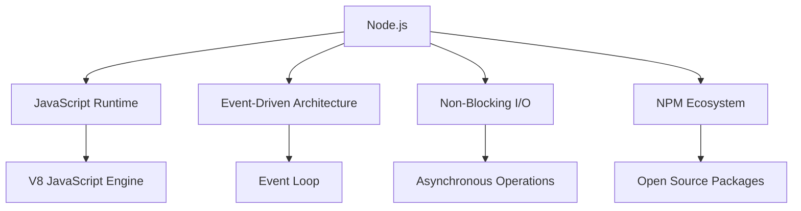
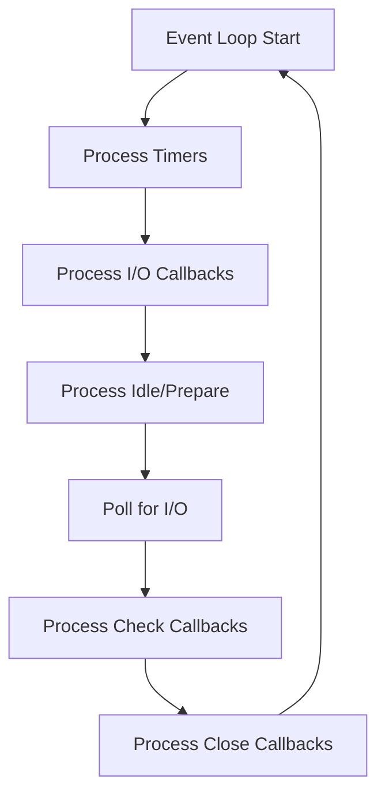

This crash course will equip you with the core Node.js skills needed for daily development while giving you the foundation to explore more advanced topics independently.

## Introduction to Node.js

Node.js is a JavaScript runtime built on Chrome's V8 engine that allows you to run JavaScript outside of browsers. Unlike traditional server technologies that create a new thread for each request, Node.js uses a single-threaded, event-driven architecture with non-blocking I/O operations, making it efficient for scalable applications.



### Why Node.js?

- **JavaScript Everywhere**: Use the same language for frontend and backend
- **Efficiency**: Handles many concurrent connections with minimal resources
- **NPM Ecosystem**: Access to the world's largest package registry
- **Community**: Extensive documentation and support
- **Corporate Adoption**: Used by Netflix, PayPal, LinkedIn, and Uber

## Getting Started

Before diving into coding, let's set up our environment and understand some basics. You'll need a few prerequisites to get the most out of Node.js development.

### Prerequisites

- Basic JavaScript knowledge (variables, functions, objects, arrays)
- Understanding of asynchronous concepts (callbacks, promises)
- Familiarity with web development concepts

### Installation

Installing Node.js is straightforward across all major operating systems:

```bash
# Download and install Node.js from https://nodejs.org
# Verify installation
node -v  # Shows Node version
npm -v   # Shows npm version
```

### Your First Node.js Program

Let's create a simple program to test our installation and see Node.js in action:

```javascript
// This is your first Node.js program
console.log('Hello, Node.js!');

// Access Node-specific global objects
console.log(__dirname); // Current directory path
console.log(__filename); // Current file path
```

Run it by opening your terminal, navigating to your file's location, and typing:

```bash
node hello.js
```

Congratulations! You've just executed your first Node.js program. Now let's explore the core concepts that make Node.js powerful.

## Core Concepts

Node.js differs from browser JavaScript in several important ways. Understanding these differences is crucial to becoming proficient with Node.js.

### 1. Module System

Node.js uses modules to organize code into reusable components. This modular approach helps maintain clean, organized, and maintainable applications. There are two module systems you'll encounter:

#### CommonJS (Traditional)

The original module system in Node.js, still widely used:

```javascript
// math.js - Exporting a module
function add(a, b) {
  return a + b;
}

function subtract(a, b) {
  return a - b;
}

// Export multiple functions
module.exports = { add, subtract };
```

```javascript
// app.js - Importing a module
const math = require('./math'); // Path to your module file

console.log(math.add(5, 3)); // Output: 8
console.log(math.subtract(5, 3)); // Output: 2
```

#### ES Modules (Modern)

The newer standard, aligned with how modules work in modern JavaScript:

```javascript
// math.mjs
export function add(a, b) {
  return a + b;
}

export function subtract(a, b) {
  return a - b;
}
```

```javascript
// app.mjs
import { add, subtract } from './math.mjs';

console.log(add(5, 3)); // Output: 8
console.log(subtract(5, 3)); // Output: 2
```

To use ES Modules, either use the `.mjs` extension or add `"type": "module"` to your package.json.

### 2. NPM (Node Package Manager)

One of Node.js's greatest strengths is its vast ecosystem of packages. NPM is the tool that makes accessing this ecosystem simple:

```bash
# Initialize a new Node.js project
npm init -y  # Creates package.json with default values

# Install a package
npm install express  # Installs Express.js framework
# or shorter syntax
npm i express

# Install a development dependency
npm install nodemon --save-dev  # Auto-restarts server during development
# or shorter syntax
npm i nodemon -D

# Install a global package
npm install -g nodemon
```

Your `package.json` will track your dependencies:

```json
{
  "name": "node-project",
  "version": "1.0.0",
  "main": "index.js",
  "scripts": {
    "start": "node index.js",
    "dev": "nodemon index.js"
  },
  "dependencies": {
    "express": "^4.18.2"
  },
  "devDependencies": {
    "nodemon": "^3.0.1"
  }
}
```

The scripts section allows you to define shortcuts for common commands:

```bash
npm run dev  # Executes the "dev" script
```

### 3. File System Operations

Unlike browser JavaScript, Node.js can interact with the file system directly. The built-in `fs` module provides APIs for working with files and directories:

```javascript
const fs = require('fs');
const path = require('path');

// Synchronous read (blocks until complete)
try {
  // path.join creates proper file paths across operating systems
  const data = fs.readFileSync(path.join(__dirname, 'file.txt'), 'utf8');
  console.log('Sync read:', data);
} catch (err) {
  console.error('Error reading file:', err);
}

// Asynchronous read (non-blocking)
fs.readFile(path.join(__dirname, 'file.txt'), 'utf8', (err, data) => {
  if (err) {
    console.error('Error reading file:', err);
    return;
  }
  console.log('Async read:', data);
});

// Modern Promise-based approach
const fsPromises = require('fs').promises;

async function readFileAsync() {
  try {
    const data = await fsPromises.readFile(
      path.join(__dirname, 'file.txt'),
      'utf8',
    );
    console.log('Promise-based read:', data);
  } catch (err) {
    console.error('Error reading file:', err);
  }
}

readFileAsync();

// Write to file
fs.writeFile(path.join(__dirname, 'output.txt'), 'Hello, World!', (err) => {
  if (err) {
    console.error('Error writing file:', err);
    return;
  }
  console.log('File written successfully');
});
```

The `path` module helps create cross-platform file paths, ensuring your code works on any operating system.

### 4. Asynchronous Programming Patterns

Node.js excels at handling operations that would otherwise block execution, like file operations or network requests. There are three main patterns for handling asynchronous code:

```javascript
// 1. Callbacks (old style)
function fetchWithCallback(id, callback) {
  setTimeout(() => {
    // Simulate database query
    console.log(`Fetched data for id: ${id}`);
    callback(null, { id, name: 'User' + id });
    // First parameter is for errors: callback(new Error('Failed'), null);
  }, 1000);
}

fetchWithCallback(123, (err, data) => {
  if (err) {
    console.error('Error:', err);
    return;
  }
  console.log('Callback result:', data); // { id: 123, name: 'User123' }
});

// 2. Promises (improved readability)
function fetchWithPromise(id) {
  return new Promise((resolve, reject) => {
    setTimeout(() => {
      console.log(`Fetched data for id: ${id}`);
      // Success case
      resolve({ id, name: 'User' + id });
      // Error case: reject(new Error('Failed to fetch data'));
    }, 1000);
  });
}

fetchWithPromise(456)
  .then((data) => console.log('Promise result:', data))
  .catch((err) => console.error('Error:', err));

// 3. Async/Await (modern, most readable)
async function fetchData() {
  try {
    const data = await fetchWithPromise(789);
    console.log('Async/await result:', data);
  } catch (err) {
    console.error('Error:', err);
  }
}

fetchData();
```

While callbacks were the original pattern, modern Node.js code typically uses Promises or async/await for better readability and error handling.

### 5. Event Loop and Event Emitter

The Event Loop is the heart of Node.js—it's what enables non-blocking I/O operations despite JavaScript being single-threaded:



Building on this event-driven architecture, Node.js provides the EventEmitter class to create your own event-driven code:

```javascript
const EventEmitter = require('events');

// Create a custom emitter
class Logger extends EventEmitter {
  log(message) {
    console.log(`Message: ${message}`);
    // Emit an event with additional data
    this.emit('logged', { message, timestamp: new Date() });
  }
}

const logger = new Logger();

// Register event listeners
logger.on('logged', (data) => {
  console.log('Logged event fired with data:', data);
  // Output: Logged event fired with data: { message: 'Hello', timestamp: 2023-... }
});

// Trigger the event
logger.log('Hello');
```

Many Node.js core modules use this event-driven pattern internally, making it important to understand.

## Building Web Applications

Now that we've covered the fundamentals, let's apply our knowledge to build web applications—one of the most common use cases for Node.js.

### 1. Simple HTTP Server

Node.js comes with a built-in HTTP module that allows you to create web servers without additional libraries:

```javascript
const http = require('http');

// Create a server
const server = http.createServer((req, res) => {
  // Get request details
  const url = req.url;
  const method = req.method;

  // Set response headers
  res.setHeader('Content-Type', 'text/html');

  // Handle different routes
  if (url === '/') {
    res.statusCode = 200;
    res.write('<html><body><h1>Welcome to Node.js!</h1></body></html>');
    return res.end();
  }

  if (url === '/api/users') {
    res.statusCode = 200;
    res.setHeader('Content-Type', 'application/json');
    // Return JSON data
    res.write(
      JSON.stringify([
        { id: 1, name: 'John' },
        { id: 2, name: 'Jane' },
      ]),
    );
    return res.end();
  }

  // Handle unknown routes (404)
  res.statusCode = 404;
  res.write('<html><body><h1>Page Not Found</h1></body></html>');
  res.end();
});

// Environment variables with fallback
const PORT = process.env.PORT || 3000;

// Start the server
server.listen(PORT, () => {
  console.log(`Server running on port ${PORT}`);
});
```

While this approach works, it quickly becomes cumbersome for complex applications. That's where frameworks like Express.js come in.

### 2. Express.js Framework

Express is a minimal, flexible web framework that simplifies the process of building web applications and APIs:

```bash
npm install express
```

Here's a basic Express app that accomplishes the same thing as our HTTP server but with cleaner, more maintainable code:

```javascript
// Import packages
const express = require('express');
const app = express();
const PORT = process.env.PORT || 3000;

// Middleware for parsing request bodies
app.use(express.json()); // For parsing application/json
app.use(express.urlencoded({ extended: false })); // For parsing form data

// Serve static files from the 'public' folder
app.use(express.static('public'));

// Custom middleware - logs all requests
app.use((req, res, next) => {
  console.log(`${new Date().toISOString()} - ${req.method} ${req.url}`);
  next(); // Pass control to the next middleware
});

// Routes
app.get('/', (req, res) => {
  res.send('<h1>Welcome to Express!</h1>');
});

// API route with JSON response
app.get('/api/users', (req, res) => {
  res.json([
    { id: 1, name: 'John' },
    { id: 2, name: 'Jane' },
  ]);
});

// Route with URL parameters
app.get('/api/users/:id', (req, res) => {
  const userId = req.params.id;
  res.json({ id: userId, name: 'User ' + userId });
});

// POST route
app.post('/api/users', (req, res) => {
  // Access form data from req.body
  const { name, email } = req.body;

  // Validate input
  if (!name || !email) {
    return res.status(400).json({ message: 'Name and email are required' });
  }

  // In a real app, you'd save to a database here

  // Return success response
  res.status(201).json({
    message: 'User created successfully',
    user: { name, email, id: Date.now() },
  });
});

// Start the server
app.listen(PORT, () => {
  console.log(`Server running on port ${PORT}`);
});
```

Express uses middleware functions—functions that have access to the request, response, and next middleware function in the application's request-response cycle. This middleware-based approach makes it easy to add functionality like logging, authentication, and error handling.

### 3. Organizing Routes with Express Router

As your application grows, organizing routes becomes important. Express Router helps maintain a clean, modular structure:

```javascript
// routes/users.js
const express = require('express');
const router = express.Router();

// Route: /users/
router.get('/', (req, res) => {
  res.json([
    { id: 1, name: 'John' },
    { id: 2, name: 'Jane' },
  ]);
});

// Route: /users/:id
router.get('/:id', (req, res) => {
  res.json({ id: req.params.id, name: 'User ' + req.params.id });
});

// Route: /users/ (POST)
router.post('/', (req, res) => {
  const { name, email } = req.body;
  res.status(201).json({ id: Date.now(), name, email });
});

module.exports = router;

// app.js
const express = require('express');
const app = express();
const userRoutes = require('./routes/users');

app.use(express.json());

// Mount the router at /api/users
app.use('/api/users', userRoutes);

app.listen(3000, () => {
  console.log('Server running on port 3000');
});
```

This approach lets you group related routes together and keeps your main application file clean and focused.

## Database Integration with MongoDB

Most web applications need to store data. MongoDB is a popular NoSQL database that works beautifully with Node.js through the Mongoose ODM (Object Document Mapper).

### 1. Setup with Mongoose

First, install the necessary packages:

```bash
npm install mongoose dotenv
```

Create a `.env` file to store your connection string securely:

```
MONGO_URI=mongodb://localhost:27017/myapp
```

Set up the connection to MongoDB:

```javascript
// db.js
const mongoose = require('mongoose');
require('dotenv').config();

const connectDB = async () => {
  try {
    await mongoose.connect(process.env.MONGO_URI);
    console.log('MongoDB connected successfully');
  } catch (error) {
    console.error('MongoDB connection failed:', error.message);
    process.exit(1); // Exit with failure code
  }
};

module.exports = connectDB;

// server.js
const express = require('express');
const connectDB = require('./db');

// Connect to database
connectDB();

// Rest of your Express setup...
```

### 2. Creating Models with Mongoose

Models define the structure of your documents in MongoDB. They include validation, default values, and other schema options:

```javascript
// models/User.js
const mongoose = require('mongoose');

// Define schema
const userSchema = new mongoose.Schema({
  name: {
    type: String,
    required: [true, 'Name is required'],
    trim: true,
  },
  email: {
    type: String,
    required: [true, 'Email is required'],
    unique: true,
    match: [
      /^\w+([\.-]?\w+)*@\w+([\.-]?\w+)*(\.\w{2,3})+$/,
      'Please provide a valid email',
    ],
  },
  password: {
    type: String,
    required: [true, 'Password is required'],
    minlength: 6,
    select: false, // Don't return password in query results
  },
  createdAt: {
    type: Date,
    default: Date.now,
  },
});

// Create model from schema
module.exports = mongoose.model('User', userSchema);
```

Mongoose provides a rich set of features for data validation, middleware, and more, making it easier to work with MongoDB in a structured way.

### 3. CRUD Operations

Now let's implement the basic operations for working with our User model:

```javascript
// controllers/userController.js
const User = require('../models/User');

// Create a new user
exports.createUser = async (req, res) => {
  try {
    const user = await User.create(req.body);
    // Don't send back the password
    user.password = undefined;

    res.status(201).json({
      success: true,
      data: user,
    });
  } catch (error) {
    res.status(400).json({
      success: false,
      message: error.message,
    });
  }
};

// Get all users
exports.getUsers = async (req, res) => {
  try {
    const users = await User.find();
    res.status(200).json({
      success: true,
      count: users.length,
      data: users,
    });
  } catch (error) {
    res.status(500).json({
      success: false,
      message: 'Server error',
    });
  }
};

// Get user by ID
exports.getUserById = async (req, res) => {
  try {
    const user = await User.findById(req.params.id);

    if (!user) {
      return res.status(404).json({
        success: false,
        message: 'User not found',
      });
    }

    res.status(200).json({
      success: true,
      data: user,
    });
  } catch (error) {
    res.status(500).json({
      success: false,
      message: 'Server error',
    });
  }
};

// Update user
exports.updateUser = async (req, res) => {
  try {
    const user = await User.findByIdAndUpdate(
      req.params.id,
      req.body,
      { new: true, runValidators: true }, // Return updated document and run validators
    );

    if (!user) {
      return res.status(404).json({
        success: false,
        message: 'User not found',
      });
    }

    res.status(200).json({
      success: true,
      data: user,
    });
  } catch (error) {
    res.status(500).json({
      success: false,
      message: 'Server error',
    });
  }
};

// Delete user
exports.deleteUser = async (req, res) => {
  try {
    const user = await User.findByIdAndDelete(req.params.id);

    if (!user) {
      return res.status(404).json({
        success: false,
        message: 'User not found',
      });
    }

    res.status(200).json({
      success: true,
      data: {},
    });
  } catch (error) {
    res.status(500).json({
      success: false,
      message: 'Server error',
    });
  }
};
```

These controller functions follow a consistent pattern: attempt the database operation, handle any errors, and return an appropriate response to the client.

### 4. Database Seeding Script

For development and testing, it's often helpful to have a way to populate your database with sample data:

```javascript
// seeds/seed.js
const mongoose = require('mongoose');
const User = require('../models/User');
require('dotenv').config();

// Sample data
const users = [
  {
    name: 'John Doe',
    email: 'john@example.com',
    password: 'password123',
  },
  {
    name: 'Jane Smith',
    email: 'jane@example.com',
    password: 'password456',
  },
  {
    name: 'Alice Johnson',
    email: 'alice@example.com',
    password: 'password789',
  },
];

// Connect and seed function
const seedDatabase = async () => {
  try {
    // Connect to MongoDB
    await mongoose.connect(process.env.MONGO_URI);
    console.log('Connected to MongoDB for seeding');

    // Delete existing data (optional)
    await User.deleteMany({});
    console.log('Cleared existing users');

    // Insert new data
    const createdUsers = await User.create(users);
    console.log(`${createdUsers.length} users created`);

    console.log('Database seeded successfully');
    process.exit(0);
  } catch (error) {
    console.error('Error seeding database:', error);
    process.exit(1);
  }
};

// Run the seeding function
seedDatabase();
```

Execute this script with `node seeds/seed.js` whenever you need to reset your database with fresh test data.

## Authentication with JWT

Most applications require some form of authentication. JSON Web Tokens (JWT) provide a secure, stateless way to authenticate users:

```bash
npm install jsonwebtoken bcryptjs
```

Let's implement user registration and login:

```javascript
// auth/authController.js
const User = require('../models/User');
const jwt = require('jsonwebtoken');
const bcrypt = require('bcryptjs');

// Register a new user
exports.register = async (req, res) => {
  try {
    const { name, email, password } = req.body;

    // Check if user already exists
    const existingUser = await User.findOne({ email });
    if (existingUser) {
      return res.status(400).json({
        success: false,
        message: 'Email already registered',
      });
    }

    // Hash password
    const salt = await bcrypt.genSalt(10);
    const hashedPassword = await bcrypt.hash(password, salt);

    // Create user in database
    const user = await User.create({
      name,
      email,
      password: hashedPassword,
    });

    // Generate JWT token
    const token = jwt.sign({ id: user._id }, process.env.JWT_SECRET, {
      expiresIn: '30d',
    });

    // Return user data (without password) and token
    res.status(201).json({
      success: true,
      token,
      user: {
        id: user._id,
        name: user.name,
        email: user.email,
      },
    });
  } catch (error) {
    res.status(400).json({
      success: false,
      message: error.message,
    });
  }
};

// Login user
exports.login = async (req, res) => {
  try {
    const { email, password } = req.body;

    // Validate input
    if (!email || !password) {
      return res.status(400).json({
        success: false,
        message: 'Please provide email and password',
      });
    }

    // Find user and include password
    const user = await User.findOne({ email }).select('+password');
    if (!user) {
      return res.status(401).json({
        success: false,
        message: 'Invalid credentials',
      });
    }

    // Verify password
    const isMatch = await bcrypt.compare(password, user.password);
    if (!isMatch) {
      return res.status(401).json({
        success: false,
        message: 'Invalid credentials',
      });
    }

    // Generate token
    const token = jwt.sign({ id: user._id }, process.env.JWT_SECRET, {
      expiresIn: '30d',
    });

    res.status(200).json({
      success: true,
      token,
      user: {
        id: user._id,
        name: user.name,
        email: user.email,
      },
    });
  } catch (error) {
    res.status(500).json({
      success: false,
      message: 'Server error',
    });
  }
};
```

### Authentication Middleware

To protect routes that require authentication, we need middleware to verify the JWT:

```javascript
// middleware/auth.js
const jwt = require('jsonwebtoken');
const User = require('../models/User');

exports.protect = async (req, res, next) => {
  let token;

  // Check if token exists in headers
  if (
    req.headers.authorization &&
    req.headers.authorization.startsWith('Bearer')
  ) {
    // Format: "Bearer [token]"
    token = req.headers.authorization.split(' ')[1];
  }

  if (!token) {
    return res.status(401).json({
      success: false,
      message: 'Not authorized to access this route',
    });
  }

  try {
    // Verify token
    const decoded = jwt.verify(token, process.env.JWT_SECRET);

    // Find user by id (from token payload)
    const user = await User.findById(decoded.id);

    if (!user) {
      return res.status(401).json({
        success: false,
        message: 'User not found',
      });
    }

    // Add user to request object
    req.user = user;
    next();
  } catch (error) {
    return res.status(401).json({
      success: false,
      message: 'Not authorized to access this route',
    });
  }
};
```

Now you can protect any route by adding this middleware:

```javascript
// routes/userRoutes.js
const express = require('express');
const router = express.Router();
const { protect } = require('../middleware/auth');
const {
  getUsers,
  getUserById,
  updateUser,
  deleteUser,
} = require('../controllers/userController');

// Public route
router.get('/public', (req, res) => {
  res.json({ message: 'This is public data' });
});

// Protected routes - require authentication
router.get('/profile', protect, (req, res) => {
  res.json({
    success: true,
    data: req.user,
  });
});

router.get('/', protect, getUsers);
router.get('/:id', protect, getUserById);
router.put('/:id', protect, updateUser);
router.delete('/:id', protect, deleteUser);

module.exports = router;
```

## Error Handling and Environment Variables

As your application grows, proper error handling and configuration management become essential.

### Centralized Error Handler

Instead of duplicating error handling logic throughout your app, create a centralized handler:

```javascript
// middleware/errorHandler.js
const errorHandler = (err, req, res, next) => {
  console.error(err.stack);

  let statusCode = err.statusCode || 500;
  let message = err.message || 'Server Error';

  // Mongoose validation error
  if (err.name === 'ValidationError') {
    statusCode = 400;
    message = Object.values(err.errors)
      .map((val) => val.message)
      .join(', ');
  }

  // Mongoose duplicate key error
  if (err.code === 11000) {
    statusCode = 400;
    message = 'Duplicate field value entered';
  }

  // JWT errors
  if (err.name === 'JsonWebTokenError') {
    statusCode = 401;
    message = 'Invalid token';
  }

  res.status(statusCode).json({
    success: false,
    error: message,
  });
};

module.exports = errorHandler;
```

Add it to your Express app as the last middleware:

```javascript
// app.js
const express = require('express');
const errorHandler = require('./middleware/errorHandler');
const app = express();

// Routes and other middleware...

// Error handler (should be the last middleware)
app.use(errorHandler);
```

### Environment Variables with dotenv

Keep configuration values like API keys and database connection strings separate from your code:

```bash
npm install dotenv
```

Create a `.env` file in your project root:

```
NODE_ENV=development
PORT=3000
MONGO_URI=mongodb://localhost:27017/myapp
JWT_SECRET=your_jwt_secret_key
```

Load environment variables at the beginning of your application:

```javascript
// At the top of server.js or app.js
require('dotenv').config();

const app = express();
const PORT = process.env.PORT || 3000;
```

This approach makes your application more secure and easier to configure for different environments.

## Project Structure

A well-organized project structure makes your application easier to maintain and scale as it grows:

```
my-node-app/
├── .env                  # Environment variables
├── .gitignore            # Ignored files and folders
├── package.json          # Project metadata and dependencies
├── README.md             # Project documentation
├── server.js             # Entry point
├── app.js                # Express application setup
├── config/
│   └── db.js             # Database connection
├── controllers/          # Request handlers
│   ├── userController.js
│   └── authController.js
├── middleware/           # Custom middleware
│   ├── auth.js
│   └── errorHandler.js
├── models/               # Database models
│   └── User.js
├── routes/               # API routes
│   ├── userRoutes.js
│   └── authRoutes.js
├── utils/                # Utility functions
│   └── helpers.js
├── public/               # Static files
│   ├── css/
│   ├── js/
│   └── images/
├── views/                # Template files
│   └── index.html
└── seeds/                # Database seeding
    └── seed.js
```

This structure follows the MVC (Model-View-Controller) pattern, separating concerns for better organization and maintainability.

## Deployment Basics

When your application is ready for production, you'll need to consider how to deploy it.

1. **Environment Setup**:
   Production environments require special configuration:

   - Set environment variables for production settings
   - Configure proper error handling for production
   - Set up logging for monitoring and debugging

2. **Process Managers**:
   In production, you need to ensure your application stays running. PM2 is a popular process manager for Node.js:

   ```bash
   npm install -g pm2
   pm2 start server.js --name "myapp"
   pm2 list          # List running applications
   pm2 logs myapp    # View logs
   pm2 restart myapp # Restart application
   ```

3. **Popular Hosting Options**:
   Several platforms make Node.js deployment straightforward:
   - Heroku: Simple deployment with Git integration
   - Vercel/Netlify: Great for serverless functions
   - DigitalOcean: Virtual private servers
   - AWS: Various services including EC2, Lambda
   - Railway: Easy deployment platform

Each option has its own strengths, and the best choice depends on your specific application needs.

## The Remaining 15%: Advanced Topics

Now that you have a solid foundation, here are the advanced topics to explore as you continue your Node.js journey:

1. **Advanced Testing**
   Testing is crucial for maintaining reliable applications:

   - Unit testing with Jest/Mocha
   - Integration testing with Supertest
   - Test-driven development (TDD)

2. **WebSockets for Real-time Applications**
   For applications requiring real-time updates:

   - Socket.io for bidirectional communication
   - Building chat apps and dashboards
   - Managing WebSocket events

3. **Microservices Architecture**
   Breaking down large applications:

   - Splitting monoliths into services
   - Service communication (REST/gRPC)
   - Service discovery and orchestration
   - Message queues (RabbitMQ/Kafka)

4. **Advanced Database Concepts**
   Taking database skills to the next level:

   - Transactions and database indexing
   - Database migrations
   - Handling multiple databases
   - NoSQL design patterns

5. **Performance Optimization**
   Making your applications faster:

   - Profiling and benchmarking
   - Memory leak detection
   - Node.js clustering
   - Worker threads for CPU-intensive tasks
   - Caching strategies with Redis

6. **Security Hardening**
   Protecting your applications:

   - OWASP security best practices
   - Rate limiting and brute force protection
   - Content Security Policy
   - Input validation and sanitization
   - Preventing XSS, CSRF, and SQL Injection

7. **Containerization and Orchestration**
   Modern deployment approaches:

   - Docker containerization
   - Kubernetes orchestration
   - CI/CD pipelines
   - Infrastructure as Code

8. **GraphQL APIs**
   An alternative to REST:

   - Building GraphQL servers
   - Resolvers and schema definition
   - Subscriptions for real-time updates

9. **Serverless Architecture**
   Function-based deployment:

   - Serverless functions (AWS Lambda)
   - Serverless frameworks
   - Cold starts and optimization

10. **Advanced Logging and Monitoring**
    Keeping track of application health:
    - Log aggregation with ELK stack
    - Application performance monitoring
    - Distributed tracing

## Conclusion

You now have the foundational knowledge covering 85% of what you'll use daily in Node.js development. The concepts we've covered—from modules and asynchronous programming to building REST APIs and working with databases—form the core of most Node.js applications.

The best way to solidify this knowledge is to build something yourself. Start with a small project that incorporates these concepts, then gradually add more advanced features as you become comfortable.

Remember that the Node.js ecosystem is constantly evolving, so continuing to learn and experiment is part of the journey. The advanced topics we outlined represent the next steps on your path to becoming a Node.js expert.

Happy coding!
