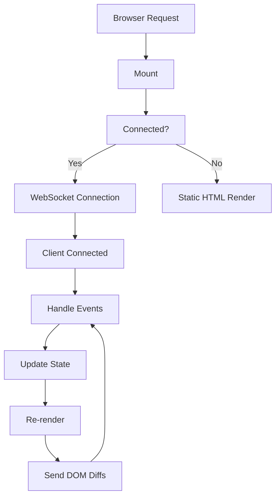
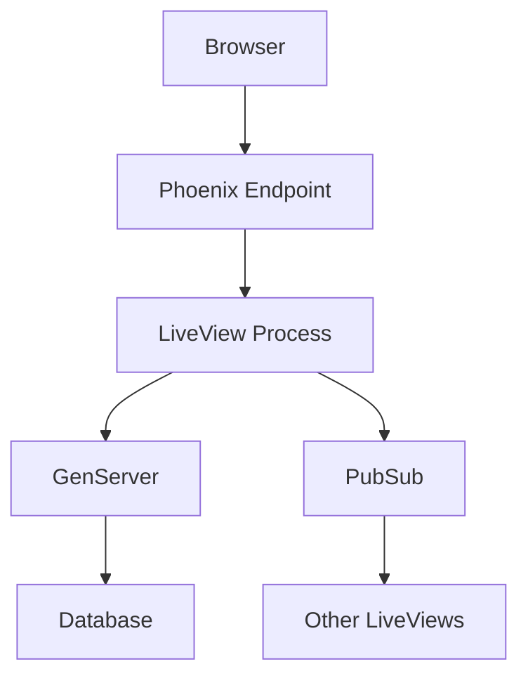
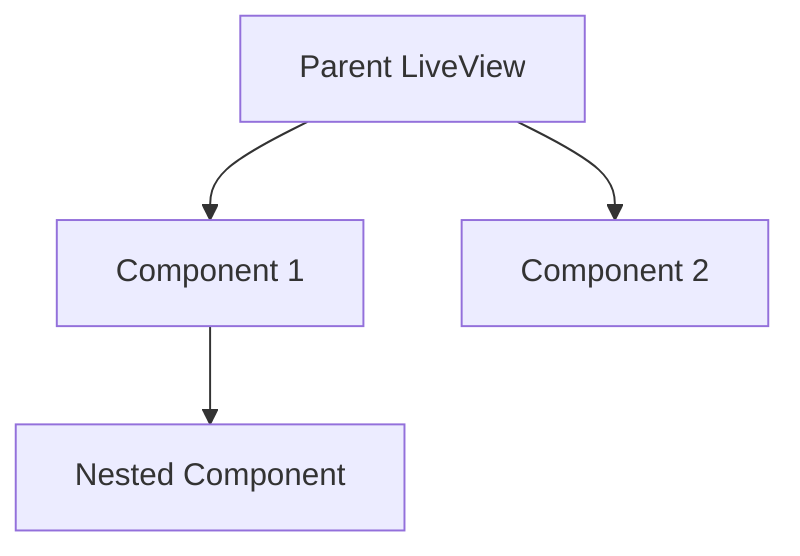

# Phoenix LiveView Crash Course: Building Interactive Web Apps with Minimal JavaScript

Phoenix LiveView is a powerful technology for building interactive web applications with minimal JavaScript. This crash course will equip you with the core knowledge (85%) you need for daily use, while providing a foundation to explore the remaining advanced topics.

## What is Phoenix LiveView?

Phoenix LiveView is a library for Phoenix applications that enables building interactive, real-time web interfaces without writing custom JavaScript. It uses a server-driven approach where the state is maintained on the server and only DOM differences are sent to the client via WebSockets.

### Key Benefits:

- **Server-Rendered**: Maintains state on the server and pushes only HTML diffs to the client
- **Simplified Programming**: No need to maintain separate client and server implementations
- **Real-Time Updates**: WebSocket connection enables instant UI updates
- **Minimal JavaScript**: Build interactive apps with little to no custom JS
- **Scalable**: Built on Elixir's lightweight process model for excellent performance

## Prerequisites

Before getting started with Phoenix LiveView, you'll need:

1. **Elixir and Erlang**: Install from the [Elixir website](https://elixir-lang.org/install.html)
2. **Phoenix Framework**: Basic familiarity with Phoenix is helpful

## Installation and Setup

Let's set up a new Phoenix project with LiveView:

```bash
# Install Phoenix
mix archive.install hex phx_new

# Create a new Phoenix project with LiveView
mix phx.new my_app --live

# Navigate to the project directory
cd my_app

# Set up the database
mix ecto.setup

# Start the Phoenix server
mix phx.server
```

Your application will be available at `http://localhost:4000`.

## Core Concepts

### LiveView Lifecycle



### 1. Mount Function

The entry point of a LiveView. It initializes the state and is called when the LiveView is first rendered:

```elixir
def mount(_params, _session, socket) do
  # Initial state setup
  products = MyApp.Catalog.list_products()

  # Return the socket with assigned values
  {:ok, assign(socket, products: products, cart_count: 0)}
end
```

### 2. Render Function

Defines the HTML structure of your LiveView. Called whenever the state changes:

```elixir
def render(assigns) do
  ~H"""
  <div class="container">
    <h1>Products</h1>
    <div class="products-list">
      <%= for product <- @products do %>
        <div class="product-card">
          <h3><%= product.name %></h3>
          <p><%= product.description %></p>
          <span class="price">$<%= product.price %></span>
          <button phx-click="add_to_cart" phx-value-id={product.id}>
            Add to Cart
          </button>
        </div>
      <% end %>
    </div>

    <div class="cart-summary">
      Items in cart: <%= @cart_count %>
    </div>
  </div>
  """
end
```

### 3. Event Handling

When a user interacts with the page, events are sent to the server:

```elixir
def handle_event("add_to_cart", %{"id" => product_id}, socket) do
  # Convert product_id to integer if needed
  product_id = String.to_integer(product_id)

  # Add logic to update cart in the database if needed
  # ...

  # Update the socket state
  {:noreply, update(socket, :cart_count, &(&1 + 1))}
end
```

## Building a Simple Counter App

Let's build a basic counter application to demonstrate LiveView in action:

```elixir
# In lib/my_app_web/live/counter_live.ex
defmodule MyAppWeb.CounterLive do
  use MyAppWeb, :live_view

  # Initialize the state
  def mount(_params, _session, socket) do
    {:ok, assign(socket, count: 0)}
  end

  # Define the HTML structure
  def render(assigns) do
    ~H"""
    <div class="counter-container">
      <h1>Counter: <%= @count %></h1>
      <button phx-click="increment">+</button>
      <button phx-click="decrement">-</button>
      <button phx-click="reset">Reset</button>
    </div>
    """
  end

  # Handle increment event
  def handle_event("increment", _params, socket) do
    {:noreply, update(socket, :count, &(&1 + 1))}
  end

  # Handle decrement event
  def handle_event("decrement", _params, socket) do
    {:noreply, update(socket, :count, &(&1 - 1))}
  end

  # Handle reset event
  def handle_event("reset", _params, socket) do
    {:noreply, assign(socket, count: 0)}
  end
end
```

Now, add this LiveView to your router:

```elixir
# In lib/my_app_web/router.ex
scope "/", MyAppWeb do
  pipe_through :browser

  live "/counter", CounterLive
end
```

## Understanding Process Communication

LiveView leverages Elixir's lightweight processes for handling state and communication:



### PubSub for Real-Time Updates

```elixir
# Subscribe to a topic when the LiveView mounts
def mount(_params, _session, socket) do
  if connected?(socket) do
    # Only subscribe when the WebSocket is connected
    Phoenix.PubSub.subscribe(MyApp.PubSub, "product:updates")
  end

  {:ok, assign(socket, products: MyApp.Catalog.list_products())}
end

# Handle messages from PubSub
def handle_info({:product_updated, product}, socket) do
  # Update the products list when a product changes
  updated_products = Enum.map(socket.assigns.products, fn p ->
    if p.id == product.id, do: product, else: p
  end)

  {:noreply, assign(socket, products: updated_products)}
end
```

## Form Handling and Validation

LiveView excels at handling forms with real-time validation:

```elixir
def render(assigns) do
  ~H"""
  <div>
    <h1>New Product</h1>

    <.form
      :let={f}
      for={@changeset}
      phx-change="validate"
      phx-submit="save">

      <div class="form-group">
        <%= label f, :name %>
        <%= text_input f, :name %>
        <%= error_tag f, :name %>
      </div>

      <div class="form-group">
        <%= label f, :price %>
        <%= number_input f, :price, step: "0.01" %>
        <%= error_tag f, :price %>
      </div>

      <div class="form-group">
        <%= label f, :description %>
        <%= textarea f, :description %>
        <%= error_tag f, :description %>
      </div>

      <div class="form-actions">
        <%= submit "Save", class: "btn btn-primary" %>
      </div>
    </.form>
  </div>
  """
end

# Initialize the form changeset
def mount(_params, _session, socket) do
  changeset = MyApp.Catalog.change_product(%MyApp.Catalog.Product{})
  {:ok, assign(socket, changeset: changeset)}
end

# Validate the form in real-time as the user types
def handle_event("validate", %{"product" => product_params}, socket) do
  changeset =
    %MyApp.Catalog.Product{}
    |> MyApp.Catalog.change_product(product_params)
    |> Map.put(:action, :validate)

  {:noreply, assign(socket, changeset: changeset)}
end

# Handle form submission
def handle_event("save", %{"product" => product_params}, socket) do
  case MyApp.Catalog.create_product(product_params) do
    {:ok, _product} ->
      {:noreply,
       socket
       |> put_flash(:info, "Product created successfully")
       |> push_redirect(to: Routes.product_index_path(socket, :index))}

    {:error, %Ecto.Changeset{} = changeset} ->
      {:noreply, assign(socket, changeset: changeset)}
  end
end
```

## LiveView Components

Components help you break down complex UIs into reusable pieces:



### Creating a Component

```elixir
defmodule MyAppWeb.ProductComponent do
  use Phoenix.Component

  # Define the component function
  def product(assigns) do
    ~H"""
    <div class="product-card" id={"product-#{@product.id}"}>
      <h3><%= @product.name %></h3>
      <p><%= @product.description %></p>
      <span class="price">$<%= @product.price %></span>

      <button phx-click="add_to_cart" phx-value-id={@product.id} phx-target={@myself}>
        Add to Cart
      </button>

      <div class="likes">Likes: <%= @likes %></div>
      <button phx-click="like" phx-target={@myself}>Like</button>
    </div>
    """
  end

  # Handle component events
  def handle_event("like", _params, socket) do
    {:noreply, update(socket, :likes, &(&1 + 1))}
  end

  def handle_event("add_to_cart", _params, socket) do
    # Send message to parent LiveView
    send(self(), {:add_to_cart, socket.assigns.product})
    {:noreply, socket}
  end
end
```

### Using Components in a LiveView

```elixir
def render(assigns) do
  ~H"""
  <div class="container">
    <h1>Products</h1>

    <div class="products-list">
      <%= for product <- @products do %>
        <.live_component
          module={MyAppWeb.ProductComponent}
          id={"product-#{product.id}"}
          product={product}
          likes={0}
        />
      <% end %>
    </div>

    <div class="cart-summary">
      Items in cart: <%= @cart_count %>
    </div>
  </div>
  """
end
```

## Authentication

Implementing authentication in LiveView:

```elixir
# In router.ex
pipeline :auth do
  plug :put_root_layout, {MyAppWeb.Layouts, :auth}
  plug :fetch_current_user
end

live_session :authenticated, on_mount: {MyAppWeb.LiveAuth, :ensure_authenticated} do
  scope "/", MyAppWeb do
    pipe_through [:browser, :auth]

    live "/dashboard", DashboardLive
    live "/profile", ProfileLive
  end
end

# In live_auth.ex
defmodule MyAppWeb.LiveAuth do
  import Phoenix.LiveView

  def on_mount(:ensure_authenticated, _params, session, socket) do
    case session do
      %{"user_id" => user_id} ->
        user = MyApp.Accounts.get_user!(user_id)
        {:cont, assign(socket, current_user: user)}

      _ ->
        {:halt, redirect(socket, to: "/login")}
    end
  end
end
```

## Navigation

You can use `live_patch` and `live_redirect` for navigation:

```elixir
def render(assigns) do
  ~H"""
  <nav>
    <.link patch={~p"/products"}>All Products</.link>
    <.link patch={~p"/products/new"}>New Product</.link>
  </nav>

  <div>
    <%= if @live_action == :index do %>
      <h2>Product Listing</h2>
      <!-- Product listing content -->
    <% else %>
      <h2>New Product</h2>
      <!-- New product form -->
    <% end %>
  </div>
  """
end

def handle_params(_params, _uri, socket) do
  {:noreply, socket}
end
```

## The Remaining 15%: Advanced Topics

As you continue your journey with Phoenix LiveView, here are the advanced topics (the remaining 15%) to explore:

1. **JavaScript Interoperability**:

   - Use JS hooks for integrating with third-party libraries
   - Custom client-side event handling
   - Advanced DOM manipulations

2. **LiveView Testing**:

   - Testing LiveView components
   - Testing real-time functionality
   - Integration tests with authentication

3. **Performance Optimization**:

   - Using temporary assigns for large lists
   - Implementing pagination
   - Stream for efficient list updates
   - Database query optimization

4. **File Upload Handling**:

   - Managing file uploads
   - Progress tracking
   - Multiple file uploads
   - Image previews

5. **Advanced State Management**:

   - Using GenServers for stateful applications
   - Implementing complex state machines
   - Event sourcing patterns

6. **Deployment and Scaling**:

   - Production environment setup
   - Load balancing considerations
   - Clustering Phoenix nodes

7. **LiveView Hooks**:
   - Advanced usage of hooks
   - Lifecycle management
   - DOM operations

## Summary

In this crash course, we've covered the core 85% of Phoenix LiveView that you'll need for daily use:

- Installation and setup
- LiveView lifecycle (mount, render, events)
- State management and updates
- Real-time communication with PubSub
- Form handling and validation
- Components and composition
- Authentication and navigation

Phoenix LiveView offers a powerful approach to building interactive web applications with minimal JavaScript. By leveraging Elixir's concurrency model and OTP principles, LiveView provides excellent performance and developer experience.

The remaining 15% (advanced topics) will become relevant as your applications grow in complexity. With the foundation from this crash course, you'll be well-equipped to explore those areas as needed.

Remember that LiveView is built on top of Phoenix and Elixir, so deepening your knowledge of those technologies will further enhance your LiveView skills.
