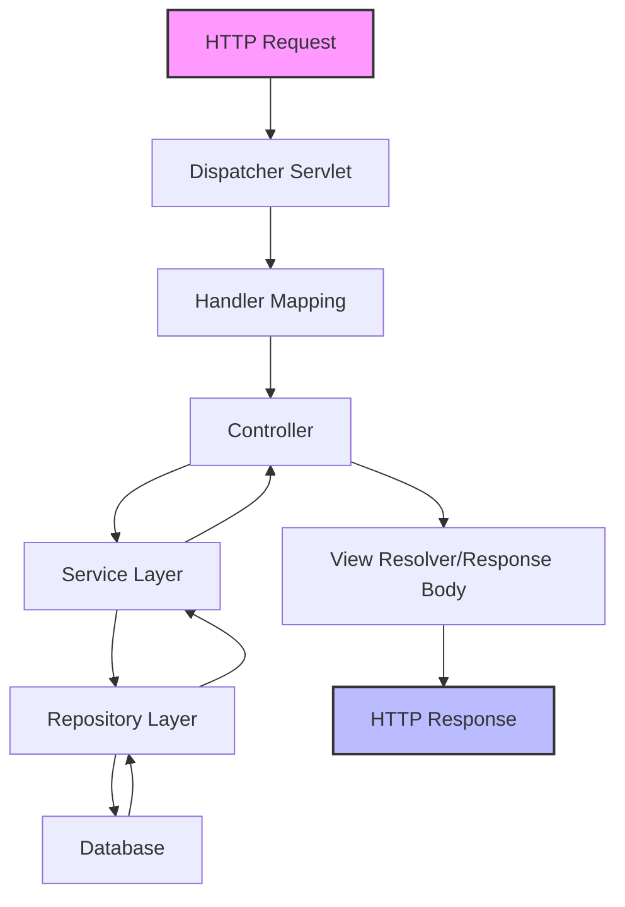
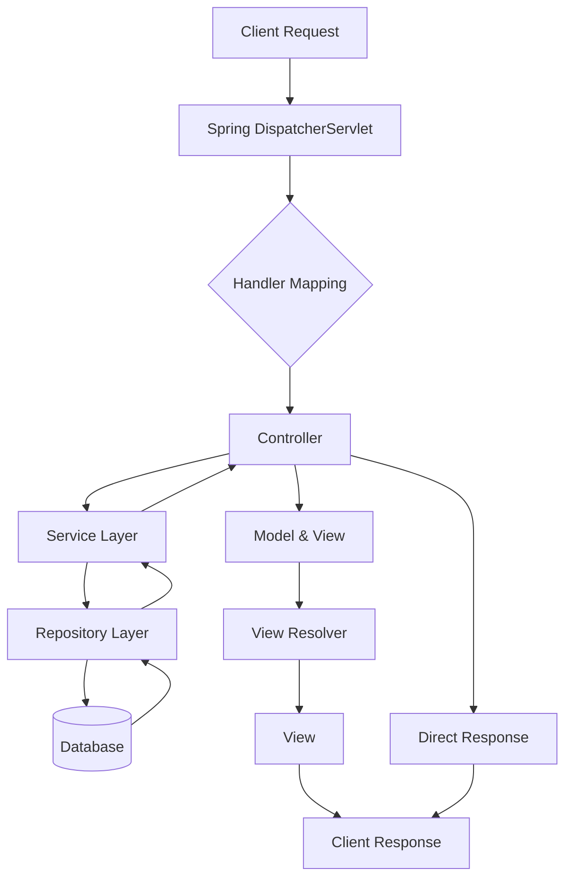
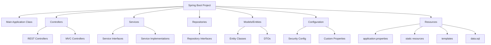
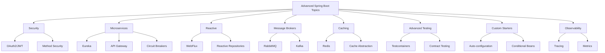

This crash course will cover 85% of what you need to know for working with Spring Boot daily, and give you a roadmap for exploring the remaining 15% independently.

## What is Spring Boot?

Spring Boot is a framework that simplifies Java application development, especially web applications and microservices. It eliminates much of the configuration overhead required by traditional Spring applications.

### Key Benefits

- **Opinionated defaults**: Pre-configured settings that work for most applications
- **Standalone applications**: Self-contained apps that run without external deployment tools
- **No XML configuration**: Uses Java-based configuration and annotations
- **Production-ready features**: Built-in monitoring, health checks, and metrics
- **Embedded server support**: Packages web servers like Tomcat directly into your application

## Prerequisites

Before starting with Spring Boot, you should have:

- Basic Java programming knowledge (Java 8 or higher, preferably Java 17)
- Understanding of object-oriented programming concepts
- Familiarity with web concepts (HTTP, REST) is helpful but not required

## Setting Up Your Development Environment

To get started with Spring Boot development, we need to set up a proper environment. This involves installing Java, choosing an IDE, and setting up a build tool.

### 1. Installing Java

First, ensure you have JDK 17 or later installed. You can check your current Java version with:

```bash
java -version
```

If you need to install or update Java, download it from Oracle's website or use OpenJDK.

### 2. Choosing an IDE

While you could use any text editor for Spring Boot development, a proper IDE will significantly improve your productivity:

- **IntelliJ IDEA**: Excellent Spring Boot support with intuitive interfaces (Community edition is free)
- **Eclipse with Spring Tool Suite (STS)**: Enhanced specifically for Spring development
- **Visual Studio Code**: Lightweight option with Java and Spring Boot extensions

### 3. Setting Up a Build Tool

Spring Boot uses either Maven or Gradle for dependency management and project building. For Maven, your basic pom.xml might look like:

```xml
<?xml version="1.0" encoding="UTF-8"?>
<project xmlns="http://maven.apache.org/POM/4.0.0" xmlns:xsi="http://www.w3.org/2001/XMLSchema-instance"
    xsi:schemaLocation="http://maven.apache.org/POM/4.0.0 https://maven.apache.org/xsd/maven-4.0.0.xsd">
    <modelVersion>4.0.0</modelVersion>

    <parent>
        <groupId>org.springframework.boot</groupId>
        <artifactId>spring-boot-starter-parent</artifactId>
        <version>3.2.0</version>
    </parent>

    <groupId>com.example</groupId>
    <artifactId>demo</artifactId>
    <version>0.0.1-SNAPSHOT</version>

    <dependencies>
        <!-- Web application -->
        <dependency>
            <groupId>org.springframework.boot</groupId>
            <artifactId>spring-boot-starter-web</artifactId>
        </dependency>

        <!-- Testing -->
        <dependency>
            <groupId>org.springframework.boot</groupId>
            <artifactId>spring-boot-starter-test</artifactId>
            <scope>test</scope>
        </dependency>
    </dependencies>

    <build>
        <plugins>
            <plugin>
                <groupId>org.springframework.boot</groupId>
                <artifactId>spring-boot-maven-plugin</artifactId>
            </plugin>
        </plugins>
    </build>
</project>
```

This configuration gives you a basic web application with testing capabilities. The spring-boot-maven-plugin handles packaging your application into an executable JAR.

## Creating Your First Spring Boot Application

Now that our environment is set up, let's create and understand our first Spring Boot application.

### Using Spring Initializr

The easiest way to start a new Spring Boot project is through Spring Initializr:

1. Go to https://start.spring.io/
2. Configure your project:
   - Choose Maven or Gradle
   - Select Java as your language
   - Choose the latest stable Spring Boot version
   - Set your project metadata (Group, Artifact, etc.)
   - Add dependencies like "Spring Web" for web applications
3. Click "Generate" to download a project template

This gives you a ready-to-use project with all necessary configurations already set up.

### Understanding the Project Structure

When you open the generated project, you'll see a structure like this:

```
my-application/
├── src/
│   ├── main/
│   │   ├── java/
│   │   │   └── com/example/demo/
│   │   │       ├── controllers/
│   │   │       ├── models/
│   │   │       ├── repositories/
│   │   │       ├── services/
│   │   │       └── DemoApplication.java
│   │   └── resources/
│   │       ├── static/
│   │       ├── templates/
│   │       └── application.properties
│   └── test/
│       └── java/
└── pom.xml (or build.gradle)
```

This structure follows Maven/Gradle conventions and separates your code, resources, and tests logically.

### Running Your First Application

The main application class serves as the entry point for your Spring Boot app:

```java
package com.example.demo;

import org.springframework.boot.SpringApplication;
import org.springframework.boot.autoconfigure.SpringBootApplication;

@SpringBootApplication // Combines @Configuration, @EnableAutoConfiguration, and @ComponentScan
public class DemoApplication {
    public static void main(String[] args) {
        SpringApplication.run(DemoApplication.class, args);
        // This starts the embedded server and sets up the Spring application context
    }
}
```

The `@SpringBootApplication` annotation is a convenience that combines three important annotations:

- `@Configuration`: Marks the class as a source of bean definitions
- `@EnableAutoConfiguration`: Tells Spring Boot to configure beans based on dependencies
- `@ComponentScan`: Tells Spring to look for components in the current package and sub-packages

You can run your application in three ways:

1. From the IDE: Click the "Run" button next to the main method
2. Using Maven/Gradle: Execute `./mvnw spring-boot:run` (Maven) or `./gradlew bootRun` (Gradle)
3. As a JAR file: Build with `./mvnw package` then run `java -jar target/demo-0.0.1-SNAPSHOT.jar`

Once running, the application will start an embedded server (default: Tomcat) on port 8080.

## Core Spring Concepts

Before diving deeper into Spring Boot, it's important to understand the core Spring concepts that form its foundation.

### Spring Application Flow Visualization

Here's how a typical request flows through a Spring Boot application:



This flow shows how Spring handles requests from start to finish, passing them through different layers of your application.

### Inversion of Control (IoC) and Dependency Injection (DI)

These two concepts are fundamental to understanding Spring:

**Inversion of Control** means Spring manages object creation and lifecycle, not your code. Instead of you creating objects, Spring creates them for you.

**Dependency Injection** is how objects receive their dependencies - Spring automatically provides them rather than having objects create their own dependencies. This makes your code more modular, testable, and maintainable.

### Spring Beans

Beans are simply objects managed by Spring. There are several ways to define them:

```java
// Method 1: Component annotation
@Component // This tells Spring to create and manage this class as a bean
public class UserService {
    // ...
}

// Method 2: Bean method in Configuration class
@Configuration
public class AppConfig {
    @Bean // This method creates a bean managed by Spring
    public UserService userService() {
        return new UserService();
    }
}
```

Spring manages the entire lifecycle of these beans, from creation to destruction, and makes them available to your application.

### Dependency Injection Types

Spring offers three ways to inject dependencies:

```java
// 1. Constructor Injection (Recommended)
@Service
public class UserService {
    private final UserRepository userRepository;

    // Spring will automatically inject the UserRepository dependency
    public UserService(UserRepository userRepository) {
        this.userRepository = userRepository;
    }
}

// 2. Setter Injection
@Service
public class UserService {
    private UserRepository userRepository;

    @Autowired // Tells Spring to inject dependency via this setter
    public void setUserRepository(UserRepository userRepository) {
        this.userRepository = userRepository;
    }
}

// 3. Field Injection (Not recommended for production)
@Service
public class UserService {
    @Autowired // Injects directly into the field
    private UserRepository userRepository;
}
```

Constructor injection is recommended because it:

- Makes dependencies explicit
- Ensures they're available when the object is created
- Works well with immutable objects (final fields)
- Makes testing easier

## Building RESTful APIs with Spring Boot

Now that we understand the core concepts, let's see how Spring Boot makes it easy to build REST APIs.

### Creating Controllers

Controllers are the entry point for HTTP requests in your application:

```java
package com.example.demo.controllers;

import org.springframework.web.bind.annotation.GetMapping;
import org.springframework.web.bind.annotation.RestController;

@RestController // Combines @Controller and @ResponseBody
public class HelloController {

    @GetMapping("/hello") // Maps HTTP GET requests to the method
    public String sayHello() {
        return "Hello, Spring Boot!"; // Returns as response body
    }
}
```

The `@RestController` annotation tells Spring that this class handles HTTP requests and returns the results directly in the response body (rather than as a view name).

### Complete REST Controller Example

Let's see a more complete example with all common HTTP methods:

```java
@RestController
@RequestMapping("/api/users") // Base path for all endpoints in this controller
public class UserController {

    private final UserService userService;

    // Constructor injection
    public UserController(UserService userService) {
        this.userService = userService;
    }

    // GET all users
    @GetMapping
    public List<User> getAllUsers() {
        return userService.findAll();
    }

    // GET a specific user
    @GetMapping("/{id}") // Path variable
    public User getUserById(@PathVariable Long id) {
        return userService.findById(id)
                .orElseThrow(() -> new ResourceNotFoundException("User not found"));
    }

    // CREATE a new user
    @PostMapping
    @ResponseStatus(HttpStatus.CREATED) // Sets 201 status code
    public User createUser(@RequestBody @Valid User user) {
        // @RequestBody converts JSON to User object
        // @Valid triggers validation of the User object
        return userService.save(user);
    }

    // UPDATE a user
    @PutMapping("/{id}")
    public User updateUser(@PathVariable Long id, @RequestBody @Valid User user) {
        return userService.update(id, user);
    }

    // DELETE a user
    @DeleteMapping("/{id}")
    @ResponseStatus(HttpStatus.NO_CONTENT) // Sets 204 status code
    public void deleteUser(@PathVariable Long id) {
        userService.deleteById(id);
    }
}
```

This controller implements a complete CRUD (Create, Read, Update, Delete) interface for users, following REST conventions.

### HTTP Request Parameters

Spring makes it easy to extract information from requests:

```java
// Query parameters: /api/users?page=1&size=10
@GetMapping
public Page<User> getUsers(
        @RequestParam(defaultValue = "0") int page, // Default if parameter is missing
        @RequestParam(defaultValue = "10") int size) {
    return userService.findPaginated(page, size);
}

// Path variables: /api/users/123
@GetMapping("/{id}")
public User getUser(@PathVariable Long id) {
    return userService.findById(id);
}
```

With `@RequestParam`, you can access query parameters, while `@PathVariable` extracts values from the URL path.

## Working with Data

Most applications need to store and retrieve data. Spring Boot makes database operations straightforward with Spring Data.

### Configuring Database Connection

First, configure your database connection in `application.properties`:

```properties
# H2 Database (for development)
spring.datasource.url=jdbc:h2:mem:testdb
spring.datasource.driverClassName=org.h2.Driver
spring.datasource.username=sa
spring.datasource.password=
spring.h2.console.enabled=true

# MySQL
# spring.datasource.url=jdbc:mysql://localhost:3306/mydatabase
# spring.datasource.username=root
# spring.datasource.password=password
# spring.datasource.driver-class-name=com.mysql.cj.jdbc.Driver
# spring.jpa.hibernate.ddl-auto=update
```

Spring Boot will automatically configure the database connection based on these properties.

### JPA Entity Example

Entities represent database tables:

```java
@Entity // Marks this class as a JPA entity (database table)
@Table(name = "users") // Specifies the table name
public class User {

    @Id // Primary key
    @GeneratedValue(strategy = GenerationType.IDENTITY) // Auto-increment
    private Long id;

    @Column(nullable = false) // Not null constraint
    private String name;

    @Column(nullable = false, unique = true) // Not null and unique constraints
    private String email;

    // Default constructor required by JPA
    public User() {
    }

    // Constructor with fields
    public User(Long id, String name, String email) {
        this.id = id;
        this.name = name;
        this.email = email;
    }

    // Getters and setters
    public Long getId() { return id; }
    public void setId(Long id) { this.id = id; }

    public String getName() { return name; }
    public void setName(String name) { this.name = name; }

    public String getEmail() { return email; }
    public void setEmail(String email) { this.email = email; }
}
```

JPA annotations map your Java class to a database table and fields to columns.

### Data Seeding Script

For development and testing, it's helpful to seed your database with initial data. Create a SQL file `data.sql` in `src/main/resources`:

```sql
-- Users table
INSERT INTO users (name, email) VALUES ('John Doe', 'john@example.com');
INSERT INTO users (name, email) VALUES ('Jane Smith', 'jane@example.com');
INSERT INTO users (name, email) VALUES ('Alice Johnson', 'alice@example.com');

-- Add more seed data as needed
```

Enable SQL initialization in `application.properties`:

```properties
spring.sql.init.mode=always
spring.jpa.defer-datasource-initialization=true
```

Spring Boot will automatically execute this script when the application starts.

### Spring Data JPA Repository

Spring Data JPA provides repositories that simplify database operations:

```java
// Extends JpaRepository to get CRUD operations automatically
public interface UserRepository extends JpaRepository<User, Long> {
    // Spring Data JPA generates implementations for these methods
    List<User> findByName(String name);
    Optional<User> findByEmail(String email);
    boolean existsByEmail(String email);
}
```

By extending `JpaRepository`, you get basic CRUD operations for free. Spring also automatically implements methods based on their names, saving you from writing SQL queries.

### Service Layer Implementation

The service layer encapsulates business logic and uses repositories to access data:

```java
@Service // Marks as a Spring service component
public class UserService {

    private final UserRepository userRepository;

    // Constructor injection
    public UserService(UserRepository userRepository) {
        this.userRepository = userRepository;
    }

    // Find all users
    public List<User> findAll() {
        return userRepository.findAll();
    }

    // Find user by ID
    public Optional<User> findById(Long id) {
        return userRepository.findById(id);
    }

    // Save a new user
    public User save(User user) {
        return userRepository.save(user);
    }

    // Delete user by ID
    public void deleteById(Long id) {
        userRepository.deleteById(id);
    }

    // Update an existing user
    public User update(Long id, User updatedUser) {
        return userRepository.findById(id)
                .map(existingUser -> {
                    // Update fields
                    existingUser.setName(updatedUser.getName());
                    existingUser.setEmail(updatedUser.getEmail());
                    // Save the updated user
                    return userRepository.save(existingUser);
                })
                .orElseThrow(() -> new ResourceNotFoundException("User not found"));
    }
}
```

This separation of concerns between controllers, services, and repositories follows good architectural practices and makes your code more maintainable.

## Spring Boot Configuration

Spring Boot's flexible configuration system allows you to customize your application for different environments.

### Configuration Properties

The main configuration file is `application.properties`:

```properties
# Server configuration
server.port=8080
server.servlet.context-path=/api

# Logging configuration
logging.level.root=INFO
logging.level.com.example=DEBUG

# Custom properties
app.feature.enabled=true
app.max-upload-size=10MB
```

These properties control various aspects of your application, from server settings to custom features.

### Using Properties in Code

There are two main ways to access configuration properties in your code:

```java
// Method 1: ConfigurationProperties
@Component
@ConfigurationProperties(prefix = "app") // Binds all properties with "app." prefix
public class AppProperties {

    private boolean featureEnabled;
    private String maxUploadSize;

    // Getters and setters required for binding
    public boolean isFeatureEnabled() { return featureEnabled; }
    public void setFeatureEnabled(boolean featureEnabled) { this.featureEnabled = featureEnabled; }

    public String getMaxUploadSize() { return maxUploadSize; }
    public void setMaxUploadSize(String maxUploadSize) { this.maxUploadSize = maxUploadSize; }
}

// Method 2: Value annotation
@Service
public class EmailService {

    @Value("${spring.mail.username}") // Injects value of this property
    private String emailSender;

    // Use the injected property
    public void sendEmail(String to, String subject, String content) {
        System.out.println("Sending email from: " + emailSender);
        // Email sending logic
    }
}
```

`@ConfigurationProperties` is great for grouping related properties, while `@Value` is simpler for individual properties.

### Profiles for Different Environments

Profiles allow you to have different configurations for different environments (development, testing, production):

```properties
# application-dev.properties
server.port=8080
logging.level.com.example=DEBUG

# application-prod.properties
server.port=80
logging.level.com.example=INFO
```

Activate profiles in `application.properties`:

```properties
spring.profiles.active=dev
```

Or when running the application:

```bash
java -jar myapp.jar --spring.profiles.active=prod
```

This makes it easy to adapt your application to different environments without changing code.

## Testing in Spring Boot

Spring Boot provides excellent support for testing at all levels.

### Unit Testing Example

Unit tests focus on testing individual components in isolation:

```java
@ExtendWith(MockitoExtension.class) // JUnit 5 extension for Mockito
public class UserServiceTest {

    @Mock // Creates a mock of UserRepository
    private UserRepository userRepository;

    @InjectMocks // Injects mocks into this service
    private UserService userService;

    @Test
    void findById_WhenUserExists_ReturnsUser() {
        // Arrange
        User expectedUser = new User(1L, "John Doe", "john@example.com");
        when(userRepository.findById(1L)).thenReturn(Optional.of(expectedUser));

        // Act
        Optional<User> result = userService.findById(1L);

        // Assert
        assertTrue(result.isPresent());
        assertEquals(expectedUser, result.get());
        verify(userRepository).findById(1L); // Verifies the method was called
    }

    @Test
    void findById_WhenUserDoesNotExist_ReturnsEmptyOptional() {
        // Arrange
        when(userRepository.findById(anyLong())).thenReturn(Optional.empty());

        // Act
        Optional<User> result = userService.findById(999L);

        // Assert
        assertTrue(result.isEmpty());
    }
}
```

This test uses Mockito to create a mock `UserRepository`, allowing us to test the `UserService` in isolation.

### Integration Testing Example

Integration tests verify that components work together correctly:

```java
@SpringBootTest // Loads the application context for testing
public class UserControllerIntegrationTest {

    @Autowired // Injects the real component from context
    private TestRestTemplate restTemplate;

    @Autowired
    private UserRepository userRepository;

    @BeforeEach // Runs before each test
    void setup() {
        userRepository.deleteAll(); // Clean database
    }

    @Test
    void createUser_ReturnsCreatedUser() {
        // Arrange
        User user = new User(null, "Jane Doe", "jane@example.com");

        // Act
        ResponseEntity<User> response = restTemplate.postForEntity(
                "/api/users", user, User.class);

        // Assert
        assertEquals(HttpStatus.CREATED, response.getStatusCode());
        assertNotNull(response.getBody());
        assertNotNull(response.getBody().getId());
        assertEquals(user.getName(), response.getBody().getName());

        // Verify user was saved to database
        assertTrue(userRepository.findByEmail("jane@example.com").isPresent());
    }
}
```

The `@SpringBootTest` annotation loads a complete application context, allowing you to test the entire application stack.

## Building and Deploying Spring Boot Applications

Once your application is ready, it's time to build and deploy it.

### Building the Application

Spring Boot applications are typically packaged as executable JAR files:

```bash
# Maven
./mvnw clean package

# Gradle
./gradlew clean build
```

This creates a "fat JAR" containing your application and all its dependencies.

### Running in Production

The JAR file can be run directly with Java:

```bash
java -jar target/myapp-0.0.1-SNAPSHOT.jar
```

You can customize the environment:

```bash
java -jar myapp.jar --server.port=8081 --spring.profiles.active=prod
```

This simplicity is one of Spring Boot's key advantages - no need for external application servers.

### Containerization with Docker

For modern deployment pipelines, containerizing your application is common:

```dockerfile
FROM eclipse-temurin:17-jre-alpine
WORKDIR /app
COPY target/*.jar app.jar
ENTRYPOINT ["java", "-jar", "app.jar"]
```

Build and run the Docker container:

```bash
# Build the image
docker build -t myapp .

# Run the container
docker run -p 8080:8080 myapp
```

Containerization makes your application more portable and easier to deploy in cloud environments.

## Monitoring with Spring Boot Actuator

Spring Boot Actuator adds production-ready features to help you monitor and manage your application.

### Adding Actuator

Add the dependency to your `pom.xml`:

```xml
<dependency>
    <groupId>org.springframework.boot</groupId>
    <artifactId>spring-boot-starter-actuator</artifactId>
</dependency>
```

### Configuring Endpoints

Configure Actuator in `application.properties`:

```properties
# Enable all actuator endpoints
management.endpoints.web.exposure.include=*

# Enable specific endpoints
# management.endpoints.web.exposure.include=health,info,metrics

# Customize info endpoint
info.app.name=My Spring Boot Application
info.app.version=1.0.0
```

Access endpoints at `/actuator/{endpoint}`, for example:

- `/actuator/health` - Application health information
- `/actuator/info` - Application information
- `/actuator/metrics` - Application metrics

These endpoints provide valuable insights into your running application, helping you monitor its health and performance.

## Spring Boot Conceptual Flow

To visualize how all these components work together:



This diagram shows how a request flows through your Spring Boot application, from the client to the database and back.

## Complete Project Structure

The architecture of a Spring Boot application typically follows this structure:



This layered architecture promotes separation of concerns, making your code more maintainable and testable.

## The Remaining 15%: Advanced Topics

Now that you've mastered the core 85% of Spring Boot, here are the advanced topics to explore as you continue your learning journey:

### 1. Spring Security

Spring Security helps you protect your application:

- **Authentication & Authorization**: Secure your application with username/password, OAuth2, or JWT
- **Method-level Security**: Control access to specific methods based on permissions
- **CSRF & CORS Protection**: Protect against cross-site attacks

### 2. Spring Cloud for Microservices

When building microservice architectures, Spring Cloud provides essential tools:

- **Service Discovery**: Register and discover services with Eureka
- **API Gateway**: Route and filter requests with Spring Cloud Gateway
- **Circuit Breakers**: Build resilient applications with Resilience4j
- **Configuration Server**: Centralize configuration across services

### 3. WebFlux and Reactive Programming

For high-concurrency applications, reactive programming offers advantages:

- **Non-blocking Applications**: Handle high concurrency efficiently
- **Reactive Streams**: Process data as streams of events
- **WebClient**: Make non-blocking HTTP requests

### 4. Message Brokers Integration

Integrate your applications with message queues for asynchronous processing:

- **Spring AMQP**: Connect to RabbitMQ
- **Spring for Apache Kafka**: Stream processing with Kafka
- **JMS Integration**: Work with traditional message queues

### 5. Caching and Performance Optimization

Improve your application's performance:

- **Spring Cache**: Abstract caching solutions
- **Redis Integration**: Distributed caching
- **Query Optimization**: Improve database performance

### 6. Advanced Testing Techniques

Take your testing to the next level:

- **Test Containers**: Isolate tests with Docker containers
- **Contract Testing**: Ensure API compatibility
- **Performance Testing**: Measure application performance

### 7. Custom Starters and Auto-configuration

Create reusable Spring Boot components:

- **Create Your Own Starters**: Package reusable functionality
- **Conditional Configuration**: Apply context-specific configurations
- **Annotation Processing**: Create custom annotations

### 8. Observability

Monitor and troubleshoot your applications in production:

- **Distributed Tracing**: Track requests across services with tools like Sleuth
- **Metrics Collection**: Gather performance data with Micrometer
- **Log Aggregation**: Centralize logging with ELK stack

## Summary of Advanced Topics



## Conclusion

This crash course has covered 85% of what you need for daily Spring Boot development. You now understand the core concepts, can build RESTful APIs, work with databases, configure your application, write tests, and deploy to production.

The advanced topics provide a roadmap for your continued learning. As you gain more experience, gradually explore these areas to take your Spring Boot skills to the next level.

Spring Boot's strength lies in its ability to handle the boilerplate configuration while giving you the flexibility to customize where needed. This combination of convention and configuration makes it a powerful tool for Java developers.

Happy coding with Spring Boot!
