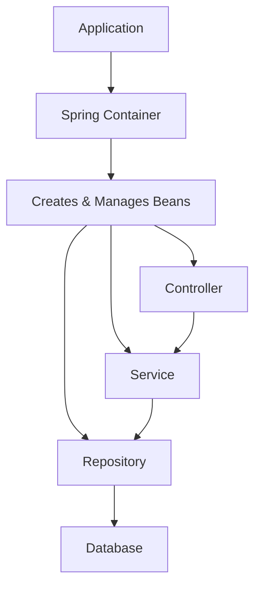
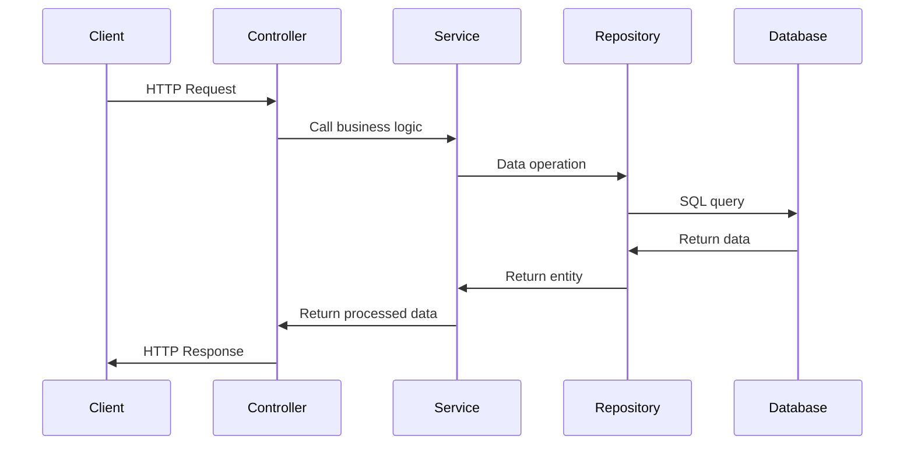

Hey there! Ready to dive into Spring Boot? It's a fantastic framework that makes Java application development much faster and easier. Let's break it down together in a way that'll get you up and running quickly!

## What is Spring Boot?

Spring Boot is like a supercharged version of the Spring Framework. While Spring itself is powerful, it can be complex to configure. Spring Boot simplifies this with:

- **Auto-configuration**: It makes educated guesses about what you need
- **Standalone applications**: No need for complex deployment
- **Opinionated defaults**: Less decision fatigue for you

Think of Spring as a toolbox with many tools, and Spring Boot as that same toolbox but pre-arranged with the most commonly used tools ready to go!

## Prerequisites

Before we start, you'll need:

- Java Development Kit (JDK) 17 or newer
- A build tool (Maven or Gradle)
- An IDE (IntelliJ IDEA, Eclipse, or VS Code)

## Getting Started

### 1. Installing Java

If you don't have Java installed:

```bash
# For Ubuntu/Debian
sudo apt install openjdk-17-jdk

# For macOS (using Homebrew)
brew install openjdk@17

# For Windows, download from Oracle website and run installer
```

Verify your installation:

```bash
java -version
# Should show Java version 17 or higher
```

### 2. Creating Your First Spring Boot Project

The easiest way is using Spring Initializr (https://start.spring.io/). Let's set up a basic web application:

1. Select:

   - **Project**: Maven or Gradle (Maven is more common)
   - **Language**: Java
   - **Spring Boot**: Latest stable version
   - **Group**: com.example (your organization name)
   - **Artifact**: myapp (your project name)
   - **Dependencies**: Spring Web, Spring Data JPA, H2 Database

2. Click "Generate" to download a ZIP file
3. Extract and open in your IDE

Alternatively, use the command line:

```bash
# Using Spring Boot CLI
spring init --dependencies=web,data-jpa,h2 myapp

# Or using curl
curl https://start.spring.io/starter.zip -d dependencies=web,data-jpa,h2 -d type=maven-project -d javaVersion=17 -o myapp.zip
```

## Core Concepts

### Project Structure

When you unzip your project, you'll see a structure like this:

```
myapp/
├── src/
│   ├── main/
│   │   ├── java/
│   │   │   └── com/
│   │   │       └── example/
│   │   │           └── myapp/
│   │   │               └── MyappApplication.java
│   │   └── resources/
│   │       ├── application.properties
│   │       ├── static/
│   │       └── templates/
│   └── test/
└── pom.xml (or build.gradle)
```

The main application class looks like:

```java
@SpringBootApplication
public class MyappApplication {
    public static void main(String[] args) {
        SpringApplication.run(MyappApplication.class, args);
    }
}
```

That `@SpringBootApplication` annotation does a TON of work behind the scenes!

### Dependency Injection & IoC

Spring Boot relies heavily on Dependency Injection (DI). Instead of creating objects manually, Spring creates and manages them for you:

```java
@Service
public class UserService {
    private final UserRepository userRepository;

    // Spring automatically injects the UserRepository
    public UserService(UserRepository userRepository) {
        this.userRepository = userRepository;
    }

    // Methods to handle user operations
}
```

The main annotations you'll use are:

- `@Component`: Generic Spring-managed component
- `@Service`: Business logic layer
- `@Repository`: Data access layer
- `@Controller`/`@RestController`: Web controllers
- `@Autowired`: Marks where injection should happen (constructor injection is preferred)

Let's visualize the DI flow:



## Building a REST API

Now let's create a simple REST API. We'll build a todo list app:

1. First, create a model class:

```java
@Entity
public class Todo {
    @Id
    @GeneratedValue(strategy = GenerationType.IDENTITY)
    private Long id;

    private String task;
    private boolean completed;

    // Getters and setters
    public Long getId() { return id; }
    public void setId(Long id) { this.id = id; }

    public String getTask() { return task; }
    public void setTask(String task) { this.task = task; }

    public boolean isCompleted() { return completed; }
    public void setCompleted(boolean completed) { this.completed = completed; }
}
```

2. Create a repository interface:

```java
@Repository
public interface TodoRepository extends JpaRepository<Todo, Long> {
    // Spring Data JPA auto-generates common CRUD operations!

    // Custom query methods
    List<Todo> findByCompleted(boolean completed);
}
```

3. Create a service:

```java
@Service
public class TodoService {
    private final TodoRepository todoRepository;

    public TodoService(TodoRepository todoRepository) {
        this.todoRepository = todoRepository;
    }

    public List<Todo> getAllTodos() {
        return todoRepository.findAll();
    }

    public Todo saveTodo(Todo todo) {
        return todoRepository.save(todo);
    }

    public Optional<Todo> getTodoById(Long id) {
        return todoRepository.findById(id);
    }

    public void deleteTodo(Long id) {
        todoRepository.deleteById(id);
    }
}
```

4. Create a controller:

```java
@RestController
@RequestMapping("/api/todos")
public class TodoController {
    private final TodoService todoService;

    public TodoController(TodoService todoService) {
        this.todoService = todoService;
    }

    @GetMapping
    public List<Todo> getAllTodos() {
        return todoService.getAllTodos();
    }

    @GetMapping("/{id}")
    public ResponseEntity<Todo> getTodoById(@PathVariable Long id) {
        return todoService.getTodoById(id)
                .map(ResponseEntity::ok)
                .orElse(ResponseEntity.notFound().build());
    }

    @PostMapping
    public Todo createTodo(@RequestBody Todo todo) {
        return todoService.saveTodo(todo);
    }

    @PutMapping("/{id}")
    public ResponseEntity<Todo> updateTodo(@PathVariable Long id, @RequestBody Todo todo) {
        return todoService.getTodoById(id)
                .map(existingTodo -> {
                    todo.setId(id);
                    return ResponseEntity.ok(todoService.saveTodo(todo));
                })
                .orElse(ResponseEntity.notFound().build());
    }

    @DeleteMapping("/{id}")
    public ResponseEntity<Void> deleteTodo(@PathVariable Long id) {
        if (todoService.getTodoById(id).isPresent()) {
            todoService.deleteTodo(id);
            return ResponseEntity.noContent().build();
        }
        return ResponseEntity.notFound().build();
    }
}
```

The request flow works like this:



## Database Configuration

Let's set up our database connection. In `application.properties`:

```properties
# H2 Database config (for development)
spring.datasource.url=jdbc:h2:mem:tododb
spring.datasource.driverClassName=org.h2.Driver
spring.datasource.username=sa
spring.datasource.password=password
spring.jpa.database-platform=org.hibernate.dialect.H2Dialect

# Enable H2 console
spring.h2.console.enabled=true
spring.h2.console.path=/h2-console

# JPA/Hibernate config
spring.jpa.hibernate.ddl-auto=update
spring.jpa.show-sql=true
```

To seed our database with initial data, create a `data.sql` file in the `src/main/resources` folder:

```sql
INSERT INTO todo (task, completed) VALUES ('Learn Spring Boot', false);
INSERT INTO todo (task, completed) VALUES ('Build a REST API', false);
INSERT INTO todo (task, completed) VALUES ('Connect to database', true);
INSERT INTO todo (task, completed) VALUES ('Write unit tests', false);
```

## Application Profiles

Spring Boot allows different configurations for different environments:

```properties
# application-dev.properties
spring.datasource.url=jdbc:h2:mem:tododb
spring.jpa.hibernate.ddl-auto=update

# application-prod.properties
spring.datasource.url=jdbc:postgresql://localhost:5432/tododb
spring.datasource.username=${DB_USERNAME}
spring.datasource.password=${DB_PASSWORD}
spring.jpa.hibernate.ddl-auto=validate
```

Activate a profile:

```bash
# Command line
java -jar myapp.jar --spring.profiles.active=dev

# Or in application.properties
spring.profiles.active=dev
```

## Testing Your Application

Spring Boot makes testing easy with `spring-boot-starter-test`:

```java
@SpringBootTest
class TodoServiceTest {
    @Autowired
    private TodoService todoService;

    @MockBean
    private TodoRepository todoRepository;

    @Test
    void shouldReturnAllTodos() {
        // Given
        List<Todo> todos = List.of(
            new Todo(1L, "Test todo", false)
        );
        when(todoRepository.findAll()).thenReturn(todos);

        // When
        List<Todo> result = todoService.getAllTodos();

        // Then
        assertEquals(1, result.size());
        assertEquals("Test todo", result.get(0).getTask());
    }
}
```

For controller tests:

```java
@WebMvcTest(TodoController.class)
class TodoControllerTest {
    @Autowired
    private MockMvc mockMvc;

    @MockBean
    private TodoService todoService;

    @Test
    void shouldReturnTodos() throws Exception {
        // Given
        List<Todo> todos = List.of(new Todo(1L, "Test todo", false));
        when(todoService.getAllTodos()).thenReturn(todos);

        // When/Then
        mockMvc.perform(get("/api/todos"))
               .andExpect(status().isOk())
               .andExpect(jsonPath("$[0].task").value("Test todo"));
    }
}
```

## Running Your Application

To run your Spring Boot app:

```bash
# Using Maven
./mvnw spring-boot:run

# Using Gradle
./gradlew bootRun

# Or build and run the JAR
./mvnw package
java -jar target/myapp-0.0.1-SNAPSHOT.jar
```

Access your application at `http://localhost:8080` and the H2 console at `http://localhost:8080/h2-console`

## Handling Exceptions

Add global exception handling:

```java
@RestControllerAdvice
public class GlobalExceptionHandler {

    @ExceptionHandler(ResourceNotFoundException.class)
    public ResponseEntity<ErrorResponse> handleResourceNotFound(ResourceNotFoundException ex) {
        ErrorResponse error = new ErrorResponse("NOT_FOUND", ex.getMessage());
        return new ResponseEntity<>(error, HttpStatus.NOT_FOUND);
    }

    @ExceptionHandler(Exception.class)
    public ResponseEntity<ErrorResponse> handleGenericException(Exception ex) {
        ErrorResponse error = new ErrorResponse("INTERNAL_ERROR", "An unexpected error occurred");
        return new ResponseEntity<>(error, HttpStatus.INTERNAL_SERVER_ERROR);
    }

    // Error response class
    private record ErrorResponse(String code, String message) {}
}

// Custom exception
public class ResourceNotFoundException extends RuntimeException {
    public ResourceNotFoundException(String message) {
        super(message);
    }
}
```

## The Last 15%: What's Left to Explore

You now have a solid foundation for Spring Boot development! The remaining 15% includes:

1. **Advanced Security**

   - OAuth2 and JWT authentication
   - Method-level security
   - Cross-Site Request Forgery (CSRF) protection

2. **Microservice Architecture**

   - Spring Cloud
   - Service discovery (Eureka)
   - API gateways
   - Circuit breakers (Resilience4j)

3. **Messaging**

   - Spring AMQP (RabbitMQ)
   - Kafka integration
   - WebSockets

4. **Caching**

   - Redis integration
   - Local caching with Caffeine

5. **Monitoring & Observability**

   - Actuator endpoints
   - Prometheus and Grafana
   - Distributed tracing with Sleuth and Zipkin

6. **Reactive Programming**

   - Spring WebFlux
   - Reactive data access

7. **Advanced Database Techniques**

   - Multi-tenancy
   - Database migration (Flyway/Liquibase)
   - Query optimization

8. **Event-Driven Architecture**

   - Domain events
   - Event sourcing
   - CQRS

9. **Deployment & DevOps**

   - Containerization with Docker
   - Kubernetes deployment
   - CI/CD pipelines

10. **Production-Ready Features**
    - Graceful shutdown
    - Rate limiting
    - Advanced logging
