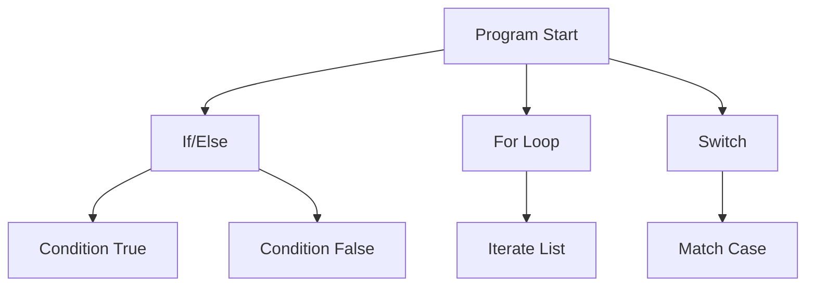
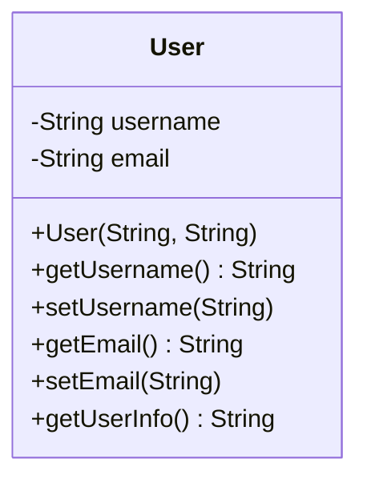
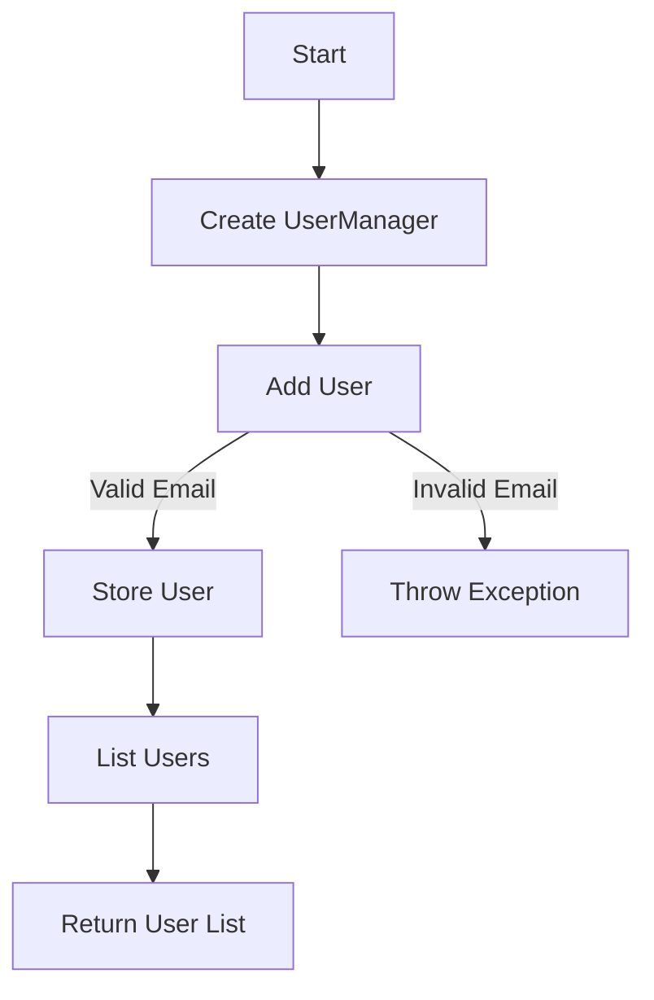
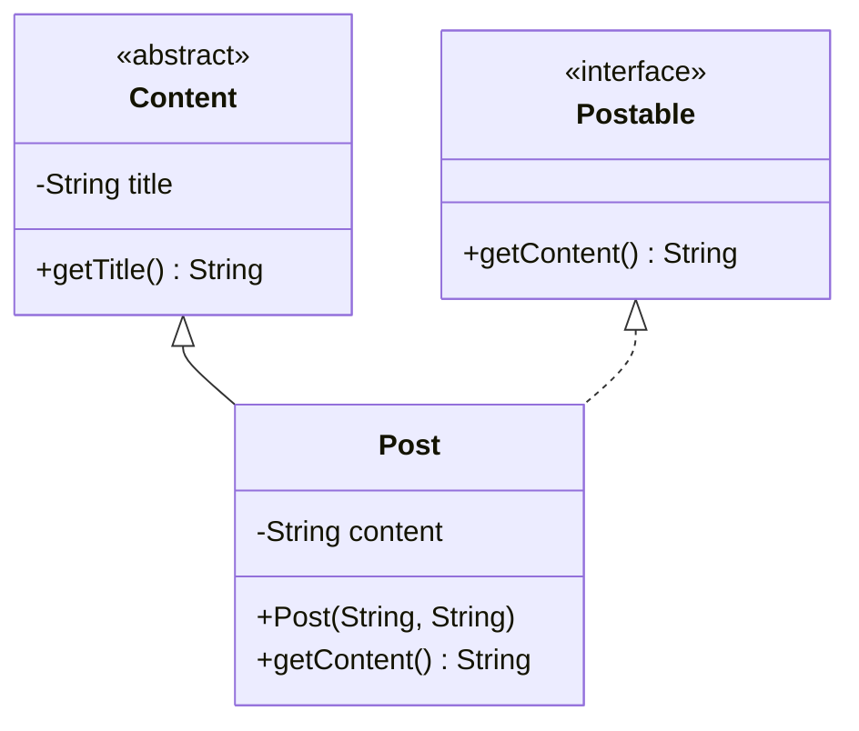
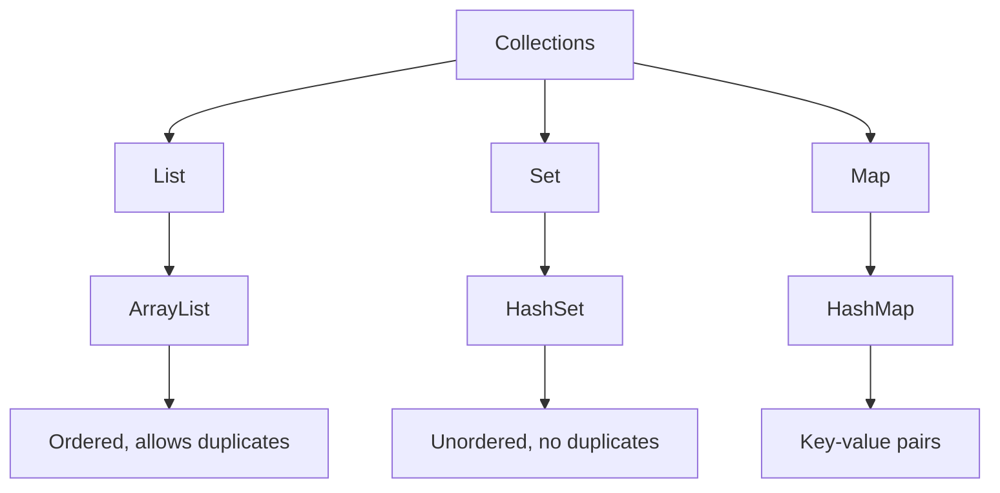
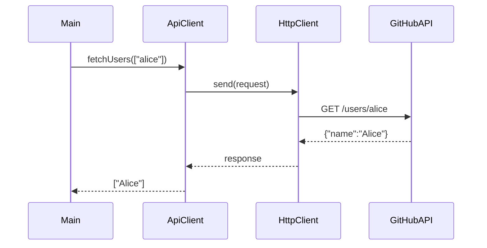

This cheatsheet is a clear, concise reference for the _SWE - Spring Boot - Prerequisite Course (Just Enough Java)_, designed for web developers with no Java experience but familiar with JavaScript, JSON, REST APIs, and frontend testing (e.g., Jest). It introduces essential Java concepts—syntax, OOP, collections, Streams, testing, and REST API integration—required for Spring Boot, using analogies to frontend concepts for easy understanding. Each section includes key concepts, heavily commented code examples adhering to the _Code Commenting Guideline for Software Engineering Course_ with output comments, run commands with explanations, Mermaid diagrams for visual clarity, practical tips, and common pitfalls.

## 1. Java Syntax and Basics

### Overview

Learn fundamental Java syntax—variables, control flow, JSON parsing, and output—comparable to JavaScript basics, preparing you for Spring Boot backend development.

### Key Concepts

- **Variables and Data Types**: Java uses explicit types (e.g., `int`, `String`), like TypeScript, ensuring type safety for backend logic.
- **Control Flow**: `if/else`, `for`, `switch` statements, similar to JavaScript, control program flow.
- **JSON Parsing**: Jackson library processes JSON, like `JSON.parse`, for API data handling.
- **Input/Output**: `System.out.println` outputs to console, like `console.log`, for debugging.

### Mermaid Diagram: Control Flow



**Diagram Explanation**:

- This flowchart visualizes Java control flow, showing how `if/else`, `for`, and `switch` direct program execution, similar to JavaScript control structures.

### Syntax Examples

```java
// File: SyntaxExamples.java
// Description: Demonstrates Java syntax for variables, control flow, and JSON parsing.
// Author: wkf
// Date: 2025-07-07
// Course: SWE - Spring Boot - Prerequisite

import com.fasterxml.jackson.databind.ObjectMapper;
import java.util.Map;

// Defines a class to showcase basic Java syntax
public class SyntaxExamples {
    // Main method, entry point like JavaScript's main function
    public static void main(String[] args) {
        // Declare typed variables, like TypeScript
        int age = 25;          // Integer, like let age = 25
        String name = "Alice"; // String, like const name = "Alice"
        boolean isActive = true; // Boolean, like let isActive = true

        // If/else for decision-making, like JavaScript if/else
        if (age >= 18) {
            System.out.println("Adult"); // Console output
            // Output: Adult
        } else {
            System.out.println("Minor");
        }

        // For loop to iterate, like JavaScript for...of
        for (int i = 0; i < 3; i++) {
            System.out.println("Count: " + i); // Concatenate and print
            // Output: Count: 0
            // Output: Count: 1
            // Output: Count: 2
        }

        // Parse JSON using Jackson, like JSON.parse
        ObjectMapper mapper = new ObjectMapper();
        String json = "{\"name\":\"Alice\",\"age\":25}";
        try {
            Map<String, Object> data = mapper.readValue(json, Map.class); // Parse to Map
            System.out.println("Parsed name: " + data.get("name")); // Access field
            // Output: Parsed name: Alice
        } catch (Exception e) {
            System.out.println("JSON error: " + e.getMessage()); // Handle parsing errors
        }
    }
}
```

**Run Command**:

```bash
mvn exec:java -Dexec.mainClass="SyntaxExamples"
```

**Why This Command**:

- The `mvn exec:java` command executes the `main` method of `SyntaxExamples`, compiling and running the code to display variable declarations, control flow, and JSON parsing results, similar to `node script.js` in JavaScript.

### Quick Reference Table

| Concept      | Java Syntax                         | JavaScript Equivalent         |
| ------------ | ----------------------------------- | ----------------------------- |
| Variable     | `int x = 5;`                        | `let x = 5;`                  |
| If/Else      | `if (x > 0) { ... }`                | `if (x > 0) { ... }`          |
| For Loop     | `for (int i = 0; i < n; i++)`       | `for (let i = 0; i < n; i++)` |
| JSON Parsing | `mapper.readValue(json, Map.class)` | `JSON.parse(json)`            |

### Analogy

- Java’s typed variables are like TypeScript’s type safety, ensuring reliable backend code.

### Common Pitfalls

- **Type Errors**: Ensure variable types match (e.g., `int x = "text"` fails).
- **Missing Semicolon**: Java requires `;` after statements, unlike JavaScript’s optional semicolons.
- **JSON Dependency**: Add `com.fasterxml.jackson.core:jackson-databind` to `pom.xml` for Jackson.

## 2. Basic Object-Oriented Programming (OOP)

### Overview

Understand Java OOP—classes, objects, encapsulation, and methods—comparable to JavaScript classes, forming the foundation for Spring Boot data models.

### Key Concepts

- **Classes and Objects**: Classes are blueprints, objects are instances, like JavaScript classes.
- **Encapsulation**: Private fields with getters/setters protect data, like JavaScript’s `#fields`.
- **Constructors**: Initialize objects, like JavaScript class constructors.
- **Methods**: Define behavior, like JavaScript class methods, for reusable logic.

### Mermaid Diagram: Class Structure



**Diagram Explanation**:

- This class diagram visualizes the `User` class with private fields and public methods, mirroring a JavaScript class or React component state.

### Syntax Examples

```java
// File: User.java
// Description: Defines a User class with encapsulation for user data.
// Author: wkf
// Date: 2025-07-07
// Course: SWE - Spring Boot - Prerequisite

public class User {
    // Private fields for encapsulation, like #fields in JavaScript
    private String username; // Stores user’s name
    private String email;   // Stores user’s email

    // Constructor to initialize User, like JavaScript constructor
    // Inputs: username (String), email (String)
    public User(String username, String email) {
        this.username = username; // Set field, avoiding shadowing
        this.email = email;      // Set field
    }

    // Getter for username
    // Returns: username (String)
    public String getUsername() {
        return username; // Access private field
    }

    // Setter for username
    // Inputs: username (String)
    public void setUsername(String username) {
        this.username = username; // Update private field
    }

    // Getter for email
    // Returns: email (String)
    public String getEmail() {
        return email;
    }

    // Setter for email
    // Inputs: email (String)
    public void setEmail(String email) {
        this.email = email;
    }

    // Returns formatted user info
    // Returns: username and email (String)
    public String getUserInfo() {
        return username + " (" + email + ")"; // Combine fields
    }
}

// File: Main.java
// Description: Demonstrates usage of User class.
// Author: wkf
// Date: 2025-07-07
// Course: SWE - Spring Boot - Prerequisite

public class Main {
    public static void main(String[] args) {
        // Create User object, like new User() in JavaScript
        User user = new User("alice", "alice@example.com");
        // Print user info
        System.out.println(user.getUserInfo()); // Output: alice (alice@example.com)
    }
}
```

**Run Command**:

```bash
mvn exec:java -Dexec.mainClass="Main"
```

**Why This Command**:

- The `mvn exec:java` command executes the `main` method of `Main`, creating a `User` object and displaying its info, similar to running a JavaScript script with `node`.

### Quick Reference Table

| Concept       | Java Syntax                        | JavaScript Equivalent       |
| ------------- | ---------------------------------- | --------------------------- |
| Class         | `public class User { ... }`        | `class User { ... }`        |
| Private Field | `private String username;`         | `#username;`                |
| Constructor   | `public User(String name) { ... }` | `constructor(name) { ... }` |
| Getter        | `public String getUsername()`      | `get username() { ... }`    |

### Analogy

- Java classes are like React components, structuring data for backend use.

### Common Pitfalls

- **Shadowing**: Use `this` in constructors to avoid variable shadowing.
- **Public Fields**: Use `private` to enforce encapsulation.
- **Null Values**: Initialize fields to prevent `NullPointerException`.

## 3. Unit Testing with JUnit 5

### Overview

Master unit testing with JUnit 5, similar to Jest, to ensure reliable backend logic for Spring Boot applications.

### Key Concepts

- **JUnit 5**: Testing framework for unit tests, like Jest for JavaScript.
- **Annotations**: `@Test`, `@BeforeEach` for setup, like Jest’s `test` and `beforeEach`.
- **Assertions**: `assertEquals`, `assertTrue` verify results, like Jest’s `expect`.

### Syntax Examples

```java
// File: EmailValidator.java
// Description: Validates email addresses for user management.
// Author: wkf
// Date: 2025-07-07
// Course: SWE - Spring Boot - Prerequisite

public class EmailValidator {
    // Validates email format, like JavaScript regex
    // Inputs: email (String)
    // Returns: true if valid, false otherwise
    public boolean isValid(String email) {
        return email != null && email.contains("@"); // Basic validation
    }
}

// File: EmailValidatorTest.java
// Description: Tests EmailValidator using JUnit 5.
// Author: wkf
// Date: 2025-07-07
// Course: SWE - Spring Boot - Prerequisite

import org.junit.jupiter.api.BeforeEach;
import org.junit.jupiter.api.Test;
import static org.junit.jupiter.api.Assertions.*;

public class EmailValidatorTest {
    private EmailValidator validator; // Test instance

    // Sets up validator before each test, like Jest beforeEach
    @BeforeEach
    void setUp() {
        validator = new EmailValidator(); // Initialize instance
    }

    // Tests valid email
    @Test
    void testValidEmail() {
        boolean result = validator.isValid("alice@example.com"); // Test valid input
        assertTrue(result); // Expect true, like expect(result).toBe(true)
        // Output: Test passes if result is true
    }

    // Tests invalid email
    @Test
    void testInvalidEmail() {
        boolean result = validator.isValid("alice"); // Test invalid input
        assertFalse(result); // Expect false
        // Output: Test passes if result is false
    }
}
```

**Run Command**:

```bash
mvn test
```

**Why This Command**:

- The `mvn test` command runs all JUnit tests, executing `EmailValidatorTest` to verify `EmailValidator` functionality. It compiles the code and outputs test results, similar to `npm test` in JavaScript.

### Quick Reference Table

| JUnit Annotation | Purpose               | Jest Equivalent       |
| ---------------- | --------------------- | --------------------- |
| `@Test`          | Marks a test method   | `test()`              |
| `@BeforeEach`    | Runs before each test | `beforeEach()`        |
| `assertEquals`   | Checks equality       | `expect().toEqual()`  |
| `assertTrue`     | Checks true condition | `expect().toBe(true)` |

### Analogy

- JUnit 5 is like Jest, ensuring backend logic reliability similar to frontend testing.

### Common Pitfalls

- **Missing Imports**: Import `org.junit.jupiter.api.*` for JUnit 5.
- **Setup Duplication**: Use `@BeforeEach` to avoid repetitive setup code.
- **Assertion Mismatch**: Ensure expected and actual values align in type.

## 4. Intermediate Capstone: User Manager

### Overview

Build a console-based user manager with OOP and JUnit, simulating a backend user system, like a frontend user store.

### Key Concepts

- **OOP Application**: Combine classes, encapsulation, and validation for user management.
- **Testing**: Use JUnit 5 to test functionality, like Jest for state management.
- **Data Validation**: Enforce rules for user input, like frontend form validation.

### Mermaid Diagram: User Manager Workflow



**Diagram Explanation**:

- This flowchart shows the `UserManager` workflow, illustrating user addition with validation and listing, similar to a frontend form submission and state retrieval.

### Example Code

```java
// File: User.java
// Description: Defines a User class for user manager.
// Author: wkf
// Date: 2025-07-07
// Course: SWE - Spring Boot - Prerequisite

public class User {
    private String username; // Stores user’s name
    private String email;    // Stores user’s email

    // Constructor for User
    // Inputs: username (String), email (String)
    public User(String username, String email) {
        this.username = username;
        this.email = email;
    }

    // Getter for username
    public String getUsername() {
        return username;
    }

    // Getter for email
    public String getEmail() {
        return email;
    }
}

// File: UserManager.java
// Description: Manages users with validation, like a Redux store.
// Author: wkf
// Date: 2025-07-07
// Course: SWE - Spring Boot - Prerequisite

import java.util.*;

public class UserManager {
    // List for users, like a JavaScript array
    private List<User> users = new ArrayList<>();

    // Adds a user with email validation
    // Inputs: username (String), email (String)
    // Throws: IllegalArgumentException if email is invalid
    public void addUser(String username, String email) {
        if (email == null || !email.contains("@")) {
            throw new IllegalArgumentException("Invalid email"); // Validate email
        }
        users.add(new User(username, email)); // Add user
    }

    // Returns copy of users list
    // Returns: List of User objects
    public List<User> listUsers() {
        return new ArrayList<>(users); // Defensive copy
    }
}

// File: UserManagerTest.java
// Description: Tests UserManager with JUnit 5.
// Author: wkf
// Date: 2025-07-07
// Course: SWE - Spring Boot - Prerequisite

import org.junit.jupiter.api.BeforeEach;
import org.junit.jupiter.api.Test;
import static org.junit.jupiter.api.Assertions.*;

public class UserManagerTest {
    private UserManager manager; // Test instance

    // Sets up manager before each test
    @BeforeEach
    void setUp() {
        manager = new UserManager(); // Initialize instance
    }

    // Tests adding a valid user
    @Test
    void testAddUser() {
        manager.addUser("alice", "alice@example.com"); // Add valid user
        List<User> users = manager.listUsers(); // Get users
        assertEquals(1, users.size()); // Check size
        assertEquals("alice", users.get(0).getUsername()); // Check username
        // Output: Test passes if size is 1 and username is "alice"
    }

    // Tests invalid email
    @Test
    void testInvalidEmail() {
        assertThrows(IllegalArgumentException.class, () -> {
            manager.addUser("bob", "bob"); // Should throw error
        });
        // Output: Test passes if IllegalArgumentException is thrown
    }
}
```

**Run Command**:

```bash
mvn test
```

**Why This Command**:

- The `mvn test` command runs all JUnit tests, executing `UserManagerTest` to verify `UserManager` functionality. It compiles the code and outputs test results, similar to `npm test`.

### Analogy

- The user manager is like a Redux store, managing user data with validation.

### Common Pitfalls

- **Mutable Lists**: Return defensive copies to prevent external changes.
- **Validation Gaps**: Strengthen email validation with regex for production.
- **Test Coverage**: Test both valid and invalid cases.

## 5. Advanced OOP

### Overview

Explore advanced OOP—inheritance, interfaces, and polymorphism—like JavaScript class extensions, for flexible Spring Boot data models.

### Key Concepts

- **Inheritance**: Extend classes with `extends`, like JavaScript `class extends`.
- **Interfaces**: Define contracts with `interface`, like TypeScript interfaces.
- **Polymorphism**: Use parent types for child objects, like JavaScript prototypal inheritance.
- **Abstract Classes**: Provide shared logic, like base React components.

### Mermaid Diagram: Class Hierarchy



**Diagram Explanation**:

- This class diagram shows the `Content` abstract class, `Postable` interface, and `Post` class, illustrating inheritance and interface implementation, like JavaScript class hierarchies.

### Syntax Examples

```java
// File: Postable.java
// Description: Interface for content objects.
// Author: wkf
// Date: 2025-07-07
// Course: SWE - Spring Boot - Prerequisite

public interface Postable {
    // Defines method for content retrieval
    String getContent();
}

// File: Content.java
// Description: Abstract class for shared content logic.
// Author: wkf
// Date: 2025-07-07
// Course: SWE - Spring Boot - Prerequisite

public abstract class Content {
    // Protected field for subclasses
    protected String title;

    // Getter for title
    public String getTitle() {
        return title;
    }
}

// File: Post.java
// Description: Implements Postable and extends Content.
// Author: wkf
// Date: 2025-07-07
// Course: SWE - Spring Boot - Prerequisite

public class Post extends Content implements Postable {
    // Private field for content
    private String content;

    // Constructor to initialize fields
    // Inputs: title (String), content (String)
    public Post(String title, String content) {
        this.title = title; // Set inherited field
        this.content = content; // Set local field
    }

    // Implements Postable method
    // Returns: content (String)
    @Override
    public String getContent() {
        return content;
    }
}

// File: Main.java
// Description: Demonstrates polymorphism with Post class.
// Author: wkf
// Date: 2025-07-07
// Course: SWE - Spring Boot - Prerequisite

public class Main {
    public static void main(String[] args) {
        // Create Post object
        Post post = new Post("Blog", "Hello World");
        // Use as Content type (polymorphism)
        Content content = post;
        // Use as Postable type
        Postable postable = post;
        // Call interface method
        System.out.println(postable.getContent()); // Output: Hello World
    }
}
```

**Run Command**:

```bash
mvn exec:java -Dexec.mainClass="Main"
```

**Why This Command**:

- The `mvn exec:java` command executes the `main` method of `Main`, demonstrating polymorphism with the `Post` class, similar to running a JavaScript script.

### Quick Reference Table

| Concept        | Java Syntax                      | JavaScript Equivalent        |
| -------------- | -------------------------------- | ---------------------------- |
| Inheritance    | `class Post extends Content`     | `class Post extends Content` |
| Interface      | `interface Postable { ... }`     | `TypeScript interface`       |
| Abstract Class | `abstract class Content { ... }` | `abstract class` (TS)        |
| Polymorphism   | `Content c = new Post(...)`      | `let c = new Post(...)`      |

### Analogy

- Interfaces are like React prop types; inheritance is like extending CSS classes.

### Common Pitfalls

- **Missing Implementations**: Implement all interface methods or mark class `abstract`.
- **Override Errors**: Use `@Override` for correct method signatures.
- **Casting Issues**: Check types with `instanceof` to avoid `ClassCastException`.

## 6. Java Collections and Streams

### Overview

Master Java collections (`List`, `Set`, `Map`) and Streams for data processing, like JavaScript arrays and `Array.prototype` methods.

### Key Concepts

- **Collections**: `List`, `Set`, `Map` store data, like JavaScript arrays/objects.
- **Streams**: Functional processing with `stream()`, like `map`, `filter` in JavaScript.
- **Lambda Expressions**: Anonymous functions, like JavaScript arrow functions (`=>`).
- **Generics**: Type-safe collections, like TypeScript generics.

### Mermaid Diagram: Collection Types



**Diagram Explanation**:

- This diagram shows Java collection types and their implementations, highlighting properties like order and duplicates, similar to JavaScript’s `Array`, `Set`, and `Map`.

### Syntax Examples

```java
// File: CollectionsDemo.java
// Description: Demonstrates collections and Streams for data processing.
// Author: wkf
// Date: 2025-07-07
// Course: SWE - Spring Boot - Prerequisite

import java.util.*;
import java.util.stream.Collectors;

public class CollectionsDemo {
    public static void main(String[] args) {
        // Create List, like a JavaScript array
        List<String> names = Arrays.asList("Alice", "Bob", "Alice");
        System.out.println(names); // Output: [Alice, Bob, Alice]

        // Create Set to remove duplicates, like new Set()
        Set<String> uniqueNames = new HashSet<>(names);
        System.out.println(uniqueNames); // Output: [Alice, Bob] (order may vary)

        // Create Map, like a JavaScript Map
        Map<Integer, String> idToName = new HashMap<>();
        idToName.put(1, "Alice"); // Add key-value pair
        idToName.put(2, "Bob");
        System.out.println(idToName); // Output: {1=Alice, 2=Bob}

        // Filter names with Stream, like Array.filter
        List<String> filteredNames = names.stream()
            .filter(name -> name.startsWith("A")) // Keep names starting with A
            .distinct() // Remove duplicates
            .collect(Collectors.toList()); // Collect to List
        System.out.println(filteredNames); // Output: [Alice]
    }
}
```

**Run Command**:

```bash
mvn exec:java -Dexec.mainClass="CollectionsDemo"
```

**Why This Command**:

- The `mvn exec:java` command executes the `main` method of `CollectionsDemo`, showcasing collection operations and Streams, similar to running a JavaScript script.

### Quick Reference Table

| Collection | Java Syntax                                  | JavaScript Equivalent |
| ---------- | -------------------------------------------- | --------------------- |
| List       | `List<String> list = new ArrayList<>()`      | `let arr = []`        |
| Set        | `Set<String> set = new HashSet<>()`          | `new Set()`           |
| Map        | `Map<Integer, String> map = new HashMap<>()` | `new Map()`           |
| Stream     | `list.stream().filter(...)`                  | `arr.filter(...)`     |

### Analogy

- Streams are like JavaScript’s `Array.prototype` methods, streamlining data processing.

### Common Pitfalls

- **Immutable Lists**: `Arrays.asList` is unmodifiable; use `new ArrayList<>(list)` for changes.
- **Stream Reuse**: Streams are single-use; create new streams for each operation.
- **Null Handling**: Use `Objects::nonNull` in Streams to avoid `NullPointerException`.

## 7. Build Tools and Web Basics

### Overview

Understand Maven and HTTP clients for building and integrating REST APIs, like npm and `fetch` in JavaScript.

### Key Concepts

- **Maven**: Manages dependencies and builds, like npm’s `package.json`.
- **HttpClient**: Fetches REST API data, like `fetch` or `axios`.
- **REST Basics**: HTTP methods (GET, POST), like frontend API calls.
- **POM File**: Configures dependencies, like `package.json`.

### Syntax Examples

```xml
<!-- File: pom.xml -->
<!-- Description: Configures Maven project with dependencies, like package.json -->
<!-- Author: wkf -->
<!-- Date: 2025-07-07 -->
<!-- Course: SWE - Spring Boot - Prerequisite -->
<project>
    <modelVersion>4.0.0</modelVersion>
    <groupId>com.example</groupId>
    <artifactId>myapp</artifactId>
    <version>1.0-SNAPSHOT</version>
    <dependencies>
        <!-- Jackson for JSON parsing -->
        <dependency>
            <groupId>com.fasterxml.jackson.core</groupId>
            <artifactId>jackson-databind</artifactId>
            <version>2.15.2</version>
        </dependency>
    </dependencies>
</project>
```

```java
// File: ApiDemo.java
// Description: Fetches data from a REST API using HttpClient.
// Author: wkf
// Date: 2025-07-07
// Course: SWE - Spring Boot - Prerequisite

import java.net.http.HttpClient;
import java.net.http.HttpRequest;
import java.net.http.HttpResponse;
import java.net.URI;
import com.fasterxml.jackson.databind.ObjectMapper;

public class ApiDemo {
    public static void main(String[] args) {
        // Create HttpClient, like axios.create()
        HttpClient client = HttpClient.newHttpClient();
        // Build GET request, like fetch('url')
        HttpRequest request = HttpRequest.newBuilder()
            .uri(URI.create("https://api.github.com/users/alice"))
            .header("Accept", "application/json") // Set JSON header
            .build();
        try {
            // Send request, like await fetch()
            HttpResponse<String> response = client.send(request, HttpResponse.BodyHandlers.ofString());
            // Parse JSON with Jackson
            ObjectMapper mapper = new ObjectMapper();
            Map<String, Object> data = mapper.readValue(response.body(), Map.class);
            System.out.println("User name: " + data.get("name")); // Access field
            // Output: User name: Alice (or actual GitHub user name)
        } catch (Exception e) {
            System.out.println("Error: " + e.getMessage()); // Handle errors
        }
    }
}
```

**Run Command**:

```bash
mvn exec:java -Dexec.mainClass="ApiDemo"
```

**Why This Command**:

- The `mvn exec:java` command executes the `main` method of `ApiDemo`, fetching and parsing GitHub API data, similar to a JavaScript `fetch` call.

### Terminal Commands

```bash
# Create Maven project
mvn archetype:generate -DgroupId=com.example -DartifactId=myapp -DarchetypeArtifactId=maven-archetype-quickstart -DinteractiveMode=false

# Build project
mvn clean install

# Run application
mvn exec:java -Dexec.mainClass="com.example.ApiDemo"
```

### Analogy

- Maven is like npm; HttpClient is like `fetch` for backend API integration.

### Common Pitfalls

- **Dependency Errors**: Verify `groupId`, `artifactId`, and `version` in `pom.xml`.
- **Network Issues**: Handle `IOException` in HttpClient calls.
- **API Limits**: Check GitHub API rate limits.

## 8. Integration Testing

### Overview

Learn integration testing with JUnit 5 and Mockito, like end-to-end testing with Jest and Supertest, for system-wide validation.

### Key Concepts

- **Integration Testing**: Tests system interactions (e.g., API calls), like Postman or Supertest.
- **Mocking**: Simulate external services with Mockito, like Jest mocks.
- **JUnit 5**: Supports integration tests, like Jest for E2E tests.

### Syntax Examples

```java
// File: UserDTO.java
// Description: Data Transfer Object for GitHub user data.
// Author: wkf
// Date: 2025-07-07
// Course: SWE - Spring Boot - Prerequisite

public class UserDTO {
    private String name; // Maps to JSON field

    // Getter for name
    public String getName() {
        return name;
    }

    // Setter for name
    public void setName(String name) {
        this.name = name;
    }
}

// File: ApiClient.java
// Description: Fetches GitHub user data, like a frontend API service.
// Author: wkf
// Date: 2025-07-07
// Course: SWE - Spring Boot - Prerequisite

import java.net.http.HttpClient;
import java.net.http.HttpRequest;
import java.net.http.HttpResponse;
import java.net.URI;
import com.fasterxml.jackson.databind.ObjectMapper;

public class ApiClient {
    private final HttpClient client; // HttpClient for API calls

    // Constructor to inject HttpClient
    // Inputs: client (HttpClient)
    public ApiClient(HttpClient client) {
        this.client = client;
    }

    // Fetches user data from GitHub API
    // Inputs: username (String)
    // Returns: UserDTO object
    // Throws: Exception for network or parsing errors
    public UserDTO fetchUser(String username) throws Exception {
        HttpRequest request = HttpRequest.newBuilder()
            .uri(URI.create("https://api.github.com/users/" + username))
            .build();
        HttpResponse<String> response = client.send(request, HttpResponse.BodyHandlers.ofString());
        ObjectMapper mapper = new ObjectMapper();
        return mapper.readValue(response.body(), UserDTO.class); // Parse to DTO
    }
}

// File: ApiClientTest.java
// Description: Tests ApiClient with JUnit 5 and Mockito.
// Author: wkf
// Date: 2025-07-07
// Course: SWE - Spring Boot - Prerequisite

import org.junit.jupiter.api.Test;
import org.mockito.Mockito;
import java.net.http.HttpClient;
import java.net.http.HttpRequest;
import java.net.http.HttpResponse;
import static org.junit.jupiter.api.Assertions.*;
import static org.mockito.Mockito.*;

public class ApiClientTest {
    // Tests successful API call
    @Test
    @SuppressWarnings("unchecked") // Suppress unchecked cast warning
    void testFetchUser() throws Exception {
        // Mock HttpClient
        HttpClient client = mock(HttpClient.class);
        HttpResponse<String> mockResponse = mock(HttpResponse.class);
        when(mockResponse.body()).thenReturn("{\"name\":\"Alice\"}"); // Mock JSON response
        when(client.send(any(HttpRequest.class), any(HttpResponse.BodyHandler.class)))
            .thenReturn(mockResponse); // Mock send method
        ApiClient apiClient = new ApiClient(client);
        UserDTO user = apiClient.fetchUser("alice"); // Call method
        assertEquals("Alice", user.getName()); // Verify result
        // Output: Test passes if name is "Alice"
    }
}
```

**Run Command**:

```bash
mvn test
```

**Why This Command**:

- The `mvn test` command runs all JUnit tests, executing `ApiClientTest` to verify `ApiClient` with a mocked HTTP response, similar to Jest with mocked `fetch`.

### Quick Reference Table

| Testing Concept  | Java Syntax                            | JavaScript Equivalent                   |
| ---------------- | -------------------------------------- | --------------------------------------- |
| Mocking          | `when(mock.send(...)).thenReturn(...)` | `jest.mock(...)`                        |
| Integration Test | `@Test void testApi() { ... }`         | `test("api call", async () => { ... })` |
| Assertion        | `assertEquals(expected, actual)`       | `expect(actual).toEqual(expected)`      |

### Analogy

- Integration tests are like Supertest, verifying API interactions end-to-end.

### Common Pitfalls

- **Mock Setup**: Ensure `when().thenReturn()` matches expected behavior.
- **Exception Handling**: Catch `IOException` in tests for robust validation.
- **Test Isolation**: Reset mocks with `@BeforeEach` to prevent state leakage.

## 9. Final Capstone: GitHub API Client

### Overview

Build a console-based API client to fetch and process GitHub user data, using Streams, HttpClient, and JUnit, simulating a backend service like a frontend API consumer.

### Mermaid Diagram: API Client Workflow



**Diagram Explanation**:

- This sequence diagram shows the `ApiClient` fetching GitHub user data via `HttpClient`, similar to a frontend app using `fetch`, with Streams for processing.

### Example Code

```java
// File: UserDTO.java
// Description: DTO for GitHub user data.
// Author: wkf
// Date: 2025-07-07
// Course: SWE - Spring Boot - Prerequisite

public class UserDTO {
    private String name; // Maps to JSON field

    // Getter for name
    public String getName() {
        return name;
    }

    // Setter for name
    public void setName(String name) {
        this.name = name;
    }
}

// File: ApiClient.java
// Description: Fetches multiple GitHub users with Streams.
// Author: wkf
// Date: 2025-07-07
// Course: SWE - Spring Boot - Prerequisite

import java.net.http.HttpClient;
import java.net.http.HttpRequest;
import java.net.http.HttpResponse;
import java.net.URI;
import java.util.*;
import java.util.stream.Collectors;
import com.fasterxml.jackson.databind.ObjectMapper;

public class ApiClient {
    private final HttpClient client; // HttpClient for API calls
    private final ObjectMapper mapper; // JSON parser

    // Constructor to inject HttpClient
    // Inputs: client (HttpClient)
    public ApiClient(HttpClient client) {
        this.client = client;
        this.mapper = new ObjectMapper();
    }

    // Fetches names of multiple GitHub users
    // Inputs: logins (String array)
    // Returns: List of user names
    public List<String> fetchUsers(String[] logins) throws Exception {
        // Process logins with Stream, like Array.map
        return Arrays.stream(logins)
            .map(login -> {
                try {
                    HttpRequest request = HttpRequest.newBuilder()
                        .uri(URI.create("https://api.github.com/users/" + login))
                        .build();
                    HttpResponse<String> response = client.send(request, HttpResponse.BodyHandlers.ofString());
                    UserDTO user = mapper.readValue(response.body(), UserDTO.class);
                    return user.getName(); // Extract name
                } catch (Exception e) {
                    return null; // Handle errors
                }
            })
            .filter(Objects::nonNull) // Remove nulls
            .collect(Collectors.toList()); // Collect to List
            // Output: ["Alice"] (for valid logins)
    }
}

// File: ApiClientTest.java
// Description: Tests ApiClient with JUnit 5 and Mockito.
// Author: wkf
// Date: 2025-07-07
// Course: SWE - Spring Boot - Prerequisite

import org.junit.jupiter.api.BeforeEach;
import org.junit.jupiter.api.Test;
import java.net.http.HttpClient;
import java.net.http.HttpRequest;
import java.net.http.HttpResponse;
import static org.junit.jupiter.api.Assertions.*;
import static org.mockito.Mockito.*;

public class ApiClientTest {
    private HttpClient client; // Mocked HttpClient
    private ApiClient apiClient; // Test instance

    // Sets up mock and ApiClient
    @BeforeEach
    void setUp() {
        client = mock(HttpClient.class);
        apiClient = new ApiClient(client);
    }

    // Tests successful fetch
    @Test
    @SuppressWarnings("unchecked") // Suppress unchecked cast warning
    void testFetchUsers() throws Exception {
        // Mock response
        HttpResponse<String> mockResponse = mock(HttpResponse.class);
        when(mockResponse.body()).thenReturn("{\"name\":\"Alice\"}");
        when(client.send(any(HttpRequest.class), any(HttpResponse.BodyHandler.class)))
            .thenReturn(mockResponse);
        // Call method
        List<String> names = apiClient.fetchUsers(new String[]{"alice"});
        // Verify result
        assertEquals(List.of("Alice"), names);
        // Output: Test passes if names is ["Alice"]
    }
}
```

**Run Command**:

```bash
mvn test
```

**Why This Command**:

- The `mvn test` command runs all JUnit tests, executing `ApiClientTest` to verify `ApiClient` functionality, similar to Jest tests for a frontend API client.

### Analogy

- The API client is like a frontend service fetching third-party data with error handling.

### Common Pitfalls

- **API Errors**: Handle HTTP errors (e.g., 404) with try-catch.
- **Stream Nulls**: Filter `null` values to avoid `NullPointerException`.
- **Test Coverage**: Include tests for error cases (e.g., network failures).

## 10. Setup and Resources

### Environment Setup

- **JDK 17+**:
  ```bash
  # Install JDK 17 on Linux
  sudo apt install openjdk-17-jdk
  ```
- **Maven**:
  ```bash
  # Install Maven
  sudo apt install maven
  # Check version
  mvn --version
  ```
- **VS Code**: Install Java Extension Pack for IntelliSense and debugging.
- **Terminal**: Use Linux/macOS for Maven commands.

### Key Resources

- **Jackson**: `com.fasterxml.jackson.core:jackson-databind:2.15.2` for JSON parsing.
- **JUnit 5**: `org.junit.jupiter:junit-jupiter:5.10.0` for testing.
- **HttpClient**: Built-in with Java 11+ (`java.net.http`).
- **GitHub API**: `https://api.github.com/users/{username}` for testing.
- **Maven Docs**: Official site for dependency management.
- **VS Code Java Guide**: Setup instructions for Java development.

### Terminal Commands

```bash
# Create Maven project
mvn archetype:generate -DgroupId=com.example -DartifactId=myapp -DarchetypeArtifactId=maven-archetype-quickstart -DinteractiveMode=false

# Run tests
mvn test

# Build project
mvn clean install
```

### Analogy

- Setting up a Java environment is like configuring a Node.js project with npm.

### Common Pitfalls

- **JDK Version**: Use JDK 17+ for compatibility.
- **Maven Cache**: Clear `.m2` folder if dependency errors occur (`rm -rf ~/.m2/repository`).
- **VS Code Setup**: Install Java extensions for IntelliSense.

## 11. Tips for Recall

- **Analogies**: Relate Java to JavaScript (e.g., Streams ≈ `Array.prototype`, JUnit ≈ Jest).
- **Practice**: Run code in VS Code to reinforce syntax.
- **Visualize**: Use tables and diagrams to compare concepts.
- **Test-Driven**: Write JUnit tests for each concept.
- **Error Handling**: Learn common exceptions (`NullPointerException`, `IOException`).
- **Capstones**: Revisit user manager and API client to apply concepts.
