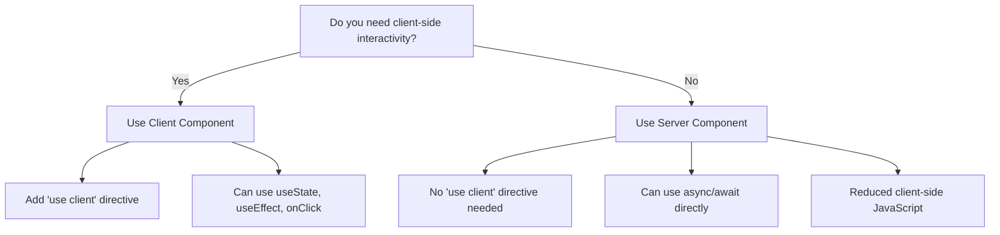
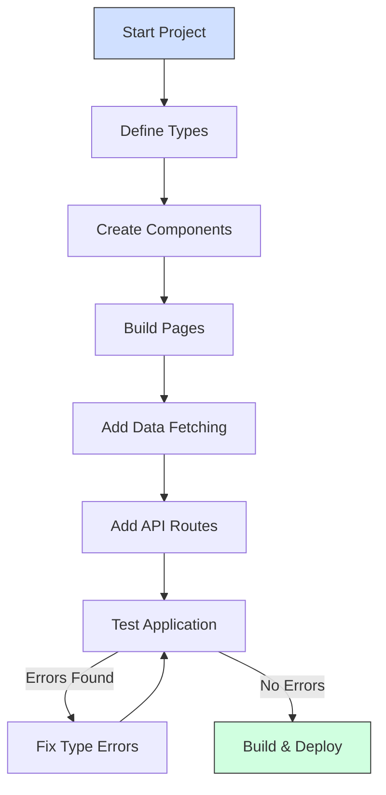
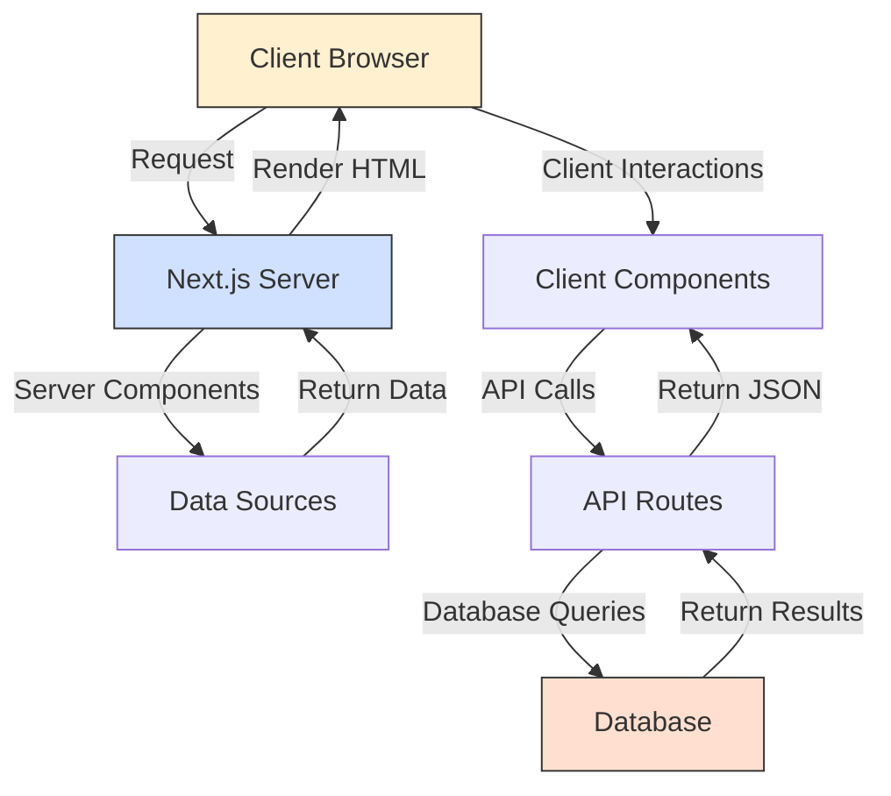

## Introduction to Next.js and TypeScript

Next.js is a powerful React framework that provides server-side rendering, static site generation, and simplified routing. TypeScript adds static typing to JavaScript, helping catch errors early during development rather than at runtime.

**Why this combination works well:**

- Next.js handles the React infrastructure so you can focus on building components
- TypeScript provides type safety that helps prevent bugs before they happen
- Together, they create a robust environment for scalable web applications

Let's start by understanding how to set up your development environment and then gradually build our knowledge from there.

## Setting Up Your Project

To begin working with Next.js and TypeScript, you'll first need to create a new project. The Next.js team has made this process straightforward with their CLI tool:

```bash
# Create a new project with TypeScript
npx create-next-app@latest my-next-app --typescript

# Navigate to your project
cd my-next-app

# Start the development server
npm run dev
```

After running these commands, you'll have a development server running on http://localhost:3000. Open this URL in your browser, and you'll see the default Next.js starter page.

When you look at your new project's folder structure, you'll notice several important directories and files:

```
my-next-app/
├── node_modules/
├── public/          # Static assets (images, fonts, etc.)
├── src/
│   ├── app/         # App Router (Next.js 13+)
│   │   └── page.tsx # Home page
│   ├── components/  # Reusable components
│   └── types/       # TypeScript type definitions
├── next.config.js   # Next.js configuration
├── package.json     # Dependencies and scripts
└── tsconfig.json    # TypeScript configuration
```

Now that we have our project set up, let's explore one of Next.js's most distinctive features: its routing system.

## File-Based Routing

Unlike traditional React applications where routing is configured programmatically, Next.js uses a file-based routing system. This means that the files you create in the `app` directory automatically become routes in your application.

For instance, if you create these files:

```
src/app/
├── page.tsx         # Home route (/)
├── about/
│   └── page.tsx     # About route (/about)
└── blog/
    ├── page.tsx     # Blog index route (/blog)
    └── [slug]/
        └── page.tsx # Dynamic blog post route (/blog/post-1)
```

Next.js will automatically create routes for each of these pages. The `[slug]` syntax creates a dynamic route where the value in brackets becomes a parameter you can access in your component.

Here's a visual representation of how this routing structure works:

```mermaid
graph TD
  A[app/] --> B[page.tsx]
  A --> C[about/]
  A --> D[blog/]
  C --> E[page.tsx]
  D --> F[page.tsx]
  D --> G[[slug]/]
  G --> H[page.tsx]

  B -->|Renders| I[/ route]
  E -->|Renders| J[/about route]
  F -->|Renders| K[/blog route]
  H -->|Renders| L[/blog/post-1 route]
```

This intuitive system makes organizing your application straightforward and eliminates the need for manual route configuration.

## Building Basic Components

Now that we understand the routing system, let's create some basic components. In Next.js with TypeScript, components are more type-safe, making your code more robust.

Here's a simple page component that serves as your homepage:

```tsx
// app/page.tsx
import React from 'react';

// This is a Server Component by default in the App Router
export default function HomePage() {
  return (
    <div className="container mx-auto py-8">
      <h1 className="text-3xl font-bold">Welcome to my Next.js app</h1>
      <p>This is my homepage built with Next.js and TypeScript</p>
    </div>
  );
}
```

To help users navigate between different pages, we'll create a navigation component:

```tsx
// components/Navbar.tsx
import Link from 'next/link';
import React from 'react';

const Navbar: React.FC = () => {
  return (
    <nav className="bg-gray-800 p-4">
      <ul className="flex space-x-4">
        <li>
          <Link href="/" className="text-white hover:text-gray-300">
            Home
          </Link>
        </li>
        <li>
          <Link href="/about" className="text-white hover:text-gray-300">
            About
          </Link>
        </li>
        <li>
          <Link href="/blog" className="text-white hover:text-gray-300">
            Blog
          </Link>
        </li>
      </ul>
    </nav>
  );
};

export default Navbar;
```

Notice how we're using the `Link` component from Next.js instead of regular `<a>` tags. This enables client-side navigation, which is faster than traditional page loads because it doesn't require a full page refresh.

## Understanding Server and Client Components

One of the most significant innovations in recent versions of Next.js is the distinction between Server and Client Components. This concept is fundamental to how you'll structure your application, so let's explore it in detail.

### Server Components (Default)

In the App Router, all components are Server Components by default. These components run exclusively on the server and send only the HTML to the client, reducing the JavaScript bundle size. Here's an example:

```tsx
// app/users/page.tsx
// This is a Server Component by default
import React from 'react';

// Define type for our data
interface User {
  id: number;
  name: string;
  email: string;
}

async function getUsers(): Promise<User[]> {
  // Fetch data on the server
  const res = await fetch('https://jsonplaceholder.typicode.com/users');

  if (!res.ok) {
    throw new Error('Failed to fetch users');
  }

  return res.json();
}

export default async function UserList() {
  // Server components can be async
  const users = await getUsers();

  return (
    <div>
      <h1 className="text-2xl font-bold mb-4">Users</h1>
      <ul className="space-y-2">
        {users.map((user) => (
          <li key={user.id} className="p-2 border rounded">
            {user.name} - {user.email}
          </li>
        ))}
      </ul>
    </div>
  );
}
```

The key advantage here is that you can use `async/await` directly in the component to fetch data, and the data fetching happens on the server before the page is sent to the client.

### Client Components

When you need interactivity like state, event handlers, or browser APIs, you'll use Client Components. These are designated by adding the `'use client'` directive at the top of your file:

```tsx
// components/Counter.tsx
'use client'; // This directive must be at the top of the file

import React, { useState } from 'react';

const Counter: React.FC = () => {
  // useState only works in Client Components
  const [count, setCount] = useState(0);

  return (
    <div className="p-4 border rounded">
      <p className="mb-2">Count: {count}</p>
      <button
        onClick={() => setCount(count + 1)}
        className="px-4 py-2 bg-blue-500 text-white rounded"
      >
        Increment
      </button>
    </div>
  );
};

export default Counter;
```

To help you decide which type of component to use, consider this decision tree:



This separation creates a more efficient architecture where you can combine server-rendered content with interactive client-side features.

## Fetching Data in Next.js

Data fetching is a critical part of most web applications. Next.js provides several elegant patterns for retrieving data, especially in Server Components.

### Server-Side Data Fetching

Here's how you can fetch and display a list of blog posts:

```tsx
// app/posts/page.tsx
import React from 'react';

// Define types for our data
interface Post {
  id: number;
  title: string;
  body: string;
}

// This function fetches data on the server
async function getPosts(): Promise<Post[]> {
  // The next: { revalidate } option controls caching
  const res = await fetch('https://jsonplaceholder.typicode.com/posts', {
    next: { revalidate: 3600 }, // Revalidate once per hour
  });

  if (!res.ok) {
    throw new Error('Failed to fetch posts');
  }

  return res.json();
}

export default async function PostsPage() {
  const posts = await getPosts();

  return (
    <div className="container mx-auto py-8">
      <h1 className="text-3xl font-bold mb-6">Blog Posts</h1>
      <div className="grid gap-4 md:grid-cols-2">
        {posts.slice(0, 6).map((post) => (
          <div key={post.id} className="p-4 border rounded shadow">
            <h2 className="text-xl font-semibold">{post.title}</h2>
            <p className="mt-2">{post.body}</p>
          </div>
        ))}
      </div>
    </div>
  );
}
```

Notice how we're using TypeScript to define the shape of our data with the `Post` interface. This ensures type safety throughout our component.

### Working with Dynamic Routes

For displaying individual blog posts, we can use dynamic routes with the `[id]` parameter:

```tsx
// app/posts/[id]/page.tsx
import { notFound } from 'next/navigation';
import React from 'react';

// Define types
interface Post {
  id: number;
  title: string;
  body: string;
  userId: number;
}

interface PageProps {
  params: {
    id: string;
  };
}

async function getPost(id: string): Promise<Post | null> {
  try {
    const res = await fetch(`https://jsonplaceholder.typicode.com/posts/${id}`);

    if (!res.ok) return null;

    return res.json();
  } catch (error) {
    return null;
  }
}

export default async function PostPage({ params }: PageProps) {
  const post = await getPost(params.id);

  if (!post) {
    // The notFound function shows the not-found page
    notFound();
  }

  return (
    <div className="container mx-auto py-8">
      <h1 className="text-3xl font-bold mb-4">{post.title}</h1>
      <p className="mb-6">{post.body}</p>
      <p className="text-gray-600">Post ID: {post.id}</p>
    </div>
  );
}
```

The `params` prop contains the route parameters, giving you access to the dynamic parts of the URL. TypeScript helps ensure that you're correctly handling these parameters with the proper types.

## Building API Routes

Next.js isn't just for frontend development—it also allows you to create backend API endpoints within the same project. This feature is incredibly powerful for building full-stack applications.

Let's create a simple API for managing users:

```typescript
// app/api/users/route.ts
import { NextResponse } from 'next/server';
import type { NextRequest } from 'next/server';

// Define type for our user data
interface User {
  id: number;
  name: string;
  email: string;
}

// GET handler - returns a list of users
export async function GET(request: NextRequest) {
  try {
    // In a real app, this would fetch from a database
    const users: User[] = [
      { id: 1, name: 'John Doe', email: 'john@example.com' },
      { id: 2, name: 'Jane Smith', email: 'jane@example.com' },
    ];

    // Return JSON response with proper type
    return NextResponse.json(users, { status: 200 });
  } catch (error) {
    return NextResponse.json(
      { error: 'Failed to fetch users' },
      { status: 500 },
    );
  }
}

// POST handler - creates a new user
export async function POST(request: NextRequest) {
  try {
    const body = await request.json();

    // Validate incoming data with TypeScript
    const user = body as User;

    // In a real app, this would save to a database
    console.log('Creating user:', user);

    return NextResponse.json(
      { message: 'User created successfully', user },
      { status: 201 },
    );
  } catch (error) {
    return NextResponse.json(
      { error: 'Failed to create user' },
      { status: 400 },
    );
  }
}
```

By exporting functions named after HTTP methods (GET, POST, PUT, DELETE), you create handlers for those methods. TypeScript helps ensure that your request and response objects are properly typed.

## Styling Your Application

Next.js provides multiple approaches to styling your application. Let's explore two popular methods: CSS Modules and Tailwind CSS.

### CSS Modules

CSS Modules provide locally scoped CSS classes that prevent style conflicts between components:

```tsx
// components/Button.tsx
import styles from './Button.module.css';

interface ButtonProps {
  text: string;
  onClick?: () => void;
}

const Button: React.FC<ButtonProps> = ({ text, onClick }) => {
  return (
    <button className={styles.button} onClick={onClick}>
      {text}
    </button>
  );
};

export default Button;
```

```css
/* Button.module.css */
.button {
  padding: 8px 16px;
  background-color: #0070f3;
  color: white;
  border: none;
  border-radius: 4px;
  cursor: pointer;
  transition: background-color 0.2s;
}

.button:hover {
  background-color: #0051a2;
}
```

The `.button` class in this example is transformed into a unique class name at build time, ensuring it doesn't conflict with other `.button` classes elsewhere in your project.

### Tailwind CSS

Next.js has built-in support for Tailwind CSS, which provides utility classes for rapid styling:

```tsx
// components/Card.tsx
interface CardProps {
  title: string;
  description: string;
  imageUrl?: string;
}

const Card: React.FC<CardProps> = ({ title, description, imageUrl }) => {
  return (
    <div className="max-w-sm rounded overflow-hidden shadow-lg">
      {imageUrl && (
        
      )}
      <div className="px-6 py-4">
        <h3 className="font-bold text-xl mb-2">{title}</h3>
        <p className="text-gray-700 text-base">{description}</p>
      </div>
    </div>
  );
};

export default Card;
```

Tailwind CSS allows you to style elements directly in the JSX with utility classes, leading to faster development and consistency throughout your application.

## Building Type-Safe Forms

Forms are essential to most web applications. Let's create a type-safe contact form that validates input and handles submission:

```tsx
// components/ContactForm.tsx
'use client';

import React, { useState, FormEvent } from 'react';

// Define form data structure
interface FormData {
  name: string;
  email: string;
  message: string;
}

// Define form errors structure with the same fields
interface FormErrors {
  name?: string;
  email?: string;
  message?: string;
}

const ContactForm: React.FC = () => {
  const [formData, setFormData] = useState<FormData>({
    name: '',
    email: '',
    message: '',
  });

  const [errors, setErrors] = useState<FormErrors>({});
  const [isSubmitting, setIsSubmitting] = useState(false);
  const [submitSuccess, setSubmitSuccess] = useState<boolean | null>(null);

  // Validate all form fields
  const validate = (): boolean => {
    const newErrors: FormErrors = {};

    if (!formData.name.trim()) {
      newErrors.name = 'Name is required';
    }

    if (!formData.email.trim()) {
      newErrors.email = 'Email is required';
    } else if (!/\S+@\S+\.\S+/.test(formData.email)) {
      newErrors.email = 'Email is invalid';
    }

    if (!formData.message.trim()) {
      newErrors.message = 'Message is required';
    }

    setErrors(newErrors);
    // Return true if no errors (form is valid)
    return Object.keys(newErrors).length === 0;
  };

  const handleSubmit = async (e: FormEvent) => {
    e.preventDefault();

    // Don't submit if validation fails
    if (!validate()) {
      return;
    }

    setIsSubmitting(true);

    try {
      // In a real app, this would call your API endpoint
      const response = await fetch('/api/contact', {
        method: 'POST',
        headers: {
          'Content-Type': 'application/json',
        },
        body: JSON.stringify(formData),
      });

      if (response.ok) {
        setSubmitSuccess(true);
        // Reset form on success
        setFormData({ name: '', email: '', message: '' });
      } else {
        setSubmitSuccess(false);
      }
    } catch (error) {
      setSubmitSuccess(false);
    } finally {
      setIsSubmitting(false);
    }
  };

  // Type-safe change handler
  const handleChange = (
    e: React.ChangeEvent<HTMLInputElement | HTMLTextAreaElement>,
  ) => {
    const { name, value } = e.target;
    setFormData((prev) => ({
      ...prev,
      [name]: value,
    }));
  };

  return (
    <form onSubmit={handleSubmit} className="max-w-md mx-auto p-4">
      <div className="mb-4">
        <label htmlFor="name" className="block mb-1 font-medium">
          Name
        </label>
        <input
          type="text"
          id="name"
          name="name"
          value={formData.name}
          onChange={handleChange}
          className="w-full p-2 border rounded"
        />
        {errors.name && <p className="text-red-500 mt-1">{errors.name}</p>}
      </div>

      <div className="mb-4">
        <label htmlFor="email" className="block mb-1 font-medium">
          Email
        </label>
        <input
          type="email"
          id="email"
          name="email"
          value={formData.email}
          onChange={handleChange}
          className="w-full p-2 border rounded"
        />
        {errors.email && <p className="text-red-500 mt-1">{errors.email}</p>}
      </div>

      <div className="mb-4">
        <label htmlFor="message" className="block mb-1 font-medium">
          Message
        </label>
        <textarea
          id="message"
          name="message"
          value={formData.message}
          onChange={handleChange}
          rows={4}
          className="w-full p-2 border rounded"
        />
        {errors.message && (
          <p className="text-red-500 mt-1">{errors.message}</p>
        )}
      </div>

      <button
        type="submit"
        disabled={isSubmitting}
        className="w-full p-2 bg-blue-500 text-white rounded disabled:bg-blue-300"
      >
        {isSubmitting ? 'Submitting...' : 'Submit'}
      </button>

      {submitSuccess === true && (
        <p className="mt-4 p-2 bg-green-100 text-green-700 rounded">
          Message sent successfully!
        </p>
      )}

      {submitSuccess === false && (
        <p className="mt-4 p-2 bg-red-100 text-red-700 rounded">
          Failed to send message. Please try again.
        </p>
      )}
    </form>
  );
};

export default ContactForm;
```

This form demonstrates several important concepts:

- Using TypeScript interfaces to define the structure of form data and errors
- Implementing client-side validation with clear error messages
- Creating type-safe event handlers for form inputs
- Managing form submission state (submitting, success, error)

TypeScript ensures that you're handling all the possible states correctly and that your form data maintains its expected structure.

## Understanding the Development Flow

To solidify your understanding, let's visualize the typical development flow when working with Next.js and TypeScript:



This iterative process helps you build robust applications where TypeScript catches potential issues before they become runtime errors.

Additionally, understanding the data flow in a Next.js application helps clarify how different parts interact:



This diagram illustrates how Next.js seamlessly integrates both frontend and backend concerns in a single application.

## The Remaining 15%: Advanced Topics

Now that you understand the core 85% of Next.js with TypeScript, let's briefly explore the advanced topics that make up the remaining 15%. These are areas you can explore as you become more comfortable with the basics:

1. **Advanced TypeScript Patterns**

   - Conditional Types let you create types that change based on conditions
   - Mapped Types allow you to transform existing types into new ones
   - Template Literal Types create new string types based on existing ones
   - Type Assertions and Type Guards help you safely narrow types in your code

2. **State Management Solutions**

   - Redux with TypeScript provides global state management with type safety
   - Zustand offers a minimalist approach to state management with TypeScript support
   - Jotai and Recoil provide atomic state management for React applications

3. **Advanced Data Fetching**

   - SWR and React Query offer sophisticated data fetching with caching and revalidation
   - GraphQL with Apollo Client provides a type-safe alternative to REST APIs
   - tRPC enables end-to-end typesafe APIs without schemas or code generation

4. **Testing TypeScript Applications**

   - Jest with TypeScript for unit testing with proper type checking
   - React Testing Library for component testing with TypeScript
   - Cypress for comprehensive end-to-end testing with TypeScript support

5. **Performance Optimization**

   - Bundle Analysis helps you understand and optimize your TypeScript bundle size
   - Tree Shaking ensures unused code is removed from your bundle
   - Dynamic Imports and Code Splitting optimize load times for large applications

6. **Advanced Deployment Strategies**

   - Incremental Static Regeneration combines static and dynamic approaches
   - Edge Runtime deploys your code to edge networks for faster response times
   - Containerization with Docker creates portable deployments of your Next.js applications

7. **Internationalization (i18n)**

   - Type-safe translations ensure your multilingual content remains consistent
   - Right-to-left (RTL) support handles languages that read from right to left

8. **Monorepo Setups**
   - Turborepo manages TypeScript monorepos with Next.js applications
   - NX offers another approach to organizing multiple TypeScript projects

## Conclusion

This crash course has covered the essential 85% of Next.js with TypeScript that you'll use in your daily development work. You've learned how to set up a project, structure your application with the file-based routing system, build both server and client components, fetch and display data, create API routes, style your components, and build type-safe forms.

With this solid foundation, you're well-equipped to build robust web applications while gradually exploring the advanced topics mentioned in the remaining 15%. As you gain experience, you'll develop an intuition for when to employ more sophisticated TypeScript features and when simpler approaches are sufficient.

Remember that TypeScript is a tool to help you write safer, more maintainable code—it shouldn't slow down your development process once you're comfortable with it. The initial investment in learning these patterns pays dividends in fewer bugs and more confident refactoring.

Happy coding, and enjoy building amazing applications with Next.js and TypeScript!
