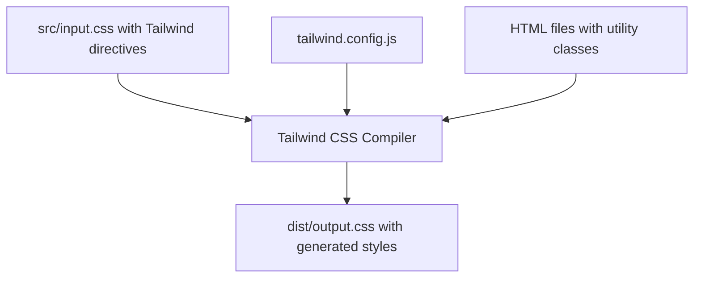
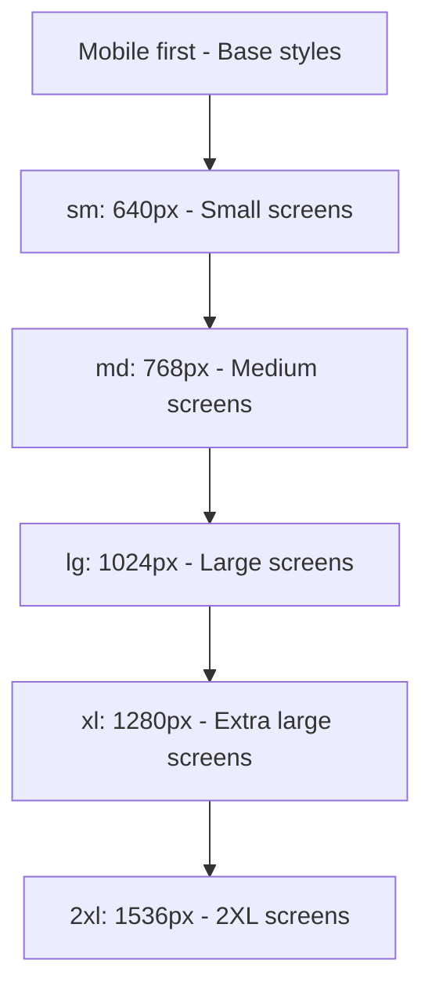

## Introduction to Tailwind CSS

Tailwind CSS represents a paradigm shift in web styling through its innovative utility-first approach. Unlike traditional frameworks that provide pre-built components, Tailwind equips you with low-level utility classes that you combine directly in your HTML to create custom designs without switching contexts.

**Key Benefits:**

- Develop faster by writing CSS directly in your HTML markup
- Maintain design consistency through predefined scales and values
- Eliminate the need to create and maintain separate CSS files
- Build completely custom designs without fighting against framework defaults
- Enjoy a fully customizable system that adapts to your project requirements

Before diving into Tailwind, ensure you have these fundamentals:

**Prerequisites:**

- Basic HTML knowledge (tags, attributes, structure)
- CSS fundamentals (properties, selectors, values)
- Command line basics for installation and build processes
- Node.js installed on your system

## Installation and Setup

Getting started with Tailwind requires a straightforward setup process that prepares your development environment:

```bash
# Create project directory
mkdir tailwind-project
cd tailwind-project

# Initialize package.json
npm init -y

# Install Tailwind CSS
npm install -D tailwindcss

# Generate configuration file
npx tailwindcss init
```

With Tailwind installed, you'll need to configure it through the generated configuration file:

```javascript
/** @type {import('tailwindcss').Config} */
module.exports = {
  content: ['./src/**/*.{html,js}'], // Files to scan for classes
  theme: {
    extend: {}, // Extend default theme here
  },
  plugins: [], // Add plugins here
};
```

Next, create an input CSS file with the necessary Tailwind directives to import the framework's styles:

```css
/* src/input.css */
@tailwind base;
@tailwind components;
@tailwind utilities;

/* Your custom styles can go here */
```

To compile these directives into actual CSS, set up the build process in your `package.json`:

```json
"scripts": {
  "build": "tailwindcss -i ./src/input.css -o ./dist/output.css",
  "watch": "tailwindcss -i ./src/input.css -o ./dist/output.css --watch"
}
```

For development, run the watch mode to automatically recompile your CSS when changes are detected:

```bash
npm run watch
```

Finally, link the compiled CSS in your HTML to start using Tailwind's utility classes:

```html
<!DOCTYPE html>
<html>
  <head>
    <meta charset="UTF-8" />
    <meta name="viewport" content="width=device-width, initial-scale=1.0" />
    <link href="./dist/output.css" rel="stylesheet" />
    <title>Tailwind Project</title>
  </head>
  <body>
    <h1 class="text-3xl font-bold text-blue-500">Hello Tailwind!</h1>
  </body>
</html>
```

This build process transforms your Tailwind directives into optimized CSS:



## Core Utility Classes

With your project set up, you can now leverage Tailwind's extensive utility classes. Let's explore the core categories that you'll use most frequently.

### Typography

Typography utilities allow precise control over text appearance and formatting:

```html
<!-- Font sizes -->
<p class="text-xs">Extra small text</p>
<!-- 0.75rem -->
<p class="text-sm">Small text</p>
<!-- 0.875rem -->
<p class="text-base">Base text</p>
<!-- 1rem -->
<p class="text-lg">Large text</p>
<!-- 1.125rem -->
<p class="text-xl">Extra large text</p>
<!-- 1.25rem -->
<p class="text-2xl">2XL text</p>
<!-- 1.5rem -->

<!-- Font weights -->
<p class="font-light">Light weight</p>
<p class="font-normal">Normal weight</p>
<p class="font-medium">Medium weight</p>
<p class="font-bold">Bold weight</p>

<!-- Text alignment -->
<p class="text-left">Left aligned</p>
<p class="text-center">Centered text</p>
<p class="text-right">Right aligned</p>

<!-- Line height -->
<p class="leading-none">Tight</p>
<!-- 1 -->
<p class="leading-normal">Normal</p>
<!-- 1.5 -->
<p class="leading-loose">Loose</p>
<!-- 2 -->
```

### Colors

Beyond typography, color is a crucial aspect of design. Tailwind provides a comprehensive palette with intensity scales from 50 (lightest) to 900 (darkest):

```html
<!-- Text colors -->
<p class="text-blue-500">Blue text</p>
<p class="text-red-600">Red text</p>
<p class="text-green-700">Green text</p>

<!-- Background colors -->
<div class="bg-gray-100">Light gray background</div>
<div class="bg-yellow-200">Light yellow background</div>
<div class="bg-purple-800 text-white">Dark purple background</div>

<!-- Border colors -->
<div class="border-2 border-blue-500">Blue border</div>
```

### Spacing: Margin and Padding

Tailwind's spacing system provides consistent margin and padding values using a scale where each unit equals 0.25rem (4px by default):

```html
<!-- Padding (all sides) -->
<div class="p-4">Padding on all sides (1rem)</div>

<!-- Padding (individual sides) -->
<div class="pt-2">Top padding (0.5rem)</div>
<div class="pr-2">Right padding (0.5rem)</div>
<div class="pb-2">Bottom padding (0.5rem)</div>
<div class="pl-2">Left padding (0.5rem)</div>

<!-- Shorthand for horizontal/vertical padding -->
<div class="px-4">Horizontal padding (1rem on left and right)</div>
<div class="py-2">Vertical padding (0.5rem on top and bottom)</div>

<!-- Margins work the same way -->
<div class="m-4">Margin on all sides (1rem)</div>
<div class="mt-4">Top margin (1rem)</div>
<div class="mb-8">Bottom margin (2rem)</div>
<div class="mx-auto">Horizontally centered with auto margins</div>
```

### Sizing

Control element dimensions precisely with width and height utilities:

```html
<!-- Fixed widths -->
<div class="w-4">1rem width</div>
<div class="w-32">8rem width</div>

<!-- Percentage widths -->
<div class="w-1/2">50% width</div>
<div class="w-full">100% width</div>

<!-- Fixed heights -->
<div class="h-32">8rem height</div>

<!-- Special sizing utilities -->
<div class="min-h-screen">Minimum height of viewport</div>
<div class="max-w-md">Maximum width medium container (28rem)</div>
```

## Layout Techniques

With an understanding of basic styling utilities, we can now explore how Tailwind handles layout—one of the most powerful aspects of the framework.

### Flexbox

Tailwind makes flexbox layouts intuitive with descriptive utility classes that eliminate the complexity of CSS flexbox:

```html
<!-- Enable flex layout -->
<div class="flex">
  <div>Item 1</div>
  <div>Item 2</div>
</div>

<!-- Direction -->
<div class="flex flex-col">Vertical flex</div>
<div class="flex flex-row">Horizontal flex</div>

<!-- Alignment -->
<div class="flex items-center">Vertically centered items</div>
<div class="flex justify-between">Space between items</div>

<!-- Wrapping -->
<div class="flex flex-wrap">Items will wrap</div>

<!-- Item order and size -->
<div class="flex">
  <div class="order-2">Appears second</div>
  <div class="order-1">Appears first</div>
  <div class="flex-1">Takes up available space</div>
</div>
```

### Grid Layout

When flexbox isn't enough, Tailwind's grid utilities offer powerful layout capabilities:

```html
<!-- Basic grid with 3 columns -->
<div class="grid grid-cols-3 gap-4">
  <div>Item 1</div>
  <div>Item 2</div>
  <div>Item 3</div>
  <div>Item 4</div>
</div>

<!-- Grid with specific column sizes -->
<div class="grid grid-cols-12 gap-4">
  <div class="col-span-4">Spans 4 columns</div>
  <div class="col-span-8">Spans 8 columns</div>
</div>

<!-- Auto-fit grid items -->
<div class="grid grid-cols-1 md:grid-cols-2 lg:grid-cols-3 gap-4">
  <div>Responsive grid item</div>
  <div>Responsive grid item</div>
  <div>Responsive grid item</div>
</div>
```

## Responsive Design

Building on these layout techniques, Tailwind's responsive system allows your designs to adapt seamlessly across devices. The framework follows a mobile-first approach with intuitive breakpoint modifiers:

```html
<!-- Text that changes size at different breakpoints -->
<p class="text-sm md:text-base lg:text-lg">
  This text is small on mobile, medium on tablets, and large on desktops.
</p>

<!-- Layout that changes at different breakpoints -->
<div class="flex flex-col md:flex-row">
  <div class="md:w-1/2">Left on desktop, top on mobile</div>
  <div class="md:w-1/2">Right on desktop, bottom on mobile</div>
</div>
```

Tailwind provides logical breakpoints that correspond to common device sizes:

- `sm`: 640px and up
- `md`: 768px and up
- `lg`: 1024px and up
- `xl`: 1280px and up
- `2xl`: 1536px and up

The progression from mobile to larger screens follows this pattern:



## Building Components

While Tailwind is fundamentally utility-first, you can combine these utilities to create reusable components. Let's examine some common examples:

### Button Example

```html
<!-- Primary button -->
<button
  class="bg-blue-500 hover:bg-blue-700 text-white font-bold py-2 px-4 rounded"
>
  Click me
</button>

<!-- Secondary button -->
<button
  class="bg-transparent hover:bg-gray-200 text-gray-800 font-semibold py-2 px-4 border border-gray-400 rounded"
>
  Secondary
</button>
```

### Card Component

```html
<!-- Simple card -->
<div class="max-w-sm rounded overflow-hidden shadow-lg">
  
  <div class="px-6 py-4">
    <div class="font-bold text-xl mb-2">Card Title</div>
    <p class="text-gray-700 text-base">
      Card content goes here. Some quick example text.
    </p>
  </div>
  <div class="px-6 pt-4 pb-2">
    <span
      class="inline-block bg-gray-200 rounded-full px-3 py-1 text-sm font-semibold text-gray-700 mr-2 mb-2"
      >#tag1</span
    >
    <span
      class="inline-block bg-gray-200 rounded-full px-3 py-1 text-sm font-semibold text-gray-700 mr-2 mb-2"
      >#tag2</span
    >
  </div>
</div>
```

### Using @apply for Reusable Styles

For frequently used combinations, Tailwind provides the `@apply` directive to extract common patterns into reusable classes:

```css
/* In your CSS file */
@tailwind base;
@tailwind components;
@tailwind utilities;

@layer components {
  .btn-primary {
    @apply bg-blue-500 hover:bg-blue-700 text-white font-bold py-2 px-4 rounded;
  }

  .card {
    @apply max-w-sm rounded overflow-hidden shadow-lg;
  }
}
```

These extracted components can then be used with more concise HTML:

```html
<button class="btn-primary">Click me</button>
<div class="card">Card content</div>
```

## Customization

Tailwind's true power emerges when you customize it to fit your project's specific design language. The framework provides robust mechanisms for extending its default configuration.

### Extending the Theme

The configuration file allows you to extend Tailwind's default theme with your own values:

```javascript
// tailwind.config.js
module.exports = {
  theme: {
    extend: {
      colors: {
        'brand-blue': '#1992d4',
        'brand-red': '#e53e3e',
      },
      spacing: {
        72: '18rem',
        84: '21rem',
      },
      fontFamily: {
        sans: ['Proxima Nova', 'sans-serif'],
      },
    },
  },
};
```

### Custom Utilities

Beyond theme customization, you can create entirely new utility classes when needed:

```css
/* In your CSS file */
@layer utilities {
  .text-shadow {
    text-shadow: 2px 2px 4px rgba(0, 0, 0, 0.5);
  }

  .rotate-45 {
    transform: rotate(45deg);
  }
}
```

## State Variants and Modifiers

Tailwind's modifier system enables interactive state handling directly in your HTML:

```html
<!-- Hover state -->
<button class="bg-blue-500 hover:bg-blue-700">Hover me</button>

<!-- Focus state -->
<input class="border focus:ring-2 focus:ring-blue-500" />

<!-- Active state -->
<button class="bg-blue-500 active:bg-blue-800">Click me</button>

<!-- Group hover (parent-child relationship) -->
<div class="group hover:bg-blue-100">
  <p class="group-hover:text-blue-500">
    This text changes when parent is hovered
  </p>
</div>

<!-- Dark mode (if enabled in config) -->
<div class="bg-white dark:bg-gray-800 text-black dark:text-white">
  Adapts to light/dark mode
</div>
```

## Production Optimization

As your project grows, optimizing the CSS becomes increasingly important. Tailwind addresses this through its built-in purging mechanism:

```javascript
// tailwind.config.js
module.exports = {
  content: [
    './src/**/*.html',
    './src/**/*.js',
    // Add any files that might contain Tailwind classes
  ],
  // rest of the config...
};
```

When you're ready to deploy, run the build command to remove unused classes:

```bash
npm run build
```

This optimization process dramatically reduces file sizes—often by 90% or more—resulting in lean, production-ready CSS.

## The Final 15%: Advanced Tailwind Techniques

Having covered the essential 85% of Tailwind, here are the advanced topics to explore as you deepen your expertise:

1. **Plugins System**: Extend Tailwind's functionality with official and community plugins

   ```javascript
   // tailwind.config.js
   module.exports = {
     plugins: [
       require('@tailwindcss/forms'),
       require('@tailwindcss/typography'),
     ],
   };
   ```

2. **Just-In-Time (JIT) Mode**: The newer compilation approach that enables arbitrary values like `w-[327px]` and generates styles on-demand for improved development experience

3. **Custom Variants**: Creating your own state variants beyond the defaults provided by Tailwind

4. **Advanced Theming**: Using CSS variables for dynamic theming and color scheme switching

   ```css
   :root {
     --color-primary: #3490dc;
   }
   ```

   ```javascript
   // tailwind.config.js
   module.exports = {
     theme: {
       extend: {
         colors: {
           primary: 'var(--color-primary)',
         },
       },
     },
   };
   ```

5. **Framework Integrations**: Optimizing Tailwind usage within React, Vue, Angular, and other JavaScript frameworks

6. **Animation & Transitions**: Adding motion to your interfaces with Tailwind's animation utilities

7. **Complex Layouts**: Creating advanced multi-column layouts, sticky positioning, and mastering CSS Grid techniques

8. **Performance Optimization**: Fine-tuning your build process for optimal speed and file size

9. **Accessibility Considerations**: Ensuring your Tailwind-styled interfaces work for all users

10. **Testing Strategies**: Implementing effective testing methodologies for Tailwind-styled components

## Conclusion

This crash course has equipped you with the essential knowledge of Tailwind CSS needed for your daily development tasks. You've learned how to install and configure Tailwind, leverage its core utility classes, create responsive layouts, build reusable components, and customize the framework to match your project requirements.

The power of Tailwind lies in its composability—rather than trying to memorize every utility class, focus on understanding the naming patterns and how classes can be combined to achieve your desired designs. The official documentation (https://tailwindcss.com/docs) serves as an excellent reference and should accompany you throughout your development process.

With practice, you'll find that Tailwind CSS significantly enhances your development workflow, allowing you to create custom, responsive designs directly in your HTML markup without the overhead of maintaining separate CSS files.
