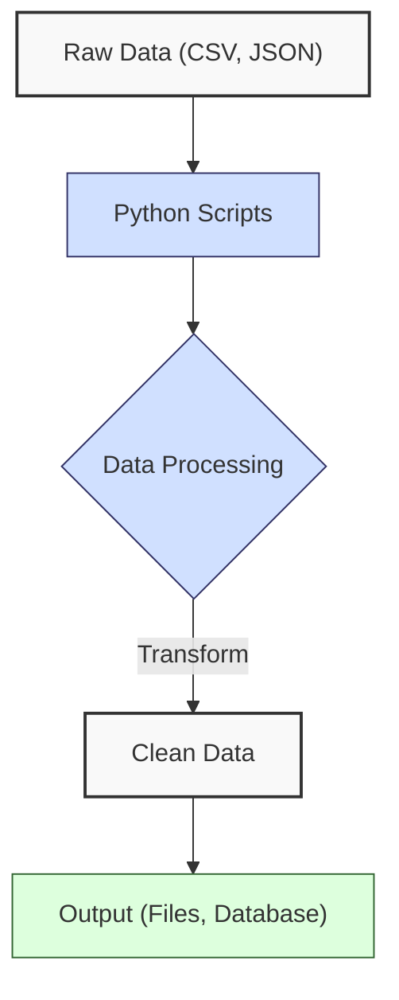
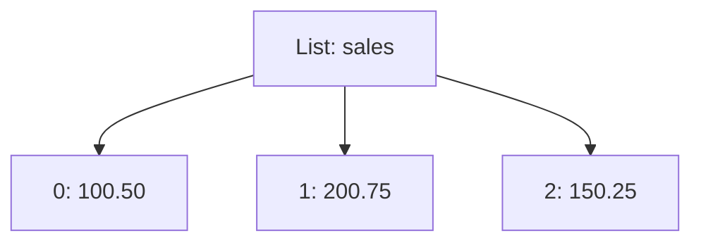
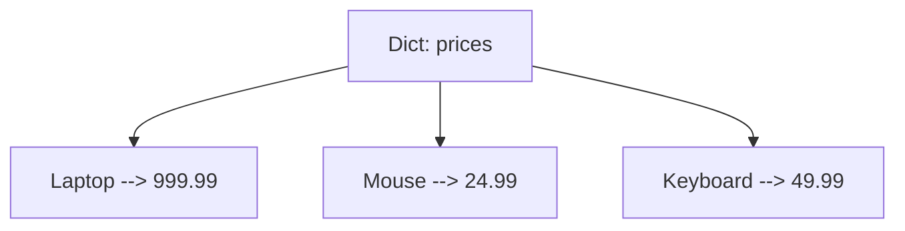
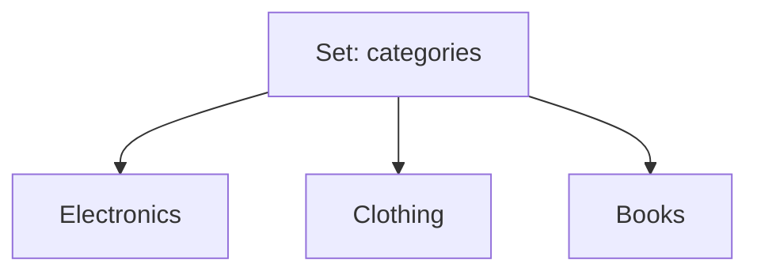
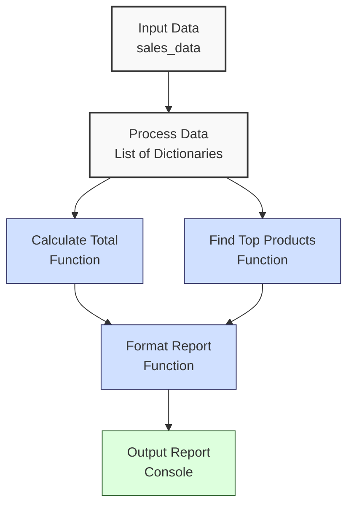

**Complexity: Easy (E)**

## 1.0 Introduction: Why This Matters for Data Engineering

Python is a cornerstone of data engineering due to its simplicity, readability, and extensive library ecosystem. Data engineers use Python to process datasets, such as sales or financial transactions at Hijra Group, by writing scripts that transform and analyze data. Mastering Python’s core features—variables, data types, control flow, functions, and data structures—enables you to build efficient, modular code for data pipelines.

This chapter introduces Python’s essential building blocks, equipping you to manipulate data and implement basic logic. These skills are critical for creating robust pipelines that integrate with tools like PostgreSQL, BigQuery, and Airflow in later chapters.

### Data Engineering Workflow Context

The following diagram illustrates how Python core concepts fit into a data engineering workflow:



### Building On and Preparing For

- **Building On**: This chapter assumes basic programming knowledge (variables, loops, functions) from prerequisite resources (e.g., Codecademy’s “Learn Python 3”). No prior Python experience is required beyond these basics.
- **Preparing For**: The skills here—data structures, control flow, and functions—are foundational for Chapter 2 (file handling and error management) and Chapter 3 (NumPy and Pandas).

### What You’ll Learn

This chapter covers:

1. Python syntax and variables
2. Basic data types (int, float, str, bool)
3. Control flow (if statements, loops)
4. Functions and modular code
5. Data structures (lists, dictionaries, sets)

By the end, you’ll write Python scripts to process sales data, compute metrics, and generate reports, preparing for more complex data engineering tasks.

## 1.1 Python Syntax and Variables

Python’s clean syntax makes it ideal for data engineering scripts. Variables store data, such as product prices or quantities, for processing.

### 1.1.1 Variables and Assignment

Python is a **whitespace-sensitive programming language**, meaning indentation defines code blocks, unlike languages like C or Java that use braces `{}`. Per **PEP 8**, Python’s style guide, the standard is **4 spaces per indentation level**. Tabs are allowed but discouraged because they can render inconsistently across editors, leading to formatting issues. Mixing tabs and spaces in the same file causes `IndentationError`, so stick to spaces for consistency. Configure your editor to insert 4 spaces when pressing Tab to ensure proper formatting.

Assign values to variables using `=`. Use the `print` function to display output, either with basic concatenation, comma-separated arguments, or f-strings for formatted strings.

```python
# Python relies on whitespace to define code blocks, unlike C or Java which use braces {}
# PEP 8, Python's style guide, recommends 4 spaces per indentation level
# Tabs are discouraged as they render inconsistently across editors
# Mixing tabs and spaces causes IndentationError, so always use spaces
# Configure your editor to insert 4 spaces when pressing Tab
product = "Laptop"  # Assign a string to represent a product name
price = 999.99  # Assign a float for the product price
quantity = 2  # Assign an integer for the quantity sold
in_stock = True  # Assign a boolean to indicate stock availability

# Print with commas separates arguments with spaces, useful for quick output
print("Product:", product, "Price: $", price, "Quantity:", quantity)  # Outputs values with spaces

# Concatenate strings with +, but convert non-strings to avoid TypeError
print("In Stock: " + str(in_stock))  # Convert boolean to string for concatenation

# Use f-string (Python 3.6+) for clean, formatted output with variable interpolation
print(f"Formatted: {product}, ${price}, {quantity}, {in_stock}")  # Embeds variables in string

# Define a function to demonstrate proper indentation (4 spaces per PEP 8)
def show_product():
    # Indent with 4 spaces to define the function block
    print("Inside function:")  # Print a header within the function
    print(f"Product: {product}")  # Print the product name using an f-string

# Call the function to execute its code
show_product()

# Incorrect indentation example (commented out to avoid IndentationError)
# def bad_function():
#     print("Wrong indent")  # 2 spaces or tab causes IndentationError
#     print(f"Product: {product}")  # Inconsistent with 4 spaces

# Output:
# Product: Laptop Price: $ 999.99 Quantity: 2
# In Stock: True
# Formatted: Laptop, $999.99, 2, True
# Inside function:
# Product: Laptop
```

**Follow-Along Instructions**:

1. Create a `de-onboarding/` folder in your working directory.
2. Save the code as `de-onboarding/variables.py`.
3. Configure your editor (e.g., VS Code) to use 4 spaces for indentation (not tabs). In VS Code, set “Editor: Tab Size” to 4 and “Editor: Insert Spaces” to true.
4. Open a terminal, navigate to `de-onboarding/`, and run: `python variables.py`.
5. Verify the output matches the comments.
6. Read the comments to understand each line’s purpose and syntax.
7. **Common Errors**:
   - **IndentationError**: Ensure all lines in `show_product()` use 4 spaces (not tabs or mixed indentation). Check editor settings or retype indentation.
   - **SyntaxError**: Ensure Python 3.10+ is installed (`python --version`).
   - **TypeError**: If concatenating numbers, use `str()` (e.g., `str(price)`).
   - **File not found**: Confirm the script is in `de-onboarding/`.

**Key Points**:

- Python uses whitespace (4 spaces per level, per PEP 8) to define code blocks; inconsistent indentation or mixing tabs/spaces raises `IndentationError`.
- Variables are dynamically typed; no type declarations needed.
- Use descriptive names (e.g., `product` instead of `p`).
- `print` with commas separates arguments with spaces; concatenation requires `str()` for non-strings; f-strings (Python 3.6+) simplify formatting.
- **Underlying Implementation**: Variables are names in Python’s symbol table, referencing objects in memory. Objects are reference-counted for garbage collection.
- **Performance Considerations**:
  - **Time Complexity**: O(1) for assignment and lookup.
  - **Space Complexity**: O(1) per variable, plus object size (e.g., strings depend on length).
  - **Implication**: Variables are lightweight, but excessive global variables can clutter the namespace, reducing code clarity.
  - **Performance Tip**: Use local variables within functions to reduce namespace pollution and improve readability.

### 1.1.2 Basic Operations

Perform arithmetic and string operations.

```python
# Use variables from Section 1.1.1 (product, price, quantity)
# Calculate total by multiplying price and quantity
total = price * quantity  # Result is a float (e.g., 1999.98 for price=999.99, quantity=2)

# Calculate a 10% discount on the total
discount = total * 0.1  # 0.1 represents 10%, result is a float (e.g., 199.998)

# Subtract discount from total to get final price
final_price = total - discount  # Result is a float (e.g., 1799.982)

# Use string concatenation with + to print results
# Convert numbers to strings with str() to avoid TypeError
print("Total: $" + str(total) + ", Discount: $" + str(discount))  # Combines strings and numbers

# Use f-string for formatted output with 2 decimal places
print(f"Final: ${final_price:.2f}")  # .2f formats float to 2 decimal places (e.g., 1799.98)

# Concatenate strings to create a promotional message
message = product + " on sale!"  # Combines product name with text
print(message)  # Outputs the message (e.g., "Laptop on sale!")

# Output:
# Total: $1999.98, Discount: $199.998
# Final: $1799.98
# Laptop on sale!
```

**Follow-Along Instructions**:

1. Add this code to `de-onboarding/variables.py` or save as `de-onboarding/operations.py`.
2. Ensure your editor uses 4 spaces for indentation (not tabs).
3. Run: `python operations.py`.
4. Verify outputs match the comments.
5. Read the comments to understand each operation’s purpose.
6. **Common Errors**:
   - **TypeError**: Ensure `str()` wraps numbers in concatenation (e.g., `str(total)`).
   - **NameError**: If `product`, `price`, or `quantity` are undefined, copy them from Section 1.1.1.
   - **IndentationError**: Use consistent 4-space indentation for all lines (not tabs).

**Key Points**:

- Arithmetic operators: `+`, `-`, `*`, `/`, `//` (integer division), `%` (modulus), `**` (exponent).
- String concatenation with `+` requires `str()`; f-strings are cleaner.
- **Performance Considerations**:
  - **Time Complexity**: O(1) for arithmetic; O(n) for string concatenation (n is string length).
  - **Space Complexity**: O(1) for numbers; O(n) for new strings.
  - **Implication**: Use f-strings or `.join()` for efficient string operations to avoid memory overhead in loops.
  - **Performance Tip**: Avoid repeated string concatenation with `+` in loops; use a list and `.join()` to build strings efficiently.

## 1.2 Basic Data Types

Python’s core types—integers, floats, strings, and booleans—support data manipulation.

### 1.2.1 Numbers and Booleans

Handle numerical and logical data.

```python
# Assign variables for sales calculations
items_sold = 5  # Integer for number of items sold
revenue = items_sold * 49.99  # Multiply items by price (float) to get revenue
tax = revenue * 0.08  # Calculate 8% tax on revenue, result is a float

# Use print with commas to display revenue and tax
print("Revenue: $", revenue, "Tax: $", tax)  # Outputs values with spaces

# Evaluate conditions to produce boolean values
is_profitable = revenue > 200  # True if revenue exceeds 200
has_tax = tax > 0  # True if tax is positive

# Use f-string to print boolean results
print(f"Profitable: {is_profitable}, Has Tax: {has_tax}")  # Embeds boolean values

# Output:
# Revenue: $ 249.95 Tax: $ 19.996
# Profitable: True, Has Tax: True
```

**Follow-Along Instructions**:

1. Save as `de-onboarding/numbers.py` or append to an existing file.
2. Ensure your editor uses 4 spaces for indentation (not tabs).
3. Run: `python numbers.py`.
4. Verify outputs match the comments.
5. Read the comments to understand numerical and boolean operations.
6. **Common Errors**:
   - **Floating-point precision**: If `tax` shows many decimals, use `.2f` in f-strings (e.g., `f"${tax:.2f}"`).
   - **SyntaxError**: Ensure proper indentation in print statements.
   - **IndentationError**: Use 4 spaces for all lines (not tabs).

**Key Points**:

- `int`: Whole numbers (e.g., `5`).
- `float`: Decimals (e.g., `49.99`).
- `bool`: `True`/`False`, from comparisons (`>`, `<`, `==`, `!=`).
- **Underlying Implementation**: Numbers are immutable; booleans are singletons.
- **Performance Considerations**:
  - **Time Complexity**: O(1) for arithmetic and comparisons.
  - **Space Complexity**: O(1) for `int`, `float`, `bool`.
  - **Implication**: Efficient for small-scale calculations in data pipelines, but avoid floating-point precision issues in financial data.
  - **Performance Tip**: Use integers for counts or indices to avoid floating-point precision issues.

### 1.2.2 Strings

Manipulate text, common in data cleaning.

```python
# Assign a string for a product category
category = "electronics"  # String variable for category name

# Convert string to uppercase for display
upper_case = category.upper()  # Returns "ELECTRONICS"

# Extract first 4 characters using string slicing
prefix = category[:4]  # Returns "elec" (indices 0 to 3)

# Check if string starts with "elec" (returns boolean)
starts_with = category.startswith("elec")  # Returns True

# Use string concatenation to combine results
print("Upper: " + upper_case + ", Prefix: " + prefix)  # Outputs combined strings

# Use f-string to print boolean result
print(f"Starts With 'elec': {starts_with}")  # Embeds True/False value

# Output:
# Upper: ELECTRONICS, Prefix: elec
# Starts With 'elec': True
```

**Follow-Along Instructions**:

1. Save as `de-onboarding/strings.py` or append to a file.
2. Ensure your editor uses 4 spaces for indentation (not tabs).
3. Run: `python strings.py`.
4. Verify outputs match the comments.
5. Read the comments to understand string operations.
6. **Common Errors**:
   - **TypeError**: If concatenation fails, ensure all variables are strings (e.g., use `str()` for non-strings).
   - **IndexError**: If slicing fails, check `prefix` range (e.g., `[:4]` is valid for “electronics”).
   - **IndentationError**: Use consistent 4-space indentation (not tabs).

**Key Points**:

- Strings are immutable character sequences.
- Methods: `.upper()`, `.lower()`, `.strip()`, `.startswith()`.
- Slicing: `string[start:end]` (end exclusive).
- **Underlying Implementation**: Strings are immutable arrays of Unicode characters, optimized for immutability.
- **Performance Considerations**:
  - **Time Complexity**: O(n) for most operations (n is string length).
  - **Space Complexity**: O(n) for new strings.
  - **Implication**: Minimize string operations in loops to avoid excessive memory allocation; use lists for building strings.
  - **Performance Tip**: Pre-allocate string buffers using lists for large string manipulations to reduce memory allocations.

## 1.3 Control Flow

Control flow directs program logic, enabling data filtering and iteration.

### 1.3.1 If Statements

Make decisions based on conditions.

```python
# Assign a variable for stock quantity
stock = 10  # Integer representing items in stock

# Use if/else to check stock availability
if stock > 0:  # Condition checks if stock is positive
    status = "In Stock"  # Assign string if condition is True
else:  # Execute if condition is False
    status = "Out of Stock"  # Assign string for no stock

# Print the status using basic print
print("Status:", status)  # Outputs "In Stock" or "Out of Stock"

# Assign a variable for product price
price = 999.99  # Float representing product price

# Use if/elif/else for tiered discounts
if price > 1000:  # Check if price exceeds 1000
    discount = 0.15  # 15% discount for high prices
elif price > 500:  # Check if price exceeds 500
    discount = 0.10  # 10% discount for medium prices
else:  # Default case for prices <= 500
    discount = 0.05  # 5% discount for low prices

# Print discount percentage using f-string
print(f"Discount: {discount*100}%")  # Convert to percentage (e.g., 10%)

# Output:
# Status: In Stock
# Discount: 10%
```

**Follow-Along Instructions**:

1. Save as `de-onboarding/if_statements.py`.
2. Ensure your editor uses 4 spaces for indentation (not tabs).
3. Run: `python if_statements.py`.
4. Verify outputs match the comments.
5. Read the comments to understand conditional logic.
6. **Common Errors**:
   - **IndentationError**: Ensure consistent 4-space indentation in `if`/`else` blocks (not tabs).
   - **Logic error**: Test different `price` values (e.g., `200`) to confirm correct discount.
   - **SyntaxError**: Check `elif` and `else` alignment with `if`.

**Key Points**:

- `if`, `elif`, `else` for branching.
- Logical operators: `and`, `or`, `not`.
- **Underlying Implementation**: Evaluates conditions sequentially, executing the first true branch.
- **Performance Considerations**:
  - **Time Complexity**: O(1) for simple conditions; O(n) if iterating.
  - **Space Complexity**: O(1).
  - **Implication**: Efficient for decision-making in data pipelines, but complex conditions may slow execution.
  - **Performance Tip**: Place the most likely condition first in `if`/`elif` chains to minimize evaluations.

### 1.3.2 Loops

Iterate over data.

```python
# Initialize a variable to accumulate total
total = 0  # Integer to store running sum

# Use for loop to iterate over a range of 3 numbers (0, 1, 2)
for i in range(3):  # range(3) generates 0 to 2
    total += 10  # Add 10 to total in each iteration
    # Print iteration number (i+1 for 1-based display) and total
    print("Iteration", i+1, ": Total =", total)  # Outputs current state

# Initialize a variable for countdown
count = 5  # Integer starting at 5

# Use while loop to count down until count is 0
while count > 0:  # Loop continues while count is positive
    print(f"Count: {count}")  # Print current count using f-string
    count -= 1  # Decrement count to avoid infinite loop

# Output:
# Iteration 1 : Total = 10
# Iteration 2 : Total = 20
# Iteration 3 : Total = 30
# Count: 5
# Count: 4
# Count: 3
# Count: 2
# Count: 1
```

**Follow-Along Instructions**:

1. Save as `de-onboarding/loops.py`.
2. Ensure your editor uses 4 spaces for indentation (not tabs).
3. Run: `python loops.py`.
4. Verify outputs match the comments.
5. Read the comments to understand loop mechanics.
6. **Common Errors**:
   - **IndentationError**: Ensure 4-space indentation in loop bodies (not tabs).
   - **Infinite loop**: In the `while` loop, ensure `count` decrements (`count -= 1`).
   - **Range error**: Test different `range` values (e.g., `range(5)`) to confirm iteration count.

**Key Points**:

- `for` loops iterate over iterables (e.g., `range()`, lists).
- `while` loops run until a condition is false.
- **Underlying Implementation**: Loops iterate over sequences, with `range()` generating numbers on-the-fly.
- **Performance Considerations**:
  - **Time Complexity**: O(n) for n iterations.
  - **Space Complexity**: O(1) unless storing results.
  - **Implication**: Optimize loops to minimize operations for large datasets in pipelines.
  - **Performance Tip**: Move constant calculations outside loops to reduce redundant computations.

## 1.4 Functions and Modular Code

Functions encapsulate logic for reuse.

### 1.4.1 Defining Functions

Create reusable code.

```python
# Define a function to calculate total sales
def calculate_total(price, quantity):
    # Multiply price by quantity to compute total (4-space indentation)
    return price * quantity  # Return the result (float or int)

# Define a function to apply a discount
def apply_discount(total, rate):
    # Calculate discounted amount (e.g., total * (1 - 0.1) for 10% off)
    return total * (1 - rate)  # Return the discounted total (float)

# Call functions with sample values
total = calculate_total(999.99, 2)  # Compute total for price=999.99, quantity=2
discounted = apply_discount(total, 0.1)  # Apply 10% discount to total

# Print results using basic print with commas
print("Total: $", total, ", Discounted: $", discounted)  # Outputs total and discounted values

# Output:
# Total: $ 1999.98 , Discounted: $ 1799.982
```

**Follow-Along Instructions**:

1. Save as `de-onboarding/functions.py`.
2. Ensure your editor uses 4 spaces for indentation (not tabs).
3. Run: `python functions.py`.
4. Verify outputs match the comments.
5. Read the comments to understand function definitions and calls.
6. **Common Errors**:
   - **IndentationError**: Ensure 4-space indentation in function bodies (not tabs).
   - **NameError**: Ensure function names match calls (e.g., `calculate_total`).
   - **TypeError**: Confirm numeric inputs for calculations (e.g., `999.99` is a float).

**Key Points**:

- Define with `def name(parameters):`.
- `return` outputs values.
- **Underlying Implementation**: Functions are objects with code and scope, stored in memory.
- **Performance Considerations**:
  - **Time Complexity**: O(1) call overhead, plus body complexity.
  - **Space Complexity**: O(1) plus local variables.
  - **Implication**: Functions enhance modularity without significant overhead, ideal for reusable pipeline logic.
  - **Performance Tip**: Keep function bodies concise to minimize call overhead in performance-critical pipelines.

### 1.4.2 Default Parameters

Add flexibility with default parameter values.

```python
# Define a function with a default parameter for currency
def format_sale(product, price, currency="USD"):
    # Use f-string to format product, currency, and price (2 decimal places)
    return f"{product}: {currency}{price:.2f}"  # Return formatted string

# Call function with default currency (USD)
sale = format_sale("Laptop", 999.99)  # Uses currency="USD"
# Print result using basic print
print("Sale:", sale)  # Outputs formatted sale string

# Call function with explicit currency (EUR)
other_sale = format_sale("Mouse", 24.99, "EUR")  # Overrides default currency
# Print result using f-string
print(f"Other Sale: {other_sale}")  # Outputs formatted sale with EUR

# Output:
# Sale: Laptop: USD999.99
# Other Sale: Mouse: EUR24.99
```

**Follow-Along Instructions**:

1. Save as `de-onboarding/default_params.py` or append to `functions.py`.
2. Ensure your editor uses 4 spaces for indentation (not tabs).
3. Run: `python default_params.py`.
4. Verify outputs match the comments.
5. Read the comments to understand default parameters.
6. **Common Errors**:
   - **IndentationError**: Ensure 4-space indentation in function body (not tabs).
   - **TypeError**: Ensure `price` is a number (e.g., `999.99`, not `"999.99"`).
   - **SyntaxError**: Check f-string syntax (e.g., `{price:.2f}`).

**Key Points**:

- Default parameters provide fallbacks (e.g., `currency="USD"`).
- Use keyword arguments for clarity (e.g., `currency="EUR"`).
- **Underlying Implementation**: Default parameters are evaluated once at function definition, stored with the function object.
- **Performance Considerations**:
  - **Time Complexity**: O(1) call overhead, plus body complexity.
  - **Space Complexity**: O(1) plus local variables.
  - **Implication**: Default parameters simplify function calls without overhead, useful for flexible pipeline configurations.
  - **Performance Tip**: Use default parameters for optional settings to simplify function calls in scripts.

## 1.5 Data Structures

Lists, dictionaries, and sets manage data collections, crucial for data engineering.

### 1.5.1 Lists

Ordered, mutable sequences.

#### Visual Representation

Lists store ordered data, accessible by index:



```python
# Create a list to store sales amounts
sales = [100.50, 200.75, 150.25]  # List of floats representing sales

# Add a new sales amount to the end of the list
sales.append(300.00)  # Appends 300.00 to the list

# Calculate the sum of all sales
total = sum(sales)  # Adds all elements (e.g., 751.50)

# Calculate the average by dividing total by list length
avg = total / len(sales)  # len(sales) is 4, so avg = 751.50 / 4

# Print list, total, and average using basic print with commas
print("Sales:", sales, "Total: $", total, "Avg: $", avg)  # Outputs list and values

# Use list slicing to get the first two elements
top_two = sales[:2]  # Returns [100.50, 200.75]
# Print sliced list using f-string
print(f"Top 2: {top_two}")  # Outputs the first two sales

# Output:
# Sales: [100.5, 200.75, 150.25, 300.0] Total: $ 751.5 Avg: $ 187.875
# Top 2: [100.5, 200.75]
```

**Follow-Along Instructions**:

1. Save as `de-onboarding/lists.py`.
2. Ensure your editor uses 4 spaces for indentation (not tabs).
3. Run: `python lists.py`.
4. Verify outputs match the comments.
5. Read the comments to understand list operations.
6. **Common Errors**:
   - **IndentationError**: Ensure 4-space indentation for all lines (not tabs).
   - **IndexError**: If slicing fails (e.g., `sales[:10]`), ensure indices are within list bounds.
   - **TypeError**: Confirm `sum()` operates on numbers.

**Key Points**:

- Methods: `.append()`, `.remove()`, `.pop()`, `.extend()`.
- Slicing: `list[start:end]` (end exclusive).
- **Underlying Implementation**: Dynamic arrays with amortized O(1) append, O(n) for insertion/deletion at arbitrary indices.
- **Performance Considerations**:
  - **Time Complexity**: O(1) for append, O(n) for insert/remove, O(n) for slicing.
  - **Space Complexity**: O(n) for n elements.
  - **Implication**: Efficient for sequential access, ideal for ordered data like sales records in pipelines.
  - **Performance Tip**: Use list comprehensions (introduced in Chapter 2) for transformations instead of loops to improve readability and performance.

### 1.5.2 Dictionaries

Key-value mappings.

#### Visual Representation

Dictionaries map keys to values using a hash table:



```python
# Create a dictionary to store product prices
prices = {
    "Laptop": 999.99,  # Key "Laptop" maps to price 999.99 (float)
    "Mouse": 24.99,  # Key "Mouse" maps to price 24.99
    "Keyboard": 49.99  # Key "Keyboard" maps to price 49.99
}

# Add a new key-value pair to the dictionary
prices["Monitor"] = 199.99  # Adds "Monitor": 199.99

# Use .get() to safely access a value, with default 0 if key is missing
laptop_price = prices.get("Laptop", 0)  # Returns 999.99 (or 0 if "Laptop" missing)

# Print entire dictionary using f-string
print(f"Prices: {prices}")  # Outputs all key-value pairs

# Print specific value using basic print
print("Laptop Price: $", laptop_price)  # Outputs 999.99

# Output:
# Prices: {'Laptop': 999.99, 'Mouse': 24.99, 'Keyboard': 49.99, 'Monitor': 199.99}
# Laptop Price: $ 999.99
```

**Follow-Along Instructions**:

1. Save as `de-onboarding/dictionaries.py`.
2. Ensure your editor uses 4 spaces for indentation (not tabs).
3. Run: `python dictionaries.py`.
4. Verify outputs match the comments.
5. Read the comments to understand dictionary operations.
6. **Common Errors**:
   - **IndentationError**: Ensure 4-space indentation for all lines (not tabs).
   - **KeyError**: If accessing `prices["Tablet"]` without `.get()`, use `.get("Tablet", 0)` for safety.
   - **TypeError**: Ensure keys are hashable (e.g., strings, not lists).

**Key Points**:

- Access with `dict[key]`; use `.get(key, default)` to avoid KeyError.
- Methods: `.keys()`, `.values()`, `.items()`.
- **Underlying Implementation**: Hash tables with O(1) average-case lookup/insert/delete.
- **Performance Considerations**:
  - **Time Complexity**: O(1) average for lookup/insert/delete, O(n) worst case (hash collisions).
  - **Space Complexity**: O(n) for n key-value pairs.
  - **Implication**: Ideal for fast lookups, such as mapping products to prices in data pipelines.
  - **Performance Tip**: Use `.get()` for safe key access to avoid runtime errors in data processing.

### 1.5.3 Sets

Unordered collections of unique elements.

#### Visual Representation

Sets store unique elements with no order:



```python
# Create a set of product categories (duplicates are automatically removed)
categories = {"Electronics", "Clothing", "Electronics"}  # "Electronics" appears once

# Add a new category to the set
categories.add("Books")  # Adds "Books" to the set

# Check if "Electronics" is in the set (returns boolean)
has_electronics = "Electronics" in categories  # Returns True

# Print set and membership result using basic print
print("Categories:", categories, "Has Electronics:", has_electronics)  # Outputs set and True

# Compute intersection with another set using &
common = categories & {"Electronics", "Accessories"}  # Returns set with common elements
# Print intersection using f-string
print(f"Common: {common}")  # Outputs {"Electronics"}

# Output:
# Categories: {'Electronics', 'Clothing', 'Books'} Has Electronics: True
# Common: {'Electronics'}
```

**Follow-Along Instructions**:

1. Save as `de-onboarding/sets.py`.
2. Ensure your editor uses 4 spaces for indentation (not tabs).
3. Run: `python sets.py`.
4. Verify outputs match the comments.
5. Read the comments to understand set operations.
6. **Common Errors**:
   - **IndentationError**: Ensure 4-space indentation for all lines (not tabs).
   - **TypeError**: Ensure set elements are hashable (e.g., strings, not lists).
   - **Unexpected output**: Sets are unordered, so output order may vary.

**Key Points**:

- Sets automatically remove duplicates.
- Operations: `&` (intersection), `|` (union), `-` (difference).
- **Underlying Implementation**: Hash tables, similar to dictionaries, with O(1) average-case lookup/insert.
- **Performance Considerations**:
  - **Time Complexity**: O(1) average for membership test, O(min(n,m)) for set operations (n,m are set sizes).
  - **Space Complexity**: O(n) for n elements.
  - **Implication**: Useful for deduplication and membership testing, such as unique product categories in pipelines.
  - **Performance Tip**: Use sets for membership tests instead of lists to leverage O(1) lookup speed.

## 1.6 Micro-Project: Sales Data Analyzer

### Project Requirements

Create a Python script to process a sales dataset, calculate total sales, identify top-selling products, and output a formatted report, simulating financial transaction analysis at Hijra Group. This project uses variables, data types, control flow, functions, and data structures, avoiding concepts from later chapters (e.g., file I/O, error handling).

### Sample Input Files

Since file handling is introduced in Chapter 2, the dataset is embedded as a list of dictionaries. For consistency, you can save this as `data/sales.csv` for reference, but the script uses the in-memory list.

**Sample `data/sales.csv`** (for reference):

```csv
product,price,quantity
Laptop,999.99,2
Mouse,24.99,10
Keyboard,49.99,5
Monitor,199.99,3
Headphones,59.99,4
```

### Sales Processing Flow



### Acceptance Criteria

- **Go Criteria**:
  - Calculates total sales (price \* quantity summed).
  - Lists top 3 products by sales amount.
  - Outputs a formatted console report.
  - Uses modular functions.
  - Processes the provided dataset.
- **No-Go Criteria**:
  - Incorrect calculations.
  - Missing top products.
  - Non-modular code.
  - Uses file I/O or error handling.

### Common Pitfalls to Avoid

1. **Type Errors**:
   - **Problem**: Treating prices/quantities as strings.
   - **Solution**: Use `float()`/`int()` for calculations.
2. **Hard-Coding**:
   - **Problem**: Embedding logic without functions.
   - **Solution**: Use functions for each task.
3. **Sorting Inefficiency**:
   - **Problem**: Sorting unnecessarily for top 3.
   - **Solution**: Sort once and slice.
4. **Poor Formatting**:
   - **Problem**: Unreadable report.
   - **Solution**: Use f-strings for clarity.
5. **Print Concatenation Errors**:
   - **Problem**: TypeError from concatenating non-strings without `str()`.
   - **Solution**: Use `str()` or f-strings.
6. **Inconsistent Indentation**:
   - **Problem**: `IndentationError` from mismatched spaces or tabs.
   - **Solution**: Use 4 spaces per indentation level, as per PEP 8. Configure your editor to insert spaces (not tabs) and check for mixed indentation.

### How This Differs from Production-Grade Solutions

In production, this solution would include:

- **File I/O**: Reading CSV files (Chapter 2).
- **Error Handling**: Managing invalid data (Chapter 2).
- **Testing**: Unit tests with `pytest` (Chapter 9).
- **Scalability**: Using Pandas for large datasets (Chapter 3).
- **Logging**: Tracking execution details (Chapter 8).
- **Configuration**: External settings for flexibility (Chapter 8).

### Implementation

```python
# Define the sales dataset as a list of dictionaries (simulates sales.csv)
sales_data = [
    {"product": "Laptop", "price": 999.99, "quantity": 2},  # First sale record
    {"product": "Mouse", "price": 24.99, "quantity": 10},  # Second sale record
    {"product": "Keyboard", "price": 49.99, "quantity": 5},  # Third sale record
    {"product": "Monitor", "price": 199.99, "quantity": 3},  # Fourth sale record
    {"product": "Headphones", "price": 59.99, "quantity": 4}  # Fifth sale record
]

# Define a function to calculate total sales
def calculate_total_sales(sales):
    """
    Calculate total sales from a list of records.
    Returns the sum of price * quantity.
    """
    # Initialize a variable to accumulate total sales
    total = 0  # Float to store running sum
    # Iterate over each sale record in the list
    for sale in sales:
        # Convert price to float and quantity to int, then multiply
        total += float(sale["price"]) * int(sale["quantity"])  # Accumulate price * quantity
    # Return the final total
    return total

# Define a function to find top N products by sales
def find_top_products(sales, n=3):
    """
    Find top N products by sales amount.
    Returns a list of (product, amount) tuples, sorted descending.
    """
    # Create a dictionary to store sales by product
    product_sales = {}  # Maps product names to total sales amounts
    # Iterate over each sale record
    for sale in sales:
        # Get the product name from the record
        product = sale["product"]  # String key for the product
        # Calculate sales amount (price * quantity)
        amount = float(sale["price"]) * int(sale["quantity"])  # Convert to float/int
        # Add or update the product’s total sales in the dictionary
        product_sales[product] = product_sales.get(product, 0) + amount  # Accumulate sales

    # Sort products by sales amount in descending order
    sorted_sales = sorted(product_sales.items(), key=lambda x: x[1], reverse=True)  # Returns list of tuples
    # Return the top N products (or fewer if less than N)
    return sorted_sales[:n]  # Slice to get top N

# Define a function to format the sales report
def format_report(total_sales, top_products):
    """
    Format a sales report as a string.
    Includes total sales and top products.
    """
    # Initialize the report with a header
    report = "SALES REPORT\n"  # Start with title
    # Add a separator line
    report += "============\n\n"  # Visual separator
    # Add total sales with 2 decimal places
    report += f"Total Sales: ${total_sales:.2f}\n\n"  # Format total sales
    # Add header for top products
    report += "Top Products:\n"  # Introduce top products section
    # Iterate over top products to add to report
    for product, amount in top_products:
        # Format each product and its sales amount
        report += f"  {product}: ${amount:.2f}\n"  # Indent with 2 spaces for readability
    # Add final separator
    report += "\n============\n"  # Close the report
    # Return the formatted report string
    return report

# Define the main function to orchestrate the program
def main():
    # Calculate total sales using the sales data
    total_sales = calculate_total_sales(sales_data)  # Calls calculate_total_sales
    # Get top 3 products by sales
    top_products = find_top_products(sales_data, n=3)  # Calls find_top_products
    # Format the report with total and top products
    report = format_report(total_sales, top_products)  # Calls format_report
    # Print the final report to console
    print(report)  # Outputs the formatted report

# Check if the script is run directly (not imported)
if __name__ == "__main__":
    # Call the main function to start the program
    main()  # Executes the sales analysis

# Output:
# SALES REPORT
# ============
#
# Total Sales: $2938.90
#
# Top Products:
#   Laptop: $1999.98
#   Monitor: $599.97
#   Keyboard: $249.95
#
# ============
```

### Expected Output

```
SALES REPORT
============

Total Sales: $2938.90

Top Products:
  Laptop: $1999.98
  Monitor: $599.97
  Keyboard: $249.95

============
```

### How to Run and Test

1. **Setup**:

   - Create a `de-onboarding/` folder in your working directory.
   - Create a `data/` subfolder (e.g., `de-onboarding/data/`).
   - Save the code as `de-onboarding/sales_analyzer.py`. Ensure the `sales_data` list is included at the top.
   - Optional: Copy the `sales.csv` content above into `de-onboarding/data/sales.csv` for reference (not used in the script).
   - Verify Python 3.10+: Run `python --version` in a terminal.
   - Configure your editor to use 4 spaces for indentation (not tabs). In VS Code, set “Editor: Tab Size” to 4 and “Editor: Insert Spaces” to true.
   - Optional: Use Visual Studio Code ([code.visualstudio.com](https://code.visualstudio.com/)) with the Python extension for editing.

2. **Run**:

   - Open a terminal in `de-onboarding/`.
   - Execute: `python sales_analyzer.py`.
   - Output: Formatted report printed to console.

3. **Test Scenarios**:

   - **Valid Data**: Verify total sales ($2938.90) and top products (Laptop, Monitor, Keyboard).
     ```python
     # Run in a Python shell or new script to test functions
     total = calculate_total_sales(sales_data)  # Call function to compute total
     print(total)  # Expected: 2938.9
     top = find_top_products(sales_data, n=3)  # Get top 3 products
     print(top)  # Expected: [('Laptop', 1999.98), ('Monitor', 599.97), ('Keyboard', 249.95)]
     ```
   - **Empty Data**: Edit `sales_analyzer.py` to set `sales_data = []`. Run again. Expect:

     ```
     SALES REPORT
     ============

     Total Sales: $0.00

     Top Products:

     ============
     ```

     ```python
     # Test empty data
     sales_data = []  # Set empty list
     total = calculate_total_sales(sales_data)  # Should return 0.0
     print(total)  # Expected: 0.0
     top = find_top_products(sales_data, n=3)  # Should return empty list
     print(top)  # Expected: []
     ```

   - **Single Record**: Edit to `sales_data = [{"product": "Laptop", "price": 999.99, "quantity": 2}]`. Expect:

     ```
     SALES REPORT
     ============

     Total Sales: $1999.98

     Top Products:
       Laptop: $1999.98

     ============
     ```

     ```python
     # Test single record
     sales_data = [{"product": "Laptop", "price": 999.99, "quantity": 2}]  # Single sale
     total = calculate_total_sales(sales_data)  # Should return 1999.98
     print(total)  # Expected: 1999.98
     top = find_top_products(sales_data, n=3)  # Should return one tuple
     print(top)  # Expected: [('Laptop', 1999.98)]
     ```

   - **Large Quantities**: Add `{"product": "Pen", "price": 1.99, "quantity": 1000}` to `sales_data`. Run and verify total includes $1990.00 for Pen.
     ```python
     # Test large quantities
     sales_data.append({"product": "Pen", "price": 1.99, "quantity": 1000})  # Add large sale
     total = calculate_total_sales(sales_data)  # Should include Pen’s sales
     print(total)  # Expected: 4928.9 (2938.9 + 1990.0)
     ```

**Follow-Along Tips**:

- Ensure the `sales_data` list is copied correctly into the script.
- If you get a TypeError, check that `float()` and `int()` are used in calculations.
- If no output, verify the script is saved in `de-onboarding/` and run from the correct directory.
- If `IndentationError`, use 4 spaces consistently for all code blocks (e.g., under `def` or `for`). Check editor settings to avoid tabs.
- Read the comments to understand the code’s logic and structure.

## 1.7 Practice Exercises

These exercises reinforce variables, data types, control flow, functions, and data structures, with coding, conceptual, and debugging tasks.

### Exercise 1: Price Formatter

Write a function that formats a price and currency as a string (e.g., "$999.99").

**Sample Input**:

```python
price = 999.99
currency = "USD"
```

**Expected Output**:

```
USD999.99
```

**Follow-Along Instructions**:

1. Create a `de-onboarding/` folder if not already present.
2. Save the function in `de-onboarding/price_formatter.py`.
3. Configure your editor to use 4 spaces for indentation (not tabs).
4. Run: `python price_formatter.py`.

**How to Test**:

- Add test code: `print(format_price(999.99))` and `print(format_price(24, "EUR"))`.
- Verify outputs: `USD999.99` and `EUR24.00`.
- **Common Errors**:
  - **IndentationError**: Ensure 4-space indentation in function body (not tabs).
  - **TypeError**: Ensure `price` is a number (e.g., `999.99`, not `"999.99"`).
  - **SyntaxError**: Check f-string syntax (e.g., `{price:.2f}`).

### Exercise 2: Sales Filter

Write a function that filters sales records with quantity > 5, returning product names.

**Sample Input**:

```python
sales = [
    {"product": "Laptop", "quantity": 2},
    {"product": "Mouse", "quantity": 10},
    {"product": "Keyboard", "quantity": 5}
]
```

**Expected Output**:

```
['Mouse']
```

**Follow-Along Instructions**:

1. Create a `de-onboarding/` folder.
2. Save in `de-onboarding/sales_filter.py`.
3. Configure your editor to use 4 spaces for indentation (not tabs).
4. Run: `python sales_filter.py`.

**How to Test**:

- Add the sample input and `print(filter_high_quantity(sales))`.
- Verify output: `['Mouse']`.
- Test with `sales = []` to ensure `[]` is returned.
- **Common Errors**:
  - **IndentationError**: Ensure 4-space indentation in function body and list comprehension (not tabs).
  - **TypeError**: Ensure `quantity` is converted to `int` (e.g., `int(sale["quantity"])`).
  - **KeyError**: Check that `"quantity"` exists in each dictionary.

### Exercise 3: Category Counter

Write a function that counts unique product categories using a set.

**Sample Input**:

```python
records = [
    {"product": "Laptop", "category": "Electronics"},
    {"product": "Mouse", "category": "Electronics"},
    {"product": "T-shirt", "category": "Clothing"}
]
```

**Expected Output**:

```
2
```

**Follow-Along Instructions**:

1. Create a `de-onboarding/` folder.
2. Save in `de-onboarding/category_counter.py`.
3. Configure your editor to use 4 spaces for indentation (not tabs).
4. Run: `python category_counter.py`.

**How to Test**:

- Add the sample input and `print(count_categories(records))`.
- Verify output: `2`.
- Test with `records = []` to ensure `0` is returned.
- **Common Errors**:
  - **IndentationError**: Ensure 4-space indentation in function body (not tabs).
  - **KeyError**: Ensure `"category"` exists in each dictionary.
  - **TypeError**: Confirm set elements are hashable (e.g., strings).

### Exercise 4: Discount Calculator

Write a function that applies tiered discounts:

- > $1000: 15%
- > $500: 10%
- Else: 5%

**Sample Input**:

```python
total = 1500
```

**Expected Output**:

```
1275.0
```

**Follow-Along Instructions**:

1. Create a `de-onboarding/` folder.
2. Save in `de-onboarding/discount_calculator.py`.
3. Configure your editor to use 4 spaces for indentation (not tabs).
4. Run: `python discount_calculator.py`.

**How to Test**:

- Add test code: `print(calculate_discount(1500))`, `print(calculate_discount(600))`, `print(calculate_discount(200))`.
- Verify outputs: `1275.0`, `540.0`, `190.0`.
- **Common Errors**:
  - **IndentationError**: Ensure 4-space indentation in `if`/`elif` blocks (not tabs).
  - **Logic error**: Ensure conditions are in correct order (`> 1000` before `> 500`).
  - **TypeError**: Confirm `total` is a number.

### Exercise 5: Top Sales Aggregator

Write a function that aggregates sales by product and returns the top product by sales amount.

**Sample Input**:

```python
sales = [
    {"product": "Laptop", "price": 999.99, "quantity": 2},
    {"product": "Mouse", "price": 24.99, "quantity": 10}
]
```

**Expected Output**:

```
Laptop
```

**Follow-Along Instructions**:

1. Create a `de-onboarding/` folder.
2. Save in `de-onboarding/top_sales.py`.
3. Configure your editor to use 4 spaces for indentation (not tabs).
4. Run: `python top_sales.py`.

**How to Test**:

- Add the sample input and `print(top_product_by_sales(sales))`.
- Verify output: `Laptop`.
- Test with `sales = []` to ensure `None` is returned.
- **Common Errors**:
  - **IndentationError**: Ensure 4-space indentation in function body and loops (not tabs).
  - **TypeError**: Ensure `price` and `quantity` are converted to `float`/`int`.
  - **KeyError**: Check dictionary keys (e.g., `"product"`, `"price"`).

### Exercise 6: Debug a Sales Calculator

Fix this buggy function that fails with a TypeError and `IndentationError`. Explain the issues.

**Buggy Code**:

```python
def calculate_total(sales):
total = 0  # Bug: Incorrect indentation
    for sale in sales:
        total += sale["price"] * sale["quantity"]  # Bug: No type conversion
    return total

sales = [{"product": "Laptop", "price": "999.99", "quantity": "2"}]
print(calculate_total(sales))  # TypeError and IndentationError
```

**Expected Output**:

```
1999.98
```

**Follow-Along Instructions**:

1. Create a `de-onboarding/` folder.
2. Save the buggy code as `de-onboarding/debug_sales.py`.
3. Configure your editor to use 4 spaces for indentation (not tabs).
4. Run: `python debug_sales.py` to see the TypeError and `IndentationError`.
5. Apply the fixes and re-run.

**How to Test**:

- Verify the fixed code outputs: `1999.98`.
- Test with multiple records (e.g., add `{"product": "Mouse", "price": "24.99", "quantity": "10"}`).
- **Common Errors**:
  - **IndentationError**: Ensure `total = 0` aligns with `def` (no indentation) and loop body uses 4 spaces (not tabs).
  - **TypeError**: Ensure `float(sale["price"])` and `int(sale["quantity"])` are used.
  - **KeyError**: Confirm `"price"` and `"quantity"` exist in each dictionary.

## 1.8 Exercise Solutions

### Solution to Exercise 1: Price Formatter

```python
# Define a function to format price with currency
def format_price(price, currency="USD"):
    """Format a price with currency."""
    # Convert price to float to ensure numeric format
    formatted_price = float(price)  # Ensures price is a number
    # Use f-string to combine currency and price with 2 decimal places
    return f"{currency}{formatted_price:.2f}"  # Returns formatted string (e.g., USD999.99)

# Test the function with sample inputs
print(format_price(999.99))  # Outputs USD999.99 (default currency)
print(format_price(24, "EUR"))  # Outputs EUR24.00 (explicit currency)

# Output:
# USD999.99
# EUR24.00
```

### Solution to Exercise 2: Sales Filter

```python
# Define a function to filter sales with quantity > 5
def filter_high_quantity(sales):
    """Filter sales with quantity > 5."""
    # Use list comprehension to extract product names where quantity > 5
    # Convert quantity to int to compare numerically
    return [sale["product"] for sale in sales if int(sale["quantity"]) > 5]  # Returns list of products

# Test the function with sample input
sales = [
    {"product": "Laptop", "quantity": 2},  # Quantity <= 5, excluded
    {"product": "Mouse", "quantity": 10},  # Quantity > 5, included
    {"product": "Keyboard", "quantity": 5}  # Quantity <= 5, excluded
]
# Print the filtered product names
print(filter_high_quantity(sales))  # Outputs ['Mouse']

# Output:
# ['Mouse']
```

### Solution to Exercise 3: Category Counter

```python
# Define a function to count unique categories
def count_categories(records):
    """Count unique categories using a set."""
    # Use set comprehension to collect unique categories
    # Extract category from each record
    categories = set(record["category"] for record in records)  # Set removes duplicates
    # Return the number of unique categories
    return len(categories)  # Length of set (e.g., 2 for Electronics, Clothing)

# Test the function with sample input
records = [
    {"product": "Laptop", "category": "Electronics"},  # First Electronics
    {"product": "Mouse", "category": "Electronics"},  # Second Electronics (duplicate)
    {"product": "T-shirt", "category": "Clothing"}  # Unique Clothing
]
# Print the count of unique categories
print(count_categories(records))  # Outputs 2

# Output:
# 2
```

### Solution to Exercise 4: Discount Calculator

```python
# Define a function to apply tiered discounts
def calculate_discount(total):
    """Apply tiered discounts based on total."""
    # Check if total exceeds 1000 for 15% discount
    if total > 1000:
        discount = 0.15  # 15% discount
    # Check if total exceeds 500 for 10% discount
    elif total > 500:
        discount = 0.10  # 10% discount
    # Default case: 5% discount for total <= 500
    else:
        discount = 0.05  # 5% discount
    # Calculate discounted amount (total * (1 - discount))
    return total * (1 - discount)  # Returns discounted total (e.g., 1275.0 for 1500)

# Test the function with sample inputs
print(calculate_discount(1500))  # Outputs 1275.0 (15% off)
print(calculate_discount(600))   # Outputs 540.0 (10% off)
print(calculate_discount(200))   # Outputs 190.0 (5% off)

# Output:
# 1275.0
# 540.0
# 190.0
```

### Solution to Exercise 5: Top Sales Aggregator

```python
# Define a function to find the product with the highest sales
def top_product_by_sales(sales):
    """Find product with highest sales amount."""
    # Create a dictionary to store sales by product
    product_sales = {}  # Maps product names to total sales
    # Iterate over each sale record
    for sale in sales:
        # Extract product name and calculate sales amount
        product = sale["product"]  # String key for product
        amount = float(sale["price"]) * int(sale["quantity"])  # Convert to float/int
        # Add or update product’s total sales
        product_sales[product] = product_sales.get(product, 0) + amount  # Accumulate sales

    # Check if dictionary is empty to avoid errors
    if not product_sales:  # Return None for empty sales
        return None
    # Find product with max sales using max() with key function
    return max(product_sales.items(), key=lambda x: x[1])[0]  # Returns product name

# Test the function with sample input
sales = [
    {"product": "Laptop", "price": 999.99, "quantity": 2},  # Sales = 1999.98
    {"product": "Mouse", "price": 24.99, "quantity": 10}  # Sales = 249.90
]
# Print the top product
print(top_product_by_sales(sales))  # Outputs "Laptop"

# Output:
# Laptop
```

### Solution to Exercise 6: Debug a Sales Calculator

**Fixed Code**:

```python
# Define a function to calculate total sales
def calculate_total(sales):
    """Calculate total sales from a list of records."""
    # Initialize total (aligned with def, no indentation, per PEP 8)
    total = 0  # Fix: Correct indentation (was misaligned, causing IndentationError)
    # Iterate over each sale record
    for sale in sales:
        # Convert price and quantity to float/int to avoid TypeError
        total += float(sale["price"]) * int(sale["quantity"])  # Fix: Convert strings to numbers
    # Return the final total
    return total

# Test the function with sample input
sales = [{"product": "Laptop", "price": "999.99", "quantity": "2"}]  # Single sale record
# Print the total sales
print(calculate_total(sales))  # Outputs 1999.98

# Output:
# 1999.98
```

**Explanation**:

- **IndentationError**: The original code indented `total = 0` incorrectly (e.g., using tabs or wrong spaces), causing a syntax error. Per PEP 8, it must align with the `def` statement (no indentation) and use 4 spaces for the loop body. Mixing tabs and spaces or using non-standard indentation (e.g., 2 spaces) triggers this error.
- **TypeError**: The original code didn’t convert `sale["price"]` and `sale["quantity"]` from strings, causing a TypeError. Using `float()` and `int()` enables numerical multiplication.
- **Implication**: Always use 4 spaces per indentation level, avoid tabs, and convert data types when processing inputs. Configure your editor to insert spaces and check for mixed indentation.

## 1.9 Chapter Summary and Connection to Chapter 2

In this chapter, you’ve mastered:

- **Syntax and Variables**: Declaring variables and printing with basic `print` and f-strings, with O(1) time complexity for assignments, emphasizing Python’s whitespace sensitivity (4 spaces per level, per PEP 8, avoiding tabs).
- **Data Types**: Working with numbers, strings, and booleans, efficient for small-scale calculations (O(1) operations).
- **Control Flow**: Using if statements and loops, with O(n) time complexity for iterations.
- **Functions**: Writing modular code, with minimal O(1) call overhead.
- **Data Structures**: Using lists (O(1) append, O(n) slicing), dictionaries (O(1) average lookup), and sets (O(1) membership), ideal for data organization in pipelines.

The micro-project built a sales analyzer that processes a dataset, computes metrics, and formats a report, simulating financial transaction analysis at Hijra Group. Understanding whitespace sensitivity ensures error-free code, critical for pipeline development.

### Connection to Chapter 2

Chapter 2 builds on these foundations by introducing:

- **File Handling**: Reading `sales.csv` directly, extending data structure processing to external sources.
- **Error Handling**: Managing issues like missing files or invalid data, building on control flow.
- **CSV/JSON Processing**: Handling common data formats, enhancing dictionary operations.
- **List Comprehensions**: Optimizing loop-based transformations from this chapter.
- **Modules**: Using `csv`, `json`, and `logging` to extend functionality.

The sales analyzer will be enhanced in Chapter 2 to read from files, validate data, and export results, preparing you for NumPy and Pandas in Chapter 3.
