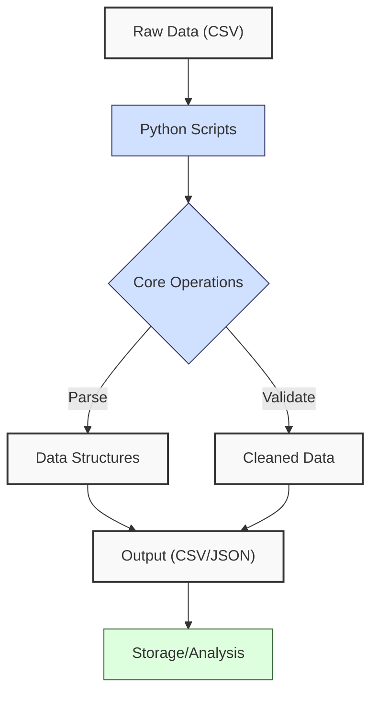
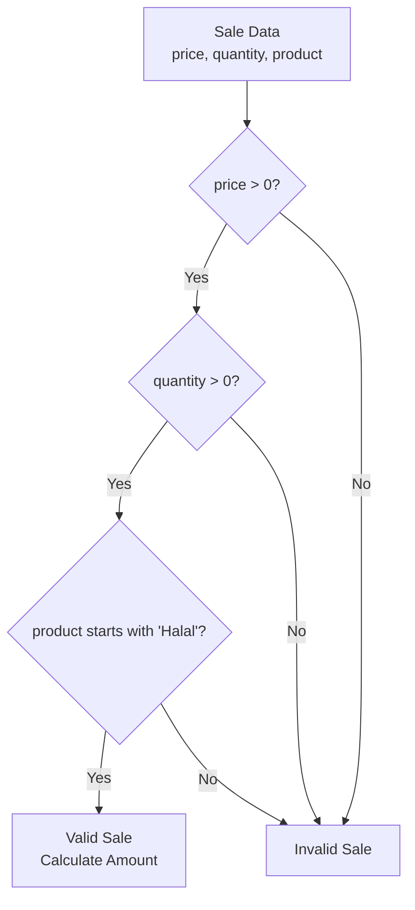
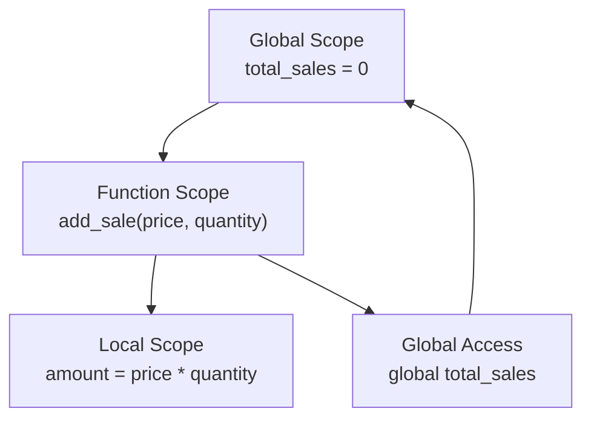
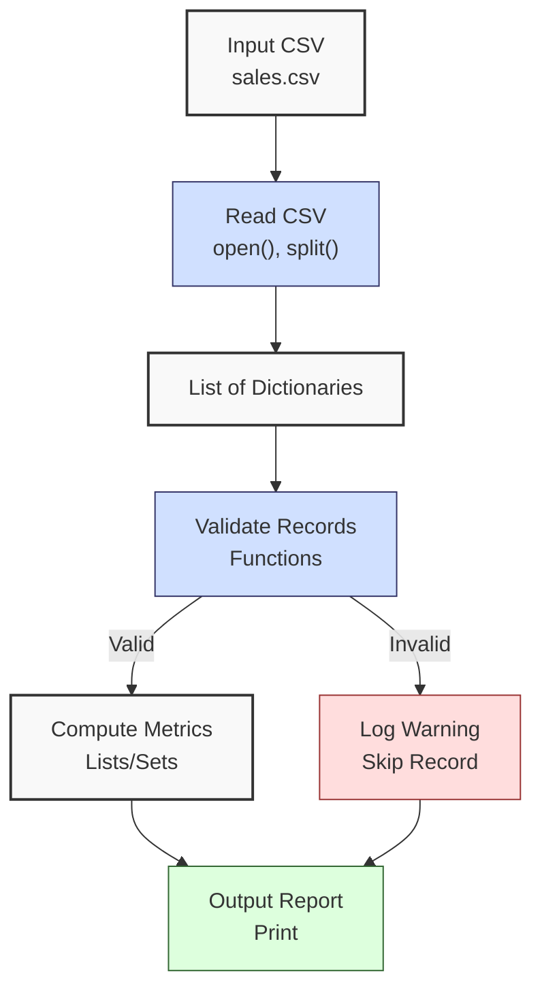

**Complexity: Easy (E)**

## 1.0 Introduction: Why This Matters for Data Engineering

In data engineering, Python is a cornerstone for building scalable pipelines, particularly for Hijra Group’s Sharia-compliant fintech analytics. Its simplicity, readability, and extensive libraries make it ideal for processing financial transaction data, such as sales records for Halal products. This chapter introduces **Python core essentials**—syntax, data types, control flow, functions, variable scope, and environment setup—laying the foundation for data manipulation tasks. Understanding these basics ensures you can write maintainable scripts for data ingestion, transformation, and validation, critical for pipelines handling millions of transactions.

This chapter avoids advanced concepts like error handling (try/except, Chapter 7), modules (Chapter 2), or libraries like NumPy/Pandas (Chapter 3), focusing on basic operations. All code uses **PEP 8's 4-space indentation**, preferring spaces over tabs to avoid `IndentationError` due to Python’s white-space sensitivity, ensuring compatibility with Hijra Group’s pipeline scripts.

### Data Engineering Workflow Context

The following diagram shows where Python core essentials fit in a data engineering pipeline:



### Building On and Preparing For

- **Building On**: Assumes basic programming knowledge (variables, loops, functions) per the curriculum’s prerequisites. Refreshes these with Python-specific syntax.
- **Preparing For**:
  - Chapter 2: Enables file handling and module creation for reusable code.
  - Chapter 3: Prepares for NumPy/Pandas by mastering lists and dictionaries.
  - Chapter 5: Lays groundwork for OOP with function organization.
  - Chapter 7: Supports type annotations by understanding variable scope.

### What You’ll Learn

This chapter covers:

1. **Python Syntax and Environment**: Variables, data types, and virtual environments.
2. **Data Structures**: Lists, dictionaries, sets, tuples for data storage.
3. **Control Flow**: If statements, loops for decision-making and iteration.
4. **Functions**: Defining, calling, and passing parameters for modularity.
5. **Variable Scope**: Global vs. local variables for data integrity.
6. **Basic Debugging**: Using print statements to trace issues.

By the end, you’ll build a **Sales Data Analyzer** micro-project using `data/sales.csv` and `data/empty.csv` (per Appendix 1), computing metrics like total sales and unique Halal products, with all code using 4-space indentation per PEP 8.

**Follow-Along Tips**:

- Create `de-onboarding/data/` and populate with `sales.csv` and `empty.csv` per Appendix 1.
- Install Python 3.10+: Verify with `python --version`.
- Use a virtual environment: `python -m venv venv`, activate (Windows: `venv\Scripts\activate`, Unix: `source venv/bin/activate`).
- Configure editor for **4-space indentation** (VS Code: “Editor: Tab Size” = 4, “Editor: Insert Spaces” = true, “Editor: Detect Indentation” = false).
- If `IndentationError`, run `python -tt script.py` to detect tab/space mixing.
- Use print statements (e.g., `print(data)`) to debug.
- Verify file paths with `ls data/` (Unix/macOS) or `dir data\` (Windows).
- Use UTF-8 encoding for all files to avoid `UnicodeDecodeError`.

## 1.1 Python Syntax and Environment

Python’s syntax is clean and readable, emphasizing simplicity. Variables are dynamically typed, and the interpreter executes scripts line-by-line. Setting up a virtual environment isolates dependencies, critical for Hijra Group’s pipeline reproducibility.

### 1.1.1 Variables and Data Types

Python supports basic data types: integers (`int`), floats (`float`), strings (`str`), and booleans (`bool`), ideal for financial data like sales records.

```python
# Variables for a Sharia-compliant sale
product_name = "Halal Laptop"  # str: product name
price = 999.99  # float: price in dollars
quantity = 2  # int: number of units
is_sharia_compliant = True  # bool: Sharia compliance flag

# Print variables
print("Product:", product_name)  # Debug: print product
print("Price:", price)  # Debug: print price
print("Quantity:", quantity)  # Debug: print quantity
print("Sharia Compliant:", is_sharia_compliant)  # Debug: print boolean

# Validate Halal prefix and calculate profit margin
if product_name.startswith("Halal"):  # Check Sharia compliance
    profit_margin = price * 0.1  # 10% margin
    print("Profit Margin:", profit_margin)  # Debug: print margin

# Expected Output:
# Product: Halal Laptop
# Price: 999.99
# Quantity: 2
# Sharia Compliant: True
# Profit Margin: 99.999
```

**Follow-Along Instructions**:

1. Create `de-onboarding/` directory if not already present.
2. Save as `de-onboarding/variables.py`.
3. Configure editor for 4-space indentation per PEP 8.
4. Run: `python variables.py`.
5. Verify output matches comments.
6. **Common Errors**:
   - **NameError**: Ensure variables are defined before use. Print variable names to debug.
   - **IndentationError**: Use 4 spaces (not tabs). Run `python -tt variables.py`.

**Key Points**:

- **White-Space Sensitivity and PEP 8**: Indentation (4 spaces per PEP 8) defines code blocks. Spaces are preferred over tabs to avoid `IndentationError`.
- Variables: Dynamically typed, no explicit declaration needed.
- **Time Complexity**: O(1) for assignments and basic operations.
- **Space Complexity**: O(1) for single variables.
- **Implication**: Use variables for temporary storage in pipelines, e.g., sales calculations for Halal products.

### 1.1.2 Setting Up a Virtual Environment

Virtual environments isolate project dependencies, ensuring consistent library versions. For example, one pipeline might require Pandas 1.5, while another needs Pandas 2.0, causing conflicts without isolation. Virtual environments ensure consistent library versions across development, testing, and production, critical for deploying Hijra Group’s pipelines on Kubernetes (Chapter 64).

```bash
# Create virtual environment
python -m venv venv

# Activate (Unix/macOS)
source venv/bin/activate

# Activate (Windows)
venv\Scripts\activate

# Verify Python version
python --version

# Deactivate
deactivate
```

**Follow-Along Instructions**:

1. Open terminal in `de-onboarding/`.
2. Run commands above.
3. Verify `python --version` shows 3.10+.
4. **Common Errors**:
   - **Command Not Found**: Ensure Python is installed (`python --version`).
   - **Permission Denied**: Check write permissions with `ls -l` (Unix/macOS) or `dir` (Windows).

**Key Points**:

- Virtual environments: Prevent conflicts between projects.
- **Implication**: Ensures reproducible builds for Hijra Group’s pipelines.

## 1.2 Data Structures

Python’s built-in data structures—lists, dictionaries, sets, and tuples—are essential for storing sales data. A list of 1,000 floats uses ~8KB (8 bytes per float), while a dictionary with 1,000 key-value pairs uses ~24KB due to hash table overhead.

**Debugging Tip**: Use `sys.getsizeof` to verify memory usage (optional, no import required for core content):

```python
import sys
my_list = [1.0] * 1000  # List of 1,000 floats
print("List Memory:", sys.getsizeof(my_list) + sum(sys.getsizeof(i) for i in my_list), "bytes")  # ~8KB
```

Lists and dictionaries are mutable, sets handle unique items, and tuples are immutable.

### 1.2.1 Lists

Lists store ordered, mutable sequences, ideal for sales records.

```python
# Create a list of sales amounts
sales = [1999.98, 249.90, 249.95]  # List of sale amounts for Halal products

# Access and modify
print("First Sale:", sales[0])  # Access index 0
sales.append(29.97)  # Add new sale
print("Updated Sales:", sales)  # Debug: print list

# Iterate over list
total = 0
for sale in sales:  # Loop through sales
    total += sale  # Accumulate total
print("Total Sales:", total)  # Output total

# Expected Output:
# First Sale: 1999.98
# Updated Sales: [1999.98, 249.9, 249.95, 29.97]
# Total Sales: 2529.8
```

**Follow-Along Instructions**:

1. Save as `de-onboarding/lists.py`.
2. Configure editor for 4-space indentation per PEP 8.
3. Run: `python lists.py`.
4. Verify output matches comments.
5. **Common Errors**:
   - **IndexError**: Ensure valid indices. Print `len(sales)` to debug.
   - **IndentationError**: Use 4 spaces for loop body. Run `python -tt lists.py`.

**Key Points**:

- Lists: Ordered, mutable, O(1) for append/access, O(n) for insertion/deletion.
- **Time Complexity**: O(n) for iteration.
- **Space Complexity**: O(n) for n elements (~8KB for 1,000 floats).
- **Underlying Implementation**: Lists are dynamic arrays, resizing automatically with amortized O(1) appends.
- **Implication**: Use lists for ordered sales data in pipelines.

### 1.2.2 Dictionaries

Dictionaries store key-value pairs, ideal for structured sales records.

```python
# Create a sale dictionary
sale = {
    "product": "Halal Laptop",
    "price": 999.99,
    "quantity": 2,
    "sharia_compliant": True
}  # Dictionary for one sale

# Access and modify
print("Product:", sale["product"])  # Access by key
if sale["sharia_compliant"] and sale["product"].startswith("Halal"):  # Validate compliance
    sale["amount"] = sale["price"] * sale["quantity"]  # Add amount
print("Sale:", sale)  # Debug: print dictionary

# Iterate over keys/values
for key, value in sale.items():  # Loop through key-value pairs
    print(f"{key}: {value}")  # Print each pair

# Expected Output:
# Product: Halal Laptop
# Sale: {'product': 'Halal Laptop', 'price': 999.99, 'quantity': 2, 'sharia_compliant': True, 'amount': 1999.98}
# product: Halal Laptop
# price: 999.99
# quantity: 2
# sharia_compliant: True
# amount: 1999.98
```

**Follow-Along Instructions**:

1. Save as `de-onboarding/dictionaries.py`.
2. Configure editor for 4-space indentation per PEP 8.
3. Run: `python dictionaries.py`.
4. Verify output matches comments.
5. **Common Errors**:
   - **KeyError**: Ensure keys exist. Print `sale.keys()` to debug.
   - **IndentationError**: Use 4 spaces for loop body. Run `python -tt dictionaries.py`.

**Key Points**:

- Dictionaries: Unordered, mutable, O(1) average-case access/insertion.
- **Time Complexity**: O(n) for iteration.
- **Space Complexity**: O(n) for n key-value pairs (~24KB for 1,000 pairs).
- **Underlying Implementation**: Hash tables ensure fast lookups.
- **Implication**: Use dictionaries for structured sales records with Sharia compliance flags.

### 1.2.3 Sets

Sets store unique, unordered items, ideal for unique Halal products.

```python
# Create a set of products
products = {"Halal Laptop", "Halal Mouse", "Halal Laptop"}  # Set with duplicates

# Add and check
products.add("Halal Keyboard")  # Add new product
print("Products:", products)  # Debug: print set
print("Has Halal Mouse?:", "Halal Mouse" in products)  # Check membership

# Expected Output:
# Products: {'Halal Laptop', 'Halal Mouse', 'Halal Keyboard'}
# Has Halal Mouse?: True
```

**Follow-Along Instructions**:

1. Save as `de-onboarding/sets.py`.
2. Configure editor for 4-space indentation per PEP 8.
3. Run: `python sets.py`.
4. Verify output matches comments.
5. **Common Errors**:
   - **TypeError**: Ensure items are hashable (e.g., no lists). Print `type(item)` to debug.
   - \*\*

IndentationError\*\*: Use 4 spaces. Run `python -tt sets.py`.

**Key Points**:

- Sets: Unordered, unique, O(1) average-case membership/insertion.
- **Time Complexity**: O(n) for iteration.
- **Space Complexity**: O(n) for n items (~16KB for 1,000 strings).
- **Underlying Implementation**: Hash tables ensure uniqueness.
- **Implication**: Use sets for unique product lists in analytics.

### 1.2.4 Tuples

Tuples store ordered, immutable sequences, useful for fixed transaction metadata, such as audit trails in fintech.

```python
# Create a tuple for a transaction
transaction = ("T001", "2023-10-01", "Halal Laptop")  # Tuple for ID, date, product

# Access
print("Transaction ID:", transaction[0])  # Access index 0
print("Transaction Tuple:", transaction)  # Debug: print tuple

# Unpack tuple
trans_id, date, product = transaction  # Unpack into variables
print("Unpacked:", trans_id, date, product)  # Debug: print variables
if product.startswith("Halal"):  # Validate Halal product
    print("Sharia-compliant transaction")  # Confirm compliance

# Expected Output:
# Transaction ID: T001
# Transaction Tuple: ('T001', '2023-10-01', 'Halal Laptop')
# Unpacked: T001 2023-10-01 Halal Laptop
# Sharia-compliant transaction
```

**Follow-Along Instructions**:

1. Save as `de-onboarding/tuples.py`.
2. Configure editor for 4-space indentation per PEP 8.
3. Run: `python tuples.py`.
4. Verify output matches comments.
5. **Common Errors**:
   - **IndexError**: Ensure valid indices. Print `len(transaction)` to debug.
   - **IndentationError**: Use 4 spaces. Run `python -tt tuples.py`.

**Key Points**:

- Tuples: Ordered, immutable, O(1) access.
- **Time Complexity**: O(n) for iteration.
- **Space Complexity**: O(n) for n items (~4KB for 1,000 small tuples).
- **Underlying Implementation**: Fixed-size arrays, memory-efficient.
- **Implication**: Use tuples for immutable transaction metadata, ensuring audit trail integrity.

## 1.3 Control Flow

Control flow (if statements, loops) enables decision-making and iteration over sales data.

### 1.3.1 If Statements

Use if statements for validation, such as checking Sharia compliance. The following diagram illustrates the validation logic:



```python
# Validate a sale
price = 999.99
quantity = 2
product = "Halal Laptop"

if price > 0 and quantity > 0 and product.startswith("Halal"):  # Check positive values and compliance
    amount = price * quantity  # Calculate amount
    print("Valid Sharia-compliant Sale, Amount:", amount)  # Output amount
else:
    print("Invalid Sale")  # Output invalid

# Expected Output:
# Valid Sharia-compliant Sale, Amount: 1999.98
```

**Follow-Along Instructions**:

1. Save as `de-onboarding/if_statements.py`.
2. Configure editor for 4-space indentation per PEP 8.
3. Run: `python if_statements.py`.
4. Verify output matches comments.
5. **Common Errors**:
   - **IndentationError**: Use 4 spaces for if/else blocks. Run `python -tt if_statements.py`.
   - **Logic Error**: Print `price`, `quantity`, `product` to debug conditions.

**Key Points**:

- If statements: O(1) for condition checks.
- **Implication**: Use for validating sales data for Sharia compliance.

### 1.3.2 Loops

Use for/while loops for iteration over sales data.

```python
# Sum sales amounts
sales = [1999.98, 249.90, 249.95]
total = 0
for amount in sales:  # Iterate over list
    total += amount  # Accumulate
print("Total Sales:", total)  # Output total

# Count valid sales
count = 0
index = 0
while index < len(sales):  # Loop until end
    if sales[index] > 0:  # Check positive
        count += 1  # Increment count
    index += 1  # Move to next
print("Valid Sales Count:", count)  # Output count

# Expected Output:
# Total Sales: 2499.83
# Valid Sales Count: 3
```

**Follow-Along Instructions**:

1. Save as `de-onboarding/loops.py`.
2. Configure editor for 4-space indentation per PEP 8.
3. Run: `python loops.py`.
4. Verify output matches comments.
5. **Common Errors**:
   - **Infinite Loop**: Ensure `index` increments. Print `index` to debug.
   - **IndentationError**: Use 4 spaces for loop body. Run `python -tt loops.py`.

**Key Points**:

- Loops: O(n) for n iterations.
- **Implication**: Use for aggregating sales metrics.

## 1.4 Functions

Functions promote modularity and reusability, critical for pipeline scripts.

```python
def calculate_amount(price, quantity):  # Define function
    """Calculate sale amount."""
    print("Calculating:", price, quantity)  # Debug
    return price * quantity  # Return product

# Call function
amount = calculate_amount(999.99, 2)  # Call with arguments
print("Amount:", amount)  # Output result

# Expected Output:
# Calculating: 999.99 2
# Amount: 1999.98
```

**Follow-Along Instructions**:

1. Save as `de-onboarding/functions.py`.
2. Configure editor for 4-space indentation per PEP 8.
3. Run: `python functions.py`.
4. Verify output matches comments.
5. **Common Errors**:
   - **NameError**: Define function before calling. Print function name to debug.
   - **IndentationError**: Use 4 spaces for function body. Run `python -tt functions.py`.

**Key Points**:

- Functions: O(1) for calls, complexity depends on body.
- **Implication**: Use for reusable sales calculations in pipelines.

## 1.5 Variable Scope

Variable scope (global vs. local) ensures data integrity in pipeline state management. The following diagram illustrates scope:



```python
# Global variable
total_sales = 0

def add_sale(price, quantity):  # Define function
    """Add sale to global total."""
    global total_sales  # Access global
    amount = price * quantity  # Local variable
    total_sales += amount  # Update global
    print("Local Amount:", amount)  # Debug: print local
    print("Global Total:", total_sales)  # Debug: print global

# Call function
add_sale(999.99, 2)  # Add sale
print("Final Total:", total_sales)  # Output final total

# Expected Output:
# Local Amount: 1999.98
# Global Total: 1999.98
# Final Total: 1999.98
```

**Follow-Along Instructions**:

1. Save as `de-onboarding/scope.py`.
2. Configure editor for 4-space indentation per PEP 8.
3. Run: `python scope.py`.
4. Verify output matches comments.
5. **Common Errors**:
   - **UnboundLocalError**: Use `global` for modifying globals. Print variable to debug.
   - **IndentationError**: Use 4 spaces. Run `python -tt scope.py`.

**Key Points**:

- Scope: Local variables are function-specific, globals are accessible with `global`.
- **Implication**: Use local variables for temporary calculations, globals for pipeline state.

## 1.6 Micro-Project: Sales Data Analyzer

### Project Requirements

Build a Sales Data Analyzer to process `data/sales.csv`, computing total sales and unique Halal products for Hijra Group’s analytics. The analyzer uses basic Python (no external libraries except manual CSV parsing), focusing on data structures, control flow, and functions, with all code using 4-space indentation per PEP 8:

- Read `data/sales.csv` manually (parsing lines, splitting on commas).
- Validate records for non-empty product, numeric price/quantity, and positive values.
- Compute total sales (price \* quantity for valid records).
- Identify unique products using a set.
- Output a formatted report with total sales, unique products, and invalid record count.
- Log steps and invalid records using print statements.
- Test edge cases with `data/empty.csv`.
- Avoid try/except, modules, or advanced libraries.

### Sample Input File

`data/sales.csv` (from Appendix 1):

```csv
product,price,quantity
Halal Laptop,999.99,2
Halal Mouse,24.99,10
Halal Keyboard,49.99,5
,29.99,3
Monitor,invalid,2
Headphones,5.00,150
```

### Data Processing Flow



### Acceptance Criteria

- **Go Criteria**:
  - Reads `sales.csv` correctly.
  - Validates records for non-empty product, numeric price/quantity, positive values.
  - Computes total sales and unique products.
  - Outputs report with total sales, unique products, and invalid count.
  - Logs steps and invalid records.
  - Uses 4-space indentation per PEP 8, preferring spaces over tabs.
  - Handles `empty.csv` (returns zero sales, empty product set).
- **No-Go Criteria**:
  - Fails to load `sales.csv`.
  - Incorrect validation or calculations.
  - Missing report or logs.
  - Uses try/except or external libraries.
  - Inconsistent indentation or tab/space mixing.

### Common Pitfalls to Avoid

1. **Incorrect CSV Parsing**:
   - **Problem**: Misaligned fields due to commas.
   - **Solution**: Print each line with `print(line)` to debug splitting. If fields are misaligned, print `len(parts)` after `split()` to verify 3 fields per line.
2. **Validation Errors**:
   - **Problem**: Non-numeric values cause errors.
   - **Solution**: Use `isdigit()` for integers, `is_numeric` for floats. If `is_numeric` fails, print `parts` and `type(parts[0])` to check for unexpected formats (e.g., extra spaces).
3. **Scope Issues**:
   - **Problem**: Variables not updating.
   - **Solution**: Avoid reusing names across scopes. Print variables to debug.
4. **IndentationError**:
   - **Problem**: Mixed spaces/tabs.
   - **Solution**: Use 4 spaces per PEP 8. Run `python -tt sales_analyzer.py`.
5. **FileNotFoundError**:
   - **Problem**: Missing `sales.csv`.
   - **Solution**: Print path with `print(csv_path)`. Ensure `data/sales.csv` exists.

### How This Differs from Production

In production, this solution would include:

- **Error Handling**: Try/except for robust file reading (Chapter 7).
- **Modules**: Reusable code in `utils.py` (Chapter 2).
- **Libraries**: Pandas for efficient CSV parsing (Chapter 3).
- **Logging**: File-based logging (Chapter 52).
- **Scalability**: Handling large CSVs with chunking (Chapter 40).

### Implementation

```python
# File: de-onboarding/sales_analyzer.py
# Sales Data Analyzer for processing sales.csv

def is_numeric(s):  # Check if string is a decimal number
    """Check if string is a decimal number."""
    parts = s.split(".")  # Split on decimal point
    if len(parts) != 2 or not parts[0].isdigit() or not parts[1].isdigit():
        return False  # Invalid format
    return True  # Valid decimal

def clean_string(s):  # Clean string by stripping whitespace
    """Strip whitespace from string."""
    return s.strip()

def validate_sale(sale):  # Validate a sale dictionary
    """Validate sale for non-empty product, numeric price/quantity, positive values."""
    print(f"Validating sale: {sale}")  # Debug: print sale
    # Check for missing or empty fields
    if not sale["product"] or sale["product"].strip() == "":
        print(f"Invalid sale: missing product: {sale}")  # Log invalid
        return False

    # Validate price: numeric and positive
    price = clean_string(sale["price"])
    if not is_numeric(price) or float(price) <= 0:
        print(f"Invalid sale: invalid price: {sale}")  # Log invalid
        return False

    # Validate quantity: integer and positive
    quantity = clean_string(sale["quantity"])
    if not quantity.isdigit() or int(quantity) <= 0:
        print(f"Invalid sale: invalid quantity: {sale}")  # Log invalid
        return False

    return True  # Return True if all checks pass

def parse_csv(csv_path):  # Read and parse CSV
    """Read sales CSV and return list of sale dictionaries."""
    sales = []  # List to store sales
    print(f"Opening CSV: {csv_path}")  # Debug: print path
    file = open(csv_path, "r")  # Open file
    lines = file.readlines()  # Read all lines
    file.close()  # Close file

    # Skip header
    for line in lines[1:]:  # Start from second line
        print(f"Parsing line: {line.strip()}")  # Debug: print line
        parts = line.strip().split(",")  # Split on comma
        print(f"Fields: {len(parts)}")  # Debug: print number of fields
        if len(parts) != 3:  # Check for correct number of fields
            print(f"Invalid line format: {line.strip()}")  # Log invalid
            continue
        sale = {
            "product": parts[0],
            "price": parts[1],
            "quantity": parts[2]
        }  # Create sale dictionary
        sales.append(sale)  # Add to list

    print(f"Parsed sales: {sales}")  # Debug: print sales
    return sales  # Return list

def calculate_sales(sales):  # Process sales and compute metrics
    """Calculate total sales and unique products."""
    total_sales = 0.0  # Initialize total
    unique_products = set()  # Set for unique products
    valid_sales = 0  # Count valid sales
    invalid_sales = 0  # Count invalid sales

    for sale in sales:  # Iterate over sales
        if validate_sale(sale):  # Validate sale
            price = float(sale["price"])  # Convert price
            quantity = int(sale["quantity"])  # Convert quantity
            amount = price * quantity  # Calculate amount
            total_sales += amount  # Add to total
            unique_products.add(sale["product"])  # Add product to set
            valid_sales += 1  # Increment valid count
            print(f"Valid sale, amount: {amount}")  # Debug: print amount
        else:
            invalid_sales += 1  # Increment invalid count

    return {
        "total_sales": total_sales,
        "unique_products": list(unique_products),
        "valid_sales": valid_sales,
        "invalid_sales": invalid_sales
    }  # Return results

def main():  # Main function
    """Main function to analyze sales data."""
    csv_path = "data/sales.csv"  # CSV path
    sales = parse_csv(csv_path)  # Parse CSV
    results = calculate_sales(sales)  # Calculate metrics

    # Output report
    print("\nSales Report:")  # Print header
    print(f"Total Sales: ${round(results['total_sales'], 2)}")  # Total sales
    print(f"Unique Products: {results['unique_products']}")  # Products
    print(f"Valid Sales: {results['valid_sales']}")  # Valid count
    print(f"Invalid Sales: {results['invalid_sales']}")  # Invalid count
    print("Processing completed")  # Confirm completion

if __name__ == "__main__":
    main()  # Run main function
```

### Expected Output

**Console Output** (abridged):

```
Opening CSV: data/sales.csv
Parsing line: Halal Laptop,999.99,2
Fields: 3
Parsing line: Halal Mouse,24.99,10
Fields: 3
Parsing line: Halal Keyboard,49.99,5
Fields: 3
Parsing line: ,29.99,3
Fields: 3
Parsing line: Monitor,invalid,2
Fields: 3
Parsing line: Headphones,5.00,150
Fields: 3
Parsed sales: [{'product': 'Halal Laptop', 'price': '999.99', 'quantity': '2'}, ...]
Validating sale: {'product': 'Halal Laptop', 'price': '999.99', 'quantity': '2'}
Valid sale, amount: 1999.98
Validating sale: {'product': 'Halal Mouse', 'price': '24.99', 'quantity': '10'}
Valid sale, amount: 249.9
Validating sale: {'product': 'Halal Keyboard', 'price': '49.99', 'quantity': '5'}
Valid sale, amount: 249.95
Validating sale: {'product': '', 'price': '29.99', 'quantity': '3'}
Invalid sale: missing product: {'product': '', 'price': '29.99', 'quantity': '3'}
Validating sale: {'product': 'Monitor', 'price': 'invalid', 'quantity': '2'}
Invalid sale: invalid price: {'product': 'Monitor', 'price': 'invalid', 'quantity': '2'}
Validating sale: {'product': 'Headphones', 'price': '5.00', 'quantity': '150'}
Valid sale, amount: 750.0

Sales Report:
Total Sales: $3249.83
Unique Products: ['Halal Laptop', 'Halal Mouse', 'Halal Keyboard', 'Headphones']
Valid Sales: 4
Invalid Sales: 2
Processing completed
```

### How to Run and Test

1. **Setup**:

   - **Setup Checklist**:
     - [ ] Create `de-onboarding/data/` directory.
     - [ ] Save `sales.csv` and `empty.csv` per Appendix 1.
     - [ ] Verify Python 3.10+: `python --version`.
     - [ ] Create virtual environment: `python -m venv venv`, activate (Windows: `venv\Scripts\activate`, Unix: `source venv/bin/activate`).
     - [ ] Configure editor for 4-space indentation per PEP 8.
     - [ ] Save `sales_analyzer.py` in `de-onboarding/`.
   - **Troubleshooting**:
     - If `FileNotFoundError`, verify paths with `pwd` or `cd` and check `ls data/`.
     - If `IndentationError`, use 4 spaces (not tabs). Run `python -tt sales_analyzer.py`.
     - If `UnicodeDecodeError`, ensure UTF-8 encoding for files.

2. **Run**:

   - Open terminal in `de-onboarding/`.
   - Run: `python sales_analyzer.py`.
   - Verify console output matches expected.

3. **Test Scenarios**:

   - **Valid Data**: Verify output shows `Total Sales: $3249.83`, 4 unique products, 4 valid, 2 invalid.
   - **Empty CSV**: Test with `empty.csv`:
     ```python
     sales = parse_csv("data/empty.csv")
     results = calculate_sales(sales)
     print(results)
     # Expected: {'total_sales': 0.0, 'unique_products': [], 'valid_sales': 0, 'invalid_sales': 0}
     ```
   - **Debug CSV Parsing**:
     ```python
     file = open("data/sales.csv", "r")
     lines = file.readlines()
     for line in lines[1:]:
         parts = line.strip().split(",")
         print(f"Line: {line.strip()}, Fields: {len(parts)}")
     file.close()
     # Expected: 3 fields per line for valid rows
     ```
   - **Debug Numeric Validation**:
     ```python
     parts = ["Halal Laptop", "invalid", "2"]
     print("Parts:", parts, "Type of price:", type(parts[1]))
     # Expected: Parts: ['Halal Laptop', 'invalid', '2'], Type of price: <class 'str'>
     ```

## 1.7 Practice Exercises

### Exercise 1: Sale Amount Calculator

Write a function to compute a sale amount, with 4-space indentation per PEP 8.

**Sample Input**:

```python
price = 999.99
quantity = 2
```

**Expected Output**:

```
1999.98
```

**Follow-Along Instructions**:

1. Save as `de-onboarding/ex1_calculator.py`.
2. Configure editor for 4-space indentation per PEP 8.
3. Run: `python ex1_calculator.py`.
4. **How to Test**:
   - Add: `print(calculate_amount(999.99, 2))`.
   - Verify output: `1999.98`.
   - Test with zero quantity: Should return `0.0`.

### Exercise 2: Unique Products

Write a function to extract unique products from a list of sales, with 4-space indentation per PEP 8.

**Sample Input**:

```python
sales = [
    {"product": "Halal Laptop", "price": "999.99", "quantity": "2"},
    {"product": "Halal Mouse", "price": "24.99", "quantity": "10"},
    {"product": "Halal Laptop", "price": "999.99", "quantity": "1"}
]
```

**Expected Output**:

```
['Halal Laptop', 'Halal Mouse']
```

**Follow-Along Instructions**:

1. Save as `de-onboarding/ex2_unique.py`.
2. Configure editor for 4-space indentation per PEP 8.
3. Run: `python ex2_unique.py`.
4. **How to Test**:
   - Add test call with sample input.
   - Verify output matches expected.
   - Test with empty list: Should return `[]`.

### Exercise 3: Sharia-Compliance Validator

Write a function to validate a sale dictionary for Sharia compliance (checks “Halal” prefix and `sharia_compliant: True`), with 4-space indentation per PEP 8.

**Sample Input**:

```python
sale = {"product": "Halal Laptop", "price": "999.99", "quantity": "2", "sharia_compliant": True}
```

**Expected Output**:

```
True
```

**Follow-Along Instructions**:

1. Save as `de-onboarding/ex3_sharia_validator.py`.
2. Configure editor for 4-space indentation per PEP 8.
3. Run: `python ex3_sharia_validator.py`.
4. **How to Test**:
   - Add: `print(validate_sharia_sale({"product": "Halal Laptop", "price": "999.99", "quantity": "2", "sharia_compliant": True}))`.
   - Verify output: `True`.
   - Test with non-Halal product or `sharia_compliant: False`: Should return `False`.

### Exercise 4: Conceptual: Set vs. List Efficiency

Explain why using a set for unique products is more efficient than a list, focusing on time complexity. Write a brief answer (3–5 sentences) in `de-onboarding/ex4_concepts.txt`, using 4-space indentation for code snippets per PEP 8.

**Sample Input**:

```
Consider a list of 1,000 product names with duplicates. You need to extract unique products.
```

**Expected Output** (in `ex4_concepts.txt`):

```
Sets are more efficient than lists for unique products because they use hash tables, enabling O(1) average-case membership checks and insertions. Lists require O(n) checks per item to avoid duplicates, resulting in O(n^2) complexity for n items. For example:
    products = set()  # O(1) per add
    products.add("Halal Laptop")  # O(1)
For 1,000 products, sets take O(n), while lists take O(n^2).
```

**Follow-Along Instructions**:

1. Create `de-onboarding/ex4_concepts.txt`.
2. Write the explanation (3–5 sentences), using 4-space indentation for code snippets.
3. Verify content matches expected output.
4. **How to Test**:
   - Check `ex4_concepts.txt` for correct time complexity (O(1) for sets, O(n^2) for lists).
   - Test understanding by implementing both approaches and comparing performance with small data.

### Exercise 5: Debug a Scope Bug

Fix this buggy code with incorrect scope, causing wrong totals, ensuring 4-space indentation per PEP 8.

**Buggy Code**:

```python
total_sales = 0
def add_sale(price, quantity):
    total_sales = price * quantity  # Bug: Creates local variable
    print("Amount:", total_sales)

add_sale(999.99, 2)
print("Total Sales:", total_sales)
```

**Expected Output**:

```
Amount: 1999.98
Total Sales: 1999.98
```

**Follow-Along Instructions**:

1. Save as `de-onboarding/ex5_debug.py`.
2. Configure editor for 4-space indentation per PEP 8.
3. Run: `python ex5_debug.py` to see bug (prints `Total Sales: 0`).
4. Fix and re-run.
5. **How to Test**:
   - Verify output matches expected.
   - Test with multiple calls to ensure accumulation.

## 1.8 Exercise Solutions

### Solution to Exercise 1: Sale Amount Calculator

```python
def calculate_amount(price, quantity):  # Takes price and quantity
    """Calculate sale amount."""
    print("Calculating:", price, quantity)  # Debug
    return price * quantity  # Return product

# Test
print(calculate_amount(999.99, 2))  # Call function

# Output:
# Calculating: 999.99 2
# 1999.98
```

### Solution to Exercise 2: Unique Products

```python
def get_unique_products(sales):  # Takes list of sales
    """Extract unique products using a set."""
    products = set()  # Initialize set
    for sale in sales:  # Iterate over sales
        products.add(sale["product"])  # Add product
    print("Products:", products)  # Debug
    return list(products)  # Return list

# Test
sales = [
    {"product": "Halal Laptop", "price": "999.99", "quantity": "2"},
    {"product": "Halal Mouse", "price": "24.99", "quantity": "10"},
    {"product": "Halal Laptop", "price": "999.99", "quantity": "1"}
]
print(get_unique_products(sales))  # Call function

# Output:
# Products: {'Halal Laptop', 'Halal Mouse'}
# ['Halal Laptop', 'Halal Mouse']
```

### Solution to Exercise 3: Sharia-Compliance Validator

```python
def validate_sharia_sale(sale):  # Takes sale dictionary
    """Validate sale for Sharia compliance (Halal prefix, sharia_compliant flag)."""
    print("Validating:", sale)  # Debug
    if not sale["product"] or sale["product"].strip() == "":
        return False
    if not sale["product"].startswith("Halal"):
        return False
    if not sale.get("sharia_compliant", False):  # Check flag, default False
        return False
    return True

# Test
print(validate_sharia_sale({"product": "Halal Laptop", "price": "999.99", "quantity": "2", "sharia_compliant": True}))

# Output:
# Validating: {'product': 'Halal Laptop', 'price': '999.99', 'quantity': '2', 'sharia_compliant': True}
# True
```

### Solution to Exercise 4: Conceptual: Set vs. List Efficiency

**File**: `de-onboarding/ex4_concepts.txt`

```
Sets are more efficient than lists for unique products because they use hash tables, enabling O(1) average-case membership checks and insertions. Lists require O(n) checks per item to avoid duplicates, resulting in O(n^2) complexity for n items. For example:
    products = set()  # O(1) per add
    products.add("Halal Laptop")  # O(1)
For 1,000 products, sets take O(n), while lists take O(n^2).
```

### Solution to Exercise 5: Debug a Scope Bug

```python
total_sales = 0
def add_sale(price, quantity):  # Fix: Use global variable
    """Add sale to global total."""
    global total_sales  # Declare global
    total_sales = price * quantity  # Update global
    print("Amount:", total_sales)  # Print amount

add_sale(999.99, 2)
print("Total Sales:", total_sales)

# Output:
# Amount: 1999.98
# Total Sales: 1999.98
```

**Explanation**:

- **Scope Bug**: `total_sales` in function created a local variable, not updating global. Fixed by using `global total_sales`.

## 1.9 Chapter Summary and Connection to Chapter 2

In this chapter, you’ve mastered:

- **Syntax and Environment**: Variables, data types, virtual environments for reproducible pipelines.
- **Data Structures**: Lists (O(n) iteration, ~8KB for 1,000 floats), dictionaries (O(1) access, ~24KB for 1,000 pairs), sets (O(1) membership, ~16KB for 1,000 strings), tuples (O(1) access, ~4KB for 1,000 tuples).
- **Control Flow**: If statements and loops for validation and iteration, visualized with a Mermaid diagram.
- **Functions**: Modular code for reusable logic, like `validate_sale`.
- **Scope**: Global vs. local variables for data integrity, visualized with a Mermaid diagram.
- **White-Space Sensitivity and PEP 8**: Using 4-space indentation, preferring spaces over tabs.

The micro-project built a Sales Data Analyzer, processing `sales.csv` to compute metrics for Halal products, handling edge cases like `empty.csv`, all with 4-space indentation per PEP 8. The `sales.csv` dataset will evolve into `transactions.csv` for API integration (Chapter 4) and `sales.db` for database operations (Chapter 12), building toward Hijra Group’s end-to-end pipelines. This foundational knowledge prepares you for:

### Connection to Chapter 2

Chapter 2 introduces **Python Data Handling and Error Management**, building on this chapter:

- **File Handling**: Extends manual CSV parsing with `csv.DictReader` for robust processing, using `data/sales.csv` and `config.yaml`. Unlike Chapter 1’s `split()`, `csv.DictReader` handles complex CSVs (e.g., quoted commas) more reliably.
- **Modules**: Organizes functions like `validate_sale` into `utils.py`, enhancing reusability. For example, `validate_sale` will be moved to `utils.py` and extended with YAML-based rules from `config.yaml`.
- **String Manipulation**: Builds on `clean_string` for advanced validation, such as checking Sharia-compliant prefixes.
- **Debugging**: Expands print-based debugging with error message analysis.
- **Fintech Context**: Prepares for processing sales data with YAML configs, aligning with Hijra Group’s pipeline needs, maintaining PEP 8’s 4-space indentation.
