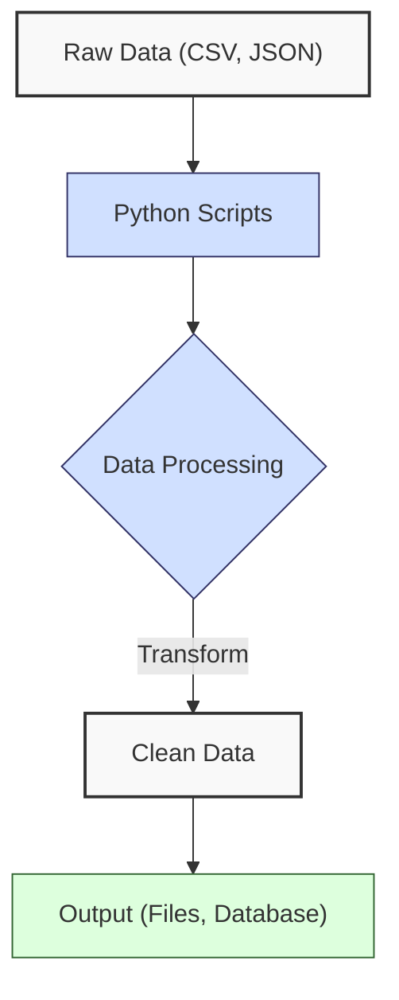
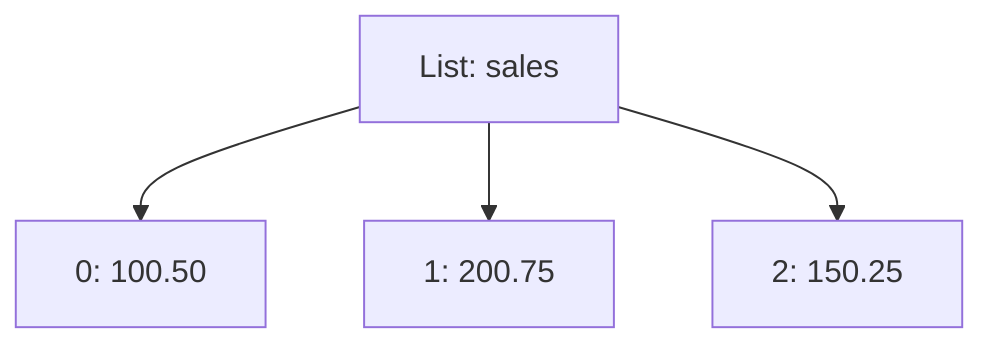
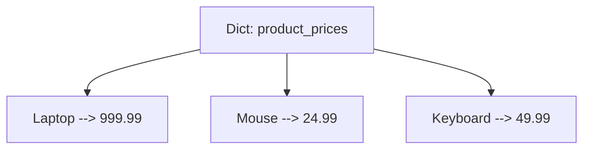
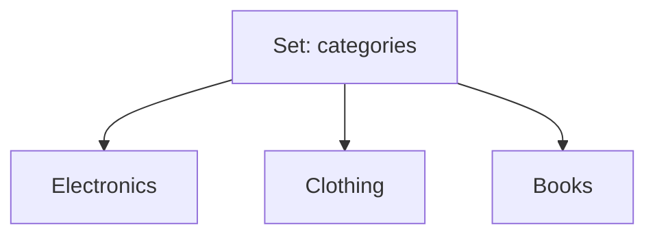
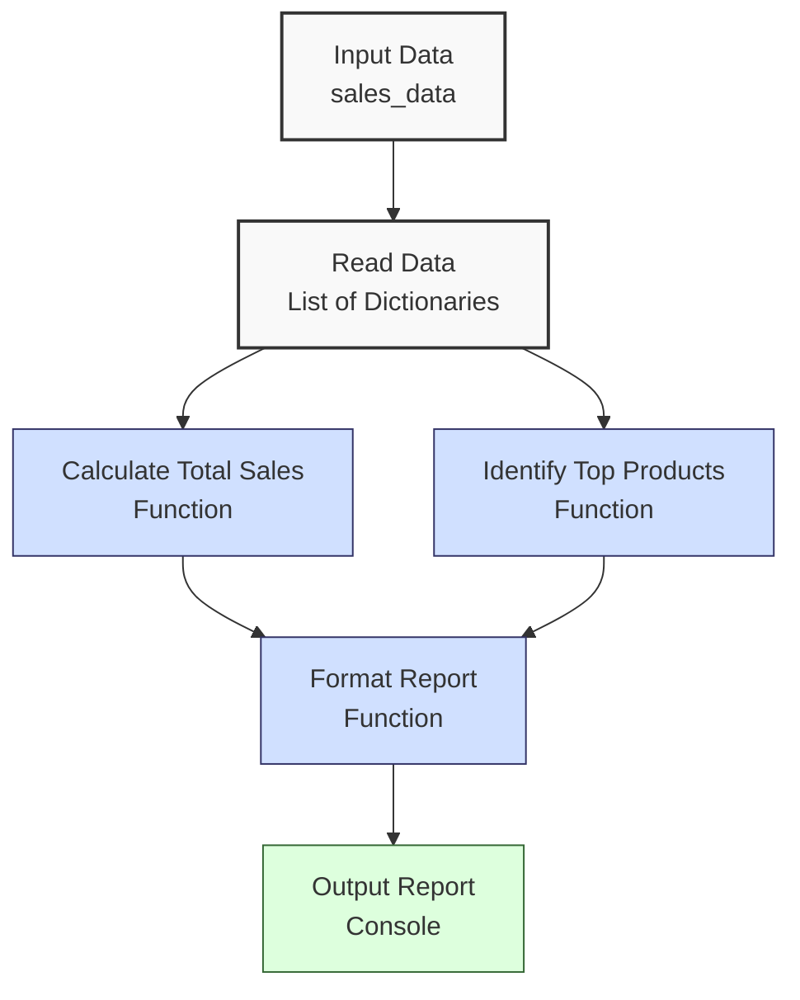

**Complexity: Easy (E)**

## 1.0 Introduction: Why This Matters for Data Engineering

Python is a cornerstone of data engineering due to its simplicity, versatility, and rich ecosystem of libraries. In data engineering, Python scripts are used to ingest, transform, and analyze data, forming the backbone of pipelines that process financial transactions, sales data, or other datasets. Understanding Python’s core language features—variables, data types, control flow, functions, and data structures—enables you to write efficient, readable code for these tasks.

This chapter introduces the fundamental building blocks of Python, equipping you with the skills to manipulate data and implement basic processing logic. These essentials are critical for creating robust data pipelines that integrate with tools like PostgreSQL, BigQuery, and Airflow in later chapters.

### Data Engineering Workflow Context

The following diagram shows how Python core concepts fit into a data engineering workflow:



### Building On and Preparing For

- **Building On**: This chapter assumes basic programming knowledge (variables, loops, functions) from prerequisite resources (e.g., Codecademy’s “Learn Python 3”). No prior Python experience is required beyond these basics.
- **Preparing For**: The skills learned here—data structures, control flow, and functions—are foundational for Chapter 2 (file handling and error management), where you’ll process external data, and Chapter 3 (NumPy and Pandas), where you’ll analyze larger datasets.

### What You’ll Learn

This chapter covers:

1. Python syntax and variables
2. Basic data types (int, float, str, bool)
3. Control flow (if statements, loops)
4. Functions and modular code
5. Data structures (lists, dictionaries, sets)

By the end, you’ll be able to write Python scripts to process sales data, compute metrics, and generate reports, setting the stage for more complex data engineering tasks.

## 1.1 Python Syntax and Variables

Python’s syntax is clean and readable, making it ideal for data engineering scripts. Variables store data for processing, such as sales amounts or product names.

### 1.1.1 Variables and Assignment

Assign values to variables using `=`.

```python
# Assigning variables
product_name = "Laptop"  # String
price = 999.99  # Float
quantity = 2  # Integer
is_in_stock = True  # Boolean

# Print variables
print(f"Product: {product_name}, Price: ${price}, Quantity: {quantity}, In Stock: {is_in_stock}")

# Output:
# Product: Laptop, Price: $999.99, Quantity: 2, In Stock: True
```

**Key Points**:

- Variables are dynamically typed; no need to declare types.
- Use descriptive names (e.g., `product_name` instead of `x`).
- `print()` with f-strings (`f"..."`) formats output.
- **Underlying Implementation**: Variables are entries in Python’s symbol table, mapping names to objects in memory. Objects are reference-counted for garbage collection.
- **Performance Considerations**:
  - **Time Complexity**: O(1) for variable assignment and lookup.
  - **Space Complexity**: O(1) per variable, plus object size (e.g., strings vary with length).
  - **Implication**: Variables are lightweight, but excessive global variables can clutter namespace.
  - **Performance Tip**: Use local variables within functions to reduce namespace pollution and improve readability.

### 1.1.2 Basic Operations

Perform arithmetic and string operations.

```python
# Arithmetic operations
total_price = price * quantity
discount = total_price * 0.1  # 10% discount
final_price = total_price - discount

print(f"Total: ${total_price:.2f}, Discount: ${discount:.2f}, Final: ${final_price:.2f}")

# String concatenation
message = product_name + " on sale!"
print(message)

# Output:
# Total: $1999.98, Discount: $199.998, Final: $1799.982
# Laptop on sale!
```

**Key Points**:

- Arithmetic: `+`, `-`, `*`, `/`, `//` (integer division), `%` (modulus), `**` (exponent).
- String concatenation with `+` or f-strings.
- **Performance Considerations**:
  - **Time Complexity**: O(1) for arithmetic, O(n) for string concatenation (where n is string length).
  - **Space Complexity**: O(1) for numbers, O(n) for new strings.
  - **Implication**: Use f-strings or `.join()` for efficient string operations in loops.
  - **Performance Tip**: Avoid repeated string concatenation with `+` in loops; use a list and `.join()` to build strings efficiently.

## 1.2 Basic Data Types

Python’s built-in types—integers, floats, strings, and booleans—are used for data manipulation.

### 1.2.1 Numbers and Booleans

Handle numerical and logical data.

```python
# Integer and float operations
items_sold = 5
revenue = items_sold * 49.99
tax_rate = 0.08
tax = revenue * tax_rate

print(f"Revenue: ${revenue:.2f}, Tax: ${tax:.2f}")

# Boolean operations
is_profitable = revenue > 200
has_tax = tax_rate > 0
print(f"Profitable: {is_profitable}, Has Tax: {has_tax}")

# Output:
# Revenue: $249.95, Tax: $19.996
# Profitable: True, Has Tax: True
```

**Key Points**:

- `int`: Whole numbers (e.g., `5`).
- `float`: Decimal numbers (e.g., `49.99`).
- `bool`: `True` or `False`, result of comparisons (`>`, `<`, `==`, `!=`, `>=`, `<=`).
- **Underlying Implementation**: Numbers are immutable objects; booleans are singletons (`True`, `False`).
- **Performance Considerations**:
  - **Time Complexity**: O(1) for arithmetic and comparisons.
  - **Space Complexity**: O(1) for `int`, `float`, `bool`.
  - **Implication**: Efficient for small-scale calculations in data pipelines.
  - **Performance Tip**: Use integers instead of floats for counts or indices to avoid floating-point precision issues.

### 1.2.2 Strings

Manipulate text data, common in data cleaning.

```python
# String operations
category = "electronics"
formatted = category.upper()
substring = category[:4]  # First 4 characters
has_prefix = category.startswith("elec")

print(f"Formatted: {formatted}, Substring: {substring}, Has Prefix: {has_prefix}")

# Output:
# Formatted: ELECTRONICS, Substring: elec, Has Prefix: True
```

**Key Points**:

- Strings are immutable sequences of characters.
- Methods: `.upper()`, `.lower()`, `.strip()`, `.startswith()`, `.replace()`.
- Slicing: `string[start:end]` (end exclusive).
- **Performance Considerations**:
  - **Time Complexity**: O(n) for most string operations (n is string length).
  - **Space Complexity**: O(n) for new strings created by operations.
  - **Implication**: Avoid repeated string concatenation in loops; use lists and `.join()` for efficiency.
  - **Performance Tip**: Pre-allocate string buffers using lists for large string manipulations to reduce memory allocations.

## 1.3 Control Flow

Control flow directs program execution, enabling data filtering and iteration.

### 1.3.1 If Statements

Make decisions based on conditions.

```python
# Check stock status
stock = 10
if stock > 0:
    status = "In Stock"
else:
    status = "Out of Stock"

print(f"Status: {status}")

# Multiple conditions
price = 999.99
if price > 1000:
    discount = 0.15
elif price > 500:
    discount = 0.10
else:
    discount = 0.05

print(f"Discount: {discount*100}%")

# Output:
# Status: In Stock
# Discount: 10%
```

**Key Points**:

- `if`, `elif`, `else` for conditional branching.
- Conditions use comparison operators and logical operators (`and`, `or`, `not`).
- **Underlying Implementation**: Evaluates conditions in order, executing the first true branch.
- **Performance Considerations**:
  - **Time Complexity**: O(1) for condition evaluation, O(n) if condition involves iteration.
  - **Space Complexity**: O(1) for simple conditions.
  - **Implication**: Efficient for decision-making in data processing.
  - **Performance Tip**: Place the most likely condition first in `if`/`elif` chains to minimize evaluations.

### 1.3.2 Loops

Iterate over data for processing.

```python
# For loop over a range
total = 0
for i in range(3):
    total += 10
    print(f"Iteration {i+1}: Total = {total}")

# While loop
count = 5
while count > 0:
    print(f"Count: {count}")
    count -= 1

# Output:
# Iteration 1: Total = 10
# Iteration 2: Total = 20
# Iteration 3: Total = 30
# Count: 5
# Count: 4
# Count: 3
# Count: 2
# Count: 1
```

**Key Points**:

- `for` loops iterate over iterables (e.g., `range()`, lists).
- `while` loops run until a condition is false.
- Use `break` to exit loops early, `continue` to skip iterations.
- **Performance Considerations**:
  - **Time Complexity**: O(n) for n iterations.
  - **Space Complexity**: O(1) for loop variables, unless storing results.
  - **Implication**: Optimize loops by minimizing operations inside.
  - **Performance Tip**: Move constant calculations outside loops to reduce redundant computations.

## 1.4 Functions and Modular Code

Functions encapsulate logic for reuse, improving code organization.

### 1.4.1 Defining Functions

Create reusable code blocks.

```python
# Calculate total sales
def calculate_total(price, quantity):
    return price * quantity

# Apply discount
def apply_discount(total, discount_rate):
    return total * (1 - discount_rate)

# Usage
sale_total = calculate_total(999.99, 2)
discounted = apply_discount(sale_total, 0.1)
print(f"Total: ${sale_total:.2f}, Discounted: ${discounted:.2f}")

# Output:
# Total: $1999.98, Discounted: $1799.982
```

**Key Points**:

- Define with `def function_name(parameters):`.
- Use `return` to output values.
- Functions promote modularity and readability.
- **Underlying Implementation**: Functions are objects, stored in memory with their code and scope.
- **Performance Considerations**:
  - **Time Complexity**: O(1) for function call overhead, plus body complexity.
  - **Space Complexity**: O(1) for function definition, plus local variables.
  - **Implication**: Functions are efficient but avoid deep recursion in data pipelines.
  - **Performance Tip**: Keep function bodies concise to minimize call overhead in performance-critical pipelines.

### 1.4.2 Default Parameters and Keyword Arguments

Enhance function flexibility.

```python
# Function with default parameters
def format_sale(product, price, currency="USD"):
    return f"{product}: {currency}{price:.2f}"

# Keyword arguments
print(format_sale("Laptop", 999.99))  # Uses default currency
print(format_sale("Mouse", 24.99, currency="EUR"))

# Output:
# Laptop: USD999.99
# Mouse: EUR24.99
```

**Key Points**:

- Default parameters provide fallback values.
- Keyword arguments improve clarity and allow flexible argument order.
- **Performance Considerations**: Same as regular functions.
  - **Performance Tip**: Use default parameters for optional settings to simplify function calls in scripts.

## 1.5 Data Structures

Lists, dictionaries, and sets store and manipulate data collections, crucial for data engineering.

### 1.5.1 Lists

Ordered, mutable sequences.

#### Visual Representation

Lists store ordered data, accessible by index:



```python
# Create and manipulate a list
sales = [100.50, 200.75, 150.25]
sales.append(300.00)  # Add item
total = sum(sales)
average = total / len(sales)

print(f"Sales: {sales}, Total: ${total:.2f}, Average: ${average:.2f}")

# List slicing
top_sales = sales[:2]
print(f"Top 2 sales: {top_sales}")

# Output:
# Sales: [100.5, 200.75, 150.25, 300.0], Total: $751.50, Average: $187.88
# Top 2 sales: [100.5, 200.75]
```

**Key Points**:

- Methods: `.append()`, `.remove()`, `.pop()`, `.extend()`.
- Slicing: `list[start:end]` (end exclusive).
- **Underlying Implementation**: Dynamic arrays with amortized O(1) append, O(n) for insertion/deletion at arbitrary indices.
- **Performance Considerations**:
  - **Time Complexity**: O(1) for append, O(n) for insert/remove, O(n) for slicing.
  - **Space Complexity**: O(n) for n elements.
  - **Implication**: Efficient for sequential access; use for ordered data like sales records.
  - **Performance Tip**: Use list comprehensions (introduced later) for transformations instead of loops to improve readability and performance.

### 1.5.2 Dictionaries

Key-value mappings.

#### Visual Representation

Dictionaries map keys to values using a hash table:



```python
# Create and manipulate a dictionary
product_prices = {
    "Laptop": 999.99,
    "Mouse": 24.99,
    "Keyboard": 49.99
}
product_prices["Monitor"] = 199.99  # Add key-value
laptop_price = product_prices["Laptop"]

print(f"Prices: {product_prices}, Laptop Price: ${laptop_price:.2f}")

# Iterate over dictionary
for product, price in product_prices.items():
    print(f"{product}: ${price:.2f}")

# Output:
# Prices: {'Laptop': 999.99, 'Mouse': 24.99, 'Keyboard': 49.99, 'Monitor': 199.99}, Laptop Price: $999.99
# Laptop: $999.99
# Mouse: $24.99
# Keyboard: $49.99
# Monitor: $199.99
```

**Key Points**:

- Access with `dict[key]`; use `.get(key, default)` to avoid KeyError.
- Methods: `.keys()`, `.values()`, `.items()`.
- **Underlying Implementation**: Hash tables with O(1) average-case lookup/insert/delete.
- **Performance Considerations**:
  - **Time Complexity**: O(1) average for lookup/insert/delete, O(n) worst case (hash collisions).
  - **Space Complexity**: O(n) for n key-value pairs.
  - **Implication**: Ideal for lookups, e.g., mapping products to prices.
  - **Performance Tip**: Use `.get()` for safe key access to avoid runtime errors in data processing.

### 1.5.3 Sets

Unordered collections of unique elements.

#### Visual Representation

Sets store unique elements with no order:



```python
# Create and manipulate a set
categories = {"Electronics", "Clothing", "Electronics"}  # Duplicates removed
categories.add("Books")
has_electronics = "Electronics" in categories

print(f"Categories: {categories}, Has Electronics: {has_electronics}")

# Set operations
sale_categories = {"Electronics", "Accessories"}
common = categories & sale_categories
print(f"Common categories: {common}")

# Output:
# Categories: {'Electronics', 'Clothing', 'Books'}, Has Electronics: True
# Common categories: {'Electronics'}
```

**Key Points**:

- Sets automatically remove duplicates.
- Operations: `&` (intersection), `|` (union), `-` (difference).
- **Underlying Implementation**: Hash tables, similar to dictionaries, with O(1) average-case lookup/insert.
- **Performance Considerations**:
  - **Time Complexity**: O(1) average for membership test, O(min(n,m)) for set operations (n,m are set sizes).
  - **Space Complexity**: O(n) for n elements.
  - **Implication**: Useful for deduplication and membership testing, e.g., unique product categories.
  - **Performance Tip**: Use sets for membership tests instead of lists to leverage O(1) lookup speed.

## 1.6 Micro-Project: Sales Data Analyzer

### Project Requirements

Build a Python script to process a sales dataset (`data/sales.csv`), calculate total sales, identify top-selling products, and output a formatted report. This project applies variables, data types, control flow, functions, and data structures, avoiding concepts from later chapters (e.g., file I/O, error handling).

### Dataset Seeding

Since file handling is introduced in Chapter 2, the dataset is provided as an in-memory list of dictionaries. For consistency, you can save this as `data/sales.csv` for future chapters, but the script uses the embedded data.

**Sample `data/sales.csv` (for reference)**:

```csv
product,price,quantity
Laptop,999.99,2
Mouse,24.99,10
Keyboard,49.99,5
Monitor,199.99,3
Headphones,59.99,4
```

### Setup Instructions

1. **Install Python**: Download and install Python 3.10+ from [python.org](https://www.python.org/downloads/).
2. **Create Project Folder**: Make a folder (e.g., `de-onboarding/`) with a `data/` subfolder.
3. **Save Script**: Copy the code below into `de-onboarding/sales_analyzer.py`.
4. **Optional - Use VS Code**: Install Visual Studio Code ([code.visualstudio.com](https://code.visualstudio.com/)) and the Python extension for better editing.

### Sales Processing Flow

The following diagram illustrates the data flow for the micro-project:



### Acceptance Criteria

- **Go Criteria**:
  - Calculates total sales correctly (price \* quantity for all records).
  - Identifies top 3 products by sales amount.
  - Outputs a formatted report with total sales and top products.
  - Uses functions for modularity (e.g., calculate total, format report).
  - Processes the provided dataset.
- **No-Go Criteria**:
  - Incorrect total sales calculation.
  - Missing or incorrect top products.
  - No modular functions.
  - Uses file I/O or error handling.
  - Unreadable or missing report.

### Common Pitfalls to Avoid

1. **Incorrect Calculations**:
   - **Problem**: Miscalculating totals due to type errors (e.g., treating prices as strings).
   - **Solution**: Convert strings to floats explicitly.
2. **Hard-Coding Data**:
   - **Problem**: Embedding logic without functions.
   - **Solution**: Use functions for each task.
3. **Inefficient Sorting**:
   - **Problem**: Sorting all products unnecessarily when only top 3 are needed.
   - **Solution**: Sort and slice to limit processing.
4. **Unclear Output**:
   - **Problem**: Report lacks formatting, making it hard to read.
   - **Solution**: Use f-strings for consistent formatting.
5. **No Modularity**:
   - **Problem**: All logic in one block, reducing reusability.
   - **Solution**: Break logic into functions.

### How This Differs from Production-Grade Solutions

In production, this solution would include:

- **File I/O**: Reading from actual CSV files (Chapter 2).
- **Error Handling**: Handling missing or invalid data (Chapter 2).
- **Testing**: Unit tests for calculations (Chapter 9).
- **Scalability**: Processing large datasets with Pandas (Chapter 3).
- **Logging**: Tracking execution details (Chapter 8).
- **Configuration**: External settings for file paths (Chapter 8).

### Implementation

```python
# Simulate sales.csv data (file handling covered in Chapter 2)
sales_data = [
    {"product": "Laptop", "price": 999.99, "quantity": 2},
    {"product": "Mouse", "price": 24.99, "quantity": 10},
    {"product": "Keyboard", "price": 49.99, "quantity": 5},
    {"product": "Monitor", "price": 199.99, "quantity": 3},
    {"product": "Headphones", "price": 59.99, "quantity": 4}
]

# Function to calculate total sales
def calculate_total_sales(sales):
    """
    Calculate total sales from a list of sales records.
    Returns the sum of price * quantity for all records.
    """
    total = 0
    for sale in sales:
        total += float(sale["price"]) * int(sale["quantity"])
    return total

# Function to find top N products by sales
def find_top_products(sales, n=3):
    """
    Find top N products by sales amount.
    Returns a list of (product, amount) tuples, sorted by amount descending.
    """
    product_sales = {}
    for sale in sales:
        product = sale["product"]
        amount = float(sale["price"]) * int(sale["quantity"])
        product_sales[product] = product_sales.get(product, 0) + amount

    # Sort by sales amount, return top N
    sorted_sales = sorted(
        product_sales.items(),
        key=lambda x: x[1],
        reverse=True
    )
    return sorted_sales[:n]

# Function to format the report
def format_report(total_sales, top_products):
    """
    Format a sales report as a string.
    Includes total sales and top products.
    """
    report = "SALES REPORT\n"
    report += "============\n\n"
    report += f"Total Sales: ${total_sales:.2f}\n\n"
    report += "Top Products:\n"
    for product, amount in top_products:
        report += f"  {product}: ${amount:.2f}\n"
    report += "\n============\n"
    return report

# Main function to process data
def main():
    # Calculate metrics
    total_sales = calculate_total_sales(sales_data)
    top_products = find_top_products(sales_data, n=3)

    # Generate and print report
    report = format_report(total_sales, top_products)
    print(report)

if __name__ == "__main__":
    main()
```

### Expected Output

```
SALES REPORT
============

Total Sales: $2938.90

Top Products:
  Laptop: $1999.98
  Monitor: $599.97
  Keyboard: $249.95

============
```

### How to Run and Test the Solution

1. **Run**:

   - Open a terminal in the `de-onboarding/` folder.
   - Execute: `python sales_analyzer.py`.
   - Output: Formatted report printed to console.

2. **Test Scenarios**:
   - **Valid Data**: Verify total sales ($2938.90) and top products (Laptop, Monitor, Keyboard with correct amounts).
   - **Empty Data**: Modify `sales_data = []`. Report should show $0.00 total and empty top products.
   - **Single Record**: Use one record (e.g., `[{"product": "Laptop", "price": 999.99, "quantity": 2}]`). Verify correct total ($1999.98) and single top product.
   - **Large Quantities**: Add a record with high quantity (e.g., `{"product": "Pen", "price": 1.99, "quantity": 1000}`). Confirm correct calculations.

## 1.7 Practice Exercises

These exercises reinforce variables, data types, control flow, functions, and data structures, with increasing complexity.

### Exercise 1: Price Formatter

Write a function that formats a price and currency as a string (e.g., "$999.99"). Handle integer or float inputs.

**Sample Input**:

```python
price = 999.99
currency = "USD"
```

**Expected Output**:

```
USD999.99
```

### Exercise 2: Sales Filter

Write a function that filters sales records with quantity > 5, returning a list of product names.

**Sample Input**:

```python
sales = [
    {"product": "Laptop", "quantity": 2},
    {"product": "Mouse", "quantity": 10},
    {"product": "Keyboard", "quantity": 5}
]
```

**Expected Output**:

```
['Mouse']
```

### Exercise 3: Category Counter

Write a function that counts unique product categories from a list of records with a `category` field, using a set.

**Sample Input**:

```python
records = [
    {"product": "Laptop", "category": "Electronics"},
    {"product": "Mouse", "category": "Electronics"},
    {"product": "T-shirt", "category": "Clothing"}
]
```

**Expected Output**:

```
2
```

### Exercise 4: Discount Calculator

Write a function that applies tiered discounts based on total sales amount:

- > $1000: 15%
- > $500: 10%
- Else: 5%
  Return the discounted amount.

**Sample Input**:

```python
total = 1500
```

**Expected Output**:

```
1275.0
```

### Exercise 5: Top Sales Aggregator

Write a function that aggregates sales by product and returns the top product by total sales amount.

**Sample Input**:

```python
sales = [
    {"product": "Laptop", "price": 999.99, "quantity": 2},
    {"product": "Mouse", "price": 24.99, "quantity": 10}
]
```

**Expected Output**:

```
Laptop
```

### Exercise 6: Debug a Sales Calculator

The following function is supposed to calculate total sales but fails with a TypeError. Fix the bug and explain the issue.

**Buggy Code**:

```python
def calculate_total(sales):
    total = 0
    for sale in sales:
        total += sale["price"] * sale["quantity"]  # Bug: No type conversion
    return total

sales = [{"product": "Laptop", "price": "999.99", "quantity": "2"}]
print(calculate_total(sales))  # TypeError: can't multiply sequence by non-int
```

**Task**:

- Fix the function to handle string inputs.
- Explain the error and your solution.

**Expected Output**:

```
1999.98
```

## 1.8 Exercise Solutions

### Solution to Exercise 1: Price Formatter

```python
def format_price(price, currency="USD"):
    """Format a price with currency."""
    return f"{currency}{float(price):.2f}"

# Test
print(format_price(999.99))  # USD999.99
print(format_price(24, "EUR"))  # EUR24.00
```

### Solution to Exercise 2: Sales Filter

```python
def filter_high_quantity(sales):
    """Filter sales with quantity > 5."""
    return [sale["product"] for sale in sales if int(sale["quantity"]) > 5]

# Test
sales = [
    {"product": "Laptop", "quantity": 2},
    {"product": "Mouse", "quantity": 10},
    {"product": "Keyboard", "quantity": 5}
]
print(filter_high_quantity(sales))  # ['Mouse']
```

### Solution to Exercise 3: Category Counter

```python
def count_categories(records):
    """Count unique categories using a set."""
    categories = set(record["category"] for record in records)
    return len(categories)

# Test
records = [
    {"product": "Laptop", "category": "Electronics"},
    {"product": "Mouse", "category": "Electronics"},
    {"product": "T-shirt", "category": "Clothing"}
]
print(count_categories(records))  # 2
```

### Solution to Exercise 4: Discount Calculator

```python
def calculate_discount(total):
    """Apply tiered discounts based on total."""
    if total > 1000:
        discount = 0.15
    elif total > 500:
        discount = 0.10
    else:
        discount = 0.05
    return total * (1 - discount)

# Test
print(calculate_discount(1500))  # 1275.0
print(calculate_discount(600))   # 540.0
print(calculate_discount(200))   # 190.0
```

### Solution to Exercise 5: Top Sales Aggregator

```python
def top_product_by_sales(sales):
    """Find product with highest sales amount."""
    product_sales = {}
    for sale in sales:
        product = sale["product"]
        amount = float(sale["price"]) * int(sale["quantity"])
        product_sales[product] = product_sales.get(product, 0) + amount

    if not product_sales:
        return None
    return max(product_sales.items(), key=lambda x: x[1])[0]

# Test
sales = [
    {"product": "Laptop", "price": 999.99, "quantity": 2},
    {"product": "Mouse", "price": 24.99, "quantity": 10}
]
print(top_product_by_sales(sales))  # Laptop
```

### Solution to Exercise 6: Debug a Sales Calculator

**Fixed Code**:

```python
def calculate_total(sales):
    """Calculate total sales from a list of records."""
    total = 0
    for sale in sales:
        total += float(sale["price"]) * int(sale["quantity"])
    return total

# Test
sales = [{"product": "Laptop", "price": "999.99", "quantity": "2"}]
print(calculate_total(sales))  # 1999.98
```

**Explanation**:

- **Error**: The original code caused a TypeError because `sale["price"]` and `sale["quantity"]` were strings, and Python cannot multiply strings directly (it interprets `*` as string repetition for non-integer multipliers).
- **Solution**: Convert `price` to `float` and `quantity` to `int` using `float()` and `int()` to ensure numerical multiplication.
- **Implication**: Always validate and convert data types when processing external data, as inputs may not match expected types.

## 1.9 Chapter Summary and Connection to Chapter 2

In this chapter, you’ve mastered:

- **Syntax and Variables**: Declaring and using variables for data storage.
- **Data Types**: Working with numbers, strings, and booleans.
- **Control Flow**: Using if statements and loops for logic and iteration.
- **Functions**: Writing modular, reusable code.
- **Data Structures**: Using lists, dictionaries, and sets for data organization.

These skills, along with their performance characteristics (time and space complexity), enable you to process data programmatically. The micro-project built a sales analyzer that calculates totals and identifies top products, simulating a basic data engineering task.

### Connection to Chapter 2

Chapter 2 builds on these foundations by introducing:

- **File Handling**: Reading `sales.csv` directly instead of simulating data.
- **Error Handling**: Managing issues like missing files or invalid data.
- **CSV/JSON Processing**: Handling common data formats for pipelines.
- **List Comprehensions**: Enhancing data transformations from this chapter’s loops.
- **Modules**: Using `csv`, `json`, and `logging` to extend functionality.

The sales analyzer will be enhanced in Chapter 2 to read from files, handle errors, and export results, preparing you for real-world data processing and integration with NumPy and Pandas in Chapter 3.
