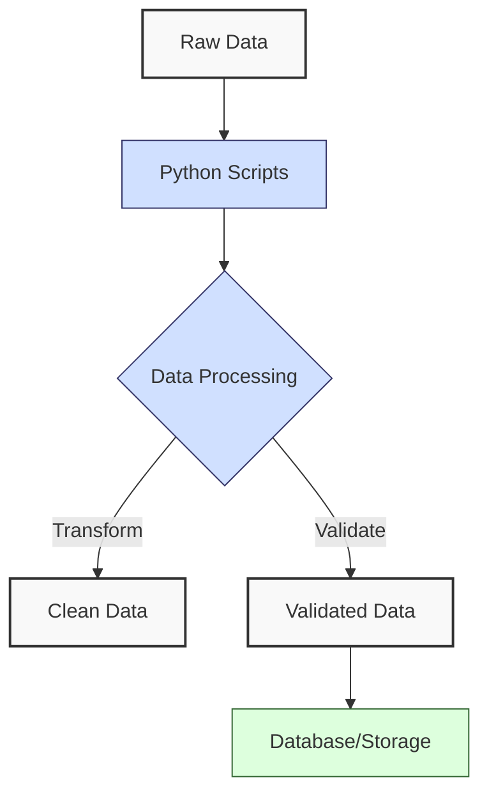

**Complexity: Easy (E)**

## 1.0 Introduction: Why This Matters for Data Engineering

Python is the backbone of modern data engineering due to its simplicity, versatility, and extensive ecosystem of libraries. As a data engineer, you'll use Python to build data pipelines, process large datasets, and integrate with databases and cloud systems. Mastering the core language essentials is critical because these fundamentals underpin every data engineering task, from simple data transformations to complex pipeline orchestration.

This chapter lays the foundation for your data engineering journey by introducing Python's core syntax, data structures, and control flow. These skills are essential for writing clean, maintainable code that forms the basis of robust data pipelines.

### Data Engineering Workflow Context

Here’s how the concepts in this chapter fit into a typical data engineering workflow:



### Building On and Preparing For

- **Building On**: This chapter assumes basic programming knowledge (variables, loops, functions) and introduces Python-specific implementations. No prior Python experience is required, but familiarity with any programming language will help.
- **Preparing For**: These fundamentals are critical for Chapter 2 (Python Data Handling and Error Management), where you'll work with files and error handling, and Chapter 3 (NumPy and Pandas Basics), where you'll use Python to manipulate large datasets. Every subsequent chapter relies on these core skills.

### What You'll Learn

This chapter covers:

1. Python syntax and data types
2. Control flow (if/else, loops)
3. Functions and their role in reusable code
4. Data structures (lists, dictionaries, tuples, sets)
5. String manipulation for data formatting

By the end, you'll be able to write Python scripts to process simple datasets, a foundational skill for data engineering.

---

## 1.1 Python Syntax and Data Types

Python's syntax is clean and readable, making it ideal for data engineering tasks. Let’s start with the basics: variables, data types, and basic operations.

### 1.1.1 Variables and Primitive Types

Python supports several primitive data types: integers (`int`), floating-point numbers (`float`), booleans (`bool`), and strings (`str`).

```python
# Assigning variables with different data types
record_id = 1001  # int: whole numbers
price = 29.99     # float: decimal numbers
is_active = True  # bool: True or False
product_name = "Widget A"  # str: text

# Printing variables to see their values
print(f"Record ID: {record_id}")
print(f"Price: ${price}")
print(f"Active: {is_active}")
print(f"Product: {product_name}")

# Output:
# Record ID: 1001
# Price: $29.99
# Active: True
# Product: Widget A
```

**Key Points**:

- Variables are created when you assign a value using `=`.
- Use `print()` to display output, and `f-strings` (e.g., `f"Price: ${price}"`) for formatted strings.
- Python is dynamically typed; you don’t need to declare the type explicitly.
- **Underlying Implementation**:
  - `int`: Arbitrary-precision integers, with no fixed size, growing as needed to represent large numbers. Useful in data engineering for precise calculations, like counting records.
  - `float`: 64-bit double-precision numbers (`float64`) per the IEEE 754 standard, balancing precision and memory for numerical data like prices or measurements.
  - `bool`: A subclass of `int`, stored as 1 (`True`) or 0 (`False`), using minimal memory for flags like data validity.
  - `str`: Unicode strings, stored as variable-length character arrays, ideal for text processing in datasets (e.g., product names).
- **Performance Considerations**:
  - **Time Complexity**:
    - `int`: Arithmetic operations (e.g., `+`, `*`) are O(1) for small numbers but can be O(log n) for very large numbers due to arbitrary precision, impacting performance in large-scale calculations.
    - `float`: Arithmetic operations are O(1), as they use fixed `float64` precision, making them fast for numerical data in pipelines.
    - `bool`: Logical operations (e.g., `and`, `or`) are O(1), with minimal overhead, suitable for frequent condition checks.
    - `str`: Concatenation (`+`) is O(n), where n is the string length, as it creates a new string. Avoid repeated concatenation in loops for large datasets, as it can slow down data processing.
  - **Space Complexity**:
    - `int`: O(log n), where n is the number’s magnitude, due to arbitrary-precision storage, consuming more memory for very large numbers.
    - `float`: O(1), fixed 64-bit storage, efficient for numerical data.
    - `bool`: O(1), minimal storage (single bit internally), ideal for flags in large datasets.
    - `str`: O(n), where n is the string length, for character storage, significant in text-heavy datasets like logs or product descriptions.

### 1.1.2 Basic Operations

You can perform arithmetic and comparison operations on these types:

```python
# Arithmetic operations
total_price = price * 2  # Multiply float
quantity = record_id - 1000  # Subtract int
discount = price / 2  # Divide float

print(f"Total Price: ${total_price}")
print(f"Quantity: {quantity}")
print(f"Discount: ${discount}")

# Comparison operations
is_expensive = price > 20.0
has_stock = quantity > 0

print(f"Is Expensive? {is_expensive}")
print(f"Has Stock? {has_stock}")

# Output:
# Total Price: $59.98
# Quantity: 1
# Discount: $14.995
# Is Expensive? True
# Has Stock? True
```

**Key Points**:

- Arithmetic operators: `+`, `-`, `*`, `/`, `//` (floor division), `%` (modulus), `**` (exponentiation).
- Comparison operators: `>`, `<`, `>=`, `<=`, `==`, `!=`.
- Operations produce results based on the data types involved (e.g., `int * float` yields a `float`).

---

## 1.2 Control Flow

Control flow allows your code to make decisions and repeat tasks, which is essential for processing datasets conditionally or iteratively.

### 1.2.1 Conditional Statements (if/elif/else)

Conditional statements execute code based on whether a condition is `True` or `False`.

```python
# Example: Categorize a product based on price
price = 29.99

if price > 50:
    category = "Premium"
elif price > 20:
    category = "Standard"
else:
    category = "Budget"

print(f"Product Category: {category}")

# Output:
# Product Category: Standard
```

**Key Points**:

- Use `if` to check a condition, `elif` for additional conditions, and `else` for the default case.
- Indentation (typically 4 spaces) defines the scope of each block.
- Conditions can include logical operators: `and`, `or`, `not`.

### 1.2.2 Loops

Loops allow you to iterate over data, a common task in data engineering for processing records.

#### For Loop

```python
# Iterate over a range of numbers to simulate processing records
for i in range(1, 4):  # range(1, 4) generates 1, 2, 3
    print(f"Processing record #{i}")

# Output:
# Processing record #1
# Processing record #2
# Processing record #3
```

#### While Loop

```python
# Process records until a condition is met
stock = 5
while stock > 0:
    print(f"Items in stock: {stock}")
    stock -= 1  # Decrease stock by 1

print("Stock depleted!")

# Output:
# Items in stock: 5
# Items in stock: 4
# Items in stock: 3
# Items in stock: 2
# Items in stock: 1
# Stock depleted!
```

**Key Points**:

- `for` loops are ideal for iterating over known sequences (e.g., lists, ranges).
- `while` loops run until a condition becomes `False`.
- Use `break` to exit a loop early, or `continue` to skip to the next iteration.

---

## 1.3 Functions

Functions allow you to encapsulate reusable code, making your data processing scripts modular and maintainable.

### 1.3.1 Defining and Calling Functions

```python
# Define a function to calculate the total cost of an order
def calculate_total(price, quantity):
    total = price * quantity
    return total

# Call the function with sample data
item_price = 19.99
item_quantity = 3
order_total = calculate_total(item_price, item_quantity)

print(f"Order Total: ${order_total}")

# Output:
# Order Total: $59.97
```

**Key Points**:

- Define functions with `def`, followed by the function name and parameters in parentheses.
- Use `return` to send a value back to the caller.
- Functions improve code reusability and readability.

### 1.3.2 Default Parameters and Keyword Arguments

```python
# Function with default tax rate and keyword arguments
def calculate_total_with_tax(price, quantity, tax_rate=0.1):
    subtotal = price * quantity
    tax = subtotal * tax_rate
    return subtotal + tax

# Call with default tax rate
total1 = calculate_total_with_tax(19.99, 3)
print(f"Total with default tax: ${total1}")

# Call with custom tax rate using keyword argument
total2 = calculate_total_with_tax(price=19.99, quantity=3, tax_rate=0.15)
print(f"Total with custom tax: ${total2}")

# Output:
# Total with default tax: $65.967
# Total with custom tax: $68.965
```

**Key Points**:

- Default parameters allow optional arguments with preset values.
- Keyword arguments improve clarity by specifying parameter names.

---

## 1.4 Data Structures

Data structures like lists, dictionaries, tuples, and sets are critical for organizing and processing data in data engineering tasks.

### 1.4.1 Lists

Lists are ordered, mutable collections of items.

```python
# Create a list of product prices
prices = [19.99, 29.99, 9.99, 49.99]

# Access elements
first_price = prices[0]  # First element
last_price = prices[-1]  # Last element

print(f"First price: ${first_price}")
print(f"Last price: ${last_price}")

# Output:
# First price: $19.99
# Last price: $49.99

# Modify the list
prices.append(39.99)  # Add an item
prices[1] = 24.99     # Update an item
print(f"Updated prices: {prices}")
# Updated prices: [19.99, 24.99, 9.99, 49.99, 39.99]

# Iterate over the list
for price in prices:
    print(f"Price: ${price}")
# Price: $19.99
# Price: $24.99
# Price: $9.99
# Price: $49.99
# Price: $39.99
```

**Key Points**:

- Lists are indexed starting at 0.
- Use methods like `append()`, `remove()`, and `pop()` to modify lists.
- Lists are versatile for storing ordered data sequences.
- **Underlying Implementation**: Lists are dynamic arrays, stored as resizable, contiguous memory blocks with pointers to objects. This allows flexible resizing but may require occasional memory reallocation, impacting performance in data engineering tasks with large datasets.
- **Performance Considerations**:
  - **Time Complexity**:
    - Indexing (e.g., `prices[0]`): O(1), fast for accessing elements by position.
    - Appending (`append()`): O(1) average case, but O(n) worst case if the array needs resizing, where n is the list length.
    - Iteration: O(n), as it visits each element, important for processing large datasets.
    - Insertion/Deletion (middle): O(n), as elements must be shifted, slow for large lists in data pipelines.
  - **Space Complexity**:
    - Storage: O(n), where n is the number of elements, for the dynamic array storing pointers to objects.
    - Operations (e.g., appending): O(1) additional space average case, O(n) worst case if resizing requires a new array.
    - Implication: Memory usage grows linearly with dataset size, suitable for ordered data but less efficient for frequent modifications.

### 1.4.2 Dictionaries

Dictionaries store key-value pairs, ideal for representing structured data like records.

```python
# Create a dictionary representing a product
product = {
    "id": 1001,
    "name": "Widget A",
    "price": 19.99,
    "in_stock": True
}

# Access values
product_name = product["name"]
product_price = product.get("price")  # Safe access
print(f"Product: {product_name}, Price: ${product_price}")
# Product: Widget A, Price: $19.99

# Modify dictionary
product["price"] = 24.99
product["category"] = "Electronics"
print(f"Updated product: {product}")
# Updated product: {'id': 1001, 'name': 'Widget A', 'price': 24.99, 'in_stock': True, 'category': 'Electronics'}

# Iterate over keys and values
for key, value in product.items():
    print(f"{key}: {value}")
# id: 1001
# name: Widget A
# price: 24.99
# in_stock: True
# category: Electronics
```

**Key Points**:

- Access values with `dict[key]` or `dict.get(key)` (returns `None` if key is missing).
- Dictionaries are mutable and ideal for representing structured data.
- Use `items()` to iterate over key-value pairs.
- **Underlying Implementation**: Dictionaries are hash tables, storing key-value pairs with fast lookup via hashing. This makes them efficient for data engineering tasks requiring quick access, like mapping product IDs to details, but memory usage grows with the number of entries.
- **Performance Considerations**:
  - **Time Complexity**:
    - Lookup (e.g., `dict[key]`, `get()`): O(1) average case, O(n) worst case (rare, due to hash collisions), making dictionaries ideal for quick queries in data engineering.
    - Insertion/Deletion: O(1) average case, efficient for updating records.
    - Iteration: O(n), where n is the number of key-value pairs, relevant for processing large mappings.
  - **Space Complexity**:
    - Storage: O(n), where n is the number of key-value pairs, for the hash table, including overhead for empty slots to reduce collisions.
    - Operations (e.g., `get()`, insertion): O(1) additional space, as they modify the existing table.
    - Implication: Higher memory overhead than lists due to hashing, but efficient for fast lookups in large datasets.

### 1.4.3 Tuples

Tuples are ordered, immutable collections.

```python
# Create a tuple representing a coordinate
coordinate = (10.5, 20.3)

# Access elements
x = coordinate[0]
y = coordinate[1]
print(f"X: {x}, Y: {y}")
# X: 10.5, Y: 20.3

# Tuples are immutable
# Attempting to modify would raise an error: coordinate[0] = 15.0
print("Note: Tuples cannot be modified after creation.")
# Note: Tuples cannot be modified after creation.
```

**Key Points**:

- Tuples are immutable, making them suitable for fixed data.
- Use for lightweight, constant data structures.
- **Underlying Implementation**: Tuples are fixed-size arrays, stored in contiguous memory with pointers to objects. Their immutability allows compact storage, useful in data engineering for constant data like configuration settings.
- **Performance Considerations**:
  - **Time Complexity**:
    - Indexing: O(1), fast for accessing elements, similar to lists but with less overhead due to immutability.
    - Iteration: O(n), where n is the tuple length, efficient for small, fixed datasets.
    - Creation: O(n), but immutability ensures no resizing, saving memory in data pipelines.
  - **Space Complexity**:
    - Storage: O(n), where n is the number of elements, for the fixed-size array storing pointers to objects.
    - Operations (e.g., indexing): O(1) additional space, as no new structures are created.
    - Implication: More memory-efficient than lists due to immutability, ideal for fixed data in memory-constrained environments.

### 1.4.4 Sets

Sets store unique, unordered items.

```python
# Create a set of product categories
categories = {"Electronics", "Clothing", "Books"}

# Add and remove items
categories.add("Toys")
categories.remove("Books")
print(f"Categories: {categories}")
# Categories: {'Electronics', 'Clothing', 'Toys'}

# Set operations
available_categories = {"Electronics", "Toys", "Furniture"}
common_categories = categories.intersection(available_categories)
print(f"Common categories: {common_categories}")
# Common categories: {'Electronics', 'Toys'}
```

**Key Points**:

- Sets ensure uniqueness (duplicates are automatically removed).
- Use set operations like `union()`, `intersection()`, and `difference()` for data comparisons.
- **Underlying Implementation**: Sets are hash tables, similar to dictionaries but storing only keys. This ensures fast membership testing and uniqueness, ideal for data engineering tasks like deduplicating categories or IDs.
- **Performance Considerations**:
  - **Time Complexity**:
    - Membership testing (e.g., `in`): O(1) average case, fast for checking if an item exists in large datasets.
    - Adding/Removing: O(1) average case, efficient for updating sets.
    - Set operations (e.g., `intersection`): O(min(len(set1), len(set2))), useful for comparing datasets but slower for very large sets.
  - **Space Complexity**:
    - Storage: O(n), where n is the number of elements, for the hash table, including overhead for empty slots.
    - Operations (e.g., membership, adding): O(1) additional space, as they modify the existing table.
    - Set operations (e.g., `intersection`): O(min(len(set1), len(set2))) for the output set, impacting memory for large operations.
    - Implication: Similar memory overhead to dictionaries, efficient for unique data but requires careful management in memory-constrained pipelines.

---

## 1.5 String Manipulation

Strings are critical for formatting and cleaning data in data engineering.

### 1.5.1 Basic String Operations

```python
# Create a string
product_name = "Widget A"

# String methods
uppercase_name = product_name.upper()
cleaned_name = product_name.strip()  # Remove whitespace
print(f"Uppercase: {uppercase_name}")
print(f"Cleaned: {cleaned_name}")
# Uppercase: WIDGET A
# Cleaned: Widget A

# Concatenation
description = product_name + " - High Quality"
print(f"Description: {description}")
# Description: Widget A - High Quality
```

**Key Points**:

- Common string methods: `upper()`, `lower()`, `strip()`, `replace()`, `split()`.
- Concatenate strings with `+` or use f-strings for formatting.

### 1.5.2 F-Strings for Formatting

```python
# Format data using f-strings
product_id = 1001
price = 19.99
quantity = 3

summary = f"Product ID: {product_id}, Total: ${price * quantity:.2f}"
print(summary)
# Product ID: 1001, Total: $59.97
```

**Key Points**:

- F-strings (`f"..."`) allow embedding expressions inside strings.
- Use format specifiers (e.g., `.2f`) for precise number formatting.

---

## 1.6 Micro-Project: Sales Data Analyzer

### Project Requirements

Create a Python script that processes a sales dataset (stored as an in-memory list of dictionaries), calculates key metrics (total sales, average order value, top-selling product), and generates formatted output. This project applies the concepts from this chapter: data structures, functions, control flow, and string manipulation.

### Acceptance Criteria

- **Go Criteria**:

  - Script runs without errors when provided the dataset.
  - Correctly calculates total sales, average order value, and identifies the top-selling product.
  - Handles edge cases (missing data, invalid entries).
  - Uses appropriate Python data structures (lists, dictionaries).
  - Includes comments explaining the code’s functionality.
  - Produces readable, formatted output.

- **No-Go Criteria**:
  - Script crashes on invalid data.
  - Incorrect statistical calculations.
  - No handling for missing or malformed data.
  - Lack of comments explaining the processing logic.
  - Disorganized or unreadable output format.

### Common Pitfalls to Avoid

1. **Missing Dictionary Fields**:

   - **Problem**: The dataset may have dictionaries missing required fields (e.g., `product`, `price`, `quantity`), causing errors in calculations.
   - **Solution**: Validate that all required fields are present before processing each record.

2. **String vs. Numeric Data Confusion**:

   - **Problem**: Data values (e.g., `price`, `quantity`) are stored as strings, leading to errors in calculations.
   - **Solution**: Validate and convert strings to numbers before calculations.

3. **Invalid Entries**:

   - **Problem**: Invalid data (e.g., non-numeric prices or zero quantities) affects calculations.
   - **Solution**: Check data validity before processing using string methods.

4. **Limited String-Based Validation**:
   - **Problem**: Checking if a string represents a number (e.g., for prices) can miss some invalid cases, as string methods are less robust than error handling.
   - **Solution**: Use careful string checks in Chapter 1; Chapter 2 introduces more robust methods for handling invalid data.

### How This Differs from Production-Grade Solutions

In a production environment, this solution would include:

- **Robust Error Handling**: Comprehensive exception handling (covered in Chapter 2).
- **Logging**: Structured logging to track execution (Chapter 2).
- **File Integration**: Processing data from files instead of in-memory structures (Chapter 2).
- **Testing**: Unit tests to verify calculations (Chapter 9).
- **Scalability**: Handling large datasets efficiently (Chapter 3 with Pandas).

### Implementation

```python
# Function to provide sales data as an in-memory list of dictionaries
def read_sales_data():
    """
    Return a list of dictionaries representing sales data.
    Each dictionary contains product, price, and quantity.
    """
    sales = [
        {'product': 'Laptop', 'price': '999.99', 'quantity': '2'},
        {'product': 'Mouse', 'price': '24.99', 'quantity': '10'},
        {'product': 'Keyboard', 'price': '49.99', 'quantity': '5'},
        {'product': '', 'price': '29.99', 'quantity': '3'},  # Missing product
        {'product': 'Monitor', 'price': 'invalid', 'quantity': '2'},  # Invalid price
        {'product': 'Headphones', 'price': '59.99', 'quantity': '0'},  # Zero quantity
        {'product': 'Laptop', 'price': '899.99', 'quantity': '1'}
    ]
    return sales

# Function to validate and clean a sale record
def validate_sale(sale):
    """
    Validate that price and quantity are numeric and positive.
    Returns True if valid, False otherwise.
    """
    # Check if required fields exist
    if not all(key in sale for key in ['product', 'price', 'quantity']):
        return False

    # Check if product is non-empty
    if not sale['product'].strip():
        return False

    # Check if quantity is a positive integer
    quantity = sale['quantity'].strip()
    if not quantity.isdigit():
        return False
    quantity_num = int(quantity)
    if quantity_num <= 0:
        return False

    # Check if price is a valid positive float (e.g., "123.45" or "123")
    price = sale['price'].strip()
    parts = price.split('.')
    if len(parts) > 2 or not parts[0].replace('-', '').isdigit():
        return False
    if len(parts) == 2 and not parts[1].isdigit():
        return False
    price_num = float(price)
    if price_num <= 0:
        return False

    return True

# Function to calculate total sales
def calculate_total_sales(sales):
    """Calculate the total sales amount."""
    total = 0.0
    for sale in sales:
        if validate_sale(sale):
            total += float(sale['price']) * int(sale['quantity'])
    return total

# Function to calculate average order value
def calculate_average_order_value(sales):
    """Calculate the average order value."""
    valid_sales = []
    for sale in sales:
        if validate_sale(sale):
            valid_sales.append(sale)
    if not valid_sales:
        return 0.0
    total = calculate_total_sales(valid_sales)
    return total / len(valid_sales)

# Function to find the top-selling product by quantity
def find_top_selling_product(sales):
    """Find the product with the highest total quantity sold."""
    product_quantities = {}
    for sale in sales:
        if validate_sale(sale):
            product = sale['product']
            quantity = int(sale['quantity'])
            product_quantities[product] = product_quantities.get(product, 0) + quantity

    if not product_quantities:
        return None, 0

    top_product = max(product_quantities, key=product_quantities.get)
    return top_product, product_quantities[top_product]

# Function to generate formatted output
def generate_report(sales):
    """Generate a formatted report of sales metrics."""
    total_sales = calculate_total_sales(sales)
    avg_order_value = calculate_average_order_value(sales)
    top_product, top_quantity = find_top_selling_product(sales)

    report = "SALES REPORT\n"
    report += "============\n\n"
    report += f"Total Sales: ${total_sales:.2f}\n"
    report += f"Average Order Value: ${avg_order_value:.2f}\n"
    if top_product:
        report += f"Top Selling Product: {top_product} ({top_quantity} units)\n"
    else:
        report += "Top Selling Product: None\n"
    report += "\n============\n"
    return report

# Main function to run the analyzer
def main():
    sales = read_sales_data()
    report = generate_report(sales)
    print(report)

if __name__ == "__main__":
    main()

# Output:
# SALES REPORT
# ============
#
# Total Sales: $2499.95
# Average Order Value: $416.66
# Top Selling Product: Mouse (10 units)
#
# ============
```

### How to Run and Test the Solution

1. **Run the Script**:

   - Save the code as `sales_analyzer.py`.
   - Run it with: `python sales_analyzer.py`.
   - The script processes the in-memory sales data and prints a report.

2. **Test Different Scenarios**:

   - **Invalid Data**: The script skips invalid records (missing fields, non-numeric values, zero quantities). Verify by checking the output excludes the last three records in the dataset.
   - **Empty Dataset**: Modify `read_sales_data` to return an empty list (`[]`). Run the script to confirm it outputs:
     ```
     Total Sales: $0.00
     Average Order Value: $0.00
     Top Selling Product: None
     ```
   - **All Invalid Records**: Modify `read_sales_data` to return only invalid records (e.g., missing products, invalid prices). The script should produce the same zeroed output as above.
   - **Large Dataset**: Add 100 valid records to the list in `read_sales_data` and verify calculations remain correct.
   - **Edge Cases**: Include negative prices or quantities in the dataset; the script should exclude them.

3. **Verify Output**:
   - Check that total sales sum only valid records (e.g., `$999.99*2 + $24.99*10 + $49.99*5 + $899.99*1 = $2499.95`).
   - Confirm the average order value divides total sales by the number of valid records (6 records: `$2499.95 / 6 ≈ $416.66`).
   - Ensure the top-selling product (Mouse) has the highest quantity (10 units).

---

## 1.7 Practice Exercises

These exercises reinforce the concepts from this chapter. Try them to solidify your understanding.

### Exercise 1: Product Price Formatter

Write a function that takes a list of product prices and returns a list of formatted strings (e.g., `"$19.99"`). Use string formatting and list iteration.

### Exercise 2: Sales Record Validator

Write a function that takes a dictionary representing a sale (`product`, `price`, `quantity`) and returns `True` if all fields are present and valid (price and quantity are positive numbers), `False` otherwise.

### Exercise 3: Category Counter

Write a script that takes a list of products (each with a `category` field) and counts how many products belong to each category using a dictionary. Handle cases where the `category` field is missing by assigning an "Unknown" category.

### Exercise 4: Price Range Classifier

Write a function that classifies a price into "Low", "Medium", or "High" based on thresholds (e.g., < $20, $20-$50, > $50) using conditional statements.

### Exercise 5: Unique Product Names

Write a function that takes a list of product names and returns a set of unique names, demonstrating set operations.

---

## 1.8 Exercise Solutions

### Solution to Exercise 1: Product Price Formatter

```python
def format_prices(prices):
    """Format a list of prices as dollar amounts with 2 decimal places."""
    formatted = []
    for price in prices:
        formatted.append(f"${price:.2f}")
    return formatted

# Test the function
prices = [19.99, 5.0, 123.456, 0.99]
formatted = format_prices(prices)
for f in formatted:
    print(f)
# $19.99
# $5.00
# $123.46
# $0.99
```

### Solution to Exercise 2: Sales Record Validator

```python
def is_valid_sale(sale):
    """Validate a sale record has all fields and positive numeric values."""
    # Check if required fields exist
    if not all(key in sale for key in ['product', 'price', 'quantity']):
        return False

    # Check if product is non-empty
    if not sale['product'].strip():
        return False

    # Check if quantity is a positive integer
    quantity = sale['quantity'].strip()
    if not quantity.isdigit():
        return False
    quantity_num = int(quantity)
    if quantity_num <= 0:
        return False

    # Check if price is a valid positive float
    price = sale['price'].strip()
    parts = price.split('.')
    if len(parts) > 2 or not parts[0].replace('-', '').isdigit():
        return False
    if len(parts) == 2 and not parts[1].isdigit():
        return False
    price_num = float(price)
    if price_num <= 0:
        return False

    return True

# Test the function
sales = [
    {"product": "Laptop", "price": "999.99", "quantity": "2"},
    {"product": "", "price": "29.99", "quantity": "3"},
    {"product": "Mouse", "price": "invalid", "quantity": "10"},
    {"product": "Keyboard", "price": "49.99", "quantity": "0"}
]
for sale in sales:
    print(f"{sale}: {is_valid_sale(sale)}")
# {'product': 'Laptop', 'price': '999.99', 'quantity': '2'}: True
# {'product': '', 'price': '29.99', 'quantity': '3'}: False
# {'product': 'Mouse', 'price': 'invalid', 'quantity': '10'}: False
# {'product': 'Keyboard', 'price': '49.99', 'quantity': '0'}: False
```

### Solution to Exercise 3: Category Counter

```python
def count_categories(products):
    """Count the number of products in each category, handling missing categories."""
    category_counts = {}
    for product in products:
        category = product.get('category', 'Unknown')
        category_counts[category] = category_counts.get(category, 0) + 1
    return category_counts

# Test the function
products = [
    {"name": "Laptop", "category": "Electronics"},
    {"name": "T-shirt", "category": "Clothing"},
    {"name": "Mouse", "category": "Electronics"},
    {"name": "Jeans", "category": "Clothing"},
    {"name": "Book"}  # Missing category
]
counts = count_categories(products)
for category, count in counts.items():
    print(f"{category}: {count}")
# Electronics: 2
# Clothing: 2
# Unknown: 1
```

### Solution to Exercise 4: Price Range Classifier

```python
def classify_price(price):
    """Classify a price into Low, Medium, or High."""
    # Check if price is a number (int or float)
    if not isinstance(price, (int, float)):
        # Check if price is a string representing a valid float
        price_str = str(price).strip()
        parts = price_str.split('.')
        if len(parts) > 2 or not parts[0].replace('-', '').isdigit():
            return "Invalid"
        if len(parts) == 2 and not parts[1].isdigit():
            return "Invalid"
        price = float(price_str)

    # Classify based on thresholds
    if price < 0:
        return "Invalid"
    elif price < 20:
        return "Low"
    elif price <= 50:
        return "Medium"
    else:
        return "High"

# Test the function
prices = [15.99, 30.00, 75.50, "invalid", 25.99]
for price in prices:
    print(f"Price ${price}: {classify_price(price)}")
# Price $15.99: Low
# Price $30.00: Medium
# Price $75.50: High
# Price $invalid: Invalid
# Price $25.99: Medium
```

### Solution to Exercise 5: Unique Product Names

```python
def get_unique_products(names):
    """Return a set of unique product names."""
    return set(names)

# Test the function
products = ["Laptop", "Mouse", "Laptop", "Keyboard", "Mouse"]
unique_products = get_unique_products(products)
print(f"Unique products: {unique_products}")
# Unique products: {'Laptop', 'Mouse', 'Keyboard'}
```

---

## 1.9 Chapter Summary and Connection to Chapter 2

In this chapter, you’ve mastered Python’s core essentials:

- **Syntax and Data Types**: Variables, integers, floats, booleans, and strings for basic data representation.
- **Control Flow**: If statements and loops to process data conditionally and iteratively.
- **Functions**: Reusable code blocks to modularize logic.
- **Data Structures**: Lists, dictionaries, tuples, and sets for organizing data.
- **String Manipulation**: Formatting and cleaning data for output.

These skills, along with an understanding of their time and space complexity, are the foundation for data engineering tasks like data cleaning, transformation, and reporting. The micro-project demonstrated how to combine these concepts to process a sales dataset, a simplified version of real-world data pipeline tasks.

### Connection to Chapter 2

Chapter 2 builds on these fundamentals by introducing:

- **File Handling**: Reading from and writing to files (e.g., CSVs) using context managers, extending your ability to work with external data.
- **Error Handling**: Using try/except to make your code robust against invalid data, enhancing the basic validation in this chapter’s micro-project.
- **List Comprehensions**: A concise way to transform data, building on list operations.
- **Data Formats**: Processing CSV and JSON, applying your dictionary and string skills to structured data.

The sales analyzer from this chapter will be enhanced in Chapter 2 with robust error handling, file I/O, and export capabilities, preparing you for more complex data processing tasks in Chapter 3 (NumPy and Pandas). Your understanding of data structures, their performance characteristics (time and space complexity), and functions will be critical for handling larger datasets and integrating with libraries.
