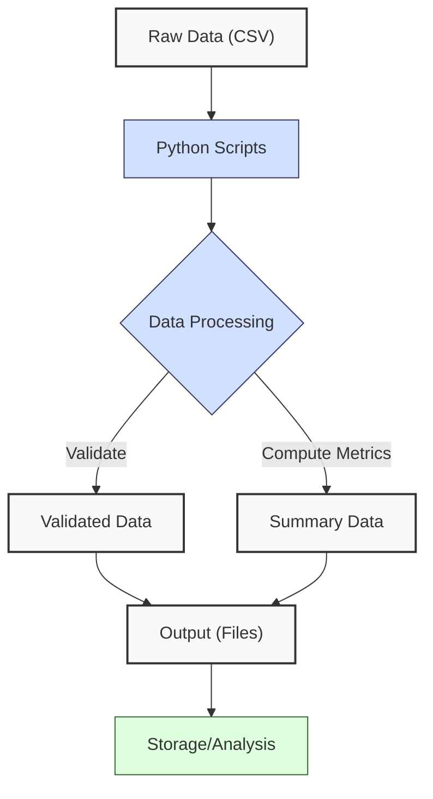
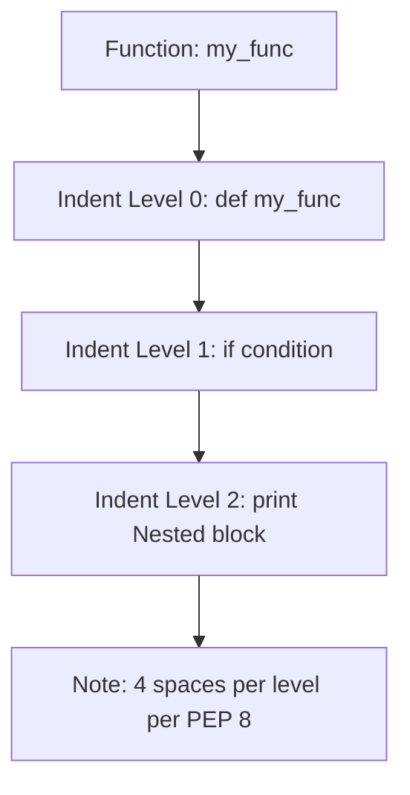
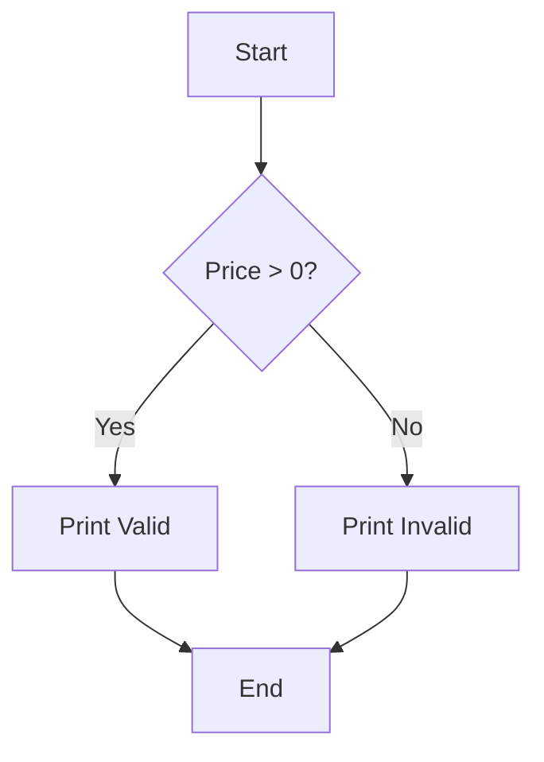
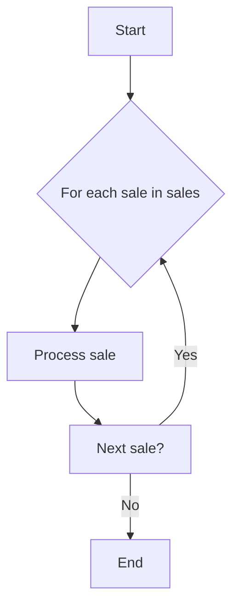
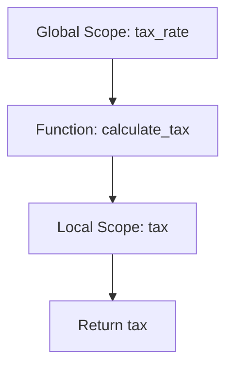
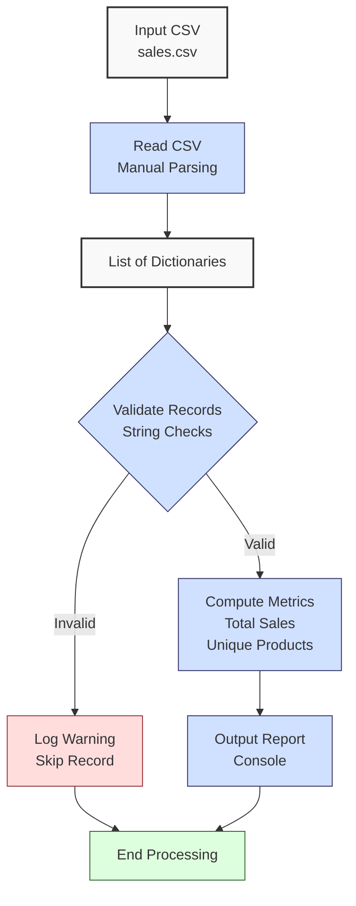

**Complexity: Easy (E)**

## 1.0 Introduction: Why This Matters for Data Engineering

In data engineering, Python is a cornerstone for building scalable and maintainable data pipelines. At Hijra Group, data engineers process financial transaction data, such as Sharia-compliant sales records, to derive actionable insights for fintech analytics. This chapter introduces Python’s core language essentials—syntax, data types, control flow, functions, variable scope, and basic environment concepts—laying the foundation for handling structured data like CSVs. These skills enable you to write scripts that process, validate, and summarize data, critical for constructing robust pipelines.

This chapter assumes basic programming knowledge (variables, loops, functions) and focuses on applying these concepts in Python to prepare for data engineering tasks. Since advanced topics like error handling (try/except), context managers, type annotations, and testing are introduced later (e.g., Chapters 7 and 9), we use simple print statements for debugging and string-based validation for robustness.

### Data Engineering Workflow Context

Here’s how Python fundamentals fit into a data engineering workflow at Hijra Group:



### Building On and Preparing For

- **Building On**: Assumes basic programming concepts, applying them in Python for fintech data tasks.
- **Preparing For**: Prepares for Chapter 2 (file handling, CSV/JSON processing) by introducing data structures and functions, and Chapter 3 (NumPy/Pandas) by establishing list/dictionary operations.

### What You’ll Learn

This chapter covers:

1. Python syntax and data types (strings, integers, lists, dictionaries, sets, tuples), emphasizing Python’s white-space sensitivity and PEP 8’s 4-space indentation guideline.
2. Control flow (if statements, for/while loops).
3. Functions (defining, calling, parameters, return values).
4. Variable scope (global, local).
5. Basic environment concepts (Python interpreter, virtual environments, `pip`).

By the end, you’ll build a sales data analyzer that processes a CSV, validates Sharia-compliant transactions, computes total sales and unique products, and outputs a report, adhering to PEP 8’s 4-space indentation standard to avoid errors.

## 1.1 Python Syntax and Data Types

Python’s syntax is clear, readable, and **white-space sensitive**, meaning indentation defines code blocks, unlike languages like Java or C++ that use braces `{}`. The **Python style guide (PEP 8)** recommends using **4 spaces per indentation level** for consistency, as this ensures consistent rendering across editors, enhancing code readability and collaboration. While tabs can be used, **spaces are preferred** to avoid issues, as mixing tabs and spaces in the same file can cause `IndentationError` or subtle bugs. Consistent indentation is critical to ensure code executes correctly. Data types like strings, integers, lists, dictionaries, sets, and tuples are essential for handling structured fintech data, such as Halal product sales.

### 1.1.1 Basic Data Types

Strings, integers, and floats store simple data, while lists, dictionaries, sets, and tuples organize complex data. Python requires consistent indentation (4 spaces per PEP 8) to group statements in blocks, such as function bodies or loops.



```python
# Define basic variables for a sale record
product = "Halal Investment"  # String: Sharia-compliant product name
price = 999.99  # Float: product price
quantity = 2  # Integer: number of items sold

# Create a list of transaction prices
prices = [999.99, 24.99, 49.99]  # List: stores multiple prices

# Create a dictionary for a sale
sale = {
    "product": "Halal Laptop",  # Dictionary: key-value pairs for a transaction
    "price": 999.99,
    "quantity": 2
}  # 4-space indentation (PEP 8)

# Create a set of unique products
unique_products = {"Halal Laptop", "Halal Mouse", "Halal Laptop"}  # Set: unique items

# Create a tuple for fixed data
sale_info = ("Halal Laptop", 999.99)  # Tuple: immutable pair

# Print variables to inspect them
print("Product:", product)  # Output string variable
print("Price:", price)  # Output float variable
print("Quantity:", quantity)  # Output integer variable
print("Prices List:", prices)  # Output list of prices
print("Sale Dictionary:", sale)  # Output dictionary
print("Unique Products:", unique_products)  # Output set (no duplicates)
print("Sale Info:", sale_info)  # Output tuple

# Example of tab/space mixing causing IndentationError
def bad_indentation():
    print("This uses spaces")  # 4 spaces (correct)
    print("This uses a tab")  # 1 tab (incorrect, will cause error)
# Uncommenting the above function will raise IndentationError due to tab/space mixing

# Output:
# Product: Halal Investment
# Price: 999.99
# Quantity: 2
# Prices List: [999.99, 24.99, 49.99]
# Sale Dictionary: {'product': 'Halal Laptop', 'price': 999.99, 'quantity': 2}
# Unique Products: {'Halal Laptop', 'Halal Mouse'}
# Sale Info: ('Halal Laptop', 999.99)
```

**Follow-Along Instructions**:

1. Create a `de-onboarding/` folder in your working directory.
2. Save the code as `de-onboarding/data_types.py`.
3. Configure your editor to use **4 spaces for indentation** (not tabs) per PEP 8. In VS Code, set “Editor: Tab Size” to 4, “Editor: Insert Spaces” to true, and “Editor: Detect Indentation” to false to enforce spaces.
4. Open a terminal, navigate to `de-onboarding/`, and run: `python data_types.py`.
5. Verify the output matches the comments.
6. **Common Errors**:
   - **SyntaxError**: Ensure quotes for strings (e.g., `"Halal Investment"`) and proper brackets for lists/dictionaries. Print `product` to verify its value.
   - **IndentationError**: Use 4 spaces for all lines (not tabs). Python is white-space sensitive, and PEP 8 recommends 4 spaces per indentation level. Mixing tabs and spaces can cause errors. Run `python -tt data_types.py` to detect tab/space inconsistencies or check editor settings.

**Key Points**:

- **White-Space Sensitivity and PEP 8**: Python uses indentation to define code blocks (e.g., function bodies, loops). **PEP 8 recommends 4 spaces per indentation level** for readability and consistency across editors. Spaces are preferred over tabs, as mixing tabs and spaces in the same file can cause `IndentationError` or bugs. For example, a tab may visually align with 4 spaces but be interpreted differently by Python.
- **Strings**: Text data, e.g., Sharia-compliant product names.
- **Integers/Floats**: Numeric data for quantities, prices.
- **Lists**: Ordered, mutable sequences, e.g., transaction price lists.
- **Dictionaries**: Key-value pairs, e.g., sale records.
- **Sets**: Unordered, unique items, e.g., unique products.
- **Tuples**: Ordered, immutable sequences, e.g., fixed data pairs.
- **Underlying Implementation**:
  - Lists: Dynamic arrays, O(1) access, O(n) insertion.
  - Dictionaries/Sets: Hash tables, O(1) average-case lookup/insertion.
  - Tuples: Fixed-size arrays, O(1) access, immutable.
- **Performance Considerations**:
  - **Time Complexity**: O(1) for dictionary/set lookups, critical for real-time transaction validation in Hijra Group’s systems (e.g., checking product IDs). Avoid lists for frequent lookups, as O(n) is slow for large datasets.
  - **Space Complexity**: O(n) for n elements. A list of 1 million floats uses \~8 MB; a set of unique items may use less due to deduplication. A day’s transactions (\~10,000 records) is manageable in memory, but large datasets require streaming (Chapter 40). Consistent 4-space indentation per PEP 8 ensures readable, maintainable code for large transaction processing scripts, reducing debugging time in Hijra Group’s systems. It also avoids runtime errors in memory-intensive fintech applications, ensuring reliable transaction analytics.
  - **Implication**: Use dictionaries for fast key-based access, sets for deduplication, lists for ordered data. Follow PEP 8’s 4-space indentation, preferring spaces to avoid errors.

### 1.1.2 Operations on Data Types

Perform operations like list slicing, dictionary merging, and set operations, tailored to fintech scenarios, adhering to PEP 8’s 4-space indentation standard.

```python
# Initialize a list of sales amounts
sales = [100.50, 200.75, 150.25]  # List of transaction values

# Append a new sale and slice for subset analysis
sales.append(300.00)  # Add new transaction
subset = sales[1:3]  # Slice to get second and third transactions

# Update, iterate, and merge dictionaries
sale = {
    "product": "Halal Mouse",  # Initial transaction dictionary
    "price": 24.99
}  # 4-space indent (PEP 8)
sale["quantity"] = 10  # Add quantity key
print("Transaction Details:")  # Print header for iteration
for key, value in sale.items():  # Iterate over key-value pairs
    print(key, ":", value)  # Output each pair, 4-space indent (PEP 8)

# Merge sales from two stores
store1_sale = {
    "Halal Laptop": 1999.98
}  # Store 1 sales, 4-space indent (PEP 8)
store2_sale = {
    "Halal Mouse": 249.90
}  # Store 2 sales, 4-space indent (PEP 8)
combined_sales = {**store1_sale, **store2_sale}  # Merge dictionaries

# Create sets and perform union for product catalogs
products = {"Halal Laptop", "Halal Mouse"}  # Store 1’s product catalog
new_products = {"Halal Keyboard", "Halal Mouse"}  # Store 2’s product catalog
all_products = products.union(new_products)  # Combine catalogs, remove duplicates

# Print updated data structures
print("Updated Sales List:", sales)  # Output updated list
print("Sliced Transactions:", subset)  # Output sliced list
print("Updated Transaction Dictionary:", sale)  # Output updated dictionary
print("Combined Sales:", combined_sales)  # Output merged sales
print("All Products Set:", all_products)  # Output union of sets

# Output:
# Transaction Details:
# product : Halal Mouse
# price : 24.99
# quantity : 10
# Updated Sales List: [100.5, 200.75, 150.25, 300.0]
# Sliced Transactions: [200.75, 150.25]
# Updated Transaction Dictionary: {'product': 'Halal Mouse', 'price': 24.99, 'quantity': 10}
# Combined Sales: {'Halal Laptop': 1999.98, 'Halal Mouse': 249.9}
# All Products Set: {'Halal Laptop', 'Halal Mouse', 'Halal Keyboard'}
```

**Follow-Along Instructions**:

1. Save as `de-onboarding/data_operations.py`.
2. Configure editor for **4-space indentation** (not tabs) per PEP 8. In VS Code, set “Editor: Tab Size” to 4, “Editor: Insert Spaces” to true, and “Editor: Detect Indentation” to false.
3. Run: `python data_operations.py`.
4. Verify outputs match the comments.
5. **Common Errors**:
   - **AttributeError**: Ensure correct methods (e.g., `append` for lists, not dictionaries). Print `type(sales)` to verify.
   - **IndexError**: Ensure slice indices are valid (e.g., `1:3` for a 4-element list).
   - **IndentationError**: Use 4 spaces for all lines (not tabs). PEP 8 recommends spaces over tabs, and mixing them causes errors. Run `python -tt data_operations.py` to detect inconsistencies.

**Key Points**:

- **White-Space Sensitivity and PEP 8**: Indentation defines the scope of loops and other blocks. **PEP 8 recommends 4 spaces per indentation level**, preferring spaces over tabs. Mixing tabs and spaces can cause `IndentationError`. Use 4 spaces consistently.
- **List Operations**: `append()`, `pop()`, slicing (`sales[1:3]`).
- **Dictionary Operations**: Update (`sale["key"] = value`), iteration (`items()`), merging (`{**dict1, **dict2}`).
- **Set Operations**: `add()`, `union()`, `intersection()`.
- **Performance Considerations**:
  - **Time Complexity**: O(1) for list append, dictionary updates, set additions; O(n) for slicing and merging.
  - **Space Complexity**: O(n) for n elements. Sets save memory by storing unique items.
  - **Implication**: Use slicing for analyzing transaction subsets, dictionary merging for combining store sales, sets for combining product catalogs in pipelines.

## 1.2 Control Flow

Control flow directs program execution using conditionals (`if`) and loops (`for`, `while`). Python’s white-space sensitivity and PEP 8’s 4-space indentation rule require consistent indentation to define the scope of these control structures.

### 1.2.1 Conditionals

Use `if` statements to check conditions, such as validating transaction data, with 4-space indentation per PEP 8.



```python
# Define a transaction record
sale = {
    "product": "Halal Laptop",
    "price": 999.99,
    "quantity": 2
}  # 4-space indent (PEP 8)

# Check if price is valid (positive and numeric)
if sale["price"] > 0:  # Condition: price must be greater than 0
    print("Valid price:", sale["price"])  # 4-space indent (PEP 8)
else:
    print("Invalid price:", sale["price"])  # 4-space indent (PEP 8)

# Check if product name is non-empty
if sale["product"]:  # Condition: non-empty string evaluates to True
    print("Valid product:", sale["product"])  # 4-space indent (PEP 8)
else:
    print("Invalid product: empty name")  # 4-space indent (PEP 8)

# Output:
# Valid price: 999.99
# Valid product: Halal Laptop
```

**Follow-Along Instructions**:

1. Save as `de-onboarding/conditionals.py`.
2. Configure editor for **4-space indentation** (not tabs) per PEP 8. In VS Code, set “Editor: Tab Size” to 4, “Editor: Insert Spaces” to true, and “Editor: Detect Indentation” to false.
3. Run: `python conditionals.py`.
4. Verify outputs match the comments.
5. **Common Errors**:
   - **KeyError**: Ensure dictionary keys exist (e.g., `"price"`). Print `sale.keys()` to verify.
   - **IndentationError**: Use 4 spaces for `if`/`else` blocks (not tabs). Python’s white-space sensitivity and PEP 8 require 4 spaces, and mixing tabs/spaces causes errors. Run `python -tt conditionals.py` to detect inconsistencies.

**Key Points**:

- **White-Space Sensitivity and PEP 8**: Indentation (4 spaces per PEP 8) defines the scope of `if`/`else` blocks. Spaces are preferred over tabs, and mixing them causes `IndentationError`.
- `if`/`elif`/`else` control logic based on conditions.
- Conditions use operators: `>`, `<`, `==`, `!=`, `and`, `or`.
- **Underlying Implementation**: Conditional checks are O(1), but nested conditions increase complexity.
- **Performance Considerations**:
  - **Time Complexity**: O(1) per condition, O(n) if iterating.
  - **Space Complexity**: O(1) for conditionals.
  - **Implication**: Use conditionals for simple validations (e.g., checking price &gt; 0); combine with loops for processing multiple transactions.

### 1.2.2 Loops

Use `for` and `while` loops to iterate over data, with 4-space indentation per PEP 8 to define loop bodies.



```python
# Define a list of transaction records
sales = [
    {
        "product": "Halal Laptop",
        "price": 999.99,
        "quantity": 2
    },  # First sale
    {
        "product": "Halal Mouse",
        "price": 24.99,
        "quantity": 10
    }  # Second sale
]  # 4-space indent (PEP 8)

# For loop: Iterate over sales to print each record
for sale in sales:  # Loop through each dictionary
    print("Sale:", sale)  # 4-space indent (PEP 8)

# For loop: Calculate total sales amount
total = 0.0  # Initialize total as float
for sale in sales:  # Loop through each sale
    amount = sale["price"] * sale["quantity"]  # Compute price * quantity
    total += amount  # Add to total
    print("Current sale:", sale, "Amount:", amount)  # Debug: print values
print("Total Sales:", total)  # Output total

# For loop: Sum prices by category
sales_by_category = [
    {
        "product": "Halal Laptop",
        "category": "Electronics",
        "price": 999.99
    },
    {
        "product": "Halal Fund",
        "category": "Services",
        "price": 500.00
    }
]  # 4-space indent (PEP 8)
electronics_total = 0.0  # Initialize total for Electronics
for sale in sales_by_category:  # Loop through sales
    if sale["category"] == "Electronics":  # Check category
        electronics_total += sale["price"]  # Add price, 4-space indent (PEP 8)
print("Electronics Total:", electronics_total)  # Output total

# While loop: Sum sales until daily target
# Note: Use while loops when iteration count is unknown, e.g., until a target is met
sales = [100.50, 200.75, 150.25]  # Daily transaction amounts
daily_target = 250.0  # Daily sales goal
total_while = 0.0  # Initialize total
i = 0  # Index for iteration
while i < len(sales) and total_while < daily_target:  # Loop until target or end
    total_while += sales[i]  # Add sale to total
    print("Sale:", sales[i], "Running total:", total_while)  # Debug: print values
    i += 1  # Increment index
print("Total until target:", total_while)  # Output total

# Output:
# Sale: {'product': 'Halal Laptop', 'price': 999.99, 'quantity': 2}
# Sale: {'product': 'Halal Mouse', 'price': 24.99, 'quantity': 10}
# Current sale: {'product': 'Halal Laptop', 'price': 999.99, 'quantity': 2} Amount: 1999.98
# Current sale: {'product': 'Halal Mouse', 'price': 24.99, 'quantity': 10} Amount: 249.9
# Total Sales: 2249.88
# Electronics Total: 999.99
# Sale: 100.5 Running total: 100.5
# Sale: 200.75 Running total: 301.25
# Total until target: 301.25
```

**Follow-Along Instructions**:

1. Save as `de-onboarding/loops.py`.
2. Configure editor for **4-space indentation** (not tabs) per PEP 8. In VS Code, set “Editor: Tab Size” to 4, “Editor: Insert Spaces” to true, and “Editor: Detect Indentation” to false.
3. Run: `python loops.py`.
4. Verify outputs match the comments.
5. **Common Errors**:
   - **KeyError**: Ensure dictionary keys exist (e.g., `"price"`). Print `sale` to verify.
   - **IndentationError**: Use 4 spaces for loop body (not tabs). PEP 8 recommends spaces over tabs, and mixing them causes errors. Run `python -tt loops.py` to detect inconsistencies.
   - **TypeError**: Confirm numeric types for calculations (e.g., `sale["price"]` is float).

**Key Points**:

- **White-Space Sensitivity and PEP 8**: Indentation (4 spaces per PEP 8) defines the scope of loop bodies. Spaces are preferred over tabs, and mixing them causes `IndentationError`.
- `for` loops iterate over iterables (lists, dictionaries).
- `while` loops run until a condition is false, useful for target-based tasks like daily sales goals.
- **Underlying Implementation**: Iteration is O(n) for n items.
- **Performance Considerations**:
  - **Time Complexity**: O(n) for looping over n items. Avoid nested loops for large transaction datasets (e.g., cross-referencing sales) to prevent O(n²) performance issues. Use dictionaries for O(1) lookups in Chapter 2.
  - **Space Complexity**: O(1) for loop variables.
  - **Implication**: Use loops for processing transactions; optimize by avoiding nested loops for large datasets.

## 1.3 Functions

Functions encapsulate reusable logic, improving code modularity. Python’s white-space sensitivity and PEP 8’s 4-space indentation rule require consistent indentation for function bodies.

### 1.3.1 Defining and Calling Functions

Define functions to validate or compute transaction data, with 4-space indentation per PEP 8.

```python
# Define a function to validate a sale
def is_valid_sale(sale):  # Function takes a sale dictionary as input
    """Check if sale has non-empty product and positive price/quantity."""
    if sale["product"] and sale["price"] > 0 and sale["quantity"] > 0:  # Check conditions
        return True  # 4-space indent (PEP 8)
    return False  # 4-space indent (PEP 8)

# Define a function to calculate sale amount
def calculate_amount(sale):  # Function takes a sale dictionary
    """Calculate price * quantity for a sale."""
    amount = sale["price"] * sale["quantity"]  # Compute amount
    print("Calculating amount for:", sale, "Result:", amount)  # Debug: print values
    return amount  # 4-space indent (PEP 8)

# Test the functions
sale = {
    "product": "Halal Laptop",
    "price": 999.99,
    "quantity": 2
}  # 4-space indent (PEP 8)
if is_valid_sale(sale):  # Check if sale is valid
    print("Valid Sale:", sale)  # 4-space indent (PEP 8)
    amount = calculate_amount(sale)  # Calculate amount
    print("Amount:", amount)  # 4-space indent (PEP 8)
else:
    print("Invalid Sale:", sale)  # 4-space indent (PEP 8)

# Output:
# Valid Sale: {'product': 'Halal Laptop', 'price': 999.99, 'quantity': 2}
# Calculating amount for: {'product': 'Halal Laptop', 'price': 999.99, 'quantity': 2} Result: 1999.98
# Amount: 1999.98
```

**Follow-Along Instructions**:

1. Save as `de-onboarding/functions.py`.
2. Configure editor for **4-space indentation** (not tabs) per PEP 8. In VS Code, set “Editor: Tab Size” to 4, “Editor: Insert Spaces” to true, and “Editor: Detect Indentation” to false.
3. Run: `python functions.py`.
4. Verify outputs match the comments.
5. **Common Errors**:
   - **KeyError**: Ensure dictionary keys exist (e.g., `"price"`). Print `sale` to verify.
   - **IndentationError**: Use 4 spaces for function body (not tabs). PEP 8 recommends spaces, and mixing tabs/spaces causes errors. Run `python -tt functions.py` to detect inconsistencies.
   - **NameError**: Define functions before calling. Check function names.

**Key Points**:

- **White-Space Sensitivity and PEP 8**: Indentation (4 spaces per PEP 8) defines the scope of function bodies. Spaces are preferred over tabs, and mixing them causes `IndentationError`.
- Functions: Defined with `def`, return values with `return`.
- Parameters: Pass data to functions (e.g., `sale`).
- **Underlying Implementation**: Functions are objects, stored in memory with O(1) call overhead.
- **Performance Considerations**:
  - **Time Complexity**: Depends on function logic (e.g., O(1) for simple checks).
  - **Space Complexity**: O(1) for local variables.
  - **Implication**: Functions modularize tasks (e.g., validation, calculations), improving readability and reuse in pipelines.

## 1.4 Variable Scope

Scope determines variable accessibility (global or local). Python’s white-space sensitivity and PEP 8’s 4-space indentation rule apply to indentation within function scopes.



```python
# Define a global variable
tax_rate = 0.1  # Global: accessible everywhere

# Define a function to calculate tax
def calculate_tax(amount):  # Function with local variable
    tax = amount * tax_rate  # Local tax variable, uses global tax_rate
    print("Inside function: Amount =", amount, "Tax =", tax)  # 4-space indent (PEP 8)
    return tax  # 4-space indent (PEP 8)

# Test scope
amount = 1000.0  # Global variable
tax = calculate_tax(amount)  # Call function, creates local tax variable
print("Outside function: Amount =", amount)  # Output global amount
print("Tax:", tax)  # Output tax from function
print("Global Tax Rate:", tax_rate)  # Output global tax_rate

# Output:
# Inside function: Amount = 1000.0 Tax = 100.0
# Outside function: Amount = 1000.0
# Tax: 100.0
# Global Tax Rate: 0.1
```

**Follow-Along Instructions**:

1. Save as `de-onboarding/scope.py`.
2. Configure editor for **4-space indentation** (not tabs) per PEP 8. In VS Code, set “Editor: Tab Size” to 4, “Editor: Insert Spaces” to true, and “Editor: Detect Indentation” to false.
3. Run: `python scope.py`.
4. Verify outputs match the comments.
5. **Common Errors**:
   - **NameError**: Ensure global variables are defined before use (e.g., `tax_rate`). Print globals with `globals()`.
   - **IndentationError**: Use 4 spaces for function body (not tabs). PEP 8 recommends spaces, and mixing tabs/spaces causes errors. Run `python -tt scope.py` to detect inconsistencies.

**Key Points**:

- **White-Space Sensitivity and PEP 8**: Indentation (4 spaces per PEP 8) defines the scope of local variables within functions. Spaces are preferred over tabs, and mixing them causes `IndentationError`.
- **Global Scope**: Variables outside functions, accessible everywhere.
- **Local Scope**: Variables inside functions, only accessible within.
- **Underlying Implementation**: Python uses a scope stack, resolving names via LEGB (Local, Enclosing, Global, Built-in).
- **Performance Considerations**:
  - **Time Complexity**: O(1) for variable lookup (average case).
  - **Space Complexity**: O(1) per variable.
  - **Implication**: Use local variables for function-specific data; globals for shared constants (e.g., tax rates in financial pipelines).

## 1.5 Basic Environment Concepts

Set up and manage Python environments for data engineering, ensuring proper indentation in scripts per PEP 8.

### 1.5.1 Python Interpreter and Virtual Environments

Use the Python interpreter and virtual environments to manage dependencies.

```python
# Check Python version (run in terminal, not script)
# python --version
# Expected: Python 3.10 or higher

# Sample script to verify environment
import sys  # Import sys to access interpreter info
print("Python Version:", sys.version)  # Output Python version
print("Pip Version: Run 'pip --version' in terminal")  # Prompt for pip check
```

**Setup Checklist**:

1. Verify Python: `python --version` (or `python3 --version`) shows 3.10+.
2. Create venv: `python -m venv venv`.
3. Activate venv:
   - Windows: `venv\Scripts\activate`
   - Unix/macOS: `source venv/bin/activate`
4. Upgrade pip: `pip install --upgrade pip`.
5. Verify activation: `pip list` shows only `pip`, `setuptools`.
6. Enable editor linting: In VS Code, install the Python extension and enable Pylint to catch indentation errors, ensuring 4 spaces per PEP 8.

**Example**:

- Install PyYAML: `pip install pyyaml`
- Verify: `python -c "import yaml"` (no errors means success)

**Follow-Along Instructions**:

1. Save as `de-onboarding/environment.py`.
2. In a terminal, navigate to `de-onboarding/`.
3. Run setup checklist steps above. If `python` is not found, ensure Python is installed and added to PATH (e.g., `py --version` on Windows). On Windows, if `venv\Scripts\activate` fails, ensure the path is correct (e.g., `de-onboarding\venv\Scripts\activate`). Check with `dir venv\Scripts`.
4. Run: `python environment.py`.
5. Verify output shows Python version (e.g., “3.10.x”).
6. **Common Errors**:
   - **CommandNotFound**: Ensure Python is installed and in PATH. Check with `py --version` or `python3 --version`.
   - **ModuleNotFoundError**: Activate virtual environment before running. Verify with `pip list`.
   - **Activation Failure**: Ensure correct activation command. Check prompt for `(venv)` prefix.
   - **IndentationError**: Use 4 spaces for script indentation (not tabs) per PEP 8. Run `python -tt environment.py` to detect inconsistencies.

**Key Points**:

- **White-Space Sensitivity and PEP 8**: Scripts like `environment.py` require 4-space indentation per PEP 8 to avoid `IndentationError`. Spaces are preferred over tabs, and mixing them causes errors.
- **Interpreter**: Executes Python code (`python script.py`).
- **Virtual Environment**: Isolates dependencies (`venv`), preventing conflicts.
- **pip**: Installs packages (e.g., `pip install pyyaml` for Chapter 2).
- **Underlying Implementation**: Virtual environments are directories with isolated Python installations.
- **Performance Considerations**:
  - **Time Complexity**: O(1) for interpreter startup, O(n) for package installation.
  - **Space Complexity**: O(n) for environment files. A virtual environment with many packages consumes disk space.
  - **Implication**: Virtual environments ensure consistent pipeline dependencies, critical for Hijra Group’s multi-project workflows.

## 1.6 Micro-Project: Sales Data Analyzer

### Project Requirements

Build a Python script to process Sharia-compliant sales data, simulating financial transaction analysis at Hijra Group, by:

- Reading `data/sales.csv` manually (without `csv` module, as it’s in Chapter 2).
- Validating records using string-based checks, ensuring Halal products (starting with “Halal” prefix) and compliance with Sharia rules (e.g., no interest-based products).
- Computing total sales and unique products using functions.
- Outputting a formatted report to the console with valid/invalid record counts.
- Logging invalid records.
- Using **4-space indentation** per PEP 8, preferring spaces over tabs and avoiding tab/space mixing to adhere to Python’s white-space sensitivity.

### Sample Input File

`data/sales.csv`:

```csv
product,price,quantity
Halal Laptop,999.99,2
Halal Mouse,24.99,10
Halal Keyboard,49.99,5
,29.99,3
Monitor,invalid,2
Headphones,5.00,150
```

### Data Processing Flow



### Diagram Explanation

Nodes represent processing steps (e.g., reading CSV, validating). Arrows show data flow from input to output. Code blocks (e.g., validation logic) are indented 4 spaces per PEP 8 under loops or conditionals, ensuring correct execution.

### Acceptance Criteria

- **Go Criteria**:
  - Reads `sales.csv` correctly without `csv` module.
  - Validates records for non-empty Halal product (starting with “Halal”), numeric price/quantity, quantity ≤ 100.
  - Computes total sales and unique products.
  - Outputs a report with total sales, unique products, and valid/invalid counts.
  - Logs invalid records to console.
  - Uses 4-space indentation per PEP 8, preferring spaces over tabs.
- **No-Go Criteria**:
  - Fails to process valid CSV.
  - Incorrect validation or calculations.
  - Missing report or logging.
  - Uses try/except or external libraries.
  - Inconsistent indentation or tab/space mixing causing `IndentationError`.

### Common Pitfalls to Avoid

1. **Incorrect File Parsing**:
   - **Problem**: Misreading CSV lines or headers.
   - **Solution**: Split lines on commas, skip header. Print lines to debug.
2. **Missing Validation**:
   - **Problem**: Omitting checks causes calculation errors.
   - **Solution**: Validate all fields (including “Halal” prefix) in a function.
3. **Type Errors**:
   - **Problem**: Treating strings as numbers.
   - **Solution**: Convert strings to float/int after validation.
4. **Hard-Coded Paths**:
   - **Problem**: Absolute paths break portability.
   - **Solution**: Use relative paths (e.g., `data/sales.csv`). Verify path with `print(csv_path)`.
5. **Inconsistent Indentation**:
   - **Problem**: `IndentationError` from mixed spaces/tabs or misaligned code.
   - **Solution**: Use **4 spaces per level** per PEP 8, preferring spaces over tabs. Mixing tabs and spaces causes errors. Configure editor to insert spaces. Run `python -tt sales_analyzer.py` to detect inconsistencies.

### How This Differs from Production

In production, this solution would include:

- **Error Handling**: Try/except for robust errors (Chapter 7).
- **Type Safety**: Type annotations with Pyright (Chapter 7).
- **Testing**: Unit tests with `pytest` (Chapter 9).
- **Libraries**: `csv` module for parsing (Chapter 2), handling commas within fields and large files.
- **Logging**: File-based logging (Chapter 52).
- **Scalability**: Streaming for large CSVs (Chapter 40).
- **Validation**: Support for negative prices or scientific notation (Chapter 7).

### Debugging Tips

1. Print `sale` before `validate_sale(sale)` to check dictionary contents.
2. Print `parts` in `read_sales_data` to verify CSV parsing.
3. Print `total_sales` after each valid sale in `process_sales` to track accumulation.
4. Use `python -tt sales_analyzer.py` or editor linting (e.g., VS Code’s Pylint) to detect tab/space mixing, ensuring 4-space indentation per PEP 8.

### Implementation

```python
# Define a function to check if a string is a valid decimal number
def is_numeric(s):  # Takes a string input
    """Check if string is a decimal number (e.g., '123.45')."""
    parts = s.split(".")  # Split string at decimal point
    # Return True if one decimal point and both parts are digits
    return len(parts) == 2 and parts[0].isdigit() and parts[1].isdigit()

# Define a function to validate a sale record
def validate_sale(sale):  # Takes a sale dictionary
    """Validate sale: non-empty Halal product, numeric price/quantity, quantity <= 100."""
    # Check for non-empty product
    if not sale["product"]:  # If product is empty
        print("Invalid sale: empty product:", sale)  # Log invalid record
        return False  # Return False for invalid
    # Check for Halal product
    if not sale["product"].startswith("Halal"):  # If product lacks Halal prefix
        print("Invalid sale: non-Halal product:", sale)  # Log invalid record
        return False  # Return False for invalid
    # Check if price is numeric
    if not is_numeric(sale["price"]):  # If price is not a valid decimal
        print("Invalid sale: non-numeric price:", sale)  # Log invalid record
        return False  # Return False for invalid
    # Check if quantity is a non-negative integer
    if not sale["quantity"].isdigit():  # If quantity is not a digit
        print("Invalid sale: non-integer quantity:", sale)  # Log invalid record
        return False  # Return False for invalid
    # Check if quantity is within limit
    if int(sale["quantity"]) > 100:  # If quantity exceeds 100
        print("Invalid sale: quantity > 100:", sale)  # Log invalid record
        return False  # Return False for invalid
    return True  # Return True if all checks pass

# Define a function to calculate sale amount
def calculate_amount(sale):  # Takes a sale dictionary
    """Calculate price * quantity for a sale."""
    amount = float(sale["price"]) * int(sale["quantity"])  # Convert strings and multiply
    print("Sale:", sale, "Amount:", amount)  # Debug: print intermediate values
    return amount  # Return computed amount

# Define a function to read sales CSV
def read_sales_data(file_path):  # Takes a file path
    """Read sales CSV manually and return list of dictionaries."""
    sales = []  # Initialize empty list for sales records
    file = open(file_path, "r")  # Open file in read mode
    lines = file.readlines()  # Read all lines into a list
    file.close()  # Close file to free resources
    # Skip header line (product,price,quantity)
    for line in lines[1:]:  # Start from second line
        # Split line on commas, strip whitespace
        parts = [part.strip() for part in line.split(",")]  # Split and clean each field
        print("Parsed line:", parts)  # Debug: print parsed fields
        # Ensure line has exactly 3 parts
        if len(parts) == 3:  # Check for correct number of fields
            # Create dictionary for sale
            sale = {
                "product": parts[0],  # First part: product
                "price": parts[1],    # Second part: price
                "quantity": parts[2]  # Third part: quantity
            }  # 4-space indent (PEP 8)
            sales.append(sale)  # Add sale to list
        else:
            print("Invalid line:", line.strip())  # Log malformed line
    print("Read", len(sales), "records from", file_path)  # Log number of records
    return sales  # Return list of sales dictionaries

# Define a function to process sales data
def process_sales(sales):  # Takes a list of sale dictionaries
    """Process sales: validate, compute total, find unique products."""
    total_sales = 0.0  # Initialize total sales
    unique_products = set()  # Initialize set for unique products
    valid_sales = 0  # Count valid sales
    # Iterate over sales to validate and process
    for sale in sales:  # Loop through each sale
        if validate_sale(sale):  # Check if sale is valid
            amount = calculate_amount(sale)  # Compute amount
            total_sales += amount  # Add amount to total
            print("Current total sales:", total_sales)  # Debug: track total
            unique_products.add(sale["product"])  # Add product to set
            valid_sales += 1  # Increment valid sales count
        # 4-space indent (PEP 8) for loop body
    print("Valid sales:", valid_sales, "records")  # Log valid sales count
    # Return results and counts
    return {
        "total_sales": total_sales,  # Total sales amount
        "unique_products": list(unique_products)  # Convert set to list
    }, valid_sales, len(sales)

# Define a function to output the report
def output_report(results, valid_sales, total_records):  # Takes results and counts
    """Output formatted report to console."""
    print("\nSales Report:")  # Print report header
    print("Total Records Processed:", total_records)  # Output total records
    print("Valid Sales:", valid_sales)  # Output valid count
    print("Invalid Sales:", total_records - valid_sales)  # Output invalid count
    print("Total Sales: $", round(results["total_sales"], 2))  # Output total
    print("Unique Products:", results["unique_products"])  # Output products

# Define the main function
def main():  # No parameters
    """Main function to process sales data."""
    csv_path = "data/sales.csv"  # Relative path to CSV file
    print("Reading file:", csv_path)  # Debug: print file path
    sales = read_sales_data(csv_path)  # Read sales data
    results, valid_sales, total_records = process_sales(sales)  # Process sales
    output_report(results, valid_sales, total_records)  # Output report
    print("Processing completed")  # Log completion

# Run the program if executed directly
if __name__ == "__main__":
    main()  # Call main function
    # 4-space indent (PEP 8) for block

# Expected Output:
# Reading file: data/sales.csv
# Parsed line: ['Halal Laptop', '999.99', '2']
# Parsed line: ['Halal Mouse', '24.99', '10']
# Parsed line: ['Halal Keyboard', '49.99', '5']
# Parsed line: ['', '29.99', '3']
# Parsed line: ['Monitor', 'invalid', '2']
# Parsed line: ['Headphones', '5.00', '150']
# Read 6 records from data/sales.csv
# Invalid sale: empty product: {'product': '', 'price': '29.99', 'quantity': '3'}
# Invalid sale: non-Halal product: {'product': 'Monitor', 'price': 'invalid', 'quantity': '2'}
# Invalid sale: quantity > 100: {'product': 'Headphones', 'price': '5.00', 'quantity': '150'}
# Sale: {'product': 'Halal Laptop', 'price': '999.99', 'quantity': '2'} Amount: 1999.98
# Current total sales: 1999.98
# Sale: {'product': 'Halal Mouse', 'price': '24.99', 'quantity': '10'} Amount: 249.9
# Current total sales: 2249.88
# Sale: {'product': 'Halal Keyboard', 'price': '49.99', 'quantity': '5'} Amount: 249.95
# Current total sales: 2249.97
# Valid sales: 3 records
#
# Sales Report:
# Total Records Processed: 6
# Valid Sales: 3
# Invalid Sales: 3
# Total Sales: $ 2249.97
# Unique Products: ['Halal Laptop', 'Halal Mouse', 'Halal Keyboard']
# Processing completed
```

### Expected Outputs

**Console Output**:

```
Reading file: data/sales.csv
Parsed line: ['Halal Laptop', '999.99', '2']
Parsed line: ['Halal Mouse', '24.99', '10']
Parsed line: ['Halal Keyboard', '49.99', '5']
Parsed line: ['', '29.99', '3']
Parsed line: ['Monitor', 'invalid', '2']
Parsed line: ['Headphones', '5.00', '150']
Read 6 records from data/sales.csv
Invalid sale: empty product: {'product': '', 'price': '29.99', 'quantity': '3'}
Invalid sale: non-Halal product: {'product': 'Monitor', 'price': 'invalid', 'quantity': '2'}
Invalid sale: quantity > 100: {'product': 'Headphones', 'price': '5.00', 'quantity': '150'}
Sale: {'product': 'Halal Laptop', 'price': '999.99', 'quantity': '2'} Amount: 1999.98
Current total sales: 1999.98
Sale: {'product': 'Halal Mouse', 'price': '24.99', 'quantity': '10'} Amount: 249.9
Current total sales: 2249.88
Sale: {'product': 'Halal Keyboard', 'price': '49.99', 'quantity': '5'} Amount: 249.95
Current total sales: 2249.97
Valid sales: 3 records

Sales Report:
Total Records Processed: 6
Valid Sales: 3
Invalid Sales: 3
Total Sales: $ 2249.97
Unique Products: ['Halal Laptop', 'Halal Mouse', 'Halal Keyboard']
Processing completed
```

### How to Run and Test

1. **Setup**:

   - Create `de-onboarding/` folder.
   - Create `data/` subfolder (`de-onboarding/data/`).
   - Create `data/sales.csv` with the sample content above.
   - Save the code as `de-onboarding/sales_analyzer.py`.
   - Verify Python 3.10+: Run `python --version` (or `python3 --version` on Unix/macOS).
   - Configure editor to use **4 spaces for indentation** (not tabs) per PEP 8. In VS Code, set “Editor: Tab Size” to 4, “Editor: Insert Spaces” to true, and “Editor: Detect Indentation” to false. Enable “View: Toggle Render Whitespace” to visualize spaces vs. tabs.
   - Optional: Use Visual Studio Code with Python extension and Pylint for linting.
   - If `FileNotFoundError` occurs, ensure `data/sales.csv` is in `de-onboarding/data/`. Check permissions with `ls -l` (Unix/macOS) or `dir` (Windows). Verify working directory with `pwd` or `cd`.

2. **Run**:

   - Open a terminal in `de-onboarding/`.
   - Execute: `python sales_analyzer.py`.
   - Output: Console report as shown.

3. **Test Scenarios**:

   - **Valid Data**: Verify report shows `Total Records Processed: 6`, `Valid Sales: 3`, `Invalid Sales: 3`, `Total Sales: $ 2249.97`, `Unique Products: ['Halal Laptop', 'Halal Mouse', 'Halal Keyboard']`.

   - **Invalid Records**: Check console for warnings on empty product, non-Halal product, invalid price, or quantity &gt; 100.

   - **Empty CSV**: Create `data/empty.csv` with `product,price,quantity\n` and run:

     ```python
     sales = read_sales_data("data/empty.csv")
     results, valid_sales, total_records = process_sales(sales)
     print(results, valid_sales, total_records)
     # Expected: {'total_sales': 0.0, 'unique_products': []}, 0, 0
     ```

   - **Single Record**: Edit `sales.csv` to one valid row and verify report.

**Follow-Along Tips**:

- Ensure `data/sales.csv` exists in `data/`.
- If `IndentationError`, use 4 spaces (not tabs) per PEP 8. Python’s white-space sensitivity and tab/space mixing cause errors. Run `python -tt sales_analyzer.py` or use VS Code’s Pylint to detect inconsistencies.
- Use print statements (e.g., `print(sale)`) to debug issues in loops or functions.
- Read comments to understand each function’s logic.

## 1.7 Practice Exercises

### Exercise 1: Data Type Creator

Write a function to create and return a dictionary for a sale record, using 4-space indentation per PEP 8.

**Sample Input**:

```python
product = "Halal Laptop"
price = 999.99
quantity = 2
```

**Expected Output**:

```
{'product': 'Halal Laptop', 'price': 999.99, 'quantity': 2}
```

**Challenge**: Add a `category` key with value `"Electronics"`. **Hint**: Add `"category": "Electronics"` to the dictionary.

**Follow-Along Instructions**:

1. Save as `de-onboarding/ex1_dict.py`.
2. Configure editor for **4-space indentation** (not tabs) per PEP 8. In VS Code, set “Editor: Tab Size” to 4, “Editor: Insert Spaces” to true, “Editor: Detect Indentation” to false, and enable “View: Toggle Render Whitespace” to visualize spaces vs. tabs.
3. Run: `python ex1_dict.py`.
4. **How to Test**:
   - Add: `print(create_sale("Halal Laptop", 999.99, 2))`.
   - Verify output: `{'product': 'Halal Laptop', 'price': 999.99, 'quantity': 2}`.
   - Test with empty product: `create_sale("", 29.99, 3)` should return dictionary.
   - **Troubleshooting**: If `IndentationError`, use 4 spaces (not tabs). PEP 8 recommends spaces, and mixing tabs/spaces causes errors. Run `python -tt ex1_dict.py` or use VS Code’s Pylint to detect inconsistencies.

### Exercise 2: List Processor

Write a function to compute the sum of a list of prices, using 4-space indentation per PEP 8.

**Sample Input**:

```python
prices = [999.99, 24.99, 49.99]
```

**Expected Output**:

```
1074.97
```

**Challenge**: Return both sum and average as `(sum, average)`. **Hint**: Use `len(prices)` to compute average, handling empty lists.

**Challenge**: Rewrite the function with mixed tabs/spaces to cause an `IndentationError`, then fix it to use 4 spaces per PEP 8. Verify with `python -tt`.

**Follow-Along Instructions**:

1. Save as `de-onboarding/ex2_list.py`.
2. Configure editor for **4-space indentation** (not tabs) per PEP 8. In VS Code, set “Editor: Tab Size” to 4, “Editor: Insert Spaces” to true, “Editor: Detect Indentation” to false, and enable “View: Toggle Render Whitespace” to visualize spaces vs. tabs.
3. Run: `python ex2_list.py`.
4. **How to Test**:
   - Add: `print(sum_prices([999.99, 24.99, 49.99]))`.
   - Verify output: `1074.97`.
   - Test with empty list: `sum_prices([])` should return `0.0`.
   - **Troubleshooting**: If `TypeError`, ensure list contains numbers. If `IndentationError`, use 4 spaces (not tabs). Run `python -tt ex2_list.py` or use VS Code’s Pylint to detect inconsistencies.

### Exercise 3: Set Creator

Write a function to create a set of unique products from a list of sales, using 4-space indentation per PEP 8.

**Sample Input**:

```python
sales = [
    {"product": "Halal Laptop", "price": 999.99, "quantity": 2},
    {"product": "Halal Mouse", "price": 24.99, "quantity": 10},
    {"product": "Halal Laptop", "price": 999.99, "quantity": 1}
]
```

**Expected Output**:

```
{'Halal Laptop', 'Halal Mouse'}
```

**Challenge**: Return the count of unique products. **Hint**: Use `len(products)`.

**Follow-Along Instructions**:

1. Save as `de-onboarding/ex3_set.py`.
2. Configure editor for **4-space indentation** (not tabs) per PEP 8. In VS Code, set “Editor: Tab Size” to 4, “Editor: Insert Spaces” to true, “Editor: Detect Indentation” to false, and enable “View: Toggle Render Whitespace” to visualize spaces vs. tabs.
3. Run: `python ex3_set.py`.
4. **How to Test**:
   - Add: `print(get_unique_products(sales))`.
   - Verify output: `{'Halal Laptop', 'Halal Mouse'}`.
   - Test with empty list: `get_unique_products([])` should return `set()`.
   - **Troubleshooting**: If `KeyError`, ensure `"product"` key exists. If `IndentationError`, use 4 spaces (not tabs). Run `python -tt ex3_set.py` or use VS Code’s Pylint to detect inconsistencies.

### Exercise 4: Conditional Validator

Write a function to validate a sale’s price and quantity, using 4-space indentation per PEP 8.

**Sample Input**:

```python
sale = {"product": "Halal Laptop", "price": 999.99, "quantity": 2}
```

**Expected Output**:

```
Valid sale
True
```

**Challenge**: Add a check for product name starting with “Halal” to ensure Sharia compliance. **Hint**: Use `sale['product'].startswith('Halal')`.

**Follow-Along Instructions**:

1. Save as `de-onboarding/ex4_validate.py`.
2. Configure editor for **4-space indentation** (not tabs) per PEP 8. In VS Code, set “Editor: Tab Size” to 4, “Editor: Insert Spaces” to true, “Editor: Detect Indentation” to false, and enable “View: Toggle Render Whitespace” to visualize spaces vs. tabs.
3. Run: `python ex4_validate.py`.
4. **How to Test**:
   - Add: `print(check_sale(sale))`.
   - Verify output: `Valid sale`, `True`.
   - Test with invalid data: `check_sale({"product": "Mouse", "price": -1, "quantity": 0})` should return `False`.
   - **Troubleshooting**: If `KeyError`, ensure dictionary keys exist. If `IndentationError`, use 4 spaces (not tabs). Run `python -tt ex4_validate.py` or use VS Code’s Pylint to detect inconsistencies.

### Exercise 5: Debug a Function

Fix this buggy function that fails with `TypeError` and `IndentationError`. Explain the issues, ensuring proper indentation per PEP 8.

**Buggy Code**:

```python
def calculate_total(sales):
    total = 0  # Bug: Misaligned indentation
        for sale in sales:
            total += sale["price"] * sale["quantity"]  # Bug: strings, not numbers
    return total

sales = [{"product": "Halal Laptop", "price": "999.99", "quantity": "2"}]
print(calculate_total(sales))  # TypeError and IndentationError
```

**Expected Output**:

```
1999.98
```

**Challenge**: Add a print statement to show each sale’s contribution to the total. **Hint**: Print `sale` and `amount` in the loop.

**Follow-Along Instructions**:

1. Save as `de-onboarding/ex5_debug.py`.
2. Configure editor for **4-space indentation** (not tabs) per PEP 8. In VS Code, set “Editor: Tab Size” to 4, “Editor: Insert Spaces” to true, “Editor: Detect Indentation” to false, and enable “View: Toggle Render Whitespace” to visualize spaces vs. tabs.
3. Run: `python ex5_debug.py` to see errors.
4. Apply fixes and re-run.
5. **How to Test**:
   - Verify output: `1999.98`.
   - Test with multiple records (e.g., add `{"product": "Halal Mouse", "price": "24.99", "quantity": "10"}`).
   - **Troubleshooting**: If `TypeError`, convert strings to float/int. If `IndentationError`, align `total` with `def` and use 4 spaces for loop body. PEP 8 recommends spaces, and mixing tabs/spaces causes errors. Run `python -tt ex5_debug.py` or use VS Code’s Pylint to detect inconsistencies.

### Exercise 6: Data Type Selection

Write a function that returns a list or set based on an `is_unique` flag, using 4-space indentation per PEP 8. Explain why each is chosen, using the format: “Sets are chosen because…”.

**Sample Input**:

```python
items = ["Halal Laptop", "Halal Mouse", "Halal Laptop"]
is_unique = True
```

**Expected Output**:

```
{'Halal Laptop', 'Halal Mouse'}
Explanation: Sets are chosen because they ensure unique products, avoiding duplicates.
```

**Follow-Along Instructions**:

1. Save as `de-onboarding/ex6_data_type.py`.
2. Configure editor for **4-space indentation** (not tabs) per PEP 8. In VS Code, set “Editor: Tab Size” to 4, “Editor: Insert Spaces” to true, “Editor: Detect Indentation” to false, and enable “View: Toggle Render Whitespace” to visualize spaces vs. tabs.
3. Run: `python ex6_data_type.py`.
4. **How to Test**:
   - Add: `print(select_data_type(["Halal Laptop", "Halal Mouse", "Halal Laptop"], True))`.
   - Verify output: `{'Halal Laptop', 'Halal Mouse'}`, with explanation.
   - Test with `is_unique=False`: Should return list `["Halal Laptop", "Halal Mouse", "Halal Laptop"]`.
   - **Troubleshooting**: If unexpected output, print `items` and `is_unique` to verify inputs. If `IndentationError`, use 4 spaces (not tabs). Run `python -tt ex6_data_type.py` or use VS Code’s Pylint to detect inconsistencies.

## 1.8 Exercise Solutions

### Solution to Exercise 1: Data Type Creator

```python
def create_sale(product, price, quantity):  # Takes product, price, quantity
    """Create a sale dictionary."""
    sale = {
        "product": product,  # Assign product name
        "price": price,      # Assign price
        "quantity": quantity  # Assign quantity
    }  # 4-space indent (PEP 8)
    return sale  # Return the dictionary

# Test the function
print(create_sale("Halal Laptop", 999.99, 2))  # Call function with sample data

# Output:
# {'product': 'Halal Laptop', 'price': 999.99, 'quantity': 2}
```

### Solution to Exercise 2: List Processor

```python
def sum_prices(prices):  # Takes a list of prices
    """Compute sum of prices."""
    total = 0.0  # Initialize total as float
    for price in prices:  # Loop through prices
        total += price  # Add each price to total
    return total  # Return the sum

# Test the function
prices = [999.99, 24.99, 49.99]  # Sample prices
print(sum_prices(prices))  # Call function and print result

# Output:
# 1074.97
```

### Solution to Exercise 3: Set Creator

```python
def get_unique_products(sales):  # Takes a list of sale dictionaries
    """Create a set of unique products."""
    products = set()  # Initialize empty set
    for sale in sales:  # Loop through sales
        products.add(sale["product"])  # Add product to set
    return products  # Return the set

# Test the function
sales = [
    {
        "product": "Halal Laptop",
        "price": 999.99,
        "quantity": 2
    },
    {
        "product": "Halal Mouse",
        "price": 24.99,
        "quantity": 10
    },
    {
        "product": "Halal Laptop",
        "price": 999.99,
        "quantity": 1
    }
]  # 4-space indent (PEP 8)
print(get_unique_products(sales))  # Call function and print result

# Output:
# {'Halal Laptop', 'Halal Mouse'}
```

### Solution to Exercise 4: Conditional Validator

```python
def check_sale(sale):  # Takes a sale dictionary
    """Validate sale's price and quantity."""
    if sale["price"] > 0 and sale["quantity"] > 0:  # Check positive price and quantity
        print("Valid sale")  # Output valid message
        return True  # Return True for valid
    print("Invalid sale:", sale)  # Output invalid message
    return False  # Return False for invalid

# Test the function
sale = {
    "product": "Halal Laptop",
    "price": 999.99,
    "quantity": 2
}  # 4-space indent (PEP 8)
print(check_sale(sale))  # Call function and print result

# Output:
# Valid sale
# True
```

### Solution to Exercise 5: Debug a Function

```python
def calculate_total(sales):  # Takes a list of sale dictionaries
    """Compute total sales."""
    total = 0.0  # Fix: Align with def, use float
    for sale in sales:  # Loop through sales
        # Convert strings to float/int before multiplying
        amount = float(sale["price"]) * int(sale["quantity"])  # Fix: Type conversion
        print("Sale:", sale, "Amount:", amount)  # Debug: show contribution
        total += amount  # Add to total
    return total  # Return total

# Test the function
sales = [
    {
        "product": "Halal Laptop",
        "price": "999.99",
        "quantity": "2"
    }
]  # 4-space indent (PEP 8)
print(calculate_total(sales))  # Call function and print result

# Output:
# Sale: {'product': 'Halal Laptop', 'price': '999.99', 'quantity': '2'} Amount: 1999.98
# 1999.98
```

**Explanation**:

- **IndentationError**: `total = 0` was misaligned, causing a syntax error. Fixed by aligning with `def` and using 4 spaces for the loop body per PEP 8. Mixing tabs and spaces would also cause errors.
- **TypeError**: Multiplying string `price` and `quantity` caused `TypeError`. Fixed by converting to `float` and `int`.
- **Implication**: Always align code correctly per PEP 8’s 4-space rule, prefer spaces over tabs, and convert data types before calculations.

### Solution to Exercise 6: Data Type Selection

```python
def select_data_type(items, is_unique):  # Takes items list and is_unique flag
    """Return list or set based on is_unique flag."""
    if is_unique:  # If unique items needed
        result = set(items)  # Convert to set for uniqueness
        explanation = "Sets are chosen because they ensure unique products, avoiding duplicates."
    else:  # If order matters
        result = items  # Keep as list for order
        explanation = "Lists are chosen because they maintain sequence of items."
    print("Explanation:", explanation)  # Output explanation
    return result  # Return result

# Test the function
items = [
    "Halal Laptop",
    "Halal Mouse",
    "Halal Laptop"
]  # 4-space indent (PEP 8)
print(select_data_type(items, True))  # Call with is_unique=True

# Output:
# Explanation: Sets are chosen because they ensure unique products, avoiding duplicates.
# {'Halal Laptop', 'Halal Mouse'}
```

## 1.9 Chapter Summary and Connection to Chapter 2

In this chapter, you’ve mastered:

- **Data Types**: Strings, integers, lists, dictionaries, sets, tuples, with O(1) lookups for dictionaries/sets, O(n) for list operations.
- **Control Flow**: Conditionals and loops (for/while), O(n) for iterating n items, using 4-space indentation per PEP 8.
- **Functions**: Modular logic with O(1) call overhead, properly indented.
- **Variable Scope**: Global/local variables, O(1) lookups, with indented function scopes.
- **Environment**: Python interpreter, virtual environments, `pip`, ensuring indented scripts.
- **White-Space Sensitivity and PEP 8**: Python relies on indentation to define code blocks, unlike brace-based languages. **PEP 8 recommends 4 spaces per indentation level**, preferring spaces over tabs for consistency across editors. Mixing tabs and spaces causes `IndentationError`. Consistent 4-space indentation ensures readable, maintainable code and prevents errors.

The micro-project built a sales data analyzer that reads a CSV, validates Sharia-compliant transactions (including “Halal” prefix checks), computes metrics, and outputs a detailed report, using 4-space indentation per PEP 8 to adhere to Python’s white-space sensitivity. This simulates financial transaction processing at Hijra Group.

### Connection to Chapter 2

Chapter 2 introduces **Python Data Handling and Error Management**, building on this chapter:

- **File Handling**: Replaces Chapter 1’s manual CSV parsing with the `csv` module, handling complex cases like commas within fields. For example, `csv.DictReader` simplifies converting CSV rows to dictionaries, using 4-space indentation per PEP 8.
- **Data Formats**: Uses Chapter 1’s lists and dictionaries for JSON/YAML processing, e.g., loading `[{"product": "Halal Laptop", "price": 999.99}]` from API responses used in Hijra Group’s transaction systems (Chapter 4).
- **Validation**: Enhances string-based validation with robust checks for data integrity.
- **Functions**: Builds on modular, properly indented functions for reusable parsing logic, e.g., separating CSV reading and validation.
- **Environment**: Leverages virtual environments to install `pyyaml`, ensuring dependency isolation for pipeline scripts. This prevents conflicts when adding libraries like `pandas` in Chapter 3.
- **Fintech Context**: Chapter 1’s skills support Hijra Group’s data ingestion pipelines, e.g., processing transaction logs from payment systems, extended in Chapter 2’s JSON handling. PEP 8’s 4-space indentation ensures maintainable code for Hijra Group’s large pipeline scripts, enabling teams to collaborate efficiently on transaction processing systems.

The sales analyzer will be enhanced in Chapter 2 to use `csv`, JSON, and YAML, preparing for NumPy/Pandas in Chapter 3, all while maintaining Python’s white-space sensitive indentation rules and PEP 8 standards.
