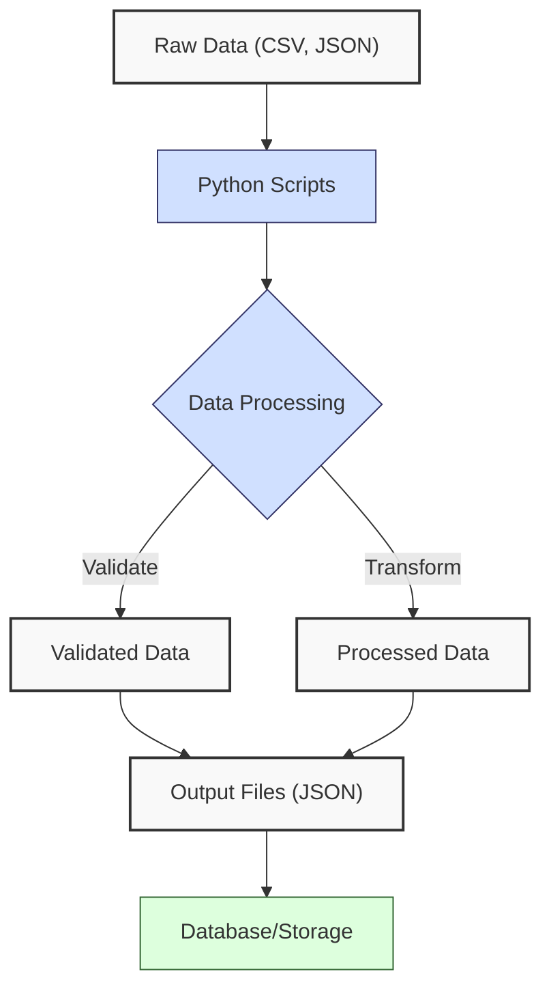
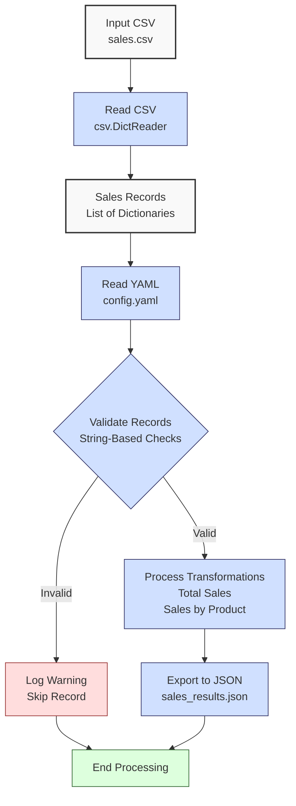

**Complexity: Easy (E)**

## 2.0 Introduction: Why This Matters for Data Engineering

In data engineering, processing data from files and configurations is a core skill for building reliable pipelines. Data engineers frequently handle structured formats like CSV, JSON, and YAML to ingest, validate, and export data, such as financial transaction data at Hijra Group. Ensuring data integrity through validation and applying configurations ensures pipelines are robust and adaptable. This chapter introduces file handling, data format processing, and string-based validation, equipping you to handle real-world data engineering tasks.

This chapter builds on Chapter 1’s Python fundamentals (data structures, functions, control flow) by applying them to external data sources and configurations. Since try/except, context managers, and error handling are introduced later (e.g., Chapter 7 for type safety, Chapter 9 for testing), we use string-based validation to ensure robustness without advanced error handling.

### Data Engineering Workflow Context

Here’s how file handling and data processing fit into a data engineering workflow:



### Building On and Preparing For

- **Building On**: Extends Chapter 1’s skills (lists, dictionaries, loops, functions) to process files and configurations, enhancing the sales data analyzer.
- **Preparing For**: File I/O, CSV/JSON/YAML processing, and validation prepare for Chapter 3 (NumPy and Pandas Basics) and Chapter 7 (Static Typing).

### What You’ll Learn

This chapter covers:

1. File handling for reading and writing data.
2. Processing CSV and JSON formats.
3. Parsing YAML configurations with PyYAML.
4. List comprehensions for efficient data transformations.
5. String-based validation for data integrity.

By the end, you’ll build a sales data processor that reads from CSV, applies YAML configurations, validates data, computes metrics, and exports to JSON, laying the foundation for advanced data engineering.

## 2.1 File Handling

File handling is essential for data engineering, as pipelines read from and write to files. Since context managers are introduced later, we use explicit `open` and `close`.

### 2.1.1 Reading Files

Read files using `open()` in read mode (`"r"`).

```python
# Read a text file
file_path = "data/sample.txt"
file = open(file_path, "r")
content = file.read()  # Read entire file
file.close()
print(f"File content:\n{content}")

# Sample content of data/sample.txt:
# Product: Laptop
# Price: 999.99
# Quantity: 2

# Output:
# File content:
# Product: Laptop
# Price: 999.99
# Quantity: 2
```

**Key Points**:

- `open(file_path, "r")` opens for reading.
- `read()` loads the entire file; use `readlines()` or iteration for large files.
- **Underlying Implementation**: Files are streams, reading data in chunks from disk to memory. `close()` releases resources.
- **Performance Considerations**:
  - **Time Complexity**: O(n), where n is file size, for sequential reading.
  - **Space Complexity**: O(n) for `read()`, storing the file in memory.
  - **Implication**: Iterate lines for large files to save memory.

### 2.1.2 Writing Files

Write using `"w"` (overwrite) or `"a"` (append) modes.

```python
# Write to a new file
output_path = "data/output.txt"
file = open(output_path, "w")
file.write("Product: Mouse\n")
file.write("Price: 24.99\n")
file.close()

# Read to verify
file = open(output_path, "r")
content = file.read()
file.close()
print(f"Output file content:\n{content}")

# Output:
# Output file content:
# Product: Mouse
# Price: 24.99
```

**Key Points**:

- `"w"` overwrites; `"a"` appends.
- `write()` takes strings; add newlines (`\n`) manually.
- **Performance Considerations**:
  - **Time Complexity**: O(n), where n is data size, for sequential writing.
  - **Space Complexity**: O(1), streaming to disk.
  - **Implication**: Always call `close()` to ensure data is written.

## 2.2 CSV and JSON Processing

CSV and JSON are common data formats. The `csv` and `json` modules simplify processing.

### 2.2.1 Reading and Writing CSV

Use `csv` for CSV files.

```python
import csv

# Write sales data to CSV
sales = [
    {"product": "Laptop", "price": 999.99, "quantity": 2},
    {"product": "Mouse", "price": 24.99, "quantity": 10}
]
csv_path = "data/sales.csv"
file = open(csv_path, "w", newline="")
writer = csv.DictWriter(file, fieldnames=["product", "price", "quantity"])
writer.writeheader()
writer.writerows(sales)
file.close()

# Read CSV file
file = open(csv_path, "r")
reader = csv.DictReader(file)
for row in reader:
    print(f"Row: {row}")
file.close()

# Output:
# Row: {'product': 'Laptop', 'price': '999.99', 'quantity': '2'}
# Row: {'product': 'Mouse', 'price': '24.99', 'quantity': '10'}
```

**Key Points**:

- `DictWriter` writes dictionaries with headers; `DictReader` reads rows as dictionaries.
- `newline=""` ensures platform compatibility.
- **Performance Considerations**:
  - **Time Complexity**: O(n), where n is rows.
  - **Space Complexity**: O(1) for streaming.
  - **Implication**: Stream rows for large CSVs.

### 2.2.2 Reading and Writing JSON

Use `json` for JSON files.

```python
import json

# Write sales data to JSON
sales = [
    {"product": "Laptop", "price": 999.99, "quantity": 2},
    {"product": "Mouse", "price": 24.99, "quantity": 10}
]
json_path = "data/sales.json"
file = open(json_path, "w")
json.dump(sales, file, indent=2)
file.close()

# Read JSON file
file = open(json_path, "r")
loaded_sales = json.load(file)
file.close()
print(f"Loaded sales: {loaded_sales}")

# Output:
# Loaded sales: [{'product': 'Laptop', 'price': 999.99, 'quantity': 2}, {'product': 'Mouse', 'price': 24.99, 'quantity': 10}]
```

**Key Points**:

- `json.dump()` serializes Python objects; `indent=2` formats output.
- `json.load()` deserializes to Python objects.
- **Performance Considerations**:
  - **Time Complexity**: O(n), where n is JSON size.
  - **Space Complexity**: O(n) for parsed data.
  - **Implication**: Memory-intensive for large JSON files.

## 2.3 List Comprehensions

List comprehensions provide a concise way to create or filter lists, useful for data transformations.

```python
# Create a list of product names
sales = [
    {"product": "Laptop", "price": 999.99},
    {"product": "Mouse", "price": 24.99}
]
products = [sale["product"] for sale in sales]
print(f"Products: {products}")

# Filter high prices
prices = [sale["price"] for sale in sales]
high_prices = [p for p in prices if p > 50]
print(f"High prices: {high_prices}")

# Output:
# Products: ['Laptop', 'Mouse']
# High prices: [999.99]
```

**Key Points**:

- Syntax: `[expression for item in iterable if condition]`.
- Combines loops and conditionals.
- **Underlying Implementation**: Optimized loops, compiled to efficient bytecode.
- **Performance Considerations**:
  - **Time Complexity**: O(n), where n is iterable length.
  - **Space Complexity**: O(n) for output list.
  - **Implication**: Faster than loops but memory-intensive for large lists.

## 2.4 YAML Configuration Parsing

YAML is used for configurations due to its readability. Use `PyYAML` to parse it.

```python
import yaml

# Sample data/config.yaml:
# min_price: 10.0
# max_quantity: 100
# required_fields:
#   - product
#   - price
#   - quantity

# Read YAML config
config_path = "data/config.yaml"
file = open(config_path, "r")
config = yaml.safe_load(file)
file.close()
print(f"Config: {config}")

# Output:
# Config: {'min_price': 10.0, 'max_quantity': 100, 'required_fields': ['product', 'price', 'quantity']}
```

**Key Points**:

- `yaml.safe_load()` parses YAML safely.
- Supports nested structures.
- **Performance Considerations**:
  - **Time Complexity**: O(n), where n is YAML size.
  - **Space Complexity**: O(n) for parsed config.
  - **Implication**: Ideal for small configurations; validate structure.

## 2.5 String-Based Validation

Use string-based validation to ensure data integrity, as try/except is introduced later.

```python
# Validate a sale record
sale = {"product": "Laptop", "price": "999.99", "quantity": "2"}
required_fields = ["product", "price", "quantity"]
min_price = 10.0
max_quantity = 100

is_valid = True
for field in required_fields:
    if field not in sale or not sale[field]:
        print(f"Missing or empty field '{field}': {sale}")
        is_valid = False

if is_valid:
    if not sale["product"].strip():
        print(f"Invalid product: empty name '{sale['product']}': {sale}")
        is_valid = False
    # Check price: digits, one decimal point, numeric
    price_parts = sale["price"].split(".")
    if len(price_parts) != 2 or not (price_parts[0].isdigit() and price_parts[1].isdigit()):
        print(f"Invalid price: not a valid number '{sale['price']}': {sale}")
        is_valid = False
    elif float(sale["price"]) < min_price:
        print(f"Invalid price: below {min_price} '{sale['price']}': {sale}")
        is_valid = False
    if not sale["quantity"].isdigit():
        print(f"Invalid quantity: not an integer '{sale['quantity']}': {sale}")
        is_valid = False
    elif int(sale["quantity"]) > max_quantity:
        print(f"Invalid quantity: exceeds {max_quantity} '{sale['quantity']}': {sale}")
        is_valid = False

print(f"Valid sale: {is_valid}")

# Output:
# Valid sale: True
```

**Key Points**:

- Validate fields, formats, and config-driven rules using string methods.
- Split `price` to ensure one decimal point and numeric parts.
- **Performance Considerations**:
  - **Time Complexity**: O(m), where m is fields validated.
  - **Space Complexity**: O(1), constant memory.
  - **Implication**: Simple but limited for complex validations.

## 2.6 Micro-Project: Sales Data Processor

### Project Requirements

Enhance the Chapter 1 sales data analyzer to process financial transaction data, like sales at Hijra Group, by:

- Reading sales data from `data/sales.csv`.
- Applying configurations from `data/config.yaml`.
- Validating records using string-based checks.
- Computing total sales and sales by product.
- Exporting results to `data/sales_results.json`.
- Logging processing steps and invalid records to the console.

### Data Processing Flow



### Acceptance Criteria

- **Go Criteria**:
  - Reads `sales.csv` and `config.yaml` correctly.
  - Validates records for required fields, non-empty product, numeric price/quantity, and config rules.
  - Computes total sales and sales by product for valid records.
  - Exports results to `sales_results.json`.
  - Logs steps and invalid records to console.
- **No-Go Criteria**:
  - Fails to process valid CSV/YAML.
  - Incorrect validation or calculations.
  - Missing JSON export.
  - No logging for invalid records.

### Common Pitfalls to Avoid

1. **Hard-Coded Paths**:
   - **Problem**: Absolute paths break portability.
   - **Solution**: Use relative paths (e.g., `data/sales.csv`).
2. **Missing Field Checks**:
   - **Problem**: Omitting validation causes calculation errors.
   - **Solution**: Check all required fields.
3. **Forgetting to Close Files**:
   - **Problem**: Open files cause resource leaks.
   - **Solution**: Always call `close()` after `open()`.
4. **Invalid JSON Data**:
   - **Problem**: Non-serializable objects cause errors.
   - **Solution**: Ensure JSON-compatible data.
5. **Weak Validation**:
   - **Problem**: Incomplete checks allow bad data.
   - **Solution**: Validate all fields and config rules.

### How This Differs from Production

In production, this solution would include:

- **Error Handling**: Try/except for robust error management (Chapter 7).
- **Type Safety**: Type annotations with Pyright (Chapter 7).
- **Testing**: Unit tests with `pytest` (Chapter 9).
- **Logging**: File-based or centralized logging (Chapter 52).
- **Scalability**: Streaming or parallel processing for large datasets (Chapter 40).

### Implementation

```python
import csv
import json
import yaml

# Function to read YAML config
def read_config(config_path):
    """Read YAML configuration file."""
    file = open(config_path, "r")
    config = yaml.safe_load(file)
    file.close()
    print(f"Loaded config: {config}")
    return config

# Function to read sales data
def read_sales_data(csv_path):
    """Read sales data from CSV."""
    sales = []
    file = open(csv_path, "r")
    reader = csv.DictReader(file)
    for row in reader:
        sales.append(row)
    file.close()
    print(f"Read {len(sales)} records from {csv_path}")
    return sales

# Function to validate a sale record
def validate_sale(sale, config):
    """Validate sale record using string-based checks."""
    required_fields = config["required_fields"]
    min_price = config["min_price"]
    max_quantity = config["max_quantity"]

    for field in required_fields:
        if field not in sale or not sale[field]:
            print(f"Invalid sale: missing/empty '{field}': {sale}")
            return False

    if not sale["product"].strip():
        print(f"Invalid sale: empty product name '{sale['product']}': {sale}")
        return False

    # Validate price: one decimal point, numeric
    price_parts = sale["price"].split(".")
    if len(price_parts) != 2 or not (price_parts[0].isdigit() and price_parts[1].isdigit()):
        print(f"Invalid sale: non-numeric price '{sale['price']}': {sale}")
        return False
    if float(sale["price"]) < min_price:
        print(f"Invalid sale: price below {min_price} '{sale['price']}': {sale}")
        return False

    if not sale["quantity"].isdigit():
        print(f"Invalid sale: non-integer quantity '{sale['quantity']}': {sale}")
        return False
    if int(sale["quantity"]) > max_quantity:
        print(f"Invalid sale: quantity exceeds {max_quantity} '{sale['quantity']}': {sale}")
        return False

    return True

# Function to process sales data
def process_sales(sales, config):
    """Process sales data and compute metrics."""
    valid_sales = [sale for sale in sales if validate_sale(sale, config)]
    print(f"Valid sales: {len(valid_sales)} records")

    total_sales = 0.0
    sales_by_product = {}

    for sale in valid_sales:
        amount = float(sale["price"]) * int(sale["quantity"])
        total_sales += amount
        product = sale["product"]
        sales_by_product[product] = sales_by_product.get(product, 0) + amount

    return {
        "total_sales": total_sales,
        "sales_by_product": sales_by_product
    }

# Function to export results
def export_results(results, json_path):
    """Export results to JSON."""
    file = open(json_path, "w")
    json.dump(results, file, indent=2)
    file.close()
    print(f"Exported results to {json_path}")

# Main function
def main():
    csv_path = "data/sales.csv"
    config_path = "data/config.yaml"
    json_path = "data/sales_results.json"

    config = read_config(config_path)
    sales = read_sales_data(csv_path)
    results = process_sales(sales, config)
    export_results(results, json_path)
    print("Processing completed")

if __name__ == "__main__":
    main()
```

### Sample Input Files

**`data/sales.csv`**:

```csv
product,price,quantity
Laptop,999.99,2
Mouse,24.99,10
Keyboard,49.99,5
,29.99,3
Monitor,invalid,2
Headphones,5.00,150
```

**`data/config.yaml`**:

```yaml
min_price: 10.0
max_quantity: 100
required_fields:
  - product
  - price
  - quantity
```

### Expected Outputs

**`data/sales_results.json`**:

```json
{
  "total_sales": 2249.97,
  "sales_by_product": {
    "Laptop": 1999.98,
    "Mouse": 249.9,
    "Keyboard": 249.95
  }
}
```

**Console Output** (sample):

```
Loaded config: {'min_price': 10.0, 'max_quantity': 100, 'required_fields': ['product', 'price', 'quantity']}
Read 6 records from data/sales.csv
Invalid sale: missing/empty 'product': {'product': '', 'price': '29.99', 'quantity': '3'}
Invalid sale: non-numeric price 'invalid': {'product': 'Monitor', 'price': 'invalid', 'quantity': '2'}
Invalid sale: quantity exceeds 100 '150': {'product': 'Headphones', 'price': '5.00', 'quantity': '150'}
Valid sales: 3 records
Exported results to data/sales_results.json
Processing completed
```

### How to Run and Test

1. **Setup**:

   - Save code as `sales_processor.py`.
   - Create `data/` folder in the same directory as `sales_processor.py`. Place `sales.csv` and `config.yaml` inside.
   - Install PyYAML: `pip install pyyaml`. Verify by running `python -c "import yaml"`; if no errors, it’s installed.
   - Use Python 3.10+.

2. **Run**:

   - Execute: `python sales_processor.py`.
   - Outputs: `data/sales_results.json`, console logs.

3. **Test Scenarios**:
   - **Valid Data**: Verify `sales_results.json` shows `total_sales: 2249.97`, correct product sales.
   - **Invalid Records**: Check console for warnings on missing fields, invalid price/quantity, or config violations.
   - **Empty CSV**: Use CSV with headers only; verify zeroed results.
   - **Missing Config**: Rename `config.yaml`; observe failure (manual check).

## 2.7 Practice Exercises

### Exercise 1: File Reader

Write a function to read a text file and return its lines as a list. Log the number of lines to the console.

### Exercise 2: CSV Validator

Write a function to read a CSV and check for required fields (`product`, `price`, `quantity`). Return valid rows and log invalid ones.

### Exercise 3: YAML Parser

Write a function to read a YAML file and return its contents. Log the keys loaded.

### Exercise 4: JSON Exporter

Write a function to export a dictionary to JSON with indentation. Log export completion.

### Exercise 5: Debug a Sales Processor

The following script has bugs preventing it from computing total sales correctly. Identify and fix the issues. Log invalid records to the console.

```python
import csv

def process_sales(csv_path):
    file = open(csv_path)  # Bug: missing mode, no close
    reader = csv.DictReader(file)
    total = 0
    for row in reader:
        total += row["price"] * row["quantity"]  # Bug: no validation, string types
    return total

# Test
print(process_sales("data/sales.csv"))
```

**Expected Fixes**: Add `"r"` mode, close file, validate records, convert price/quantity to float/int.

## 2.8 Exercise Solutions

### Solution to Exercise 1: File Reader

```python
def read_lines(file_path):
    """Read a text file and return its lines."""
    file = open(file_path, "r")
    lines = file.readlines()
    file.close()
    print(f"Read {len(lines)} lines from {file_path}")
    return lines

# Test
lines = read_lines("data/sample.txt")
print(lines)
# Output:
# Read 3 lines from data/sample.txt
# ['Product: Laptop\n', 'Price: 999.99\n', 'Quantity: 2\n']
```

### Solution to Exercise 2: CSV Validator

```python
import csv

def validate_csv(csv_path):
    """Validate CSV rows for required fields."""
    valid_rows = []
    file = open(csv_path, "r")
    reader = csv.DictReader(file)
    for row in reader:
        if all(field in row and row[field] for field in ["product", "price", "quantity"]):
            valid_rows.append(row)
        else:
            print(f"Invalid row: {row}")
    file.close()
    print(f"Found {len(valid_rows)} valid rows")
    return valid_rows

# Test
rows = validate_csv("data/sales.csv")
print(rows)
# Output:
# Invalid row: {'product': '', 'price': '29.99', 'quantity': '3'}
# ...
# Found 3 valid rows
# [{'product': 'Laptop', 'price': '999.99', 'quantity': '2'}, ...]
```

### Solution to Exercise 3: YAML Parser

```python
import yaml

def read_yaml(config_path):
    """Read a YAML file and return its contents."""
    file = open(config_path, "r")
    config = yaml.safe_load(file)
    file.close()
    print(f"Loaded keys: {list(config.keys())}")
    return config

# Test
config = read_yaml("data/config.yaml")
print(config)
# Output:
# Loaded keys: ['min_price', 'max_quantity', 'required_fields']
# {'min_price': 10.0, 'max_quantity': 100, 'required_fields': ['product', 'price', 'quantity']}
```

### Solution to Exercise 4: JSON Exporter

```python
import json

def export_json(data, json_path):
    """Export dictionary to JSON."""
    file = open(json_path, "w")
    json.dump(data, file, indent=2)
    file.close()
    print(f"Exported to {json_path}")

# Test
data = {"test": [1, 2, 3]}
export_json(data, "data/test.json")
# Output:
# Exported to data/test.json
```

### Solution to Exercise 5: Debug a Sales Processor

```python
import csv

def process_sales(csv_path):
    """Compute total sales from valid records."""
    file = open(csv_path, "r")  # Fix: added "r" mode
    reader = csv.DictReader(file)
    total = 0.0
    for row in reader:
        # Validate record
        if (all(field in row and row[field] for field in ["product", "price", "quantity"]) and
            row["product"].strip() and
            row["price"].split(".")[0].isdigit() and len(row["price"].split(".")) == 2 and
            row["quantity"].isdigit()):
            total += float(row["price"]) * int(row["quantity"])  # Fix: convert to float/int
        else:
            print(f"Invalid record: {row}")
    file.close()  # Fix: close file
    return total

# Test
print(process_sales("data/sales.csv"))
# Output:
# Invalid record: {'product': '', 'price': '29.99', 'quantity': '3'}
# ...
# 2249.97
```

## 2.9 Chapter Summary and Connection to Chapter 3

In this chapter, you’ve mastered:

- **File Handling**: Reading/writing files with explicit `open`/`close`.
- **CSV/JSON Processing**: Handling structured data with `csv` and `json`.
- **YAML Parsing**: Loading configurations with `PyYAML`.
- **List Comprehensions**: Efficient data transformations.
- **String-Based Validation**: Ensuring data integrity.

The micro-project built a sales data processor that reads CSV, applies YAML configurations, validates data, computes metrics, and exports to JSON, simulating financial transaction processing at Hijra Group. Performance analysis (O(n) time, O(n) space for file I/O) ensures efficiency for small datasets.

### Connection to Chapter 3

Chapter 3 introduces NumPy and Pandas, building on this chapter:

- **NumPy**: Replaces manual numerical computations with vectorized operations, improving performance over loops and list comprehensions.
- **Pandas**: Simplifies CSV processing with DataFrames, replacing `csv.DictReader` and manual dictionary operations for faster, tabular data handling.
- **Data Transformations**: Extends list comprehensions to DataFrame operations for larger datasets.
- **Performance**: Uses optimized libraries to handle big data, with file I/O and validation remaining critical.

The sales data processor will be refactored in Chapter 3 to use Pandas, enabling faster, more powerful analysis and preparing for type-safe programming and database integration.
