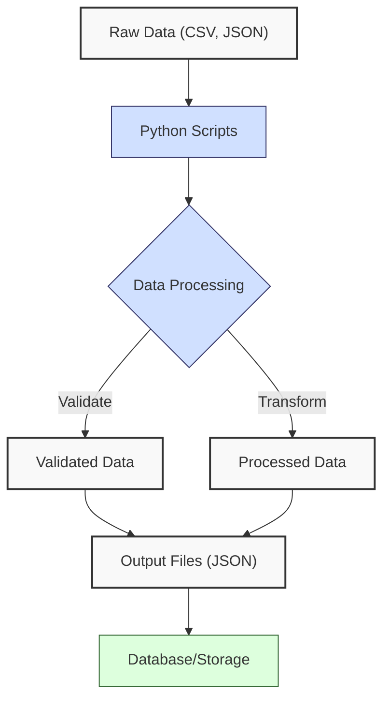
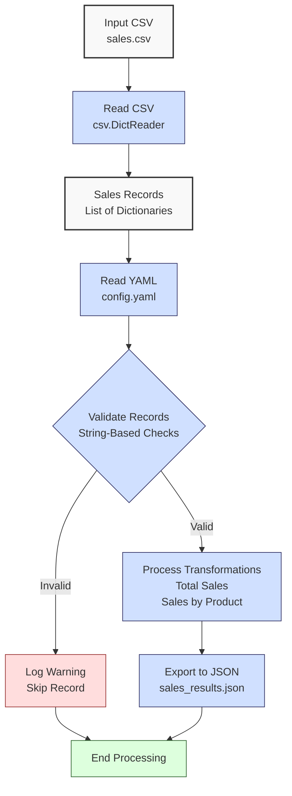

**Complexity: Easy (E)**

## 2.0 Introduction: Why This Matters for Data Engineering

In data engineering, processing data from files and configurations is critical for building robust pipelines. At Hijra Group, data engineers handle structured formats like CSV, JSON, and YAML to ingest, validate, and export financial transaction data, such as sales records. This chapter introduces file handling, data format processing, list comprehensions, and string-based validation, enabling you to create scripts that process external data reliably. These skills ensure pipelines are adaptable and maintain data integrity, foundational for real-world analytics.

This chapter builds on Chapter 1’s Python fundamentals (variables, data types, control flow, functions, data structures) by applying them to external data sources. Since try/except, context managers, error handling, type annotations, and testing are introduced later (e.g., Chapters 7 and 9), we use string-based validation to ensure robustness without advanced techniques.

### Data Engineering Workflow Context

Here’s how file handling and data processing fit into a data engineering workflow:



### Building On and Preparing For

- **Building On**: Extends Chapter 1’s skills (lists, dictionaries, loops, functions) to process files and configurations, enhancing the sales data analyzer.
- **Preparing For**: File I/O, CSV/JSON/YAML processing, and validation prepare for Chapter 3 (NumPy and Pandas Basics) and Chapter 7 (Static Typing).

### What You’ll Learn

This chapter covers:

1. File handling (reading and writing).
2. CSV and JSON processing for structured data.
3. List comprehensions for efficient transformations.
4. YAML configuration parsing with PyYAML.
5. String-based validation for data integrity.

By the end, you’ll build a sales data processor that reads from CSV, applies YAML configurations, validates data, computes metrics, and exports to JSON, simulating financial transaction processing at Hijra Group.

## 2.1 File Handling

File handling enables data engineers to read input data (e.g., sales records) and write outputs (e.g., reports). Since context managers are introduced later, we use explicit `open` and `close`.

### 2.1.1 Reading Files

Read files using `open()` in read mode (`"r"`).

```python
# Define the file path for the input text file
file_path = "data/sample.txt"  # Path to the sample text file
# Open the file in read mode ("r") to access its contents
file = open(file_path, "r")  # Returns a file object for reading
# Read the entire file content into a string
content = file.read()  # Reads all lines into a single string
# Close the file to free system resources
file.close()  # Ensures the file is properly closed
# Print the file content using an f-string
print(f"File content:\n{content}")  # Outputs the file’s content

# Sample content of data/sample.txt:
# Product: Laptop
# Price: 999.99
# Quantity: 2

# Output:
# File content:
# Product: Laptop
# Price: 999.99
# Quantity: 2
```

**Follow-Along Instructions**:

1. Create a `de-onboarding/` folder in your working directory.
2. Create a `data/` subfolder (e.g., `de-onboarding/data/`).
3. Create `data/sample.txt` and copy the sample content above.
4. Save the code as `de-onboarding/read_file.py`.
5. Configure your editor (e.g., VS Code) to use 4 spaces for indentation (not tabs). In VS Code, set “Editor: Tab Size” to 4 and “Editor: Insert Spaces” to true.
6. Open a terminal, navigate to `de-onboarding/`, and run: `python read_file.py`.
7. Verify the output matches the comments.
8. **Common Errors**:
   - **FileNotFoundError**: Ensure `data/sample.txt` exists in `de-onboarding/data/`.
   - **PermissionError**: Check read permissions for the `data/` folder.
   - **IndentationError**: Use 4 spaces for all lines (not tabs).

**Key Points**:

- `open(file_path, "r")` opens for reading.
- `read()` loads the entire file; use `readlines()` or iteration for large files.
- **Underlying Implementation**: Files are streams, reading data in chunks from disk to memory. `close()` releases resources.
- **Performance Considerations**:
  - **Time Complexity**: O(n), where n is file size, for sequential reading.
  - **Space Complexity**: O(n) for `read()`, storing the file in memory.
  - **Implication**: Iterate lines for large files to save memory.

### 2.1.2 Writing Files

Write using `"w"` (overwrite) or `"a"` (append) modes.

```python
# Define the file path for the output text file
output_path = "data/output.txt"  # Path to the output file
# Open the file in write mode ("w") to create or overwrite it
file = open(output_path, "w")  # Returns a file object for writing
# Write a product line to the file with a newline
file.write("Product: Mouse\n")  # Writes the string and newline
# Write a price line to the file
file.write("Price: 24.99\n")  # Appends another line
# Close the file to ensure data is saved
file.close()  # Flushes and closes the file

# Reopen the file in read mode to verify contents
file = open(output_path, "r")  # Open for reading
# Read the entire file content
content = file.read()  # Reads all lines into a string
# Close the file after reading
file.close()  # Releases resources
# Print the file content using an f-string
print(f"Output file content:\n{content}")  # Outputs the written content

# Output:
# Output file content:
# Product: Mouse
# Price: 24.99
```

**Follow-Along Instructions**:

1. Ensure `de-onboarding/data/` exists.
2. Save the code as `de-onboarding/write_file.py`.
3. Configure your editor to use 4 spaces for indentation (not tabs).
4. Run: `python write_file.py`.
5. Check `data/output.txt` exists and verify the output matches the comments.
6. **Common Errors**:
   - **PermissionError**: Ensure write permissions for `data/`.
   - **No output in file**: Verify `close()` is called to flush data.
   - **IndentationError**: Use 4 spaces for all lines (not tabs).

**Key Points**:

- `"w"` overwrites; `"a"` appends.
- `write()` takes strings; add newlines (`\n`) manually.
- **Underlying Implementation**: Writes data to disk buffers; `close()` flushes buffers.
- **Performance Considerations**:
  - **Time Complexity**: O(n), where n is data size, for sequential writing.
  - **Space Complexity**: O(1), streaming to disk.
  - **Implication**: Always call `close()` to ensure data is written.

## 2.2 CSV and JSON Processing

CSV and JSON are standard formats for structured data, used in data pipelines to store and exchange sales records.

### 2.2.1 Reading and Writing CSV

Use the `csv` module to process CSV files.

```python
# Import the csv module for CSV handling
import csv

# Define a list of sales records as dictionaries
sales = [
    {"product": "Laptop", "price": 999.99, "quantity": 2},  # First sale record
    {"product": "Mouse", "price": 24.99, "quantity": 10}  # Second sale record
]
# Define the file path for the CSV output
csv_path = "data/sales.csv"  # Path to the CSV file
# Open the file in write mode with newline="" for cross-platform compatibility
file = open(csv_path, "w", newline="")  # Returns a file object for writing
# Create a DictWriter to write dictionaries to CSV
writer = csv.DictWriter(file, fieldnames=["product", "price", "quantity"])  # Specifies column headers
# Write the header row (product, price, quantity)
writer.writeheader()  # Writes the fieldnames as the first row
# Write all sales records to the CSV
writer.writerows(sales)  # Writes each dictionary as a row
# Close the file to save the CSV
file.close()  # Ensures data is written

# Reopen the file in read mode to verify contents
file = open(csv_path, "r")  # Open for reading
# Create a DictReader to read CSV rows as dictionaries
reader = csv.DictReader(file)  # Reads rows with headers as keys
# Iterate over each row in the CSV
for row in reader:
    # Print each row as a dictionary
    print(f"Row: {row}")  # Outputs the row’s key-value pairs
# Close the file after reading
file.close()  # Releases resources

# Output:
# Row: {'product': 'Laptop', 'price': '999.99', 'quantity': '2'}
# Row: {'product': 'Mouse', 'price': '24.99', 'quantity': '10'}
```

**Follow-Along Instructions**:

1. Ensure `de-onboarding/data/` exists.
2. Save the code as `de-onboarding/csv_example.py`.
3. Configure your editor to use 4 spaces for indentation (not tabs).
4. Run: `python csv_example.py`.
5. Check `data/sales.csv` exists and verify the output matches the comments.
6. **Common Errors**:
   - **CSV format error**: Ensure `newline=""` is used when writing.
   - **FileNotFoundError**: Verify `data/` folder exists.
   - **IndentationError**: Use 4 spaces for all lines (not tabs).

**Key Points**:

- `DictWriter` writes dictionaries with headers; `DictReader` reads rows as dictionaries.
- `newline=""` ensures platform compatibility.
- **Underlying Implementation**: CSV module parses text streams, mapping headers to dictionary keys.
- **Performance Considerations**:
  - **Time Complexity**: O(n), where n is rows, for reading/writing.
  - **Space Complexity**: O(1) for streaming rows.
  - **Implication**: Stream rows for memory efficiency with large CSVs.

### 2.2.2 Reading and Writing JSON

Use the `json` module for JSON files.

```python
# Import the json module for JSON handling
import json

# Define a list of sales records as dictionaries
sales = [
    {"product": "Laptop", "price": 999.99, "quantity": 2},  # First sale record
    {"product": "Mouse", "price": 24.99, "quantity": 10}  # Second sale record
]
# Define the file path for the JSON output
json_path = "data/sales.json"  # Path to the JSON file
# Open the file in write mode to create or overwrite it
file = open(json_path, "w")  # Returns a file object for writing
# Write the sales list to JSON with 2-space indentation
json.dump(sales, file, indent=2)  # Serializes the list to formatted JSON
# Close the file to save the JSON
file.close()  # Ensures data is written

# Reopen the file in read mode to verify contents
file = open(json_path, "r")  # Open for reading
# Load the JSON content into a Python object (list of dictionaries)
loaded_sales = json.load(file)  # Deserializes JSON to Python
# Close the file after reading
file.close()  # Releases resources
# Print the loaded sales data using an f-string
print(f"Loaded sales: {loaded_sales}")  # Outputs the deserialized data

# Output:
# Loaded sales: [{'product': 'Laptop', 'price': 999.99, 'quantity': 2}, {'product': 'Mouse', 'price': 24.99, 'quantity': 10}]
```

**Follow-Along Instructions**:

1. Ensure `de-onboarding/data/` exists.
2. Save the code as `de-onboarding/json_example.py`.
3. Configure your editor to use 4 spaces for indentation (not tabs).
4. Run: `python json_example.py`.
5. Check `data/sales.json` exists and verify the output matches the comments.
6. **Common Errors**:
   - **JSONDecodeError**: Ensure the JSON file is properly formatted.
   - **FileNotFoundError**: Verify `data/` folder exists.
   - **IndentationError**: Use 4 spaces for all lines (not tabs).

**Key Points**:

- `json.dump()` serializes Python objects; `indent=2` formats output.
- `json.load()` deserializes to Python objects.
- **Underlying Implementation**: JSON module parses text into Python objects using a recursive descent parser.
- **Performance Considerations**:
  - **Time Complexity**: O(n), where n is JSON size, for parsing/serializing.
  - **Space Complexity**: O(n) for parsed data.
  - **Implication**: Memory-intensive for large JSON files; use streaming for big data.

## 2.3 List Comprehensions

List comprehensions provide a concise way to create or filter lists, optimizing data transformations in pipelines.

### 2.3.1 Basic List Comprehensions

Create or filter lists efficiently.

```python
# Define a list of sales records as dictionaries
sales = [
    {"product": "Laptop", "price": 999.99},  # First sale record
    {"product": "Mouse", "price": 24.99}  # Second sale record
]
# Create a list of product names using a list comprehension
products = [sale["product"] for sale in sales]  # Extracts product field from each record
# Print the list of product names using an f-string
print(f"Products: {products}")  # Outputs the extracted names

# Create a list of prices using a list comprehension
prices = [sale["price"] for sale in sales]  # Extracts price field from each record
# Filter prices above 50 using a conditional list comprehension
high_prices = [p for p in prices if p > 50]  # Includes prices > 50
# Print the filtered prices using an f-string
print(f"High prices: {high_prices}")  # Outputs prices above 50

# Output:
# Products: ['Laptop', 'Mouse']
# High prices: [999.99]
```

**Follow-Along Instructions**:

1. Save the code as `de-onboarding/list_comprehension.py`.
2. Configure your editor to use 4 spaces for indentation (not tabs).
3. Run: `python list_comprehension.py`.
4. Verify the output matches the comments.
5. **Common Errors**:
   - **KeyError**: Ensure dictionary keys (e.g., `"product"`) match the data.
   - **TypeError**: Verify comparison types (e.g., `p > 50` uses numbers).
   - **IndentationError**: Use 4 spaces for all lines (not tabs).

**Key Points**:

- Syntax: `[expression for item in iterable if condition]`.
- Combines loops and conditionals.
- **Underlying Implementation**: Optimized loops, compiled to efficient bytecode.
- **Performance Considerations**:
  - **Time Complexity**: O(n), where n is iterable length.
  - **Space Complexity**: O(n) for output list.
  - **Implication**: Faster than loops but memory-intensive for large lists.

## 2.4 YAML Configuration Parsing

YAML is used for configuration files due to its readability, enabling flexible pipeline settings. The `PyYAML` library parses YAML files.

### 2.4.1 Reading YAML Files

Parse YAML configurations with `PyYAML`.

```python
# Import the yaml module for YAML parsing
import yaml

# Define the file path for the YAML configuration
config_path = "data/config.yaml"  # Path to the configuration file
# Open the file in read mode to access its contents
file = open(config_path, "r")  # Returns a file object for reading
# Parse the YAML content into a Python dictionary
config = yaml.safe_load(file)  # Safely loads YAML to avoid code execution
# Close the file to free resources
file.close()  # Ensures the file is closed
# Print the parsed configuration using an f-string
print(f"Config: {config}")  # Outputs the dictionary

# Sample content of data/config.yaml:
# min_price: 10.0
# max_quantity: 100
# required_fields:
#   - product
#   - price
#   - quantity

# Output:
# Config: {'min_price': 10.0, 'max_quantity': 100, 'required_fields': ['product', 'price', 'quantity']}
```

**Follow-Along Instructions**:

1. Ensure `de-onboarding/data/` exists.
2. Create `data/config.yaml` and copy the sample content above.
3. Install PyYAML: `pip install pyyaml`. Verify with `python -c "import yaml"`.
4. Save the code as `de-onboarding/yaml_example.py`.
5. Configure your editor to use 4 spaces for indentation (not tabs).
6. Run: `python yaml_example.py`.
7. Verify the output matches the comments.
8. **Common Errors**:
   - **ModuleNotFoundError**: Run `pip install pyyaml` if PyYAML is missing.
   - **FileNotFoundError**: Ensure `data/config.yaml` exists.
   - **YAMLError**: Check `config.yaml` syntax (e.g., correct indentation).
   - **IndentationError**: Use 4 spaces for all lines (not tabs).

**Key Points**:

- `yaml.safe_load()` parses YAML safely, avoiding arbitrary code execution.
- Supports nested structures (lists, dictionaries).
- **Underlying Implementation**: PyYAML uses a parser to convert YAML to Python objects.
- **Performance Considerations**:
  - **Time Complexity**: O(n), where n is YAML size.
  - **Space Complexity**: O(n) for parsed config.
  - **Implication**: Ideal for small configurations; validate structure for reliability.

## 2.5 String-Based Validation

String-based validation ensures data integrity without try/except, which is introduced later, by checking formats and values.

### 2.5.1 Validating Data Records

Validate sales records using string methods.

```python
# Define a sample sale record as a dictionary
sale = {"product": "Laptop", "price": "999.99", "quantity": "2"}  # Sample sale data
# Define validation rules
required_fields = ["product", "price", "quantity"]  # List of required keys
min_price = 10.0  # Minimum price threshold
max_quantity = 100  # Maximum quantity threshold

# Initialize a boolean to track validity
is_valid = True  # Starts as True, set to False if validation fails
# Check for missing or empty fields
for field in required_fields:
    # Verify each required field exists and is non-empty
    if field not in sale or not sale[field]:
        # Print error message if field is missing or empty
        print(f"Missing or empty field '{field}': {sale}")
        # Mark the record as invalid
        is_valid = False

# Proceed with further validation only if initial checks pass
if is_valid:
    # Check if product name is non-empty after stripping whitespace
    if not sale["product"].strip():
        # Print error for empty product name
        print(f"Invalid product: empty name '{sale['product']}': {sale}")
        # Mark the record as invalid
        is_valid = False
    # Validate price: one decimal point, numeric, optional minus
    price_str = sale["price"]  # Get the price string
    is_negative = price_str.startswith("-")  # Check for negative sign
    price_clean = price_str[1:] if is_negative else price_str  # Remove minus if present
    price_parts = price_clean.split(".")  # Split on decimal point
    # Verify price has one decimal point and numeric parts
    if len(price_parts) != 2 or not (price_parts[0].isdigit() and price_parts[1].isdigit()):
        # Print error for non-numeric price
        print(f"Invalid price: not a valid number '{sale['price']}': {sale}")
        # Mark the record as invalid
        is_valid = False
    # Check if price meets minimum threshold
    elif float(sale["price"]) < min_price:
        # Print error for price below minimum
        print(f"Invalid price: below {min_price} '{sale['price']}': {sale}")
        # Mark the record as invalid
        is_valid = False
    # Validate quantity: must be a non-negative integer
    if not sale["quantity"].isdigit():
        # Print error for non-integer quantity
        print(f"Invalid quantity: not an integer '{sale['quantity']}': {sale}")
        # Mark the record as invalid
        is_valid = False
    # Check if quantity exceeds maximum threshold
    elif int(sale["quantity"]) > max_quantity:
        # Print error for excessive quantity
        print(f"Invalid quantity: exceeds {max_quantity} '{sale['quantity']}': {sale}")
        # Mark the record as invalid
        is_valid = False

# Print the final validation result using an f-string
print(f"Valid sale: {is_valid}")  # Outputs True or False

# Output:
# Valid sale: True
```

**Follow-Along Instructions**:

1. Save the code as `de-onboarding/validate_sale.py`.
2. Configure your editor to use 4 spaces for indentation (not tabs).
3. Run: `python validate_sale.py`.
4. Verify the output shows `Valid sale: True`.
5. Test with invalid data (e.g., `sale["price"] = "invalid"`) and check the error message.
6. **Common Errors**:
   - **KeyError**: Ensure all `required_fields` exist in `sale`.
   - **ValueError**: Verify `float(sale["price"])` uses a valid number.
   - **IndentationError**: Use 4 spaces for all lines (not tabs).

**Key Points**:

- Validate fields, formats, and rules using string methods (e.g., `isdigit()`, `split()`).
- Supports negative prices with a leading minus sign.
- **Underlying Implementation**: String operations are array-based, with checks performed sequentially.
- **Performance Considerations**:
  - **Time Complexity**: O(m), where m is fields validated.
  - **Space Complexity**: O(1), constant memory.
  - **Implication**: Simple but limited for complex validations; sufficient for small datasets.

## 2.6 Micro-Project: Sales Data Processor

### Project Requirements

Enhance the Chapter 1 sales data analyzer to process financial transaction data, like sales at Hijra Group, by:

- Reading sales data from `data/sales.csv`.
- Applying configurations from `data/config.yaml`.
- Validating records using string-based checks.
- Computing total sales and sales by product.
- Exporting results to `data/sales_results.json`.
- Logging processing steps and invalid records to the console.

### Sample Input Files

**`data/sales.csv`**:

```csv
product,price,quantity
Laptop,999.99,2
Mouse,24.99,10
Keyboard,49.99,5
,29.99,3
Monitor,invalid,2
Headphones,5.00,150
```

**`data/config.yaml`**:

```yaml
min_price: 10.0
max_quantity: 100
required_fields:
  - product
  - price
  - quantity
```

### Data Processing Flow



### Acceptance Criteria

- **Go Criteria**:
  - Reads `sales.csv` and `config.yaml` correctly.
  - Validates records for required fields, non-empty product, numeric price/quantity, and config rules.
  - Computes total sales and sales by product for valid records.
  - Exports results to `sales_results.json`.
  - Logs steps and invalid records to console.
- **No-Go Criteria**:
  - Fails to process valid CSV/YAML.
  - Incorrect validation or calculations.
  - Missing JSON export.
  - No logging for invalid records.

### Common Pitfalls to Avoid

1. **Hard-Coded Paths**:
   - **Problem**: Absolute paths break portability.
   - **Solution**: Use relative paths (e.g., `data/sales.csv`).
2. **Missing Field Checks**:
   - **Problem**: Omitting validation causes calculation errors.
   - **Solution**: Check all required fields.
3. **Forgetting to Close Files**:
   - **Problem**: Open files cause resource leaks.
   - **Solution**: Always call `close()` after `open()`.
4. **Invalid JSON Data**:
   - **Problem**: Non-serializable objects cause errors.
   - **Solution**: Ensure JSON-compatible data.
5. **Weak Validation**:
   - **Problem**: Incomplete checks allow bad data.
   - **Solution**: Validate all fields and config rules.
6. **Inconsistent Indentation**:
   - **Problem**: `IndentationError` from mixed spaces/tabs.
   - **Solution**: Use 4 spaces per level, per PEP 8. Configure editor to insert spaces.

### How This Differs from Production

In production, this solution would include:

- **Error Handling**: Try/except for robust error management (Chapter 7).
- **Type Safety**: Type annotations with Pyright (Chapter 7).
- **Testing**: Unit tests with `pytest` (Chapter 9).
- **Logging**: File-based or centralized logging (Chapter 52).
- **Scalability**: Streaming or parallel processing for large datasets (Chapter 40).

### Implementation

```python
# Import required modules for CSV, JSON, and YAML processing
import csv  # For reading/writing CSV files
import json  # For reading/writing JSON files
import yaml  # For parsing YAML configurations

# Define a function to read YAML configuration
def read_config(config_path):
    """Read YAML configuration file."""
    # Open the configuration file in read mode
    file = open(config_path, "r")  # Returns a file object
    # Parse the YAML content into a Python dictionary
    config = yaml.safe_load(file)  # Safely loads YAML
    # Close the file to free resources
    file.close()  # Ensures file is closed
    # Print the loaded configuration for logging
    print(f"Loaded config: {config}")  # Outputs the config dictionary
    # Return the parsed configuration
    return config

# Define a function to read sales data from CSV
def read_sales_data(csv_path):
    """Read sales data from CSV."""
    # Initialize an empty list to store sales records
    sales = []  # List to hold dictionaries
    # Open the CSV file in read mode
    file = open(csv_path, "r")  # Returns a file object
    # Create a DictReader to read CSV rows as dictionaries
    reader = csv.DictReader(file)  # Reads rows with headers
    # Iterate over each row and append to sales list
    for row in reader:
        sales.append(row)  # Add row dictionary to list
    # Close the file after reading
    file.close()  # Releases resources
    # Print the number of records read for logging
    print(f"Read {len(sales)} records from {csv_path}")  # Outputs count
    # Return the list of sales records
    return sales

# Define a function to validate a sale record
def validate_sale(sale, config):
    """Validate sale record using string-based checks."""
    # Extract validation rules from config
    required_fields = config["required_fields"]  # List of required keys
    min_price = config["min_price"]  # Minimum price threshold
    max_quantity = config["max_quantity"]  # Maximum quantity threshold

    # Check for missing or empty fields
    for field in required_fields:
        # Verify each field exists and is non-empty
        if field not in sale or not sale[field]:
            # Print error message for invalid field
            print(f"Invalid sale: missing/empty '{field}': {sale}")
            # Return False to indicate invalid record
            return False

    # Check if product name is non-empty after stripping
    if not sale["product"].strip():
        # Print error for empty product name
        print(f"Invalid sale: empty product name '{sale['product']}': {sale}")
        # Return False for invalid record
        return False

    # Validate price: one decimal point, numeric, optional minus
    price_str = sale["price"]  # Get price string
    is_negative = price_str.startswith("-")  # Check for negative sign
    price_clean = price_str[1:] if is_negative else price_str  # Remove minus
    price_parts = price_clean.split(".")  # Split on decimal point
    # Verify price format
    if len(price_parts) != 2 or not (price_parts[0].isdigit() and price_parts[1].isdigit()):
        # Print error for non-numeric price
        print(f"Invalid sale: non-numeric price '{sale['price']}': {sale}")
        # Return False for invalid record
        return False
    # Check minimum price threshold
    if float(sale["price"]) < min_price:
        # Print error for low price
        print(f"Invalid sale: price below {min_price} '{sale['price']}': {sale}")
        # Return False for invalid record
        return False

    # Validate quantity: non-negative integer
    if not sale["quantity"].isdigit():
        # Print error for non-integer quantity
        print(f"Invalid sale: non-integer quantity '{sale['quantity']}': {sale}")
        # Return False for invalid record
        return False
    # Check maximum quantity threshold
    if int(sale["quantity"]) > max_quantity:
        # Print error for excessive quantity
        print(f"Invalid sale: quantity exceeds {max_quantity} '{sale['quantity']}': {sale}")
        # Return False for invalid record
        return False

    # Return True if all validations pass
    return True

# Define a function to process sales data
def process_sales(sales, config):
    """Process sales data and compute metrics."""
    # Filter valid sales using a list comprehension
    valid_sales = [sale for sale in sales if validate_sale(sale, config)]  # Includes only valid records
    # Print the number of valid records for logging
    print(f"Valid sales: {len(valid_sales)} records")  # Outputs count

    # Initialize variables for total sales and product sales
    total_sales = 0.0  # Float to store total sales amount
    sales_by_product = {}  # Dictionary to store sales by product

    # Iterate over valid sales to compute metrics
    for sale in valid_sales:
        # Calculate sales amount for the record
        amount = float(sale["price"]) * int(sale["quantity"])  # Convert to float/int
        # Add to total sales
        total_sales += amount  # Accumulate total
        # Get the product name
        product = sale["product"]  # String key
        # Update sales for the product in the dictionary
        sales_by_product[product] = sales_by_product.get(product, 0) + amount  # Accumulate sales

    # Return a dictionary with total sales and product sales
    return {
        "total_sales": total_sales,  # Total sales amount
        "sales_by_product": sales_by_product  # Dictionary of product sales
    }

# Define a function to export results to JSON
def export_results(results, json_path):
    """Export results to JSON."""
    # Open the JSON file in write mode
    file = open(json_path, "w")  # Returns a file object
    # Write the results to JSON with 2-space indentation
    json.dump(results, file, indent=2)  # Serializes to formatted JSON
    # Close the file to save data
    file.close()  # Ensures file is written
    # Print export confirmation for logging
    print(f"Exported results to {json_path}")  # Outputs path

# Define the main function to orchestrate the program
def main():
    """Main function to process sales data."""
    # Define file paths for input and output
    csv_path = "data/sales.csv"  # Input CSV file
    config_path = "data/config.yaml"  # Configuration file
    json_path = "data/sales_results.json"  # Output JSON file

    # Read the configuration
    config = read_config(config_path)  # Load YAML config
    # Read the sales data
    sales = read_sales_data(csv_path)  # Load CSV data
    # Process the sales data to compute metrics
    results = process_sales(sales, config)  # Compute total and product sales
    # Export the results to JSON
    export_results(results, json_path)  # Save to JSON
    # Print completion message
    print("Processing completed")  # Final log message

# Check if the script is run directly
if __name__ == "__main__":
    # Call the main function to start processing
    main()  # Executes the pipeline

# Expected Output:
# Loaded config: {'min_price': 10.0, 'max_quantity': 100, 'required_fields': ['product', 'price', 'quantity']}
# Read 6 records from data/sales.csv
# Invalid sale: missing/empty 'product': {'product': '', 'price': '29.99', 'quantity': '3'}
# Invalid sale: non-numeric price 'invalid': {'product': 'Monitor', 'price': 'invalid', 'quantity': '2'}
# Invalid sale: quantity exceeds 100 '150': {'product': 'Headphones', 'price': '5.00', 'quantity': '150'}
# Valid sales: 3 records
# Exported results to data/sales_results.json
# Processing completed
```

### Expected Outputs

**`data/sales_results.json`**:

```json
{
  "total_sales": 2249.97,
  "sales_by_product": {
    "Laptop": 1999.98,
    "Mouse": 249.9,
    "Keyboard": 249.95
  }
}
```

**Console Output**:

```
Loaded config: {'min_price': 10.0, 'max_quantity': 100, 'required_fields': ['product', 'price', 'quantity']}
Read 6 records from data/sales.csv
Invalid sale: missing/empty 'product': {'product': '', 'price': '29.99', 'quantity': '3'}
Invalid sale: non-numeric price 'invalid': {'product': 'Monitor', 'price': 'invalid', 'quantity': '2'}
Invalid sale: quantity exceeds 100 '150': {'product': 'Headphones', 'price': '5.00', 'quantity': '150'}
Valid sales: 3 records
Exported results to data/sales_results.json
Processing completed
```

### How to Run and Test

1. **Setup**:

   - Create a `de-onboarding/` folder in your working directory.
   - Create a `data/` subfolder (e.g., `de-onboarding/data/`).
   - Copy the `sales.csv` content above into `de-onboarding/data/sales.csv`.
   - Copy the `config.yaml` content above into `de-onboarding/data/config.yaml`.
   - Install PyYAML: `pip install pyyaml`. Verify with `python -c "import yaml"`. If it fails, use `pip3 install pyyaml`.
   - Save the code as `de-onboarding/sales_processor.py`.
   - Verify Python 3.10+: Run `python --version`.
   - Configure your editor to use 4 spaces for indentation (not tabs). In VS Code, set “Editor: Tab Size” to 4 and “Editor: Insert Spaces” to true.
   - Optional: Use Visual Studio Code ([code.visualstudio.com](https://code.visualstudio.com/)) with the Python extension.

2. **Run**:

   - Open a terminal in `de-onboarding/`.
   - Execute: `python sales_processor.py`.
   - Outputs: `data/sales_results.json`, console logs.

3. **Test Scenarios**:
   - **Valid Data**: Verify `sales_results.json` shows `total_sales: 2249.97`, correct product sales.
     ```python
     # Run in a Python shell or new script
     import json
     file = open("data/sales_results.json", "r")
     results = json.load(file)
     file.close()
     print(results)
     # Expected: {'total_sales': 2249.97, 'sales_by_product': {'Laptop': 1999.98, 'Mouse': 249.9, 'Keyboard': 249.95}}
     ```
   - **Invalid Records**: Check console for warnings on missing fields, invalid price/quantity, or config violations.
   - **Empty CSV**: Create `data/empty.csv` with `product,price,quantity\n` and run:
     ```python
     # Modify main() to use empty.csv
     csv_path = "data/empty.csv"
     config = read_config("data/config.yaml")
     sales = read_sales_data(csv_path)
     results = process_sales(sales, config)
     print(results)
     # Expected: {'total_sales': 0.0, 'sales_by_product': {}}
     ```
   - **Missing Config**: Rename `config.yaml` to `config_missing.yaml` and run; observe failure (manual check).

**Follow-Along Tips**:

- Ensure `data/` contains `sales.csv` and `config.yaml`.
- If `ModuleNotFoundError`, install PyYAML.
- If `IndentationError`, use 4 spaces consistently (not tabs). Check editor settings.
- Read comments to understand each function’s logic.

## 2.7 Practice Exercises

### Exercise 1: File Reader

Write a function to read a text file and return its lines as a list. Log the number of lines to the console.

**Sample Input** (for `data/sample.txt`):

```
Product: Laptop
Price: 999.99
Quantity: 2
```

**Expected Output**:

```
Read 3 lines from data/sample.txt
['Product: Laptop\n', 'Price: 999.99\n', 'Quantity: 2\n']
```

**Follow-Along Instructions**:

1. Create `de-onboarding/data/` if not present.
2. Create `data/sample.txt` with the sample content above.
3. Save the solution as `de-onboarding/ex1.py`.
4. Configure your editor to use 4 spaces for indentation (not tabs).
5. Run: `python ex1.py`.
6. **How to Test**:
   - Ensure `data/sample.txt` exists.
   - Run: `python ex1.py`.
   - Verify output: `Read 3 lines from data/sample.txt` and `['Product: Laptop\n', 'Price: 999.99\n', 'Quantity: 2\n']`.
   - **Troubleshooting**: If “file not found,” check `data/sample.txt` path. If `IndentationError`, use 4 spaces (not tabs).

### Exercise 2: CSV Validator

Write a function to read a CSV and check for required fields (`product`, `price`, `quantity`). Return valid rows and log invalid ones.

**Sample Input** (use `data/sales.csv` from micro-project):

```csv
product,price,quantity
Laptop,999.99,2
Mouse,24.99,10
,29.99,3
```

**Expected Output**:

```
Invalid row: {'product': '', 'price': '29.99', 'quantity': '3'}
Found 2 valid rows
[{'product': 'Laptop', 'price': '999.99', 'quantity': '2'}, {'product': 'Mouse', 'price': '24.99', 'quantity': '10'}]
```

**Follow-Along Instructions**:

1. Use `data/sales.csv` from the micro-project.
2. Save the solution as `de-onboarding/ex2.py`.
3. Configure your editor to use 4 spaces for indentation (not tabs).
4. Run: `python ex2.py`.
5. **How to Test**:
   - Ensure `data/sales.csv` exists.
   - Run: `python ex2.py`.
   - Verify output:
     ```
     Invalid row: {'product': '', 'price': '29.99', 'quantity': '3'}
     Found 2 valid rows
     [{'product': 'Laptop', 'price': '999.99', 'quantity': '2'}, {'product': 'Mouse', 'price': '24.99', 'quantity': '10'}]
     ```
   - **Troubleshooting**: If no output, ensure `sales.csv` is in `data/`. If `IndentationError`, use 4 spaces (not tabs).

### Exercise 3: YAML Parser

Write a function to read a YAML file and return its contents. Log the keys loaded.

**Sample Input** (use `data/config.yaml` from micro-project):

```yaml
min_price: 10.0
max_quantity: 100
required_fields:
  - product
  - price
  - quantity
```

**Expected Output**:

```
Loaded keys: ['min_price', 'max_quantity', 'required_fields']
{'min_price': 10.0, 'max_quantity': 100, 'required_fields': ['product', 'price', 'quantity']}
```

**Follow-Along Instructions**:

1. Use `data/config.yaml` from the micro-project.
2. Install PyYAML: `pip install pyyaml`.
3. Save the solution as `de-onboarding/ex3.py`.
4. Configure your editor to use 4 spaces for indentation (not tabs).
5. Run: `python ex3.py`.
6. **How to Test**:
   - Ensure `data/config.yaml` exists and PyYAML is installed.
   - Run: `python ex3.py`.
   - Verify output:
     ```
     Loaded keys: ['min_price', 'max_quantity', 'required_fields']
     {'min_price': 10.0, 'max_quantity': 100, 'required_fields': ['product', 'price', 'quantity']}
     ```
   - **Troubleshooting**: If “ModuleNotFoundError,” run `pip install pyyaml`. If YAML errors, check `config.yaml` indentation. If `IndentationError`, use 4 spaces (not tabs).

### Exercise 4: JSON Exporter

Write a function to export a dictionary to JSON with indentation. Log export completion.

**Sample Input**:

```python
data = {"test": [1, 2, 3]}
```

**Expected Output**:

```
Exported to data/test.json
```

**Follow-Along Instructions**:

1. Create `de-onboarding/data/` if not present.
2. Save the solution as `de-onboarding/ex4.py`.
3. Configure your editor to use 4 spaces for indentation (not tabs).
4. Run: `python ex4.py`.
5. **How to Test**:
   - Ensure `data/` exists.
   - Run: `python ex4.py`.
   - Check `data/test.json` contains `{"test": [1, 2, 3]}`.
   - Verify console: `Exported to data/test.json`.
   - **Troubleshooting**: If no file, ensure `data/` has write permissions and `close()` is called. If `IndentationError`, use 4 spaces (not tabs).

### Exercise 5: Debug a Simple Validator

Fix this buggy function that fails to validate numeric values. Explain the issue.

**Buggy Code**:

```python
def validate_sale(sale):
    if sale["product"] and sale["price"] and sale["quantity"]:  # Bug: doesn't check numeric values
        print("Valid sale")
        return True
    print(f"Invalid sale: {sale}")
    return False

# Test
sale = {"product": "Laptop", "price": "999.99", "quantity": "2"}
print(validate_sale(sale))
```

**Expected Output**:

```
Valid sale
True
```

**Follow-Along Instructions**:

1. Save the code as `de-onboarding/ex5.py`.
2. Configure your editor to use 4 spaces for indentation (not tabs).
3. Run: `python ex5.py` to observe the bug (accepts invalid numbers).
4. Apply the fix and re-run.
5. **How to Test**:
   - Run: `python ex5.py`.
   - Verify output: `Valid sale` and `True`.
   - Test with invalid data:
     ```python
     sale = {"product": "Laptop", "price": "invalid", "quantity": "2"}
     print(validate_sale(sale))
     # Expected:
     # Invalid sale: {'product': 'Laptop', 'price': 'invalid', 'quantity': '2'}
     # False
     ```
   - **Troubleshooting**: If unexpected output, ensure numeric checks (e.g., `isdigit()`) are added. If `IndentationError`, use 4 spaces (not tabs).

### Exercise 6: Debug a Sales Processor

Fix this buggy function that fails with TypeError and `IndentationError`. Explain the issues.

**Buggy Code**:

```python
def process_sales(csv_path):
total = 0  # Bug: Incorrect indentation
    for sale in sales:
        total += sale["price"] * sale["quantity"]  # Bug: No type conversion
    return total

sales = [{"product": "Laptop", "price": "999.99", "quantity": "2"}]
print(process_sales(sales))  # TypeError and IndentationError
```

**Expected Output**:

```
1999.98
```

**Follow-Along Instructions**:

1. Create `de-onboarding/data/` and copy `sales.csv` from the micro-project.
2. Save the buggy code as `de-onboarding/ex6.py`.
3. Configure your editor to use 4 spaces for indentation (not tabs).
4. Run: `python ex6.py` to see the TypeError and `IndentationError`.
5. Apply the fixes and re-run.
6. **How to Test**:
   - Ensure `data/sales.csv` exists.
   - Run: `python ex6.py`.
   - Verify output: `1999.98`.
   - Test with multiple records (add `{"product": "Mouse", "price": "24.99", "quantity": "10"}`).
   - **Troubleshooting**: If TypeError, use `float(sale["price"])` and `int(sale["quantity"])`. If `IndentationError`, align `total = 0` with `def` and use 4 spaces for the loop body (not tabs).

## 2.8 Exercise Solutions

### Solution to Exercise 1: File Reader

```python
# Define a function to read a text file
def read_lines(file_path):
    """Read a text file and return its lines."""
    # Open the file in read mode
    file = open(file_path, "r")  # Returns a file object
    # Read all lines into a list
    lines = file.readlines()  # Each line includes newline
    # Close the file to free resources
    file.close()  # Ensures file is closed
    # Print the number of lines read for logging
    print(f"Read {len(lines)} lines from {file_path}")  # Outputs count
    # Return the list of lines
    return lines

# Test the function
lines = read_lines("data/sample.txt")  # Read sample.txt
print(lines)  # Output the lines

# Output:
# Read 3 lines from data/sample.txt
# ['Product: Laptop\n', 'Price: 999.99\n', 'Quantity: 2\n']
```

### Solution to Exercise 2: CSV Validator

```python
# Import the csv module
import csv

# Define a function to validate CSV rows
def validate_csv(csv_path):
    """Validate CSV rows for required fields."""
    # Initialize a list to store valid rows
    valid_rows = []  # List of dictionaries
    # Open the CSV file in read mode
    file = open(csv_path, "r")  # Returns a file object
    # Create a DictReader to read rows as dictionaries
    reader = csv.DictReader(file)  # Reads with headers
    # Iterate over each row
    for row in reader:
        # Check if all required fields exist and are non-empty
        if all(field in row and row[field] for field in ["product", "price", "quantity"]):
            valid_rows.append(row)  # Add valid row
        else:
            # Print invalid row for logging
            print(f"Invalid row: {row}")  # Outputs invalid row
    # Close the file
    file.close()  # Releases resources
    # Print the number of valid rows
    print(f"Found {len(valid_rows)} valid rows")  # Outputs count
    # Return the valid rows
    return valid_rows

# Test the function
rows = validate_csv("data/sales.csv")  # Read sales.csv
print(rows)  # Output valid rows

# Output:
# Invalid row: {'product': '', 'price': '29.99', 'quantity': '3'}
# Found 2 valid rows
# [{'product': 'Laptop', 'price': '999.99', 'quantity': '2'}, {'product': 'Mouse', 'price': '24.99', 'quantity': '10'}]
```

### Solution to Exercise 3: YAML Parser

```python
# Import the yaml module
import yaml

# Define a function to read a YAML file
def read_yaml(config_path):
    """Read a YAML file and return its contents."""
    # Open the file in read mode
    file = open(config_path, "r")  # Returns a file object
    # Parse the YAML content into a dictionary
    config = yaml.safe_load(file)  # Safely loads YAML
    # Close the file
    file.close()  # Releases resources
    # Print the keys of the parsed config for logging
    print(f"Loaded keys: {list(config.keys())}")  # Outputs keys
    # Return the config dictionary
    return config

# Test the function
config = read_yaml("data/config.yaml")  # Read config.yaml
print(config)  # Output the config

# Output:
# Loaded keys: ['min_price', 'max_quantity', 'required_fields']
# {'min_price': 10.0, 'max_quantity': 100, 'required_fields': ['product', 'price', 'quantity']}
```

### Solution to Exercise 4: JSON Exporter

```python
# Import the json module
import json

# Define a function to export a dictionary to JSON
def export_json(data, json_path):
    """Export dictionary to JSON."""
    # Open the file in write mode
    file = open(json_path, "w")  # Returns a file object
    # Write the data to JSON with 2-space indentation
    json.dump(data, file, indent=2)  # Serializes to JSON
    # Close the file to save data
    file.close()  # Ensures file is written
    # Print confirmation for logging
    print(f"Exported to {json_path}")  # Outputs path

# Test the function
data = {"test": [1, 2, 3]}  # Sample dictionary
export_json(data, "data/test.json")  # Export to JSON

# Output:
# Exported to data/test.json
```

### Solution to Exercise 5: Debug a Simple Validator

```python
# Define a function to validate a sale record
def validate_sale(sale):
    """Validate a sale record."""
    # Check if all fields are non-empty and numeric
    if (sale["product"].strip() and
        sale["price"].split(".")[0].isdigit() and len(sale["price"].split(".")) == 2 and
        sale["quantity"].isdigit()):  # Fix: added numeric validation
        # Print valid message
        print("Valid sale")
        # Return True for valid record
        return True
    # Print invalid message for logging
    print(f"Invalid sale: {sale}")  # Outputs invalid record
    # Return False for invalid record
    return False

# Test the function
sale = {"product": "Laptop", "price": "999.99", "quantity": "2"}  # Valid sale
print(validate_sale(sale))  # Output result

# Output:
# Valid sale
# True
```

**Explanation**:

- **Bug**: Original code checked only for non-empty fields, not numeric values, allowing invalid data (e.g., `"invalid"` price).
- **Fix**: Added checks for numeric `price` (one decimal point, digits) and integer `quantity` using `isdigit()` and `split()`.
- **Implication**: Always validate data types to ensure correct processing.

### Solution to Exercise 6: Debug a Sales Processor

```python
# Import the csv module
import csv

# Define a function to calculate total sales
def process_sales(csv_path):
    """Compute total sales from valid records."""
    # Initialize total (aligned with def, no indentation)
    total = 0.0  # Fix: Correct indentation (was misaligned)
    # Open the CSV file in read mode
    file = open(csv_path, "r")  # Fix: Added "r" mode
    # Create a DictReader to read rows
    reader = csv.DictReader(file)  # Reads with headers
    # Iterate over each row
    for row in reader:
        # Validate record
        if (all(field in row and row[field] for field in ["product", "price", "quantity"]) and
            row["product"].strip() and
            row["price"].split(".")[0].isdigit() and len(row["price"].split(".")) == 2 and
            row["quantity"].isdigit()):
            # Convert price and quantity to numbers
            total += float(row["price"]) * int(row["quantity"])  # Fix: Convert strings
        else:
            # Print invalid record for logging
            print(f"Invalid record: {row}")  # Outputs invalid row
    # Close the file
    file.close()  # Fix: Added close
    # Return the total
    return total

# Test the function
print(process_sales("data/sales.csv"))  # Output total

# Output:
# Invalid record: {'product': '', 'price': '29.99', 'quantity': '3'}
# Invalid record: {'product': 'Monitor', 'price': 'invalid', 'quantity': '2'}
# Invalid record: {'product': 'Headphones', 'price': '5.00', 'quantity': '150'}
# 2249.97
```

**Explanation**:

- **IndentationError**: Original code indented `total = 0` incorrectly, causing a syntax error. Fixed by aligning with `def` (no indentation) and using 4 spaces for the loop body.
- **TypeError**: Original code didn’t convert `price`/`quantity` from strings, causing a TypeError. Fixed with `float()` and `int()`.
- **Missing File Mode/Close**: Original code omitted `"r"` mode and `close()`, risking errors or leaks. Fixed by adding both.
- **Implication**: Always specify file modes, close files, convert data types, and use consistent 4-space indentation.

## 2.9 Chapter Summary and Connection to Chapter 3

In this chapter, you’ve mastered:

- **File Handling**: Reading/writing files with explicit `open`/`close`, with O(n) time complexity for file operations.
- **CSV/JSON Processing**: Handling structured data with `csv` and `json` modules, efficient for streaming (O(1) space).
- **List Comprehensions**: Optimizing transformations with O(n) time complexity, building on Chapter 1’s loops.
- **YAML Parsing**: Loading configurations with `PyYAML`, with O(n) parsing complexity.
- **String-Based Validation**: Ensuring data integrity with O(m) time complexity for field checks.

The micro-project built a sales data processor that reads CSV, applies YAML configurations, validates data, computes metrics, and exports to JSON, simulating financial transaction processing at Hijra Group. Proper indentation (4 spaces, no tabs) ensures error-free execution, critical for pipeline scripts.

### Connection to Chapter 3

Chapter 3 introduces NumPy and Pandas, building on this chapter:

- **NumPy**: Replaces manual numerical computations with vectorized operations, improving performance over loops and list comprehensions.
- **Pandas**: Simplifies CSV processing with DataFrames, replacing `csv.DictReader` and manual dictionary operations for faster, tabular data handling.
- **Data Transformations**: Extends list comprehensions to DataFrame operations for larger datasets.
- **Performance**: Uses optimized libraries to handle big data, with file I/O and validation remaining critical.

The sales data processor will be refactored in Chapter 3 to use Pandas, enabling faster analysis and preparing for type-safe programming and database integration.
