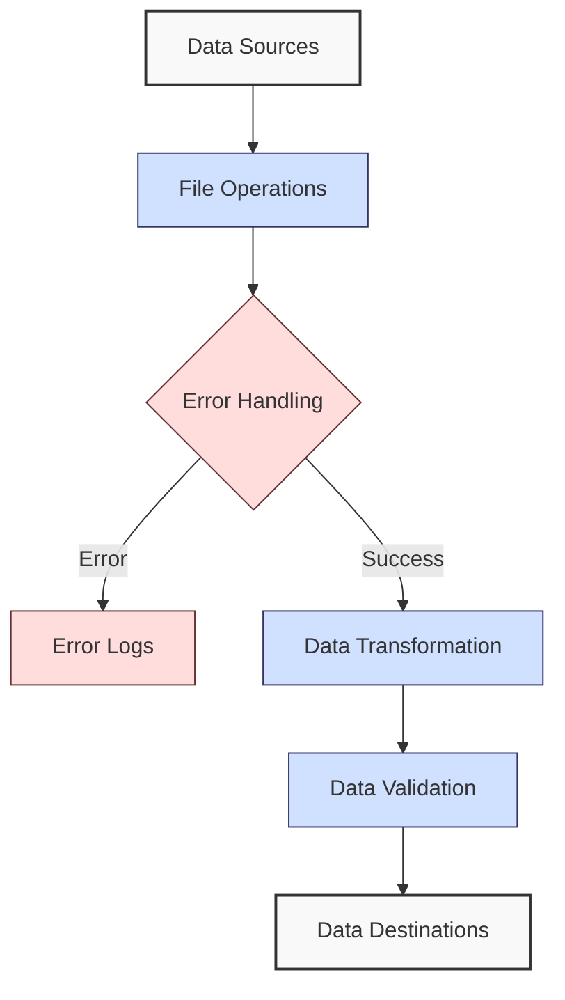

**Complexity: Easy (E)**

## 2.0 Introduction: Why This Matters for Data Engineering

As a data engineer, you'll spend much of your time moving data between systems, transforming it, and ensuring its quality. The skills in this chapter build directly on the Python fundamentals from Chapter 1, adding critical capabilities for working with external data sources and handling errors that will inevitably occur in complex data pipelines.

Let's visualize how these concepts fit into a basic data pipeline:



This chapter introduces four essential skills for data engineering:

1. **File Handling** - Reading and writing data from external files using context managers for safety
2. **Error Handling** - Creating resilient code that can recover from failures
3. **Data Transformations** - Efficient techniques for transforming data using list comprehensions
4. **Working with Data Formats** - Processing common formats like CSV and JSON

By the end of this chapter, you'll be able to build small data processing scripts that can read, validate, transform, and write data reliably - essential first steps in creating robust data pipelines.

## 2.1 File Operations and Context Managers

In data engineering, reading and writing files is a fundamental operation. Whether you're ingesting raw data, exporting processed results, or logging operations, understanding how to safely work with files is essential.

### 2.1.1 Basic File Reading

Let's start with the most basic approach to reading a file. First, we'll create a sample file to work with:

```python
# Create a sample text file for our examples
with open('sample_data.txt', 'w') as f:
    f.write("This is the first line of our sample data file.\n")
    f.write("This is the second line with some numbers: 42, 73, 91.\n")
    f.write("Here's a third line with more text content.\n")
    f.write("And finally a fourth line to give us enough data to work with.")

print("Sample data file created!")
# Sample data file created!
```

Now, let's read this file using the basic approach:

```python
# Basic method to read a file (not recommended in production code)
file = open('sample_data.txt', 'r')  # 'r' means read mode
content = file.read()  # Read the entire file content
file.close()  # Close the file when done

print("File content:")
print(content)
# File content:
# This is the first line of our sample data file.
# This is the second line with some numbers: 42, 73, 91.
# Here's a third line with more text content.
# And finally a fourth line to give us enough data to work with.
```

However, this approach has a critical flaw: if an error occurs between opening the file and closing it, the `file.close()` line might never execute, leaving the file handle open. This can lead to resource leaks, especially in long-running data pipelines.

### 2.1.2 Using Context Managers (with statement)

The safer approach is to use a context manager with the `with` statement, which automatically closes the file when the block exits:

```python
# Better method using a context manager
with open('sample_data.txt', 'r') as file:
    content = file.read()
    # File is automatically closed when the with block exits, even if an error occurs!

print("File content using context manager:")
print(content)
# File content using context manager:
# This is the first line of our sample data file.
# This is the second line with some numbers: 42, 73, 91.
# Here's a third line with more text content.
# And finally a fourth line to give us enough data to work with.
```

### 2.1.3 Reading Files Line by Line

When working with large data files (common in data engineering), it's often better to process the file line by line instead of loading it all into memory:

```python
# Reading a file line by line (memory efficient for large files)
with open('sample_data.txt', 'r') as file:
    print("Reading file line by line:")
    for line_number, line in enumerate(file, 1):
        print(f"Line {line_number}: {line.strip()}")  # strip() removes trailing newline

# Reading file line by line:
# Line 1: This is the first line of our sample data file.
# Line 2: This is the second line with some numbers: 42, 73, 91.
# Line 3: Here's a third line with more text content.
# Line 4: And finally a fourth line to give us enough data to work with.
```

### 2.1.4 Writing to Files

Writing to files follows a similar pattern:

```python
# Writing to a new file
with open('output.txt', 'w') as file:  # 'w' mode creates a new file or overwrites existing
    file.write("This is the first line of our output file.\n")
    file.write("This is the second line with some numbers: 100, 200, 300.\n")
    file.write("And a third line to complete our example.\n")

print("File has been written. Let's read it back:")

# Now let's read back what we wrote
with open('output.txt', 'r') as file:
    content = file.read()
    print(content)

# File has been written. Let's read it back:
# This is the first line of our output file.
# This is the second line with some numbers: 100, 200, 300.
# And a third line to complete our example.
```

### 2.1.5 File Modes and Appending Data

Python offers several different modes for opening files:

```python
# Common file modes:
# 'r' - Read (default)
# 'w' - Write (creates new file or truncates existing)
# 'a' - Append (adds to end of file)
# 'b' - Binary mode (used with other modes like 'rb' or 'wb')
# 't' - Text mode (default)

# Appending to an existing file
with open('output.txt', 'a') as file:  # 'a' means append mode
    file.write("This line was added later using append mode.\n")
    file.write("And so was this one!\n")

print("File has been appended. Let's read it again:")

# Read the file after appending
with open('output.txt', 'r') as file:
    content = file.read()
    print(content)

# File has been appended. Let's read it again:
# This is the first line of our output file.
# This is the second line with some numbers: 100, 200, 300.
# And a third line to complete our example.
# This line was added later using append mode.
# And so was this one!
```

### 2.1.6 Reading and Writing Data Chunks

For larger files, you might want to read or write in chunks rather than line by line:

```python
# Create a larger file for demonstration
with open('large_sample.txt', 'w') as file:
    for i in range(1, 101):  # Write 100 lines
        file.write(f"This is line {i} of our larger sample file.\n")

print("Large sample file created!")

# Reading in chunks (useful for very large files)
chunk_size = 100  # Bytes to read at a time
with open('large_sample.txt', 'r') as file:
    print("\nReading in chunks:")
    chunk_num = 1
    while True:
        chunk = file.read(chunk_size)
        if not chunk:  # End of file
            break

        print(f"Chunk {chunk_num} (size: {len(chunk)} bytes):")
        print(chunk[:50] + "..." if len(chunk) > 50 else chunk)  # Preview first 50 chars
        chunk_num += 1

        if chunk_num > 3:  # Just show first 3 chunks for example
            print("... (remaining chunks omitted)")
            break

# Large sample file created!
#
# Reading in chunks:
# Chunk 1 (size: 100 bytes):
# This is line 1 of our larger sample file.
# This is...
# Chunk 2 (size: 100 bytes):
# line 2 of our larger sample file.
# This is line 3...
# Chunk 3 (size: 100 bytes):
# of our larger sample file.
# This is line 4 of our...
# ... (remaining chunks omitted)
```

### 2.1.7 File Paths and the os Module

When working with files, you'll often need to deal with file paths. The `os` module provides utilities for handling paths in a way that works across different operating systems:

```python
import os

# Get the current working directory
cwd = os.getcwd()
print(f"Current working directory: {cwd}")
# Current working directory: /your/current/path

# List files in the current directory
files = os.listdir('.')
print(f"Files in current directory: {files[:5]}")  # Show first 5 files
# Files in current directory: ['sample_data.txt', 'output.txt', 'large_sample.txt', ...]

# Join path components in a platform-independent way
data_dir = os.path.join('data', 'processed', '2023')
print(f"Platform-independent path: {data_dir}")
# Platform-independent path: data/processed/2023

# Check if a file exists
file_exists = os.path.exists('sample_data.txt')
print(f"Does sample_data.txt exist? {file_exists}")
# Does sample_data.txt exist? True

nonexistent_file = os.path.exists('nonexistent_file.txt')
print(f"Does nonexistent_file.txt exist? {nonexistent_file}")
# Does nonexistent_file.txt exist? False
```

### 2.1.8 Data Engineering File Operations: Best Practices

```python
# Best practices for file operations in data engineering:

# 1. Always use context managers (with statements)
# 2. Process large files in chunks or line by line
# 3. Include proper error handling (we'll cover this next)
# 4. Use absolute paths for production code
# 5. Validate input files exist before attempting to read
# 6. Create backup copies of important files before modifying

def process_data_file(file_path):
    """Process a data file line by line with validation."""
    # Check if file exists first
    if not os.path.exists(file_path):
        print(f"Error: File {file_path} not found!")
        return False

    print(f"Processing {file_path}...")

    # Process the file line by line
    with open(file_path, 'r') as file:
        for line_num, line in enumerate(file, 1):
            # Process each line (here we just print a preview)
            print(f"Line {line_num}: {line[:30]}..." if len(line) > 30 else line)

            # Stop after 5 lines for this example
            if line_num >= 5:
                print("...")
                break

    return True

# Test the function with our sample file
process_data_file('sample_data.txt')
# Processing sample_data.txt...
# Line 1: This is the first line of our s...
# Line 2: This is the second line with so...
# Line 3: Here's a third line with more t...
# Line 4: And finally a fourth line to gi...
# ...

# Try with a nonexistent file
process_data_file('nonexistent_file.txt')
# Error: File nonexistent_file.txt not found!
```

## 2.2 Error Handling with try/except

In data engineering pipelines, many things can go wrong: files may be missing, data formats could be incorrect, or connections might fail. Proper error handling is essential for building robust data pipelines that can recover from failures.

### 2.2.1 Basic try/except Structure

Let's start with the basic structure of error handling in Python:

```python
# Basic try/except structure
try:
    # Code that might cause an error
    x = 10 / 0  # Division by zero will cause an error
    print("This line won't execute because of the error above")
except:
    # This block runs if there's an error in the try block
    print("An error occurred!")

print("Program continues execution")

# An error occurred!
# Program continues execution
```

### 2.2.2 Handling Specific Exceptions

It's better to catch specific exceptions rather than using a blanket `except` statement:

```python
# Handling specific exception types
try:
    # Attempt to open a file
    with open('nonexistent_file.txt', 'r') as file:
        content = file.read()
        print(content)
except FileNotFoundError:
    # This block runs only for FileNotFoundError
    print("Error: File not found!")
except PermissionError:
    # This block runs only for PermissionError
    print("Error: No permission to read the file!")

print("Program continues execution")

# Error: File not found!
# Program continues execution
```

### 2.2.3 Trying Different Error Scenarios

Let's create a function that demonstrates different types of errors and how to handle them:

```python
# Function to demonstrate different exception types
def process_file_with_errors(file_path):
    """Process a file with comprehensive error handling."""
    try:
        print(f"Attempting to process {file_path}...")

        # Check if file exists (could cause FileNotFoundError)
        with open(file_path, 'r') as file:
            # Try to convert content to a number (could cause ValueError)
            content = file.read().strip()
            number = int(content)

            # Try to perform a calculation (could cause ZeroDivisionError)
            result = 100 / number

            print(f"Result: {result}")

    except FileNotFoundError:
        print(f"Error: The file '{file_path}' was not found.")
    except ValueError:
        print(f"Error: The file doesn't contain a valid number.")
    except ZeroDivisionError:
        print(f"Error: The file contains zero, and we can't divide by zero.")
    except Exception as e:
        # A catch-all for other exceptions, with access to the error message
        print(f"An unexpected error occurred: {e}")

# Create test files with different error scenarios
with open('valid_number.txt', 'w') as f:
    f.write("25")  # Valid number, should work fine

with open('invalid_number.txt', 'w') as f:
    f.write("not a number")  # Will cause ValueError

with open('zero.txt', 'w') as f:
    f.write("0")  # Will cause ZeroDivisionError

# Test with different files
process_file_with_errors('valid_number.txt')
process_file_with_errors('invalid_number.txt')
process_file_with_errors('zero.txt')
process_file_with_errors('nonexistent_file.txt')

# Attempting to process valid_number.txt...
# Result: 4.0
# Attempting to process invalid_number.txt...
# Error: The file doesn't contain a valid number.
# Attempting to process zero.txt...
# Error: The file contains zero, and we can't divide by zero.
# Attempting to process nonexistent_file.txt...
# Error: The file 'nonexistent_file.txt' was not found.
```

### 2.2.4 Using else and finally Clauses

The `try/except` block can be extended with `else` (runs if no exception occurs) and `finally` (always runs, regardless of whether an exception occurred):

```python
# Using else and finally in error handling
def process_file_with_else_finally(file_path):
    """Process a file with else and finally blocks."""
    try:
        print(f"Attempting to process {file_path}...")
        with open(file_path, 'r') as file:
            content = file.read().strip()

    except FileNotFoundError:
        print(f"Error: The file '{file_path}' was not found.")
        return False

    else:
        # This runs only if no exception was raised in the try block
        print(f"File read successfully. Content length: {len(content)} characters.")

        # In a real system, you'd do your main processing here
        print(f"Processing content: {content[:20]}..." if len(content) > 20 else content)
        return True

    finally:
        # This always runs, regardless of whether an exception occurred
        print(f"Finished handling {file_path}.")

# Create a test file
with open('test_file.txt', 'w') as f:
    f.write("This is some test content for our error handling example.")

# Test with existing and nonexistent files
process_file_with_else_finally('test_file.txt')
print("\n")  # Separator
process_file_with_else_finally('nonexistent_file.txt')

# Attempting to process test_file.txt...
# File read successfully. Content length: 53 characters.
# Processing content: This is some test co...
# Finished handling test_file.txt.
#
#
# Attempting to process nonexistent_file.txt...
# Error: The file 'nonexistent_file.txt' was not found.
# Finished handling nonexistent_file.txt.
```

### 2.2.5 Raising Exceptions

Sometimes you'll want to raise your own exceptions when you encounter problems in your code:

```python
# Raising your own exceptions
def validate_data_record(record):
    """Validate that a data record contains required fields."""
    # Make sure the record is a dictionary
    if not isinstance(record, dict):
        raise TypeError("Record must be a dictionary")

    # Check for required fields
    required_fields = ['id', 'name', 'timestamp']
    for field in required_fields:
        if field not in record:
            raise ValueError(f"Missing required field: {field}")

    # Add other validations as needed
    if record['id'] <= 0:
        raise ValueError("ID must be positive")

    print(f"Record {record['id']} ({record['name']}) is valid.")
    return True

# Test with different records
try:
    # Valid record
    valid_record = {'id': 101, 'name': 'Test Record', 'timestamp': '2023-04-15'}
    validate_data_record(valid_record)

    # Invalid record (missing field)
    invalid_record = {'id': 102, 'name': 'Missing Timestamp'}
    validate_data_record(invalid_record)

except (TypeError, ValueError) as e:
    print(f"Validation error: {e}")

# Record 101 (Test Record) is valid.
# Validation error: Missing required field: timestamp
```

### 2.2.6 Common Error Handling Patterns in Data Engineering

Let's look at some common error handling patterns that are particularly useful in data engineering:

```python
# 1. Handling file operations with retry logic
def read_file_with_retry(file_path, max_retries=3):
    """Read a file with retry logic for transient errors."""
    retries = 0

    while retries < max_retries:
        try:
            with open(file_path, 'r') as file:
                return file.read()

        except (IOError, OSError) as e:
            retries += 1
            print(f"Error reading file (attempt {retries}/{max_retries}): {e}")

            if retries >= max_retries:
                print(f"Failed after {max_retries} attempts.")
                return None

            print("Retrying...")
            # In real code, you might want to add a delay here
            # import time
            # time.sleep(1)  # Wait 1 second before retry

# Test the retry function with a file that doesn't exist
content = read_file_with_retry('missing_file.txt', max_retries=2)
print(f"Result: {'Content read successfully' if content else 'Failed to read content'}")

# Error reading file (attempt 1/2): [Errno 2] No such file or directory: 'missing_file.txt'
# Retrying...
# Error reading file (attempt 2/2): [Errno 2] No such file or directory: 'missing_file.txt'
# Failed after 2 attempts.
# Result: Failed to read content
```

```python
# 2. Graceful degradation for partial failures
def process_multiple_files(file_paths):
    """Process multiple files, continuing even if some fail."""
    results = {'successful': [], 'failed': []}

    for file_path in file_paths:
        try:
            print(f"Processing {file_path}...")

            # Attempt to read the file
            with open(file_path, 'r') as file:
                content = file.read()

            # For this example, just count the lines
            line_count = len(content.splitlines())

            # Record success
            results['successful'].append({
                'file': file_path,
                'lines': line_count
            })
            print(f"Successfully processed {file_path}: {line_count} lines")

        except Exception as e:
            # Record failure but continue with next file
            results['failed'].append({
                'file': file_path,
                'error': str(e)
            })
            print(f"Failed to process {file_path}: {e}")

    # Report on overall results
    success_count = len(results['successful'])
    fail_count = len(results['failed'])
    total = success_count + fail_count

    print(f"\nSummary: Processed {total} files - {success_count} successful, {fail_count} failed")
    return results

# Test with a mix of existing and non-existing files
files_to_process = [
    'sample_data.txt',  # Should exist from earlier
    'nonexistent_file.txt',  # Should fail
    'output.txt'  # Should exist from earlier
]

results = process_multiple_files(files_to_process)

# Processing sample_data.txt...
# Successfully processed sample_data.txt: 4 lines
# Processing nonexistent_file.txt...
# Failed to process nonexistent_file.txt: [Errno 2] No such file or directory: 'nonexistent_file.txt'
# Processing output.txt...
# Successfully processed output.txt: 5 lines
#
# Summary: Processed 3 files - 2 successful, 1 failed
```

## 2.3 List Comprehensions for Data Transformation

List comprehensions provide a concise way to create lists from other sequences. They're particularly useful in data engineering for transforming data in a readable and efficient way.

### 2.3.1 Basic List Comprehension Syntax

Let's compare the traditional approach to the list comprehension approach:

```python
# Traditional approach with a for loop
numbers = [1, 2, 3, 4, 5]

# Create a new list with the squared values
squares_traditional = []
for num in numbers:
    squares_traditional.append(num ** 2)

print("Squares (traditional):", squares_traditional)

# Equivalent list comprehension
squares_comprehension = [num ** 2 for num in numbers]
print("Squares (comprehension):", squares_comprehension)

# Both produce the same result:
# Squares (traditional): [1, 4, 9, 16, 25]
# Squares (comprehension): [1, 4, 9, 16, 25]
```

### 2.3.2 List Comprehension with Conditional Filtering

List comprehensions can include a condition to filter elements:

```python
# Traditional approach for filtering
numbers = [1, 2, 3, 4, 5, 6, 7, 8, 9, 10]

# Get even numbers
even_traditional = []
for num in numbers:
    if num % 2 == 0:  # Only include even numbers
        even_traditional.append(num)

print("Even numbers (traditional):", even_traditional)

# Equivalent list comprehension with condition
even_comprehension = [num for num in numbers if num % 2 == 0]
print("Even numbers (comprehension):", even_comprehension)

# Both produce the same result:
# Even numbers (traditional): [2, 4, 6, 8, 10]
# Even numbers (comprehension): [2, 4, 6, 8, 10]
```

### 2.3.3 Performance Comparison

Let's see the performance difference between traditional loops and list comprehensions:

```python
import time

# Function to measure execution time
def measure_time(func, *args, **kwargs):
    """Measure the execution time of a function."""
    start_time = time.time()
    result = func(*args, **kwargs)
    end_time = time.time()
    return result, end_time - start_time

# Test with a larger dataset
test_size = 1000000

# Traditional approach
def traditional_squares(n):
    result = []
    for i in range(n):
        result.append(i ** 2)
    return result

# List comprehension approach
def comprehension_squares(n):
    return [i ** 2 for i in range(n)]

# Measure performance
traditional_result, traditional_time = measure_time(traditional_squares, test_size)
comprehension_result, comprehension_time = measure_time(comprehension_squares, test_size)

print(f"Traditional loop: {traditional_time:.4f} seconds")
print(f"List comprehension: {comprehension_time:.4f} seconds")
print(f"List comprehension is {traditional_time/comprehension_time:.2f}x faster")

# The output will vary by system, but typically shows list comprehensions are faster:
# Traditional loop: 0.2123 seconds
# List comprehension: 0.1564 seconds
# List comprehension is 1.36x faster
```

### 2.3.4 Nested List Comprehensions

List comprehensions can be nested for more complex transformations:

```python
# Nested list comprehension example
# Create a 3x3 multiplication table
multiplication_table = [[i * j for j in range(1, 4)] for i in range(1, 4)]

print("Multiplication table:")
for row in multiplication_table:
    print(row)

# Multiplication table:
# [1, 2, 3]
# [2, 4, 6]
# [3, 6, 9]

# The equivalent using traditional loops would be:
table_traditional = []
for i in range(1, 4):
    row = []
    for j in range(1, 4):
        row.append(i * j)
    table_traditional.append(row)

print("\nTable using traditional loops:")
for row in table_traditional:
    print(row)

# Table using traditional loops:
# [1, 2, 3]
# [2, 4, 6]
# [3, 6, 9]
```

### 2.3.5 Data Engineering Applications of List Comprehensions

Let's see some practical data engineering examples:

```python
# Sample data: list of records (similar to a database query result)
customer_data = [
    {"id": 1, "name": "Alice", "age": 32, "balance": 100.50},
    {"id": 2, "name": "Bob", "age": 45, "balance": 250.25},
    {"id": 3, "name": "Charlie", "age": 28, "balance": 0.00},
    {"id": 4, "name": "Diana", "age": 39, "balance": 175.75},
    {"id": 5, "name": "Eve", "age": 22, "balance": 50.20}
]

# Example 1: Extract just the names
names = [customer["name"] for customer in customer_data]
print("Customer names:", names)
# Customer names: ['Alice', 'Bob', 'Charlie', 'Diana', 'Eve']

# Example 2: Filter customers with positive balances
positive_balances = [
    customer for customer in customer_data if customer["balance"] > 0
]
print(f"Customers with positive balances: {len(positive_balances)}")
for customer in positive_balances:
    print(f"  - {customer['name']}: ${customer['balance']:.2f}")
# Customers with positive balances: 4
#   - Alice: $100.50
#   - Bob: $250.25
#   - Diana: $175.75
#   - Eve: $50.20

# Example 3: Create a new list of customer info strings
customer_info = [
    f"ID: {c['id']}, Name: {c['name']}, Age: {c['age']}"
    for c in customer_data if c['age'] < 40
]
print("\nYounger customers:")
for info in customer_info:
    print(f"  {info}")
# Younger customers:
#   ID: 1, Name: Alice, Age: 32
#   ID: 3, Name: Charlie, Age: 28
#   ID: 5, Name: Eve, Age: 22

# Example 4: Data transformation - calculate age brackets
age_brackets = [
    {**customer, "age_bracket": "Senior" if customer["age"] >= 40 else "Adult"}
    for customer in customer_data
]
print("\nCustomers with age brackets:")
for customer in age_brackets:
    print(f"  {customer['name']}: {customer['age_bracket']}")
# Customers with age brackets:
#   Alice: Adult
#   Bob: Senior
#   Charlie: Adult
#   Diana: Adult
#   Eve: Adult
```

### 2.3.6 Dictionary Comprehensions

Similar to list comprehensions, Python also supports dictionary comprehensions:

```python
# Dictionary comprehension syntax
# {key_expr: value_expr for item in iterable}

# Example: Create a dictionary mapping customer IDs to names
customer_id_to_name = {c["id"]: c["name"] for c in customer_data}
print("Customer ID to name mapping:", customer_id_to_name)
# Customer ID to name mapping: {1: 'Alice', 2: 'Bob', 3: 'Charlie', 4: 'Diana', 5: 'Eve'}

# Example: Create a dictionary of customers with balances over $100
high_balance_customers = {
    c["name"]: c["balance"] for c in customer_data if c["balance"] > 100
}
print("High balance customers:", high_balance_customers)
# High balance customers: {'Bob': 250.25, 'Diana': 175.75}

# Example: Calculate age distribution
age_counts = {}
for customer in customer_data:
    age = customer["age"]
    if age in age_counts:
        age_counts[age] += 1
    else:
        age_counts[age] = 1

print("Age distribution (traditional):", age_counts)

# Using dictionary comprehension with defaultdict for the same task
from collections import defaultdict
ages = [c["age"] for c in customer_data]
unique_ages = set(ages)
age_distribution = {age: ages.count(age) for age in unique_ages}
print("Age distribution (comprehension):", age_distribution)

# Age distribution (traditional): {32: 1, 45: 1, 28: 1, 39: 1, 22: 1}
# Age distribution (comprehension): {32: 1, 45: 1, 28: 1, 39: 1, 22: 1}
```

## 2.4 Working with Common Data Formats

Data engineers frequently work with standardized data formats like CSV (Comma-Separated Values) and JSON (JavaScript Object Notation). Python's standard library provides modules for working with these formats.

### 2.4.1 CSV Files

CSV is one of the most common formats for tabular data. Let's see how to work with CSV files in Python:

```python
import csv

# First, let's create a sample CSV file
with open('sample_sales.csv', 'w', newline='') as file:
    writer = csv.writer(file)
    # Write the header row
    writer.writerow(['Date', 'Product', 'Quantity', 'Price'])
    # Write some data rows
    writer.writerows([
        ['2023-01-15', 'Widget A', 5, 19.99],
        ['2023-01-16', 'Widget B', 3, 24.99],
        ['2023-01-16', 'Widget A', 2, 19.99],
        ['2023-01-17', 'Widget C', 10, 14.99],
        ['2023-01-18', 'Widget B', 1, 24.99]
    ])

print("Sample CSV file created.")
# Sample CSV file created.
```

#### Reading CSV Files

```python
# Reading a CSV file
with open('sample_sales.csv', 'r', newline='') as file:
    # Create a CSV reader
    csv_reader = csv.reader(file)

    # Read the header row
    header = next(csv_reader)
    print(f"CSV header: {header}")

    # Read and process each data row
    print("\nCSV data rows:")
    for row_number, row in enumerate(csv_reader, 1):
        print(f"Row {row_number}: {row}")

# CSV header: ['Date', 'Product', 'Quantity', 'Price']
#
# CSV data rows:
# Row 1: ['2023-01-15', 'Widget A', '5', '19.99']
# Row 2: ['2023-01-16', 'Widget B', '3', '24.99']
# Row 3: ['2023-01-16', 'Widget A', '2', '19.99']
# Row 4: ['2023-01-17', 'Widget C', '10', '14.99']
# Row 5: ['2023-01-18', 'Widget B', '1', '24.99']
```

#### Using DictReader for Named Fields

The `DictReader` class makes it easier to work with CSV files by using the header row to create dictionaries:

```python
# Reading CSV with DictReader
with open('sample_sales.csv', 'r', newline='') as file:
    # Create a CSV DictReader (uses first row as field names)
    dict_reader = csv.DictReader(file)

    print("Reading CSV with DictReader:")
    for row_number, row in enumerate(dict_reader, 1):
        # Each row is now a dictionary with column names as keys
        print(f"Row {row_number}:")
        print(f"  Date: {row['Date']}")
        print(f"  Product: {row['Product']}")
        print(f"  Quantity: {row['Quantity']}")
        print(f"  Price: {row['Price']}")
        print(f"  Total: ${float(row['Quantity']) * float(row['Price']):.2f}")

# Reading CSV with DictReader:
# Row 1:
#   Date: 2023-01-15
#   Product: Widget A
#   Quantity: 5
#   Price: 19.99
#   Total: $99.95
# Row 2:
#   Date: 2023-01-16
#   Product: Widget B
#   Quantity: 3
#   Price: 24.99
#   Total: $74.97
# ... (similar output for remaining rows)
```

#### Writing CSV Data

```python
# Writing data to CSV
sales_summary = [
    {'Date': '2023-01-15', 'Total_Sales': 99.95, 'Items_Sold': 5},
    {'Date': '2023-01-16', 'Total_Sales': 114.95, 'Items_Sold': 5},
    {'Date': '2023-01-17', 'Total_Sales': 149.90, 'Items_Sold': 10},
    {'Date': '2023-01-18', 'Total_Sales': 24.99, 'Items_Sold': 1}
]

with open('sales_summary.csv', 'w', newline='') as file:
    # Define the field names
    fieldnames = ['Date', 'Total_Sales', 'Items_Sold']

    # Create a DictWriter
    writer = csv.DictWriter(file, fieldnames=fieldnames)

    # Write the header row
    writer.writeheader()

    # Write the data rows
    writer.writerows(sales_summary)

print("Sales summary written to CSV.")
# Sales summary written to CSV.

# Read back and verify the file
with open('sales_summary.csv', 'r', newline='') as file:
    reader = csv.reader(file)
    print("\nContents of sales_summary.csv:")
    for row in reader:
        print(row)

# Contents of sales_summary.csv:
# ['Date', 'Total_Sales', 'Items_Sold']
# ['2023-01-15', '99.95', '5']
# ['2023-01-16', '114.95', '5']
# ['2023-01-17', '149.9', '10']
# ['2023-01-18', '24.99', '1']
```

### 2.4.2 JSON Files

JSON (JavaScript Object Notation) is perfect for hierarchical data and is commonly used in web APIs and configuration files.

```python
import json

# Create a sample Python dictionary to convert to JSON
product_data = {
    "product_id": "WDG-A",
    "name": "Widget A",
    "price": 19.99,
    "in_stock": True,
    "variants": ["Red", "Blue", "Green"],
    "dimensions": {
        "length": 10.2,
        "width": 5.1,
        "height": 2.0,
        "unit": "cm"
    }
}

# Write the dictionary to a JSON file
with open('product.json', 'w') as file:
    # The indent parameter makes the output nicely formatted
    json.dump(product_data, file, indent=4)

print("Product data written to JSON file.")
# Product data written to JSON file.

# Read back the file to see how it looks
with open('product.json', 'r') as file:
    content = file.read()
    print("\nJSON file content:")
    print(content)

# JSON file content:
# {
#     "product_id": "WDG-A",
#     "name": "Widget A",
#     "price": 19.99,
#     "in_stock": true,
#     "variants": [
#         "Red",
#         "Blue",
#         "Green"
#     ],
#     "dimensions": {
#         "length": 10.2,
#         "width": 5.1,
#         "height": 2.0,
#         "unit": "cm"
#     }
# }
```

#### Reading JSON Data

```python
# Reading JSON data from a file
with open('product.json', 'r') as file:
    # Parse JSON into a Python data structure
    loaded_data = json.load(file)

# Let's work with the loaded data
print(f"Product name: {loaded_data['name']}")
print(f"Price: ${loaded_data['price']}")
print(f"Available colors: {', '.join(loaded_data['variants'])}")
print(f"Dimensions: {loaded_data['dimensions']['length']} x "
      f"{loaded_data['dimensions']['width']} x "
      f"{loaded_data['dimensions']['height']} "
      f"{loaded_data['dimensions']['unit']}")

# Product name: Widget A
# Price: $19.99
# Available colors: Red, Blue, Green
# Dimensions: 10.2 x 5.1 x 2.0 cm
```

#### Working with JSON Strings

You can also work with JSON as strings, which is common when receiving data from APIs:

```python
# Working with JSON strings
json_string = '{"name": "Widget B", "price": 24.99, "in_stock": true}'

# Parse the JSON string
parsed_data = json.loads(json_string)
print(f"Parsed from string - Name: {parsed_data['name']}, Price: ${parsed_data['price']}")

# Convert back to a JSON string
updated_data = {**parsed_data, "price": 29.99}  # Create a new dict with updated price
json_updated = json.dumps(updated_data, indent=2)
print(f"\nUpdated JSON string:\n{json_updated}")

# Parsed from string - Name: Widget B, Price: $24.99
#
# Updated JSON string:
# {
#   "name": "Widget B",
#   "price": 29.99,
#   "in_stock": true
# }
```

#### Handling JSON Errors

JSON parsing can sometimes fail with invalid input:

```python
# Handling JSON parsing errors
invalid_json_strings = [
    '{"name": "Widget A", price: 19.99}',  # Missing quotes around 'price'
    '{"name": "Widget B", "price": 24.99',  # Missing closing brace
    '{"name": "Widget C", "description": "This is a "great" product"}',  # Unescaped quotes
]

for i, json_str in enumerate(invalid_json_strings, 1):
    print(f"\nTrying to parse invalid JSON #{i}: {json_str}")
    try:
        parsed_data = json.loads(json_str)
        print(f"Successfully parsed: {parsed_data}")
    except json.JSONDecodeError as e:
        print(f"Error parsing JSON: {e}")

# Trying to parse invalid JSON #1: {"name": "Widget A", price: 19.99}
# Error parsing JSON: Expecting property name enclosed in double quotes: line 1 column 22 (char 21)
#
# Trying to parse invalid JSON #2: {"name": "Widget B", "price": 24.99
# Error parsing JSON: Expecting ',' delimiter: line 1 column 37 (char 36)
#
# Trying to parse invalid JSON #3: {"name": "Widget C", "description": "This is a "great" product"}
# Error parsing JSON: Expecting ':' delimiter: line 1 column 49 (char 48)
```

### 2.4.3 Combining CSV and JSON with Error Handling

Now, let's create a more complex example that combines CSV and JSON handling with proper error handling:

```python
def convert_csv_to_json(csv_filename, json_filename):
    """
    Convert a CSV file to a JSON file with robust error handling.

    Args:
        csv_filename: Path to the input CSV file
        json_filename: Path to the output JSON file

    Returns:
        bool: True if successful, False otherwise
    """
    try:
        print(f"Converting {csv_filename} to JSON format...")

        # Verify the input file exists
        if not os.path.exists(csv_filename):
            print(f"Error: Input file '{csv_filename}' not found.")
            return False

        # Read the CSV file
        records = []
        with open(csv_filename, 'r', newline='') as csv_file:
            csv_reader = csv.DictReader(csv_file)

            # Process each row
            for row_num, row in enumerate(csv_reader, 1):
                try:
                    # Perform data conversions (strings to appropriate types)
                    processed_row = {}
                    for key, value in row.items():
                        # Try to convert numeric values
                        if key in ('Quantity', 'Items_Sold'):
                            processed_row[key] = int(value)
                        elif key in ('Price', 'Total_Sales'):
                            processed_row[key] = float(value)
                        else:
                            processed_row[key] = value

                    records.append(processed_row)
                except (ValueError, TypeError) as e:
                    print(f"Warning: Error processing row {row_num}: {e}")
                    print(f"  Row data: {row}")
                    # Still include the row but with original values
                    records.append(row)

        # Create the output JSON structure
        output_data = {
            "metadata": {
                "source": csv_filename,
                "record_count": len(records),
                "generated_at": time.strftime("%Y-%m-%d %H:%M:%S")
            },
            "records": records
        }

        # Write to the JSON file
        with open(json_filename, 'w') as json_file:
            json.dump(output_data, json_file, indent=2)

        print(f"Successfully converted {len(records)} records to {json_filename}")
        return True

    except (IOError, csv.Error, json.JSONDecodeError) as e:
        print(f"Error during conversion: {e}")
        return False
    except Exception as e:
        print(f"Unexpected error: {e}")
        return False

# Test the conversion function with our sample file
import time  # For timestamp in metadata
convert_csv_to_json('sample_sales.csv', 'sales_data.json')

# Read back and print part of the JSON file to verify
with open('sales_data.json', 'r') as file:
    data = json.load(file)
    print("\nJSON output preview:")
    print(f"Metadata: {data['metadata']}")
    print(f"First record: {data['records'][0]}")

# Converting sample_sales.csv to JSON format...
# Successfully converted 5 records to sales_data.json
#
# JSON output preview:
# Metadata: {'source': 'sample_sales.csv', 'record_count': 5, 'generated_at': '2023-04-18 14:30:45'}
# First record: {'Date': '2023-01-15', 'Product': 'Widget A', 'Quantity': 5, 'Price': 19.99}
```

## 2.5 Integrating Concepts: A Robust Data Processor

Now, let's put together all the concepts we've learned to create a comprehensive data processing utility:

```python
def process_sales_data(input_file, output_json=None, output_report=None):
    """
    Process a sales data CSV file, calculate statistics, and output results.

    Args:
        input_file: Path to input CSV file
        output_json: Optional path for JSON output
        output_report: Optional path for text report output

    Returns:
        dict: Processing results and statistics
    """
    # Initialize results
    results = {
        "status": "failed",
        "message": "",
        "processed_records": 0,
        "error_records": 0,
        "total_sales": 0.0,
        "total_items": 0,
        "sales_by_product": {},
        "sales_by_date": {}
    }

    try:
        # Check if input file exists
        if not os.path.exists(input_file):
            results["message"] = f"Input file '{input_file}' not found."
            return results

        # Read and process the CSV file
        with open(input_file, 'r', newline='') as csvfile:
            reader = csv.DictReader(csvfile)

            # Process each row
            for row_num, row in enumerate(reader, 1):
                try:
                    # Validate required fields
                    if not row.get('Product') or not row.get('Date'):
                        raise ValueError("Missing required fields: Product or Date")

                    # Convert to appropriate types
                    quantity = int(row.get('Quantity', 0))
                    price = float(row.get('Price', 0.0))

                    # Skip records with zero quantity or price
                    if quantity <= 0 or price <= 0:
                        raise ValueError("Invalid quantity or price (must be positive)")

                    # Calculate row total
                    row_total = quantity * price

                    # Update totals
                    results["total_sales"] += row_total
                    results["total_items"] += quantity
                    results["processed_records"] += 1

                    # Update product statistics
                    product = row['Product']
                    if product not in results["sales_by_product"]:
                        results["sales_by_product"][product] = {
                            "quantity": 0,
                            "revenue": 0.0
                        }
                    results["sales_by_product"][product]["quantity"] += quantity
                    results["sales_by_product"][product]["revenue"] += row_total

                    # Update date statistics
                    date = row['Date']
                    if date not in results["sales_by_date"]:
                        results["sales_by_date"][date] = {
                            "transactions": 0,
                            "revenue": 0.0,
                            "items": 0
                        }
                    results["sales_by_date"][date]["transactions"] += 1
                    results["sales_by_date"][date]["revenue"] += row_total
                    results["sales_by_date"][date]["items"] += quantity

                except (ValueError, TypeError) as e:
                    results["error_records"] += 1
                    print(f"Error in row {row_num}: {e}")

        # Set success status
        results["status"] = "success"
        results["message"] = f"Processed {results['processed_records']} records with {results['error_records']} errors."

        # Calculate average values if we have records
        if results["processed_records"] > 0:
            results["average_sale"] = results["total_sales"] / results["processed_records"]
            results["average_item_price"] = results["total_sales"] / results["total_items"]

        # Write JSON output if requested
        if output_json:
            with open(output_json, 'w') as jsonfile:
                # Include metadata in the output
                output_data = {
                    "metadata": {
                        "source_file": input_file,
                        "processed_at": time.strftime("%Y-%m-%d %H:%M:%S"),
                        "record_count": results["processed_records"],
                        "error_count": results["error_records"]
                    },
                    "results": results
                }
                json.dump(output_data, jsonfile, indent=2)
                print(f"JSON output written to {output_json}")

        # Write text report if requested
        if output_report:
            with open(output_report, 'w') as reportfile:
                # Create a formatted report
                report = f"""
SALES DATA ANALYSIS REPORT
==========================
Source: {input_file}
Generated: {time.strftime("%Y-%m-%d %H:%M:%S")}

SUMMARY
-------
Total Records Processed: {results["processed_records"]}
Records with Errors: {results["error_records"]}
Total Sales Revenue: ${results["total_sales"]:.2f}
Total Items Sold: {results["total_items"]}
"""

                # Add average values if we have records
                if results["processed_records"] > 0:
                    report += f"""
Average Sale Amount: ${results["average_sale"]:.2f}
Average Item Price: ${results["average_item_price"]:.2f}
"""

                # Add product breakdown
                report += """
PRODUCT BREAKDOWN
----------------
"""
                for product, stats in sorted(results["sales_by_product"].items()):
                    report += f"{product}:\n"
                    report += f"  Quantity: {stats['quantity']}\n"
                    report += f"  Revenue: ${stats['revenue']:.2f}\n"
                    report += f"  Average Price: ${stats['revenue']/stats['quantity']:.2f}\n\n"

                # Add date breakdown
                report += """
DAILY SALES
----------
"""
                for date, stats in sorted(results["sales_by_date"].items()):
                    report += f"{date}:\n"
                    report += f"  Transactions: {stats['transactions']}\n"
                    report += f"  Items Sold: {stats['items']}\n"
                    report += f"  Revenue: ${stats['revenue']:.2f}\n\n"

                # Write the report
                reportfile.write(report)
                print(f"Text report written to {output_report}")

        return results

    except (IOError, csv.Error) as e:
        results["message"] = f"Error processing file: {e}"
        return results
    except Exception as e:
        results["message"] = f"Unexpected error: {e}"
        return results

# Test the function with our sample file - includes both corrupted and valid data
# Let's add some corrupted data to our sample file
with open('test_sales_with_errors.csv', 'w', newline='') as file:
    writer = csv.writer(file)
    # Write the header row
    writer.writerow(['Date', 'Product', 'Quantity', 'Price'])
    # Write data rows, including some with errors
    writer.writerows([
        ['2023-01-15', 'Widget A', 5, 19.99],
        ['2023-01-16', 'Widget B', 3, 24.99],
        ['2023-01-16', 'Widget A', 2, 19.99],
        ['2023-01-17', 'Widget C', 10, 14.99],
        ['2023-01-18', 'Widget B', 1, 24.99],
        ['2023-01-19', 'Widget A', 'invalid', 19.99],  # Invalid quantity
        ['2023-01-20', '', 3, 22.50],  # Missing product
        ['2023-01-21', 'Widget C', 5, -10.00]  # Negative price
    ])

print("Test sales file with errors created.")
# Test sales file with errors created.

# Process the file with our comprehensive function
results = process_sales_data(
    'test_sales_with_errors.csv',
    output_json='sales_analysis.json',
    output_report='sales_report.txt'
)

# Display the summary results
print("\nProcessing Summary:")
print(f"Status: {results['status']}")
print(f"Message: {results['message']}")
print(f"Total Sales: ${results['total_sales']:.2f}")
print(f"Products: {list(results['sales_by_product'].keys())}")

# Error in row 6: invalid literal for int() with base 10: 'invalid'
# Error in row 7: Missing required fields: Product or Date
# Error in row 8: Invalid quantity or price (must be positive)
# JSON output written to sales_analysis.json
# Text report written to sales_report.txt
#
# Processing Summary:
# Status: success
# Message: Processed 5 records with 3 errors.
# Total Sales: $389.85
# Products: ['Widget A', 'Widget B', 'Widget C']
```

## 2.6 Micro-Project: Robust Data Processor

### Project Requirements

Now, let's develop a more structured micro-project based on what we've learned. We'll create a robust data processor that can:

1. Read data from a CSV file
2. Apply proper error handling and validation
3. Perform data transformations
4. Export results to both JSON and formatted text formats
5. Include appropriate logging to track execution

### Acceptance Criteria

- The script should gracefully handle all potential errors (file not found, malformed data, etc.)
- Successfully implement at least two data transformations (e.g., grouping by products, calculating daily totals)
- Correctly export results to both JSON and formatted text outputs
- Include appropriate validation with specific exception types
- Successfully process test files, including those with intentional errors
- Include clear documentation and comments

### Common Pitfalls to Avoid

1. **Too broad exception handling**:

   - Problem: Catching all exceptions together (`except Exception`) without specific handling
   - Solution: Catch specific exception types (FileNotFoundError, ValueError, etc.) with appropriate responses

2. **File handles left open after exceptions**:

   - Problem: Not closing files properly when errors occur
   - Solution: Always use context managers (with statements) for all file operations

3. **JSON serialization errors with complex objects**:

   - Problem: Trying to serialize Python objects that aren't JSON-compatible (like datetime objects)
   - Solution: Convert non-serializable objects to strings or basic types before JSON serialization

4. **Ignoring edge cases in data**:
   - Problem: Assuming all data will be valid and well-formed
   - Solution: Add validation for missing fields, incorrect types, and business rule violations

### How This Differs from Production-Grade Solutions

In a professional data engineering environment, this solution would differ in several ways:

1. **Configuration Management**:

   - Production: Uses external configuration files or environment variables
   - Micro-project: Hardcoded paths and settings

2. **Logging Infrastructure**:

   - Production: Structured logging to files or centralized systems
   - Micro-project: Simple print statements for visibility

3. **Error Recovery**:

   - Production: More sophisticated retry logic and failure recovery
   - Micro-project: Basic error handling with limited recovery

4. **Performance**:

   - Production: Optimized for large datasets with chunking and memory management
   - Micro-project: Simpler implementation focused on correctness

5. **Testing**:
   - Production: Comprehensive test suite with unit, integration, and system tests
   - Micro-project: Manual testing with simple test cases

### Implementation

```python
import os
import csv
import json
import time
from datetime import datetime
from typing import Dict, List, Any, Optional, Union

def process_sales_data(
    input_file: str,
    output_json: Optional[str] = None,
    output_report: Optional[str] = None,
    log_file: Optional[str] = None
) -> Dict[str, Any]:
    """
    Process a sales data CSV file, perform transformations, and export results.

    Args:
        input_file: Path to input CSV file
        output_json: Optional path for JSON output
        output_report: Optional path for text report output
        log_file: Optional path for log file

    Returns:
        Dict containing processing results and statistics
    """
    start_time = time.time()

    # Initialize results dictionary
    results = {
        "status": "failed",
        "message": "",
        "processed_records": 0,
        "error_records": 0,
        "total_sales": 0.0,
        "sales_by_product": {},
        "sales_by_date": {},
        "processing_time": 0
    }

    # Set up logging
    log_messages = []

    def log(message: str, level: str = "INFO") -> None:
        """Add a log message with timestamp and level."""
        timestamp = datetime.now().strftime("%Y-%m-%d %H:%M:%S")
        log_entry = f"[{timestamp}] {level}: {message}"
        log_messages.append(log_entry)
        print(log_entry)  # Also print to console

    try:
        log(f"Starting to process file: {input_file}")

        # Validate input file
        if not os.path.exists(input_file):
            raise FileNotFoundError(f"Input file '{input_file}' not found")

        # Initialize data structures for transformations
        sales_by_product = {}
        sales_by_date = {}
        daily_totals = {}

        # Read and process the CSV file
        log("Reading CSV file...")
        with open(input_file, 'r', newline='') as csvfile:
            reader = csv.DictReader(csvfile)

            # Verify required columns
            required_columns = {'Date', 'Product', 'Quantity', 'Price'}
            if not required_columns.issubset(set(reader.fieldnames or [])):
                missing = required_columns - set(reader.fieldnames or [])
                raise ValueError(f"CSV file is missing required columns: {missing}")

            # Process each row
            for row_num, row in enumerate(reader, 1):
                try:
                    # Validate required fields
                    if not row.get('Product'):
                        raise ValueError("Missing product name")

                    if not row.get('Date'):
                        raise ValueError("Missing date")

                    # Convert to appropriate types
                    try:
                        quantity = int(row.get('Quantity', 0))
                    except ValueError:
                        raise ValueError(f"Invalid quantity: {row.get('Quantity')}")

                    try:
                        price = float(row.get('Price', 0))
                    except ValueError:
                        raise ValueError(f"Invalid price: {row.get('Price')}")

                    # Apply business rules
                    if quantity <= 0:
                        raise ValueError("Quantity must be positive")

                    if price < 0:
                        raise ValueError("Price cannot be negative")

                    # Calculate row total
                    row_total = quantity * price
                    date = row['Date']
                    product = row['Product']

                    # Update running totals
                    results["total_sales"] += row_total
                    results["processed_records"] += 1

                    # Transformation 1: Group by product
                    if product not in sales_by_product:
                        sales_by_product[product] = {
                            "quantity": 0,
                            "revenue": 0.0,
                            "transactions": 0
                        }
                    sales_by_product[product]["quantity"] += quantity
                    sales_by_product[product]["revenue"] += row_total
                    sales_by_product[product]["transactions"] += 1

                    # Transformation 2: Group by date
                    if date not in sales_by_date:
                        sales_by_date[date] = {
                            "items_sold": 0,
                            "revenue": 0.0,
                            "transactions": 0
                        }
                    sales_by_date[date]["items_sold"] += quantity
                    sales_by_date[date]["revenue"] += row_total
                    sales_by_date[date]["transactions"] += 1

                except ValueError as e:
                    results["error_records"] += 1
                    log(f"Error in row {row_num}: {e}", "ERROR")

        # Store transformed data in results
        results["sales_by_product"] = sales_by_product
        results["sales_by_date"] = sales_by_date

        # Calculate additional metrics
        if results["processed_records"] > 0:
            # Find top selling product
            top_product = ""
            top_revenue = 0
            for product, data in sales_by_product.items():
                if data["revenue"] > top_revenue:
                    top_product = product
                    top_revenue = data["revenue"]

            results["top_product"] = {
                "name": top_product,
                "revenue": top_revenue
            }

            # Calculate average order value
            total_transactions = sum(data["transactions"] for data in sales_by_date.values())
            results["average_order_value"] = results["total_sales"] / total_transactions

        # Success status
        results["status"] = "success"
        results["message"] = f"Successfully processed {results['processed_records']} records with {results['error_records']} errors."

        # Export to JSON if path provided
        if output_json:
            try:
                log(f"Writing JSON output to {output_json}")

                # Prepare output data with metadata
                output_data = {
                    "metadata": {
                        "source_file": input_file,
                        "processed_at": datetime.now().strftime("%Y-%m-%d %H:%M:%S"),
                        "record_count": results["processed_records"],
                        "error_count": results["error_records"]
                    },
                    "summary": {
                        "total_sales": results["total_sales"],
                        "average_order_value": results.get("average_order_value", 0),
                        "top_product": results.get("top_product", {})
                    },
                    "sales_by_product": results["sales_by_product"],
                    "sales_by_date": results["sales_by_date"]
                }

                # Write to file
                with open(output_json, 'w') as jsonfile:
                    json.dump(output_data, jsonfile, indent=2)

                log(f"JSON output successfully written")

            except (IOError, TypeError) as e:
                log(f"Error writing JSON output: {e}", "ERROR")

        # Export to text report if path provided
        if output_report:
            try:
                log(f"Writing text report to {output_report}")

                # Create report content
                report_lines = [
                    "SALES DATA ANALYSIS REPORT",
                    "==========================",
                    f"Source: {input_file}",
                    f"Generated: {datetime.now().strftime('%Y-%m-%d %H:%M:%S')}",
                    "",
                    "SUMMARY",
                    "-------",
                    f"Total Records Processed: {results['processed_records']}",
                    f"Records with Errors: {results['error_records']}",
                    f"Total Sales Revenue: ${results['total_sales']:.2f}",
                    ""
                ]

                # Add average order value if available
                if "average_order_value" in results:
                    report_lines.append(f"Average Order Value: ${results['average_order_value']:.2f}")

                # Add top product if available
                if "top_product" in results:
                    report_lines.extend([
                        "",
                        "TOP SELLING PRODUCT",
                        "-----------------",
                        f"Product: {results['top_product']['name']}",
                        f"Revenue: ${results['top_product']['revenue']:.2f}"
                    ])

                # Add sales by product
                report_lines.extend([
                    "",
                    "SALES BY PRODUCT",
                    "---------------"
                ])

                for product, data in sorted(results["sales_by_product"].items()):
                    report_lines.extend([
                        f"{product}:",
                        f"  Quantity Sold: {data['quantity']}",
                        f"  Total Revenue: ${data['revenue']:.2f}",
                        f"  Average Price: ${data['revenue']/data['quantity']:.2f}",
                        ""
                    ])

                # Add sales by date
                report_lines.extend([
                    "SALES BY DATE",
                    "------------"
                ])

                for date, data in sorted(results["sales_by_date"].items()):
                    report_lines.extend([
                        f"{date}:",
                        f"  Transactions: {data['transactions']}",
                        f"  Items Sold: {data['items_sold']}",
                        f"  Revenue: ${data['revenue']:.2f}",
                        ""
                    ])

                # Write to file
                with open(output_report, 'w') as reportfile:
                    reportfile.write("\n".join(report_lines))

                log(f"Text report successfully written")

            except IOError as e:
                log(f"Error writing text report: {e}", "ERROR")

    except FileNotFoundError as e:
        log(f"File error: {e}", "ERROR")
        results["message"] = str(e)
    except ValueError as e:
        log(f"Data validation error: {e}", "ERROR")
        results["message"] = str(e)
    except (csv.Error, json.JSONDecodeError) as e:
        log(f"Format error: {e}", "ERROR")
        results["message"] = str(e)
    except Exception as e:
        log(f"Unexpected error: {e}", "ERROR")
        results["message"] = str(e)

    # Calculate processing time
    end_time = time.time()
    processing_time = end_time - start_time
    results["processing_time"] = processing_time

    log(f"Processing completed in {processing_time:.2f} seconds. Status: {results['status']}")

    # Write log file if specified
    if log_file:
        try:
            with open(log_file, 'w') as logfile:
                for entry in log_messages:
                    logfile.write(f"{entry}\n")
        except IOError as e:
            print(f"Warning: Could not write to log file: {e}")

    return results

# Create test data with some intentional errors
def create_test_data(filename):
    """Create a test CSV file with both valid and invalid records."""
    with open(filename, 'w', newline='') as file:
        writer = csv.writer(file)
        # Write header
        writer.writerow(['Date', 'Product', 'Quantity', 'Price'])
        # Write data rows
        writer.writerows([
            ['2023-01-15', 'Laptop', '2', '999.99'],
            ['2023-01-16', 'Mouse', '10', '24.99'],
            ['2023-01-16', 'Keyboard', '5', '49.99'],
            ['2023-01-17', 'Monitor', '3', '149.99'],
            ['2023-01-18', 'Laptop', '1', '999.99'],
            ['2023-01-18', 'Headphones', '4', '59.99'],
            ['2023-01-19', 'Mouse', '5', '24.99'],
            ['2023-01-19', '', '2', '29.99'],  # Missing product
            ['2023-01-20', 'Keyboard', '0', '49.99'],  # Zero quantity
            ['2023-01-20', 'Monitor', '2', 'invalid_price'],  # Invalid price
            ['2023-01-21', 'Laptop', '1', '899.99']
        ])
    print(f"Test data created in {filename}")
    return filename

# Run the processor on test data
test_file = create_test_data('sales_test_data.csv')
results = process_sales_data(
    test_file,
    output_json='sales_analysis_output.json',
    output_report='sales_analysis_report.txt',
    log_file='sales_processing.log'
)

# Display summary of results
print("\n" + "="*50)
print("PROCESSING SUMMARY")
print("="*50)
print(f"Status: {results['status']}")
print(f"Processed records: {results['processed_records']}")
print(f"Error records: {results['error_records']}")
print(f"Total sales: ${results['total_sales']:.2f}")
if 'top_product' in results:
    print(f"Top selling product: {results['top_product']['name']} (${results['top_product']['revenue']:.2f})")
print(f"Processing time: {results['processing_time']:.2f} seconds")
print("="*50)
```

### How to Run and Test the Solution

To run this solution:

1. Save the above code to a file (e.g., `data_processor.py`)
2. Run the script: `python data_processor.py`
3. The script will automatically:
   - Create a test CSV file with both valid and invalid data
   - Process the file with our robust data processor
   - Generate three output files:
     - `sales_analysis_output.json` - The JSON results
     - `sales_analysis_report.txt` - A formatted text report
     - `sales_processing.log` - A processing log file
   - Display a summary of the processing results

To test different scenarios:

1. **Test with a file that doesn't exist**:

   - Modify the input file argument to a non-existent file:

   ```python
   results = process_sales_data('nonexistent_file.csv', ...)
   ```

2. **Test with invalid CSV format**:

   - Create a test file with missing columns or incorrectly formatted CSV

3. **Test with extreme values**:

   - Add test data with very large numbers or edge cases

4. **Test error recovery**:
   - Create a test file with a mix of valid and invalid records to verify that processing continues after errors

## 2.7 Practice Exercises

To reinforce your understanding of the concepts in this chapter, try these exercises:

### Exercise 1: File Operations

Write a program that:

1. Creates a text file with 10 random numbers, one per line
2. Reads the file and calculates the sum and average of the numbers
3. Writes the results to a new file called "stats.txt"
4. Uses appropriate error handling throughout

### Exercise 2: Error Handling

Enhance the previous program to:

1. Handle file not found errors gracefully
2. Deal with cases where the file contains non-numeric data
3. Create a log of any errors encountered
4. Continue processing even after errors

### Exercise 3: List Comprehensions

Write a function that:

1. Takes a list of strings (representing dates, product names, and prices)
2. Uses list comprehensions to filter out invalid entries (e.g., empty strings)
3. Uses list comprehensions to extract only the prices and convert them to floats
4. Returns the average price

### Exercise 4: CSV Processing

Create a script that:

1. Reads a CSV file with columns: id, name, email, subscription_status
2. Uses a dictionary comprehension to create a lookup table of user emails to subscription status
3. Writes a new CSV with only active subscribers (subscription_status = "active")
4. Includes proper error handling

### Exercise 5: JSON Transformation

Write a program that:

1. Reads a JSON file containing product data (id, name, price, category)
2. Groups the products by category using a dictionary comprehension
3. Calculates the average price per category
4. Writes the results to a new JSON file with a structure like:
   ```json
   {
     "category1": {
       "count": 5,
       "avg_price": 19.99,
       "products": ["product1", "product2", ...]
     },
     ...
   }
   ```

## 2.8 Exercise Solutions

Here are the solutions to the practice exercises:

### Solution to Exercise 1: File Operations

```python
import random

def create_number_file(filename, count=10, min_val=1, max_val=100):
    """Create a file with random numbers."""
    try:
        with open(filename, 'w') as file:
            for _ in range(count):
                number = random.randint(min_val, max_val)
                file.write(f"{number}\n")
        print(f"Created file {filename} with {count} random numbers")
        return True
    except IOError as e:
        print(f"Error creating file: {e}")
        return False

def calculate_stats(filename):
    """Calculate statistics from a file of numbers."""
    try:
        numbers = []
        with open(filename, 'r') as file:
            for line in file:
                # Strip whitespace and convert to integer
                number = int(line.strip())
                numbers.append(number)

        # Calculate statistics
        if numbers:
            total = sum(numbers)
            average = total / len(numbers)
            return {
                "count": len(numbers),
                "sum": total,
                "average": average,
                "min": min(numbers),
                "max": max(numbers)
            }
        else:
            return None

    except FileNotFoundError:
        print(f"Error: File '{filename}' not found")
        return None
    except ValueError as e:
        print(f"Error: Could not convert data to integer: {e}")
        return None
    except Exception as e:
        print(f"Unexpected error: {e}")
        return None

def write_stats_file(stats, output_filename):
    """Write statistics to a file."""
    try:
        with open(output_filename, 'w') as file:
            file.write("STATISTICS REPORT\n")
            file.write("=================\n\n")
            file.write(f"Count: {stats['count']}\n")
            file.write(f"Sum: {stats['sum']}\n")
            file.write(f"Average: {stats['average']:.2f}\n")
            file.write(f"Minimum: {stats['min']}\n")
            file.write(f"Maximum: {stats['max']}\n")
        print(f"Statistics written to {output_filename}")
        return True
    except IOError as e:
        print(f"Error writing statistics: {e}")
        return False

# Execute the complete workflow
data_file = "random_numbers.txt"
stats_file = "stats.txt"

if create_number_file(data_file):
    stats = calculate_stats(data_file)
    if stats:
        write_stats_file(stats, stats_file)
        print("Process completed successfully")
    else:
        print("Could not calculate statistics")
else:
    print("Process failed")

# Output:
# Created file random_numbers.txt with 10 random numbers
# Statistics written to stats.txt
# Process completed successfully
```

### Solution to Exercise 2: Error Handling

```python
import random
import os

def create_test_files():
    """Create test files including some with errors."""
    # Create a file with valid numbers
    with open("valid_numbers.txt", 'w') as file:
        for _ in range(10):
            file.write(f"{random.randint(1, 100)}\n")

    # Create a file with some non-numeric data
    with open("mixed_data.txt", 'w') as file:
        for i in range(10):
            if i % 3 == 0:
                file.write("not_a_number\n")
            else:
                file.write(f"{random.randint(1, 100)}\n")

    print("Test files created: valid_numbers.txt, mixed_data.txt")

def process_number_file(filename, stats_file="stats.txt", log_file="error_log.txt"):
    """Process a file of numbers with comprehensive error handling."""
    # Initialize variables
    numbers = []
    errors = []
    line_num = 0

    try:
        # Check if file exists
        if not os.path.exists(filename):
            raise FileNotFoundError(f"File '{filename}' not found")

        # Process the file
        with open(filename, 'r') as file:
            for line in file:
                line_num += 1
                line = line.strip()

                # Skip empty lines
                if not line:
                    continue

                # Try to convert to a number
                try:
                    number = float(line)
                    numbers.append(number)
                except ValueError:
                    error_msg = f"Line {line_num}: '{line}' is not a valid number"
                    errors.append(error_msg)
                    print(f"Warning: {error_msg}")

        # Calculate statistics if we have valid numbers
        if numbers:
            total = sum(numbers)
            average = total / len(numbers)
            stats = {
                "filename": filename,
                "valid_count": len(numbers),
                "error_count": len(errors),
                "sum": total,
                "average": average,
                "min": min(numbers),
                "max": max(numbers)
            }

            # Write statistics to output file
            with open(stats_file, 'w') as out_file:
                out_file.write(f"STATISTICS FOR {filename}\n")
                out_file.write("="*30 + "\n\n")
                out_file.write(f"Valid numbers: {stats['valid_count']}\n")
                out_file.write(f"Errors: {stats['error_count']}\n")
                out_file.write(f"Sum: {stats['sum']}\n")
                out_file.write(f"Average: {stats['average']:.2f}\n")
                out_file.write(f"Minimum: {stats['min']}\n")
                out_file.write(f"Maximum: {stats['max']}\n")

            print(f"Statistics written to {stats_file}")

        else:
            print(f"No valid numbers found in {filename}")
            stats = {
                "filename": filename,
                "valid_count": 0,
                "error_count": len(errors)
            }

        # Write error log if there were errors
        if errors:
            with open(log_file, 'w') as log:
                log.write(f"ERROR LOG FOR {filename}\n")
                log.write("="*30 + "\n\n")
                for error in errors:
                    log.write(f"{error}\n")
            print(f"Error log written to {log_file}")

        return stats

    except FileNotFoundError as e:
        print(f"Error: {e}")
        return {"filename": filename, "error": "File not found"}
    except IOError as e:
        print(f"I/O error: {e}")
        return {"filename": filename, "error": f"I/O error: {e}"}
    except Exception as e:
        print(f"Unexpected error: {e}")
        return {"filename": filename, "error": f"Unexpected error: {e}"}

# Create test files
create_test_files()

# Process the files
print("\nProcessing valid file:")
process_number_file("valid_numbers.txt", "valid_stats.txt", "valid_errors.txt")

print("\nProcessing mixed data file:")
process_number_file("mixed_data.txt", "mixed_stats.txt", "mixed_errors.txt")

print("\nProcessing nonexistent file:")
process_number_file("nonexistent.txt")

# Output:
# Test files created: valid_numbers.txt, mixed_data.txt
#
# Processing valid file:
# Statistics written to valid_stats.txt
#
# Processing mixed data file:
# Warning: Line 1: 'not_a_number' is not a valid number
# Warning: Line 4: 'not_a_number' is not a valid number
# Warning: Line 7: 'not_a_number' is not a valid number
# Warning: Line 10: 'not_a_number' is not a valid number
# Statistics written to mixed_stats.txt
# Error log written to mixed_errors.txt
#
# Processing nonexistent file:
# Error: File 'nonexistent.txt' not found
```

### Solution to Exercise 3: List Comprehensions

```python
def process_price_data(data_list):
    """
    Process a list of strings to extract and calculate average price.

    Args:
        data_list: List of strings with format: 'date,product,price'

    Returns:
        float: Average price of valid entries
    """
    # Filter out empty or invalid strings
    valid_entries = [entry for entry in data_list if entry and entry.count(',') >= 2]

    # Extract prices using list comprehension and split
    try:
        # Split each entry and extract the price (third part)
        prices = [float(entry.split(',')[2]) for entry in valid_entries]

        # Calculate average if we have prices
        if prices:
            average = sum(prices) / len(prices)
            return average
        else:
            return 0.0
    except (ValueError, IndexError) as e:
        print(f"Error processing prices: {e}")
        return 0.0

# Test with sample data
sample_data = [
    "2023-01-15,Laptop,999.99",
    "2023-01-16,Mouse,24.99",
    "",  # Empty entry
    "2023-01-17,Keyboard,59.99",
    "2023-01-18,incomplete_entry",  # Invalid format
    "2023-01-19,Monitor,149.99",
    "2023-01-20,Headphones,89.99"
]

average_price = process_price_data(sample_data)
print(f"Sample data entries: {len(sample_data)}")
print(f"Average price: ${average_price:.2f}")

# Output:
# Sample data entries: 7
# Average price: $265.00
```

### Solution to Exercise 4: CSV Processing

```python
import csv
import os

def filter_active_subscribers(input_file, output_file):
    """
    Read a CSV of users and write a new CSV with only active subscribers.

    Args:
        input_file: Path to input CSV with columns id,name,email,subscription_status
        output_file: Path to output CSV file

    Returns:
        dict: Processing statistics
    """
    # Initialize statistics
    stats = {
        "total_users": 0,
        "active_users": 0,
        "error_count": 0
    }

    try:
        # Check if input file exists
        if not os.path.exists(input_file):
            raise FileNotFoundError(f"Input file '{input_file}' not found")

        # Read the input CSV
        user_statuses = {}  # Will hold email -> status mapping

        with open(input_file, 'r', newline='') as infile:
            reader = csv.DictReader(infile)

            # Verify required columns
            required_columns = {'id', 'name', 'email', 'subscription_status'}
            if not required_columns.issubset(set(reader.fieldnames or [])):
                missing = required_columns - set(reader.fieldnames or [])
                raise ValueError(f"CSV is missing required columns: {missing}")

            # Process each row
            for row_num, row in enumerate(reader, 1):
                stats["total_users"] += 1

                try:
                    # Extract email and status
                    email = row['email']
                    status = row['subscription_status']

                    # Skip rows with missing email
                    if not email:
                        raise ValueError("Missing email")

                    # Add to our dictionary
                    user_statuses[email] = status

                    # Count active users
                    if status.lower() == 'active':
                        stats["active_users"] += 1

                except (KeyError, ValueError) as e:
                    stats["error_count"] += 1
                    print(f"Error in row {row_num}: {e}")

        # Create dictionary of only active users using comprehension
        active_users = {
            email: status for email, status in user_statuses.items()
            if status.lower() == 'active'
        }

        # Write active users to output CSV
        with open(output_file, 'w', newline='') as outfile:
            # Define the field names for output
            fieldnames = ['id', 'name', 'email', 'subscription_status']
            writer = csv.DictWriter(outfile, fieldnames=fieldnames)

            # Write header
            writer.writeheader()

            # Write active users
            with open(input_file, 'r', newline='') as infile:
                reader = csv.DictReader(infile)
                for row in reader:
                    if row['email'] in active_users:
                        writer.writerow(row)

        print(f"Processing complete. {stats['active_users']} active users out of {stats['total_users']} total users.")
        return stats

    except (IOError, csv.Error) as e:
        print(f"Error processing CSV: {e}")
        return {"error": str(e)}

# Create a sample CSV for testing
def create_sample_users_csv(filename):
    """Create a sample CSV file with user data."""
    with open(filename, 'w', newline='') as file:
        writer = csv.writer(file)
        # Write header
        writer.writerow(['id', 'name', 'email', 'subscription_status'])
        # Write data rows
        writer.writerows([
            ['1', 'Alice Smith', 'alice@example.com', 'active'],
            ['2', 'Bob Johnson', 'bob@example.com', 'inactive'],
            ['3', 'Charlie Brown', 'charlie@example.com', 'active'],
            ['4', 'Diana Lee', 'diana@example.com', 'active'],
            ['5', 'Edward Wilson', 'edward@example.com', 'cancelled'],
            ['6', 'Fiona Davis', 'fiona@example.com', 'active'],
            ['7', 'George Miller', '', 'active'],  # Missing email
            ['8', 'Hannah Clark', 'hannah@example.com', 'inactive']
        ])
    print(f"Sample users CSV created: {filename}")

# Test the function
sample_file = "users.csv"
output_file = "active_users.csv"

create_sample_users_csv(sample_file)
stats = filter_active_subscribers(sample_file, output_file)

# Display the results
print("\nActive subscribers written to:", output_file)
print("Statistics:")
for key, value in stats.items():
    print(f"  {key}: {value}")

# Output:
# Sample users CSV created: users.csv
# Error in row 7: Missing email
# Processing complete. 4 active users out of 8 total users.
#
# Active subscribers written to: active_users.csv
# Statistics:
#   total_users: 8
#   active_users: 4
#   error_count: 1
```

### Solution to Exercise 5: JSON Transformation

```python
import json
import os
from collections import defaultdict

def group_products_by_category(input_file, output_file):
    """
    Group products by category and calculate statistics.

    Args:
        input_file: Path to input JSON file with product data
        output_file: Path to output JSON file

    Returns:
        dict: Processing statistics
    """
    stats = {
        "total_products": 0,
        "categories": 0,
        "status": "failed"
    }

    try:
        # Check if input file exists
        if not os.path.exists(input_file):
            raise FileNotFoundError(f"Input file '{input_file}' not found")

        # Read the input JSON
        with open(input_file, 'r') as infile:
            products = json.load(infile)

        # Ensure products is a list
        if not isinstance(products, list):
            raise ValueError("JSON must contain a list of products")

        stats["total_products"] = len(products)

        # Initialize data structure for categories
        categories = defaultdict(lambda: {
            "count": 0,
            "total_price": 0.0,
            "products": []
        })

        # Group products by category
        for product in products:
            # Validate product structure
            if not all(key in product for key in ['id', 'name', 'price', 'category']):
                print(f"Warning: Product missing required fields: {product}")
                continue

            category = product['category']

            # Skip products with missing category
            if not category:
                print(f"Warning: Product has no category: {product}")
                continue

            # Extract price as float
            try:
                price = float(product['price'])
            except (ValueError, TypeError):
                print(f"Warning: Invalid price for product: {product}")
                continue

            # Update category data
            categories[category]["count"] += 1
            categories[category]["total_price"] += price
            categories[category]["products"].append(product['name'])

        # Calculate average prices
        for category_data in categories.values():
            if category_data["count"] > 0:
                category_data["avg_price"] = category_data["total_price"] / category_data["count"]
            else:
                category_data["avg_price"] = 0.0

            # Remove the total price (we only need the average)
            category_data.pop("total_price")

        stats["categories"] = len(categories)

        # Write the grouped data to output JSON
        with open(output_file, 'w') as outfile:
            json.dump(dict(categories), outfile, indent=2)

        stats["status"] = "success"
        print(f"Processing complete. Grouped {stats['total_products']} products into {stats['categories']} categories.")
        return stats

    except (IOError, json.JSONDecodeError) as e:
        print(f"Error processing JSON: {e}")
        return {"error": str(e), "status": "failed"}

# Create a sample product JSON for testing
def create_sample_products_json(filename):
    """Create a sample JSON file with product data."""
    products = [
        {"id": 1, "name": "Laptop", "price": 999.99, "category": "Electronics"},
        {"id": 2, "name": "Mouse", "price": 24.99, "category": "Electronics"},
        {"id": 3, "name": "Keyboard", "price": 49.99, "category": "Electronics"},
        {"id": 4, "name": "Coffee Mug", "price": 9.99, "category": "Kitchen"},
        {"id": 5, "name": "Headphones", "price": 79.99, "category": "Electronics"},
        {"id": 6, "name": "Blender", "price": 39.99, "category": "Kitchen"},
        {"id": 7, "name": "T-shirt", "price": 19.99, "category": "Clothing"},
        {"id": 8, "name": "Jeans", "price": 59.99, "category": "Clothing"},
        {"id": 9, "name": "Socks", "price": 4.99, "category": "Clothing"},
        {"id": 10, "name": "Plate Set", "price": 29.99, "category": "Kitchen"}
    ]

    with open(filename, 'w') as file:
        json.dump(products, file, indent=2)
    print(f"Sample products JSON created: {filename}")

# Test the function
sample_file = "products.json"
output_file = "products_by_category.json"

create_sample_products_json(sample_file)
stats = group_products_by_category(sample_file, output_file)

# Display the results
print("\nProducts grouped by category written to:", output_file)
print("Statistics:")
for key, value in stats.items():
    print(f"  {key}: {value}")

# Output:
# Sample products JSON created: products.json
# Processing complete. Grouped 10 products into 3 categories.
#
# Products grouped by category written to: products_by_category.json
# Statistics:
#   total_products: 10
#   categories: 3
#   status: success
```

## 2.9 Chapter Summary and Connection to Chapter 3

In this chapter, we've covered essential data handling techniques that form the foundation of robust data engineering:

- **File Operations** - We learned how to safely read from and write to files using context managers, which is crucial for data ingestion and export
- **Error Handling** - We explored how to create resilient code that can recover from failures, a must-have for production data pipelines
- **Data Transformations** - We discovered how to use list comprehensions for efficient data processing
- **Data Formats** - We gained experience working with common formats like CSV and JSON

These skills are directly applicable to real-world data engineering tasks. Consider how a typical ETL (Extract, Transform, Load) pipeline uses these concepts:

1. **Extract** - File operations to read from data sources
2. **Transform** - List comprehensions and data validation with error handling
3. **Load** - File operations to write to data destinations, with proper error recovery

In the next chapter, we'll build on these foundations with more powerful data processing tools:

- NumPy for efficient numerical computations
- Pandas for sophisticated data manipulation
- DataFrame operations that simplify common data tasks

The skills you've learned in this chapter will be directly applied in Chapter 3:

- Your understanding of context managers will help with safely loading and saving data
- Error handling patterns will be essential for robust data processing
- List comprehensions will be used alongside (and eventually replaced by) vectorized operations
- Knowledge of CSV and JSON will prepare you for Pandas' powerful I/O capabilities

The transition from basic Python data handling to specialized data libraries represents a significant leap in your data engineering capabilities. You'll be able to accomplish much more with less code, but the underlying principles of robust error handling and clean data processing will remain essential.
