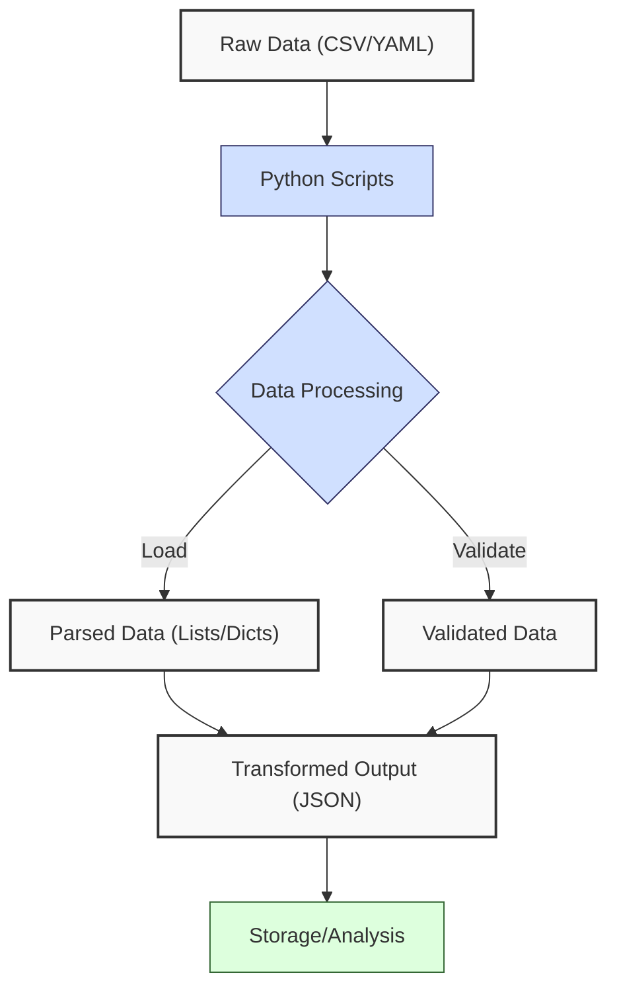
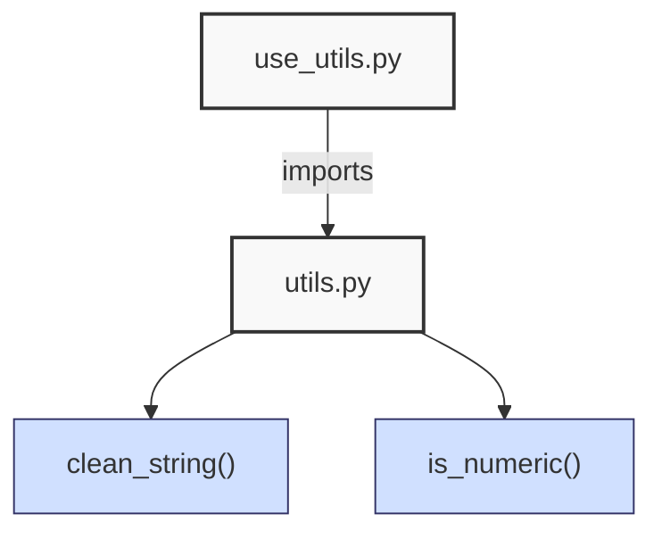
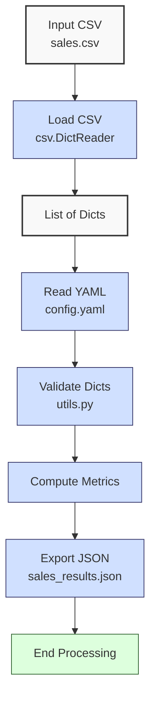

**Complexity: Easy (E)**

## 2.0 Introduction: Why This Matters for Data Engineering

In data engineering, robust data handling is the backbone of building reliable pipelines, especially for processing financial transaction data at Hijra Group, a Sharia-compliant fintech company. This chapter focuses on reading, validating, and transforming data from files like CSVs and YAML, using Python’s standard library and PyYAML. These skills are critical for ensuring data integrity in analytics pipelines, such as validating sales records for compliance with Islamic Financial Services Board (IFSB) standards. For example, validating that a product name like ‘Halal Laptop’ starts with ‘Halal’ ensures compliance with Hijra Group’s Sharia standards. By organizing code into reusable modules (e.g., `utils.py`), you’ll reduce duplication and enhance maintainability, aligning with Hijra Group’s need for scalable, modular systems.

Building on Chapter 1’s Python basics (data types, loops, functions), this chapter introduces file handling, CSV/JSON/YAML processing, string manipulation, and basic debugging with print statements. It avoids advanced concepts like try/except (introduced in Chapter 7), type annotations (Chapter 7), or Pandas (Chapter 3), ensuring accessibility for beginners. All code uses **PEP 8’s 4-space indentation**, preferring spaces over tabs to prevent `IndentationError` due to Python’s white-space sensitivity, aligning with Hijra Group’s coding standards.

### Data Engineering Workflow Context

This diagram illustrates how file handling and validation fit into a data engineering pipeline:



### Building On and Preparing For

- **Building On**:
  - Chapter 1: Uses lists, dictionaries, loops, and functions to process data, extended to file-based operations.
- **Preparing For**:
  - Chapter 3: Prepares for Pandas/NumPy by introducing structured data handling.
  - Chapter 5: Lays groundwork for organizing code into classes within modules.
  - Chapter 7: Sets up validation logic for type-safe processing.
  - Chapter 13: Enables YAML parsing for database configurations.

### What You’ll Learn

This chapter covers:

1. **File Handling**: Reading/writing CSVs, JSON, and YAML files.
2. **String Manipulation**: Cleaning and validating data (e.g., stripping whitespace, checking prefixes).
3. **Python Modules**: Creating and importing reusable code (e.g., `utils.py`).
4. **Basic Debugging**: Using print statements to trace data flow and errors.
5. **Data Validation**: Ensuring data meets Sharia-compliant rules (e.g., Halal product prefixes).

By the end, you’ll build a sales data processor that reads `data/sales.csv` and `data/config.yaml`, validates records, exports results to JSON, and logs steps, all with 4-space indentation per PEP 8. The micro-project uses datasets from Appendix 1, ensuring hands-on learning.

**Follow-Along Tips**:

- Create `de-onboarding/data/` and populate with `sales.csv`, `config.yaml`, `empty.csv`, `invalid.csv`, and `malformed.csv` per Appendix 1.
- Install PyYAML: `pip install pyyaml`.
- Use **4 spaces** (not tabs) per PEP 8 to avoid `IndentationError`. Run `python -tt script.py` to detect tab/space mixing.
- Use print statements (e.g., `print(sale)`) to debug dictionaries.
- Verify file paths with `ls data/` (Unix/macOS) or `dir data\` (Windows).
- Use UTF-8 encoding for all files to avoid `UnicodeDecodeError`.

## 2.1 File Handling

File handling involves reading and writing data files, critical for loading sales data and configurations. Python’s `open()` function provides access to files, with manual resource management since context managers (`with` statements) are introduced in Chapter 7.

### 2.1.1 Reading and Writing Files

Read CSVs and write JSON files using the standard library.

```python
import csv  # For CSV parsing
import json  # For JSON output

# Read CSV file
csv_path = "data/sales.csv"  # Path to sales CSV
file = open(csv_path, "r")  # Open file in read mode
reader = csv.DictReader(file)  # Create DictReader
sales = []  # List to store sales
for row in reader:  # Loop through rows
    sales.append(row)  # Append dictionary
file.close()  # Close file

# Print sales for debugging
print("Sales data:", sales)  # Debug: print sales list

# Write to JSON
json_path = "data/output.json"  # Output path
file = open(json_path, "w")  # Open file in write mode
json.dump(sales, file, indent=2)  # Write JSON with indentation
file.close()  # Close file
print(f"Exported to {json_path}")  # Confirm export

# Expected Output:
# Sales data: [{'product': 'Halal Laptop', 'price': '999.99', 'quantity': '2'}, ...]
# Exported to data/output.json
```

**Follow-Along Instructions**:

1. Ensure `data/sales.csv` exists in `de-onboarding/data/` per Appendix 1.
2. Save as `de-onboarding/file_handling.py`.
3. Configure editor for **4-space indentation** per PEP 8 (VS Code: “Editor: Tab Size” = 4, “Editor: Insert Spaces” = true, “Editor: Detect Indentation” = false).
4. Run: `python file_handling.py`.
5. Verify `data/output.json` exists and matches CSV structure.
6. **Common Errors**:
   - **FileNotFoundError**: Ensure `data/sales.csv` exists. Print `csv_path`.
   - **PermissionError**: Check write permissions for `data/`. Use `ls -l data/` (Unix/macOS) or `dir data\` (Windows).
   - **IndentationError**: Use 4 spaces (not tabs). Run `python -tt file_handling.py`.

**Key Points**:

- **White-Space Sensitivity and PEP 8**: Indentation (4 spaces) ensures readable code. Spaces avoid `IndentationError`.
- `csv.DictReader`: Parses CSV rows into dictionaries, O(n) for n rows.
- `json.dump`: Writes dictionaries to JSON, O(n) for n elements.
- **Underlying Implementation**: Files are read sequentially, with CSV parsing handling delimiters (`,`). JSON uses a tree structure for serialization.
- **Performance Considerations**:
  - **Time Complexity**: O(n) for reading/writing n rows.
  - **Space Complexity**: O(n) for storing n rows in memory.
  - **Implication**: Suitable for small datasets (e.g., `sales.csv` with 6 rows). For Hijra Group’s datasets with millions of transactions, sequential reading may be slow, requiring chunked processing (Chapter 40).
- Using UTF-8 encoding for files prevents `UnicodeDecodeError` when reading non-ASCII characters, common in Hijra Group’s global transaction data.

### 2.1.2 Parsing YAML Configurations

Parse YAML files using PyYAML for configuration-driven validation.

```python
import yaml  # For YAML parsing

# Read YAML file
config_path = "data/config.yaml"  # Path to config
file = open(config_path, "r")  # Open file
config = yaml.safe_load(file)  # Parse YAML
file.close()  # Close file

# Print config for debugging
print("Config:", config)  # Debug: print config

# Expected Output:
# Config: {'min_price': 10.0, 'max_quantity': 100, 'required_fields': ['product', 'price', 'quantity'], 'product_prefix': 'Halal', 'max_decimals': 2}
```

**Follow-Along Instructions**:

1. Ensure `data/config.yaml` exists per Appendix 1.
2. Install PyYAML: `pip install pyyaml`.
3. Save as `de-onboarding/yaml_parsing.py`.
4. Configure editor for 4-space indentation per PEP 8.
5. Run: `python yaml_parsing.py`.
6. Verify output matches config structure.
7. **Common Errors**:
   - **ModuleNotFoundError**: Install `pyyaml` with `pip install pyyaml`.
   - **yaml.YAMLError**: Check YAML syntax (2-space indentation, no tabs). Print `open(config_path).read()`.
   - **IndentationError**: Use 4 spaces (not tabs). Run `python -tt yaml_parsing.py`.

**Key Points**:

- `yaml.safe_load`: Parses YAML into dictionaries, O(n) for n nodes.
- **Time Complexity**: O(n) for parsing.
- **Space Complexity**: O(n) for config structure.
- **Implication**: YAML enables flexible pipeline configurations, e.g., validation rules for Hijra Group’s sales data.
- Using UTF-8 encoding for files prevents `UnicodeDecodeError` when reading non-ASCII characters, common in Hijra Group’s global transaction data.

## 2.2 String Manipulation

String operations clean and validate data, ensuring compliance with Sharia rules (e.g., Halal prefixes).

### 2.2.1 Cleaning Strings

Strip whitespace and validate formats.

```python
# Clean a string
text = "  Halal Laptop  "  # String with whitespace
cleaned = text.strip()  # Remove leading/trailing whitespace
print("Cleaned:", cleaned)  # Debug: print result

# Validate numeric string
price = "999.99"  # Price string
is_numeric = price.replace(".", "", 1).isdigit()  # Check if numeric (one decimal)
print("Is Numeric:", is_numeric)  # Debug: print result

# Expected Output:
# Cleaned: Halal Laptop
# Is Numeric: True
```

**Follow-Along Instructions**:

1. Save as `de-onboarding/string_cleaning.py`.
2. Configure editor for 4-space indentation per PEP 8.
3. Run: `python string_cleaning.py`.
4. Verify output matches expected.
5. **Common Errors**:
   - **AttributeError**: Ensure input is a string. Print `type(text)`.
   - **IndentationError**: Use 4 spaces (not tabs). Run `python -tt string_cleaning.py`.

**Key Points**:

- `strip()`: Removes whitespace, O(n) for n characters.
- `isdigit()`: Checks numeric strings, O(n).
- **Time Complexity**: O(n) for string operations.
- **Space Complexity**: O(n) for new strings.
- **Implication**: Cleans data for validation, e.g., ensuring valid product names.

### 2.2.2 Validating Strings

Check prefixes and decimal places for Sharia compliance.

```python
# Validate product prefix
product = "Halal Laptop"  # Product name
prefix = "Halal"  # Required prefix
is_valid = product.startswith(prefix)  # Check prefix
print("Has Prefix:", is_valid)  # Debug: print result

# Validate decimal places
price = "999.99"  # Price string
parts = price.split(".")  # Split on decimal
is_valid_decimal = len(parts) == 2 and len(parts[1]) <= 2  # Check format and decimals
print("Valid Decimals:", is_valid_decimal)  # Debug: print result

# Expected Output:
# Has Prefix: True
# Valid Decimals: True
```

**Follow-Along Instructions**:

1. Save as `de-onboarding/string_validation.py`.
2. Configure editor for 4-space indentation per PEP 8.
3. Run: `python string_validation.py`.
4. Verify output matches expected.
5. **Common Errors**:
   - **IndexError**: Ensure `split()` produces valid parts. Print `parts`.
   - **IndentationError**: Use 4 spaces (not tabs). Run `python -tt string_validation.py`.

**Key Points**:

- `startswith()`: Checks prefixes, O(k) for k-length prefix.
- `split()`: Splits strings, O(n).
- **Time Complexity**: O(n) for validation.
- **Space Complexity**: O(n) for split parts.
- **Implication**: Ensures Sharia-compliant product names and price formats.

## 2.3 Python Modules

Modules organize reusable code, reducing duplication. A module is a `.py` file (e.g., `utils.py`) imported into scripts.

### 2.3.1 Creating and Importing Modules

Create a `utils.py` module for validation functions. The following diagram shows how `use_utils.py` imports functions from `utils.py`:



```python
# File: de-onboarding/utils.py
def clean_string(s):  # Clean string
    """Strip whitespace from string."""
    return s.strip()  # Return cleaned string

def is_numeric(s, max_decimals=2):  # Check if string is numeric
    """Check if string is a decimal number with up to max_decimals."""
    parts = s.split(".")  # Split on decimal
    if len(parts) != 2 or not parts[0].isdigit() or not parts[1].isdigit():
        return False  # Invalid format
    return len(parts[1]) <= max_decimals  # Check decimal places

# File: de-onboarding/use_utils.py
import utils  # Import utils module

# Use module functions
product = "  Halal Laptop  "  # Product with whitespace
cleaned = utils.clean_string(product)  # Clean string
price = "999.99"  # Price string
is_valid = utils.is_numeric(price, max_decimals=2)  # Validate price

# Print results
print("Cleaned Product:", cleaned)  # Debug
print("Is Valid Price:", is_valid)  # Debug

# Expected Output:
# Cleaned Product: Halal Laptop
# Is Valid Price: True
```

**Follow-Along Instructions**:

1. Save `utils.py` and `use_utils.py` in `de-onboarding/`.
2. Configure editor for 4-space indentation per PEP 8.
3. Run: `python use_utils.py`.
4. Verify output matches expected.
5. **Common Errors**:
   - **ModuleNotFoundError**: Ensure `utils.py` is in `de-onboarding/`. Print `import os; print(os.getcwd())`.
   - **IndentationError**: Use 4 spaces (not tabs). Run `python -tt use_utils.py`.

**Key Points**:

- `import`: Loads module functions, O(1) for import.
- **Time Complexity**: O(n) for function execution.
- **Space Complexity**: O(1) for module import.
- **Implication**: Modules enhance code reuse in pipelines.

## 2.4 Basic Debugging

Debugging with print statements helps trace data flow and identify issues.

### 2.4.1 Using Print Statements

Trace a validation process.

```python
import csv  # For CSV parsing

# Read and validate CSV
csv_path = "data/sales.csv"  # CSV path
file = open(csv_path, "r")  # Open file
reader = csv.DictReader(file)  # Create DictReader
for row in reader:  # Loop through rows
    print("Processing row:", row)  # Debug: print row
    product = row["product"].strip()  # Clean product
    print("Cleaned product:", product)  # Debug: print cleaned
    if not product:  # Check for empty product
        print("Invalid: Missing product")  # Debug: log error
file.close()  # Close file
```

**Follow-Along Instructions**:

1. Ensure `data/sales.csv` exists per Appendix 1.
2. Save as `de-onboarding/debugging.py`.
3. Configure editor for 4-space indentation per PEP 8.
4. Run: `python debugging.py`.
5. Verify output shows row processing and errors.
6. **Common Errors**:
   - **KeyError**: Ensure CSV has `product` column. Print `reader.fieldnames`.
   - **IndentationError**: Use 4 spaces (not tabs). Run `python -tt debugging.py`.

### 2.4.2 Debugging Missing Columns

If a CSV has incorrect headers (e.g., `name` instead of `product`), a `KeyError` occurs. Print the column names to debug.

```python
import csv  # For CSV parsing

# Read CSV and check headers
csv_path = "data/sales.csv"  # CSV path
file = open(csv_path, "r")  # Open file
reader = csv.DictReader(file)  # Create DictReader
print("CSV Columns:", reader.fieldnames)  # Debug: print column names
for row in reader:  # Loop through rows
    print("Processing row:", row)  # Debug: print row
file.close()  # Close file

# Expected Output:
# CSV Columns: ['product', 'price', 'quantity']
# Processing row: {'product': 'Halal Laptop', 'price': '999.99', 'quantity': '2'}
# ...
```

**Follow-Along Instructions**:

1. Save as `de-onboarding/debug_columns.py`.
2. Configure editor for 4-space indentation per PEP 8.
3. Run: `python debug_columns.py`.
4. Verify output shows correct column names.
5. **Common Errors**:
   - **FileNotFoundError**: Ensure `data/sales.csv` exists. Print `csv_path`.
   - **IndentationError**: Use 4 spaces (not tabs). Run `python -tt debug_columns.py`.

### 2.4.3 Debugging Non-Numeric Prices

Non-numeric prices (e.g., `invalid`) in `sales.csv` can cause validation errors. Print the price to debug.

```python
import csv  # For CSV parsing

# Read CSV and check prices
csv_path = "data/sales.csv"  # CSV path
file = open(csv_path, "r")  # Open file
reader = csv.DictReader(file)  # Create DictReader
for row in reader:  # Loop through rows
    price = row["price"].strip()  # Clean price
    print("Price:", price)  # Debug: print price
    if not price.replace(".", "", 1).isdigit():  # Check if numeric
        print("Invalid price:", price)  # Debug: log error
file.close()  # Close file

# Expected Output (abridged):
# Price: 999.99
# Price: invalid
# Invalid price: invalid
# ...
```

**Follow-Along Instructions**:

1. Save as `de-onboarding/debug_price.py`.
2. Configure editor for 4-space indentation per PEP 8.
3. Run: `python debug_price.py`.
4. Verify output shows invalid prices (e.g., `invalid`).
5. **Common Errors**:
   - **KeyError**: Ensure CSV has `price` column. Print `reader.fieldnames`.
   - **IndentationError**: Use 4 spaces (not tabs). Run `python -tt debug_price.py`.

**Key Points**:

- Print statements: Log data and errors, O(1) per print.
- `reader.fieldnames`: Shows CSV columns for debugging.
- When debugging, compare print outputs to expected values (e.g., valid prices should be numeric like ‘999.99’) to identify issues.
- **Time Complexity**: O(n) for n rows.
- **Space Complexity**: O(1) for print buffers.
- **Implication**: Debugging ensures pipeline reliability.

## 2.5 Micro-Project: Sales Data Processor

### Project Requirements

Build a sales data processor to validate and process `data/sales.csv` using `data/config.yaml`, exporting results to `data/sales_results.json`. This processor supports Hijra Group’s transaction reporting by ensuring Sharia-compliant products and valid financial data, processing small datasets (e.g., 6 rows in `sales.csv`) suitable for learning.

- Read `data/sales.csv` with `csv.DictReader`.
- Parse `data/config.yaml` with PyYAML.
- Validate records for required fields, Halal prefix, numeric price/quantity, positive prices, and config rules (min_price, max_quantity, max_decimals).
- Compute total sales and unique products.
- Export results to `data/sales_results.json`.
- Log steps and invalid records using print statements.
- Use **4-space indentation** per PEP 8, preferring spaces over tabs.
- Organize validation in `utils.py` and main logic in `sales_processor.py`.

### Sample Input Files

`data/sales.csv` (from Appendix 1):

```csv
product,price,quantity
Halal Laptop,999.99,2
Halal Mouse,24.99,10
Halal Keyboard,49.99,5
,29.99,3
Monitor,invalid,2
Headphones,5.00,150
```

`data/config.yaml` (from Appendix 1):

```yaml
min_price: 10.0
max_quantity: 100
required_fields:
  - product
  - price
  - quantity
product_prefix: 'Halal'
max_decimals: 2
```

### Data Processing Flow



**Note**: Invalid records are logged and skipped during validation, ensuring only valid data reaches the computation step.

### Acceptance Criteria

- **Go Criteria**:
  - Loads `sales.csv` and `config.yaml` correctly.
  - Validates records for required fields, Halal prefix, numeric price/quantity, positive prices, and config rules.
  - Computes total sales and unique products.
  - Exports results to `data/sales_results.json`.
  - Logs steps and invalid records.
  - Uses 4-space indentation per PEP 8, preferring spaces over tabs.
  - Organizes validation in `utils.py`.
- **No-Go Criteria**:
  - Fails to load files.
  - Incorrect validation or calculations.
  - Missing JSON export.
  - Uses try/except or advanced libraries (e.g., Pandas).
  - Inconsistent indentation or tab/space mixing.

### Common Pitfalls to Avoid

1. **FileNotFoundError**:
   - **Problem**: Missing `sales.csv` or `config.yaml`.
   - **Solution**: Print paths with `print(csv_path)`. Ensure files exist per Appendix 1.
2. **YAML Syntax Errors**:

   - **Problem**: `yaml.YAMLError` due to incorrect indentation.
   - **Solution**: YAML requires 2-space indentation (no tabs) and colons followed by spaces (e.g., `key: value`). For example:

     ```yaml
     # Correct
     min_price: 10.0
     # Incorrect
     min_price:10.0  # Missing space after colon
     ```

     Print `open(config_path).read()` to inspect syntax.

3. **Validation Errors**:
   - **Problem**: Missing fields cause KeyError.
   - **Solution**: Check required fields. Print `row`.
4. **Numeric Validation**:
   - **Problem**: Non-numeric prices cause errors.
   - **Solution**: Use `utils.is_numeric`. Print `row["price"]`.
5. **PermissionError**:
   - **Problem**: Cannot write to `data/` directory.
   - **Solution**: Ensure the `data/` directory is writable by running `chmod u+w data/` (Unix/macOS) or checking folder properties (Windows). Check permissions with `ls -l data/` (Unix/macOS) or `dir data\` (Windows).
6. **IndentationError**:
   - **Problem**: Mixed spaces/tabs.
   - **Solution**: Use 4 spaces per PEP 8. Run `python -tt sales_processor.py`.

### How This Differs from Production

In production, this solution would include:

- **Error Handling**: Try/except for robust errors (Chapter 7).
- **Type Safety**: Type annotations (Chapter 7).
- **Testing**: Unit tests with `pytest` (Chapter 9).
- **Scalability**: Chunked CSV reading (Chapter 40).
- **Logging**: File-based logging (Chapter 52).
- **Performance**: Pandas for large datasets (Chapter 3).

### Implementation

```python
# File: de-onboarding/utils.py
def clean_string(s):  # Clean string
    """Strip whitespace from string."""
    return s.strip()  # Return cleaned string

def is_numeric(s, max_decimals=2):  # Check if string is numeric
    """Check if string is a decimal number with up to max_decimals."""
    parts = s.split(".")  # Split on decimal
    if len(parts) != 2 or not parts[0].isdigit() or not parts[1].isdigit():
        return False  # Invalid format
    return len(parts[1]) <= max_decimals  # Check decimal places

def validate_sale(sale, config):  # Validate a sale dictionary
    """Validate sale based on config rules."""
    required_fields = config["required_fields"]  # Get required fields
    min_price = config["min_price"]  # Get minimum price
    max_quantity = config["max_quantity"]  # Get maximum quantity
    prefix = config["product_prefix"]  # Get product prefix
    max_decimals = config["max_decimals"]  # Get max decimal places

    print(f"Validating sale: {sale}")  # Debug: print sale
    # Check for missing or empty fields
    for field in required_fields:  # Loop through required fields
        if not sale[field] or sale[field].strip() == "":  # Check if field is empty
            print(f"Invalid sale: missing {field}: {sale}")  # Log invalid
            return False

    # Validate product: non-empty and matches prefix
    product = clean_string(sale["product"])  # Clean product string
    if not product.startswith(prefix):  # Check prefix
        print(f"Invalid sale: product lacks '{prefix}' prefix: {sale}")  # Log invalid
        return False

    # Validate price: numeric, meets minimum, and positive
    price = clean_string(sale["price"])  # Clean price string
    if not is_numeric(price, max_decimals) or float(price) < min_price or float(price) <= 0:  # Check format, value, and positivity
        print(f"Invalid sale: invalid price: {sale}")  # Log invalid
        return False

    # Validate quantity: integer and within limit
    quantity = clean_string(sale["quantity"])  # Clean quantity string
    if not quantity.isdigit() or int(quantity) > max_quantity:  # Check format and limit
        print(f"Invalid sale: invalid quantity: {sale}")  # Log invalid
        return False

    return True  # Return True if all checks pass

# File: de-onboarding/sales_processor.py
import csv  # For CSV parsing
import yaml  # For YAML parsing
import json  # For JSON output
import utils  # Import custom utils module

# Define function to read YAML configuration
def read_config(config_path):  # Takes config file path
    """Read YAML configuration."""
    print(f"Opening config: {config_path}")  # Debug: print path
    file = open(config_path, "r")  # Open YAML
    config = yaml.safe_load(file)  # Parse YAML
    file.close()  # Close file
    print(f"Loaded config: {config}")  # Debug: print config
    return config  # Return config dictionary

# Define function to load and validate sales
def load_and_validate_sales(csv_path, config):  # Takes CSV path and config
    """Load sales CSV and validate."""
    print(f"Loading CSV: {csv_path}")  # Debug: print path
    file = open(csv_path, "r")  # Open CSV
    reader = csv.DictReader(file)  # Create DictReader
    valid_sales = []  # List for valid sales
    invalid_count = 0  # Count invalid sales

    # Check for required columns
    required_fields = config["required_fields"]  # Get required fields
    missing_fields = [f for f in required_fields if f not in reader.fieldnames]
    if missing_fields:  # Check for missing columns
        print(f"Invalid CSV: missing columns {missing_fields}")  # Log error
        file.close()  # Close file
        return [], 1  # Return empty list and increment invalid count

    for row in reader:  # Loop through rows
        print(f"Processing row: {row}")  # Debug: print row
        if utils.validate_sale(row, config):  # Validate row
            valid_sales.append(row)  # Append valid sale
        else:
            invalid_count += 1  # Increment invalid count

    file.close()  # Close file
    print(f"Valid sales: {valid_sales}")  # Debug: print valid sales
    return valid_sales, invalid_count  # Return valid sales and invalid count

# Define function to process sales
def process_sales(sales):  # Takes list of sales
    """Process sales: compute total and unique products."""
    if not sales:  # Check for empty sales
        print("No valid sales data")  # Log empty
        return {"total_sales": 0.0, "unique_products": []}, 0

    total_sales = 0.0  # Initialize total
    unique_products = set()  # Set for unique products
    for sale in sales:  # Loop through sales
        price = float(sale["price"])  # Convert price
        quantity = int(sale["quantity"])  # Convert quantity
        amount = price * quantity  # Compute amount
        total_sales += amount  # Add to total
        unique_products.add(sale["product"])  # Add product to set

    results = {
        "total_sales": total_sales,  # Total sales
        "unique_products": list(unique_products)  # Convert set to list
    }
    print(f"Processed results: {results}")  # Debug: print results
    return results, len(sales)  # Return results and valid count

# Define function to export results
def export_results(results, json_path):  # Takes results and file path
    """Export results to JSON."""
    print(f"Writing to: {json_path}")  # Debug: print path
    file = open(json_path, "w")  # Open JSON file
    json.dump(results, file, indent=2)  # Write JSON
    file.close()  # Close file
    print(f"Exported results to {json_path}")  # Confirm export

# Define main function
def main():  # No parameters
    """Main function to process sales data."""
    csv_path = "data/sales.csv"  # CSV path
    config_path = "data/config.yaml"  # YAML path
    json_path = "data/sales_results.json"  # JSON output path

    config = read_config(config_path)  # Read config
    sales, invalid_count = load_and_validate_sales(csv_path, config)  # Load and validate
    results, valid_count = process_sales(sales)  # Process sales
    export_results(results, json_path)  # Export results

    # Output report
    print("\nSales Report:")  # Print header
    print(f"Total Records Processed: {valid_count + invalid_count}")  # Total records
    print(f"Valid Sales: {valid_count}")  # Valid count
    print(f"Invalid Sales: {invalid_count}")  # Invalid count
    print(f"Total Sales: ${round(results['total_sales'], 2)}")  # Total sales
    print(f"Unique Products: {results['unique_products']}")  # Products
    print("Processing completed")  # Confirm completion

if __name__ == "__main__":
    main()  # Run main function
```

### Expected Outputs

`data/sales_results.json`:

```json
{
  "total_sales": 2499.83,
  "unique_products": ["Halal Laptop", "Halal Mouse", "Halal Keyboard"]
}
```

**Console Output** (abridged):

```
Opening config: data/config.yaml
Loaded config: {'min_price': 10.0, 'max_quantity': 100, 'required_fields': ['product', 'price', 'quantity'], 'product_prefix': 'Halal', 'max_decimals': 2}
Loading CSV: data/sales.csv
Processing row: {'product': 'Halal Laptop', 'price': '999.99', 'quantity': '2'}
Validating sale: {'product': 'Halal Laptop', 'price': '999.99', 'quantity': '2'}
...
Valid sales: [{'product': 'Halal Laptop', 'price': '999.99', 'quantity': '2'}, ...]
Processed results: {'total_sales': 2499.83, 'unique_products': ['Halal Laptop', 'Halal Mouse', 'Halal Keyboard']}
Writing to: data/sales_results.json
Exported results to data/sales_results.json

Sales Report:
Total Records Processed: 6
Valid Sales: 3
Invalid Sales: 3
Total Sales: $2499.83
Unique Products: ['Halal Laptop', 'Halal Mouse', 'Halal Keyboard']
Processing completed
```

### How to Run and Test

1. **Setup**:

   - **Setup Checklist**:
     - \[ \] Create `de-onboarding/data/` directory.
     - \[ \] Save `sales.csv`, `config.yaml`, `empty.csv`, `invalid.csv`, and `malformed.csv` per Appendix 1.
     - \[ \] Install PyYAML: `pip install pyyaml`.
     - \[ \] Create virtual environment: `python -m venv venv`, activate (Windows: `venv\Scripts\activate`, Unix: `source venv/bin/activate`).
     - \[ \] Verify Python 3.10+: `python --version`.
     - \[ \] Configure editor for 4-space indentation per PEP 8 (VS Code: “Editor: Tab Size” = 4, “Editor: Insert Spaces” = true, “Editor: Detect Indentation” = false).
     - \[ \] Save `utils.py` and `sales_processor.py` in `de-onboarding/`.
   - **Troubleshooting**:
     - If `FileNotFoundError`, print `csv_path`, `config_path`.
     - If `ModuleNotFoundError`, install `pyyaml` or check `utils.py` path.
     - If `IndentationError`, use 4 spaces. Run `python -tt sales_processor.py`.
     - If `yaml.YAMLError`, print `open(config_path).read()`.
     - If `PermissionError`, run `chmod u+w data/` (Unix/macOS) or check folder properties (Windows).

2. **Run**:

   - Open terminal in `de-onboarding/`.
   - Run: `python sales_processor.py`.
   - Outputs: `data/sales_results.json`, console logs.

3. **Test Scenarios**:

   - **Valid Data**: Verify `sales_results.json` shows `total_sales: 2499.83` and correct products.
   - **Empty CSV**: Test with `empty.csv`:

     ```python
     config = read_config("data/config.yaml")
     sales, invalid_count = load_and_validate_sales("data/empty.csv", config)
     print(sales, invalid_count)  # Expected: [], 0
     ```

   - **Invalid Headers**: Test with `invalid.csv`:

     ```python
     config = read_config("data/config.yaml")
     sales, invalid_count = load_and_validate_sales("data/invalid.csv", config)
     print(sales, invalid_count)  # Expected: [], 1
     ```

   - **Malformed Data**: Test with `malformed.csv`:

     ```python
     config = read_config("data/config.yaml")
     sales, invalid_count = load_and_validate_sales("data/malformed.csv", config)
     print(sales, invalid_count)  # Expected: [{'product': 'Halal Mouse', 'price': '24.99', 'quantity': '10'}], 1
     ```

   - **Note**: The `load_and_validate_sales` function checks for required columns using `reader.fieldnames`, logging missing columns (e.g., `product`) as invalid, as shown in the `invalid.csv` test.

## 2.6 Practice Exercises

### Exercise 1: CSV Reader

Write a function to read `data/sales.csv` into a list of dictionaries, with 4-space indentation per PEP 8.

**Sample Input** (`data/sales.csv`):

```csv
product,price,quantity
Halal Laptop,999.99,2
```

**Expected Output**:

```
[{'product': 'Halal Laptop', 'price': '999.99', 'quantity': '2'}]
```

**Follow-Along Instructions**:

1. Save as `de-onboarding/ex1_csv.py`.
2. Ensure `data/sales.csv` exists per Appendix 1.
3. Configure editor for 4-space indentation per PEP 8.
4. Run: `python ex1_csv.py`.
5. **How to Test**:
   - Add: `print(read_csv("data/sales.csv"))`.
   - Verify output matches expected.
   - Test with `data/empty.csv`: Should return empty list.

### Exercise 2: YAML Parser

Write a function to parse `data/config.yaml`, with 4-space indentation per PEP 8.

**Sample Input** (`data/config.yaml`):

```yaml
min_price: 10.0
max_quantity: 100
```

**Expected Output**:

```
{'min_price': 10.0, 'max_quantity': 100}
```

**Follow-Along Instructions**:

1. Save as `de-onboarding/ex2_yaml.py`.
2. Ensure `data/config.yaml` exists per Appendix 1.
3. Install PyYAML: `pip install pyyaml`.
4. Configure editor for 4-space indentation per PEP 8.
5. Run: `python ex2_yaml.py`.
6. **How to Test**:
   - Add: `print(parse_yaml("data/config.yaml"))`.
   - Verify output matches expected.

### Exercise 3: String Validator

Write a function to validate product names to ensure Sharia-compliant Halal prefixes for Hijra Group’s analytics, with 4-space indentation per PEP 8. If `validate_product` fails for a product like ‘ Halal Laptop’, print the cleaned product to debug whitespace issues.

**Sample Input**:

```python
product = "Halal Laptop"
prefix = "Halal"
```

**Expected Output**:

```
True
```

**Follow-Along Instructions**:

1. Save as `de-onboarding/ex3_validate.py`.
2. Configure editor for 4-space indentation per PEP 8.
3. Run: `python ex3_validate.py`.
4. **How to Test**:
   - Add: `print(validate_product("Halal Laptop", "Halal"))`.
   - Verify output: `True`.
   - Test with `product="Non-Halal Monitor"`: Should return `False`.
   - Test with `product="  Halal Laptop"`: Should print cleaned product (e.g., `Halal Laptop`) if validation fails.

### Exercise 4: Debug a Validation Bug

Fix this buggy code that incorrectly validates prices, with 4-space indentation per PEP 8.

**Buggy Code**:

```python
def validate_price(price):
    return price.isdigit()  # Bug: Only checks integers
print(validate_price("999.99"))
```

**Sample Input**:

```python
price = "999.99"
```

**Expected Output**:

```
True
```

**Follow-Along Instructions**:

1. Save as `de-onboarding/ex4_debug.py`.
2. Configure editor for 4-space indentation per PEP 8.
3. Run: `python ex4_debug.py` to see incorrect output (`False`).
4. Fix and re-run.
5. **How to Test**:
   - Verify output: `True`.
   - Test with `price="invalid"`: Should return `False`.

### Exercise 5: Module-Based Validation

Write a `utils.py` function to validate quantities and use it in a script, with 4-space indentation per PEP 8.

**Sample Input**:

```python
quantity = "10"
max_quantity = 100
```

**Expected Output**:

```
True
```

**Follow-Along Instructions**:

1. Save as `de-onboarding/utils.py` and `de-onboarding/ex5_module.py`.
2. Configure editor for 4-space indentation per PEP 8.
3. Run: `python ex5_module.py`.
4. **How to Test**:
   - Add: `print(validate_quantity("10", 100))`.
   - Verify output: `True`.
   - Test with `quantity="150"`: Should return `False`.

### Exercise 6: Conceptual Analysis of Modules

Write a short paragraph explaining why using `utils.py` for validation improves code maintainability, and save it to `ex6_concepts.txt`, with 4-space indentation per PEP 8 for any code. Discuss how `utils.py` reduces duplication, simplifies updates, and supports Hijra Group’s scalable pipelines. Include at least one example (e.g., updating decimal rules).

**Sample Input**:

```python
# No input required
```

**Expected Output** (`ex6_concepts.txt`):

```
Using utils.py for validation functions like clean_string and is_numeric improves code maintainability by organizing reusable code in one place, reducing duplication across scripts. This modular design makes it easier to update validation logic, such as changing decimal rules, without modifying multiple files. It also enhances readability and supports Hijra Group’s scalable pipelines by keeping main scripts focused on processing logic.
```

**Follow-Along Instructions**:

1. Save as `de-onboarding/ex6_concepts.py`.
2. Configure editor for 4-space indentation per PEP 8.
3. Run: `python ex6_concepts.py`.
4. **How to Test**:
   - Verify `ex6_concepts.txt` contains a paragraph similar to the expected output.
   - Check file contents with `cat ex6_concepts.txt` (Unix/macOS) or `type ex6_concepts.txt` (Windows).

## 2.7 Exercise Solutions

### Solution to Exercise 1: CSV Reader

```python
import csv  # For CSV parsing

def read_csv(csv_path):  # Takes CSV path
    """Read CSV into list of dictionaries."""
    file = open(csv_path, "r")  # Open file
    reader = csv.DictReader(file)  # Create DictReader
    data = [row for row in reader]  # List comprehension
    file.close()  # Close file
    print("Read data:", data)  # Debug
    return data  # Return list

# Test
print(read_csv("data/sales.csv"))  # Call function

# Output (abridged):
# Read data: [{'product': 'Halal Laptop', 'price': '999.99', 'quantity': '2'}, ...]
# [{'product': 'Halal Laptop', 'price': '999.99', 'quantity': '2'}, ...]
```

### Solution to Exercise 2: YAML Parser

```python
import yaml  # For YAML parsing

def parse_yaml(config_path):  # Takes config path
    """Parse YAML file."""
    file = open(config_path, "r")  # Open file
    config = yaml.safe_load(file)  # Parse YAML
    file.close()  # Close file
    print("Parsed config:", config)  # Debug
    return config  # Return dictionary

# Test
print(parse_yaml("data/config.yaml"))  # Call function

# Output:
# Parsed config: {'min_price': 10.0, 'max_quantity': 100, ...}
# {'min_price': 10.0, 'max_quantity': 100, ...}
```

### Solution to Exercise 3: String Validator

```python
def validate_product(product, prefix):  # Takes product and prefix
    """Validate product prefix."""
    cleaned = product.strip()  # Clean string
    is_valid = cleaned.startswith(prefix)  # Check prefix
    if not is_valid:  # Debug if validation fails
        print(f"Debug: Cleaned product is '{cleaned}'")  # Print cleaned product
    print(f"Validating {product}: {is_valid}")  # Debug
    return is_valid  # Return result

# Test
print(validate_product("Halal Laptop", "Halal"))  # Call function

# Output:
# Validating Halal Laptop: True
# True
```

### Solution to Exercise 4: Debug a Validation Bug

```python
def validate_price(price):  # Takes price string
    """Validate price as decimal number."""
    parts = price.split(".")  # Split on decimal
    is_valid = len(parts) == 2 and parts[0].isdigit() and parts[1].isdigit()  # Check format
    print(f"Validating {price}: {is_valid}")  # Debug
    return is_valid  # Return result

# Test
print(validate_price("999.99"))  # Call function

# Output:
# Validating 999.99: True
# True
```

**Explanation**:

- **Bug**: `isdigit()` only checks integers, failing for decimals.
- **Fix**: Split on decimal and validate both parts.

### Solution to Exercise 5: Module-Based Validation

```python
# File: de-onboarding/utils.py
def validate_quantity(quantity, max_quantity):  # Takes quantity and max
    """Validate quantity as integer within limit."""
    cleaned = quantity.strip()  # Clean string
    is_valid = cleaned.isdigit() and int(cleaned) <= max_quantity  # Check format and limit
    print(f"Validating {quantity}: {is_valid}")  # Debug
    return is_valid  # Return result

# File: de-onboarding/ex5_module.py
import utils  # Import utils module

# Test
print(utils.validate_quantity("10", 100))  # Call function

# Output:
# Validating 10: True
# True
```

### Solution to Exercise 6: Conceptual Analysis of Modules

```python
def explain_module_benefits(output_path):  # Takes output file path
    """Write explanation of module benefits."""
    explanation = (
        "Using utils.py for validation functions like clean_string and is_numeric "
        "improves code maintainability by organizing reusable code in one place, "
        "reducing duplication across scripts. This modular design makes it easier "
        "to update validation logic, such as changing decimal rules, without modifying "
        "multiple files. It also enhances readability and supports Hijra Group’s scalable "
        "pipelines by keeping main scripts focused on processing logic."
    )
    file = open(output_path, "w")  # Open file
    file.write(explanation)  # Write explanation
    file.close()  # Close file
    print(f"Explanation saved to {output_path}")  # Confirm save
    return explanation  # Return explanation

# Test
print(explain_module_benefits("ex6_concepts.txt"))  # Call function

# Output:
# Explanation saved to ex6_concepts.txt
# Using utils.py for validation functions like clean_string and is_numeric ...
```

## 2.8 Chapter Summary and Connection to Chapter 3

In this chapter, you’ve mastered:

- **File Handling**: Reading CSVs and YAML, writing JSON (O(n) operations).
- **String Manipulation**: Cleaning and validating data (O(n)).
- **Python Modules**: Organizing reusable code in `utils.py`.
- **Debugging**: Using print statements for tracing, including column and price validation.
- **White-Space Sensitivity and PEP 8**: Using 4-space indentation, preferring spaces over tabs.

The micro-project built a sales processor that validates `sales.csv` using `config.yaml`, exports results, and logs steps, all with 4-space indentation per PEP 8. The modular design (`utils.py`) prepares for Chapter 5’s OOP by encapsulating validation logic into classes. Validation ensures Sharia-compliant data, critical for Hijra Group’s analytics.

### Connection to Chapter 3

Chapter 3 introduces **Essential Data Libraries (NumPy and Pandas Basics)**, building on this chapter:

- **Data Loading**: Replaces `csv.DictReader` with `pandas.read_csv` for efficiency.
- **Validation**: Extends `utils.py` for Pandas-based filtering, using `sales.csv` and `config.yaml` per Appendix 1.
- **Modules**: Reuses `utils.py` for validation, preparing for OOP in Chapter 5.
- **Fintech Context**: Enhances sales processing with NumPy/Pandas for scalable analytics, maintaining PEP 8’s 4-space indentation.
