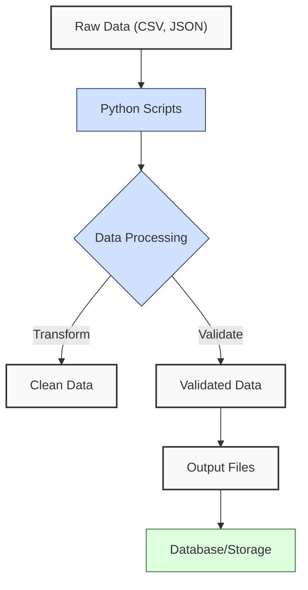
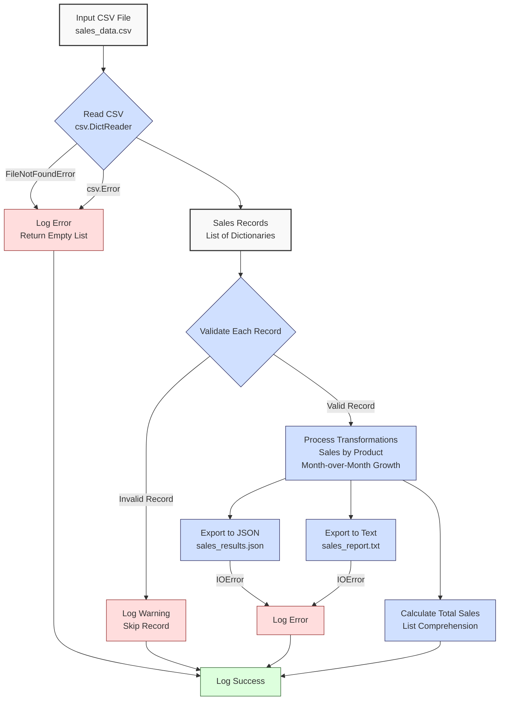

**Complexity: Easy (E)**

## 2.0 Introduction: Why This Matters for Data Engineering

In data engineering, working with external data sources (like files) and ensuring code reliability are critical skills. Data pipelines often involve reading from CSVs, JSON files, or other formats, transforming the data, and writing results to new files. Errors—such as missing files, malformed data, or invalid formats—can disrupt these pipelines. Proper file handling and error management ensure your code is robust, reusable, and production-ready.

This chapter builds on the Python fundamentals from Chapter 1, introducing techniques to read and write files, handle errors gracefully, and process common data formats like CSV and JSON. These skills are foundational for building reliable data pipelines that can handle real-world data challenges.

### Data Engineering Workflow Context

Here’s how the concepts in this chapter fit into a typical data engineering workflow:



### Building On and Preparing For

- **Building On**: This chapter extends Chapter 1’s Python fundamentals (data structures, functions, control flow, string manipulation). You’ll apply these to handle files and errors, using the sales data analyzer as a starting point.
- **Preparing For**: The skills learned here—file I/O, error handling, and data format processing—are crucial for Chapter 3 (NumPy and Pandas Basics), where you’ll process larger datasets, and for database chapters (11–22), where robust error handling ensures reliable database interactions.

### What You’ll Learn

This chapter covers:

1. File handling with context managers (`with` statements)
2. Error handling using `try/except` blocks
3. List comprehensions for concise data transformations
4. Modules and imports for using built-in libraries (`csv`, `json`, etc.)
5. Basic CSV and JSON handling for common data formats

By the end, you’ll be able to read data from files, handle errors gracefully, and export results in structured formats, preparing you for more advanced data processing tasks.

## 2.1 File Handling with Context Managers

File handling is essential for data engineering, as data often resides in files like CSVs or JSON. Python’s context managers (`with` statements) ensure files are properly opened and closed, even if errors occur.

### 2.1.1 Reading Files

Use `open()` with a `with` statement to read files safely.

```python
# Read a text file
file_path = "sample.txt"
with open(file_path, "r") as file:
    content = file.read()  # Read entire file
    print(f"File content:\n{content}")

# Read line by line
with open(file_path, "r") as file:
    for line in file:
        print(f"Line: {line.strip()}")  # strip() removes trailing newlines

# Sample content of sample.txt:
# Product: Laptop
# Price: 999.99
# Quantity: 2

# Output:
# File content:
# Product: Laptop
# Price: 999.99
# Quantity: 2
#
# Line: Product: Laptop
# Line: Price: 999.99
# Line: Quantity: 2
```

**Key Points**:

- `open(file_path, "r")` opens the file in read mode (`"r"`).
- The `with` statement ensures the file is closed automatically after use.
- Methods: `read()` (entire file), `readlines()` (list of lines), or iterate line-by-line.
- **Underlying Implementation**: Files are buffered streams, reading data in chunks from disk to memory. The `with` statement calls `__enter__` and `__exit__` methods on the file object, ensuring cleanup.
- **Performance Considerations**:
  - **Time Complexity**: Reading a file is O(n), where n is the file size, as it processes each byte sequentially.
  - **Space Complexity**: O(n) for `read()` (loads entire file into memory), O(1) for line-by-line iteration (processes one line at a time). Use iteration for large files to save memory.
  - **Implication**: Line-by-line reading is memory-efficient for large datasets, critical in data engineering.

### 2.1.2 Writing Files

Write data to files using `"w"` (write, overwrites) or `"a"` (append) modes.

```python
# Write to a new file
output_path = "output.txt"
with open(output_path, "w") as file:
    file.write("Product: Mouse\n")
    file.write("Price: 24.99\n")

# Append to an existing file
with open(output_path, "a") as file:
    file.write("Quantity: 10\n")

# Read to verify
with open(output_path, "r") as file:
    print(f"Output file content:\n{file.read()}")

# Output:
# Output file content:
# Product: Mouse
# Price: 24.99
# Quantity: 10
```

**Key Points**:

- `"w"` overwrites the file; `"a"` adds to the end.
- Use `write()` for strings; ensure to add newlines (`\n`) if needed.
- **Performance Considerations**:
  - **Time Complexity**: Writing is O(n), where n is the data size, as it writes sequentially to disk.
  - **Space Complexity**: O(1) for writing, as data is streamed to disk, not held in memory.
  - **Implication**: Writing is efficient but ensure proper file closure to avoid data loss.

## 2.2 Error Handling with Try/Except

Errors are common in data engineering (e.g., missing files, invalid data). Use `try/except` blocks to handle exceptions gracefully.

### 2.2.1 Basic Try/Except

Catch specific exceptions to prevent crashes.

```python
# Attempt to read a file that may not exist
file_path = "nonexistent.txt"
try:
    with open(file_path, "r") as file:
        content = file.read()
        print(f"Content: {content}")
except FileNotFoundError:
    print(f"Error: File '{file_path}' not found.")
except PermissionError:
    print(f"Error: Permission denied for '{file_path}'.")

# Output:
# Error: File 'nonexistent.txt' not found.
```

**Key Points**:

- `try`: Code that might raise an exception.
- `except`: Handle specific exceptions (e.g., `FileNotFoundError`, `PermissionError`).
- Avoid catching all exceptions (`except Exception`) to prevent masking unexpected issues.
- **Underlying Implementation**: Exceptions are objects raised by Python’s runtime, caught by matching exception types. The interpreter uses a stack-based mechanism to propagate exceptions until handled.
- **Performance Considerations**:
  - **Time Complexity**: Exception handling adds minimal overhead (O(1)) unless an exception is raised, then O(1) for catching and handling.
  - **Space Complexity**: O(1) for stack frame management during exception handling.
  - **Implication**: Exception handling is efficient but should be used for exceptional cases, not control flow.

### 2.2.2 Handling Data Errors

Validate and handle data errors during processing.

```python
# Process a price that may be invalid
price_str = "invalid"
try:
    price = float(price_str)
    if price <= 0:
        raise ValueError("Price must be positive.")
    print(f"Valid price: ${price:.2f}")
except ValueError as e:
    print(f"Error: Invalid price '{price_str}': {e}")

# Output:
# Error: Invalid price 'invalid': could not convert string to float: 'invalid'
```

**Key Points**:

- Use `raise` to create custom errors.
- Catch specific exceptions like `ValueError` for conversion errors.
- Include error messages for debugging.

## 2.3 List Comprehensions

List comprehensions provide a concise way to create or transform lists, ideal for data transformations.

### 2.3.1 Basic List Comprehensions

Create a new list from an existing one.

```python
# Extract prices from sales records
sales = [
    {"product": "Laptop", "price": 999.99},
    {"product": "Mouse", "price": 24.99},
    {"product": "Keyboard", "price": 49.99}
]
prices = [sale["price"] for sale in sales]
print(f"Prices: {prices}")

# Filter prices above a threshold
high_prices = [price for price in prices if price > 50]
print(f"High prices: {high_prices}")

# Output:
# Prices: [999.99, 24.99, 49.99]
# High prices: [999.99]
```

**Key Points**:

- Syntax: `[expression for item in iterable if condition]`.
- Combines looping and conditional logic.
- **Underlying Implementation**: List comprehensions are optimized loops, compiled to efficient bytecode. They allocate the list upfront, unlike generators.
- **Performance Considerations**:
  - **Time Complexity**: O(n), where n is the input iterable’s length, as it processes each item once.
  - **Space Complexity**: O(n) for the output list, proportional to the number of included items.
  - **Implication**: Faster than equivalent `for` loops for simple transformations but uses more memory than generators for large datasets.

### 2.3.2 Nested List Comprehensions

Process nested data structures.

```python
# Flatten a list of product categories
products = [
    {"name": "Laptop", "categories": ["Electronics", "Computers"]},
    {"name": "T-shirt", "categories": ["Clothing", "Casual"]}
]
all_categories = [cat for product in products for cat in product["categories"]]
print(f"All categories: {all_categories}")

# Output:
# All categories: ['Electronics', 'Computers', 'Clothing', 'Casual']
```

**Key Points**:

- Nested comprehensions process inner iterables.
- Order matters: `[expr for outer in outer_iter for inner in outer[inner_iter]]`.

## 2.4 Modules and Imports

Python’s standard library provides modules for common tasks. Import them to extend functionality.

### 2.4.1 Using Built-in Modules

Import modules like `csv`, `json`, `math`, `datetime`, and `os`.

```python
import math
import datetime

# Calculate the ceiling of a price
price = 19.99
ceiled_price = math.ceil(price)
print(f"Ceiled price: {ceiled_price}")

# Get the current date
current_date = datetime.datetime.now().date()
print(f"Current date: {current_date}")

# Output:
# Ceiled price: 20
# Current date: 2025-04-20
```

**Key Points**:

- Use `import module` to access module functions.
- Common modules for data engineering: `csv`, `json`, `datetime`, `os`, `math`.
- **Performance Considerations**:
  - **Time Complexity**: Module imports are O(1) but occur once at startup.
  - **Space Complexity**: O(1) for module metadata, though module functions may allocate memory (e.g., `datetime` objects).
  - **Implication**: Imports are efficient but avoid importing unused modules to reduce startup time.

## 2.5 Basic CSV and JSON Handling

CSV and JSON are common data formats in data engineering. Use the `csv` and `json` modules to process them.

### 2.5.1 Reading and Writing CSV

Handle CSV files with the `csv` module.

```python
import csv

# Write sales data to CSV
sales = [
    {"product": "Laptop", "price": 999.99, "quantity": 2},
    {"product": "Mouse", "price": 24.99, "quantity": 10}
]
csv_path = "sales.csv"
with open(csv_path, "w", newline="") as file:
    writer = csv.DictWriter(file, fieldnames=["product", "price", "quantity"])
    writer.writeheader()
    writer.writerows(sales)

# Read CSV file
with open(csv_path, "r") as file:
    reader = csv.DictReader(file)
    for row in reader:
        print(f"Row: {row}")

# Output:
# Row: {'product': 'Laptop', 'price': '999.99', 'quantity': '2'}
# Row: {'product': 'Mouse', 'price': '24.99', 'quantity': '10'}
```

**Key Points**:

- Use `DictWriter` to write dictionaries to CSV with headers.
- Use `DictReader` to read CSV rows as dictionaries.
- `newline=""` ensures consistent newline handling across platforms.
- **Performance Considerations**:
  - **Time Complexity**: O(n), where n is the number of rows, for reading/writing.
  - **Space Complexity**: O(1) for streaming rows, O(n) if loading all rows into memory.
  - **Implication**: Stream rows for large CSVs to save memory.

### 2.5.2 Reading and Writing JSON

Handle JSON files with the `json` module.

```python
import json

# Write sales data to JSON
sales = [
    {"product": "Laptop", "price": 999.99, "quantity": 2},
    {"product": "Mouse", "price": 24.99, "quantity": 10}
]
json_path = "sales.json"
with open(json_path, "w") as file:
    json.dump(sales, file, indent=2)

# Read JSON file
with open(json_path, "r") as file:
    loaded_sales = json.load(file)
    print(f"Loaded sales: {loaded_sales}")

# Output:
# Loaded sales: [{'product': 'Laptop', 'price': 999.99, 'quantity': 2}, {'product': 'Mouse', 'price': 24.99, 'quantity': 10}]
```

**Key Points**:

- `json.dump()` writes Python objects to JSON; `indent=2` formats for readability.
- `json.load()` reads JSON into Python objects (lists, dictionaries).
- Ensure data is JSON-serializable (e.g., no complex objects like `datetime`).
- **Performance Considerations**:
  - **Time Complexity**: O(n), where n is the JSON data size, for parsing/serializing.
  - **Space Complexity**: O(n) to hold the parsed data in memory.
  - **Implication**: JSON is flexible but memory-intensive for large datasets.

## 2.6 Micro-Project: Robust Data Processor

**Note**: The full micro-project may take 60–90 minutes to complete, including debugging. For a quicker alternative (approximately 30 minutes), use the simplified version below, especially if you’re new to Python or have limited time.

### Project Requirements

Enhance the Chapter 1 sales data analyzer to process data from a CSV file, add error handling, support JSON and text report exports, and include logging. This project applies file handling, error handling, list comprehensions, and CSV/JSON processing.

### File Processing and Error Handling Flow

_Visualizing the micro-project’s data flow and error handling_

The following diagram illustrates the flow of data through the micro-project, highlighting file processing and error handling steps:



### Acceptance Criteria

- **Go Criteria**:
  - Script gracefully handles errors (file not found, malformed data, etc.).
  - Implements at least two data transformations (e.g., sales by product, month-over-month growth).
  - Exports results to JSON and formatted text files.
  - Includes logging at different severity levels (info, warning, error).
  - Uses `try/except` for all file operations and data processing.
  - Processes provided test files, including one with errors.
- **No-Go Criteria**:
  - Crashes on missing files or invalid data.
  - No error handling for file operations.
  - Incorrect transformations or calculations.
  - Missing JSON or text export functionality.
  - No logging or unclear log messages.
  - Hard-coded file paths.

### Common Pitfalls to Avoid

1. **Too Broad Exception Handling**:
   - **Problem**: Catching all exceptions (`except Exception`) masks unexpected errors, making debugging difficult.
   - **Solution**: Catch specific exceptions (e.g., `FileNotFoundError`, `ValueError`).
2. **File Handles Left Open**:
   - **Problem**: Not using `with` statements can leave files open, causing resource leaks.
   - **Solution**: Always use `with` for file operations.
3. **JSON Serialization Errors**:
   - **Problem**: Non-serializable objects (e.g., `datetime`) cause JSON errors.
   - **Solution**: Convert such objects to strings or numbers before serialization.
4. **Missing File Path Validation**:
   - **Problem**: Hard-coded or invalid file paths cause errors.
   - **Solution**: Use `os.path` to validate paths and handle relative paths.
5. **Inefficient Data Loading**:
   - **Problem**: Loading large CSVs into memory can consume excessive RAM.
   - **Solution**: Process CSV rows iteratively with `csv.DictReader`.

### How This Differs from Production-Grade Solutions

In production, this solution would include:

- **Advanced Logging**: Centralized logging to external systems (e.g., ELK stack, Chapter 52).
- **Configuration Management**: External configuration files or environment variables (Chapter 8).
- **Testing**: Comprehensive unit and integration tests (Chapter 9).
- **Scalability**: Parallel processing for large datasets (Chapter 32).
- **Monitoring**: Alerts for pipeline failures (Chapter 53).
- **Security**: Secure file permissions and data encryption (Chapter 8).

### Implementation (Full Version)

```python
import csv
import json
import logging
import os
from datetime import datetime

# Configure logging
logging.basicConfig(
    filename="data_processor.log",
    level=logging.INFO,
    format="%(asctime)s - %(levelname)s - %(message)s"
)

# Function to read sales data from CSV
def read_sales_data(csv_path):
    """
    Read sales data from a CSV file.
    Returns a list of dictionaries or empty list on error.
    """
    sales = []
    try:
        if not os.path.exists(csv_path):
            logging.error(f"CSV file not found: {csv_path}")
            raise FileNotFoundError(f"CSV file not found: {csv_path}")
        with open(csv_path, "r") as file:
            reader = csv.DictReader(file)
            for row in reader:
                sales.append(row)
            logging.info(f"Successfully read {len(sales)} records from {csv_path}")
    except FileNotFoundError as e:
        logging.error(str(e))
        return []
    except csv.Error as e:
        logging.error(f"CSV parsing error in {csv_path}: {e}")
        return []
    except Exception as e:
        logging.error(f"Unexpected error reading {csv_path}: {e}")
        return []
    return sales

# Function to validate a sale record
def validate_sale(sale):
    """
    Validate that price and quantity are numeric and positive.
    Returns True if valid, False otherwise.
    """
    try:
        # Check required fields
        if not all(key in sale for key in ["product", "price", "quantity", "date"]):
            logging.warning(f"Missing fields in sale: {sale}")
            return False

        # Check non-empty product
        if not sale["product"].strip():
            logging.warning(f"Empty product name: {sale}")
            return False

        # Validate price
        price = float(sale["price"])
        if price <= 0:
            logging.warning(f"Non-positive price: {sale}")
            return False

        # Validate quantity
        quantity = int(sale["quantity"])
        if quantity <= 0:
            logging.warning(f"Non-positive quantity: {sale}")
            return False

        # Validate date format (YYYY-MM-DD)
        datetime.strptime(sale["date"], "%Y-%m-%d")
        return True
    except (ValueError, TypeError) as e:
        logging.warning(f"Validation error for sale {sale}: {e}")
        return False

# Function to calculate total sales by product
def sales_by_product(sales):
    """Calculate total sales amount per product."""
    product_sales = {}
    for sale in [s for s in sales if validate_sale(s)]:
        product = sale["product"]
        amount = float(sale["price"]) * int(sale["quantity"])
        product_sales[product] = product_sales.get(product, 0) + amount
    logging.info("Calculated sales by product")
    return product_sales

# Function to calculate month-over-month sales growth
def month_over_month_growth(sales):
    """
    Calculate month-over-month sales growth.
    Returns a dictionary of month: growth percentage.
    """
    monthly_sales = {}
    for sale in [s for s in sales if validate_sale(s)]:
        date = datetime.strptime(sale["date"], "%Y-%m-%d")
        month_key = date.strftime("%Y-%m")
        amount = float(sale["price"]) * int(sale["quantity"])
        monthly_sales[month_key] = monthly_sales.get(month_key, 0) + amount

    sorted_months = sorted(monthly_sales.keys())
    growth = {}
    for i in range(1, len(sorted_months)):
        current = monthly_sales[sorted_months[i]]
        previous = monthly_sales[sorted_months[i-1]]
        growth[sorted_months[i]] = ((current - previous) / previous * 100) if previous else 0
    logging.info("Calculated month-over-month growth")
    return growth

# Function to export results to JSON
def export_to_json(data, json_path):
    """Export data to a JSON file."""
    try:
        with open(json_path, "w") as file:
            json.dump(data, file, indent=2)
        logging.info(f"Exported data to {json_path}")
    except (IOError, TypeError) as e:
        logging.error(f"Error exporting to JSON {json_path}: {e}")

# Function to export report to text
def export_report(total_sales, product_sales, growth, text_path):
    """Export a formatted report to a text file."""
    try:
        with open(text_path, "w") as file:
            file.write("SALES REPORT\n")
            file.write("============\n\n")
            file.write(f"Total Sales: ${total_sales:.2f}\n\n")
            file.write("Sales by Product:\n")
            for product, amount in product_sales.items():
                file.write(f"  {product}: ${amount:.2f}\n")
            file.write("\nMonth-over-Month Growth:\n")
            for month, rate in growth.items():
                file.write(f"  {month}: {rate:.2f}%\n")
            file.write("\n============\n")
        logging.info(f"Exported report to {text_path}")
    except IOError as e:
        logging.error(f"Error exporting report to {text_path}: {e}")

# Main function to process data
def main():
    csv_path = "sales_data.csv"
    json_path = "sales_results.json"
    text_path = "sales_report.txt"

    # Read and validate data
    sales = read_sales_data(csv_path)
    if not sales:
        logging.error("No valid data to process")
        return

    # Perform transformations
    total_sales = sum(
        float(s["price"]) * int(s["quantity"])
        for s in sales if validate_sale(s)
    )
    product_sales = sales_by_product(sales)
    growth = month_over_month_growth(sales)

    # Prepare results
    results = {
        "total_sales": total_sales,
        "sales_by_product": product_sales,
        "month_over_month_growth": growth
    }

    # Export results
    export_to_json(results, json_path)
    export_report(total_sales, product_sales, growth, text_path)
    logging.info("Data processing completed")

if __name__ == "__main__":
    main()
```

### Implementation (Simplified Version)

For learners with limited time, this simplified version focuses on reading a CSV file, performing basic validation with error handling, and exporting total sales to JSON. It skips advanced transformations and text reporting, reducing complexity while meeting core requirements.

```python
import csv
import json
import logging
import os

# Configure logging
logging.basicConfig(
    filename="simple_processor.log",
    level=logging.INFO,
    format="%(asctime)s - %(levelname)s - %(message)s"
)

# Function to read sales data from CSV
def read_sales_data(csv_path):
    """Read sales data from CSV, return list of dictionaries."""
    sales = []
    try:
        if not os.path.exists(csv_path):
            logging.error(f"CSV file not found: {csv_path}")
            return []
        with open(csv_path, "r") as file:
            reader = csv.DictReader(file)
            for row in reader:
                sales.append(row)
            logging.info(f"Read {len(sales)} records from {csv_path}")
            return sales
    except FileNotFoundError:
        logging.error(f"File not found: {csv_path}")
        return []
    except csv.Error:
        logging.error(f"CSV parsing error in {csv_path}")
        return []

# Function to validate a sale record
def validate_sale(sale):
    """Validate price and quantity are numeric and positive."""
    try:
        if not all(key in sale for key in ["product", "price", "quantity"]):
            logging.warning(f"Missing fields: {sale}")
            return False
        if not sale["product"].strip():
            logging.warning(f"Empty product: {sale}")
            return False
        price = float(sale["price"])
        quantity = int(sale["quantity"])
        if price <= 0 or quantity <= 0:
            logging.warning(f"Invalid price/quantity: {sale}")
            return False
        return True
    except ValueError:
        logging.warning(f"Validation error: {sale}")
        return False

# Function to calculate total sales
def calculate_total_sales(sales):
    """Calculate total sales from valid records."""
    total = sum(
        float(s["price"]) * int(s["quantity"])
        for s in sales if validate_sale(s)
    )
    logging.info(f"Calculated total sales: ${total:.2f}")
    return total

# Function to export to JSON
def export_to_json(total_sales, json_path):
    """Export total sales to JSON."""
    try:
        with open(json_path, "w") as file:
            json.dump({"total_sales": total_sales}, file, indent=2)
        logging.info(f"Exported to {json_path}")
    except IOError:
        logging.error(f"Error exporting to {json_path}")

# Main function
def main():
    csv_path = "sales_data.csv"
    json_path = "simple_results.json"

    sales = read_sales_data(csv_path)
    if not sales:
        logging.error("No data to process")
        return

    total_sales = calculate_total_sales(sales)
    export_to_json(total_sales, json_path)
    logging.info("Processing completed")

if __name__ == "__main__":
    main()
```

### Sample Input File (`sales_data.csv`)

```csv
product,price,quantity,date
Laptop,999.99,2,2025-01-15
Mouse,24.99,10,2025-01-20
Keyboard,49.99,5,2025-02-10
,29.99,3,2025-02-15
Monitor,invalid,2,2025-02-20
Headphones,59.99,0,2025-03-01
Laptop,899.99,1,2025-03-05
```

### Expected Outputs (Full Version)

- **sales_results.json**:

```json
{
  "total_sales": 2499.95,
  "sales_by_product": {
    "Laptop": 1899.97,
    "Mouse": 249.9,
    "Keyboard": 249.95
  },
  "month_over_month_growth": {
    "2025-02": -87.5,
    "2025-03": 383.32
  }
}
```

- **sales_report.txt**:

```
SALES REPORT
============

Total Sales: $2499.95

Sales by Product:
  Laptop: $1899.97
  Mouse: $249.90
  Keyboard: $249.95

Month-over-Month Growth:
  2025-02: -87.50%
  2025-03: 383.32%

============
```

- **data_processor.log** (sample):

```
2025-04-20 07:20:00,123 - INFO - Successfully read 7 records from sales_data.csv
2025-04-20 07:20:00,124 - WARNING - Missing fields in sale: {'product': '', 'price': '29.99', 'quantity': '3', 'date': '2025-02-15'}
2025-04-20 07:20:00,125 - WARNING - Validation error for sale {'product': 'Monitor', 'price': 'invalid', 'quantity': '2', 'date': '2025-02-20'}: could not convert string to float: 'invalid'
2025-04-20 07:20:00,126 - WARNING - Non-positive quantity: {'product': 'Headphones', 'price': '59.99', 'quantity': '0', 'date': '2025-03-01'}
2025-04-20 07:20:00,127 - INFO - Calculated sales by product
2025-04-20 07:20:00,128 - INFO - Calculated month-over-month growth
2025-04-20 07:20:00,129 - INFO - Exported data to sales_results.json
2025-04-20 07:20:00,130 - INFO - Exported report to sales_report.txt
2025-04-20 07:20:00,131 - INFO - Data processing completed
```

### Expected Outputs (Simplified Version)

- **simple_results.json**:

```json
{
  "total_sales": 2499.95
}
```

- **simple_processor.log** (sample):

```
2025-04-20 07:20:00,123 - INFO - Read 7 records from sales_data.csv
2025-04-20 07:20:00,124 - WARNING - Missing fields: {'product': '', 'price': '29.99', 'quantity': '3', 'date': '2025-02-15'}
2025-04-20 07:20:00,125 - WARNING - Validation error: {'product': 'Monitor', 'price': 'invalid', 'quantity': '2', 'date': '2025-02-20'}
2025-04-20 07:20:00,126 - WARNING - Invalid price/quantity: {'product': 'Headphones', 'price': '59.99', 'quantity': '0', 'date': '2025-03-01'}
2025-04-20 07:20:00,127 - INFO - Calculated total sales: $2499.95
2025-04-20 07:20:00,128 - INFO - Exported to simple_results.json
2025-04-20 07:20:00,129 - INFO - Processing completed
```

### How to Run and Test the Solution

#### Full Version

1. **Setup**:

   - Save the full version code as `data_processor.py`.
   - Create `sales_data.csv` with the sample data.
   - Ensure Python 3.6+ is installed.

2. **Run**:

   - Execute: `python data_processor.py`.
   - Outputs: `sales_results.json`, `sales_report.txt`, `data_processor.log`.

3. **Test Scenarios**:

   - **Valid Data**: Verify outputs match expected JSON and text files (total sales: $2499.95, correct product sales, growth rates).
   - **Missing File**: Rename `sales_data.csv`. Check `data_processor.log` for `File not found` error; no output files created.
   - **Malformed CSV**: Use a CSV with missing headers. Verify `csv.Error` in log; processing stops gracefully.
   - **Invalid Data**: Add negative prices/quantities. Confirm warnings in log; excluded from calculations.
   - **Empty CSV**: Use empty CSV with headers. Verify zeroed outputs and logging.
   - **Large CSV**: Test with 10,000 rows; confirm completion in <10 seconds.

#### Simplified Version

1. **Setup**:

   - Save as `simple_processor.py`.
   - Use same `sales_data.csv`.
   - Python 3.6+ required.

2. **Run**:

   - Execute: `python simple_processor.py`.
   - Outputs: `simple_results.json`, `simple_processor.log`.

3. **Test Scenarios**:

   - **Valid Data**: Verify `simple_results.json` shows `total_sales: 2499.95`.
   - **Missing File**: Rename CSV; check log for error, no JSON output.
   - **Invalid Data**: Confirm warnings for invalid rows; total excludes them.
   - **Empty CSV**: Verify zero total in JSON and appropriate logging.

**Choosing Between Versions**:

- Use the **simplified version** if you’re new to Python or have less than 30 minutes. It focuses on core skills (reading CSV, basic error handling, JSON export).
- Use the **full version** if you have 60–90 minutes and want to practice advanced transformations (sales by product, month-over-month growth) and text reporting.

## 2.7 Practice Exercises

These exercises reinforce file handling, error handling, list comprehensions, and CSV/JSON processing, with a gradual increase in complexity.

### Exercise 1: Simple File Reader

Write a function that reads a text file and returns its contents as a string, handling `FileNotFoundError`. Log errors to a file.

**Sample** `sample.txt`:

```
Product: Laptop
Price: 999.99
```

### Exercise 2: CSV Reader with Error Handling

Write a function that reads a CSV file and returns a list of dictionaries, handling `FileNotFoundError` and `csv.Error`. Log errors to a file.

### Exercise 3: Safe Data Cleaner

Write a function that takes a list of dictionaries and removes invalid records (missing fields, non-numeric prices/quantities) using a list comprehension and `try/except`. Log invalid records.

### Exercise 4: JSON Exporter

Write a function that exports a list of dictionaries to a JSON file, handling `IOError` and `TypeError`. Ensure non-serializable objects are converted to strings.

### Exercise 5: Monthly Sales Aggregator

Write a function that reads a CSV with sales data (including `date` in `YYYY-MM-DD`), aggregates total sales by month, and returns a dictionary using a list comprehension.

## 2.8 Exercise Solutions

### Solution to Exercise 1: Simple File Reader

```python
import logging

logging.basicConfig(filename="file_reader.log", level=logging.INFO)

def read_text_file(file_path):
    """Read a text file and return its contents."""
    try:
        with open(file_path, "r") as file:
            content = file.read()
            logging.info(f"Read file: {file_path}")
            return content
    except FileNotFoundError:
        logging.error(f"File not found: {file_path}")
        return ""
    except Exception as e:
        logging.error(f"Error reading {file_path}: {e}")
        return ""

# Test
content = read_text_file("sample.txt")
print(f"Content: {content}")
# Content: Product: Laptop\nPrice: 999.99 (if sample.txt exists)
```

### Solution to Exercise 2: CSV Reader with Error Handling

```python
import csv
import logging

logging.basicConfig(filename="csv_reader.log", level=logging.INFO)

def read_csv_safe(file_path):
    """Read a CSV file with error handling."""
    try:
        with open(file_path, "r") as file:
            reader = csv.DictReader(file)
            data = [row for row in reader]
            logging.info(f"Read {len(data)} rows from {file_path}")
            return data
    except FileNotFoundError:
        logging.error(f"File not found: {file_path}")
        return []
    except csv.Error as e:
        logging.error(f"CSV error in {file_path}: {e}")
        return []
    except Exception as e:
        logging.error(f"Unexpected error: {e}")
        return []

# Test
data = read_csv_safe("sales_data.csv")
print(data)
# Example output: [{'product': 'Laptop', 'price': '999.99', 'quantity': '2', 'date': '2025-01-15'}, ...]
```

### Solution to Exercise 3: Safe Data Cleaner

```python
import logging

logging.basicConfig(filename="cleaner.log", level=logging.INFO)

def clean_data(records):
    """Clean records, removing invalid entries."""
    def is_valid(record):
        try:
            if not all(k in record for k in ["product", "price", "quantity"]):
                logging.warning(f"Missing fields: {record}")
                return False
            if not record["product"].strip():
                logging.warning(f"Empty product: {record}")
                return False
            price = float(record["price"])
            quantity = int(record["quantity"])
            if price <= 0 or quantity <= 0:
                logging.warning(f"Invalid price/quantity: {record}")
                return False
            return True
        except (ValueError, TypeError) as e:
            logging.warning(f"Validation error: {record}, {e}")
            return False

    cleaned = [r for r in records if is_valid(r)]
    logging.info(f"Cleaned data: {len(cleaned)} valid records")
    return cleaned

# Test
records = [
    {"product": "Laptop", "price": "999.99", "quantity": "2"},
    {"product": "", "price": "29.99", "quantity": "3"},
    {"product": "Mouse", "price": "invalid", "quantity": "10"}
]
cleaned = clean_data(records)
print(cleaned)
# [{'product': 'Laptop', 'price': '999.99', 'quantity': '2'}]
```

### Solution to Exercise 4: JSON Exporter

```python
import json
import logging

logging.basicConfig(filename="json_export.log", level=logging.INFO)

def export_json_safe(data, file_path):
    """Export data to JSON with error handling."""
    try:
        # Convert non-serializable objects (e.g., datetime)
        def convert(obj):
            if isinstance(obj, (datetime, datetime.date)):
                return obj.isoformat()
            raise TypeError(f"Object {obj} is not JSON serializable")

        with open(file_path, "w") as file:
            json.dump(data, file, indent=2, default=convert)
        logging.info(f"Exported to {file_path}")
    except (IOError, TypeError) as e:
        logging.error(f"Error exporting to {file_path}: {e}")

# Test
data = [
    {"product": "Laptop", "date": datetime(2025, 1, 15)},
    {"product": "Mouse", "date": datetime(2025, 1, 20)}
]
export_json_safe(data, "test.json")
# Creates test.json with ISO-formatted dates
```

### Solution to Exercise 5: Monthly Sales Aggregator

```python
import csv
from datetime import datetime
import logging

logging.basicConfig(filename="aggregator.log", level=logging.INFO)

def aggregate_monthly_sales(csv_path):
    """Aggregate sales by month from a CSV."""
    try:
        with open(csv_path, "r") as file:
            reader = csv.DictReader(file)
            monthly_sales = {}
            for row in reader:
                try:
                    date = datetime.strptime(row["date"], "%Y-%m-%d")
                    month = date.strftime("%Y-%m")
                    amount = float(row["price"]) * int(row["quantity"])
                    monthly_sales[month] = monthly_sales.get(month, 0) + amount
                except (ValueError, KeyError) as e:
                    logging.warning(f"Error processing row {row}: {e}")
            logging.info(f"Aggregated sales for {len(monthly_sales)} months")
            return monthly_sales
    except FileNotFoundError:
        logging.error(f"File not found: {csv_path}")
        return {}
    except csv.Error as e:
        logging.error(f"CSV error: {e}")
        return {}

# Test
sales = aggregate_monthly_sales("sales_data.csv")
print(sales)
# Example output: {'2025-01': 2249.97, '2025-02': 249.95, '2025-03': 899.99}
```

## 2.9 Chapter Summary and Connection to Chapter 3

In this chapter, you’ve mastered:

- **File Handling**: Reading and writing files using context managers for safe resource management.
- **Error Handling**: Using `try/except` to handle file and data errors gracefully.
- **List Comprehensions**: Concise data transformations for efficient processing.
- **Modules and Imports**: Leveraging `csv`, `json`, and other libraries.
- **CSV and JSON Handling**: Processing common data formats for data engineering tasks.

These skills, along with their performance characteristics (time and space complexity), enable you to build robust data pipelines that process external data reliably. The micro-project enhanced the Chapter 1 sales analyzer with file I/O, error handling, logging, and exports, simulating real-world data processing. The simplified version provides a quicker alternative, focusing on core error handling and JSON export.

### Connection to Chapter 3

Chapter 3 introduces NumPy and Pandas, which build on this chapter’s skills:

- **NumPy**: Extends list comprehensions with vectorized operations for numerical data, improving performance over raw Python loops.
- **Pandas**: Builds on CSV/JSON handling by providing DataFrames for efficient tabular data processing, replacing manual dictionary/list operations.
- **Data Processing**: Applies error handling to larger datasets, ensuring robust analysis.
- **Performance**: Leverages optimized libraries to handle big data, where file I/O and error handling remain critical.

The robust data processor will be refactored in Chapter 3 to use Pandas for faster, more powerful analysis, preparing you for database integration and advanced data engineering tasks.
