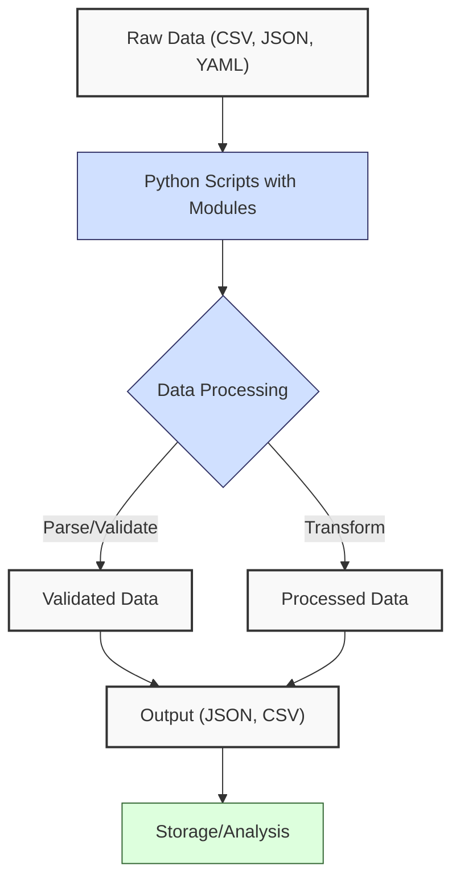
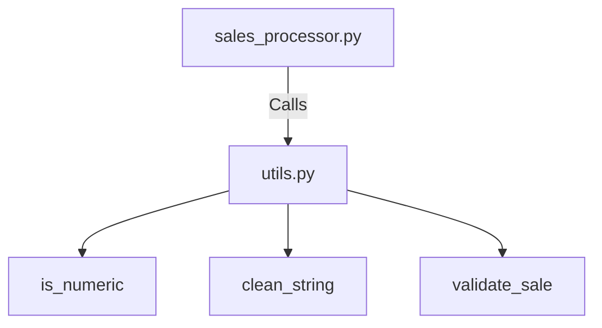
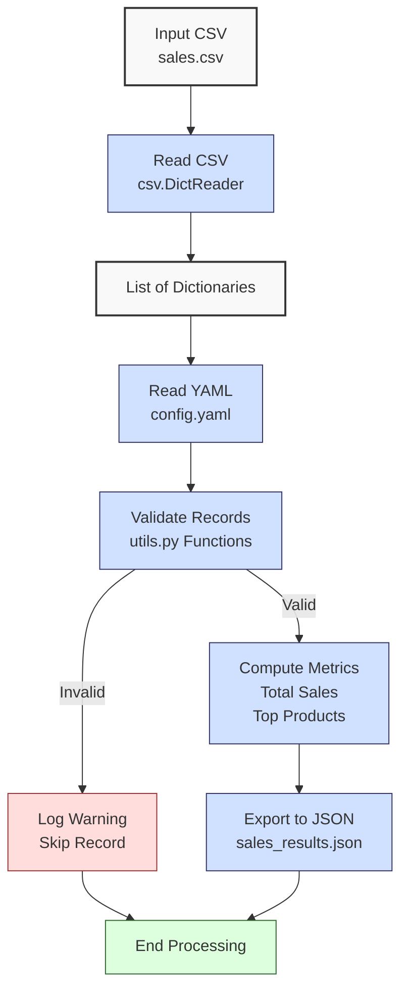

**Complexity: Easy (E)**

## 2.0 Introduction: Why This Matters for Data Engineering

In data engineering, robust data handling is critical for processing financial transaction data, such as sales records at Hijra Group. This chapter builds on Chapter 1’s Python fundamentals (data types, control flow, functions, scope) to introduce **file handling**, **CSV/JSON/YAML processing**, **Python modules**, **string manipulation**, and **basic debugging**. These skills enable data engineers to ingest, validate, and transform data from various sources into formats suitable for pipelines, ensuring data integrity for Sharia-compliant fintech analytics.

At Hijra Group, data engineers process sales data in CSVs, configure pipelines with YAML, and export results as JSON for downstream systems. This chapter focuses on parsing these formats, organizing code into reusable modules, and debugging issues using print statements, as advanced error handling (try/except, context managers) and type annotations are introduced later (Chapters 7 and 9). All code adheres to **PEP 8’s 4-space indentation** rule, using spaces over tabs to avoid `IndentationError` due to Python’s white-space sensitivity.

### Data Engineering Workflow Context

This diagram shows how file handling and modules fit into a data engineering workflow:



### Building On and Preparing For

- **Building On**: Extends Chapter 1’s lists, dictionaries, sets, functions, and loops for parsing structured data, applying string-based validation, and organizing code into modules with consistent 4-space indentation.
- **Preparing For**: Prepares for Chapter 3 (NumPy/Pandas) by introducing CSV processing and data validation, Chapter 5 (OOP) by organizing code into modules, and Chapter 7 (Static Typing) by establishing robust data handling patterns.

### What You’ll Learn

This chapter covers:

1. File handling for reading/writing CSVs, JSON, and YAML.
2. Python modules for reusable code organization (e.g., `utils.py`), including package setup with `__init__.py`.
3. String manipulation (e.g., `split`, `join`, `strip`) for data cleaning.
4. Basic debugging with print statements and a structured approach.
5. Creating and importing modules to reduce code duplication.

By the end, you’ll enhance the Chapter 1 sales data analyzer to process `data/sales.csv` using the `csv` module, load configurations from `data/config.yaml`, clean data with string operations, debug issues, and export results to `data/sales_results.json`, organized into modules for reusability, all with 4-space indentation per PEP 8.

**Follow-Along Tips**:

- Ensure `data/sales.csv` and `data/config.yaml` exist in `de-onboarding/data/`.
- If `IndentationError`, use **4 spaces** (not tabs) per PEP 8. Run `python -tt script.py` or use VS Code’s Pylint to detect tab/space mixing.
- Use print statements (e.g., `print(row)`) to debug parsing or validation issues.
- Read comments to understand each function’s logic.
- Mermaid diagrams require a compatible renderer (e.g., VS Code’s Markdown Preview Enhanced). Ensure support for Mermaid v10+ `flowchart` syntax.

## 2.1 File Handling

File handling involves reading from and writing to files like CSVs, JSON, and YAML, critical for data ingestion and output in pipelines. For a 1 million-row CSV, loading into memory may consume \~100MB, highlighting the need for streaming in large-scale systems (Chapter 40).

### 2.1.1 Reading and Writing Files

Read a CSV manually and write results to a text file, using explicit `open`/`close` to avoid context managers (introduced in Chapter 7).

```python
# Read a simple CSV file manually
file = open("data/sample.csv", "r")  # Open CSV in read mode
lines = file.readlines()  # Read all lines into a list
file.close()  # Close file to free resources
print("CSV Lines:", lines)  # Debug: print lines

# Write results to a text file
results = ["Total Sales: $1000.00", "Records: 5"]  # Sample results
file = open("data/results.txt", "w")  # Open file in write mode
for line in results:  # Loop through results
    file.write(line + "\n")  # Write each line with newline
file.close()  # Close file
print("Wrote to data/results.txt")  # Confirm write operation

# Expected Output (assuming data/sample.csv exists):
# CSV Lines: ['product,price,quantity\n', 'Halal Laptop,999.99,2\n']
# Wrote to data/results.txt
```

**Follow-Along Instructions**:

1. Ensure `de-onboarding/data/` exists from Chapter 1.

2. Create `data/sample.csv` with:

   ```csv
   product,price,quantity
   Halal Laptop,999.99,2
   ```

3. Save code as `de-onboarding/file_handling.py`.

4. Configure editor for **4-space indentation** (not tabs) per PEP 8. In VS Code, set “Editor: Tab Size” to 4, “Editor: Insert Spaces” to true, “Editor: Detect Indentation” to false.

5. Run: `python file_handling.py`.

6. Verify `data/results.txt` contains:

   ```
   Total Sales: $1000.00
   Records: 5
   ```

7. **Common Errors**:

   - **FileNotFoundError**: Ensure `data/sample.csv` exists. Check path with `print("data/sample.csv")`. Run `pwd` (Unix) or `cd` (Windows) to verify directory.
   - **IndentationError**: Use 4 spaces (not tabs). Run `python -tt file_handling.py` to detect tab/space mixing.
   - **PermissionError**: Ensure write permissions for `data/`. Check with `ls -l data/` (Unix) or `dir data\` (Windows).

**Key Points**:

- **White-Space Sensitivity and PEP 8**: Indentation (4 spaces per PEP 8) defines loop bodies for file writing. Spaces are preferred over tabs to avoid `IndentationError`.
- `open(path, mode)`: Modes are `"r"` (read), `"w"` (write).
- `readlines()`: Reads all lines into a list.
- `write()`: Writes strings to a file.
- **Underlying Implementation**: Files are buffered streams; `close()` flushes buffers.
- **Performance Considerations**:
  - **Time Complexity**: O(n) for reading/writing n lines.
  - **Space Complexity**: O(n) for storing lines in memory (e.g., \~100MB for 1M rows).
  - **Implication**: Suitable for small files; large files need streaming (Chapter 40) for Hijra Group’s transaction datasets.

### 2.1.2 CSV Processing with `csv` Module

Use the `csv` module to parse CSVs robustly, handling commas within fields and validating headers.

```python
import csv  # Import csv module for CSV parsing

# Read CSV into a list of dictionaries
sales = []  # Initialize empty list
print("Opening data/sales.csv")  # Debug: print path
file = open("data/sales.csv", "r")  # Open CSV in read mode
reader = csv.DictReader(file)  # Create DictReader to parse rows as dictionaries
# Validate headers
expected_headers = {"product", "price", "quantity"}  # Required headers
if not reader.fieldnames or set(reader.fieldnames) != expected_headers:  # Check headers
    print(f"Invalid headers: {reader.fieldnames}, expected: {expected_headers}")  # Log error
    file.close()  # Close file
    return []  # Return empty list for invalid headers
for row in reader:  # Iterate over rows
    print("Parsed row:", row)  # Debug: print each row
    sales.append(row)  # Add row dictionary to list
file.close()  # Close file
print("Read", len(sales), "records")  # Confirm record count

# Expected Output (with data/sales.csv from Chapter 1):
# Opening data/sales.csv
# Parsed row: {'product': 'Halal Laptop', 'price': '999.99', 'quantity': '2'}
# Parsed row: {'product': 'Halal Mouse', 'price': '24.99', 'quantity': '10'}
# ...
# Read 6 records
```

**Follow-Along Instructions**:

1. Ensure `data/sales.csv` exists from Chapter 1.
2. Save as `de-onboarding/csv_parsing.py`.
3. Configure editor for 4-space indentation (not tabs) per PEP 8.
4. Run: `python csv_parsing.py`.
5. Verify output shows 6 records with parsed rows.
6. **Common Errors**:
   - **KeyError**: Ensure CSV has `product`, `price`, `quantity` headers. Print `reader.fieldnames` to verify.
   - **IndentationError**: Use 4 spaces (not tabs). Run `python -tt csv_parsing.py`.

**Key Points**:

- `csv.DictReader`: Parses CSV rows into dictionaries using headers.
- Header validation ensures correct data structure.
- Handles commas within fields (e.g., `"Halal Product, Special"`).
- **Underlying Implementation**: Streams rows, parsing with C-based logic.
- **Performance Considerations**:
  - **Time Complexity**: O(n) for n rows.
  - **Space Complexity**: O(n) for storing rows (e.g., \~10MB for 100K rows).
  - **Implication**: More robust than manual parsing for pipeline inputs.

## 2.2 JSON and YAML Processing

Process JSON for data exchange and YAML for configurations, common in Hijra Group’s pipelines. A large JSON file (e.g., 1GB) may require significant memory, necessitating streaming in production (Chapter 40).

### 2.2.1 JSON Processing

Read and write JSON files for structured data output.

```python
import json  # Import json module for JSON processing

# Read JSON file
file = open("data/sample.json", "r")  # Open JSON in read mode
data = json.load(file)  # Parse JSON into Python object
file.close()  # Close file
print("Loaded JSON:", data)  # Debug: print data

# Write JSON file
results = {
    "total_sales": 2249.97,
    "records": 3
}  # Sample results
file = open("data/results.json", "w")  # Open file in write mode
json.dump(results, file, indent=2)  # Write JSON with 2-space indentation
file.close()  # Close file
print("Wrote to data/results.json")  # Confirm write operation

# Expected Output (assuming data/sample.json exists):
# Loaded JSON: {'sales': [{'product': 'Halal Laptop', 'price': 999.99}]}
# Wrote to data/results.json
```

**Follow-Along Instructions**:

1. Create `data/sample.json` with:

   ```json
   {
     "sales": [{ "product": "Halal Laptop", "price": 999.99 }]
   }
   ```

2. Save code as `de-onboarding/json_processing.py`.

3. Configure editor for 4-space indentation (not tabs) per PEP 8.

4. Run: `python json_processing.py`.

5. Verify `data/results.json` contains:

   ```json
   {
     "total_sales": 2249.97,
     "records": 3
   }
   ```

6. **Common Errors**:

   - **JSONDecodeError**: Ensure valid JSON syntax. Print file content to debug.
   - **IndentationError**: Use 4 spaces (not tabs). Run `python -tt json_processing.py`.

**Key Points**:

- `json.load()`: Parses JSON into Python objects (e.g., dictionaries).
- `json.dump()`: Serializes Python objects to JSON.
- **Underlying Implementation**: Uses C-based parsing for efficiency.
- **Performance Considerations**:
  - **Time Complexity**: O(n) for parsing/serializing n bytes.
  - **Space Complexity**: O(n) for loaded data (e.g., \~1GB for a 1GB file).
  - **Implication**: Ideal for API outputs in pipelines.

### 2.2.2 YAML Processing with PyYAML

Read YAML configurations for pipeline settings.

```python
import yaml  # Import PyYAML for YAML processing

# Read YAML file
print("Opening data/config.yaml")  # Debug: print path
file = open("data/config.yaml", "r")  # Open YAML in read mode
config = yaml.safe_load(file)  # Parse YAML into Python dictionary
file.close()  # Close file
print("Loaded YAML:", config)  # Debug: print config

# Expected Output (with data/config.yaml from Chapter 1):
# Opening data/config.yaml
# Loaded YAML: {'min_price': 10.0, 'max_quantity': 100, 'required_fields': ['product', 'price', 'quantity'], 'product_prefix': 'Halal', 'max_decimals': 2}
```

**Follow-Along Instructions**:

1. Ensure `data/config.yaml` exists from Chapter 1.
2. Install PyYAML: `pip install pyyaml`.
3. Save as `de-onboarding/yaml_processing.py`.
4. Configure editor for 4-space indentation (not tabs) per PEP 8.
5. Run: `python yaml_processing.py`.
6. Verify output shows config dictionary.
7. **Common Errors**:
   - **ModuleNotFoundError**: Run `pip install pyyaml`.
   - **IndentationError**: Use 4 spaces (not tabs). Run `python -tt yaml_processing.py`.

**Key Points**:

- `yaml.safe_load()`: Safely parses YAML into Python objects.
- **Underlying Implementation**: Python-based parser, slower than JSON.
- **Performance Considerations**:
  - **Time Complexity**: O(n) for n bytes.
  - **Space Complexity**: O(n) for loaded data.
  - **Implication**: Suitable for configuration files in pipelines.

## 2.3 Python Modules

Modules organize code into reusable `.py` files, reducing duplication and improving maintainability. The diagram below shows how a main script interacts with a utility module:



### 2.3.1 Creating and Importing Modules

Create a `utils.py` module with validation logic and import it.

```python
# File: de-onboarding/utils.py
def is_numeric(s, max_decimals=2):  # Check if string is a decimal number
    """Check if string is a decimal number with up to max_decimals."""
    parts = s.split(".")  # Split on decimal point
    if len(parts) != 2 or not parts[0].isdigit() or not parts[1].isdigit():
        return False  # Invalid format
    return len(parts[1]) <= max_decimals  # Check decimal places

# File: de-onboarding/module_example.py
import utils  # Import utils module

# Use the module function
price = "999.99"  # Sample price
if utils.is_numeric(price, max_decimals=2):  # Call module function
    print(f"{price} is numeric")  # Output if valid
else:
    print(f"{price} is not numeric")  # Output if invalid

# Expected Output:
# 999.99 is numeric
```

**Follow-Along Instructions**:

1. Create `de-onboarding/utils.py` with the above code.
2. Save `module_example.py` in `de-onboarding/`.
3. Configure editor for 4-space indentation (not tabs) per PEP 8.
4. Run: `python module_example.py`.
5. Verify output: `999.99 is numeric`.
6. **Common Errors**:
   - **ModuleNotFoundError**: Ensure `utils.py` is in `de-onboarding/`. Check with `ls` (Unix) or `dir` (Windows).
   - **IndentationError**: Use 4 spaces in both files. Run `python -tt module_example.py`.

### 2.3.2 Understanding `__init__.py` for Packages

An `__init__.py` file is a special Python file used to mark a directory as a Python package. It can be empty or contain initialization code for the package. When a directory has an `__init__.py` file, Python treats it as a module, allowing you to import modules or subpackages from it using dot notation (e.g., `from mypackage import mymodule`).

**Key Points**:

- Enables package organization and imports, critical for large-scale pipelines at Hijra Group.
- Can define package-level variables, functions, or execute setup code.
- In Python 3.3+, directories without `__init__.py` can be treated as implicit namespace packages, but including it is standard for explicit packages.

**Example**:

```python
# Directory structure:
# de-onboarding/
#   mypackage/
#     __init__.py
#     utils.py
#   module_example.py

# File: de-onboarding/mypackage/__init__.py
# Empty file to mark mypackage as a package

# File: de-onboarding/mypackage/utils.py
def is_numeric(s):  # Simple function
    """Check if string is a decimal number."""
    parts = s.split(".")  # Split on decimal point
    return len(parts) == 2 and parts[0].isdigit() and parts[1].isdigit()

# File: de-onboarding/module_example.py
from mypackage import utils  # Import utils from package

price = "999.99"  # Sample price
if utils.is_numeric(price):  # Call function
    print(f"{price} is numeric")  # Output if valid

# Expected Output:
# 999.99 is numeric
```

**Follow-Along Instructions**:

1. Create `de-onboarding/mypackage/` and an empty `de-onboarding/mypackage/__init__.py`.
2. Create `de-onboarding/mypackage/utils.py` and `de-onboarding/module_example.py`.
3. Configure editor for 4-space indentation (not tabs) per PEP 8.
4. Run: `python module_example.py`.
5. Verify output: `999.99 is numeric`.
6. **Common Errors**:
   - **ModuleNotFoundError**: Ensure `__init__.py` exists in `mypackage/`. Check directory structure with `ls` or `dir`.

**Key Points**:

- Modules: `.py` files containing functions, classes, etc.
- Packages: Directories with `__init__.py`, enabling structured imports.
- `import`: Loads module or package functions into scope.
- **Underlying Implementation**: Modules and packages are cached after first import.
- **Performance Considerations**:
  - **Time Complexity**: O(1) for function calls.
  - **Space Complexity**: O(m) for module/package code.
  - **Implication**: Modules and packages enhance code reuse and organization in Hijra Group’s pipeline scripts.

## 2.4 String Manipulation

String operations clean and validate data, building on Chapter 1’s string basics. Repeated string operations on large datasets (e.g., 1M records) can be slow, requiring optimization in production (Chapter 34).

### 2.4.1 String Operations

Use `split`, `join`, `strip`, and `startswith` for data cleaning.

```python
# Clean and validate a CSV line
line = "  Halal Laptop , 999.99 , 2  "  # Sample CSV line with extra spaces
fields = [field.strip() for field in line.split(",")]  # Split and strip fields
print("Cleaned fields:", fields)  # Debug: print fields

# Validate product name
product = fields[0]  # Extract product
if product.startswith("Halal"):  # Check Halal prefix
    print("Valid product:", product)  # Output if valid
else:
    print("Invalid product:", product)  # Output if invalid

# Join fields back into a string
cleaned_line = ",".join(fields)  # Join fields with comma
print("Cleaned line:", cleaned_line)  # Output cleaned line

# Expected Output:
# Cleaned fields: ['Halal Laptop', '999.99', '2']
# Valid product: Halal Laptop
# Cleaned line: Halal Laptop,999.99,2
```

**Follow-Along Instructions**:

1. Save as `de-onboarding/string_manipulation.py`.
2. Configure editor for 4-space indentation (not tabs) per PEP 8.
3. Run: `python string_manipulation.py`.
4. Verify output matches comments.
5. **Common Errors**:
   - **IndexError**: Ensure `split` produces enough fields. Print `fields` to debug.
   - **IndentationError**: Use 4 spaces (not tabs). Run `python -tt string_manipulation.py`.

**Key Points**:

- `strip()`: Removes leading/trailing whitespace.
- `split()`: Splits strings into lists.
- `join()`: Combines lists into strings.
- `startswith()`: Checks string prefixes.
- **Underlying Implementation**: Strings are immutable, operations create new strings.
- **Performance Considerations**:
  - **Time Complexity**: O(n) for n characters.
  - **Space Complexity**: O(n) for new strings.
  - **Implication**: Efficient for small datasets; optimize for large strings (Chapter 34).

## 2.5 Basic Debugging

Use print statements to debug parsing and validation issues, as try/except is not yet introduced. Follow this **debugging checklist** to systematically identify issues:

- **File Operations**: Print file paths before opening (e.g., `print(f"Opening: {path}")`).
- **Data Parsing**: Print parsed data (e.g., CSV rows, JSON objects) to verify structure.
- **Validation**: Print input data before validation (e.g., `print(f"Validating: {sale}")`).
- **Loop Iterations**: Print loop variables to track progress (e.g., `print(f"Processing row {i}: {row}")`).
- **Outputs**: Print intermediate results (e.g., `print(f"Total so far: {total}")`).

```python
# Debug a CSV parsing function
def parse_csv(file_path):  # Takes a file path
    """Parse CSV with debugging."""
    print(f"Opening file: {file_path}")  # Debug: print file path
    file = open(file_path, "r")  # Open file
    lines = file.readlines()  # Read lines
    file.close()  # Close file
    print(f"Read {len(lines)} lines")  # Debug: print line count
    if not lines:  # Check for empty file
        print("Empty file")  # Log empty file
        return []  # Return empty list
    for i, line in enumerate(lines):  # Loop through lines
        print(f"Processing line {i}: {line.strip()}")  # Debug: print each line
        fields = line.strip().split(",")  # Split line
        print(f"Parsed fields: {fields}")  # Debug: print fields
    return lines  # Return lines for simplicity

# Test the function
parse_csv("data/sample.csv")  # Call with sample CSV

# Expected Output:
# Opening file: data/sample.csv
# Read 2 lines
# Processing line 0: product,price,quantity
# Parsed fields: ['product', 'price', 'quantity']
# Processing line 1: Halal Laptop,999.99,2
# Parsed fields: ['Halal Laptop', '999.99', '2']
```

**Follow-Along Instructions**:

1. Ensure `data/sample.csv` exists from Section 2.1.1.
2. Save as `de-onboarding/debugging.py`.
3. Configure editor for 4-space indentation (not tabs) per PEP 8.
4. Run: `python debugging.py`.
5. Verify output shows file path, line count, and parsed fields.
6. **Common Errors**:
   - **FileNotFoundError**: Check file path. Print `file_path` to verify.
   - **IndentationError**: Use 4 spaces (not tabs). Run `python -tt debugging.py`.

**Key Points**:

- Print statements: Track variable values and program flow using the debugging checklist.
- **Underlying Implementation**: Print operations are I/O-bound.
- **Performance Considerations**:
  - **Time Complexity**: O(1) per print.
  - **Space Complexity**: O(1) for print buffers.
  - **Implication**: Effective for small scripts; use logging in production (Chapter 52).

## 2.6 Micro-Project: Enhanced Sales Data Processor

### Project Requirements

Enhance the Chapter 1 sales data analyzer to process financial transaction data for Hijra Group’s Sharia-compliant analytics by:

- Reading `data/sales.csv` using `csv.DictReader` with header validation.
- Loading configurations from `data/config.yaml` using PyYAML.
- Validating records with string-based checks in a reusable `utils.py` module, ensuring Halal products and compliance with Sharia rules (e.g., no interest-based products).
- Cleaning data using string operations.
- Computing total sales and top 3 products by sales.
- Exporting results to `data/sales_results.json`.
- Logging steps and invalid records to console using the debugging checklist.
- Using **4-space indentation** per PEP 8, preferring spaces over tabs.

**Note**: The “Halal” prefix validation ensures Sharia compliance by excluding non-compliant products, a critical requirement for Hijra Group’s fintech pipelines. In-memory loading limits scalability for large datasets (e.g., 1M transactions may use 100MB), addressed in Chapter 40.

### Sample Input Files

`data/sales.csv` (from Chapter 1):

```csv
product,price,quantity
Halal Laptop,999.99,2
Halal Mouse,24.99,10
Halal Keyboard,49.99,5
,29.99,3
Monitor,invalid,2
Headphones,5.00,150
```

`data/config.yaml` (updated for flexibility):

```yaml
min_price: 10.0
max_quantity: 100
required_fields:
  - product
  - price
  - quantity
product_prefix: 'Halal'
max_decimals: 2
```

### Data Processing Flow



### Acceptance Criteria

- **Go Criteria**:
  - Reads `sales.csv` and `config.yaml` correctly, validating CSV headers.
  - Validates records for required fields, non-empty product with configurable prefix, numeric price/quantity, and config rules using `utils.py`.
  - Computes total sales and top 3 products by sales.
  - Exports results to `data/sales_results.json`.
  - Logs steps and invalid records to console using debugging checklist.
  - Uses 4-space indentation per PEP 8, preferring spaces over tabs.
- **No-Go Criteria**:
  - Fails to process valid CSV/YAML or validate headers.
  - Incorrect validation or calculations.
  - Missing JSON export or logging.
  - Uses try/except or context managers.
  - Inconsistent indentation or tab/space mixing.

### Common Pitfalls to Avoid

1. **Incorrect CSV Parsing**:
   - **Problem**: `csv.DictReader` misreads headers or fields.
   - **Solution**: Print `reader.fieldnames` and rows to verify. Check headers with `set(reader.fieldnames)`.
2. **Missing Validation**:
   - **Problem**: Omitting checks causes calculation errors.
   - **Solution**: Use `utils.py` functions for all validations. Print `sale` before validation.
3. **Type Errors**:
   - **Problem**: Treating CSV strings as numbers.
   - **Solution**: Convert to float/int after validation. Print `sale["price"]` to debug.
4. **Module Import Errors**:
   - **Problem**: `utils.py` not found.
   - **Solution**: Ensure `utils.py` is in `de-onboarding/`. Print `import utils` to debug.
5. **Invalid JSON**:
   - **Problem**: Non-serializable data in `json.dump`.
   - **Solution**: Use Python types (e.g., lists, not sets). Print `results` before export.
6. **Inconsistent Indentation**:
   - **Problem**: `IndentationError` from mixed spaces/tabs.
   - **Solution**: Use 4 spaces per PEP 8. Run `python -tt sales_processor.py`.

### How This Differs from Production

In production, this solution would include:

- **Error Handling**: Try/except for robust errors (Chapter 7).
- **Type Safety**: Type annotations with Pyright (Chapter 7).
- **Testing**: Unit tests with `pytest` (Chapter 9).
- **Scalability**: Streaming for large CSVs (Chapter 40).
- **Logging**: File-based logging (Chapter 52).
- **Validation**: Support for complex formats (Chapter 7).

### Implementation

```python
# File: de-onboarding/utils.py
# Utility functions for validation and string cleaning
def is_numeric(s, max_decimals=2):  # Check if string is a decimal number
    """Check if string is a decimal number with up to max_decimals."""
    parts = s.split(".")  # Split on decimal point
    if len(parts) != 2 or not parts[0].isdigit() or not parts[1].isdigit():
        return False  # Invalid format
    return len(parts[1]) <= max_decimals  # Check decimal places

def clean_string(s):  # Clean string by stripping whitespace
    """Strip whitespace from string."""
    return s.strip()

def validate_sale(sale, config):  # Validate a sale dictionary
    """Validate sale based on config rules."""
    required_fields = config["required_fields"]  # Get required fields
    min_price = config["min_price"]  # Get minimum price
    max_quantity = config["max_quantity"]  # Get maximum quantity
    prefix = config["product_prefix"]  # Get product prefix
    max_decimals = config["max_decimals"]  # Get max decimal places

    print(f"Validating sale: {sale}")  # Debug: print sale
    # Check for missing or empty fields
    for field in required_fields:  # Loop through required fields
        if not sale[field] or sale[field].strip() == "":  # Check if field is empty
            print(f"Invalid sale: missing {field}: {sale}")  # Log invalid
            return False

    # Validate product: non-empty and matches prefix
    product = clean_string(sale["product"])  # Clean product string
    if not product.startswith(prefix):  # Check prefix
        print(f"Invalid sale: product lacks '{prefix}' prefix: {sale}")  # Log invalid
        return False

    # Validate price: numeric and meets minimum
    price = clean_string(sale["price"])  # Clean price string
    if not is_numeric(price, max_decimals) or float(price) < min_price:  # Check format and value
        print(f"Invalid sale: invalid price: {sale}")  # Log invalid
        return False

    # Validate quantity: integer and within limit
    quantity = clean_string(sale["quantity"])  # Clean quantity string
    if not quantity.isdigit() or int(quantity) > max_quantity:  # Check format and limit
        print(f"Invalid sale: invalid quantity: {sale}")  # Log invalid
        return False

    return True  # Return True if all checks pass

# File: de-onboarding/sales_processor.py
import csv  # For CSV parsing
import json  # For JSON export
import yaml  # For YAML parsing
import utils  # Import custom utils module

# Define function to read YAML configuration
def read_config(config_path):  # Takes config file path
    """Read YAML configuration."""
    print(f"Opening config: {config_path}")  # Debug: print path
    file = open(config_path, "r")  # Open YAML
    config = yaml.safe_load(file)  # Parse YAML
    file.close()  # Close file
    print(f"Loaded config: {config}")  # Debug: print config
    return config  # Return config dictionary

# Define function to read sales CSV
def read_sales_data(csv_path):  # Takes CSV file path
    """Read sales CSV using csv.DictReader with header validation."""
    sales = []  # Initialize empty list
    print(f"Opening CSV: {csv_path}")  # Debug: print path
    file = open(csv_path, "r")  # Open CSV
    reader = csv.DictReader(file)  # Create DictReader
    # Validate headers
    expected_headers = {"product", "price", "quantity"}  # Required headers
    if not reader.fieldnames or set(reader.fieldnames) != expected_headers:
        print(f"Invalid headers: {reader.fieldnames}, expected: {expected_headers}")  # Log error
        file.close()  # Close file
        return []  # Return empty list
    print(f"CSV headers: {reader.fieldnames}")  # Debug: print headers
    for row in reader:  # Iterate over rows
        print(f"Parsed row: {row}")  # Debug: print row
        sales.append(row)  # Add row to list
    file.close()  # Close file
    if not sales:  # Check for empty CSV
        print("Empty CSV file")  # Log empty file
    print(f"Read {len(sales)} records")  # Confirm record count
    return sales  # Return sales list

# Define function to process sales data
def process_sales(sales, config):  # Takes sales list and config
    """Process sales: validate, compute total, find top products."""
    total_sales = 0.0  # Initialize total
    unique_products = set()  # Initialize set for products
    valid_sales = 0  # Count valid sales
    sales_by_product = {}  # Track sales by product

    for i, sale in enumerate(sales):  # Loop through sales
        print(f"Processing sale {i}: {sale}")  # Debug: print sale index
        if utils.validate_sale(sale, config):  # Validate using utils
            price = float(utils.clean_string(sale["price"]))  # Convert price
            quantity = int(utils.clean_string(sale["quantity"]))  # Convert quantity
            amount = price * quantity  # Compute amount
            print(f"Valid sale: {sale} Amount: {amount}")  # Debug: print amount
            total_sales += amount  # Add to total
            unique_products.add(sale["product"])  # Add product
            # Update sales by product
            product = sale["product"]  # Get product name
            sales_by_product[product] = sales_by_product.get(product, 0) + amount
            valid_sales += 1  # Increment valid count
        print(f"Total sales so far: {total_sales}")  # Debug: print running total

    # Find top 3 products by sales
    top_products = dict(sorted(sales_by_product.items(), key=lambda x: x[1], reverse=True)[:3])

    print(f"Valid sales: {valid_sales} records")  # Log valid count
    return {
        "total_sales": total_sales,  # Total sales
        "unique_products": list(unique_products),  # List of products
        "top_products": top_products  # Top 3 products
    }, valid_sales, len(sales)  # Return results and counts

# Define function to export results
def export_results(results, json_path):  # Takes results and file path
    """Export results to JSON."""
    print(f"Writing to: {json_path}")  # Debug: print path
    print(f"Results: {results}")  # Debug: print results
    file = open(json_path, "w")  # Open JSON file
    json.dump(results, file, indent=2)  # Write JSON
    file.close()  # Close file
    print(f"Exported results to {json_path}")  # Confirm export

# Define main function
def main():  # No parameters
    """Main function to process sales data."""
    csv_path = "data/sales.csv"  # CSV path
    config_path = "data/config.yaml"  # YAML path
    json_path = "data/sales_results.json"  # JSON output path

    config = read_config(config_path)  # Read config
    sales = read_sales_data(csv_path)  # Read sales
    results, valid_sales, total_records = process_sales(sales, config)  # Process
    export_results(results, json_path)  # Export results
    # Output report
    print("\nSales Report:")  # Print header
    print(f"Total Records Processed: {total_records}")  # Total records
    print(f"Valid Sales: {valid_sales}")  # Valid count
    print(f"Invalid Sales: {total_records - valid_sales}")  # Invalid count
    print(f"Total Sales: ${round(results['total_sales'], 2)}")  # Total sales
    print(f"Unique Products: {results['unique_products']}")  # Products
    print(f"Top Products: {results['top_products']}")  # Top products
    print("Processing completed")  # Confirm completion

if __name__ == "__main__":
    main()  # Run main function
```

### Expected Outputs

`data/sales_results.json`:

```json
{
  "total_sales": 2249.97,
  "unique_products": ["Halal Laptop", "Halal Mouse", "Halal Keyboard"],
  "top_products": {
    "Halal Laptop": 1999.98,
    "Halal Mouse": 249.9,
    "Halal Keyboard": 249.95
  }
}
```

**Console Output** (abridged for clarity):

```
Opening config: data/config.yaml
Loaded config: {'min_price': 10.0, 'max_quantity': 100, 'required_fields': ['product', 'price', 'quantity'], 'product_prefix': 'Halal', 'max_decimals': 2}
Opening CSV: data/sales.csv
CSV headers: ['product', 'price', 'quantity']
Parsed row: {'product': 'Halal Laptop', 'price': '999.99', 'quantity': '2'}
...
Read 6 records
Processing sale 0: {'product': 'Halal Laptop', 'price': '999.99', 'quantity': '2'}
Validating sale: {'product': 'Halal Laptop', 'price': '999.99', 'quantity': '2'}
Valid sale: {'product': 'Halal Laptop', 'price': '999.99', 'quantity': '2'} Amount: 1999.98
...
Invalid sale: missing product: {'product': '', 'price': '29.99', 'quantity': '3'}
...
Valid sales: 3 records
Writing to: data/sales_results.json
Exported results to data/sales_results.json
Sales Report:
Total Records Processed: 6
Valid Sales: 3
Invalid Sales: 3
Total Sales: $2249.97
Unique Products: ['Halal Laptop', 'Halal Mouse', 'Halal Keyboard']
Top Products: {'Halal Laptop': 1999.98, 'Halal Mouse': 249.9, 'Halal Keyboard': 249.95}
Processing completed
```

### How to Run and Test

1. **Setup**:

   - **Setup Checklist**:
     - \[ \] Create `de-onboarding/` folder.
     - \[ \] Create `data/` subfolder (`de-onboarding/data/`).
     - \[ \] Copy `sales.csv` and `config.yaml` to `data/`.
     - \[ \] Install PyYAML: `pip install pyyaml`.
     - \[ \] Create virtual environment: `python -m venv venv`, activate (Windows: `venv\Scripts\activate`, Unix/macOS: `source venv/bin/activate`).
     - \[ \] Verify Python 3.10+: `python --version`.
     - \[ \] Configure editor for 4-space indentation (VS Code: “Editor: Tab Size” = 4, “Editor: Insert Spaces” = true, “Editor: Detect Indentation” = false).
     - \[ \] Check `data/` permissions: `ls -l data/` (Unix) or `dir data\` (Windows).
     - \[ \] Save `utils.py` and `sales_processor.py` in `de-onboarding/`.
   - **Troubleshooting**:
     - If `FileNotFoundError`, run `pwd` (Unix) or `cd` (Windows) to verify directory.
     - If permission errors, ensure write access to `data/`.
     - If `ModuleNotFoundError`, check `utils.py` path or install `pyyaml`.

2. **Run**:

   - Open terminal in `de-onboarding/`.
   - Run: `python sales_processor.py`.
   - Outputs: `data/sales_results.json`, console logs.

3. **Test Scenarios**:

   - **Valid Data**: Verify `sales_results.json` shows `total_sales: 2249.97`, correct top products.

     ```python
     import json
     file = open("data/sales_results.json", "r")
     results = json.load(file)
     file.close()
     print(results)
     # Expected: {'total_sales': 2249.97, ...}
     ```

   - **Invalid Records**: Check console for warnings on missing fields, non-Halal products, invalid price/quantity.

   - **Empty CSV**: Create `data/empty.csv` with `product,price,quantity\n` and run:

     ```python
     sales = read_sales_data("data/empty.csv")
     config = read_config("data/config.yaml")
     results, valid_sales, total_records = process_sales(sales, config)
     print(results, valid_sales, total_records)
     # Expected: {'total_sales': 0.0, 'unique_products': [], 'top_products': {}}, 0, 0
     ```

   - **Invalid Headers**: Create `data/invalid.csv` with `name,price,quantity\n` and run:

     ```python
     sales = read_sales_data("data/invalid.csv")
     print(sales)
     # Expected: []
     ```

**Follow-Along Tips**:

- Ensure `utils.py` and `sales_processor.py` are in `de-onboarding/`.
- If `ModuleNotFoundError`, install `pyyaml` or check `utils.py` path.
- If `IndentationError`, use 4 spaces (not tabs). Run `python -tt sales_processor.py`.
- Print `row` in `read_sales_data` to debug parsing issues.

## 2.7 Practice Exercises

### Exercise 1: CSV Reader with Header Validation

Write a function to read a CSV into a list of dictionaries using `csv.DictReader`, validating headers, with 4-space indentation per PEP 8.

**Sample Input**:

`data/sample.csv`:

```csv
product,price,quantity
Halal Laptop,999.99,2
Halal Mouse,24.99,10
```

**Expected Output**:

```
[{'product': 'Halal Laptop', 'price': '999.99', 'quantity': '2'}, {'product': 'Halal Mouse', 'price': '24.99', 'quantity': '10'}]
```

**How to Test**:

- Add: `print(read_csv("data/sample.csv"))`.
- Verify output matches expected.
- Test with empty CSV: Should return `[]`.
- Test with invalid headers (`name,price,quantity`): Should return `[]`.
- **Common Errors**:
  - **FileNotFoundError**: Check file path. Print `file_path`.
  - **IndentationError**: Use 4 spaces (not tabs). Run `python -tt ex1_csv.py`.

**Follow-Along Instructions**:

1. Save as `de-onboarding/ex1_csv.py`.
2. Create `data/sample.csv`.
3. Configure editor for 4-space indentation per PEP 8.
4. Run: `python ex1_csv.py`.

### Exercise 2: YAML Config Loader

Write a function to load a YAML config file, checking for empty files, with 4-space indentation per PEP 8.

**Sample Input**:

`data/config.yaml`:

```yaml
min_price: 10.0
max_quantity: 100
```

**Expected Output**:

```
{'min_price': 10.0, 'max_quantity': 100}
```

**How to Test**:

- Add: `print(load_config("data/config.yaml"))`.
- Verify output matches expected.
- Test with empty YAML: Should return `{}`.
- **Common Errors**:
  - **ModuleNotFoundError**: Install `pyyaml`.
  - **IndentationError**: Use 4 spaces (not tabs). Run `python -tt ex2_yaml.py`.

**Follow-Along Instructions**:

1. Save as `de-onboarding/ex2_yaml.py`.
2. Create `data/config.yaml`.
3. Install PyYAML: `pip install pyyaml`.
4. Configure editor for 4-space indentation per PEP 8.
5. Run: `python ex2_yaml.py`.

### Exercise 3: String Cleaner

Write a function to clean a list of strings using `strip` and `join`, with 4-space indentation per PEP 8.

**Sample Input**:

```python
strings = ["  Halal Laptop  ", " 999.99 ", " 2  "]
```

**Expected Output**:

```
"Halal Laptop,999.99,2"
```

**How to Test**:

- Add: `print(clean_strings([" Halal Laptop ", " 999.99 ", " 2 "]))`.
- Verify output: `"Halal Laptop,999.99,2"`.
- Test with empty list: Should return `""`.
- **Common Errors**:
  - **TypeError**: Ensure inputs are strings.
  - **IndentationError**: Use 4 spaces (not tabs). Run `python -tt ex3_strings.py`.

**Follow-Along Instructions**:

1. Save as `de-onboarding/ex3_strings.py`.
2. Configure editor for 4-space indentation per PEP 8.
3. Run: `python ex3_strings.py`.

### Exercise 4: Module-Based Validator

Write a `utils.py` function to validate an inventory dataset with a different prefix and use it in a main script, with 4-space indentation per PEP 8.

**Sample Input**:

```python
item = {"product": "Stock Widget", "price": "49.99"}
config = {"required_fields": ["product", "price"], "product_prefix": "Stock", "max_decimals": 2}
```

**Expected Output**:

```
Valid item
True
```

**How to Test**:

- Add: `print(validate_sale({"product": "Stock Widget", "price": "49.99"}, config))`.
- Verify output: `Valid item`, `True`.
- Test with invalid prefix: Should return `False`.
- **Common Errors**:
  - **ModuleNotFoundError**: Ensure `utils.py` exists.
  - **IndentationError**: Use 4 spaces (not tabs). Run `python -tt ex4_validate.py`.

**Follow-Along Instructions**:

1. Save as `de-onboarding/ex4_validate.py` and use `utils.py` from micro-project.
2. Configure editor for 4-space indentation per PEP 8.
3. Run: `python ex4_validate.py`.

### Exercise 5: Debug a Parser

Fix this buggy CSV parser that fails with `KeyError` and `IndentationError`. Explain the issues, ensuring 4-space indentation per PEP 8.

**Buggy Code**:

```python
import csv
def parse_csv(file_path):
    sales = []  # Bug: Misaligned indentation
        file = open(file_path, "r")
        reader = csv.DictReader(file)
        for row in reader:
            sales.append(row["name"])  # Bug: Wrong key
        file.close()
    return sales

print(parse_csv("data/sample.csv"))  # KeyError and IndentationError
```

**Expected Output**:

```
[{'product': 'Halal Laptop', 'price': '999.99', 'quantity': '2'}, {'product': 'Halal Mouse', 'price': '24.99', 'quantity': '10'}]
```

**How to Test**:

- Run buggy code to observe errors.
- Apply fixes and verify output.
- Test with `data/sample.csv` from Exercise 1.
- **Common Errors**:
  - **KeyError**: Check `reader.fieldnames`.
  - **IndentationError**: Use 4 spaces (not tabs). Run `python -tt ex5_debug.py`.

**Follow-Along Instructions**:

1. Save as `de-onboarding/ex5_debug.py`.
2. Create `data/sample.csv`.
3. Configure editor for 4-space indentation per PEP 8.
4. Run: `python ex5_debug.py`.

### Exercise 6: Debug a Delimiter Issue

Fix this buggy CSV parser that uses the wrong delimiter (`;`), causing incorrect parsing. Explain the issue, ensuring 4-space indentation per PEP 8.

**Buggy Code**:

```python
import csv
def parse_csv(file_path):
    sales = []  # Initialize list
    file = open(file_path, "r")  # Open file
    reader = csv.DictReader(file, delimiter=";")  # Bug: Wrong delimiter
    for row in reader:  # Iterate rows
        sales.append(row)  # Add row
    file.close()  # Close file
    return sales

print(parse_csv("data/sample.csv"))  # Incorrect parsing
```

**Expected Output**:

```
[{'product': 'Halal Laptop', 'price': '999.99', 'quantity': '2'}, {'product': 'Halal Mouse', 'price': '24.99', 'quantity': '10'}]
```

**How to Test**:

- Run buggy code to observe incorrect parsing (e.g., single column).
- Apply fix (change delimiter to `,`) and verify output.
- Test with `data/sample.csv` from Exercise 1.
- **Common Errors**:
  - **KeyError**: Print `reader.fieldnames` to debug.
  - **IndentationError**: Use 4 spaces (not tabs). Run `python -tt ex6_delimiter.py`.

**Follow-Along Instructions**:

1. Save as `de-onboarding/ex6_delimiter.py`.
2. Create `data/sample.csv`.
3. Configure editor for 4-space indentation per PEP 8.
4. Run: `python ex6_delimiter.py`.

### Exercise 7: Fintech Validator

Write a function to validate a sale’s currency field (e.g., “IDR”) using `utils.py`, with 4-space indentation per PEP 8.

**Sample Input**:

```python
sale = {"product": "Halal Laptop", "price": "999.99", "currency": "IDR"}
config = {"required_fields": ["product", "price", "currency"], "product_prefix": "Halal", "max_decimals": 2, "valid_currencies": ["IDR", "USD"]}
```

**Expected Output**:

```
Valid sale
True
```

**How to Test**:

- Add: `print(validate_sale({"product": "Halal Laptop", "price": "999.99", "currency": "IDR"}, config))`.
- Verify output: `Valid sale`, `True`.
- Test with invalid currency: Should return `False`.
- **Common Errors**:
  - **KeyError**: Ensure `currency` in `sale`. Print `sale`.
  - **IndentationError**: Use 4 spaces (not tabs). Run `python -tt ex7_currency.py`.

**Follow-Along Instructions**:

1. Modify `utils.py` to support currency validation.
2. Save main script as `de-onboarding/ex7_currency.py`.
3. Configure editor for 4-space indentation per PEP 8.
4. Run: `python ex7_currency.py`.

### Exercise 8: Conceptual Analysis

Explain the benefits of using modules and when to use JSON vs. YAML in Hijra Group’s pipelines.

**Expected Output**:

- **Modules**: “Modules improve maintainability by organizing reusable code, reducing duplication in pipeline scripts.”
- **JSON vs. YAML**: “Use JSON for data exchange (e.g., API outputs) due to its simplicity and wide support. Use YAML for configurations (e.g., pipeline settings) due to its readability and support for complex structures.”

**How to Test**:

- Write answers in a text file or notebook.
- Compare with solutions in Section 2.8.
- **Common Errors**:
  - **Confusion**: Clarify JSON’s machine-readable focus vs. YAML’s human-readable design.

**Follow-Along Instructions**:

1. Save answers as `de-onboarding/ex8_concepts.txt`.
2. Review with peers or instructors.

## 2.8 Exercise Solutions

### Solution to Exercise 1: CSV Reader with Header Validation

```python
import csv  # Import csv module

def read_csv(file_path):  # Takes file path
    """Read CSV into list of dictionaries with header validation."""
    sales = []  # Initialize list
    print(f"Opening: {file_path}")  # Debug
    file = open(file_path, "r")  # Open file
    reader = csv.DictReader(file)  # Create DictReader
    expected_headers = {"product", "price", "quantity"}  # Required headers
    if not reader.fieldnames or set(reader.fieldnames) != expected_headers:
        print(f"Invalid headers: {reader.fieldnames}, expected: {expected_headers}")
        file.close()  # Close file
        return []  # Return empty list
    print(f"Headers: {reader.fieldnames}")  # Debug
    for row in reader:  # Iterate rows
        sales.append(row)  # Add row
    file.close()  # Close file
    if not sales:  # Check empty file
        print("Empty CSV file")  # Log empty
    return sales  # Return list

# Test the function
print(read_csv("data/sample.csv"))  # Call function

# Output:
# Opening: data/sample.csv
# Headers: ['product', 'price', 'quantity']
# [{'product': 'Halal Laptop', 'price': '999.99', 'quantity': '2'}, {'product': 'Halal Mouse', 'price': '24.99', 'quantity': '10'}]
```

### Solution to Exercise 2: YAML Config Loader

```python
import yaml  # Import PyYAML

def load_config(config_path):  # Takes config path
    """Load YAML configuration, checking for empty files."""
    print(f"Opening: {config_path}")  # Debug
    file = open(config_path, "r")  # Open file
    content = file.read()  # Read content
    file.close()  # Close file
    if not content.strip():  # Check for empty file
        print("Empty YAML file")  # Log empty
        return {}  # Return empty dict
    file = open(config_path, "r")  # Re-open for parsing
    config = yaml.safe_load(file)  # Parse YAML
    file.close()  # Close file
    print(f"Config: {config}")  # Debug
    return config or {}  # Return config or empty dict

# Test the function
print(load_config("data/config.yaml"))  # Call function

# Output:
# Opening: data/config.yaml
# Config: {'min_price': 10.0, 'max_quantity': 100}
# {'min_price': 10.0, 'max_quantity': 100}
```

### Solution to Exercise 3: String Cleaner

```python
def clean_strings(strings):  # Takes list of strings
    """Clean strings and join with commas."""
    cleaned = [s.strip() for s in strings]  # Strip each string
    print(f"Cleaned: {cleaned}")  # Debug
    return ",".join(cleaned)  # Join with comma

# Test the function
strings = ["  Halal Laptop  ", " 999.99 ", " 2  "]  # Sample input
print(clean_strings(strings))  # Call function

# Output:
# Cleaned: ['Halal Laptop', '999.99', '2']
# Halal Laptop,999.99,2
```

### Solution to Exercise 4: Module-Based Validator

```python
# File: de-onboarding/utils.py (from micro-project)
def is_numeric(s, max_decimals=2):  # Check if string is a decimal number
    """Check if string is a decimal number with up to max_decimals."""
    parts = s.split(".")  # Split on decimal point
    if len(parts) != 2 or not parts[0].isdigit() or not parts[1].isdigit():
        return False  # Invalid format
    return len(parts[1]) <= max_decimals  # Check decimal places

def clean_string(s):  # Clean string by stripping whitespace
    """Strip whitespace from string."""
    return s.strip()

def validate_sale(sale, config):  # Validate a sale dictionary
    """Validate sale based on config rules."""
    required_fields = config["required_fields"]  # Get required fields
    prefix = config["product_prefix"]  # Get product prefix
    max_decimals = config["max_decimals"]  # Get max decimal places

    print(f"Validating sale: {sale}")  # Debug: print sale
    # Check for missing or empty fields
    for field in required_fields:  # Loop through required fields
        if not sale[field] or sale[field].strip() == "":  # Check if field is empty
            print(f"Invalid sale: missing {field}: {sale}")  # Log invalid
            return False

    # Validate product: non-empty and matches prefix
    product = clean_string(sale["product"])  # Clean product string
    if not product.startswith(prefix):  # Check prefix
        print(f"Invalid sale: product lacks '{prefix}' prefix: {sale}")  # Log invalid
        return False

    # Validate price: numeric
    price = clean_string(sale["price"])  # Clean price string
    if not is_numeric(price, max_decimals):  # Check format
        print(f"Invalid sale: invalid price: {sale}")  # Log invalid
        return False

    return True  # Return True if all checks pass

# File: de-onboarding/ex4_validate.py
import utils  # Import utils module

# Test the function
item = {"product": "Stock Widget", "price": "49.99"}  # Sample item
config = {
    "required_fields": ["product", "price"],
    "product_prefix": "Stock",
    "max_decimals": 2
}  # Sample config
if utils.validate_sale(item, config):  # Call function
    print("Valid item")  # Output valid
print(utils.validate_sale(item, config))  # Print result

# Output:
# Validating sale: {'product': 'Stock Widget', 'price': '49.99'}
# Valid item
# Validating sale: {'product': 'Stock Widget', 'price': '49.99'}
# True
```

### Solution to Exercise 5: Debug a Parser

```python
import csv  # Import csv module

def parse_csv(file_path):  # Takes file path
    """Parse CSV into list of dictionaries."""
    sales = []  # Initialize list, aligned with def
    print(f"Opening: {file_path}")  # Debug
    file = open(file_path, "r")  # Open file
    reader = csv.DictReader(file)  # Create DictReader
    print(f"Headers: {reader.fieldnames}")  # Debug
    for row in reader:  # Iterate rows
        sales.append(row)  # Fix: Append entire row, not row["name"]
    file.close()  # Close file
    return sales  # Return list

# Test the function
print(parse_csv("data/sample.csv"))  # Call function

# Output:
# Opening: data/sample.csv
# Headers: ['product', 'price', 'quantity']
# [{'product': 'Halal Laptop', 'price': '999.99', 'quantity': '2'}, {'product': 'Halal Mouse', 'price': '24.99', 'quantity': '10'}]
```

**Explanation**:

- **IndentationError**: `sales = []` was misaligned, causing a syntax error. Fixed by aligning with `def` and using 4 spaces for the function body per PEP 8.
- **KeyError**: `row["name"]` referenced a non-existent key. Fixed by appending the entire `row` dictionary and verifying headers with `reader.fieldnames`.
- **Implication**: Always check CSV headers and use consistent 4-space indentation.

### Solution to Exercise 6: Debug a Delimiter Issue

```python
import csv  # Import csv module

def parse_csv(file_path):  # Takes file path
    """Parse CSV into list of dictionaries."""
    sales = []  # Initialize list
    print(f"Opening: {file_path}")  # Debug
    file = open(file_path, "r")  # Open file
    reader = csv.DictReader(file, delimiter=",")  # Fix: Use comma delimiter
    print(f"Headers: {reader.fieldnames}")  # Debug
    for row in reader:  # Iterate rows
        sales.append(row)  # Add row
    file.close()  # Close file
    return sales  # Return list

# Test the function
print(parse_csv("data/sample.csv"))  # Call function

# Output:
# Opening: data/sample.csv
# Headers: ['product', 'price', 'quantity']
# [{'product': 'Halal Laptop', 'price': '999.99', 'quantity': '2'}, {'product': 'Halal Mouse', 'price': '24.99', 'quantity': '10'}]
```

**Explanation**:

- **Delimiter Issue**: Using `;` instead of `,` caused incorrect parsing (e.g., single column). Fixed by setting `delimiter=","`, matching the CSV format.
- **Implication**: Always verify the CSV delimiter by inspecting the file or printing `reader.fieldnames`.

### Solution to Exercise 7: Fintech Validator

```python
# File: de-onboarding/utils.py (updated for Exercise 7)
def is_numeric(s, max_decimals=2):  # Check if string is a decimal number
    """Check if string is a decimal number with up to max_decimals."""
    parts = s.split(".")  # Split on decimal point
    if len(parts) != 2 or not parts[0].isdigit() or not parts[1].isdigit():
        return False  # Invalid format
    return len(parts[1]) <= max_decimals  # Check decimal places

def clean_string(s):  # Clean string by stripping whitespace
    """Strip whitespace from string."""
    return s.strip()

def validate_sale(sale, config):  # Validate a sale dictionary
    """Validate sale based on config rules, including currency."""
    required_fields = config["required_fields"]  # Get required fields
    prefix = config["product_prefix"]  # Get product prefix
    max_decimals = config["max_decimals"]  # Get max decimal places
    valid_currencies = config.get("valid_currencies", [])  # Get valid currencies

    print(f"Validating sale: {sale}")  # Debug: print sale
    # Check for missing or empty fields
    for field in required_fields:  # Loop through required fields
        if not sale[field] or sale[field].strip() == "":  # Check if field is empty
            print(f"Invalid sale: missing {field}: {sale}")  # Log invalid
            return False

    # Validate product: non-empty and matches prefix
    product = clean_string(sale["product"])  # Clean product string
    if not product.startswith(prefix):  # Check prefix
        print(f"Invalid sale: product lacks '{prefix}' prefix: {sale}")  # Log invalid
        return False

    # Validate price: numeric
    price = clean_string(sale["price"])  # Clean price string
    if not is_numeric(price, max_decimals):  # Check format
        print(f"Invalid sale: invalid price: {sale}")  # Log invalid
        return False

    # Validate currency if required
    if "currency" in required_fields:  # Check if currency is required
        currency = clean_string(sale["currency"])  # Clean currency string
        if currency not in valid_currencies:  # Check valid currencies
            print(f"Invalid sale: invalid currency '{currency}': {sale}")  # Log invalid
            return False

    print("Valid sale")  # Output valid
    return True  # Return True if all checks pass

# File: de-onboarding/ex7_currency.py
import utils  # Import utils module

# Test the function
sale = {"product": "Halal Laptop", "price": "999.99", "currency": "IDR"}  # Sample sale
config = {
    "required_fields": ["product", "price", "currency"],
    "product_prefix": "Halal",
    "max_decimals": 2,
    "valid_currencies": ["IDR", "USD"]
}  # Sample config
print(utils.validate_sale(sale, config))  # Call function

# Output:
# Validating sale: {'product': 'Halal Laptop', 'price': '999.99', 'currency': 'IDR'}
# Valid sale
# True
```

### Solution to Exercise 8: Conceptual Analysis

**Modules**:

- “Modules improve maintainability by organizing reusable code into separate files, reducing duplication in pipeline scripts. For example, `utils.py` centralizes validation logic, making it easier to update across multiple scripts at Hijra Group. Packages with `__init__.py` further structure code for large projects.”

**JSON vs. YAML**:

- “Use JSON for data exchange, such as API outputs, due to its simplicity, compact format, and wide support in programming languages. It’s ideal for sending processed sales data to downstream systems. Use YAML for configurations, like pipeline settings, due to its human-readable syntax and support for complex structures (e.g., nested lists). At Hijra Group, YAML is used for defining validation rules in `config.yaml`, while JSON is used for exporting results to `sales_results.json`.”

## 2.9 Chapter Summary and Connection to Chapter 3

In this chapter, you’ve mastered:

- **File Handling**: Reading/writing CSVs, JSON, YAML with O(n) time complexity, including header validation for robustness.
- **Python Modules**: Organizing reusable code in `utils.py` and packages with `__init__.py`, with O(1) function calls, visualized via diagrams.
- **String Manipulation**: Cleaning data with `strip`, `split`, `join`, O(n) per operation, applied to Sharia-compliant validation.
- **Debugging**: Using print statements with a checklist for systematic issue tracking, O(1) per print.
- **White-Space Sensitivity and PEP 8**: Using 4-space indentation, preferring spaces over tabs to avoid `IndentationError`.
- **Fintech Context**: Validating Halal products and currencies, aligning with Hijra Group’s Sharia-compliant pipelines.

The micro-project enhanced the Chapter 1 sales analyzer by using `csv.DictReader`, PyYAML, and a reusable `utils.py` module, improving parsing and modularity for transaction processing. It processes small datasets efficiently but is limited by in-memory loading (e.g., 1M rows may use 100MB), addressed in later chapters.

### Connection to Chapter 3

Chapter 3 introduces **NumPy and Pandas Basics**, building on this chapter:

- **CSV Processing**: Chapter 2’s CSV parsing with `csv.DictReader` is replaced by `pandas.read_csv` for efficient DataFrame creation, leveraging header validation skills.
- **Data Validation**: String-based validation from `utils.py` is adapted to Pandas DataFrames, e.g., `df["product"].str.startswith("Halal")`.
- **Modules**: Reusable functions in `utils.py` support Pandas operations, with `__init__.py` knowledge preparing for package-based code organization.
- **Debugging**: Print-based debugging prepares for inspecting DataFrame structures with `df.head()` and `df.info()`.
- **Fintech Context**: Chapter 2’s skills enable processing transaction CSVs, extended in Chapter 3 to analyze sales with NumPy/Pandas for Hijra Group’s analytics, maintaining PEP 8’s 4-space indentation for maintainable pipeline scripts.

The sales processor will be refactored in Chapter 3 to use NumPy/Pandas, adding visualization, while continuing to adhere to Python’s white-space sensitivity and PEP 8 standards.
