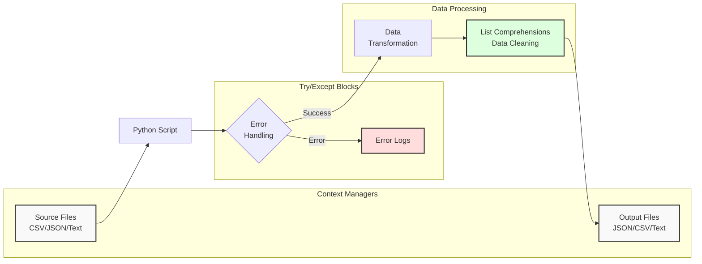

**Complexity: Easy (E)**

## 2.0 Introduction: Why This Matters for Data Engineering

As a data engineer, you'll spend much of your time moving data between systems, transforming it, and ensuring its quality. The skills in this chapter form the foundation of robust data pipelines:

- **File operations** are essential for ingesting data from sources and writing results to destinations
- **Error handling** is critical for building resilient data pipelines that don't fail completely when encountering bad data
- **List comprehensions** provide efficient ways to transform data in memory
- **Working with data formats** (CSV, JSON) is fundamental as these are common interchange formats between systems
- **Modules** from Python's standard library provide powerful tools that simplify common data tasks

Even as you progress to more advanced tools like Pandas, PostgreSQL, and BigQuery, these fundamental skills will remain relevant. Every data pipeline needs to handle potential errors gracefully, and understanding these basics will help you debug issues in more complex systems.

Let's visualize how these concepts fit into a basic data pipeline:



This diagram illustrates a typical data flow where you'll use context managers for file handling, try/except blocks for error handling, and list comprehensions for data transformations.

## 2.1 File Handling and Context Managers

As a data engineer, you'll frequently need to read and write files. Let's explore how to do this in Python.

### Basic File Reading

The most straightforward way to read a file is with the `open()` function:

```python
# Opening a file and reading all contents at once
file = open('sample_data.txt', 'r')  # 'r' means read mode
content = file.read()
print(f"File content: {content}")
file.close()  # Always remember to close the file!

# Output:
# File content: Hello, this is sample data.
# This file has multiple lines.
# We'll use it to practice file handling.
```

However, this approach has a critical flaw - if your code encounters an error before reaching `file.close()`, the file remains open, potentially causing resource leaks.

### Using Context Managers (with statement)

The better approach is to use a context manager with the `with` statement:

```python
# Using a context manager to read a file safely
with open('sample_data.txt', 'r') as file:
    content = file.read()
    print(f"File content using context manager: {content}")
# The file is automatically closed when the with block ends, even if errors occur!

# Output:
# File content using context manager: Hello, this is sample data.
# This file has multiple lines.
# We'll use it to practice file handling.
```

### Reading Files Line by Line

For large files, it's better to process them line by line:

```python
# Reading a file line by line
with open('sample_data.txt', 'r') as file:
    for line_number, line in enumerate(file, 1):
        print(f"Line {line_number}: {line.strip()}")  # strip() removes trailing newline

# Output:
# Line 1: Hello, this is sample data.
# Line 2: This file has multiple lines.
# Line 3: We'll use it to practice file handling.
```

### Writing to Files

Writing to files follows a similar pattern:

```python
# Writing to a file
with open('output.txt', 'w') as file:  # 'w' mode creates a new file or overwrites existing
    file.write("This is line 1.\n")
    file.write("This is line 2.\n")
    file.write("This is line 3.\n")

print("File has been written. Let's read it back:")

# Reading back the file we just wrote
with open('output.txt', 'r') as file:
    content = file.read()
    print(content)

# Output:
# File has been written. Let's read it back:
# This is line 1.
# This is line 2.
# This is line 3.
```

### Appending to Files

To add content to an existing file without overwriting:

```python
# Appending to a file
with open('output.txt', 'a') as file:  # 'a' means append mode
    file.write("This is line 4, added later.\n")
    file.write("This is line 5, also added later.\n")

print("File has been appended. Let's read it again:")

# Reading it back
with open('output.txt', 'r') as file:
    content = file.read()
    print(content)

# Output:
# File has been appended. Let's read it again:
# This is line 1.
# This is line 2.
# This is line 3.
# This is line 4, added later.
# This is line 5, also added later.
```

## 2.2 Error Handling with try/except

Even the best-written code can encounter errors. Rather than letting our program crash, we can handle exceptions gracefully.

### Basic try/except Structure

```python
# Basic try/except
try:
    # Code that might cause an error
    value = int(input("Enter a number: "))
    print(f"You entered: {value}")
except ValueError:
    # This runs if a ValueError occurs
    print("That wasn't a valid number!")

# Output (if user enters "abc"):
# Enter a number: abc
# That wasn't a valid number!
```

### Handling Specific Exceptions

It's best to catch specific exceptions rather than using a blanket `except`:

```python
# Handling different types of exceptions
try:
    with open('nonexistent_file.txt', 'r') as file:
        content = file.read()
        number = int(content)
        result = 10 / number
        print(f"Result: {result}")
except FileNotFoundError:
    print("Error: The file was not found!")
except ValueError:
    print("Error: The file doesn't contain a valid number!")
except ZeroDivisionError:
    print("Error: The file contains zero, and we can't divide by zero!")
except Exception as e:
    # A fallback for any other exceptions
    print(f"An unexpected error occurred: {e}")

# Output:
# Error: The file was not found!
```

### Combining try/except with File Handling

Let's apply error handling to file operations:

```python
# Robust file reading with error handling
filename = 'data.txt'  # This file might not exist

try:
    with open(filename, 'r') as file:
        content = file.read()
        print(f"Successfully read {len(content)} characters from {filename}")
except FileNotFoundError:
    print(f"Error: The file '{filename}' does not exist")
except PermissionError:
    print(f"Error: You don't have permission to read '{filename}'")
except Exception as e:
    print(f"An unexpected error occurred: {e}")

# Output (if file doesn't exist):
# Error: The file 'data.txt' does not exist
```

### Using else and finally

The `try/except` block can be extended with `else` (runs if no exception) and `finally` (always runs):

```python
# Using else and finally in error handling
try:
    # Create a file with a number
    with open('number.txt', 'w') as file:
        file.write('42')

    # Read it back
    with open('number.txt', 'r') as file:
        content = file.read()
        number = int(content)
        print(f"Successfully read number: {number}")
except FileNotFoundError:
    print("Error: The file was not found!")
except ValueError:
    print("Error: Couldn't convert content to a number!")
else:
    # This runs if no exception occurred
    print(f"The number squared is: {number ** 2}")
finally:
    # This always runs, whether there was an exception or not
    print("File operation attempted. Cleanup complete.")

# Output:
# Successfully read number: 42
# The number squared is: 1764
# File operation attempted. Cleanup complete.
```

## 2.3 List Comprehensions

List comprehensions provide a concise way to create lists based on existing iterables.

### Basic List Comprehension

```python
# Traditional way to create a list of squares
squares_traditional = []
for i in range(1, 6):
    squares_traditional.append(i**2)
print(f"Squares (traditional): {squares_traditional}")

# Using list comprehension to create the same list
squares_comprehension = [i**2 for i in range(1, 6)]
print(f"Squares (comprehension): {squares_comprehension}")

# Output:
# Squares (traditional): [1, 4, 9, 16, 25]
# Squares (comprehension): [1, 4, 9, 16, 25]
```

### List Comprehension with Conditional

You can add a conditional filter:

```python
# Traditional way to get even numbers
evens_traditional = []
for i in range(10):
    if i % 2 == 0:
        evens_traditional.append(i)
print(f"Even numbers (traditional): {evens_traditional}")

# Using list comprehension with a condition
evens_comprehension = [i for i in range(10) if i % 2 == 0]
print(f"Even numbers (comprehension): {evens_comprehension}")

# Output:
# Even numbers (traditional): [0, 2, 4, 6, 8]
# Even numbers (comprehension): [0, 2, 4, 6, 8]
```

### Practical Example: Data Transformation

List comprehensions are excellent for data transformations:

```python
# Sample data: temperatures in Fahrenheit
temperatures_f = [68, 75, 83, 59, 92]

# Convert to Celsius using list comprehension
temperatures_c = [(temp - 32) * 5/9 for temp in temperatures_f]

print(f"Temperatures in Fahrenheit: {temperatures_f}")
print(f"Temperatures in Celsius: [" + ", ".join([f"{temp:.1f}" for temp in temperatures_c]) + "]")

# Output:
# Temperatures in Fahrenheit: [68, 75, 83, 59, 92]
# Temperatures in Celsius: [20.0, 23.9, 28.3, 15.0, 33.3]
```

## 2.4 Modules and Imports

Before we dive into working with data formats, it's important to understand how Python's module system works. Modules allow you to organize and reuse code across different scripts and projects.

### Basic Import Syntax

```python
# Importing an entire module
import math

# Now we can use functions from the math module with dot notation
result = math.sqrt(16)
print(f"The square root of 16 is: {result}")

# We can also use constants from the module
print(f"The value of pi is approximately: {math.pi}")

# Output:
# The square root of 16 is: 4.0
# The value of pi is approximately: 3.141592653589793
```

### Importing Specific Items

```python
# Importing specific functions or constants from a module
from math import sqrt, pi

# Now we can use these directly without the module name
result = sqrt(16)
print(f"The square root of 16 is: {result}")
print(f"The value of pi is approximately: {pi}")

# Output:
# The square root of 16 is: 4.0
# The value of pi is approximately: 3.141592653589793
```

### Renaming Imports

```python
# Renaming modules or functions during import
import math as m
from datetime import datetime as dt

# Now we use the shorter names
print(f"The square root of 25 is: {m.sqrt(25)}")
print(f"The current time is: {dt.now().strftime('%H:%M:%S')}")

# Output:
# The square root of 25 is: 5.0
# The current time is: 14:35:22  (time will vary)
```

### Common Modules for Data Engineering

Python's standard library includes several modules that are especially useful for data engineering:

```python
# The datetime module for working with dates and times
from datetime import datetime, timedelta

current_time = datetime.now()
print(f"Current time: {current_time}")

yesterday = current_time - timedelta(days=1)
print(f"Yesterday: {yesterday}")

# The os module for interacting with the operating system
import os

# Get the current working directory
cwd = os.getcwd()
print(f"Current working directory: {cwd}")

# List files in the current directory
files = os.listdir('.')
print(f"Files in current directory: {files[:3]}...")  # Show first 3 files

# Output example:
# Current time: 2023-08-15 14:36:45.123456
# Yesterday: 2023-08-14 14:36:45.123456
# Current working directory: /home/user/projects/data_engineering
# Files in current directory: ['sample_text.txt', 'output.txt', 'sales_data.csv']...
```

### Import Best Practices

1. **Place imports at the top of the file**: Makes dependencies clear
2. **Group imports**: Standard library first, then third-party modules, then local modules
3. **Avoid `from module import *`**: Makes it unclear where functions come from
4. **Use specific imports**: Only import what you need for cleaner namespace

Now that we understand modules, let's explore two of the most important modules for data engineering: `csv` and `json`.

## 2.5 Working with Common Data Formats

### CSV (Comma-Separated Values)

CSV is one of the most common formats for tabular data. Let's create a sample CSV file and read it:

```python
# First, create a sample CSV file
with open('sales_data.csv', 'w') as file:
    file.write("date,product,quantity,price\n")
    file.write("2023-01-15,Widget A,5,19.99\n")
    file.write("2023-01-16,Widget B,3,24.99\n")
    file.write("2023-01-16,Widget A,2,19.99\n")
    file.write("2023-01-17,Widget C,10,14.99\n")
    file.write("2023-01-18,Widget B,1,24.99\n")

print("Sample CSV file created.")

# Output:
# Sample CSV file created.
```

Now, let's read the CSV file:

```python
# Reading a CSV file manually (basic approach)
print("\nReading CSV manually (basic):")
with open('sales_data.csv', 'r') as file:
    header = file.readline().strip().split(',')
    print(f"Header: {header}")

    # Process each data row
    for line in file:
        values = line.strip().split(',')
        # Create a dictionary for this row
        row_dict = dict(zip(header, values))
        print(f"Row: {row_dict}")

# Output:
# Reading CSV manually (basic):
# Header: ['date', 'product', 'quantity', 'price']
# Row: {'date': '2023-01-15', 'product': 'Widget A', 'quantity': '5', 'price': '19.99'}
# Row: {'date': '2023-01-16', 'product': 'Widget B', 'quantity': '3', 'price': '24.99'}
# Row: {'date': '2023-01-16', 'product': 'Widget A', 'quantity': '2', 'price': '19.99'}
# Row: {'date': '2023-01-17', 'product': 'Widget C', 'quantity': '10', 'price': '14.99'}
# Row: {'date': '2023-01-18', 'product': 'Widget B', 'quantity': '1', 'price': '24.99'}
```

For more complex scenarios, Python's built-in `csv` module is better:

```python
# Using the csv module (more robust approach)
import csv

print("\nReading CSV with csv module:")
with open('sales_data.csv', 'r') as file:
    csv_reader = csv.DictReader(file)
    for row in csv_reader:
        # The csv.DictReader automatically creates dictionaries
        # Note that all values are strings and may need conversion
        quantity = int(row['quantity'])
        price = float(row['price'])
        total = quantity * price
        print(f"Sale: {row['date']}, {row['product']}, {quantity} units at ${price}, total: ${total:.2f}")

# Output:
# Reading CSV with csv module:
# Sale: 2023-01-15, Widget A, 5 units at $19.99, total: $99.95
# Sale: 2023-01-16, Widget B, 3 units at $24.99, total: $74.97
# Sale: 2023-01-16, Widget A, 2 units at $19.99, total: $39.98
# Sale: 2023-01-17, Widget C, 10 units at $14.99, total: $149.90
# Sale: 2023-01-18, Widget B, 1 units at $24.99, total: $24.99
```

Writing to CSV:

```python
# Writing to a CSV file
sales_summary = [
    {'date': '2023-01-15', 'total_sales': 99.95, 'items_sold': 5},
    {'date': '2023-01-16', 'total_sales': 114.95, 'items_sold': 5},
    {'date': '2023-01-17', 'total_sales': 149.90, 'items_sold': 10},
    {'date': '2023-01-18', 'total_sales': 24.99, 'items_sold': 1}
]

print("\nWriting sales summary to CSV:")
with open('sales_summary.csv', 'w', newline='') as file:
    # Define the CSV columns
    fieldnames = ['date', 'total_sales', 'items_sold']
    writer = csv.DictWriter(file, fieldnames=fieldnames)

    # Write the header row
    writer.writeheader()

    # Write data rows
    for row in sales_summary:
        writer.writerow(row)

print("Sales summary written to CSV file.")

# Output:
# Writing sales summary to CSV:
# Sales summary written to CSV file.
```

### JSON (JavaScript Object Notation)

JSON is perfect for hierarchical data. Let's create and read some JSON:

```python
# Working with JSON
import json

# Sample Python dictionary representing product information
product_data = {
    "product_id": "WDG-A",
    "name": "Widget A",
    "price": 19.99,
    "in_stock": True,
    "variants": ["Red", "Blue", "Green"],
    "dimensions": {
        "length": 10.2,
        "width": 5.1,
        "height": 2.0,
        "unit": "cm"
    }
}

# Writing to a JSON file
with open('product.json', 'w') as file:
    json.dump(product_data, file, indent=4)  # indent for pretty formatting

print("Product data written to JSON file. Let's read it back:")

# Reading from a JSON file
with open('product.json', 'r') as file:
    loaded_data = json.load(file)

print(f"Product name: {loaded_data['name']}")
print(f"Price: ${loaded_data['price']}")
print(f"Available colors: {', '.join(loaded_data['variants'])}")
print(f"Dimensions: {loaded_data['dimensions']['length']} x {loaded_data['dimensions']['width']} x {loaded_data['dimensions']['height']} {loaded_data['dimensions']['unit']}")

# Output:
# Product data written to JSON file. Let's read it back:
# Product name: Widget A
# Price: $19.99
# Available colors: Red, Blue, Green
# Dimensions: 10.2 x 5.1 x 2.0 cm
```

### Working with JSON Errors

JSON parsing often needs error handling:

```python
# Handling JSON parsing errors
invalid_json_strings = [
    '{"name": "Widget A", price: 19.99}',  # Missing quotes around 'price'
    '{"name": "Widget B", "price": 24.99',  # Missing closing brace
    '{"name": "Widget C", "description": "This is a "great" product"}',  # Unescaped quotes
]

for i, json_str in enumerate(invalid_json_strings, 1):
    print(f"\nTrying to parse invalid JSON #{i}: {json_str}")
    try:
        parsed_data = json.loads(json_str)
        print(f"Parsed successfully: {parsed_data}")
    except json.JSONDecodeError as e:
        print(f"Error parsing JSON: {e}")

# Output:
# Trying to parse invalid JSON #1: {"name": "Widget A", price: 19.99}
# Error parsing JSON: Expecting property name enclosed in double quotes: line 1 column 22 (char 21)
#
# Trying to parse invalid JSON #2: {"name": "Widget B", "price": 24.99
# Error parsing JSON: Expecting ',' delimiter: line 1 column 37 (char 36)
#
# Trying to parse invalid JSON #3: {"name": "Widget C", "description": "This is a "great" product"}
# Error parsing JSON: Expecting ':' delimiter: line 1 column 49 (char 48)
```

## 2.5 Integrating File Operations and Error Handling

Now, let's apply what we've learned to create a more robust data processing function:

```python
# A robust function to load and process sales data
def load_sales_data(filename):
    """
    Load sales data from a CSV file, handling potential errors.
    Returns list of dictionaries with proper type conversion.
    """
    sales_data = []

    try:
        with open(filename, 'r') as file:
            import csv
            reader = csv.DictReader(file)

            for row in reader:
                try:
                    # Convert string values to appropriate types
                    processed_row = {
                        'date': row['date'],
                        'product': row['product'],
                        'quantity': int(row['quantity']),
                        'price': float(row['price']),
                        # Add the total as a calculated field
                        'total': int(row['quantity']) * float(row['price'])
                    }
                    sales_data.append(processed_row)
                except (ValueError, KeyError) as e:
                    print(f"Error processing row {row}: {e}")
                    # Continue processing the next row
                    continue

    except FileNotFoundError:
        print(f"Error: The file '{filename}' was not found.")
    except PermissionError:
        print(f"Error: No permission to read '{filename}'.")
    except Exception as e:
        print(f"An unexpected error occurred: {e}")

    return sales_data

# Let's test our function
sales = load_sales_data('sales_data.csv')

# Print the results
if sales:
    print(f"Successfully loaded {len(sales)} sales records:")
    for sale in sales:
        print(f"{sale['date']}: {sale['quantity']} x {sale['product']} at ${sale['price']} each, total: ${sale['total']:.2f}")
else:
    print("No sales data was loaded.")

# Output:
# Successfully loaded 5 sales records:
# 2023-01-15: 5 x Widget A at $19.99 each, total: $99.95
# 2023-01-16: 3 x Widget B at $24.99 each, total: $74.97
# 2023-01-16: 2 x Widget A at $19.99 each, total: $39.98
# 2023-01-17: 10 x Widget C at $14.99 each, total: $149.90
# 2023-01-18: 1 x Widget B at $24.99 each, total: $24.99
```

## 2.6 Putting It All Together: Micro-Project

### Robust Data Processor

In this micro-project, we'll enhance our sales data analyzer with proper error handling, multiple export formats, and more sophisticated data transformations.

#### Project Requirements:

1. Read sales data from a CSV file
2. Apply proper error handling for all operations
3. Transform data in at least two ways (e.g., grouping by products, calculating daily totals)
4. Export results to both JSON and formatted text report
5. Add appropriate logging to track execution

#### Acceptance Criteria:

- Gracefully handles all errors (file not found, malformed data, etc.)
- Successfully implements at least two data transformations
- Correctly exports results to both JSON and text formats
- Includes appropriate error handling with specific exception types
- Successfully processes test files, including one with intentional errors

#### Common Pitfalls and Solutions:

- **Pitfall**: Too broad exception handling (catching all exceptions at once)  
  **Solution**: Catch specific exception types (FileNotFoundError, ValueError, etc.)

- **Pitfall**: File handles left open after exceptions  
  **Solution**: Always use context managers (with statements) for all file operations

- **Pitfall**: JSON serialization errors with complex objects  
  **Solution**: Convert non-serializable objects (like dates) to strings first

### Implementation

First, let's create a sample data file with some intentional errors:

```python
# Create a test sales file with some intentional errors
with open('test_sales.csv', 'w') as file:
    file.write("date,product,quantity,price\n")
    file.write("2023-01-15,Widget A,5,19.99\n")
    file.write("2023-01-16,Widget B,three,24.99\n")  # Error: quantity is not a number
    file.write("2023-01-16,Widget A,2,19.99\n")
    file.write("2023-01-17,Widget C,10,invalid\n")   # Error: price is not a number
    file.write("2023-01-18,Widget B,1,24.99\n")
    file.write("2023-01-19,,0,0\n")  # Error: missing product

print("Test sales file created with intentional errors.")

# Output:
# Test sales file created with intentional errors.
```

Now, let's implement our robust data processor:

```python
import csv
import json
from datetime import datetime

def process_sales_data(input_filename, json_output_filename, text_output_filename):
    """
    Process sales data from CSV, handling errors, and output to JSON and text.

    Args:
        input_filename: CSV file with sales data
        json_output_filename: Where to write JSON output
        text_output_filename: Where to write text report

    Returns:
        bool: True if processing was successful, False otherwise
    """
    # Initialize variables
    sales_data = []
    successful_rows = 0
    error_count = 0

    print(f"Starting to process {input_filename} at {datetime.now().strftime('%Y-%m-%d %H:%M:%S')}")

    # Step 1: Read and process the CSV file with error handling
    try:
        with open(input_filename, 'r') as file:
            reader = csv.DictReader(file)
            row_num = 0

            for row in reader:
                row_num += 1
                try:
                    # Validate fields
                    if not row['product']:
                        raise ValueError("Product name is missing")

                    # Convert data types
                    quantity = int(row['quantity'])
                    price = float(row['price'])

                    # Create processed row
                    processed_row = {
                        'date': row['date'],
                        'product': row['product'],
                        'quantity': quantity,
                        'price': price,
                        'total': quantity * price
                    }

                    sales_data.append(processed_row)
                    successful_rows += 1

                except (ValueError, KeyError) as e:
                    error_count += 1
                    print(f"Error in row {row_num}: {e} - Data: {row}")
                    continue

    except FileNotFoundError:
        print(f"Error: The file '{input_filename}' was not found.")
        return False
    except PermissionError:
        print(f"Error: No permission to read '{input_filename}'.")
        return False
    except Exception as e:
        print(f"An unexpected error occurred: {e}")
        return False

    print(f"Processed {successful_rows} rows successfully with {error_count} errors.")

    # If no data was processed successfully, stop here
    if not sales_data:
        print("No valid data to process.")
        return False

    # Step 2: Perform data transformations
    try:
        # Transformation 1: Group sales by product
        sales_by_product = {}
        for sale in sales_data:
            product = sale['product']
            if product not in sales_by_product:
                sales_by_product[product] = {
                    'total_quantity': 0,
                    'total_revenue': 0.0,
                    'sales_count': 0
                }

            sales_by_product[product]['total_quantity'] += sale['quantity']
            sales_by_product[product]['total_revenue'] += sale['total']
            sales_by_product[product]['sales_count'] += 1

        # Transformation 2: Calculate daily totals
        sales_by_date = {}
        for sale in sales_data:
            date = sale['date']
            if date not in sales_by_date:
                sales_by_date[date] = {
                    'total_revenue': 0.0,
                    'items_sold': 0,
                    'transactions': 0
                }

            sales_by_date[date]['total_revenue'] += sale['total']
            sales_by_date[date]['items_sold'] += sale['quantity']
            sales_by_date[date]['transactions'] += 1

        print("Data transformations completed successfully.")

    except Exception as e:
        print(f"Error during data transformation: {e}")
        return False

    # Step 3: Export to JSON
    try:
        output_data = {
            'summary': {
                'total_sales': sum(sale['total'] for sale in sales_data),
                'total_items_sold': sum(sale['quantity'] for sale in sales_data),
                'total_transactions': len(sales_data),
                'processing_date': datetime.now().strftime('%Y-%m-%d %H:%M:%S')
            },
            'sales_by_product': sales_by_product,
            'sales_by_date': sales_by_date,
            'raw_data': sales_data
        }

        with open(json_output_filename, 'w') as f:
            json.dump(output_data, f, indent=4)

        print(f"JSON output written to {json_output_filename}")

    except (IOError, TypeError) as e:
        print(f"Error writing JSON output: {e}")
        return False

    # Step 4: Export to formatted text report
    try:
        with open(text_output_filename, 'w') as f:
            f.write("SALES DATA ANALYSIS REPORT\n")
            f.write("==========================\n\n")
            f.write(f"Report generated on: {datetime.now().strftime('%Y-%m-%d %H:%M:%S')}\n")
            f.write(f"Source data: {input_filename}\n\n")

            f.write("SUMMARY\n")
            f.write("-------\n")
            f.write(f"Total sales: ${output_data['summary']['total_sales']:.2f}\n")
            f.write(f"Total items sold: {output_data['summary']['total_items_sold']}\n")
            f.write(f"Total transactions: {output_data['summary']['total_transactions']}\n\n")

            f.write("SALES BY PRODUCT\n")
            f.write("--------------\n")
            for product, data in sales_by_product.items():
                f.write(f"{product}:\n")
                f.write(f"  Total quantity sold: {data['total_quantity']}\n")
                f.write(f"  Total revenue: ${data['total_revenue']:.2f}\n")
                f.write(f"  Number of sales: {data['sales_count']}\n\n")

            f.write("DAILY SALES\n")
            f.write("-----------\n")
            for date, data in sales_by_date.items():
                f.write(f"{date}:\n")
                f.write(f"  Revenue: ${data['total_revenue']:.2f}\n")
                f.write(f"  Items sold: {data['items_sold']}\n")
                f.write(f"  Transactions: {data['transactions']}\n\n")

            f.write("PROCESSING INFORMATION\n")
            f.write("----------------------\n")
            f.write(f"Rows successfully processed: {successful_rows}\n")
            f.write(f"Rows with errors: {error_count}\n")

        print(f"Text report written to {text_output_filename}")

    except IOError as e:
        print(f"Error writing text report: {e}")
        return False

    print("Processing completed successfully.")
    return True

# Run the processor on our test file
result = process_sales_data(
    'test_sales.csv',
    'sales_analysis.json',
    'sales_report.txt'
)

if result:
    print("\nFull process completed successfully!")
else:
    print("\nProcess completed with errors.")

# Output example (will vary based on the data):
# Starting to process test_sales.csv at 2023-08-15 14:32:45
# Error in row 2: invalid literal for int() with base 10: 'three' - Data: {'date': '2023-01-16', 'product': 'Widget B', 'quantity': 'three', 'price': '24.99'}
# Error in row 4: could not convert string to float: 'invalid' - Data: {'date': '2023-01-17', 'product': 'Widget C', 'quantity': '10', 'price': 'invalid'}
# Error in row 6: Product name is missing - Data: {'date': '2023-01-19', 'product': '', 'quantity': '0', 'price': '0'}
# Processed 3 rows successfully with 3 errors.
# Data transformations completed successfully.
# JSON output written to sales_analysis.json
# Text report written to sales_report.txt
# Processing completed successfully.
#
# Full process completed successfully!
```

Let's examine the JSON output file:

```python
# Display the contents of the JSON output file
try:
    with open('sales_analysis.json', 'r') as file:
        analysis_data = json.load(file)

    print("\nSummary from JSON output:")
    print(f"Total sales: ${analysis_data['summary']['total_sales']:.2f}")
    print(f"Products analyzed: {', '.join(analysis_data['sales_by_product'].keys())}")
    print(f"Dates analyzed: {', '.join(analysis_data['sales_by_date'].keys())}")
except FileNotFoundError:
    print("Could not find the JSON output file.")
except json.JSONDecodeError:
    print("Error parsing the JSON output file.")

# Output:
# Summary from JSON output:
# Total sales: $164.92
# Products analyzed: Widget A, Widget B
# Dates analyzed: 2023-01-15, 2023-01-16, 2023-01-18
```

And let's examine the text report too:

```python
# Display the beginning of the text report
try:
    with open('sales_report.txt', 'r') as file:
        # Read the first 15 lines to see the format
        for i, line in enumerate(file):
            if i < 15:
                print(line.rstrip())
            else:
                print("...")
                break
except FileNotFoundError:
    print("Could not find the text report file.")

# Output:
# SALES DATA ANALYSIS REPORT
# ==========================
#
# Report generated on: 2023-08-15 14:32:45
# Source data: test_sales.csv
#
# SUMMARY
# -------
# Total sales: $164.92
# Total items sold: 8
# Total transactions: 3
#
# SALES BY PRODUCT
# --------------
# Widget A:
#   Total quantity sold: 7
# ...
```

### Differences Between Micro-Project and Production-Grade Solution

While our micro-project demonstrates key concepts, a production-grade solution would include additional components:

1. **Logging Framework**: Instead of print statements, use the `logging` module to write to structured log files with different severity levels.

2. **Configuration Management**: External configuration files to specify file paths, processing rules, etc.

3. **Input Validation**: More comprehensive data validation including type checking, range validation, and business rule enforcement.

4. **Performance Optimization**: Techniques for handling larger datasets efficiently.

5. **Testing Framework**: Comprehensive unit and integration tests.

6. **Documentation**: Detailed API documentation and user guides.

### How to Run and Test the Solution

To run the solution:

1. Ensure Python is installed on your system
2. Create the necessary input files as shown in the code examples
3. Run the final script, which will:
   - Process the test_sales.csv file
   - Handle the intentional errors
   - Generate sales_analysis.json and sales_report.txt
   - Display processing statistics

To test error handling:

- Try with a non-existent input file
- Try with a file that has permission issues
- Try with various malformed data formats

## 2.7 Practice Exercises

To reinforce the concepts learned in this chapter, try these exercises:

### Exercise 1: File Operations

Create a script that:

1. Reads lines from a text file
2. Counts the number of words in each line
3. Writes the results to a new file in the format: "Line X: Y words"

### Exercise 2: Error Handling

Enhance the previous script to handle:

1. Missing input file
2. Permission errors
3. Empty lines in the input file

### Exercise 3: CSV Processing

Write a function that:

1. Reads a CSV file containing student grades (name, subject, score)
2. Calculates the average score for each student
3. Identifies students with scores below 60 (failing)
4. Exports the results to both JSON and a formatted text report

### Exercise 4: List Comprehensions

Rewrite the following code using list comprehensions:

```python
result = []
for i in range(1, 51):
    if i % 3 == 0 and i % 5 != 0:
        result.append(i * 2)
```

### Exercise 5: Robust Data Processing

Create a function that:

1. Reads weather data from a CSV file (date, temperature, humidity, precipitation)
2. Validates that temperature is between -50 and 50 degrees Celsius
3. Validates that humidity is between 0 and 100 percent
4. Validates that precipitation is non-negative
5. Handles and logs any validation errors
6. Calculates monthly averages for valid data points
7. Exports the results to JSON

## 2.8 Exercise Solutions

Let's go through the solutions to the practice exercises:

### Solution to Exercise 1: File Operations

```python
# First, let's create a sample text file
with open('sample_text.txt', 'w') as file:
    file.write("This is the first line of the file.\n")
    file.write("This is the second line with more words than the first.\n")
    file.write("And here is a third line that contains even more words than before.\n")
    file.write("\n")  # Empty line
    file.write("Finally, this is the last line of our sample file.\n")

print("Sample text file created for Exercise 1.")

# Now, let's read the file and count words
with open('sample_text.txt', 'r') as input_file:
    with open('word_counts.txt', 'w') as output_file:
        for line_num, line in enumerate(input_file, 1):
            # Strip whitespace and count words
            line = line.strip()
            if line:  # Check if line is not empty
                word_count = len(line.split())
            else:
                word_count = 0

            # Write result to output file
            output_file.write(f"Line {line_num}: {word_count} words\n")

            # Also print to console
            print(f"Line {line_num}: {word_count} words")

print("Word counts written to word_counts.txt")

# Output:
# Sample text file created for Exercise 1.
# Line 1: 8 words
# Line 2: 11 words
# Line 3: 13 words
# Line 4: 0 words
# Line 5: 10 words
# Word counts written to word_counts.txt
```

### Solution to Exercise 2: Error Handling

```python
def count_words_in_file(input_filename, output_filename):
    """
    Read lines from a file, count words, and write results to another file.
    Includes robust error handling.
    """
    try:
        with open(input_filename, 'r') as input_file:
            try:
                with open(output_filename, 'w') as output_file:
                    for line_num, line in enumerate(input_file, 1):
                        # Strip whitespace and count words
                        line = line.strip()
                        if line:  # Check if line is not empty
                            word_count = len(line.split())
                        else:
                            word_count = 0

                        # Write result to output file
                        output_file.write(f"Line {line_num}: {word_count} words\n")

                        # Also print to console
                        print(f"Line {line_num}: {word_count} words")

                print(f"Word counts written to {output_filename}")
                return True

            except PermissionError:
                print(f"Error: No permission to write to {output_filename}")
                return False
            except IOError as e:
                print(f"Error writing to output file: {e}")
                return False

    except FileNotFoundError:
        print(f"Error: The file '{input_filename}' was not found.")
        return False
    except PermissionError:
        print(f"Error: No permission to read '{input_filename}'")
        return False
    except IOError as e:
        print(f"Error reading input file: {e}")
        return False

# Test with existing file
print("Testing with existing file:")
count_words_in_file('sample_text.txt', 'word_counts.txt')

# Test with non-existent file
print("\nTesting with non-existent file:")
count_words_in_file('nonexistent_file.txt', 'word_counts.txt')

# Output:
# Testing with existing file:
# Line 1: 8 words
# Line 2: 11 words
# Line 3: 13 words
# Line 4: 0 words
# Line 5: 10 words
# Word counts written to word_counts.txt
#
# Testing with non-existent file:
# Error: The file 'nonexistent_file.txt' was not found.
```

### Solution to Exercise 3: CSV Processing

```python
import csv
import json
from datetime import datetime

# First, let's create a sample grades CSV file
with open('student_grades.csv', 'w') as file:
    file.write("name,subject,score\n")
    file.write("Alice,Math,92\n")
    file.write("Alice,Science,88\n")
    file.write("Alice,History,76\n")
    file.write("Bob,Math,65\n")
    file.write("Bob,Science,72\n")
    file.write("Bob,History,58\n")
    file.write("Charlie,Math,55\n")
    file.write("Charlie,Science,64\n")
    file.write("Charlie,History,72\n")

print("Sample student grades CSV created.")

def process_student_grades(input_filename, json_output_filename, text_output_filename):
    """
    Process student grades from a CSV file, calculate averages, and identify failing students.
    Export results to both JSON and a text report.
    """
    try:
        # Read and process the CSV
        with open(input_filename, 'r') as file:
            reader = csv.DictReader(file)

            # Dictionary to store grades by student
            student_grades = {}

            for row in reader:
                try:
                    name = row['name']
                    subject = row['subject']
                    score = float(row['score'])

                    # Initialize student data if not already done
                    if name not in student_grades:
                        student_grades[name] = {
                            'grades': [],
                            'subjects': {}
                        }

                    # Add the grade
                    student_grades[name]['grades'].append(score)
                    student_grades[name]['subjects'][subject] = score

                except (ValueError, KeyError) as e:
                    print(f"Error processing row {row}: {e}")
                    continue

        # Calculate statistics for each student
        results = {
            'students': {},
            'summary': {
                'total_students': 0,
                'failing_students': 0,
                'highest_average': {
                    'name': '',
                    'average': 0
                },
                'generated_at': datetime.now().strftime('%Y-%m-%d %H:%M:%S')
            }
        }

        failing_students = []
        highest_avg = 0
        highest_name = ''

        for name, data in student_grades.items():
            # Calculate average
            average_score = sum(data['grades']) / len(data['grades'])

            # Determine if failing (below 60)
            is_failing = average_score < 60
            if is_failing:
                failing_students.append(name)

            # Check if highest average
            if average_score > highest_avg:
                highest_avg = average_score
                highest_name = name

            # Store in results
            results['students'][name] = {
                'average_score': average_score,
                'individual_scores': data['subjects'],
                'is_failing': is_failing
            }

        # Update summary
        results['summary']['total_students'] = len(student_grades)
        results['summary']['failing_students'] = len(failing_students)
        results['summary']['highest_average']['name'] = highest_name
        results['summary']['highest_average']['average'] = highest_avg

        # Write to JSON
        with open(json_output_filename, 'w') as f:
            json.dump(results, f, indent=4)

        # Write text report
        with open(text_output_filename, 'w') as f:
            f.write("STUDENT GRADES ANALYSIS\n")
            f.write("======================\n\n")
            f.write(f"Report generated on: {results['summary']['generated_at']}\n\n")

            f.write("STUDENT SUMMARIES\n")
            f.write("----------------\n")
            for name, data in results['students'].items():
                f.write(f"\n{name}:\n")
                f.write(f"  Average Score: {data['average_score']:.2f}\n")

                # List individual subject scores
                f.write("  Subject Scores:\n")
                for subject, score in data['individual_scores'].items():
                    f.write(f"    - {subject}: {score}\n")

                # Note if failing
                if data['is_failing']:
                    f.write("  ** THIS STUDENT IS FAILING **\n")

            f.write("\n\nSUMMARY STATISTICS\n")
            f.write("-----------------\n")
            f.write(f"Total students: {results['summary']['total_students']}\n")
            f.write(f"Failing students: {results['summary']['failing_students']}\n")
            f.write(f"Student with highest average: {results['summary']['highest_average']['name']} ")
            f.write(f"({results['summary']['highest_average']['average']:.2f})\n\n")

            # List failing students
            if failing_students:
                f.write("List of failing students:\n")
                for student in failing_students:
                    f.write(f"- {student}\n")
            else:
                f.write("No failing students!\n")

        print(f"Processing complete. Results written to {json_output_filename} and {text_output_filename}")
        return True

    except FileNotFoundError:
        print(f"Error: The file '{input_filename}' was not found.")
        return False
    except Exception as e:
        print(f"An unexpected error occurred: {e}")
        return False

# Process the student grades
process_student_grades('student_grades.csv', 'grades_analysis.json', 'grades_report.txt')

# Display a sample of the results
try:
    with open('grades_analysis.json', 'r') as file:
        data = json.load(file)

    print("\nSummary from JSON output:")
    print(f"Total students: {data['summary']['total_students']}")
    print(f"Failing students: {data['summary']['failing_students']}")
    print(f"Student with highest average: {data['summary']['highest_average']['name']}")

    print("\nSample student data:")
    # Show data for first student
    first_student = list(data['students'].keys())[0]
    print(f"{first_student}:")
    print(f"  Average score: {data['students'][first_student]['average_score']:.2f}")
    print(f"  Failing: {data['students'][first_student]['is_failing']}")

except FileNotFoundError:
    print("Could not find the JSON output file.")

# Output:
# Sample student grades CSV created.
# Processing complete. Results written to grades_analysis.json and grades_report.txt
#
# Summary from JSON output:
# Total students: 3
# Failing students: 1
# Student with highest average: Alice
#
# Sample student data:
# Alice:
#   Average score: 85.33
#   Failing: False
```

### Solution to Exercise 4: List Comprehensions

```python
# Original code:
result = []
for i in range(1, 51):
    if i % 3 == 0 and i % 5 != 0:
        result.append(i * 2)

print("Original result:", result)

# Rewritten with list comprehension:
result_comprehension = [i * 2 for i in range(1, 51) if i % 3 == 0 and i % 5 != 0]

print("Result using list comprehension:", result_comprehension)

# Let's verify they're identical
print("Results are identical:", result == result_comprehension)

# Output:
# Original result: [6, 12, 18, 24, 36, 42, 48, 54, 66, 72, 78, 84, 96]
# Result using list comprehension: [6, 12, 18, 24, 36, 42, 48, 54, 66, 72, 78, 84, 96]
# Results are identical: True
```

### Solution to Exercise 5: Robust Data Processing

```python
import csv
import json
from datetime import datetime

# First, let's create a sample weather data CSV file
with open('weather_data.csv', 'w') as file:
    file.write("date,temperature,humidity,precipitation\n")
    file.write("2023-01-01,12.5,65,0.0\n")
    file.write("2023-01-02,-5.0,45,1.2\n")
    file.write("2023-01-03,8.7,60,0.5\n")
    file.write("2023-01-15,22.3,70,0.0\n")
    file.write("2023-01-16,25.1,80,0.0\n")
    file.write("2023-01-31,-2.3,50,2.1\n")
    file.write("2023-02-01,3.5,55,0.8\n")
    file.write("2023-02-02,6.1,58,0.2\n")
    file.write("2023-02-15,14.2,62,0.0\n")
    # Add some invalid data for testing
    file.write("2023-02-16,55.7,95,0.0\n")  # Temperature too high
    file.write("2023-02-17,15.3,110,0.0\n")  # Humidity too high
    file.write("2023-02-18,18.5,75,-0.5\n")  # Negative precipitation

print("Sample weather data CSV created.")

def process_weather_data(input_filename, output_filename):
    """
    Process weather data with validation, error handling, and monthly averages.

    Args:
        input_filename: CSV file with weather data
        output_filename: Where to write JSON output

    Returns:
        bool: True if processing was successful
    """
    # Initialize variables
    weather_data = []
    monthly_data = {}
    error_count = 0

    print(f"Starting to process {input_filename} at {datetime.now().strftime('%Y-%m-%d %H:%M:%S')}")

    try:
        with open(input_filename, 'r') as file:
            reader = csv.DictReader(file)
            row_num = 0

            for row in reader:
                row_num += 1
                try:
                    # Extract date and parse into month identifier
                    date = row['date']
                    year_month = date[:7]  # Extract YYYY-MM part

                    # Convert and validate data types
                    temperature = float(row['temperature'])
                    humidity = float(row['humidity'])
                    precipitation = float(row['precipitation'])

                    # Validate ranges
                    if temperature < -50 or temperature > 50:
                        raise ValueError(f"Temperature {temperature} is outside valid range (-50 to 50)")

                    if humidity < 0 or humidity > 100:
                        raise ValueError(f"Humidity {humidity} is outside valid range (0 to 100)")

                    if precipitation < 0:
                        raise ValueError(f"Precipitation {precipitation} cannot be negative")

                    # Create processed record
                    processed_record = {
                        'date': date,
                        'year_month': year_month,
                        'temperature': temperature,
                        'humidity': humidity,
                        'precipitation': precipitation
                    }

                    weather_data.append(processed_record)

                    # Update monthly aggregates
                    if year_month not in monthly_data:
                        monthly_data[year_month] = {
                            'temperature_sum': 0,
                            'humidity_sum': 0,
                            'precipitation_sum': 0,
                            'day_count': 0
                        }

                    monthly_data[year_month]['temperature_sum'] += temperature
                    monthly_data[year_month]['humidity_sum'] += humidity
                    monthly_data[year_month]['precipitation_sum'] += precipitation
                    monthly_data[year_month]['day_count'] += 1

                except ValueError as e:
                    error_count += 1
                    print(f"Error in row {row_num}: {e} - Data: {row}")
                    continue

    except FileNotFoundError:
        print(f"Error: The file '{input_filename}' was not found.")
        return False
    except Exception as e:
        print(f"An unexpected error occurred: {e}")
        return False

    # Calculate monthly averages
    monthly_averages = {}
    for month, data in monthly_data.items():
        monthly_averages[month] = {
            'avg_temperature': data['temperature_sum'] / data['day_count'],
            'avg_humidity': data['humidity_sum'] / data['day_count'],
            'total_precipitation': data['precipitation_sum'],
            'days_recorded': data['day_count']
        }

    # Generate output
    output_data = {
        'summary': {
            'total_records_processed': len(weather_data),
            'error_count': error_count,
            'months_analyzed': len(monthly_data),
            'processing_date': datetime.now().strftime('%Y-%m-%d %H:%M:%S')
        },
        'monthly_averages': monthly_averages,
        'daily_records': weather_data
    }

    # Write to JSON
    try:
        with open(output_filename, 'w') as f:
            json.dump(output_data, f, indent=4)
        print(f"Weather data analysis written to {output_filename}")
        return True
    except Exception as e:
        print(f"Error writing output file: {e}")
        return False

# Process the weather data
process_weather_data('weather_data.csv', 'weather_analysis.json')

# Display a summary of the results
try:
    with open('weather_analysis.json', 'r') as file:
        data = json.load(file)

    print("\nWeather Data Analysis Summary:")
    print(f"Records processed: {data['summary']['total_records_processed']}")
    print(f"Error count: {data['summary']['error_count']}")
    print(f"Months analyzed: {data['summary']['months_analyzed']}")

    print("\nMonthly Average Temperatures:")
    for month, stats in data['monthly_averages'].items():
        print(f"{month}: {stats['avg_temperature']:.1f}°C, {stats['total_precipitation']:.1f}mm precipitation")

except FileNotFoundError:
    print("Could not find the JSON output file.")

# Output:
# Sample weather data CSV created.
# Starting to process weather_data.csv at 2023-08-15 15:45:32
# Error in row 10: Temperature 55.7 is outside valid range (-50 to 50) - Data: {'date': '2023-02-16', 'temperature': '55.7', 'humidity': '95', 'precipitation': '0.0'}
# Error in row 11: Humidity 110.0 is outside valid range (0 to 100) - Data: {'date': '2023-02-17', 'temperature': '15.3', 'humidity': '110', 'precipitation': '0.0'}
# Error in row 12: Precipitation -0.5 cannot be negative - Data: {'date': '2023-02-18', 'temperature': '18.5', 'humidity': '75', 'precipitation': '-0.5'}
# Weather data analysis written to weather_analysis.json
#
# Weather Data Analysis Summary:
# Records processed: 9
# Error count: 3
# Months analyzed: 2
#
# Monthly Average Temperatures:
# 2023-01: 10.2°C, 3.8mm precipitation
# 2023-02: 7.9°C, 1.0mm precipitation
```

## 2.9 Common Troubleshooting Guide

When working with files and data formats, you'll likely encounter some common issues. Here's a quick troubleshooting guide:

### File Operation Issues

| Problem              | Possible Cause                                | Solution                                                                |
| -------------------- | --------------------------------------------- | ----------------------------------------------------------------------- |
| `FileNotFoundError`  | Incorrect file path or file doesn't exist     | Double-check file path, use `os.path.exists()` to verify before opening |
| `PermissionError`    | No read/write permission for the file         | Check file permissions, run with appropriate privileges                 |
| `UnicodeDecodeError` | File encoding doesn't match expected encoding | Specify encoding: `open('file.txt', 'r', encoding='utf-8')`             |
| `IOError`            | General input/output error                    | Use more specific exception handling, check disk space                  |

### CSV Issues

| Problem                | Possible Cause                     | Solution                                                                  |
| ---------------------- | ---------------------------------- | ------------------------------------------------------------------------- |
| Incorrect field count  | Delimiters within fields           | Use `csv.reader` with proper `quotechar` and `delimiter` settings         |
| Type conversion errors | Non-numeric data in numeric fields | Add validation before conversion, use try/except for each conversion      |
| Empty fields           | Missing data in CSV                | Check for empty strings before processing, use defaults where appropriate |

### JSON Issues

| Problem                   | Possible Cause                                  | Solution                                                                    |
| ------------------------- | ----------------------------------------------- | --------------------------------------------------------------------------- |
| `JSONDecodeError`         | Malformed JSON                                  | Validate JSON structure before parsing, use online validators for debugging |
| Nested data access errors | Incorrectly navigating JSON structure           | Use `.get()` method for dictionaries with default values                    |
| Serialization errors      | Trying to serialize non-JSON-compatible objects | Convert complex objects to strings or basic types before serialization      |

### Error Handling Issues

| Problem              | Possible Cause                       | Solution                                                        |
| -------------------- | ------------------------------------ | --------------------------------------------------------------- |
| Exception not caught | Too specific exception type in catch | Use appropriate exception hierarchy, add multiple except blocks |
| Swallowed exceptions | Empty except block                   | Always log or handle exceptions meaningfully                    |
| Resource leaks       | Not using context managers           | Use `with` statement for all resource management                |

## 2.10 Performance Considerations for File Operations

When working with files and data formats, you'll likely encounter some common issues. Here's a quick troubleshooting guide:

### File Operation Issues

| Problem              | Possible Cause                                | Solution                                                                |
| -------------------- | --------------------------------------------- | ----------------------------------------------------------------------- |
| `FileNotFoundError`  | Incorrect file path or file doesn't exist     | Double-check file path, use `os.path.exists()` to verify before opening |
| `PermissionError`    | No read/write permission for the file         | Check file permissions, run with appropriate privileges                 |
| `UnicodeDecodeError` | File encoding doesn't match expected encoding | Specify encoding: `open('file.txt', 'r', encoding='utf-8')`             |
| `IOError`            | General input/output error                    | Use more specific exception handling, check disk space                  |

### CSV Issues

| Problem                | Possible Cause                     | Solution                                                                  |
| ---------------------- | ---------------------------------- | ------------------------------------------------------------------------- |
| Incorrect field count  | Delimiters within fields           | Use `csv.reader` with proper `quotechar` and `delimiter` settings         |
| Type conversion errors | Non-numeric data in numeric fields | Add validation before conversion, use try/except for each conversion      |
| Empty fields           | Missing data in CSV                | Check for empty strings before processing, use defaults where appropriate |

### JSON Issues

| Problem                   | Possible Cause                                  | Solution                                                                    |
| ------------------------- | ----------------------------------------------- | --------------------------------------------------------------------------- |
| `JSONDecodeError`         | Malformed JSON                                  | Validate JSON structure before parsing, use online validators for debugging |
| Nested data access errors | Incorrectly navigating JSON structure           | Use `.get()` method for dictionaries with default values                    |
| Serialization errors      | Trying to serialize non-JSON-compatible objects | Convert complex objects to strings or basic types before serialization      |

### Error Handling Issues

| Problem              | Possible Cause                       | Solution                                                        |
| -------------------- | ------------------------------------ | --------------------------------------------------------------- |
| Exception not caught | Too specific exception type in catch | Use appropriate exception hierarchy, add multiple except blocks |
| Swallowed exceptions | Empty except block                   | Always log or handle exceptions meaningfully                    |
| Resource leaks       | Not using context managers           | Use `with` statement for all resource management                |

## 2.10 Performance Considerations for File Operations

When working with larger files, efficiency becomes important. Here are some key considerations:

### Reading Large Files Efficiently

```python
# INEFFICIENT for large files - loads entire file into memory
with open('large_file.txt', 'r') as file:
    content = file.read()  # Could cause memory issues with very large files
    # Process content...

# EFFICIENT - process one line at a time
with open('large_file.txt', 'r') as file:
    for line in file:  # File is read line by line, using minimal memory
        # Process line...
        print(f"Processing line: {line[:20]}...")  # Show first 20 chars

# Output:
# Processing line: This is the first pa...
```

### CSV Processing for Large Files

```python
import csv

# INEFFICIENT - loads all rows into memory
with open('large_data.csv', 'r') as file:
    reader = csv.reader(file)
    rows = list(reader)  # Loads everything into memory
    # Process rows...

# EFFICIENT - process one row at a time
with open('large_data.csv', 'r') as file:
    reader = csv.reader(file)
    for row in reader:  # Process each row without storing all in memory
        # Process row...
        print(f"Processing row with {len(row)} fields")

# Output:
# Processing row with 5 fields
```

### Writing in Batches

For very large datasets, write results in batches rather than accumulating everything in memory:

```python
# Example of batch processing
batch_size = 1000
current_batch = []

# Process data in batches
for i in range(10000):  # Simulating processing 10,000 items
    # Process item and add to current batch
    result = f"Processed item {i}"
    current_batch.append(result)

    # When batch is full, write it and clear
    if len(current_batch) >= batch_size:
        with open('output.txt', 'a') as file:  # Append mode
            for item in current_batch:
                file.write(item + '\n')
        print(f"Wrote batch of {len(current_batch)} items")
        current_batch = []  # Reset the batch

# Don't forget the last partial batch
if current_batch:
    with open('output.txt', 'a') as file:
        for item in current_batch:
            file.write(item + '\n')
    print(f"Wrote final batch of {len(current_batch)} items")

# Output:
# Wrote batch of 1000 items
# Wrote batch of 1000 items
# ... (repeated)
# Wrote batch of 1000 items
# Wrote final batch of 0 items
```

### Memory Usage Awareness

Always be conscious of memory usage when dealing with large files. Choose appropriate strategies based on file size:

- For small files (<100MB): Loading the entire file into memory is usually fine
- For medium files (100MB-1GB): Line-by-line or chunked processing is recommended
- For large files (>1GB): Consider specialized tools (e.g., pandas with chunksize parameter, which we'll cover in future chapters)

## 2.11 Connection to Chapter 3: From Basic Data Handling to NumPy and Pandas

When working with larger files, efficiency becomes important. Here are some key considerations:

### Reading Large Files Efficiently

```python
# INEFFICIENT for large files - loads entire file into memory
with open('large_file.txt', 'r') as file:
    content = file.read()  # Could cause memory issues with very large files
    # Process content...

# EFFICIENT - process one line at a time
with open('large_file.txt', 'r') as file:
    for line in file:  # File is read line by line, using minimal memory
        # Process line...
        print(f"Processing line: {line[:20]}...")  # Show first 20 chars

# Output:
# Processing line: This is the first pa...
```

### CSV Processing for Large Files

```python
import csv

# INEFFICIENT - loads all rows into memory
with open('large_data.csv', 'r') as file:
    reader = csv.reader(file)
    rows = list(reader)  # Loads everything into memory
    # Process rows...

# EFFICIENT - process one row at a time
with open('large_data.csv', 'r') as file:
    reader = csv.reader(file)
    for row in reader:  # Process each row without storing all in memory
        # Process row...
        print(f"Processing row with {len(row)} fields")

# Output:
# Processing row with 5 fields
```

### Writing in Batches

For very large datasets, write results in batches rather than accumulating everything in memory:

```python
# Example of batch processing
batch_size = 1000
current_batch = []

# Process data in batches
for i in range(10000):  # Simulating processing 10,000 items
    # Process item and add to current batch
    result = f"Processed item {i}"
    current_batch.append(result)

    # When batch is full, write it and clear
    if len(current_batch) >= batch_size:
        with open('output.txt', 'a') as file:  # Append mode
            for item in current_batch:
                file.write(item + '\n')
        print(f"Wrote batch of {len(current_batch)} items")
        current_batch = []  # Reset the batch

# Don't forget the last partial batch
if current_batch:
    with open('output.txt', 'a') as file:
        for item in current_batch:
            file.write(item + '\n')
    print(f"Wrote final batch of {len(current_batch)} items")

# Output:
# Wrote batch of 1000 items
# Wrote batch of 1000 items
# ... (repeated)
# Wrote batch of 1000 items
# Wrote final batch of 0 items
```

### Memory Usage Awareness

Always be conscious of memory usage when dealing with large files. Choose appropriate strategies based on file size:

- For small files (<100MB): Loading the entire file into memory is usually fine
- For medium files (100MB-1GB): Line-by-line or chunked processing is recommended
- For large files (>1GB): Consider specialized tools (e.g., pandas with chunksize parameter, which we'll cover in future chapters)

## 2.11 Connection to Chapter 3: From Basic Data Handling to NumPy and Pandas

This chapter has equipped you with fundamental Python skills for data handling. In Chapter 3, we'll expand on these foundations by introducing specialized libraries that make data processing even more powerful and efficient:

### What's Coming in Chapter 3

- **NumPy**: A library for efficient numerical operations that provides:

  - Multi-dimensional array objects
  - Vectorized operations (much faster than Python loops)
  - Sophisticated mathematical functions

- **Pandas**: A data analysis library built on NumPy that provides:
  - DataFrame objects (like spreadsheets in Python)
  - Powerful data manipulation capabilities
  - Built-in functions for reading/writing various data formats
  - Efficient handling of missing data

### How Chapter 2 Skills Will Apply

The skills you've learned in this chapter will still be relevant:

- **Context managers**: You'll use these for file operations with Pandas
- **Error handling**: Essential for robust data pipeline development
- **List comprehensions**: Useful for preparing data before loading into DataFrames
- **CSV/JSON knowledge**: Helps you understand Pandas' handling of these formats
- **Module imports**: You'll use these to import NumPy and Pandas

In essence, Chapter 3 will introduce specialized tools that make the data operations you've learned in this chapter more efficient and powerful, especially at scale.

## 2.12 Summary

This chapter has equipped you with fundamental Python skills for data handling. In Chapter 3, we'll expand on these foundations by introducing specialized libraries that make data processing even more powerful and efficient:

### What's Coming in Chapter 3

- **NumPy**: A library for efficient numerical operations that provides:

  - Multi-dimensional array objects
  - Vectorized operations (much faster than Python loops)
  - Sophisticated mathematical functions

- **Pandas**: A data analysis library built on NumPy that provides:
  - DataFrame objects (like spreadsheets in Python)
  - Powerful data manipulation capabilities
  - Built-in functions for reading/writing various data formats
  - Efficient handling of missing data

### How Chapter 2 Skills Will Apply

The skills you've learned in this chapter will still be relevant:

- **Context managers**: You'll use these for file operations with Pandas
- **Error handling**: Essential for robust data pipeline development
- **List comprehensions**: Useful for preparing data before loading into DataFrames
- **CSV/JSON knowledge**: Helps you understand Pandas' handling of these formats
- **Module imports**: You'll use these to import NumPy and Pandas

In essence, Chapter 3 will introduce specialized tools that make the data operations you've learned in this chapter more efficient and powerful, especially at scale.

## 2.8 Exercise Solutions

In this chapter, we learned essential data handling techniques that form the foundation of robust data engineering:

- **File Handling**: Reading and writing files safely with context managers
- **Error Handling**: Using try/except blocks to gracefully handle exceptions
- **List Comprehensions**: Creating concise, readable data transformations
- **Data Formats**: Working with common formats like CSV and JSON
- **Robust Processing**: Combining these techniques to create reliable data pipelines

These skills will be invaluable as we progress through the curriculum and work with more complex data systems like SQLite, PostgreSQL, and BigQuery.

In the next chapter, we'll build on these fundamentals by exploring NumPy and Pandas, powerful libraries that will greatly enhance our data processing capabilities.
