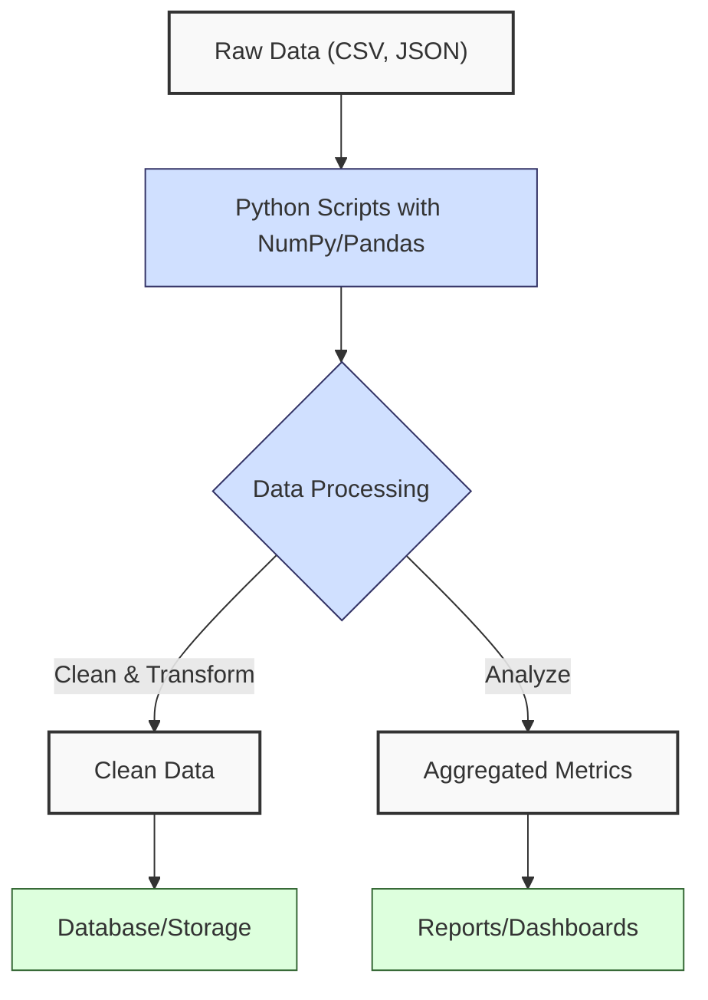
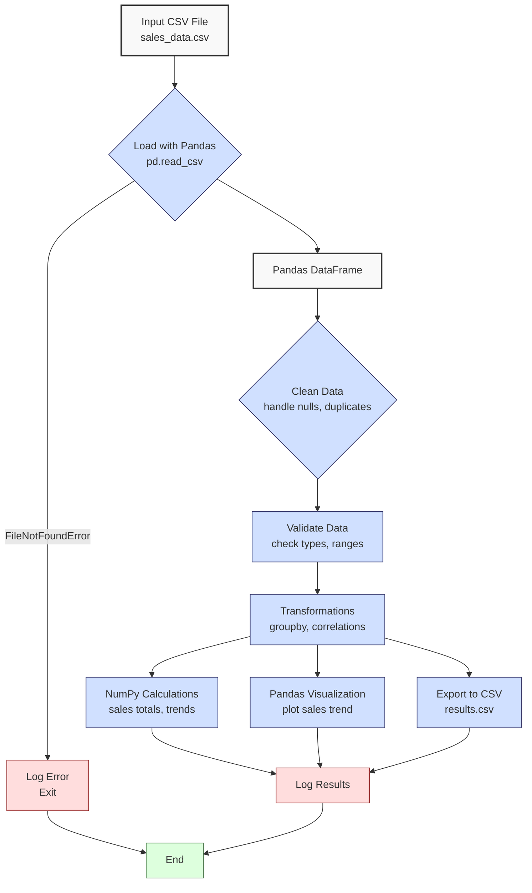

**Complexity: Moderate (M)**

---

## 3.0 Introduction: Why This Matters for Data Engineering

In data engineering, processing large datasets efficiently is a core requirement. While Python’s built-in data structures (lists, dictionaries) are versatile, they can be slow and cumbersome for numerical and tabular data operations. NumPy and Pandas are foundational libraries that address these limitations, enabling fast, scalable data manipulation critical for building data pipelines.

This chapter introduces **NumPy** for numerical computations and **Pandas** for tabular data processing. These libraries allow you to handle large datasets, perform complex transformations, and prepare data for databases or analytics, all while maintaining performance and readability.

### Data Engineering Workflow Context

Here’s how NumPy and Pandas fit into a typical data engineering workflow:



### Building On and Preparing For

- **Building On**: This chapter builds on Chapters 1 (Python fundamentals: data structures, functions, control flow) and 2 (file handling, error handling, CSV/JSON processing). You’ll use these skills to load and process data with NumPy and Pandas.
- **Preparing For**: NumPy and Pandas are essential for data preparation in database chapters (11–22), advanced data processing (Chapters 30–35), and visualization (Chapter 36). They form the backbone of efficient data manipulation throughout the curriculum.

### What You’ll Learn

This chapter covers:

1. **NumPy Basics**:
   - Creating and manipulating arrays
   - Vectorized operations for performance
   - Basic statistical functions
2. **Pandas Introduction**:
   - Series and DataFrame concepts
   - Reading and writing CSV/JSON
   - Basic data inspection (`head`, `info`, etc.)
3. **Micro-Project**: Refactor the Chapter 2 data processor using Pandas and NumPy for efficient analysis and visualization.

By the end, you’ll be able to process large datasets efficiently, perform advanced analytics, and generate visualizations, preparing you for more complex data engineering tasks.

---

## 3.1 NumPy Basics

NumPy is a powerful library for numerical computations, providing fast, memory-efficient arrays and vectorized operations. It’s ideal for data engineering tasks involving numerical data, such as calculations or statistical analysis.

### 3.1.1 Creating and Manipulating Arrays

NumPy arrays (`ndarray`) are fixed-size, homogeneous collections optimized for numerical operations.

```python
import numpy as np

# Create a 1D array from a list
prices = np.array([19.99, 24.99, 49.99, 29.99])
print(f"Prices array:\n{prices}")
# Prices array:
# [19.99 24.99 49.99 29.99]

# Create a 2D array
sales = np.array([
    [999.99, 2],  # Laptop: price, quantity
    [24.99, 10],  # Mouse
    [49.99, 5]    # Keyboard
])
print(f"Sales array:\n{sales}")
# Sales array:
# [[999.99   2.  ]
#  [ 24.99  10.  ]
#  [ 49.99   5.  ]]

# Array attributes
print(f"Shape: {prices.shape}")  # (4,)
print(f"Data type: {prices.dtype}")  # float64
print(f"Dimensions: {sales.ndim}")  # 2
# Shape: (4,)
# Data type: float64
# Dimensions: 2

# Indexing and slicing
first_price = prices[0]  # 19.99
high_prices = prices[prices > 25]  # [49.99, 29.99]
print(f"First price: {first_price}")
print(f"High prices: {high_prices}")
# First price: 19.99
# High prices: [49.99 29.99]
```

**Key Points**:

- Create arrays with `np.array()`; all elements must have the same type (e.g., `float64`).
- Arrays have attributes: `shape` (dimensions), `dtype` (data type), `ndim` (number of dimensions).
- Indexing/slicing is similar to lists but supports advanced operations (e.g., boolean indexing).
- **Underlying Implementation**: NumPy arrays are contiguous memory blocks with fixed-size elements, unlike Python lists (arrays of pointers). This reduces memory overhead and enables fast, CPU-optimized operations via C-based libraries.
- **Performance Considerations**:
  - **Time Complexity**:
    - Indexing: O(1), constant-time access to elements.
    - Slicing: O(k), where k is the slice size, for copying data.
    - Creation: O(n), where n is the array size, for initializing memory.
  - **Space Complexity**:
    - Storage: O(n), where n is the number of elements, with fixed-size `float64` (8 bytes) or other types.
    - Operations (e.g., indexing): O(1) additional space; slicing may create O(k) copies.
    - **Implication**: Arrays are memory-efficient and fast for numerical data, critical for large-scale data engineering tasks.

### 3.1.2 Vectorized Operations

Vectorized operations apply calculations to entire arrays, avoiding slow Python loops.

```python
# Calculate total sales (price * quantity)
quantities = sales[:, 1]  # Second column
prices = sales[:, 0]      # First column
totals = prices * quantities
print(f"Total sales per product:\n{totals}")
# Total sales per product:
# [1999.98  249.9   249.95]

# Apply a discount to all prices
discounted_prices = prices * 0.9
print(f"Discounted prices:\n{discounted_prices}")
# Discounted prices:
# [899.991  22.491  44.991]
```

**Key Points**:

- Operations like `*`, `+`, `-` are applied element-wise, leveraging C-based computation.
- Vectorization is faster than Python loops due to optimized memory access and CPU instructions.
- **Performance Considerations**:
  - **Time Complexity**: O(n) for vectorized operations, but executed in C, significantly faster than O(n) Python loops.
  - **Space Complexity**: O(n) for output arrays; in-place operations (e.g., `+=`) use O(1) extra space.
  - **Implication**: Vectorization is critical for performance in data pipelines, especially with large datasets.

### 3.1.3 Basic Statistical Functions

NumPy provides functions for statistical analysis.

```python
# Calculate mean, sum, min, max
mean_price = np.mean(prices)
total_sales = np.sum(totals)
min_price = np.min(prices)
max_price = np.max(prices)

print(f"Mean price: ${mean_price:.2f}")
print(f"Total sales: ${total_sales:.2f}")
print(f"Min price: ${min_price:.2f}")
print(f"Max price: ${max_price:.2f}")
# Mean price: $358.32
# Total sales: $2499.83
# Min price: $24.99
# Max price: $999.99
```

**Key Points**:

- Functions: `np.mean()`, `np.sum()`, `np.min()`, `np.max()`, `np.std()`, etc.
- Apply to entire arrays or along axes (e.g., `np.sum(sales, axis=0)` for column sums).
- **Performance Considerations**:
  - **Time Complexity**: O(n) for statistical functions, optimized in C.
  - **Space Complexity**: O(1) for scalar outputs (e.g., mean); O(n) if computing along axes with array outputs.
  - **Implication**: Fast for summarizing large datasets, essential for data engineering metrics.

---

## 3.2 Pandas Introduction

Pandas is a library for tabular data manipulation, built on NumPy. Its core structures, **Series** and **DataFrame**, simplify data cleaning, transformation, and analysis.

### 3.2.1 Series and DataFrame Concepts

- **Series**: A 1D labeled array, like a column in a spreadsheet.
- **DataFrame**: A 2D labeled table, like a spreadsheet with rows and columns.

```python
import pandas as pd

# Create a Series
prices_series = pd.Series([19.99, 24.99, 49.99, 29.99], name="price")
print(f"Prices Series:\n{prices_series}")
# Prices Series:
# 0    19.99
# 1    24.99
# 2    49.99
# 3    29.99
# Name: price, dtype: float64

# Create a DataFrame
sales_data = {
    "product": ["Laptop", "Mouse", "Keyboard"],
    "price": [999.99, 24.99, 49.99],
    "quantity": [2, 10, 5]
}
df = pd.DataFrame(sales_data)
print(f"Sales DataFrame:\n{df}")
# Sales DataFrame:
#     product   price  quantity
# 0  Laptop   999.99         2
# 1   Mouse    24.99        10
# 2  Keyboard  49.99         5
```

**Key Points**:

- Series have an index (default: 0, 1, 2, ...) and a single data column.
- DataFrames have rows (indexed) and columns (labeled).
- **Underlying Implementation**: Series and DataFrames use NumPy arrays internally, with additional metadata for indexing and labeling. This combines NumPy’s performance with spreadsheet-like functionality.
- **Performance Considerations**:
  - **Time Complexity**: O(n) for most operations (e.g., accessing rows/columns), leveraging NumPy’s efficiency.
  - **Space Complexity**: O(n) for data storage, with overhead for index and column metadata.
  - **Implication**: DataFrames are memory-intensive but optimized for tabular data, ideal for data engineering pipelines.

### 3.2.2 Reading and Writing CSV/JSON

Pandas simplifies loading and saving data.

```python
# Write DataFrame to CSV
csv_path = "sales.csv"
df.to_csv(csv_path, index=False)

# Read CSV into DataFrame
df_from_csv = pd.read_csv(csv_path)
print(f"Read from CSV:\n{df_from_csv}")
# Read from CSV:
#     product   price  quantity
# 0  Laptop   999.99         2
# 1   Mouse    24.99        10
# 2  Keyboard  49.99         5

# Write to JSON
json_path = "sales.json"
df.to_json(json_path, orient="records", indent=2)

# Read JSON
df_from_json = pd.read_json(json_path)
print(f"Read from JSON:\n{df_from_json}")
# Read from JSON:
#     product   price  quantity
# 0  Laptop   999.99         2
# 1   Mouse    24.99        10
# 2  Keyboard  49.99         5
```

**Key Points**:

- `to_csv()` and `read_csv()` handle CSV files; `index=False` omits the index.
- `to_json(orient="records")` writes rows as JSON objects; `read_json()` loads them back.
- Pandas handles data types automatically but may require manual type specification for complex data.
- **Performance Considerations**:
  - **Time Complexity**: O(n) for reading/writing, where n is the data size, optimized for tabular data.
  - **Space Complexity**: O(n) to load data into memory; streaming not supported natively.
  - **Implication**: Efficient for moderate-sized datasets; for very large files, consider chunking (Chapter 31).

### 3.2.3 Basic Data Inspection

Inspect DataFrames to understand their structure and content.

```python
# Basic inspection
print(f"Head (first 2 rows):\n{df.head(2)}")
# Head (first 2 rows):
#    product   price  quantity
# 0  Laptop  999.99         2
# 1   Mouse   24.99        10

print(f"Info:\n{df.info()}")
# Info:
# <class 'pandas.core.frame.DataFrame'>
# RangeIndex: 3 entries, 0 to 2
# Data columns (total 3 columns):
#  #   Column    Non-Null Count  Dtype
# ---  ------    --------------  -----
#  0   product   3 non-null      object
#  1   price     3 non-null      float64
#  2   quantity  3 non-null      int64
# dtypes: float64(1), int64(1), object(1)
# memory usage: 204.0+ bytes
# None

print(f"Describe (numerical columns):\n{df.describe()}")
# Describe (numerical columns):
#             price  quantity
# count     3.000000  3.000000
# mean    358.323333  5.666667
# std     536.951843  4.041452
# min      24.990000  2.000000
# 25%      37.440000  3.500000
# 50%      49.990000  5.000000
# 75%     524.990000  7.500000
# max     999.990000 10.000000
```

**Key Points**:

- `head(n)`: View the first n rows (default: 5).
- `info()`: Show column names, data types, and non-null counts.
- `describe()`: Summarize numerical columns (count, mean, std, min, max, quartiles).
- **Performance Considerations**:
  - **Time Complexity**: O(n) for `head` and `info`; O(n) for `describe` to compute statistics.
  - **Space Complexity**: O(1) for `head` and `info`; O(k) for `describe`, where k is the number of numerical columns.
  - **Implication**: Fast for inspection but `describe` can be slow for large datasets with many columns.

---

## 3.3 Micro-Project: Pandas Sales Analyzer

**Note**: The full micro-project may take 60–90 minutes, including debugging. For a quicker alternative (approximately 30–45 minutes), use the simplified version below, especially if you’re new to Pandas or time-constrained.

### Project Requirements

Refactor the Chapter 2 robust data processor to use Pandas for data handling and NumPy for numerical computations. Implement advanced analytics (e.g., sales trends, product correlations) and create a simple visualization using Pandas’ built-in plotting. This project applies NumPy arrays, Pandas DataFrames, and data inspection techniques.

### Data Flow and Processing

_Visualizing the micro-project’s data flow with Pandas and NumPy_



### Acceptance Criteria

- **Go Criteria**:
  - Loads data into a Pandas DataFrame successfully.
  - Uses Pandas for data cleaning (handles nulls, duplicates, invalid types).
  - Implements at least three analytical operations (e.g., `groupby`, filtering, aggregation).
  - Uses NumPy for at least one numerical calculation (e.g., total sales, correlation).
  - Generates at least one visualization (bar chart, line graph, etc.).
  - Execution is measurably faster than the Chapter 2 non-Pandas version.
  - Exports results to CSV.
  - Includes logging for errors and key steps.
- **No-Go Criteria**:
  - Fails to load or process data correctly.
  - No data cleaning or validation.
  - Incorrect analytical results.
  - No NumPy usage.
  - Missing visualization.
  - Slower performance than Chapter 2.
  - No error handling or logging.

### Common Pitfalls to Avoid

1. **Confusion Between Series and DataFrames**:
   - **Problem**: Treating a Series (1D) like a DataFrame (2D) causes errors (e.g., `df['column']` is a Series).
   - **Solution**: Remember Series is a single column; use `df[['column']]` for a DataFrame with one column.
2. **Modifying DataFrames Without Assignment**:
   - **Problem**: Operations like `df.drop()` don’t modify the DataFrame unless `inplace=True` or reassigned (e.g., `df = df.drop()`).
   - **Solution**: Always reassign or use `inplace=True` (e.g., `df.drop(columns=['col'], inplace=True)`).
3. **Performance Issues with Row Iteration**:
   - **Problem**: Iterating over DataFrame rows with `iterrows()` is slow for large datasets.
   - **Solution**: Use vectorized operations (e.g., `df['total'] = df['price'] * df['quantity']`) or `apply()` for complex logic.
4. **Type Inference Errors**:
   - **Problem**: Pandas may infer incorrect data types (e.g., strings for numbers in CSV).
   - **Solution**: Use `dtype` in `read_csv` or convert types with `astype()` (e.g., `df['price'] = df['price'].astype(float)`).
5. **Visualization Dependencies**:
   - **Problem**: Plotting requires `matplotlib`, which may not be installed.
   - **Solution**: Install `matplotlib` (`pip install matplotlib`) and import it explicitly.

### How This Differs from Production-Grade Solutions

In production, this solution would include:

- **Scalability**: Chunking for large CSVs (Chapter 31).
- **Testing**: Unit tests for transformations (Chapter 9).
- **Monitoring**: Pipeline performance metrics (Chapter 52).
- **Advanced Visualization**: Interactive dashboards with tools like Metabase (Chapter 41).
- **Error Recovery**: Retry mechanisms for transient failures (Chapter 14).
- **Security**: Secure file handling and data validation (Chapter 8).

### Implementation (Full Version)

```python
import pandas as pd
import numpy as np
import matplotlib.pyplot as plt
import logging
import os

# Configure logging
logging.basicConfig(
    filename="pandas_analyzer.log",
    level=logging.INFO,
    format="%(asctime)s - %(levelname)s - %(message)s"
)

# Function to load and validate data
def load_sales_data(csv_path):
    """Load sales data into a DataFrame and validate."""
    try:
        # Define expected dtypes to avoid inference errors
        dtypes = {"product": str, "price": float, "quantity": int, "date": str}
        # Read CSV without parsing dates initially to handle invalid formats
        df = pd.read_csv(csv_path, dtype=dtypes)
        logging.info(f"Loaded {len(df)} records from {csv_path}")

        # Standardize product names by converting to lowercase
        df["product"] = df["product"].str.lower()

        # Validate and parse dates
        def is_valid_date(date_str):
            try:
                pd.to_datetime(date_str, format="%Y-%m-%d")
                return True
            except ValueError:
                return False

        initial_len = len(df)
        valid_dates = df["date"].apply(is_valid_date)
        invalid_dates = df[~valid_dates]
        if not invalid_dates.empty:
            logging.warning(f"Filtered {len(invalid_dates)} rows with invalid dates: {invalid_dates['date'].tolist()}")
        df = df[valid_dates]
        df["date"] = pd.to_datetime(df["date"], format="%Y-%m-%d")

        # Handle nulls and duplicates
        df = df.dropna(subset=["product", "price", "quantity"])
        df = df.drop_duplicates()
        logging.info(f"Removed {initial_len - len(df)} nulls/duplicates/invalid dates")

        # Validate data
        df = df[df["product"].str.strip() != ""]
        df = df[df["price"] > 0]
        df = df[df["quantity"] > 0]
        logging.info(f"After validation: {len(df)} valid records")

        return df
    except FileNotFoundError:
        logging.error(f"File not found: {csv_path}")
        return None
    except pd.errors.ParserError:
        logging.error(f"CSV parsing error: {csv_path}")
        return None
    except Exception as e:
        logging.error(f"Unexpected error: {e}")
        return None

# Function to perform analytical operations
def analyze_sales(df):
    """Perform analytical operations on sales data."""
    # Calculate total sales (NumPy)
    totals = np.array(df["price"]) * np.array(df["quantity"])
    total_sales = np.sum(totals)
    logging.info(f"Total sales: ${total_sales:.2f}")

    # Group rows by product to compute average price and total quantity
    sales_by_product = df.groupby("product")[["price", "quantity"]].agg({
        "price": "mean",
        "quantity": "sum"
    }).rename(columns={"price": "avg_price", "quantity": "total_quantity"})
    logging.info("Calculated sales by product")

    # Monthly sales trend
    df["month"] = df["date"].dt.to_period("M")
    monthly_sales = df.groupby("month")[["price", "quantity"]].apply(
        lambda x: (x["price"] * x["quantity"]).sum()  # Apply combines price * quantity for each month to compute total sales
    ).reset_index(name="total_sales")
    logging.info("Calculated monthly sales trend")

    # Correlation between price and quantity (NumPy)
    # Note: np.corrcoef may raise errors with insufficient data (e.g., <2 rows).
    # The sample data ensures sufficient rows, but in production, check df.shape[0] >= 2.
    if df.shape[0] >= 2:
        correlation = np.corrcoef(df["price"], df["quantity"])[0, 1]
        logging.info(f"Price-quantity correlation: {correlation:.2f}")
    else:
        correlation = None
        logging.warning("Insufficient data for correlation calculation")

    return {
        "total_sales": total_sales,
        "sales_by_product": sales_by_product,
        "monthly_sales": monthly_sales,
        "correlation": correlation
    }

# Function to create visualization
def plot_sales_trend(monthly_sales, plot_path):
    """Create a line plot of monthly sales."""
    try:
        plt.figure(figsize=(10, 6))
        monthly_sales["month"] = monthly_sales["month"].astype(str)
        plt.plot(monthly_sales["month"], monthly_sales["total_sales"], marker="o")
        plt.title("Monthly Sales Trend")
        plt.xlabel("Month")
        plt.ylabel("Total Sales ($)")
        plt.grid(True)
        plt.savefig(plot_path)
        plt.close()
        logging.info(f"Saved plot to {plot_path}")
    except Exception as e:
        logging.error(f"Error creating plot: {e}")

# Function to export results
def export_results(results, csv_path):
    """Export sales by product to CSV."""
    try:
        results["sales_by_product"].to_csv(csv_path)
        logging.info(f"Exported results to {csv_path}")
    except IOError as e:
        logging.error(f"Error exporting to {csv_path}: {e}")

# Main function
def main():
    csv_path = "sales_data.csv"
    results_csv_path = "sales_results.csv"
    plot_path = "sales_trend.png"

    # Load data
    df = load_sales_data(csv_path)
    if df is None or df.empty:
        logging.error("No valid data to process")
        return

    # Analyze data
    results = analyze_sales(df)

    # Create visualization
    plot_sales_trend(results["monthly_sales"], plot_path)

    # Export results
    export_results(results, results_csv_path)

    # Log summary
    logging.info("Analysis completed")

if __name__ == "__main__":
    main()
```

### Implementation (Simplified Version)

This version focuses on loading data with Pandas, performing one analytical operation (groupby), and skipping visualization, reducing complexity.

```python
import pandas as pd
import numpy as np
import logging

# Configure logging
logging.basicConfig(
    filename="simple_analyzer.log",
    level=logging.INFO,
    format="%(asctime)s - %(levelname)s - %(message)s"
)

# Function to load and validate data
def load_sales_data(csv_path):
    """Load and validate sales data."""
    try:
        # Read CSV without parsing dates initially
        df = pd.read_csv(csv_path, dtype={"product": str, "price": float, "quantity": int})
        logging.info(f"Loaded {len(df)} records")

        # Standardize product names by converting to lowercase
        df["product"] = df["product"].str.lower()

        # Validate and parse dates
        def is_valid_date(date_str):
            try:
                pd.to_datetime(date_str, format="%Y-%m-%d")
                return True
            except ValueError:
                return False

        initial_len = len(df)
        valid_dates = df["date"].apply(is_valid_date)
        invalid_dates = df[~valid_dates]
        if not invalid_dates.empty:
            logging.warning(f"Filtered {len(invalid_dates)} rows with invalid dates: {invalid_dates['date'].tolist()}")
        df = df[valid_dates]
        df["date"] = pd.to_datetime(df["date"], format="%Y-%m-%d")

        # Handle nulls and duplicates
        df = df.dropna().drop_duplicates()
        logging.info(f"Removed {initial_len - len(df)} nulls/duplicates/invalid dates")

        # Validate data
        df = df[(df["product"].str.strip() != "") & (df["price"] > 0) & (df["quantity"] > 0)]
        logging.info(f"After validation: {len(df)} records")
        return df
    except FileNotFoundError:
        logging.error(f"File not found: {csv_path}")
        return None
    except pd.errors.ParserError:
        logging.error(f"CSV parsing error: {csv_path}")
        return None
    except Exception as e:
        logging.error(f"Unexpected error: {e}")
        return None

# Function to analyze data
def analyze_sales(df):
    """Calculate total sales by product."""
    total_sales = np.sum(df["price"] * df["quantity"])
    sales_by_product = df.groupby("product")["quantity"].sum().reset_index(name="total_quantity")
    logging.info(f"Total sales: ${total_sales:.2f}")
    return {"total_sales": total_sales, "sales_by_product": sales_by_product}

# Function to export results
def export_results(results, csv_path):
    """Export results to CSV."""
    try:
        results["sales_by_product"].to_csv(csv_path, index=False)
        logging.info(f"Exported to {csv_path}")
    except IOError as e:
        logging.error(f"Error exporting to {csv_path}")

# Main function
def main():
    csv_path = "sales_data.csv"
    results_csv_path = "simple_results.csv"

    df = load_sales_data(csv_path)
    if df is None or df.empty:
        logging.error("No data to process")
        return

    results = analyze_sales(df)
    export_results(results, results_csv_path)
    logging.info("Processing completed")

if __name__ == "__main__":
    main()
```

### Sample Input File (`sales_data.csv`)

```csv
product,price,quantity,date
Laptop,999.99,2,2025-01-15
Mouse,24.99,10,2025-01-20
Keyboard,49.99,5,2025-02-10
,29.99,3,2025-02-15
Monitor,invalid,2,2025-02-20
Headphones,59.99,0,2025-03-01
LAPTOP,899.99,1,2025-03-05
```

### Expected Outputs (Full Version)

- **sales_results.csv**:

```csv
product,avg_price,total_quantity
keyboard,49.99,5
laptop,949.99,3
mouse,24.99,10
```

- **sales_trend.png**: A line plot showing monthly sales (e.g., Jan: $2249.97, Feb: $249.95, Mar: $899.99). The plot shows a line with markers at three points (Jan 2025: $2249.97, Feb 2025: $249.95, Mar 2025: $899.99), with the x-axis labeled “Month” and y-axis labeled “Total Sales ($)”.
- **pandas_analyzer.log** (sample):

```
2025-04-20 07:20:00,123 - INFO - Loaded 7 records from sales_data.csv
2025-04-20 07:20:00,124 - INFO - Removed 3 nulls/duplicates/invalid dates
2025-04-20 07:20:00,125 - INFO - After validation: 4 valid records
2025-04-20 07:20:00,126 - INFO - Total sales: $2499.95
2025-04-20 07:20:00,127 - INFO - Calculated sales by product
2025-04-20 07:20:00,128 - INFO - Calculated monthly sales trend
2025-04-20 07:20:00,129 - INFO - Price-quantity correlation: -0.87
2025-04-20 07:20:00,130 - INFO - Saved plot to sales_trend.png
2025-04-20 07:20:00,131 - INFO - Exported results to sales_results.csv
2025-04-20 07:20:00,132 - INFO - Analysis completed
```

### Expected Outputs (Simplified Version)

- **simple_results.csv**:

```csv
product,total_quantity
keyboard,5
laptop,3
mouse,10
```

- **simple_analyzer.log** (sample):

```
2025-04-20 07:20:00,123 - INFO - Loaded 7 records
2025-04-20 07:20:00,124 - INFO - Removed 3 nulls/duplicates/invalid dates
2025-04-20 07:20:00,125 - INFO - After validation: 4 records
2025-04-20 07:20:00,126 - INFO - Total sales: $2499.95
2025-04-20 07:20:00,127 - INFO - Exported to simple_results.csv
2025-04-20 07:20:00,128 - INFO - Processing completed
```

### How to Run and Test the Solution

#### Full Version

1. **Setup**:

   - Save as `pandas_analyzer.py`.
   - Create `sales_data.csv` with the sample data. Copy the following into a text editor and save as `sales_data.csv`:
     ```
     product,price,quantity,date
     Laptop,999.99,2,2025-01-15
     Mouse,24.99,10,2025-01-20
     Keyboard,49.99,5,2025-02-10
     ,29.99,3,2025-02-15
     Monitor,invalid,2,2025-02-20
     Headphones,59.99,0,2025-03-01
     LAPTOP,899.99,1,2025-03-05
     ```
   - Install dependencies: `pip install pandas numpy matplotlib`.
   - If plotting fails (e.g., ‘No backend available’), ensure `matplotlib` is installed and try setting the backend with `plt.switch_backend('agg')`.
   - Ensure Python 3.6+ is installed.

2. **Run**:

   - Execute: `python pandas_analyzer.py`.
   - Outputs: `sales_results.csv`, `sales_trend.png`, `pandas_analyzer.log`.

3. **Test Scenarios**:

   - **Valid Data**: Verify `sales_results.csv` lists correct average prices and quantities (e.g., laptop: $949.99, 3 units). Check `sales_trend.png` for a line plot with monthly sales (Jan: $2249.97, Feb: $249.95, Mar: $899.99). Confirm total sales ($2499.95) and correlation (~ -0.87) in the log.
   - **Missing File**: Rename `sales_data.csv`. Check `pandas_analyzer.log` for `File not found` error; no output files created.
   - **Invalid Data**: Add rows with non-numeric prices or negative quantities. Verify they’re filtered out (logged in `pandas_analyzer.log`), and results exclude them.
   - **Invalid Dates**: Add a row with an invalid date (e.g., `date: "2025-13-01"`). Confirm it’s filtered out with a warning in the log.
   - **Inconsistent Product Names**: Verify product names are standardized (e.g., ‘Laptop’ and ‘LAPTOP’ treated as same in `sales_results.csv`, appearing as ‘laptop’).
   - **Empty CSV**: Create a CSV with only headers. Confirm empty output (`sales_results.csv` not created, error logged).
   - **Insufficient Data for Correlation**: Create a CSV with one valid row. Verify `correlation` is `None` and a warning is logged about insufficient data.
   - **Large Dataset**: Generate a large dataset (e.g., 10,000 rows) using the script below and compare performance with Chapter 2’s processor. The Pandas version should be faster due to vectorized operations. To test, open `pandas_analyzer.py` and change `csv_path = "sales_data.csv"` to `csv_path = "large_sales_data.csv"`.

     ```python
     import pandas as pd
     import random
     from datetime import datetime, timedelta

     # This script generates a realistic sales dataset with ~5% errors to test the script’s cleaning and validation capabilities.
     def generate_large_sales_data(csv_path, num_rows=10000):
         """Generate a CSV with num_rows sales records, 5% with errors."""
         products = ["Laptop", "Mouse", "Keyboard", "Monitor", "Headphones"]
         start_date = datetime(2025, 1, 1)
         data = []
         for i in range(num_rows):
             # 5% chance of error
             if random.random() < 0.05:
                 # Introduce errors: None for product, invalid price, or invalid date
                 error_type = random.choice(["null_product", "invalid_price", "invalid_date"])
                 product = None if error_type == "null_product" else random.choice(products)
                 price = "invalid" if error_type == "invalid_price" else round(random.uniform(10.0, 1000.0), 2)
                 date = "2025-13-01" if error_type == "invalid_date" else (start_date + timedelta(days=random.randint(0, 90))).strftime("%Y-%m-%d")
                 quantity = random.randint(1, 20)
             else:
                 product = random.choice(products)
                 price = round(random.uniform(10.0, 1000.0), 2)
                 quantity = random.randint(1, 20)
                 date = (start_date + timedelta(days=random.randint(0, 90))).strftime("%Y-%m-%d")
             # Randomly vary product name case
             if product:
                 case = random.choice(["lower", "upper", "title"])
                 product = (product.lower() if case == "lower" else
                            product.upper() if case == "upper" else
                            product.title())
             data.append({
                 "product": product,
                 "price": price,
                 "quantity": quantity,
                 "date": date
             })
         df = pd.DataFrame(data)
         df.to_csv(csv_path, index=False)
         print(f"Generated {csv_path} with {num_rows} rows, ~5% containing errors")

     # Generate large dataset
     generate_large_sales_data("large_sales_data.csv", 10000)
     ```

     - Run the script to create `large_sales_data.csv`, then measure execution time using:

       ```python
       import time
       start = time.time()
       main()
       print(f"Execution time: {time.time() - start:.2f} seconds")
       ```

     - Compare with Chapter 2’s version (e.g., `python chapter2_processor.py`) to confirm faster performance.

   - **Visualization**: Open `sales_trend.png` to confirm the plot shows the correct monthly sales trend.

#### Simplified Version

1. **Setup**:

   - Save as `simple_analyzer.py`.
   - Create `sales_data.csv` with the sample data. Copy the following into a text editor and save as `sales_data.csv`:
     ```
     product,price,quantity,date
     Laptop,999.99,2,2025-01-15
     Mouse,24.99,10,2025-01-20
     Keyboard,49.99,5,2025-02-10
     ,29.99,3,2025-02-15
     Monitor,invalid,2,2025-02-20
     Headphones,59.99,0,2025-03-01
     LAPTOP,899.99,1,2025-03-05
     ```
   - Install: `pip install pandas numpy`.
   - Ensure Python 3.6+.

2. **Run**:

   - Execute: `python simple_analyzer.py`.
   - Outputs: `simple_results.csv`, `simple_analyzer.log`.

3. **Test Scenarios**:

   - **Valid Data**: Verify `simple_results.csv` shows correct total quantities (e.g., mouse: 10 units). Confirm total sales ($2499.95) in the log.
   - **Missing File**: Rename `sales_data.csv`. Check `simple_analyzer.log` for error; no CSV output.
   - **Invalid Data**: Add rows with non-numeric prices or negative quantities. Verify they’re filtered (logged), and results are correct.
   - **Invalid Dates**: Add a row with an invalid date (e.g., `date: "2025-13-01"`). Confirm it’s filtered out with a warning in the log.
   - **Inconsistent Product Names**: Verify product names are standardized (e.g., ‘Laptop’ and ‘LAPTOP’ treated as same in `simple_results.csv`, appearing as ‘laptop’).
   - **Large Dataset**: Use the `generate_large_sales_data` script above to create `large_sales_data.csv`. To test, open `simple_analyzer.py` and change `csv_path = "sales_data.csv"` to `csv_path = "large_sales_data.csv"`. Measure execution time using the timing snippet above. Confirm faster performance compared to Chapter 2.

**Choosing Between Versions**:

- **Simplified Version**: Use if new to Pandas or limited to 30–45 minutes. Focuses on core Pandas (loading, groupby) and NumPy (total sales).
- **Full Version**: Use if you have 60–90 minutes and want to practice advanced analytics (trends, correlations) and visualization.

---

## 3.4 Practice Exercises

These exercises reinforce NumPy and Pandas concepts, increasing in complexity.

### Exercise 1: NumPy Array Operations

Write a function that takes a list of prices, converts it to a NumPy array, applies a 10% discount, and returns the discounted prices.

### Exercise 2: Pandas DataFrame Creation

Write a function that creates a DataFrame from a list of dictionaries (sales data) and filters out rows with negative quantities.

### Exercise 3: Data Cleaning with Pandas

Write a function that loads a CSV into a DataFrame, removes nulls and duplicates, and ensures prices are positive floats.

### Exercise 4: GroupBy Analysis

Write a function that loads sales data into a DataFrame and calculates total quantity sold per product using `groupby`.

### Exercise 5: Visualization with Pandas

Write a function that loads sales data, aggregates monthly sales, and creates a bar plot of sales by month.

### Exercise 6: String Cleaning with Pandas

Write a function that loads a CSV into a DataFrame and standardizes the `product` column by converting all names to lowercase. Filter out rows with empty product names after standardization.

---

## 3.5 Exercise Solutions

### Solution to Exercise 1: NumPy Array Operations

```python
import numpy as np

def discount_prices(prices):
    """Apply a 10% discount to prices using NumPy."""
    arr = np.array(prices)
    discounted = arr * 0.9
    return discounted

# Test
prices = [19.99, 24.99, 49.99]
result = discount_prices(prices)
print(result)
# [17.991 22.491 44.991]
```

### Solution to Exercise 2: Pandas DataFrame Creation

```python
import pandas as pd

def create_sales_dataframe(sales):
    """Create DataFrame and filter negative quantities."""
    df = pd.DataFrame(sales)
    df = df[df["quantity"] > 0]
    return df

# Test
sales = [
    {"product": "Laptop", "price": 999.99, "quantity": 2},
    {"product": "Mouse", "price": 24.99, "quantity": -1},
    {"product": "Keyboard", "price": 49.99, "quantity": 5}
]
df = create_sales_dataframe(sales)
print(df)
#     product   price  quantity
# 0  Laptop   999.99         2
# 2  Keyboard  49.99         5
```

### Solution to Exercise 3: Data Cleaning with Pandas

```python
import pandas as pd
import logging

logging.basicConfig(filename="cleaner.log", level=logging.INFO)

def clean_sales_data(csv_path):
    """Load and clean sales data."""
    try:
        df = pd.read_csv(csv_path, dtype={"product": str, "price": float, "quantity": int})
        initial_len = len(df)
        df = df.dropna().drop_duplicates()
        df = df[df["price"] > 0]
        logging.info(f"Cleaned {initial_len - len(df)} rows")
        return df
    except FileNotFoundError:
        logging.error(f"File not found: {csv_path}")
        return None

# Test
df = clean_sales_data("sales_data.csv")
print(df)
#     product   price  quantity       date
# 0  Laptop   999.99         2 2025-01-15
# 1   Mouse    24.99        10 2025-01-20
# 2  Keyboard  49.99         5 2025-02-10
# 6  LAPTOP   899.99         1 2025-03-05
```

### Solution to Exercise 4: GroupBy Analysis

```python
import pandas as pd

def sales_by_product(csv_path):
    """Calculate total quantity per product."""
    df = pd.read_csv(csv_path)
    result = df.groupby("product")["quantity"].sum().reset_index(name="total_quantity")
    return result

# Test
result = sales_by_product("sales_data.csv")
print(result)
#     product  total_quantity
# 0  Headphones              0
# 1  Keyboard                5
# 2  Laptop                  3
# 3  Monitor                 2
# 4  Mouse                  10
```

### Solution to Exercise 5: Visualization with Pandas

```python
import pandas as pd
import matplotlib.pyplot as plt
import logging

logging.basicConfig(filename="plotter.log", level=logging.INFO)

def plot_monthly_sales(csv_path, plot_path):
    """Plot monthly sales as a bar chart."""
    try:
        df = pd.read_csv(csv_path, parse_dates=["date"])
        df["month"] = df["date"].dt.to_period("M")
        monthly_sales = df.groupby("month").apply(
            lambda x: (x["price"] * x["quantity"]).sum()
        ).reset_index(name="total_sales")
        monthly_sales["month"] = monthly_sales["month"].astype(str)
        monthly_sales.plot(kind="bar", x="month", y="total_sales", figsize=(8, 5))
        plt.title("Monthly Sales")
        plt.xlabel("Month")
        plt.ylabel("Total Sales ($)")
        plt.savefig(plot_path)
        plt.close()
        logging.info(f"Saved plot to {plot_path}")
    except FileNotFoundError:
        logging.error(f"File not found: {csv_path}")

# Test
plot_monthly_sales("sales_data.csv", "monthly_sales.png")
```

### Solution to Exercise 6: String Cleaning with Pandas

```python
import pandas as pd
import logging

logging.basicConfig(filename="string_cleaner.log", level=logging.INFO)

def clean_product_names(csv_path):
    """Load CSV and standardize product names to lowercase."""
    try:
        df = pd.read_csv(csv_path, dtype={"product": str})
        initial_len = len(df)
        df["product"] = df["product"].str.lower()
        df = df[df["product"].str.strip() != ""]
        logging.info(f"Cleaned {initial_len - len(df)} rows with empty products")
        return df
    except FileNotFoundError:
        logging.error(f"File not found: {csv_path}")
        return None

# Test
df = clean_product_names("sales_data.csv")
print(df)
#     product   price  quantity       date
# 0  laptop   999.99         2 2025-01-15
# 1   mouse    24.99        10 2025-01-20
# 2  keyboard  49.99         5 2025-02-10
# 4  monitor     NaN         2 2025-02-20
# 5  headphones  59.99         0 2025-03-01
# 6  laptop   899.99         1 2025-03-05
```

---

## 3.6 Chapter Summary and Connection to Chapter 4

In this chapter, you’ve mastered:

- **NumPy Basics**: Creating arrays, vectorized operations, and statistical functions for efficient numerical computations.
- **Pandas Introduction**: Using Series and DataFrames for tabular data, loading/saving CSV/JSON, and inspecting data.
- **Performance**: Leveraging vectorized operations and optimized data structures, with time/space complexity considerations.
- **Micro-Project**: Refactored the Chapter 2 processor with Pandas and NumPy, adding analytics and visualization.

These skills enable efficient data manipulation, critical for data engineering pipelines. The micro-project demonstrated faster processing and advanced analytics compared to Chapter 2, preparing you for more complex tasks.

### Connection to Chapter 4

Chapter 4 (Web Integration and APIs) builds on this chapter by:

- **API Data Ingestion**: Using `requests` to fetch JSON data, which Pandas can load directly (extending `read_json`).
- **Error Handling**: Applying Chapter 2’s `try/except` to network errors, ensuring robust API interactions.
- **Data Processing**: Using Pandas to process API responses, building on DataFrame operations. In Chapter 4, you’ll use Pandas to transform JSON data fetched from APIs into DataFrames, applying the same cleaning and analytical techniques to real-time external data.
- **Scalability**: Preparing for larger datasets from external sources, where NumPy/Pandas efficiency is critical.

The Pandas sales analyzer will be extended in Chapter 4 to incorporate API data, integrating external sources into your data pipeline, a key skill for real-world data engineering.
