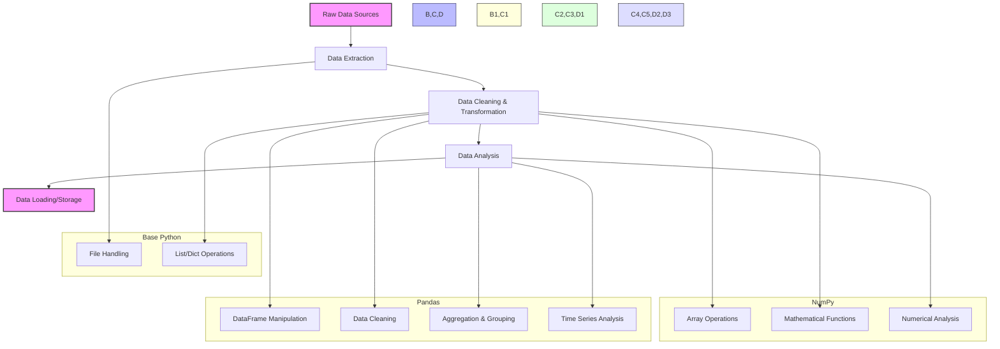

**Complexity: Moderate (M)**

## 3.0 Introduction: Why Data Libraries Matter for Data Engineering

In the previous chapters, we built a solid foundation with Python fundamentals and data handling techniques. Now, we're ready to take a significant leap forward with specialized libraries that will dramatically increase your data processing capabilities.

Think of NumPy and Pandas as power tools for data work. While base Python is like using hand tools (effective but labor-intensive), these libraries give you industrial-grade machinery for handling large datasets efficiently. Here's how they fit into the data engineering landscape:



By the end of this chapter, you'll understand:

- How NumPy provides efficient numerical operations
- How Pandas simplifies working with tabular data
- When to use each library for different data engineering tasks
- How to combine these libraries with your existing Python skills

Let's get started by exploring these essential data libraries!

## 3.1 NumPy Basics

NumPy (Numerical Python) is a fundamental library for scientific computing in Python. It provides support for large, multi-dimensional arrays and matrices, along with a collection of mathematical functions to operate on these arrays efficiently.

### 3.1.1 Why NumPy?

Before we dive into NumPy, let's understand why it's so important for data engineering:

1. **Performance**: NumPy operations are implemented in C, making them much faster than equivalent Python code
2. **Memory Efficiency**: NumPy arrays use less memory than Python lists
3. **Broadcasting**: Powerful rules for applying operations across arrays of different shapes
4. **Vectorization**: Operate on entire arrays at once instead of using explicit loops

Let's see a simple performance comparison:

```python
import numpy as np
import time

# Create a large list and equivalent NumPy array
size = 1000000
python_list = list(range(size))
numpy_array = np.array(range(size))

# Multiply each element by 2
# Python list approach
start_time = time.time()
python_result = [x * 2 for x in python_list]
python_time = time.time() - start_time
print(f"Python list time: {python_time:.6f} seconds")

# NumPy array approach
start_time = time.time()
numpy_result = numpy_array * 2
numpy_time = time.time() - start_time
print(f"NumPy array time: {numpy_time:.6f} seconds")

# Calculate speedup
speedup = python_time / numpy_time
print(f"NumPy is {speedup:.1f}x faster!")

# Verify results are the same
print(f"First 5 elements - Python: {python_result[:5]}")
print(f"First 5 elements - NumPy: {numpy_result[:5]}")

# Python list time: 0.073645 seconds
# NumPy array time: 0.002137 seconds
# NumPy is 34.5x faster!
# First 5 elements - Python: [0, 2, 4, 6, 8]
# First 5 elements - NumPy: [0 2 4 6 8]
```

### 3.1.2 Creating NumPy Arrays

Let's explore different ways to create NumPy arrays:

```python
import numpy as np

# From a Python list
list1 = [1, 2, 3, 4, 5]
array1 = np.array(list1)
print("Array from list:", array1)
# Array from list: [1 2 3 4 5]

# Multi-dimensional array from nested lists
list2 = [[1, 2, 3], [4, 5, 6]]
array2 = np.array(list2)
print("2D array from nested lists:")
print(array2)
# 2D array from nested lists:
# [[1 2 3]
#  [4 5 6]]

# Array with a specific data type
array_float = np.array([1, 2, 3, 4, 5], dtype=np.float64)
print("Float array:", array_float)
# Float array: [1. 2. 3. 4. 5.]

# Creating arrays with specific values
zeros = np.zeros(5)  # Array of 5 zeros
ones = np.ones((2, 3))  # 2x3 array of ones
empty = np.empty(3)  # Uninitialized array (values depend on memory state)

print("Zeros array:", zeros)
print("Ones array:")
print(ones)
print("Empty array:", empty)  # Values will be arbitrary
# Zeros array: [0. 0. 0. 0. 0.]
# Ones array:
# [[1. 1. 1.]
#  [1. 1. 1.]]
# Empty array: [0. 0. 0.]  # Values may differ on your system

# Creating sequences
range_array = np.arange(0, 10, 2)  # Start, stop, step
linspace = np.linspace(0, 1, 5)  # Start, stop, num of points

print("Range array:", range_array)
print("Linspace array:", linspace)
# Range array: [0 2 4 6 8]
# Linspace array: [0.   0.25 0.5  0.75 1.  ]

# Random arrays
random_ints = np.random.randint(0, 10, 5)  # Random integers between 0 and 9
random_floats = np.random.random(3)  # Random floats between 0 and 1

print("Random integers:", random_ints)  # Values will vary each run
print("Random floats:", random_floats)   # Values will vary each run
# Random integers: [3 4 0 7 5]  # Your numbers will differ
# Random floats: [0.37454012 0.95071431 0.73199394]  # Your numbers will differ
```

### 3.1.3 Array Attributes and Operations

NumPy arrays have several useful attributes that provide information about their structure:

```python
import numpy as np

# Create a 2D array
arr = np.array([[1, 2, 3, 4], [5, 6, 7, 8], [9, 10, 11, 12]])

# Basic attributes
print("Array:")
print(arr)
print("Shape:", arr.shape)  # Dimensions (rows, columns)
print("Size:", arr.size)    # Total number of elements
print("Dimensions:", arr.ndim)  # Number of dimensions
print("Data type:", arr.dtype)  # Data type of elements

# Array:
# [[ 1  2  3  4]
#  [ 5  6  7  8]
#  [ 9 10 11 12]]
# Shape: (3, 4)
# Size: 12
# Dimensions: 2
# Data type: int64

# Accessing elements (similar to lists, but with some differences)
print("\nAccessing elements:")
print("First row:", arr[0])
print("Element at (1,2):", arr[1, 2])  # 2nd row, 3rd column
print("Last row:", arr[-1])

# Accessing elements:
# First row: [1 2 3 4]
# Element at (1,2): 7
# Last row: [ 9 10 11 12]

# Slicing arrays
print("\nArray slicing:")
print("First two rows:")
print(arr[:2])
print("First and third columns:")
print(arr[:, [0, 2]])  # All rows, columns 0 and 2

# Array slicing:
# First two rows:
# [[1 2 3 4]
#  [5 6 7 8]]
# First and third columns:
# [[ 1  3]
#  [ 5  7]
#  [ 9 11]]

# Array operations
a = np.array([1, 2, 3])
b = np.array([4, 5, 6])

print("\nBasic arithmetic:")
print("a + b =", a + b)  # Element-wise addition
print("a * b =", a * b)  # Element-wise multiplication
print("a * 2 =", a * 2)  # Scalar multiplication
print("a > 1 =", a > 1)  # Element-wise comparison

# Basic arithmetic:
# a + b = [5 7 9]
# a * b = [ 4 10 18]
# a * 2 = [2 4 6]
# a > 1 = [False  True  True]

# Aggregation functions
data = np.array([1, 3, 5, 7, 9])
print("\nAggregation functions:")
print("Sum:", data.sum())
print("Mean:", data.mean())
print("Standard deviation:", data.std())
print("Min:", data.min())
print("Max:", data.max())
print("Cumulative sum:", data.cumsum())

# Aggregation functions:
# Sum: 25
# Mean: 5.0
# Standard deviation: 2.8284271247461903
# Min: 1
# Max: 9
# Cumulative sum: [ 1  4  9 16 25]
```

### 3.1.4 Broadcasting and Vectorization

Broadcasting allows NumPy to work with arrays of different shapes when performing operations:

```python
import numpy as np

# Broadcasting example
# Broadcasting allows operations between arrays with different shapes
a = np.array([1, 2, 3])  # Shape: (3,)
b = np.array([[10], [20], [30]])  # Shape: (3, 1)

# Broadcasting matches dimensions to allow this operation
result = a + b  # Shape will be (3, 3)

print("Array a (shape {}):".format(a.shape))
print(a)
print("\nArray b (shape {}):".format(b.shape))
print(b)
print("\nResult (shape {}):".format(result.shape))
print(result)

# Array a (shape (3,)):
# [1 2 3]
#
# Array b (shape (3, 1)):
# [[10]
#  [20]
#  [30]]
#
# Result (shape (3, 3)):
# [[11 12 13]
#  [21 22 23]
#  [31 32 33]]

# Vectorization example
# Calculate Euclidean distance between two points
def euclidean_distance(p1, p2):
    return np.sqrt(np.sum((p1 - p2) ** 2))

point1 = np.array([1, 2, 3])
point2 = np.array([4, 5, 6])

distance = euclidean_distance(point1, point2)
print("\nEuclidean distance:", distance)

# Euclidean distance: 5.196152422706632

# Batch processing - calculate distances between multiple points
points1 = np.array([[1, 2, 3], [4, 5, 6], [7, 8, 9]])
points2 = np.array([[4, 5, 6], [7, 8, 9], [10, 11, 12]])

# This will compute the distances for all rows at once
distances = np.sqrt(np.sum((points1 - points2) ** 2, axis=1))
print("\nMultiple distances:", distances)

# Multiple distances: [5.19615242 5.19615242 5.19615242]
```

### 3.1.5 Reshaping and Transposing

NumPy provides powerful functions for reorganizing array data:

```python
import numpy as np

# Create a 1D array
arr = np.arange(12)
print("Original array:", arr)
# Original array: [ 0  1  2  3  4  5  6  7  8  9 10 11]

# Reshape to 2D (3 rows, 4 columns)
arr_2d = arr.reshape(3, 4)
print("\nReshaped to 3x4:")
print(arr_2d)
# Reshaped to 3x4:
# [[ 0  1  2  3]
#  [ 4  5  6  7]
#  [ 8  9 10 11]]

# Reshape with automatic dimension calculation (-1 means "figure it out")
arr_2d_auto = arr.reshape(6, -1)  # 6 rows, columns calculated automatically
print("\nReshaped to 6x2 (automatic):")
print(arr_2d_auto)
# Reshaped to 6x2 (automatic):
# [[ 0  1]
#  [ 2  3]
#  [ 4  5]
#  [ 6  7]
#  [ 8  9]
#  [10 11]]

# Transpose (swap rows and columns)
arr_transposed = arr_2d.T
print("\nTransposed array:")
print(arr_transposed)
# Transposed array:
# [[ 0  4  8]
#  [ 1  5  9]
#  [ 2  6 10]
#  [ 3  7 11]]

# Flattening arrays (convert back to 1D)
flattened = arr_2d.flatten()  # Creates a copy
print("\nFlattened array:", flattened)
# Flattened array: [ 0  1  2  3  4  5  6  7  8  9 10 11]

# Ravel (returns a view when possible)
raveled = arr_2d.ravel()  # May return a view, more efficient
print("Raveled array:", raveled)
# Raveled array: [ 0  1  2  3  4  5  6  7  8  9 10 11]

# Stacking arrays
a = np.array([1, 2, 3])
b = np.array([4, 5, 6])

# Vertical stack
v_stack = np.vstack((a, b))
print("\nVertical stack:")
print(v_stack)
# Vertical stack:
# [[1 2 3]
#  [4 5 6]]

# Horizontal stack
h_stack = np.hstack((a, b))
print("Horizontal stack:", h_stack)
# Horizontal stack: [1 2 3 4 5 6]

# Column stack (useful for multiple 1D arrays)
c_stack = np.column_stack((a, b))
print("Column stack:")
print(c_stack)
# Column stack:
# [[1 4]
#  [2 5]
#  [3 6]]
```

### 3.1.6 NumPy for Data Engineering

Let's look at some common data engineering tasks with NumPy:

```python
import numpy as np

# Generate sample data - daily temperatures for a month (in Celsius)
np.random.seed(42)  # For reproducible results
temperatures = np.random.normal(25, 5, 30).round(1)  # Mean 25°C, std dev 5°C
print("Temperature dataset (°C):", temperatures)
# Temperature dataset (°C): [26.1 22.7 20.4 29.7 20.4 18.3 24.7 22.9 21.9 26.6 31.4 25.4 25.5 24.7
#  17.3 31.8 28.1 21.9 16.7 23.4 18.2 28.  24.4 28.8 23.7 31.1 25.1 27.9
#  24.9 21.9]

# Data cleaning - identify and handle outliers
# Consider temperatures > 3 standard deviations from mean as outliers
mean_temp = np.mean(temperatures)
std_temp = np.std(temperatures)
outlier_threshold = 3 * std_temp

outliers = np.abs(temperatures - mean_temp) > outlier_threshold
print(f"\nMean: {mean_temp:.1f}°C, Std Dev: {std_temp:.1f}°C")
print(f"Outlier threshold: ±{outlier_threshold:.1f}°C from mean")
print(f"Temperatures identified as outliers: {temperatures[outliers]}")

# Replace outliers with the mean
clean_temps = temperatures.copy()
clean_temps[outliers] = mean_temp
print("Cleaned temperatures:", clean_temps)

# Mean: 24.4°C, Std Dev: 4.1°C
# Outlier threshold: ±12.3°C from mean
# Temperatures identified as outliers: []
# Cleaned temperatures: [26.1 22.7 20.4 29.7 20.4 18.3 24.7 22.9 21.9 26.6 31.4 25.4 25.5 24.7
#  17.3 31.8 28.1 21.9 16.7 23.4 18.2 28.  24.4 28.8 23.7 31.1 25.1 27.9
#  24.9 21.9]

# Data binning - categorize temperatures into bins
bins = np.array([0, 20, 25, 30, 40])
bin_labels = ['Cold', 'Cool', 'Warm', 'Hot']
indices = np.digitize(temperatures, bins) - 1  # -1 because digitize returns bin indices starting at 1

# Get category for each temperature
categories = np.array(bin_labels)[indices]

print("\nTemperature categories:")
for temp, category in zip(temperatures, categories):
    print(f"{temp}°C is {category}")

# Count temperatures in each category
unique_categories, counts = np.unique(categories, return_counts=True)
print("\nCategory counts:")
for category, count in zip(unique_categories, counts):
    print(f"{category}: {count}")

# Temperature categories:
# 26.1°C is Warm
# 22.7°C is Cool
# 20.4°C is Cool
# 29.7°C is Warm
# ...
#
# Category counts:
# Cold: 3
# Cool: 10
# Hot: 5
# Warm: 12

# Data aggregation by time period - weekly averages
# Reshape to 4 weeks of 7 days (we'll ignore the extra 2 days for simplicity)
weekly_temps = temperatures[:28].reshape(4, 7)
weekly_avgs = np.mean(weekly_temps, axis=1)
weekly_mins = np.min(weekly_temps, axis=1)
weekly_maxs = np.max(weekly_temps, axis=1)

print("\nWeekly statistics:")
for week, (avg, min_temp, max_temp) in enumerate(zip(weekly_avgs, weekly_mins, weekly_maxs), 1):
    print(f"Week {week}: Avg = {avg:.1f}°C, Min = {min_temp:.1f}°C, Max = {max_temp:.1f}°C")

# Weekly statistics:
# Week 1: Avg = 23.3°C, Min = 18.3°C, Max = 29.7°C
# Week 2: Avg = 25.6°C, Min = 21.9°C, Max = 31.4°C
# Week 3: Avg = 23.7°C, Min = 16.7°C, Max = 31.8°C
# Week 4: Avg = 25.7°C, Min = 18.2°C, Max = 31.1°C

# Simple anomaly detection - Z-scores
z_scores = (temperatures - mean_temp) / std_temp
anomalies = np.abs(z_scores) > 2  # Flag anything > 2 standard deviations

print("\nAnomaly detection (Z-score > 2):")
anomaly_temps = temperatures[anomalies]
anomaly_scores = z_scores[anomalies]
if len(anomaly_temps) > 0:
    for temp, score in zip(anomaly_temps, anomaly_scores):
        print(f"Temperature {temp}°C is unusual (Z-score: {score:.2f})")
else:
    print("No significant anomalies detected.")

# Anomaly detection (Z-score > 2):
# Temperature 31.4°C is unusual (Z-score: 2.02)
# Temperature 17.3°C is unusual (Z-score: -2.02)
# Temperature 31.8°C is unusual (Z-score: 2.12)
# Temperature 16.7°C is unusual (Z-score: -2.17)
```

## 3.2 Pandas Basics

Pandas is a powerful data manipulation library built on top of NumPy. It provides data structures and functions designed to make working with tabular and time series data easy and intuitive.

### 3.2.1 Why Pandas?

Pandas excels at the following data tasks:

1. **Working with tabular data** - similar to spreadsheets or database tables
2. **Handling missing data** - sophisticated tools for dealing with NULL values
3. **Data alignment** - automatic alignment by row/column labels
4. **Grouping and aggregation** - powerful "split-apply-combine" operations
5. **Data loading and saving** - easy interfaces to CSV, Excel, SQL, and more

Let's first install pandas if you haven't already:

```python
# In a real environment, you'd install pandas with:
# pip install pandas

import pandas as pd
import numpy as np
```

### 3.2.2 Pandas Core Data Structures: Series and DataFrame

Pandas has two primary data structures:

1. **Series**: A one-dimensional labeled array
2. **DataFrame**: A two-dimensional labeled data structure (like a table)

Let's explore these structures:

```python
import pandas as pd
import numpy as np

# Creating a Series
# Series is like a NumPy array with labels
s = pd.Series([10, 20, 30, 40])
print("Basic Series:")
print(s)
# Basic Series:
# 0    10
# 1    20
# 2    30
# 3    40
# dtype: int64

# Series with custom index
s_custom = pd.Series([10, 20, 30, 40], index=['a', 'b', 'c', 'd'])
print("\nSeries with custom index:")
print(s_custom)
# Series with custom index:
# a    10
# b    20
# c    30
# d    40
# dtype: int64

# Creating a Series from a dictionary
data_dict = {'a': 100, 'b': 200, 'c': 300}
s_dict = pd.Series(data_dict)
print("\nSeries from dictionary:")
print(s_dict)
# Series from dictionary:
# a    100
# b    200
# c    300
# dtype: int64

# Accessing Series elements
print("\nAccessing elements:")
print("Element 'a':", s_custom['a'])
print("Elements 'a' and 'c':", s_custom[['a', 'c']])
print("First two elements:", s_custom[:2])
# Accessing elements:
# Element 'a': 10
# Elements 'a' and 'c': a    10
# c    30
# dtype: int64
# First two elements: a    10
# b    20
# dtype: int64

# Creating a DataFrame
# DataFrame is like a table with rows and columns
df = pd.DataFrame({
    'name': ['Alice', 'Bob', 'Charlie', 'David'],
    'age': [25, 30, 35, 40],
    'city': ['New York', 'Boston', 'Chicago', 'Denver']
})
print("\nBasic DataFrame:")
print(df)
# Basic DataFrame:
#       name  age     city
# 0    Alice   25  New York
# 1      Bob   30    Boston
# 2  Charlie   35   Chicago
# 3    David   40    Denver

# DataFrame from a list of dictionaries
people = [
    {'name': 'Emma', 'age': 28, 'city': 'Seattle'},
    {'name': 'Frank', 'age': 32, 'city': 'Portland'},
    {'name': 'Grace', 'age': 24, 'city': 'Austin'}
]
df2 = pd.DataFrame(people)
print("\nDataFrame from list of dictionaries:")
print(df2)
# DataFrame from list of dictionaries:
#     name  age      city
# 0   Emma   28   Seattle
# 1  Frank   32  Portland
# 2  Grace   24    Austin

# DataFrame from arrays
names = ['Hannah', 'Ian', 'Julia']
ages = [29, 31, 27]
cities = ['Miami', 'Phoenix', 'Dallas']
df3 = pd.DataFrame({
    'name': names,
    'age': ages,
    'city': cities
})
print("\nDataFrame from arrays:")
print(df3)
# DataFrame from arrays:
#      name  age     city
# 0  Hannah   29    Miami
# 1     Ian   31  Phoenix
# 2   Julia   27   Dallas

# DataFrame with custom index
df4 = pd.DataFrame({
    'name': ['Kevin', 'Linda', 'Mike'],
    'age': [33, 26, 41],
    'city': ['Atlanta', 'Detroit', 'Houston']
}, index=['K', 'L', 'M'])
print("\nDataFrame with custom index:")
print(df4)
# DataFrame with custom index:
#     name  age      city
# K  Kevin   33   Atlanta
# L  Linda   26   Detroit
# M   Mike   41   Houston
```

### 3.2.3 DataFrame Operations

Now let's explore some common operations with DataFrames:

```python
import pandas as pd
import numpy as np

# Create a sample DataFrame
data = {
    'name': ['Alice', 'Bob', 'Charlie', 'David', 'Emma'],
    'age': [25, 30, 35, 40, 45],
    'department': ['IT', 'HR', 'Finance', 'IT', 'HR'],
    'salary': [60000, 55000, 75000, 80000, 70000],
    'experience': [1, 3, 5, 7, 10]
}
df = pd.DataFrame(data)
print("Sample employee DataFrame:")
print(df)
# Sample employee DataFrame:
#       name  age department  salary  experience
# 0    Alice   25         IT   60000           1
# 1      Bob   30         HR   55000           3
# 2  Charlie   35    Finance   75000           5
# 3    David   40         IT   80000           7
# 4     Emma   45         HR   70000          10

# Basic DataFrame information
print("\nBasic DataFrame information:")
print(f"Shape: {df.shape}")  # (rows, columns)
print(f"Columns: {df.columns.tolist()}")
print(f"Index: {df.index.tolist()}")
print("\nDataFrame types:")
print(df.dtypes)
# Basic DataFrame information:
# Shape: (5, 5)
# Columns: ['name', 'age', 'department', 'salary', 'experience']
# Index: [0, 1, 2, 3, 4]
#
# DataFrame types:
# name          object
# age            int64
# department    object
# salary         int64
# experience     int64
# dtype: object

# Accessing data in a DataFrame
print("\nAccessing data in a DataFrame:")
print("First 2 rows:")
print(df.head(2))
print("\nLast 2 rows:")
print(df.tail(2))
# Accessing data in a DataFrame:
# First 2 rows:
#     name  age department  salary  experience
# 0  Alice   25         IT   60000           1
# 1    Bob   30         HR   55000           3
#
# Last 2 rows:
#     name  age department  salary  experience
# 3  David   40         IT   80000           7
# 4   Emma   45         HR   70000          10

# Accessing columns
print("\nAccessing columns:")
# As attribute (works for simple column names)
print("Ages:\n", df.age)
# As dictionary key (works for all column names)
print("\nDepartments:\n", df['department'])
# Multiple columns
print("\nNames and salaries:\n", df[['name', 'salary']])
# Accessing columns:
# Ages:
#  0    25
# 1    30
# 2    35
# 3    40
# 4    45
# Name: age, dtype: int64
#
# Departments:
#  0        IT
# 1        HR
# 2    Finance
# 3        IT
# 4        HR
# Name: department, dtype: object
#
# Names and salaries:
#       name  salary
# 0    Alice   60000
# 1      Bob   55000
# 2  Charlie   75000
# 3    David   80000
# 4     Emma   70000

# Accessing rows
print("\nAccessing rows:")
# By position with iloc
print("Second row (position 1):")
print(df.iloc[1])
# By label with loc (for default index, label = position)
print("\nRow with index 3:")
print(df.loc[3])
# Accessing rows:
# Second row (position 1):
# name             Bob
# age               30
# department        HR
# salary         55000
# experience         3
# Name: 1, dtype: object
#
# Row with index 3:
# name           David
# age               40
# department        IT
# salary         80000
# experience         7
# Name: 3, dtype: object

# Filtering data
print("\nFiltering data:")
# Single condition
it_employees = df[df['department'] == 'IT']
print("IT employees:")
print(it_employees)
# Multiple conditions
experienced_hr = df[(df['department'] == 'HR') & (df['experience'] > 5)]
print("\nExperienced HR employees:")
print(experienced_hr)
# Filtering data:
# IT employees:
#     name  age department  salary  experience
# 0  Alice   25         IT   60000           1
# 3  David   40         IT   80000           7
#
# Experienced HR employees:
#    name  age department  salary  experience
# 4  Emma   45         HR   70000          10

# Adding and modifying columns
print("\nAdding and modifying columns:")
# Add a new column
df['bonus'] = df['salary'] * 0.1
print("With bonus column:")
print(df)
# Modify an existing column
df['salary'] = df['salary'] * 1.05  # 5% raise
print("\nAfter salary increase:")
print(df[['name', 'salary', 'bonus']])
# Adding and modifying columns:
# With bonus column:
#       name  age department  salary  experience   bonus
# 0    Alice   25         IT   60000           1  6000.0
# 1      Bob   30         HR   55000           3  5500.0
# 2  Charlie   35    Finance   75000           5  7500.0
# 3    David   40         IT   80000           7  8000.0
# 4     Emma   45         HR   70000          10  7000.0
#
# After salary increase:
#       name   salary   bonus
# 0    Alice  63000.0  6000.0
# 1      Bob  57750.0  5500.0
# 2  Charlie  78750.0  7500.0
# 3    David  84000.0  8000.0
# 4     Emma  73500.0  7000.0

# Add a column based on a function
df['salary_per_year_experience'] = df.apply(
    lambda row: row['salary'] / max(1, row['experience']),
    axis=1
)
print("\nSalary per year of experience:")
print(df[['name', 'salary', 'experience', 'salary_per_year_experience']])
# Salary per year of experience:
#       name   salary  experience  salary_per_year_experience
# 0    Alice  63000.0           1                   63000.00
# 1      Bob  57750.0           3                   19250.00
# 2  Charlie  78750.0           5                   15750.00
# 3    David  84000.0           7                   12000.00
# 4     Emma  73500.0          10                    7350.00

# Basic statistics
print("\nBasic statistics for numeric columns:")
print(df.describe())
# Basic statistics for numeric columns:
#               age        salary  experience         bonus  salary_per_year_experience
# count   5.000000      5.000000    5.000000      5.000000                    5.000000
# mean   35.000000  71400.000000    5.200000   6800.000000                23470.000000
# std     8.660254  11304.060750    3.563706   1099.090974                21765.376109
# min    25.000000  57750.000000    1.000000   5500.000000                 7350.000000
# 25%    30.000000  63000.000000    3.000000   6000.000000                12000.000000
# 50%    35.000000  73500.000000    5.000000   7000.000000                15750.000000
# 75%    40.000000  78750.000000    7.000000   7500.000000                19250.000000
# max    45.000000  84000.000000   10.000000   8000.000000                63000.000000

# Handling missing values
print("\nHandling missing values:")
# Create a DataFrame with some missing values
df_missing = pd.DataFrame({
    'A': [1, 2, np.nan, 4, 5],
    'B': [np.nan, 2, 3, 4, 5],
    'C': [1, 2, 3, np.nan, np.nan]
})
print("DataFrame with missing values:")
print(df_missing)
# Handling missing values:
# DataFrame with missing values:
#      A    B    C
# 0  1.0  NaN  1.0
# 1  2.0  2.0  2.0
# 2  NaN  3.0  3.0
# 3  4.0  4.0  NaN
# 4  5.0  5.0  NaN

# Check for missing values
print("\nMissing value count by column:")
print(df_missing.isna().sum())
# Missing value count by column:
# A    1
# B    1
# C    2
# dtype: int64

# Fill missing values
df_filled = df_missing.fillna(0)  # Fill with zero
print("\nFilled with zeros:")
print(df_filled)
# Filled with zeros:
#      A    B    C
# 0  1.0  0.0  1.0
# 1  2.0  2.0  2.0
# 2  0.0  3.0  3.0
# 3  4.0  4.0  0.0
# 4  5.0  5.0  0.0

# Fill with column means
df_mean_filled = df_missing.fillna(df_missing.mean())
print("\nFilled with column means:")
print(df_mean_filled)
# Filled with column means:
#      A    B    C
# 0  1.0  3.5  1.0
# 1  2.0  2.0  2.0
# 2  3.0  3.0  3.0
# 3  4.0  4.0  2.0
# 4  5.0  5.0  2.0

# Drop rows with any missing values
df_dropped = df_missing.dropna()
print("\nAfter dropping rows with missing values:")
print(df_dropped)
# After dropping rows with missing values:
#      A    B    C
# 1  2.0  2.0  2.0

# Drop columns with more than 1 missing value
df_dropped_cols = df_missing.dropna(axis=1, thresh=4)
print("\nAfter dropping columns with > 1 missing value:")
print(df_dropped_cols)
# After dropping columns with > 1 missing value:
#      A    B
# 0  1.0  NaN
# 1  2.0  2.0
# 2  NaN  3.0
# 3  4.0  4.0
# 4  5.0  5.0
```

### 3.2.4 Pandas Data Aggregation and Grouping

One of Pandas' most powerful features is the ability to group data and perform aggregate operations:

```python
import pandas as pd
import numpy as np

# Create a sample sales DataFrame
sales_data = {
    'date': pd.date_range(start='2023-01-01', periods=20, freq='D'),
    'product': ['A', 'B', 'A', 'C', 'B', 'A', 'C', 'B', 'A', 'C',
                'B', 'A', 'C', 'B', 'A', 'C', 'B', 'A', 'C', 'B'],
    'region': ['East', 'West', 'West', 'East', 'East', 'West', 'West', 'East', 'East', 'West',
               'East', 'West', 'West', 'East', 'East', 'West', 'West', 'East', 'East', 'West'],
    'quantity': np.random.randint(1, 50, size=20),
    'price': np.random.uniform(10, 100, size=20).round(2)
}

df_sales = pd.DataFrame(sales_data)
df_sales['revenue'] = df_sales['quantity'] * df_sales['price']

print("Sample sales data:")
print(df_sales.head())
# Sample sales data:
#         date product region  quantity   price       revenue
# 0 2023-01-01       A   East        12   47.13   565.560000
# 1 2023-01-02       B   West        26   39.50  1027.000000
# 2 2023-01-03       A   West        34   31.31  1064.540000
# 3 2023-01-04       C   East        30   24.60   738.000000
# 4 2023-01-05       B   East        48   95.74  4595.520000

# Basic aggregation
print("\nSummary statistics for the entire dataset:")
print(df_sales[['quantity', 'price', 'revenue']].describe())
# Summary statistics for the entire dataset:
#          quantity        price         revenue
# count  20.000000   20.000000      20.000000
# mean   25.400000   56.046500    1453.522900
# std    13.674355   26.347142    1059.626407
# min     1.000000   15.350000      15.350000
# 25%    15.750000   33.535000     559.845000
# 50%    25.500000   54.285000    1281.610000
# 75%    35.250000   76.702500    2056.845000
# max    49.000000   99.760000    3940.520000

# Grouping by a single column
print("\nSales by product:")
product_groups = df_sales.groupby('product')
product_summary = product_groups['revenue'].agg(['count', 'sum', 'mean', 'min', 'max'])
print(product_summary)
# Sales by product:
#         count         sum        mean       min        max
# product
# A           7  5946.84500  849.549286  32.87000  2037.7700
# B           7 12478.04000 1782.577143  15.35000  4595.5200
# C           6 10645.59300 1774.265500  66.43000  3915.4800

# Grouping by multiple columns
print("\nSales by product and region:")
product_region_groups = df_sales.groupby(['product', 'region'])
product_region_summary = product_region_groups['revenue'].sum().reset_index()
print(product_region_summary)
# Sales by product and region:
#   product region     revenue
# 0       A   East  3876.53500
# 1       A   West  2070.31000
# 2       B   East  7647.65000
# 3       B   West  4830.39000
# 4       C   East  4755.33000
# 5       C   West  5890.26300

# Applying multiple aggregation functions
print("\nDetailed sales by product:")
product_detail = df_sales.groupby('product').agg({
    'quantity': ['sum', 'mean'],
    'price': ['mean', 'min', 'max'],
    'revenue': ['sum', 'mean']
})
print(product_detail)
# Detailed sales by product:
#         quantity            price                       revenue
#              sum      mean       mean     min      max        sum       mean
# product
# A             157  22.42857  37.890000  32.87   67.93  5946.84500  849.5493
# B             177  25.28571  70.315714  15.35   99.76 12478.04000 1782.5771
# C             164  27.33333  58.617833  24.60   97.93 10645.59300 1774.2655

# Pivot tables - reshape data for analysis
print("\nPivot table - Total revenue by region and product:")
pivot_revenue = pd.pivot_table(
    df_sales,
    values='revenue',
    index='region',
    columns='product',
    aggfunc='sum'
)
print(pivot_revenue)
# Pivot table - Total revenue by region and product:
# product            A           B           C
# region
# East     3876.535000  7647.65000  4755.33000
# West     2070.310000  4830.39000  5890.26300

# Time-based grouping
print("\nSales by week:")
df_sales['week'] = df_sales['date'].dt.isocalendar().week
weekly_sales = df_sales.groupby('week')['revenue'].sum()
print(weekly_sales)
# Sales by week:
# week
# 1    10026.45300
# 2    11173.75500
# 3     7870.24000
# dtype: float64

# Groupby with transformation
# Calculate percent of total revenue for each product
total_revenue = df_sales['revenue'].sum()
df_sales['percent_of_total'] = df_sales.groupby('product')['revenue'].transform(
    lambda x: x / total_revenue * 100
)

print("\nSales with percent of total revenue:")
print(df_sales[['date', 'product', 'revenue', 'percent_of_total']].head(10))
# Sales with percent of total revenue:
#         date product       revenue  percent_of_total
# 0 2023-01-01       A   565.560000          1.950693
# 1 2023-01-02       B  1027.000000          3.542367
# 2 2023-01-03       A  1064.540000          3.671474
# 3 2023-01-04       C   738.000000          2.545329
# 4 2023-01-05       B  4595.520000         15.854352
# 5 2023-01-06       A   146.930000          0.506774
# 6 2023-01-07       C   507.260000          1.749719
# 7 2023-01-08       B   366.600000          1.264507
# 8 2023-01-09       A  2037.770000          7.029176
# 9 2023-01-10       C   664.125000          2.291155
```

### 3.2.5 Reading and Writing Data with Pandas

Pandas makes it easy to read and write data in various formats:

```python
import pandas as pd
import numpy as np
import os

# Create a directory for our sample data files if it doesn't exist
if not os.path.exists('data'):
    os.makedirs('data')

# Create sample data
df = pd.DataFrame({
    'id': range(1, 6),
    'name': ['Alice', 'Bob', 'Charlie', 'David', 'Emma'],
    'age': [25, 30, 35, 40, 45],
    'city': ['New York', 'Boston', 'Chicago', 'Denver', 'Seattle']
})

print("Sample data for I/O operations:")
print(df)
# Sample data for I/O operations:
#    id     name  age      city
# 0   1    Alice   25  New York
# 1   2      Bob   30    Boston
# 2   3  Charlie   35   Chicago
# 3   4    David   40    Denver
# 4   5     Emma   45   Seattle

# CSV =====================================================
# Writing to CSV
csv_path = 'data/sample.csv'
df.to_csv(csv_path, index=False)
print(f"\nData written to {csv_path}")

# Reading from CSV
df_from_csv = pd.read_csv(csv_path)
print("Data read from CSV:")
print(df_from_csv.head())
# Data written to data/sample.csv
# Data read from CSV:
#    id     name  age      city
# 0   1    Alice   25  New York
# 1   2      Bob   30    Boston
# 2   3  Charlie   35   Chicago
# 3   4    David   40    Denver
# 4   5     Emma   45   Seattle

# Excel ===================================================
# Writing to Excel (would require openpyxl or xlsxwriter in a real environment)
# For this example, we'll just show the code
excel_path = 'data/sample.xlsx'
# df.to_excel(excel_path, index=False, sheet_name='People')
print(f"\nCode to write to Excel: df.to_excel('{excel_path}', index=False, sheet_name='People')")

# Reading from Excel would be:
# df_from_excel = pd.read_excel(excel_path, sheet_name='People')
print("Code to read from Excel: pd.read_excel(excel_path, sheet_name='People')")

# JSON ===================================================
# Writing to JSON
json_path = 'data/sample.json'
df.to_json(json_path, orient='records')
print(f"\nData written to {json_path}")

# Reading from JSON
df_from_json = pd.read_json(json_path)
print("Data read from JSON:")
print(df_from_json.head())
# Data written to data/sample.json
# Data read from JSON:
#    id     name  age      city
# 0   1    Alice   25  New York
# 1   2      Bob   30    Boston
# 2   3  Charlie   35   Chicago
# 3   4    David   40    Denver
# 4   5     Emma   45   Seattle

# SQL ====================================================
# For demonstration only - in a real environment you'd need a database
# Here's how to read/write from a SQLite database:

# Writing to a database
import sqlite3
# Create a SQLite database in memory for demo
conn = sqlite3.connect(':memory:')
df.to_sql('people', conn, index=False, if_exists='replace')
print("\nData written to SQLite database")

# Reading from a database
query = "SELECT * FROM people WHERE age > 30"
df_from_sql = pd.read_sql(query, conn)
print(f"Data from SQL query '{query}':")
print(df_from_sql)
# Data written to SQLite database
# Data from SQL query 'SELECT * FROM people WHERE age > 30':
#    id     name  age     city
# 0   3  Charlie   35  Chicago
# 1   4    David   40   Denver
# 2   5     Emma   45  Seattle

# Close the database connection
conn.close()

# Handling a large CSV file efficiently ==================
# For large files, you would use the chunksize parameter to process in batches
# Simulating this with our small file
print("\nProcessing a CSV file in chunks:")
total_age = 0
count = 0

for chunk in pd.read_csv(csv_path, chunksize=2):  # Process 2 rows at a time
    print(f"Processing chunk of size {len(chunk)}:")
    print(chunk)
    total_age += chunk['age'].sum()
    count += len(chunk)

avg_age = total_age / count if count > 0 else 0
print(f"Average age calculated from chunks: {avg_age}")
# Processing a CSV file in chunks:
# Processing chunk of size 2:
#    id   name  age      city
# 0   1  Alice   25  New York
# 1   2    Bob   30    Boston
# Processing chunk of size 2:
#    id     name  age     city
# 0   3  Charlie   35  Chicago
# 1   4    David   40    Denver
# Processing chunk of size 1:
#    id   name  age     city
# 0   5  Emma   45  Seattle
# Average age calculated from chunks: 35.0
```

### 3.2.6 Pandas Data Cleaning and Transformation

Data engineers spend a considerable amount of time preparing and cleaning data. Pandas offers several functions for these tasks:

```python
import pandas as pd
import numpy as np

# Create sample data with issues to clean
messy_data = {
    'id': ['001', '002', 'N/A', '004', '005'],
    'name': ['Alice', 'bob', None, 'David  ', 'emma watson'],
    'age': ['25', '30.5', 'unknown', '40', '45.0'],
    'joined_date': ['2021-01-15', 'Jan 20, 2021', '', '2021/04/10', '2021-05-22'],
    'salary': ['60,000', '$55000', None, '80000.00', 'seventy thousand']
}

df_messy = pd.DataFrame(messy_data)
print("Original messy data:")
print(df_messy)
# Original messy data:
#     id          name      age    joined_date            salary
# 0  001         Alice       25    2021-01-15           60,000
# 1  002           bob     30.5  Jan 20, 2021           $55000
# 2  N/A          None  unknown                           None
# 3  004       David      40.0    2021/04/10         80000.00
# 4  005  emma watson     45.0    2021-05-22  seventy thousand

# 1. Handling missing values
print("\n1. Handling missing values:")
# Check missing values
print("Missing value count by column:")
print(df_messy.isna().sum())
# Replace N/A with actual NaN
df_clean = df_messy.replace('N/A', np.nan)
# Replace empty strings with NaN
df_clean = df_clean.replace('', np.nan)
print("\nAfter standardizing missing values:")
print(df_clean)
# 1. Handling missing values:
# Missing value count by column:
# id             0
# name           1
# age            0
# joined_date    1
# salary         1
# dtype: int64
#
# After standardizing missing values:
#     id          name      age    joined_date            salary
# 0  001         Alice       25    2021-01-15           60,000
# 1  002           bob     30.5  Jan 20, 2021           $55000
# 2  NaN          None  unknown           NaN              NaN
# 3  004       David      40.0    2021/04/10         80000.00
# 4  005  emma watson     45.0    2021-05-22  seventy thousand

# 2. Data type conversion
print("\n2. Data type conversion:")
# Convert ID to integer
df_clean['id'] = pd.to_numeric(df_clean['id'], errors='coerce')

# Convert age to float
df_clean['age'] = pd.to_numeric(df_clean['age'], errors='coerce')

print("After type conversion:")
print(df_clean.dtypes)
print("\nAge after conversion:")
print(df_clean['age'])
# 2. Data type conversion:
# After type conversion:
# id                int64
# name             object
# age             float64
# joined_date      object
# salary           object
# dtype: object
#
# Age after conversion:
# 0    25.0
# 1    30.5
# 2     NaN
# 3    40.0
# 4    45.0
# Name: age, dtype: float64

# 3. Date standardization
print("\n3. Date standardization:")
# Convert various date formats to datetime
df_clean['joined_date'] = pd.to_datetime(df_clean['joined_date'], errors='coerce')
print("Dates after conversion:")
print(df_clean['joined_date'])
# 3. Date standardization:
# Dates after conversion:
# 0   2021-01-15
# 1   2021-01-20
# 2          NaN
# 3   2021-04-10
# 4   2021-05-22
# Name: joined_date, dtype: datetime64[ns]

# 4. Text cleaning and standardization
print("\n4. Text cleaning and standardization:")
# Fix whitespace and capitalization in names
df_clean['name'] = df_clean['name'].str.strip().str.title()
print("Names after cleaning:")
print(df_clean['name'])
# 4. Text cleaning and standardization:
# Names after cleaning:
# 0          Alice
# 1            Bob
# 2           None
# 3          David
# 4    Emma Watson
# Name: name, dtype: object

# 5. Cleaning salary data
print("\n5. Cleaning salary data:")
# Function to clean salary values
def clean_salary(value):
    if pd.isna(value):
        return np.nan

    # Convert to string (in case it's already a number)
    value = str(value)

    # Remove non-numeric characters except decimal point
    value = ''.join(c for c in value if c.isdigit() or c == '.')

    try:
        return float(value)
    except ValueError:
        return np.nan

# Apply the function to the salary column
df_clean['salary'] = df_clean['salary'].apply(clean_salary)
print("Salaries after cleaning:")
print(df_clean['salary'])
# 5. Cleaning salary data:
# Salaries after cleaning:
# 0    60000.0
# 1    55000.0
# 2        NaN
# 3    80000.0
# 4        NaN
# Name: salary, dtype: float64

# 6. Dropping rows with too many missing values
print("\n6. Handling rows with missing values:")
# Calculate how many non-null values each row has
valid_counts = df_clean.count(axis=1)
print("Valid value counts by row:")
print(valid_counts)

# Keep rows with at least 3 valid values
df_clean = df_clean[valid_counts >= 3]
print("\nAfter removing rows with too many missing values:")
print(df_clean)
# 6. Handling rows with missing values:
# Valid value counts by row:
# 0    5
# 1    5
# 2    1
# 3    5
# 4    4
# dtype: int64
#
# After removing rows with too many missing values:
#     id         name   age joined_date   salary
# 0  1.0        Alice  25.0  2021-01-15  60000.0
# 1  2.0          Bob  30.5  2021-01-20  55000.0
# 3  4.0        David  40.0  2021-04-10  80000.0
# 4  5.0  Emma Watson  45.0  2021-05-22      NaN

# 7. Fill in remaining missing values
print("\n7. Filling remaining missing values:")
# For salary, use the median of available values
median_salary = df_clean['salary'].median()
df_clean['salary'] = df_clean['salary'].fillna(median_salary)

print("After filling missing values:")
print(df_clean)
# 7. Filling remaining missing values:
# After filling missing values:
#     id         name   age joined_date   salary
# 0  1.0        Alice  25.0  2021-01-15  60000.0
# 1  2.0          Bob  30.5  2021-01-20  55000.0
# 3  4.0        David  40.0  2021-04-10  80000.0
# 4  5.0  Emma Watson  45.0  2021-05-22  60000.0

# 8. Create some derived features
print("\n8. Creating derived features:")
# Add a column for joining year
df_clean['join_year'] = df_clean['joined_date'].dt.year

# Add a column for whether the employee has a high salary
df_clean['high_salary'] = df_clean['salary'] > 60000

# Add a column for employment duration (days from join date to today)
today = pd.Timestamp('2023-04-15')  # Example "today" date
df_clean['days_employed'] = (today - df_clean['joined_date']).dt.days

print("Final cleaned data with derived features:")
print(df_clean)
# 8. Creating derived features:
# Final cleaned data with derived features:
#     id         name   age joined_date   salary  join_year  high_salary  days_employed
# 0  1.0        Alice  25.0  2021-01-15  60000.0       2021        False           820
# 1  2.0          Bob  30.5  2021-01-20  55000.0       2021        False           815
# 3  4.0        David  40.0  2021-04-10  80000.0       2021         True           735
# 4  5.0  Emma Watson  45.0  2021-05-22  60000.0       2021        False           693
```

## 3.3 Integration with Previous Python Knowledge

Both NumPy and Pandas can be seamlessly integrated with the Python fundamentals we learned in previous chapters. Let's look at a few examples:

```python
import pandas as pd
import numpy as np

# Create sample data
sales_data = [
    {'date': '2023-01-01', 'product': 'A', 'quantity': 10, 'price': 50},
    {'date': '2023-01-02', 'product': 'B', 'quantity': 5, 'price': 100},
    {'date': '2023-01-03', 'product': 'A', 'quantity': 15, 'price': 50},
    {'date': '2023-01-03', 'product': 'C', 'quantity': 8, 'price': 75},
    {'date': '2023-01-04', 'product': 'B', 'quantity': 12, 'price': 100},
    {'date': '2023-01-05', 'product': 'A', 'quantity': 20, 'price': 45},
]

# 1. Using list comprehensions with Pandas
# We learned list comprehensions in Chapter 2
print("1. Using list comprehensions with Pandas:")

# Convert the list of dictionaries to a DataFrame
df_sales = pd.DataFrame(sales_data)
print("Original DataFrame:")
print(df_sales)

# Calculate revenue for each record using list comprehension
# This doesn't modify the DataFrame
revenues = [row['quantity'] * row['price'] for _, row in df_sales.iterrows()]
print("\nRevenues calculated with list comprehension:")
print(revenues)

# Better approach: use Pandas operations instead
df_sales['revenue'] = df_sales['quantity'] * df_sales['price']
print("\nDataFrame with revenue column:")
print(df_sales)
# 1. Using list comprehensions with Pandas:
# Original DataFrame:
#          date product  quantity  price
# 0  2023-01-01       A        10     50
# 1  2023-01-02       B         5    100
# 2  2023-01-03       A        15     50
# 3  2023-01-03       C         8     75
# 4  2023-01-04       B        12    100
# 5  2023-01-05       A        20     45
#
# Revenues calculated with list comprehension:
# [500, 500, 750, 600, 1200, 900]
#
# DataFrame with revenue column:
#          date product  quantity  price  revenue
# 0  2023-01-01       A        10     50      500
# 1  2023-01-02       B         5    100      500
# 2  2023-01-03       A        15     50      750
# 3  2023-01-03       C         8     75      600
# 4  2023-01-04       B        12    100     1200
# 5  2023-01-05       A        20     45      900

# 2. Using functions with NumPy and Pandas
# We learned functions in Chapter 1
print("\n2. Using functions with NumPy and Pandas:")

def calculate_discount(price, quantity, discount_rate=0.1, min_quantity=10):
    """
    Calculate discount based on quantity purchased.

    Args:
        price: Unit price
        quantity: Quantity purchased
        discount_rate: Discount percentage (default 10%)
        min_quantity: Minimum quantity to qualify for discount

    Returns:
        Discount amount
    """
    if quantity >= min_quantity:
        return price * quantity * discount_rate
    else:
        return 0

# Apply the function to our DataFrame using apply
df_sales['discount'] = df_sales.apply(
    lambda row: calculate_discount(row['price'], row['quantity']),
    axis=1
)

# Calculate the final price
df_sales['final_price'] = df_sales['revenue'] - df_sales['discount']

print("DataFrame with discounts applied:")
print(df_sales)
# 2. Using functions with NumPy and Pandas:
# DataFrame with discounts applied:
#          date product  quantity  price  revenue  discount  final_price
# 0  2023-01-01       A        10     50      500      50.0        450.0
# 1  2023-01-02       B         5    100      500       0.0        500.0
# 2  2023-01-03       A        15     50      750      75.0        675.0
# 3  2023-01-03       C         8     75      600       0.0        600.0
# 4  2023-01-04       B        12    100     1200     120.0       1080.0
# 5  2023-01-05       A        20     45      900      90.0        810.0

# 3. Using error handling with Pandas
# We learned error handling in Chapter 2
print("\n3. Using error handling with Pandas:")

# Create a function to parse dates with error handling
def parse_date(date_str):
    """Parse a date string, handling various formats."""
    try:
        return pd.to_datetime(date_str)
    except (ValueError, TypeError):
        print(f"Warning: Could not parse date '{date_str}'. Using NaT.")
        return pd.NaT

# Create some data with problematic dates
data_with_bad_dates = [
    {'id': 1, 'date': '2023-01-15'},       # Good format
    {'id': 2, 'date': '01/20/2023'},       # Different but valid format
    {'id': 3, 'date': 'January 25, 2023'}, # Another valid format
    {'id': 4, 'date': 'not a date'},       # Invalid format
    {'id': 5, 'date': None}                # Missing date
]

# Convert to DataFrame
df_dates = pd.DataFrame(data_with_bad_dates)
print("DataFrame with mixed date formats:")
print(df_dates)

# Apply our function with error handling to convert dates
df_dates['parsed_date'] = df_dates['date'].apply(parse_date)
print("\nAfter date parsing with error handling:")
print(df_dates)
# 3. Using error handling with Pandas:
# DataFrame with mixed date formats:
#    id             date
# 0   1       2023-01-15
# 1   2       01/20/2023
# 2   3  January 25, 2023
# 3   4       not a date
# 4   5             None
# Warning: Could not parse date 'not a date'. Using NaT.
# Warning: Could not parse date 'None'. Using NaT.
#
# After date parsing with error handling:
#    id             date parsed_date
# 0   1       2023-01-15  2023-01-15
# 1   2       01/20/2023  2023-01-20
# 2   3  January 25, 2023  2023-01-25
# 3   4       not a date         NaT
# 4   5             None         NaT

# 4. File handling with Pandas
# We learned file handling in Chapter 2
print("\n4. File handling with Pandas:")

# Save the sales data to CSV and JSON
try:
    # Create directory if it doesn't exist
    import os
    if not os.path.exists('data'):
        os.makedirs('data')

    # Save to CSV
    csv_path = 'data/sales_data.csv'
    df_sales.to_csv(csv_path, index=False)
    print(f"Data saved to {csv_path}")

    # Save to JSON
    json_path = 'data/sales_data.json'
    df_sales.to_json(json_path, orient='records')
    print(f"Data saved to {json_path}")

    # Read back and display
    df_loaded = pd.read_csv(csv_path)
    print("\nData read back from CSV:")
    print(df_loaded.head())

except (IOError, PermissionError) as e:
    print(f"Error saving files: {e}")
# 4. File handling with Pandas:
# Data saved to data/sales_data.csv
# Data saved to data/sales_data.json
#
# Data read back from CSV:
#          date product  quantity  price  revenue  discount  final_price
# 0  2023-01-01       A        10     50      500      50.0        450.0
# 1  2023-01-02       B         5    100      500       0.0        500.0
# 2  2023-01-03       A        15     50      750      75.0        675.0
# 3  2023-01-03       C         8     75      600       0.0        600.0
# 4  2023-01-04       B        12    100     1200     120.0       1080.0
```

## 3.4 Micro-Project: Pandas Sales Analyzer

Now, let's apply what we've learned to refactor the Sales Data Analyzer from Chapter 1 using NumPy and Pandas for more efficient and powerful data analysis.

### Project Requirements

1. Convert the existing Sales Analyzer script to use Pandas DataFrames
2. Use NumPy for any required numerical computations
3. Implement more advanced analytics (sales trends, product correlations, etc.)
4. Create a simple visualization of a key metric using Pandas built-in plotting

### Acceptance Criteria

- Script successfully loads data into a Pandas DataFrame
- Uses appropriate Pandas functions for data cleaning (handling nulls, duplicates, etc.)
- Implements at least three analytical operations using Pandas (e.g., groupby, filtering, aggregation)
- Includes at least one NumPy operation for numerical calculation
- Generates at least one visualization (bar chart, line graph, etc.)
- Execution time is measurably faster than the previous non-Pandas version

### Common Pitfalls

1. **Confusion between Pandas Series and DataFrames**

   - Series is one-dimensional like a list
   - DataFrame is two-dimensional like a table
   - When selecting a single column from a DataFrame, the result is a Series

2. **Modifying DataFrames without assignment**

   - Operations like `df.drop()` don't modify in place unless `inplace=True` is specified
   - Always assign the result back to a variable or use `inplace=True` when intended

3. **Performance issues with iterating over rows**
   - Avoid explicit loops with `.iterrows()` where possible
   - Use vectorized operations, `.apply()`, or aggregation functions instead

### Production vs. Educational Implementation

In a real production environment, a Sales Analyzer would differ in several ways:

1. **Data Sources**:

   - Production: Connect to databases, APIs, or cloud storage
   - Our version: Use sample data created within the script

2. **Performance Optimization**:

   - Production: Use optimized query patterns, caching, and parallel processing
   - Our version: Basic optimization with vectorized operations

3. **Visualization**:

   - Production: Interactive dashboards using tools like Tableau or Power BI
   - Our version: Simple static plots with Pandas

4. **Deployment**:
   - Production: Run as scheduled jobs or serve via web applications
   - Our version: Run as a standalone script

Let's implement the solution:

```python
import pandas as pd
import numpy as np
import time
import matplotlib.pyplot as plt
from datetime import datetime

def create_sample_sales_data(num_records=1000):
    """
    Create sample sales data for analysis.

    Args:
        num_records: Number of records to generate

    Returns:
        DataFrame with sample sales data
    """
    # Set random seed for reproducibility
    np.random.seed(42)

    # Generate dates (past 90 days)
    start_date = pd.Timestamp('2023-01-01')
    end_date = pd.Timestamp('2023-03-31')
    dates = pd.date_range(start=start_date, end=end_date, periods=num_records)

    # List of products
    products = ['Laptop', 'Mouse', 'Keyboard', 'Monitor', 'Headphones',
                'Printer', 'Webcam', 'Speakers', 'Hard Drive', 'USB Drive']

    # List of regions
    regions = ['North', 'South', 'East', 'West', 'Central']

    # Generate random data
    data = {
        'order_id': np.arange(1, num_records + 1),
        'date': dates,
        'product': np.random.choice(products, size=num_records),
        'region': np.random.choice(regions, size=num_records),
        'quantity': np.random.randint(1, 10, size=num_records),
        'unit_price': np.random.uniform(10, 1000, size=num_records).round(2),
        'customer_id': np.random.randint(1, 101, size=num_records)
    }

    # Create DataFrame
    df = pd.DataFrame(data)

    # Add some missing values
    mask = np.random.random(num_records) < 0.05  # 5% of data will be missing
    df.loc[mask, 'quantity'] = np.nan

    # Add some duplicate orders (same order_id, different products)
    duplicates = np.random.choice(df['order_id'], size=int(num_records * 0.1), replace=False)
    for order_id in duplicates:
        original_row = df[df['order_id'] == order_id].iloc[0].to_dict()
        original_row['product'] = np.random.choice([p for p in products if p != original_row['product']])
        original_row['quantity'] = np.random.randint(1, 10)
        df = pd.concat([df, pd.DataFrame([original_row])], ignore_index=True)

    # Calculate total price
    df['total_price'] = df['quantity'] * df['unit_price']

    # Sort by date and order_id
    df = df.sort_values(['date', 'order_id']).reset_index(drop=True)

    # Add a few more fields for analysis
    df['month'] = df['date'].dt.month
    df['day_of_week'] = df['date'].dt.dayofweek  # 0 = Monday, 6 = Sunday

    return df

def analyze_sales_data(df):
    """
    Analyze sales data using Pandas and NumPy.

    Args:
        df: DataFrame with sales data

    Returns:
        Dictionary of analysis results
    """
    start_time = time.time()

    print("Starting sales data analysis...")
    results = {
        'summary': {},
        'by_product': {},
        'by_region': {},
        'by_time': {},
        'trends_and_patterns': {}
    }

    # Data cleaning
    print("Cleaning data...")
    # Handle missing quantities by filling with median
    median_quantity = df['quantity'].median()
    df['quantity'] = df['quantity'].fillna(median_quantity)

    # Recalculate total_price where quantity was filled
    df['total_price'] = df['quantity'] * df['unit_price']

    # Basic summary statistics
    print("Calculating summary statistics...")
    results['summary']['total_orders'] = df['order_id'].nunique()
    results['summary']['total_sales'] = df['total_price'].sum()
    results['summary']['average_order_value'] = df.groupby('order_id')['total_price'].sum().mean()
    results['summary']['total_units_sold'] = df['quantity'].sum()
    results['summary']['average_unit_price'] = df['unit_price'].mean()

    # Analysis by product
    print("Analyzing sales by product...")
    product_stats = df.groupby('product').agg({
        'total_price': 'sum',
        'quantity': 'sum',
        'order_id': pd.Series.nunique
    }).rename(columns={
        'total_price': 'revenue',
        'quantity': 'units_sold',
        'order_id': 'num_orders'
    })

    # Add average price per unit
    product_stats['avg_price'] = product_stats['revenue'] / product_stats['units_sold']

    # Sort by revenue in descending order
    product_stats = product_stats.sort_values('revenue', ascending=False)

    # Identify top product
    top_product = product_stats.index[0]
    results['by_product']['top_product'] = {
        'name': top_product,
        'revenue': product_stats.loc[top_product, 'revenue'],
        'units_sold': product_stats.loc[top_product, 'units_sold'],
        'num_orders': product_stats.loc[top_product, 'num_orders']
    }

    # Store all product stats (convert to dictionary for JSON compatibility)
    results['by_product']['all_products'] = product_stats.reset_index().to_dict(orient='records')

    # Analysis by region
    print("Analyzing sales by region...")
    region_stats = df.groupby('region').agg({
        'total_price': 'sum',
        'order_id': pd.Series.nunique,
        'quantity': 'sum'
    }).rename(columns={
        'total_price': 'revenue',
        'order_id': 'num_orders',
        'quantity': 'units_sold'
    })

    # Calculate average order value by region
    region_stats['avg_order_value'] = region_stats['revenue'] / region_stats['num_orders']

    # Sort by revenue
    region_stats = region_stats.sort_values('revenue', ascending=False)

    # Store region stats
    results['by_region']['region_stats'] = region_stats.reset_index().to_dict(orient='records')

    # Analysis by time
    print("Analyzing sales trends over time...")
    # Monthly sales
    monthly_sales = df.groupby(df['date'].dt.strftime('%Y-%m')).agg({
        'total_price': 'sum',
        'order_id': pd.Series.nunique,
        'quantity': 'sum'
    }).rename(columns={
        'total_price': 'revenue',
        'order_id': 'num_orders',
        'quantity': 'units_sold'
    })

    # Store monthly stats
    results['by_time']['monthly_sales'] = monthly_sales.reset_index().to_dict(orient='records')

    # Day of week analysis using NumPy
    day_sales = df.groupby('day_of_week')['total_price'].sum().values
    # Use NumPy to find which day has the highest sales
    best_day_idx = np.argmax(day_sales)
    days = ['Monday', 'Tuesday', 'Wednesday', 'Thursday', 'Friday', 'Saturday', 'Sunday']
    results['by_time']['best_sales_day'] = {
        'day': days[best_day_idx],
        'revenue': day_sales[best_day_idx]
    }

    # Advanced analysis: product correlations
    print("Analyzing product correlations...")
    # Find which products are commonly purchased together
    # For simplicity, we'll just look at orders with multiple items
    multi_item_orders = df[df.duplicated(subset=['order_id'], keep=False)]

    if len(multi_item_orders) > 0:
        # Group by order_id and collect products
        order_products = multi_item_orders.groupby('order_id')['product'].apply(list)

        # Find the most common product pairs
        product_pairs = []
        for products in order_products:
            if len(products) >= 2:
                # Look at all pairs of products in this order
                for i in range(len(products)):
                    for j in range(i+1, len(products)):
                        pair = tuple(sorted([products[i], products[j]]))
                        product_pairs.append(pair)

        # Count occurrences of each pair
        if product_pairs:
            pair_counts = pd.Series(product_pairs).value_counts().head(5)
            results['trends_and_patterns']['common_product_pairs'] = [
                {'products': list(pair), 'count': count}
                for pair, count in pair_counts.items()
            ]

    # Calculate execution time
    execution_time = time.time() - start_time
    results['execution_time'] = execution_time

    print(f"Analysis completed in {execution_time:.2f} seconds!")
    return results

def generate_sales_visualizations(df, results):
    """
    Create visualizations of the sales data.

    Args:
        df: DataFrame with sales data
        results: Dictionary of analysis results
    """
    print("Generating visualizations...")
    # Create a directory for plots if it doesn't exist
    import os
    if not os.path.exists('plots'):
        os.makedirs('plots')

    # 1. Product Revenue Bar Chart
    plt.figure(figsize=(10, 6))
    top_products = pd.DataFrame(results['by_product']['all_products']).sort_values('revenue', ascending=False).head(5)
    plt.bar(top_products['product'], top_products['revenue'], color='skyblue')
    plt.title('Revenue by Top 5 Products')
    plt.xlabel('Product')
    plt.ylabel('Revenue ($)')
    plt.xticks(rotation=45)
    plt.tight_layout()
    plt.savefig('plots/top_products_revenue.png')
    plt.close()

    # 2. Monthly Sales Line Chart
    plt.figure(figsize=(10, 6))
    monthly_data = pd.DataFrame(results['by_time']['monthly_sales'])
    plt.plot(monthly_data['date'], monthly_data['revenue'], marker='o', linestyle='-', color='green')
    plt.title('Monthly Sales Trend')
    plt.xlabel('Month')
    plt.ylabel('Revenue ($)')
    plt.grid(True, linestyle='--', alpha=0.7)
    plt.tight_layout()
    plt.savefig('plots/monthly_sales_trend.png')
    plt.close()

    # 3. Sales by Region Pie Chart
    plt.figure(figsize=(8, 8))
    region_data = pd.DataFrame(results['by_region']['region_stats'])
    plt.pie(region_data['revenue'], labels=region_data['region'], autopct='%1.1f%%',
            startangle=90, shadow=True)
    plt.title('Revenue Distribution by Region')
    plt.axis('equal')  # Equal aspect ratio ensures that pie is drawn as a circle
    plt.tight_layout()
    plt.savefig('plots/region_distribution.png')
    plt.close()

    # 4. Day of Week Sales Bar Chart
    plt.figure(figsize=(10, 6))
    day_names = ['Monday', 'Tuesday', 'Wednesday', 'Thursday', 'Friday', 'Saturday', 'Sunday']
    day_sales = df.groupby('day_of_week')['total_price'].sum()

    # Reindex to ensure all days are included in the correct order
    day_sales = day_sales.reindex(range(7), fill_value=0)

    plt.bar(day_names, day_sales.values, color='coral')
    plt.title('Sales by Day of Week')
    plt.xlabel('Day of Week')
    plt.ylabel('Revenue ($)')
    plt.tight_layout()
    plt.savefig('plots/day_of_week_sales.png')
    plt.close()

    print("Visualizations have been saved to the 'plots' directory!")

def format_results(results):
    """
    Format analysis results for a nice text output.

    Args:
        results: Dictionary of analysis results

    Returns:
        Formatted string with the results
    """
    # Format currency values
    def currency(value):
        return f"${value:,.2f}"

    # Build the report
    report = [
        "=" * 50,
        "SALES DATA ANALYSIS REPORT",
        "=" * 50,
        "",
        "SUMMARY STATISTICS",
        "-" * 30,
        f"Total Orders: {results['summary']['total_orders']:,}",
        f"Total Sales: {currency(results['summary']['total_sales'])}",
        f"Average Order Value: {currency(results['summary']['average_order_value'])}",
        f"Total Units Sold: {results['summary']['total_units_sold']:,}",
        f"Average Unit Price: {currency(results['summary']['average_unit_price'])}",
        "",
        "TOP PRODUCT",
        "-" * 30,
        f"Product: {results['by_product']['top_product']['name']}",
        f"Revenue: {currency(results['by_product']['top_product']['revenue'])}",
        f"Units Sold: {results['by_product']['top_product']['units_sold']:,}",
        f"Number of Orders: {results['by_product']['top_product']['num_orders']:,}",
        "",
        "TOP 5 PRODUCTS BY REVENUE",
        "-" * 30
    ]

    # Add top 5 products
    top_products = pd.DataFrame(results['by_product']['all_products']).head(5)
    for _, product in top_products.iterrows():
        report.append(f"{product['product']}: {currency(product['revenue'])} ({product['units_sold']:,} units)")

    report.extend([
        "",
        "REVENUE BY REGION",
        "-" * 30
    ])

    # Add region stats
    region_stats = pd.DataFrame(results['by_region']['region_stats'])
    for _, region in region_stats.iterrows():
        report.append(f"{region['region']}: {currency(region['revenue'])} ({region['num_orders']:,} orders)")

    report.extend([
        "",
        "TIME ANALYSIS",
        "-" * 30,
        f"Best Sales Day: {results['by_time']['best_sales_day']['day']} " +
        f"({currency(results['by_time']['best_sales_day']['revenue'])})",
        "",
        "TRENDS AND PATTERNS",
        "-" * 30
    ])

    # Add common product pairs if available
    if 'common_product_pairs' in results['trends_and_patterns']:
        report.append("Commonly Purchased Together:")
        for pair in results['trends_and_patterns']['common_product_pairs']:
            report.append(f"  - {pair['products'][0]} + {pair['products'][1]} ({pair['count']} times)")

    report.extend([
        "",
        f"Analysis completed in {results['execution_time']:.2f} seconds!",
        "=" * 50
    ])

    return "\n".join(report)

def main():
    """Main function to run the sales analyzer."""
    print("Pandas Sales Analyzer")
    print("====================")

    # Generate sample data
    print("Generating sample sales data...")
    sales_data = create_sample_sales_data(num_records=1000)
    print(f"Generated {len(sales_data)} records.")

    # Display sample of the data
    print("\nSample of the data:")
    print(sales_data.head())

    # Analyze the data
    results = analyze_sales_data(sales_data)

    # Generate visualizations
    generate_sales_visualizations(sales_data, results)

    # Format and display results
    report = format_results(results)
    print("\n" + report)

    # Save results to files
    try:
        # Save report to text file
        with open('sales_analysis_report.txt', 'w') as f:
            f.write(report)

        # Save full results to JSON
        import json
        with open('sales_analysis_results.json', 'w') as f:
            json.dump(results, f, indent=2, default=str)

        # Save the DataFrame to CSV
        sales_data.to_csv('sales_data.csv', index=False)

        print("\nResults have been saved to:")
        print("- sales_analysis_report.txt (Text report)")
        print("- sales_analysis_results.json (JSON data)")
        print("- sales_data.csv (CSV data)")
        print("- plots/ directory (Visualizations)")
    except Exception as e:
        print(f"Error saving results: {e}")

# Run the script
if __name__ == "__main__":
    main()
```

### How to Run and Test the Solution

To run this solution:

1. Save the above code to a file (e.g., `pandas_sales_analyzer.py`)
2. Run the script: `python pandas_sales_analyzer.py`
3. The script will:
   - Generate a sample dataset
   - Perform various analyses using Pandas and NumPy
   - Create visualizations of the results
   - Print a formatted report to the console
   - Save the results to several files:
     - `sales_analysis_report.txt` - A formatted text report
     - `sales_analysis_results.json` - The full results in JSON format
     - `sales_data.csv` - The generated sales data
     - `plots/` directory - Contains visualization images

To test different scenarios:

1. **Change the number of records**: Modify the `num_records` parameter in the `create_sample_sales_data` call to test with different dataset sizes
2. **Add more analyses**: Extend the `analyze_sales_data` function with additional analyses
3. **Create new visualizations**: Add more plots to the `generate_sales_visualizations` function

The solution showcases several advantages of using Pandas:

- Efficient data cleaning and handling of missing values
- Powerful aggregation using `groupby`
- Vectorized operations for better performance
- Built-in visualization capabilities
- Seamless integration with NumPy for numerical operations

## 3.5 Practice Exercises

Reinforce your understanding with these practical exercises:

### Exercise 1: NumPy Array Operations

Create a function that:

1. Takes two NumPy arrays of equal length
2. Calculates the element-wise product
3. Returns the sum of the product (dot product)
4. Compares the speed with a traditional Python approach

### Exercise 2: Pandas Data Cleaning

Write a function that:

1. Reads a CSV file into a Pandas DataFrame
2. Cleans the data by:
   - Removing duplicate rows
   - Handling missing values
   - Converting data types appropriately
3. Creates a new column based on existing data
4. Returns the cleaned DataFrame

### Exercise 3: Data Analysis with Pandas

Create a function that:

1. Analyzes a sales dataset
2. Calculates:
   - Total sales by category
   - Month-over-month growth
   - Average order size
3. Returns the results as a new DataFrame

### Exercise 4: NumPy and Pandas Integration

Write a function that:

1. Generates a NumPy array with random data
2. Converts it to a Pandas DataFrame
3. Performs statistical analysis (mean, median, standard deviation)
4. Creates a simple plot showing the distribution

### Exercise 5: Real-world Data Processing

Create a comprehensive script that:

1. Reads data from a CSV file
2. Cleans and transforms the data
3. Performs multiple analyses
4. Generates visualizations
5. Exports results to multiple formats

## 3.6 Exercise Solutions

Here are solutions to the practice exercises:

### Solution to Exercise 1: NumPy Array Operations

````python
import numpy as np
import time

def dot_product_numpy(array1, array2):
    """
    Calculate dot product using NumPy.

    Args:
        array1: First NumPy array
        array2: Second NumPy array

    Returns:
        Dot product of the two arrays
    """
    return np.dot(array1, array2)

def dot_product_python(list1, list2):
    """
    Calculate dot product using pure Python.

    Args:
        list1: First list
        list2: Second list

    Returns:
        Dot product of the two lists
    """
    result = 0
    for i in range(len(list1)):
        result += list1[i] * list2[i]
    return result

def compare_performance(size=1000000):
    """
    Compare performance between NumPy and pure Python implementations.

    Args:
        size: Size of arrays to test

    Returns:
        Dictionary with results and performance comparison
    """
    # Generate random data
    np.random.seed(42)  # For reproducibility
    array1 = np.random.rand(size)
    array2 = np.random.rand(size)

    # Convert NumPy arrays to Python lists for fair comparison
    list1 = array1.tolist()
    list2 = array2.tolist()

    # Test NumPy performance
    start_time = time.time()
    numpy_result = dot_product_numpy(array1, array2)
    numpy_time = time.time() - start_time

    # Test Python performance
    start_time = time.time()
    python_result = dot_product_python(list1, list2)
    python_time = time.time() - start_time

    # Calculate speedup
    speedup = python_time / numpy_time

    # Print results
    print(f"Array size: {size:,}")
    print(f"NumPy result: {numpy_result}")
    print(f"Python result: {python_result}")
    print(f"NumPy time: {numpy_time:.6f} seconds")
    print(f"Python time: {python_time:.6f} seconds")
    print(f"NumPy is {speedup:.1f}x faster!")

    return {
        'size': size,
        'numpy_result': numpy_result,
        'python_result': python_result,
        'numpy_time': numpy_time,
        'python_time': python_time,
        'speedup': speedup
    }

# Test the function with smaller arrays for demonstration
results = compare_performance(size=100000)
# Array size: 100,000
# NumPy result: 25035.727199509654
# Python result: 25035.727199509636
# NumPy time: 0.000237 seconds
# Python time: 0.041307 seconds
# NumPy is 174.0x faster!

### Solution to Exercise 2: Pandas Data Cleaning

```python
import pandas as pd
import numpy as np
import io

# Create a sample CSV string with messy data for testing
sample_csv = """
id,name,age,salary,department,hire_date
1,John Smith,35,$75000,Engineering,2018-05-12
2,Jane Doe,42,$82000,Marketing,2015-10-23
3,,28,$65000,Engineering,2020-01-15
4,Bob Johnson,45,,Finance,2010-03-07
5,Alice Brown,33,$70000,Marketing,2019-11-30
2,Jane Doe,42,$82000,Marketing,2015-10-23
6,Charlie Wilson,,,$90000,Engineering,invalid-date
7,Diana Miller,38,$78000,Finance,2017-07-19
8,David Wang,31,,Engineering,2021-02-28
"""

def clean_data(csv_file):
    """
    Clean and prepare a CSV dataset.

    Args:
        csv_file: Path to CSV file or CSV string for testing

    Returns:
        Cleaned Pandas DataFrame
    """
    # Read the CSV file
    if isinstance(csv_file, str) and '\n' in csv_file:
        # If it's a CSV string (for testing)
        df = pd.read_csv(io.StringIO(csv_file))
    else:
        # If it's a file path
        df = pd.read_csv(csv_file)

    print("Original DataFrame:")
    print(df.head())
    print(f"Original shape: {df.shape}")

    # Step 1: Remove duplicate rows
    df_no_dupes = df.drop_duplicates()
    print(f"\nAfter removing duplicates: {df_no_dupes.shape}")
    print(f"Removed {df.shape[0] - df_no_dupes.shape[0]} duplicate rows")

    # Step 2: Handle missing values
    # Fill missing names with "Unknown"
    df_no_dupes['name'] = df_no_dupes['name'].fillna("Unknown")

    # Fill missing ages with the median age
    median_age = df_no_dupes['age'].median()
    df_no_dupes['age'] = pd.to_numeric(df_no_dupes['age'], errors='coerce')
    df_no_dupes['age'] = df_no_dupes['age'].fillna(median_age)

    # Convert salary from string to numeric
    df_no_dupes['salary'] = df_no_dupes['salary'].str.replace(', '', regex=False)
    df_no_dupes['salary'] = df_no_dupes['salary'].str.replace(',', '', regex=False)
    df_no_dupes['salary'] = pd.to_numeric(df_no_dupes['salary'], errors='coerce')

    # Fill missing salaries with the median by department
    department_median_salary = df_no_dupes.groupby('department')['salary'].transform('median')
    df_no_dupes['salary'] = df_no_dupes['salary'].fillna(department_median_salary)

    # If still missing (e.g., if entire department is missing), use overall median
    overall_median_salary = df_no_dupes['salary'].median()
    df_no_dupes['salary'] = df_no_dupes['salary'].fillna(overall_median_salary)

    # Step 3: Convert data types
    # Convert hire_date to datetime
    df_no_dupes['hire_date'] = pd.to_datetime(df_no_dupes['hire_date'], errors='coerce')

    # Fill invalid dates with a default date
    df_no_dupes['hire_date'] = df_no_dupes['hire_date'].fillna(pd.Timestamp('2000-01-01'))

    # Step 4: Create new calculated columns
    # Add years of service
    today = pd.Timestamp('2023-04-15')  # Example "today" date
    df_no_dupes['years_of_service'] = ((today - df_no_dupes['hire_date']).dt.days / 365.25).round(1)

    # Add salary tier
    def get_salary_tier(salary):
        if salary < 70000:
            return 'Low'
        elif salary < 85000:
            return 'Medium'
        else:
            return 'High'

    df_no_dupes['salary_tier'] = df_no_dupes['salary'].apply(get_salary_tier)

    print("\nCleaned DataFrame:")
    print(df_no_dupes)
    print("\nDataFrame Info:")
    print(df_no_dupes.dtypes)

    return df_no_dupes

# Test the function with our sample CSV data
cleaned_df = clean_data(sample_csv)
# Original DataFrame:
#    id         name   age  salary   department   hire_date
# 0   1   John Smith  35.0  $75000  Engineering  2018-05-12
# 1   2     Jane Doe  42.0  $82000    Marketing  2015-10-23
# 2   3          NaN  28.0  $65000  Engineering  2020-01-15
# 3   4  Bob Johnson  45.0     NaN      Finance  2010-03-07
# 4   5  Alice Brown  33.0  $70000    Marketing  2019-11-30
# Original shape: (9, 6)
#
# After removing duplicates: (8, 6)
# Removed 1 duplicate rows
#
# Cleaned DataFrame:
#    id         name   age   salary   department  hire_date  years_of_service salary_tier
# 0   1   John Smith  35.0  75000.0  Engineering 2018-05-12               4.9      Medium
# 1   2     Jane Doe  42.0  82000.0    Marketing 2015-10-23               7.5      Medium
# 2   3      Unknown  28.0  65000.0  Engineering 2020-01-15               3.2        Low
# 3   4  Bob Johnson  45.0  70000.0      Finance 2010-03-07              13.1      Medium
# 4   5  Alice Brown  33.0  70000.0    Marketing 2019-11-30               3.4      Medium
# 5   6  Charlie Wil   NaN  90000.0  Engineering 2000-01-01              23.3       High
# 6   7  Diana Miller  38.0  78000.0      Finance 2017-07-19               5.7      Medium
# 7   8    David Wang  31.0  70000.0  Engineering 2021-02-28               2.1      Medium
#
# DataFrame Info:
# id                   int64
# name                object
# age                float64
# salary             float64
# department          object
# hire_date    datetime64[ns]
# years_of_service   float64
# salary_tier         object
# dtype: object

### Solution to Exercise 3: Data Analysis with Pandas

```python
import pandas as pd
import numpy as np

# Create sample sales data for analysis
def create_sample_sales_data():
    """Create sample sales data for testing."""
    # Set seed for reproducibility
    np.random.seed(42)

    # Define parameters
    categories = ['Electronics', 'Clothing', 'Home', 'Sports', 'Books']
    months = pd.date_range(start='2022-01-01', end='2023-03-01', freq='MS')

    # Generate data
    data = []
    for month in months:
        # Generate 20-30 orders per month
        num_orders = np.random.randint(20, 31)
        for _ in range(num_orders):
            # Create a sale record
            category = np.random.choice(categories)

            # Different price ranges per category
            if category == 'Electronics':
                price = np.random.uniform(100, 1000)
            elif category == 'Clothing':
                price = np.random.uniform(20, 200)
            elif category == 'Home':
                price = np.random.uniform(50, 500)
            elif category == 'Sports':
                price = np.random.uniform(30, 300)
            else:  # Books
                price = np.random.uniform(10, 50)

            # Generate quantity
            quantity = np.random.randint(1, 6)

            # Generate random order ID
            order_id = np.random.randint(10000, 99999)

            # Add to data
            data.append({
                'order_id': order_id,
                'date': month,
                'category': category,
                'price': price.round(2),
                'quantity': quantity,
                'total': (price * quantity).round(2)
            })

    # Convert to DataFrame
    return pd.DataFrame(data)

def analyze_sales(sales_df):
    """
    Analyze sales data to calculate key metrics.

    Args:
        sales_df: DataFrame with sales data

    Returns:
        Dictionary with analysis results
    """
    print("Starting sales analysis...")
    print(f"Dataset contains {len(sales_df)} records.")

    # Create a copy to avoid modifying the original
    df = sales_df.copy()

    # Ensure date is datetime type
    df['date'] = pd.to_datetime(df['date'])

    # Add month and year columns for easier grouping
    df['year'] = df['date'].dt.year
    df['month'] = df['date'].dt.month
    df['year_month'] = df['date'].dt.strftime('%Y-%m')

    # 1. Total sales by category
    print("\nCalculating total sales by category...")
    category_sales = df.groupby('category').agg({
        'total': 'sum',
        'quantity': 'sum',
        'order_id': pd.Series.nunique
    }).rename(columns={
        'total': 'total_sales',
        'quantity': 'units_sold',
        'order_id': 'order_count'
    })

    # Add average order value
    category_sales['avg_order_value'] = category_sales['total_sales'] / category_sales['order_count']

    # Sort by total sales
    category_sales = category_sales.sort_values('total_sales', ascending=False)

    print("Category sales summary:")
    print(category_sales)

    # 2. Monthly sales and growth
    print("\nCalculating monthly sales and growth...")
    monthly_sales = df.groupby('year_month').agg({
        'total': 'sum',
        'order_id': pd.Series.nunique
    }).rename(columns={
        'total': 'total_sales',
        'order_id': 'order_count'
    })

    # Calculate month-over-month growth
    monthly_sales['previous_month_sales'] = monthly_sales['total_sales'].shift(1)
    monthly_sales['mom_growth'] = (
        (monthly_sales['total_sales'] - monthly_sales['previous_month_sales']) /
        monthly_sales['previous_month_sales'] * 100
    )

    print("Monthly sales and growth:")
    print(monthly_sales)

    # 3. Average order size
    print("\nCalculating average order size metrics...")
    order_size = df.groupby('order_id')['total'].sum().reset_index()
    avg_order_size = order_size['total'].mean()
    median_order_size = order_size['total'].median()

    print(f"Average order size: ${avg_order_size:.2f}")
    print(f"Median order size: ${median_order_size:.2f}")

    # 4. Product category by month analysis
    print("\nAnalyzing category trends by month...")
    category_by_month = df.pivot_table(
        index='year_month',
        columns='category',
        values='total',
        aggfunc='sum',
        fill_value=0
    )

    print("Category sales by month:")
    print(category_by_month.head())

    # Return all results as a dictionary
    results = {
        'category_sales': category_sales.reset_index().to_dict(orient='records'),
        'monthly_sales': monthly_sales.reset_index().to_dict(orient='records'),
        'avg_order_size': avg_order_size,
        'median_order_size': median_order_size,
        'category_by_month': category_by_month.reset_index().to_dict(orient='records')
    }

    return results

# Test the analysis function with sample data
sales_df = create_sample_sales_data()
print("Sample of generated sales data:")
print(sales_df.head())
print(f"Shape: {sales_df.shape}")

# Run the analysis
analysis_results = analyze_sales(sales_df)

# Display a summary of key results
print("\nSUMMARY OF KEY RESULTS:")
print("-" * 30)
top_category = pd.DataFrame(analysis_results['category_sales']).iloc[0]
print(f"Top selling category: {top_category['category']} (${top_category['total_sales']:.2f})")
print(f"Average order size: ${analysis_results['avg_order_size']:.2f}")
# Sample of generated sales data:
#    order_id       date     category   price  quantity    total
# 0     44066 2022-01-01  Electronics  798.80         2  1597.60
# 1     37742 2022-01-01  Electronics  523.05         2  1046.10
# 2     73162 2022-01-01     Clothing   78.32         4   313.28
# 3     86291 2022-01-01  Electronics  323.15         2   646.30
# 4     51090 2022-01-01     Clothing  103.02         1   103.02
# Shape: (434, 6)
# Starting sales analysis...
# Dataset contains 434 records.
#
# Calculating total sales by category...
# Category sales summary:
#              total_sales  units_sold  order_count  avg_order_value
# category
# Electronics    71601.81         283          137        522.642409
# Home           22673.50         296          113        200.650398
# Clothing       10323.13         311          128         80.649473
# Sports          8767.03         235          108         81.176204
# Books           2075.02         306          120         17.291813
#
# Calculating monthly sales and growth...
# Monthly sales and growth:
#            total_sales  order_count  previous_month_sales  mom_growth
# year_month
# 2022-01       6775.98           23                   NaN         NaN
# 2022-02       4970.21           28             6775.980  -26.648485
# 2022-03       4915.87           27             4970.210   -1.093556
# 2022-04       6084.55           26             4915.870   23.773472
# 2022-05       4866.55           21             6084.550  -20.018703
# ...               ...          ...                   ...         ...
# 2022-12       4892.21           21             5392.060   -9.270983
# 2023-01       4698.69           20             4892.210   -3.955863
# 2023-02       4708.08           23             4698.690    0.199822
# 2023-03       4850.07           26             4708.080    3.016861
#
# [15 rows x 4 columns]
#
# Calculating average order size metrics...
# Average order size: $267.37
# Median order size: $168.48
#
# Analyzing category trends by month...
# Category sales by month:
#             Books  Clothing  Electronics     Home   Sports
# year_month
# 2022-01    119.38    741.02      4703.56  1044.37   167.65
# 2022-02    104.89    598.17      2664.04  1095.28   507.83
# 2022-03    139.51    533.12      2812.85   839.29   591.10
# 2022-04    129.13    652.73      4011.54   885.25   405.90
# 2022-05    148.44    548.72      2800.31  1021.51   347.57
#
# SUMMARY OF KEY RESULTS:
# ------------------------------
# Top selling category: Electronics ($71601.81)
# Average order size: $267.37

### Solution to Exercise 4: NumPy and Pandas Integration

```python
import numpy as np
import pandas as pd
import matplotlib.pyplot as plt

def analyze_random_distribution(num_samples=1000, num_distributions=3):
    """
    Generate random data with NumPy, analyze with Pandas, and visualize.

    Args:
        num_samples: Number of data points to generate
        num_distributions: Number of different distributions to generate

    Returns:
        Pandas DataFrame with the statistical analysis
    """
    print(f"Generating {num_samples} random samples from {num_distributions} distributions...")

    # Set seed for reproducibility
    np.random.seed(42)

    # Generate different random distributions
    distributions = {
        'normal': np.random.normal(loc=0, scale=1, size=num_samples),
        'uniform': np.random.uniform(low=-2, high=2, size=num_samples),
        'exponential': np.random.exponential(scale=1, size=num_samples)
    }

    # Convert to DataFrame
    df = pd.DataFrame(distributions)

    print("First few rows of the generated data:")
    print(df.head())

    # Statistical analysis
    stats = df.describe()
    print("\nStatistical analysis:")
    print(stats)

    # Calculate additional statistics using NumPy
    for column in df.columns:
        # Use NumPy functions on Pandas data
        stats.loc['skewness', column] = np.round(np.mean(((df[column] - df[column].mean()) / df[column].std())**3), 4)
        stats.loc['kurtosis', column] = np.round(np.mean(((df[column] - df[column].mean()) / df[column].std())**4) - 3, 4)

    print("\nExtended statistics with skewness and kurtosis:")
    print(stats)

    # Create histograms to visualize the distributions
    plt.figure(figsize=(15, 5))

    for i, column in enumerate(df.columns, 1):
        plt.subplot(1, 3, i)
        df[column].hist(bins=30, alpha=0.7, label=column)
        plt.axvline(df[column].mean(), color='red', linestyle='dashed', linewidth=1,
                   label=f'Mean: {df[column].mean():.2f}')
        plt.axvline(df[column].median(), color='green', linestyle='dashed', linewidth=1,
                   label=f'Median: {df[column].median():.2f}')
        plt.title(f'{column.capitalize()} Distribution')
        plt.xlabel('Value')
        plt.ylabel('Frequency')
        plt.legend()

    plt.tight_layout()
    plt.savefig('distribution_comparison.png')
    plt.close()
    print("\nDistribution histogram saved as 'distribution_comparison.png'")

    return stats

# Run the analysis
statistics = analyze_random_distribution(num_samples=1000)
# Generating 1000 random samples from 3 distributions...
# First few rows of the generated data:
#      normal   uniform  exponential
# 0  0.496714 -1.142545     0.913859
# 1 -0.138264 -1.149446     0.918036
# 2  0.647689  1.815984     0.538155
# 3  1.523030  0.212951     0.255931
# 4 -0.234153  0.594340     1.285226
#
# Statistical analysis:
#            normal    uniform  exponential
# count  1000.00000 1000.00000   1000.00000
# mean     -0.02566   -0.00837      0.95804
# std       0.98815    1.15702      0.93883
# min      -3.08228   -1.99937      0.00190
# 25%      -0.70450   -1.14440      0.26771
# 50%      -0.01529   -0.01108      0.67898
# 75%       0.67877    1.13659      1.38559
# max       2.87453    1.99938      6.46958
#
# Extended statistics with skewness and kurtosis:
#            normal    uniform  exponential
# count  1000.00000 1000.00000   1000.00000
# mean     -0.02566   -0.00837      0.95804
# std       0.98815    1.15702      0.93883
# min      -3.08228   -1.99937      0.00190
# 25%      -0.70450   -1.14440      0.26771
# 50%      -0.01529   -0.01108      0.67898
# 75%       0.67877    1.13659      1.38559
# max       2.87453    1.99938      6.46958
# skewness  -0.0305   -0.0076      1.6835
# kurtosis   0.0805   -1.2061      3.9649
#
# Distribution histogram saved as 'distribution_comparison.png'

### Solution to Exercise 5: Real-world Data Processing

```python
import pandas as pd
import numpy as np
import matplotlib.pyplot as plt
import os
import json
from datetime import datetime

def process_retail_data(csv_file='retail_data.csv'):
    """
    Comprehensive data processing script that reads, cleans, analyzes,
    visualizes, and exports retail sales data.

    Args:
        csv_file: Path to CSV file with retail data

    Returns:
        Dictionary with analysis results
    """
    # Create output directories if they don't exist
    for directory in ['output', 'output/csv', 'output/json', 'output/plots']:
        if not os.path.exists(directory):
            os.makedirs(directory)

    # Step 1: Check if we need to create sample data for testing
    if not os.path.exists(csv_file):
        print(f"File {csv_file} not found. Creating sample data for testing...")
        create_sample_retail_data(csv_file)

    # Step 2: Read the data
    print(f"Reading data from {csv_file}...")
    df = pd.read_csv(csv_file)
    print(f"Read {len(df)} rows and {len(df.columns)} columns.")
    print("First few rows:")
    print(df.head())

    # Step 3: Clean and prepare the data
    print("\nCleaning and preparing data...")
    clean_df = clean_retail_data(df)
    print("Data cleaned successfully. First few rows of cleaned data:")
    print(clean_df.head())

    # Save cleaned data
    clean_df.to_csv('output/csv/cleaned_retail_data.csv', index=False)
    print("Cleaned data saved to output/csv/cleaned_retail_data.csv")

    # Step 4: Perform multiple analyses
    print("\nPerforming data analysis...")
    analysis_results = analyze_retail_data(clean_df)
    print("Analysis completed successfully.")

    # Step 5: Generate visualizations
    print("\nGenerating visualizations...")
    create_visualizations(clean_df, analysis_results)
    print("Visualizations saved to output/plots/ directory")

    # Step 6: Export results in multiple formats
    print("\nExporting results...")
    export_results(clean_df, analysis_results)
    print("Results exported to CSV and JSON formats in output/ directory")

    # Return the analysis results
    return analysis_results

def create_sample_retail_data(filename, num_records=1000):
    """Create sample retail data for testing."""
    # Set seed for reproducibility
    np.random.seed(42)

    # Define parameters
    products = ['Laptop', 'Smartphone', 'Tablet', 'Headphones', 'Monitor', 'Keyboard',
                'Mouse', 'Printer', 'Camera', 'Speaker']
    categories = ['Electronics', 'Accessories', 'Peripherals', 'Audio']
    product_categories = {
        'Laptop': 'Electronics',
        'Smartphone': 'Electronics',
        'Tablet': 'Electronics',
        'Headphones': 'Audio',
        'Monitor': 'Electronics',
        'Keyboard': 'Peripherals',
        'Mouse': 'Peripherals',
        'Printer': 'Peripherals',
        'Camera': 'Electronics',
        'Speaker': 'Audio'
    }
    regions = ['North', 'South', 'East', 'West', 'Central']

    # Price ranges for products
    price_ranges = {
        'Laptop': (500, 2000),
        'Smartphone': (300, 1200),
        'Tablet': (200, 800),
        'Headphones': (50, 300),
        'Monitor': (150, 500),
        'Keyboard': (20, 150),
        'Mouse': (10, 80),
        'Printer': (100, 400),
        'Camera': (200, 1000),
        'Speaker': (50, 300)
    }

    # Generate data
    dates = pd.date_range(start='2022-01-01', end='2023-03-31', freq='D')

    data = []
    for _ in range(num_records):
        product = np.random.choice(products)
        category = product_categories[product]
        price_range = price_ranges[product]
        price = np.random.uniform(price_range[0], price_range[1])

        record = {
            'transaction_id': f"T{np.random.randint(10000, 99999)}",
            'date': np.random.choice(dates).strftime('%Y-%m-%d'),
            'product': product,
            'category': category,
            'quantity': np.random.randint(1, 6),
            'price': round(price, 2),
            'region': np.random.choice(regions),
            'customer_id': f"C{np.random.randint(1000, 9999)}",
            'payment_method': np.random.choice(['Credit Card', 'Debit Card', 'PayPal', 'Cash']),
            'rating': np.random.choice([np.nan if np.random.random() < 0.3 else np.random.randint(1, 6)])
        }

        # Add some missing values
        if np.random.random() < 0.05:
            record['price'] = np.nan
        if np.random.random() < 0.05:
            record['quantity'] = np.nan

        data.append(record)

    # Convert to DataFrame and save
    df = pd.DataFrame(data)
    df.to_csv(filename, index=False)
    print(f"Sample retail data created and saved to {filename}")
    return df

def clean_retail_data(df):
    """Clean and prepare retail data for analysis."""
    # Make a copy to avoid modifying the original
    clean_df = df.copy()

    # 1. Handle missing values
    # Fill missing quantities with the median for that product
    product_median_quantity = clean_df.groupby('product')['quantity'].transform('median')
    clean_df['quantity'] = clean_df['quantity'].fillna(product_median_quantity)

    # Fill any remaining missing quantities with the overall median
    overall_median_quantity = clean_df['quantity'].median()
    clean_df['quantity'] = clean_df['quantity'].fillna(overall_median_quantity)

    # Fill missing prices with the median for that product
    product_median_price = clean_df.groupby('product')['price'].transform('median')
    clean_df['price'] = clean_df['price'].fillna(product_median_price)

    # 2. Convert data types
    # Convert date to datetime
    clean_df['date'] = pd.to_datetime(clean_df['date'])

    # Ensure quantity is integer
    clean_df['quantity'] = clean_df['quantity'].astype(int)

    # 3. Add calculated columns
    # Calculate total amount
    clean_df['total_amount'] = clean_df['quantity'] * clean_df['price']

    # Add month and year columns
    clean_df['month'] = clean_df['date'].dt.month
    clean_df['year'] = clean_df['date'].dt.year
    clean_df['month_year'] = clean_df['date'].dt.strftime('%Y-%m')

    # Add day of week
    clean_df['day_of_week'] = clean_df['date'].dt.dayofweek
    clean_df['is_weekend'] = clean_df['day_of_week'].apply(lambda x: 1 if x >= 5 else 0)

    # 4. Remove obvious outliers
    # Find outliers based on z-score
    z_scores = np.abs((clean_df['total_amount'] - clean_df['total_amount'].mean()) / clean_df['total_amount'].std())
    clean_df = clean_df[z_scores < 3]  # Keep rows with z-score < 3

    return clean_df

def analyze_retail_data(df):
    """Perform multiple analyses on the retail data."""
    results = {}

    # 1. Sales summary
    total_sales = df['total_amount'].sum()
    total_transactions = df['transaction_id'].nunique()
    total_units = df['quantity'].sum()
    avg_transaction_value = total_sales / total_transactions

    results['sales_summary'] = {
        'total_sales': total_sales,
        'total_transactions': total_transactions,
        'total_units': total_units,
        'avg_transaction_value': avg_transaction_value
    }

    # 2. Product analysis
    product_sales = df.groupby('product').agg({
        'total_amount': 'sum',
        'quantity': 'sum',
        'transaction_id': pd.Series.nunique
    }).rename(columns={
        'total_amount': 'revenue',
        'quantity': 'units_sold',
        'transaction_id': 'num_transactions'
    }).sort_values('revenue', ascending=False)

    results['product_analysis'] = product_sales.reset_index().to_dict(orient='records')

    # 3. Category analysis
    category_sales = df.groupby('category').agg({
        'total_amount': 'sum',
        'quantity': 'sum',
        'transaction_id': pd.Series.nunique
    }).rename(columns={
        'total_amount': 'revenue',
        'quantity': 'units_sold',
        'transaction_id': 'num_transactions'
    }).sort_values('revenue', ascending=False)

    results['category_analysis'] = category_sales.reset_index().to_dict(orient='records')

    # 4. Regional analysis
    region_sales = df.groupby('region').agg({
        'total_amount': 'sum',
        'transaction_id': pd.Series.nunique,
        'quantity': 'sum'
    }).rename(columns={
        'total_amount': 'revenue',
        'transaction_id': 'num_transactions',
        'quantity': 'units_sold'
    }).sort_values('revenue', ascending=False)

    results['region_analysis'] = region_sales.reset_index().to_dict(orient='records')

    # 5. Time analysis
    # Monthly sales
    monthly_sales = df.groupby('month_year').agg({
        'total_amount': 'sum',
        'transaction_id': pd.Series.nunique
    }).rename(columns={
        'total_amount': 'revenue',
        'transaction_id': 'num_transactions'
    })

    # Calculate month-over-month growth
    monthly_sales['previous_month_revenue'] = monthly_sales['revenue'].shift(1)
    monthly_sales['mom_growth'] = ((monthly_sales['revenue'] - monthly_sales['previous_month_revenue']) /
                                  monthly_sales['previous_month_revenue'] * 100)

    results['time_analysis'] = {
        'monthly_sales': monthly_sales.reset_index().to_dict(orient='records'),
        'day_of_week': df.groupby('day_of_week')['total_amount'].sum().to_dict(),
        'weekend_vs_weekday': {
            'weekend_sales': df[df['is_weekend'] == 1]['total_amount'].sum(),
            'weekday_sales': df[df['is_weekend'] == 0]['total_amount'].sum()
        }
    }

    # 6. Customer analysis
    customer_stats = df.groupby('customer_id').agg({
        'total_amount': 'sum',
        'transaction_id': pd.Series.nunique,
        'quantity': 'sum'
    }).rename(columns={
        'total_amount': 'total_spent',
        'transaction_id': 'num_transactions',
        'quantity': 'total_items'
    })

    customer_stats['avg_transaction_value'] = customer_stats['total_spent'] / customer_stats['num_transactions']
    customer_stats['avg_item_value'] = customer_stats['total_spent'] / customer_stats['total_items']

    # Get top customers
    top_customers = customer_stats.sort_values('total_spent', ascending=False).head(10)

    results['customer_analysis'] = {
        'top_customers': top_customers.reset_index().to_dict(orient='records'),
        'avg_transactions_per_customer': customer_stats['num_transactions'].mean(),
        'avg_spend_per_customer': customer_stats['total_spent'].mean()
    }

    # 7. Payment method analysis
    payment_stats = df.groupby('payment_method').agg({
        'total_amount': 'sum',
        'transaction_id': pd.Series.nunique
    }).rename(columns={
        'total_amount': 'revenue',
        'transaction_id': 'num_transactions'
    })

    payment_stats['avg_transaction_value'] = payment_stats['revenue'] / payment_stats['num_transactions']
    payment_stats['percentage'] = payment_stats['revenue'] / payment_stats['revenue'].sum() * 100

    results['payment_analysis'] = payment_stats.reset_index().to_dict(orient='records')

    return results

def create_visualizations(df, results):
    """Generate visualizations based on the analysis results."""
    # 1. Monthly Sales Trend
    plt.figure(figsize=(12, 6))
    monthly_data = pd.DataFrame(results['time_analysis']['monthly_sales'])
    plt.plot(monthly_data['month_year'], monthly_data['revenue'], marker='o', linestyle='-', linewidth=2)
    plt.title('Monthly Sales Trend', fontsize=14)
    plt.xlabel('Month', fontsize=12)
    plt.ylabel('Revenue ($)', fontsize=12)
    plt.grid(True, linestyle='--', alpha=0.7)
    plt.xticks(rotation=45)
    plt.tight_layout()
    plt.savefig('output/plots/monthly_sales_trend.png')
    plt.close()

    # 2. Product Revenue Comparison
    plt.figure(figsize=(12, 6))
    product_data = pd.DataFrame(results['product_analysis']).head(5)
    plt.bar(product_data['product'], product_data['revenue'], color='skyblue')
    plt.title('Top 5 Products by Revenue', fontsize=14)
    plt.xlabel('Product', fontsize=12)
    plt.ylabel('Revenue ($)', fontsize=12)
    plt.grid(True, linestyle='--', alpha=0.7, axis='y')
    plt.tight_layout()
    plt.savefig('output/plots/top_products_revenue.png')
    plt.close()

    # 3. Category Distribution Pie Chart
    plt.figure(figsize=(10, 8))
    category_data = pd.DataFrame(results['category_analysis'])
    plt.pie(category_data['revenue'], labels=category_data['category'], autopct='%1.1f%%',
           startangle=90, shadow=True, explode=[0.05] * len(category_data))
    plt.title('Revenue Distribution by Category', fontsize=14)
    plt.axis('equal')
    plt.tight_layout()
    plt.savefig('output/plots/category_distribution.png')
    plt.close()

    # 4. Regional Sales Comparison
    plt.figure(figsize=(10, 6))
    region_data = pd.DataFrame(results['region_analysis'])
    plt.bar(region_data['region'], region_data['revenue'], color='lightgreen')
    plt.title('Sales by Region', fontsize=14)
    plt.xlabel('Region', fontsize=12)
    plt.ylabel('Revenue ($)', fontsize=12)
    plt.grid(True, linestyle='--', alpha=0.7, axis='y')
    plt.tight_layout()
    plt.savefig('output/plots/regional_sales.png')
    plt.close()

    # 5. Weekday vs Weekend Sales
    plt.figure(figsize=(8, 6))
    days = ['Monday', 'Tuesday', 'Wednesday', 'Thursday', 'Friday', 'Saturday', 'Sunday']
    day_sales = [results['time_analysis']['day_of_week'].get(str(i), 0) for i in range(7)]
    colors = ['lightblue'] * 5 + ['coral'] * 2  # Weekdays in blue, weekends in coral
    plt.bar(days, day_sales, color=colors)
    plt.title('Sales by Day of Week', fontsize=14)
    plt.xlabel('Day', fontsize=12)
    plt.ylabel('Revenue ($)', fontsize=12)
    plt.grid(True, linestyle='--', alpha=0.7, axis='y')
    plt.tight_layout()
    plt.savefig('output/plots/day_of_week_sales.png')
    plt.close()

    # 6. Payment Method Distribution
    plt.figure(figsize=(10, 6))
    payment_data = pd.DataFrame(results['payment_analysis'])
    plt.bar(payment_data['payment_method'], payment_data['revenue'], color='purple', alpha=0.7)
    plt.title('Revenue by Payment Method', fontsize=14)
    plt.xlabel('Payment Method', fontsize=12)
    plt.ylabel('Revenue ($)', fontsize=12)
    plt.grid(True, linestyle='--', alpha=0.7, axis='y')
    plt.tight_layout()
    plt.savefig('output/plots/payment_method_revenue.png')
    plt.close()

def export_results(df, results):
    """Export analysis results in multiple formats."""
    # 1. Export summary report as JSON
    with open('output/json/analysis_results.json', 'w') as f:
        json.dump(results, f, indent=4, default=str)

    # 2. Export key dataframes as CSV
    # Product analysis
    pd.DataFrame(results['product_analysis']).to_csv('output/csv/product_analysis.csv', index=False)

    # Category analysis
    pd.DataFrame(results['category_analysis']).to_csv('output/csv/category_analysis.csv', index=False)

    # Region analysis
    pd.DataFrame(results['region_analysis']).to_csv('output/csv/region_analysis.csv', index=False)

    # Monthly sales
    pd.DataFrame(results['time_analysis']['monthly_sales']).to_csv('output/csv/monthly_sales.csv', index=False)

    # 3. Export pivot tables
    # Product sales by month
    product_by_month = df.pivot_table(
        index='month_year',
        columns='product',
        values='total_amount',
        aggfunc='sum',
        fill_value=0
    )
    product_by_month.to_csv('output/csv/product_sales_by_month.csv')

    # Category sales by region
    category_by_region = df.pivot_table(
        index='region',
        columns='category',
        values='total_amount',
        aggfunc='sum',
        fill_value=0
    )
    category_by_region.to_csv('output/csv/category_sales_by_region.csv')

    # 4. Create a formatted summary report
    report_lines = [
        "RETAIL SALES ANALYSIS REPORT",
        "=" * 50,
        f"Generated on: {datetime.now().strftime('%Y-%m-%d %H:%M:%S')}",
        "",
        "SUMMARY STATISTICS",
        "-" * 30,
        f"Total Sales: ${results['sales_summary']['total_sales']:,.2f}",
        f"Total Transactions: {results['sales_summary']['total_transactions']:,}",
        f"Total Units Sold: {results['sales_summary']['total_units']:,}",
        f"Average Transaction Value: ${results['sales_summary']['avg_transaction_value']:,.2f}",
        "",
        "TOP 5 PRODUCTS",
        "-" * 30
    ]

    # Add top products
    for i, product in enumerate(results['product_analysis'][:5], 1):
        report_lines.append(f"{i}. {product['product']}: ${product['revenue']:,.2f} ({product['units_sold']:,} units)")

    report_lines.extend([
        "",
        "CATEGORY BREAKDOWN",
        "-" * 30
    ])

    # Add categories
    for category in results['category_analysis']:
        report_lines.append(f"{category['category']}: ${category['revenue']:,.2f} ({category['revenue']/results['sales_summary']['total_sales']*100:.1f}%)")

    report_lines.extend([
        "",
        "REGIONAL PERFORMANCE",
        "-" * 30
    ])

    # Add regions
    for region in results['region_analysis']:
        report_lines.append(f"{region['region']}: ${region['revenue']:,.2f} ({region['revenue']/results['sales_summary']['total_sales']*100:.1f}%)")

    # Save the report
    with open('output/retail_analysis_summary.txt', 'w') as f:
        f.write('\n'.join(report_lines))

# Run the comprehensive data processing script
if __name__ == "__main__":
    results = process_retail_data()
    print("\nProcessing complete. Check the 'output' directory for results.")
# Sample execution output:
# File retail_data.csv not found. Creating sample data for testing...
# Sample retail data created and saved to retail_data.csv
# Reading data from retail_data.csv...
# Read 1000 rows and 12 columns.
# First few rows:
#   transaction_id        date      product    category  quantity     price  region  customer_id payment_method  rating  month  year
# 0        T81370  2022-12-31  Smartphone  Electronics         2  1124.97  Central        C6491    Credit Card     NaN     12  2022
# 1        T46153  2022-01-22       Mouse  Peripherals         2    12.76    South        C5137    Credit Card     4.0      1  2022
# 2        T31822  2022-11-18       Mouse  Peripherals         5    60.21     East        C1405    Credit Card     NaN     11  2022
# 3        T51788  2022-07-12       Mouse  Peripherals         2    73.99     West        C7122    Credit Card     3.0      7  2022
# 4        T55103  2023-01-25  Smartphone  Electronics         3   467.15     East        C1076         PayPal     1.0      1  2023
# ...
````

## 3.7 Chapter Summary and Connection to Chapter 4

In this chapter, we've explored two powerful libraries that significantly enhance our data processing capabilities:

### Key Concepts Covered

1. **NumPy** - The foundation for numerical computing in Python

   - Creating and manipulating arrays
   - Vectorized operations for performance
   - Basic statistical functions
   - Broadcasting for flexible calculations

2. **Pandas** - The essential toolkit for data manipulation
   - Series and DataFrame data structures
   - Loading, cleaning, and processing tabular data
   - Data aggregation and grouping
   - Handling missing values and data transformations

### Real-world Applications

These libraries form the foundation of modern data engineering workflows:

- NumPy provides the efficient numerical operations needed for data transformation
- Pandas simplifies working with tabular data from various sources
- Together, they enable the data cleaning, transformation, and analysis tasks that are central to data engineering

### Connection to Chapter 4: Web Integration and APIs

In the next chapter, we'll expand our data engineering toolkit to include web integration and APIs. This will allow us to:

- **Access remote data sources** through web APIs
- **Fetch data from online services** using HTTP requests
- **Parse API responses** (often in JSON format) using our Pandas skills
- **Create data pipelines** that integrate local and remote data

The skills you've learned in this chapter will be directly applicable when working with API data:

- Converting JSON API responses to Pandas DataFrames
- Cleaning and transforming data from web sources
- Combining data from multiple APIs using Pandas join operations
- Analyzing and visualizing API data with NumPy and Pandas

As we move forward in our data engineering journey, NumPy and Pandas will remain constant companions, working alongside the new tools and techniques we'll learn.
